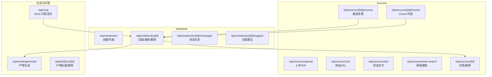
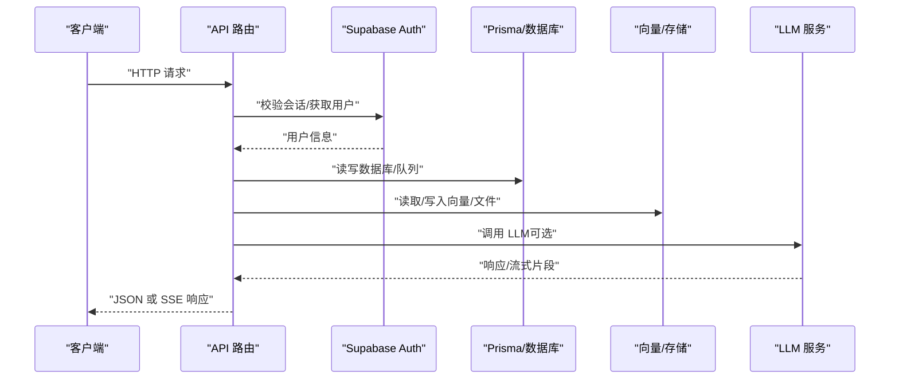
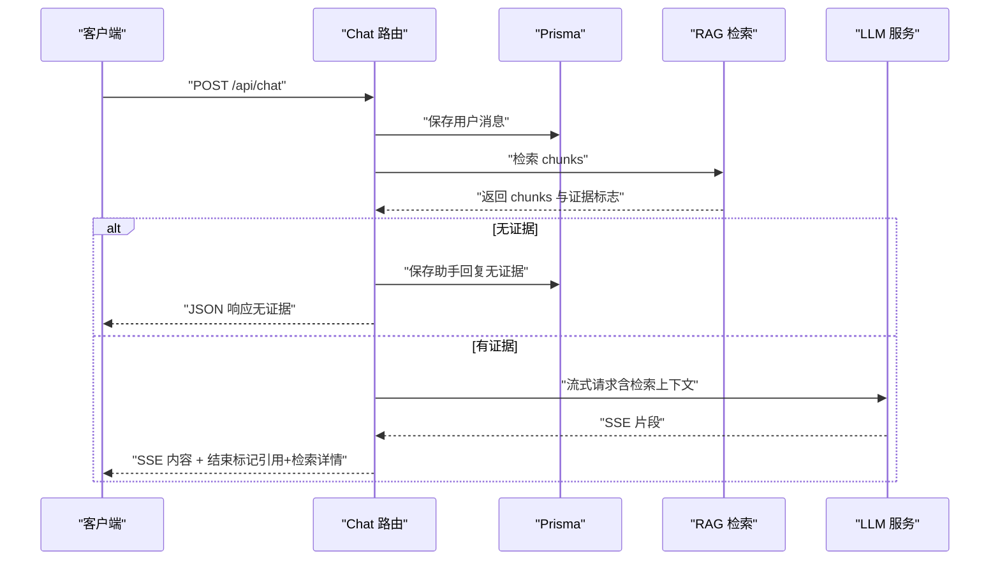
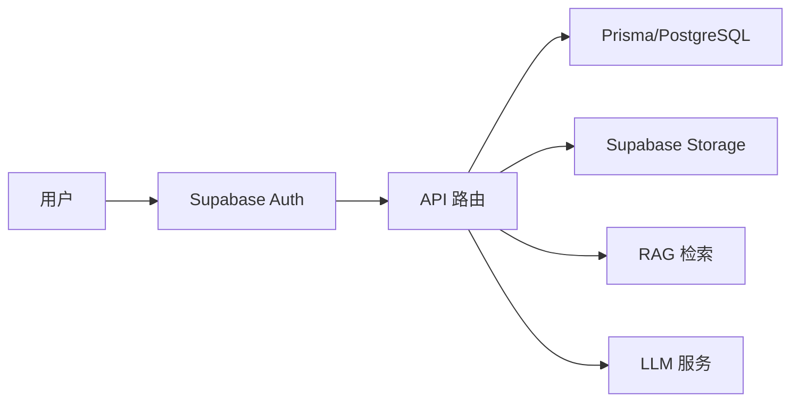

# API 接口文档

<cite>
**本文档引用的文件**
- [app/api/notebooks/route.ts](file://app/api/notebooks/route.ts)
- [app/api/notebooks/[id]/route.ts](file://app/api/notebooks/[id]/route.ts)
- [app/api/notebooks/[id]/messages/route.ts](file://app/api/notebooks/[id]/messages/route.ts)
- [app/api/notebooks/[id]/suggest/route.ts](file://app/api/notebooks/[id]/suggest/route.ts)
- [app/api/sources/upload/route.ts](file://app/api/sources/upload/route.ts)
- [app/api/sources/url/route.ts](file://app/api/sources/url/route.ts)
- [app/api/sources/text/route.ts](file://app/api/sources/text/route.ts)
- [app/api/sources/web-search/route.ts](file://app/api/sources/web-search/route.ts)
- [app/api/sources/[id]/route.ts](file://app/api/sources/[id]/route.ts)
- [app/api/sources/[id]/process/route.ts](file://app/api/sources/[id]/process/route.ts)
- [app/api/sources/[id]/chunks/route.ts](file://app/api/sources/[id]/chunks/route.ts)
- [app/api/artifacts/[id]/route.ts](file://app/api/artifacts/[id]/route.ts)
- [app/api/studio/generate/route.ts](file://app/api/studio/generate/route.ts)
- [app/api/chat/route.ts](file://app/api/chat/route.ts)
</cite>

## 目录
1. [简介](#简介)
2. [项目结构](#项目结构)
3. [核心组件](#核心组件)
4. [架构总览](#架构总览)
5. [详细组件分析](#详细组件分析)
6. [依赖关系分析](#依赖关系分析)
7. [性能与并发特性](#性能与并发特性)
8. [故障排查指南](#故障排查指南)
9. [结论](#结论)
10. [附录](#附录)

## 简介
本文件为 notebookLM-clone 项目的 API 接口文档，覆盖以下能力域：
- Notebook 管理：创建、读取、更新、删除
- Sources 导入：文件上传（PDF）、URL 导入、文字导入、网页搜索、处理状态查询与重试
- RAG 问答：流式响应、上下文检索、引用返回
- 内容生成：Studio 产物生成（摘要、大纲、测验、思维导图）
- 认证与授权：Supabase Auth 集成、会话校验、资源所有权验证
- 错误处理：统一错误码与消息格式、异常分支处理
- 版本与兼容：当前以 Next.js App Router 路由文件形式组织，遵循 REST 设计

## 项目结构
API 路由采用 Next.js App Router 的文件系统路由约定，按功能模块划分：
- /api/notebooks：Notebook 生命周期管理
- /api/sources：Sources 导入与处理
- /api/artifacts：产物管理（标题更新、删除）
- /api/studio/generate：内容生成入口
- /api/chat：RAG 问答流式接口
- /api/templates：模板相关（当前未在本仓库中）

图表来源
- [app/api/notebooks/route.ts](file://app/api/notebooks/route.ts#L1-L67)
- [app/api/notebooks/[id]/route.ts](file://app/api/notebooks/[id]/route.ts#L1-L138)
- [app/api/notebooks/[id]/messages/route.ts](file://app/api/notebooks/[id]/messages/route.ts#L1-L71)
- [app/api/notebooks/[id]/suggest/route.ts](file://app/api/notebooks/[id]/suggest/route.ts#L1-L103)
- [app/api/sources/upload/route.ts](file://app/api/sources/upload/route.ts#L1-L111)
- [app/api/sources/url/route.ts](file://app/api/sources/url/route.ts#L1-L167)
- [app/api/sources/text/route.ts](file://app/api/sources/text/route.ts#L1-L122)
- [app/api/sources/web-search/route.ts](file://app/api/sources/web-search/route.ts#L1-L74)
- [app/api/sources/[id]/route.ts](file://app/api/sources/[id]/route.ts#L1-L120)
- [app/api/sources/[id]/process/route.ts](file://app/api/sources/[id]/process/route.ts#L1-L140)
- [app/api/sources/[id]/chunks/route.ts](file://app/api/sources/[id]/chunks/route.ts#L1-L139)
- [app/api/studio/generate/route.ts](file://app/api/studio/generate/route.ts#L1-L145)
- [app/api/chat/route.ts](file://app/api/chat/route.ts#L1-L324)
- [app/api/artifacts/[id]/route.ts](file://app/api/artifacts/[id]/route.ts#L1-L141)

章节来源
- [app/api/notebooks/route.ts](file://app/api/notebooks/route.ts#L1-L67)
- [app/api/notebooks/[id]/route.ts](file://app/api/notebooks/[id]/route.ts#L1-L138)
- [app/api/sources/upload/route.ts](file://app/api/sources/upload/route.ts#L1-L111)
- [app/api/sources/url/route.ts](file://app/api/sources/url/route.ts#L1-L167)
- [app/api/sources/text/route.ts](file://app/api/sources/text/route.ts#L1-L122)
- [app/api/sources/web-search/route.ts](file://app/api/sources/web-search/route.ts#L1-L74)
- [app/api/sources/[id]/route.ts](file://app/api/sources/[id]/route.ts#L1-L120)
- [app/api/sources/[id]/process/route.ts](file://app/api/sources/[id]/process/route.ts#L1-L140)
- [app/api/sources/[id]/chunks/route.ts](file://app/api/sources/[id]/chunks/route.ts#L1-L139)
- [app/api/studio/generate/route.ts](file://app/api/studio/generate/route.ts#L1-L145)
- [app/api/chat/route.ts](file://app/api/chat/route.ts#L1-L324)
- [app/api/artifacts/[id]/route.ts](file://app/api/artifacts/[id]/route.ts#L1-L141)

## 核心组件
- Notebook 管理：提供创建、列表、详情、更新、删除等接口；支持按拥有者过滤与计数统计。
- Sources 导入：支持 PDF 文件上传、URL 添加、文字内容添加；提供处理状态查询、重试与取消；支持分页查看 Chunk。
- RAG 问答：基于检索增强的流式问答，支持混合检索、去重、引用构建与检索详情回传。
- 内容生成：Studio 产物生成，支持多种类型（摘要、大纲、测验、思维导图）与模式选择。
- 认证授权：统一通过 Supabase Auth 校验用户身份，并在关键资源上进行所有权验证。

章节来源
- [app/api/notebooks/route.ts](file://app/api/notebooks/route.ts#L11-L66)
- [app/api/notebooks/[id]/route.ts](file://app/api/notebooks/[id]/route.ts#L16-L137)
- [app/api/sources/upload/route.ts](file://app/api/sources/upload/route.ts#L14-L110)
- [app/api/sources/url/route.ts](file://app/api/sources/url/route.ts#L68-L166)
- [app/api/sources/text/route.ts](file://app/api/sources/text/route.ts#L19-L121)
- [app/api/sources/[id]/process/route.ts](file://app/api/sources/[id]/process/route.ts#L78-L138)
- [app/api/sources/[id]/chunks/route.ts](file://app/api/sources/[id]/chunks/route.ts#L16-L138)
- [app/api/chat/route.ts](file://app/api/chat/route.ts#L25-L323)
- [app/api/studio/generate/route.ts](file://app/api/studio/generate/route.ts#L12-L144)
- [app/api/artifacts/[id]/route.ts](file://app/api/artifacts/[id]/route.ts#L11-L140)

## 架构总览
整体数据流从客户端发起请求，经过认证与权限校验，调用相应业务逻辑（如检索、生成、存储），最终返回标准响应或流式响应。

图表来源
- [app/api/chat/route.ts](file://app/api/chat/route.ts#L25-L323)
- [app/api/sources/[id]/process/route.ts](file://app/api/sources/[id]/process/route.ts#L78-L138)
- [app/api/studio/generate/route.ts](file://app/api/studio/generate/route.ts#L12-L144)

## 详细组件分析

### Notebook 管理 API
- 创建 Notebook
  - 方法与路径：POST /api/notebooks
  - 请求体字段：title（必填）
  - 成功响应：201，返回新建 Notebook 对象
  - 错误：400（缺少标题）、401（未登录）、500（内部错误）
- 获取 Notebook 列表
  - 方法与路径：GET /api/notebooks
  - 成功响应：返回按最后打开时间倒序的列表，包含 sources 与 messages 数量
  - 错误：401（未登录）、500（内部错误）
- Notebook 详情
  - 方法与路径：GET /api/notebooks/:id
  - 成功响应：返回 Notebook 及关联的 sources、messages（最近若干条）、artifacts
  - 权限：需为拥有者
  - 其他：同时更新 lastOpenedAt
- 更新 Notebook
  - 方法与路径：PATCH /api/notebooks/:id
  - 请求体字段：title
  - 权限：需为拥有者
  - 成功：返回更新后的对象
- 删除 Notebook
  - 方法与路径：DELETE /api/notebooks/:id
  - 权限：需为拥有者
  - 成功：204（无内容）

章节来源
- [app/api/notebooks/route.ts](file://app/api/notebooks/route.ts#L11-L66)
- [app/api/notebooks/[id]/route.ts](file://app/api/notebooks/[id]/route.ts#L16-L137)

### Sources 导入 API
- 文件上传（PDF）
  - 方法与路径：POST /api/sources/upload
  - 请求：multipart/form-data，字段：file（必填，PDF）、notebookId（必填）
  - 校验：文件类型、大小限制、Notebook 所有权
  - 成功：201，返回 Source 对象，并入队处理
  - 错误：400（参数/格式/大小/重复）、401（未登录）、403（无权）、500（上传/入库失败）
- URL 导入
  - 方法与路径：POST /api/sources/url
  - 请求体：notebookId（UUID）、url（http/https）
  - 校验：URL 格式、是否已存在、Notebook 所有权
  - 类型检测：自动识别 video/pdf/url，视频直接 ready，其他 pending
  - 成功：201，返回 Source 对象及可选 warning
  - 错误：400（参数/已存在）、401（未登录）、403（无权）、500（入库失败）
- 文字导入
  - 方法与路径：POST /api/sources/text
  - 请求体：notebookId、title、content（带长度约束）
  - 校验：内容哈希去重、Notebook 所有权
  - 成功：201，返回 Source 对象并入队处理
  - 错误：400（参数/重复）、401（未登录）、403（无权）、500（入库失败）
- 网页搜索
  - 方法与路径：POST /api/sources/web-search
  - 请求体：query（必填）
  - 成功：返回搜索结果数组（标题、链接、内容、媒体、发布日期）
  - 错误：400（缺少参数）、401（未登录）、5xx（上游错误）
- Source 详情与删除
  - 方法与路径：GET /api/sources/:id、DELETE /api/sources/:id
  - GET：返回 Source 详情，若为文件类型返回 1 小时有效期的签名下载地址
  - DELETE：删除文件、清理 chunks、处理队列与 Source 记录
  - 权限：需为拥有者
- 触发处理
  - 方法与路径：POST /api/sources/:id/process
  - 行为：将 Source 状态置为 pending 并入队处理；失败自动重试（最多 3 次）
  - 成功：返回处理启动信息
- Chunk 列表
  - 方法与路径：GET /api/sources/:id/chunks
  - 查询参数：chunkIndex（可选，返回目标 chunk 及前后各 1 个）、limit、offset
  - 成功：返回分页的 chunks 与总数、是否还有更多
  - 权限：需为拥有者

章节来源
- [app/api/sources/upload/route.ts](file://app/api/sources/upload/route.ts#L14-L110)
- [app/api/sources/url/route.ts](file://app/api/sources/url/route.ts#L68-L166)
- [app/api/sources/text/route.ts](file://app/api/sources/text/route.ts#L19-L121)
- [app/api/sources/web-search/route.ts](file://app/api/sources/web-search/route.ts#L5-L73)
- [app/api/sources/[id]/route.ts](file://app/api/sources/[id]/route.ts#L16-L119)
- [app/api/sources/[id]/process/route.ts](file://app/api/sources/[id]/process/route.ts#L78-L138)
- [app/api/sources/[id]/chunks/route.ts](file://app/api/sources/[id]/chunks/route.ts#L16-L138)

### RAG 问答 API
- 方法与路径：POST /api/chat
- 请求体字段：
  - messages：数组，最后一个元素为用户问题
  - notebookId：必填
  - selectedSourceIds：可选，限定检索范围
  - mode：可选，默认 fast，决定模型配置
- 权限与校验：需为 Notebook 拥有者
- 处理流程：
  1) 并行保存用户消息与检索相关内容（支持混合检索）
  2) 去重并构建引用
  3) 组装提示词并调用 LLM（流式）
  4) 流式输出内容，结束时附加引用与检索详情
- 响应：
  - 正常：text/event-stream，逐块返回内容；结束时发送特殊标记携带 citations 与 retrievalDetails
  - 无证据：直接返回固定回复与空引用
  - 错误：500，返回 JSON 错误信息

图表来源
- [app/api/chat/route.ts](file://app/api/chat/route.ts#L25-L323)

章节来源
- [app/api/chat/route.ts](file://app/api/chat/route.ts#L25-L323)

### 内容生成 API
- 方法与路径：POST /api/studio/generate
- 请求体字段：
  - notebookId：必填
  - type：必填，允许值：summary、outline、quiz、mindmap
  - mode：可选，默认 fast
  - sourceIds：可选，限定生成范围
- 限制：单 Notebook 最多 10 个产物
- 成功：返回生成的 artifact 与统计信息
- 错误：400（参数/无资料/上限）、404（Notebook 不存在或无权）、504/500（超时/失败）

章节来源
- [app/api/studio/generate/route.ts](file://app/api/studio/generate/route.ts#L12-L144)

### 产物管理 API
- 更新产物标题
  - 方法与路径：PATCH /api/artifacts/:id
  - 请求体：title（字符串）
  - 权限：产物所属 Notebook 的拥有者
  - 成功：返回更新后的 id 与 title
- 删除产物
  - 方法与路径：DELETE /api/artifacts/:id
  - 权限：产物所属 Notebook 的拥有者
  - 成功：200，返回 success: true

章节来源
- [app/api/artifacts/[id]/route.ts](file://app/api/artifacts/[id]/route.ts#L11-L140)

### 认证与授权机制
- Supabase Auth 集成
  - 用户会话校验：通过 Supabase Server 客户端获取当前用户
  - Notebook/Sources/Artifacts 等资源均进行所有权验证
- 会话管理
  - Next.js App Router 中通过 Supabase 服务端客户端维护会话
- 权限控制
  - 401：未登录
  - 403：无权访问资源
  - 404：资源不存在

章节来源
- [app/api/notebooks/[id]/route.ts](file://app/api/notebooks/[id]/route.ts#L45-L59)
- [app/api/sources/[id]/route.ts](file://app/api/sources/[id]/route.ts#L39-L42)
- [app/api/artifacts/[id]/route.ts](file://app/api/artifacts/[id]/route.ts#L54-L60)

### 错误处理规范
- 统一错误响应结构：{ error: string, code?: string }（部分接口）
- 常见状态码：
  - 400：参数校验失败、重复、超出限制
  - 401：未登录
  - 403：无权访问
  - 404：资源不存在
  - 500：服务器内部错误
  - 504：网关超时（生成超时场景）
- 异常分支：
  - JSON 解析失败保护
  - 流式响应异常捕获与日志
  - 处理队列失败自动重试与状态更新

章节来源
- [app/api/notebooks/route.ts](file://app/api/notebooks/route.ts#L24-L40)
- [app/api/studio/generate/route.ts](file://app/api/studio/generate/route.ts#L113-L143)
- [app/api/chat/route.ts](file://app/api/chat/route.ts#L316-L322)

### API 使用示例与最佳实践
- Notebook 列表获取
  - 使用 GET /api/notebooks，按最后打开时间排序，便于前端快速定位
- 创建 Notebook
  - POST /api/notebooks，携带 title，接收 201 与新建对象
- Sources 导入
  - PDF：multipart/form-data，file 与 notebookId
  - URL：JSON，notebookId 与 url
  - 文字：JSON，notebookId、title、content
  - 导入后立即入队处理，可通过 /api/sources/:id/process 触发或等待后台任务
- RAG 问答
  - POST /api/chat，messages 为对话历史，notebookId 必填
  - 流式消费，结束时解析特殊标记获取 citations 与检索详情
- 产物生成
  - POST /api/studio/generate，指定 type 与可选 mode/sourceIds
  - 生成完成后可在 Notebook 详情中查看产物列表
- 最佳实践
  - 前端对 401/403 做跳转登录或提示
  - 流式接口使用 EventSource 或 fetch + ReadableStream
  - 分页加载 Sources/Chunks 时使用 limit/offset 或基于时间游标

[本节为通用指导，不直接分析具体文件，故无“章节来源”]

## 依赖关系分析
- 认证层：Supabase Auth（Server 客户端）
- 数据层：Prisma ORM + PostgreSQL；向量存储与文件存储（Supabase Storage）
- 检索层：RAG 检索与去重、引用构建
- 生成层：LLM 服务（智谱等），支持流式与工具调用（网页搜索）

图表来源
- [app/api/chat/route.ts](file://app/api/chat/route.ts#L8-L20)
- [app/api/sources/upload/route.ts](file://app/api/sources/upload/route.ts#L16-L76)
- [app/api/sources/url/route.ts](file://app/api/sources/url/route.ts#L70-L148)
- [app/api/sources/text/route.ts](file://app/api/sources/text/route.ts#L22-L103)

## 性能与并发特性
- 并行化优化：多处使用 Promise.all 并行获取用户、解析请求体、校验与计算
- 流式响应：RAG 问答使用 TransformStream 与 SSE，降低首字延迟
- 处理队列：Sources 处理异步执行，避免冷启动与超时
- 限制与保护：文件大小限制、内容去重、产物数量上限、超时控制

[本节为通用指导，不直接分析具体文件，故无“章节来源”]

## 故障排查指南
- 401 未登录
  - 检查 Supabase 会话是否正确传递
- 403 无权访问
  - 确认资源归属与所有权验证逻辑
- 400 参数错误
  - 校验请求体字段与格式（UUID、URL、长度、类型）
- 上传/入库失败
  - 检查文件类型/大小、存储桶权限、数据库约束
- 流式响应中断
  - 检查上游 LLM 响应与网络状况，确认 SSE 端点可达
- 生成超时
  - 检查外部服务可用性与超时阈值，必要时调整

章节来源
- [app/api/sources/upload/route.ts](file://app/api/sources/upload/route.ts#L49-L57)
- [app/api/sources/url/route.ts](file://app/api/sources/url/route.ts#L82-L89)
- [app/api/studio/generate/route.ts](file://app/api/studio/generate/route.ts#L118-L130)
- [app/api/chat/route.ts](file://app/api/chat/route.ts#L202-L206)

## 结论
本项目以 Next.js App Router 为基础，围绕 Notebook、Sources、RAG 问答与内容生成构建了完整的 API 能力。通过 Supabase Auth 实现统一认证与授权，结合 Prisma 与向量/存储实现高效的数据与检索能力。接口设计遵循 REST 规范，提供流式响应与处理队列，满足生产环境的可用性与可扩展性需求。

[本节为总结性内容，不直接分析具体文件，故无“章节来源”]

## 附录
- API 版本管理与兼容
  - 当前以文件系统路由组织，未显式版本前缀；建议后续引入 /api/v1 前缀并保持向后兼容
- 废弃策略
  - 新增接口优先采用现有模式；对不再使用的路由保留一段时间并标注废弃，逐步迁移

[本节为通用指导，不直接分析具体文件，故无“章节来源”]