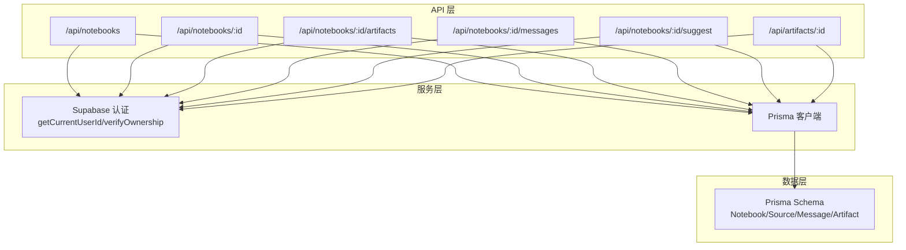
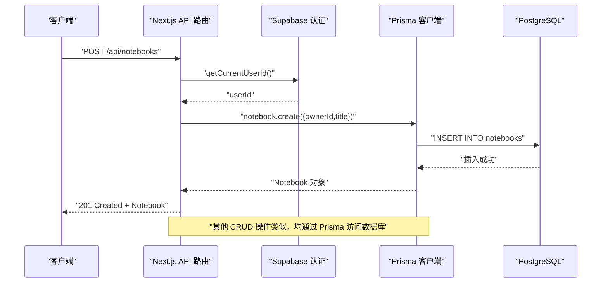
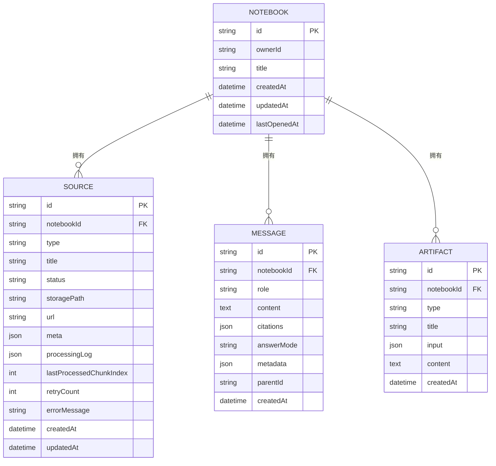
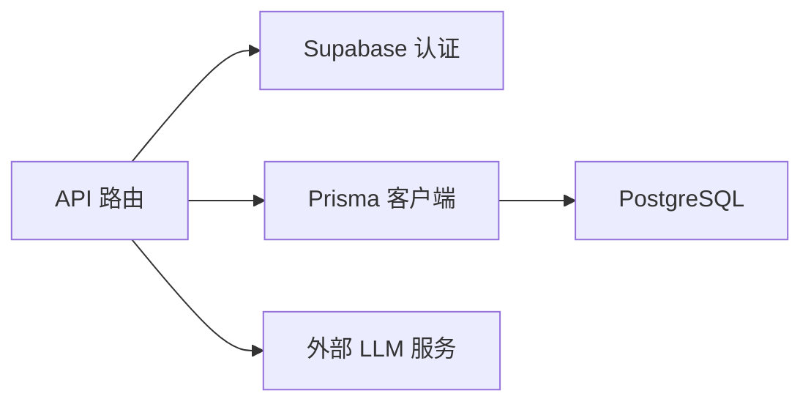

# Notebook 管理 API

<cite>
**本文档引用的文件**
- [app/api/notebooks/route.ts](file://app/api/notebooks/route.ts)
- [app/api/notebooks/[id]/route.ts](file://app/api/notebooks/[id]/route.ts)
- [app/api/notebooks/[id]/artifacts/route.ts](file://app/api/notebooks/[id]/artifacts/route.ts)
- [app/api/notebooks/[id]/messages/route.ts](file://app/api/notebooks/[id]/messages/route.ts)
- [app/api/artifacts/[id]/route.ts](file://app/api/artifacts/[id]/route.ts)
- [app/api/notebooks/[id]/suggest/route.ts](file://app/api/notebooks/[id]/suggest/route.ts)
- [lib/db/supabase.ts](file://lib/db/supabase.ts)
- [lib/db/prisma.ts](file://lib/db/prisma.ts)
- [prisma/schema.prisma](file://prisma/schema.prisma)
- [lib/config.ts](file://lib/config.ts)
- [types/index.ts](file://types/index.ts)
- [middleware.ts](file://middleware.ts)
</cite>

## 目录
1. [简介](#简介)
2. [项目结构](#项目结构)
3. [核心组件](#核心组件)
4. [架构总览](#架构总览)
5. [详细组件分析](#详细组件分析)
6. [依赖关系分析](#依赖关系分析)
7. [性能考虑](#性能考虑)
8. [故障排除指南](#故障排除指南)
9. [结论](#结论)
10. [附录](#附录)

## 简介
本文件为 Notebook 管理 API 的完整接口文档，覆盖以下能力：
- 创建 Notebook：POST /api/notebooks
- 获取 Notebook 列表：GET /api/notebooks
- 获取指定 Notebook 详情：GET /api/notebooks/:id
- 更新指定 Notebook：PATCH /api/notebooks/:id
- 删除指定 Notebook：DELETE /api/notebooks/:id
- Notebook 子资源：
  - 产物列表：GET /api/notebooks/:id/artifacts
  - 消息历史：GET /api/notebooks/:id/messages
  - 问题建议：POST /api/notebooks/:id/suggest
  - 产物管理（独立接口）：PATCH/DELETE /api/artifacts/:id

文档包含认证要求、权限验证、请求参数、响应结构、状态码定义以及客户端集成指南。

## 项目结构
该 API 采用 Next.js App Router 的文件系统路由约定，按功能模块组织：
- 根级 Notebook 资源：/app/api/notebooks/route.ts
- 指定 Notebook 资源：/app/api/notebooks/[id]/route.ts
- 子资源：
  - artifacts：/app/api/notebooks/[id]/artifacts/route.ts
  - messages：/app/api/notebooks/[id]/messages/route.ts
  - suggest：/app/api/notebooks/[id]/suggest/route.ts
- 产物独立管理：/app/api/artifacts/[id]/route.ts
- 数据层：
  - Supabase 认证与权限：/lib/db/supabase.ts
  - Prisma 客户端：/lib/db/prisma.ts
  - 数据模型定义：/prisma/schema.prisma
- 配置与类型：
  - 应用配置：/lib/config.ts
  - 类型定义：/types/index.ts
  - 路由保护中间件：/middleware.ts

图表来源
- [app/api/notebooks/route.ts](file://app/api/notebooks/route.ts#L1-L66)
- [app/api/notebooks/[id]/route.ts](file://app/api/notebooks/[id]/route.ts#L1-L138)
- [app/api/notebooks/[id]/artifacts/route.ts](file://app/api/notebooks/[id]/artifacts/route.ts#L1-L77)
- [app/api/notebooks/[id]/messages/route.ts](file://app/api/notebooks/[id]/messages/route.ts#L1-L71)
- [app/api/notebooks/[id]/suggest/route.ts](file://app/api/notebooks/[id]/suggest/route.ts#L1-L103)
- [app/api/artifacts/[id]/route.ts](file://app/api/artifacts/[id]/route.ts#L1-L141)
- [lib/db/supabase.ts](file://lib/db/supabase.ts#L1-L39)
- [lib/db/prisma.ts](file://lib/db/prisma.ts#L1-L41)
- [prisma/schema.prisma](file://prisma/schema.prisma#L16-L97)

章节来源
- [app/api/notebooks/route.ts](file://app/api/notebooks/route.ts#L1-L66)
- [app/api/notebooks/[id]/route.ts](file://app/api/notebooks/[id]/route.ts#L1-L138)
- [lib/db/supabase.ts](file://lib/db/supabase.ts#L1-L39)
- [lib/db/prisma.ts](file://lib/db/prisma.ts#L1-L41)
- [prisma/schema.prisma](file://prisma/schema.prisma#L16-L97)

## 核心组件
- 认证与权限
  - 通过 Supabase 服务端客户端获取当前用户 ID，并在关键操作中进行所有权校验。
  - 所有涉及 Notebook 和 Artifact 的写操作均要求已登录且为资源所有者。
- 数据访问
  - 使用 Prisma 客户端访问 PostgreSQL 数据库，遵循 Prisma Schema 定义的数据模型。
- 子资源
  - artifacts：按创建时间倒序列出产物，支持独立的标题更新与删除。
  - messages：支持分页查询，支持基于 before 时间戳的游标分页。
  - suggest：基于 Notebook 内部的文档片段生成问题建议，调用外部 LLM。

章节来源
- [lib/db/supabase.ts](file://lib/db/supabase.ts#L12-L33)
- [lib/db/prisma.ts](file://lib/db/prisma.ts#L1-L41)
- [prisma/schema.prisma](file://prisma/schema.prisma#L16-L97)

## 架构总览
下图展示 Notebook API 的典型调用流程，从客户端到服务端再到数据库的交互。

图表来源
- [app/api/notebooks/route.ts](file://app/api/notebooks/route.ts#L12-L41)
- [lib/db/supabase.ts](file://lib/db/supabase.ts#L12-L16)
- [lib/db/prisma.ts](file://lib/db/prisma.ts#L29-L34)

## 详细组件分析

### Notebook 列表与创建接口
- POST /api/notebooks
  - 认证：需要已登录用户
  - 请求体：包含 title 字段
  - 成功：返回新建的 Notebook 对象，状态码 201
  - 失败：400（缺少标题）、401（未登录）、500（内部错误）
- GET /api/notebooks
  - 认证：需要已登录用户
  - 返回：当前用户拥有的 Notebook 列表，按 lastOpenedAt 倒序排列，并包含 sources 和 messages 的数量统计
  - 失败：401（未登录）、500（内部错误）

请求参数与响应结构
- 请求体（创建）：CreateNotebookRequest
  - title: string（必填）
- 响应（创建/列表）：Notebook[]
  - id: string
  - ownerId: string
  - title: string
  - createdAt: string
  - updatedAt: string
  - lastOpenedAt: string
  - _count: { sources: number, messages: number }

状态码
- 201：创建成功
- 200：获取列表成功
- 400：请求参数错误（如标题为空）
- 401：未登录
- 500：服务器错误

章节来源
- [app/api/notebooks/route.ts](file://app/api/notebooks/route.ts#L12-L66)
- [types/index.ts](file://types/index.ts#L135-L141)
- [prisma/schema.prisma](file://prisma/schema.prisma#L16-L31)

### 指定 Notebook 的 CRUD 接口
- GET /api/notebooks/:id
  - 认证：需要已登录用户
  - 权限：必须为 Notebook 所有者
  - 行为：返回 Notebook 详情，包含 sources、messages（最近 50 条）、artifacts；同时更新 lastOpenedAt
  - 失败：404（Notebook 不存在）、403（无权访问）、401（未登录）、500（内部错误）
- PATCH /api/notebooks/:id
  - 认证：需要已登录用户
  - 权限：必须为 Notebook 所有者
  - 请求体：UpdateNotebookRequest（title 可选）
  - 成功：返回更新后的 Notebook
  - 失败：404（Notebook 不存在）、403（无权访问）、401（未登录）、500（内部错误）
- DELETE /api/notebooks/:id
  - 认证：需要已登录用户
  - 权限：必须为 Notebook 所有者
  - 行为：级联删除（Prisma schema 已配置 onDelete: Cascade）
  - 成功：204 No Content
  - 失败：404（Notebook 不存在）、403（无权访问）、401（未登录）、500（内部错误）

请求参数与响应结构
- 路径参数：id: string（Notebook ID）
- 请求体（更新）：UpdateNotebookRequest
  - title?: string

状态码
- 200：更新成功
- 204：删除成功
- 404：资源不存在
- 403：无权访问
- 401：未登录
- 500：服务器错误

章节来源
- [app/api/notebooks/[id]/route.ts](file://app/api/notebooks/[id]/route.ts#L17-L137)
- [types/index.ts](file://types/index.ts#L139-L141)
- [lib/db/supabase.ts](file://lib/db/supabase.ts#L22-L33)

### Notebook 子资源：产物列表
- GET /api/notebooks/:id/artifacts
  - 认证：需要已登录用户
  - 权限：必须为 Notebook 所有者
  - 行为：按创建时间倒序返回产物列表，仅返回必要字段（id、type、title、content、input、createdAt）
  - 成功：返回 { artifacts: ArtifactListItem[] }
  - 失败：404（Notebook 不存在或无权访问）、401（未授权）、500（服务器错误）

请求参数与响应结构
- 路径参数：id: string（Notebook ID）
- 响应：{
  artifacts: [
    {
      id: string,
      type: string,
      title: string,
      content: string,
      input: any,
      createdAt: string
    }
  ]
}

状态码
- 200：成功
- 404：Notebook 不存在或无权访问
- 401：未授权
- 500：服务器错误

章节来源
- [app/api/notebooks/[id]/artifacts/route.ts](file://app/api/notebooks/[id]/artifacts/route.ts#L13-L76)

### Notebook 子资源：消息历史
- GET /api/notebooks/:id/messages
  - 认证：需要已登录用户
  - 权限：必须为 Notebook 所有者
  - 查询参数：
    - limit: number（默认 50），限制返回条数
    - before: string（ISO 时间戳），用于游标分页，返回早于该时间的消息
  - 行为：按创建时间倒序查询消息，多取一条用于判断是否存在更多；最终按时间正序返回
  - 成功：返回 { messages: Message[], hasMore: boolean, nextCursor?: string }
  - 失败：404（Notebook 不存在）、403（无权访问）、401（未登录）、500（内部错误）

请求参数与响应结构
- 路径参数：id: string（Notebook ID）
- 查询参数：
  - limit: number
  - before: string（ISO 时间戳）
- 响应：{
  messages: Message[],
  hasMore: boolean,
  nextCursor?: string
}

状态码
- 200：成功
- 404：Notebook 不存在
- 403：无权访问
- 401：未登录
- 500：服务器错误

章节来源
- [app/api/notebooks/[id]/messages/route.ts](file://app/api/notebooks/[id]/messages/route.ts#L10-L70)

### Notebook 子资源：问题建议
- POST /api/notebooks/:id/suggest
  - 认证：需要已登录用户
  - 权限：必须为 Notebook 所有者
  - 行为：从 Notebook 的 document_chunks 中取前 5 个片段作为上下文，调用外部 LLM 生成 3-5 个问题
  - 成功：返回 { questions: string[] }
  - 失败：404（Notebook 不存在）、403（无权访问）、401（未登录）、500（服务器错误）

请求参数与响应结构
- 路径参数：id: string（Notebook ID）
- 响应：{
  questions: string[]
}

状态码
- 200：成功
- 404：Notebook 不存在
- 403：无权访问
- 401：未登录
- 500：服务器错误

章节来源
- [app/api/notebooks/[id]/suggest/route.ts](file://app/api/notebooks/[id]/suggest/route.ts#L5-L102)
- [lib/config.ts](file://lib/config.ts#L46-L52)

### 产物独立管理接口
- PATCH /api/artifacts/:id
  - 认证：需要已登录用户
  - 权限：必须为产物所属 Notebook 的所有者
  - 请求体：{ title: string }（字符串类型）
  - 成功：返回 { id: string, title: string }
  - 失败：404（产物不存在）、403（无权编辑）、400（标题类型错误）、401（未授权）、500（服务器错误）
- DELETE /api/artifacts/:id
  - 认证：需要已登录用户
  - 权限：必须为产物所属 Notebook 的所有者
  - 成功：返回 { success: true }
  - 失败：404（产物不存在）、403（无权删除）、401（未授权）、500（服务器错误）

请求参数与响应结构
- 路径参数：id: string（Artifact ID）
- 请求体（更新）：{ title: string }
- 响应（更新）：{ id: string, title: string }
- 响应（删除）：{ success: true }

状态码
- 200：更新成功
- 200：删除成功
- 404：资源不存在
- 403：无权访问
- 400：请求参数类型错误
- 401：未授权
- 500：服务器错误

章节来源
- [app/api/artifacts/[id]/route.ts](file://app/api/artifacts/[id]/route.ts#L11-L140)

### 数据模型与关系
Notebook 与其子资源的关系如下：

图表来源
- [prisma/schema.prisma](file://prisma/schema.prisma#L16-L97)

章节来源
- [prisma/schema.prisma](file://prisma/schema.prisma#L16-L97)

## 依赖关系分析
- 认证与权限
  - 所有 API 在执行业务逻辑前都会调用 getCurrentUserId 获取当前用户 ID，并在需要时调用 verifyOwnership 进行所有权校验。
- 数据访问
  - 所有数据库操作通过 Prisma 客户端完成，Prisma 使用 @prisma/adapter-pg 连接 Supabase 的 PostgreSQL。
- 外部服务
  - suggest 接口会调用外部 LLM 服务（智谱 AI），需要正确的 API Key 和基础 URL。
- 中间件
  - Next.js 中间件对受保护路由进行登录态校验，确保前端页面访问的安全性。

图表来源
- [lib/db/supabase.ts](file://lib/db/supabase.ts#L12-L33)
- [lib/db/prisma.ts](file://lib/db/prisma.ts#L23-L34)
- [app/api/notebooks/[id]/suggest/route.ts](file://app/api/notebooks/[id]/suggest/route.ts#L50-L75)

章节来源
- [lib/db/supabase.ts](file://lib/db/supabase.ts#L12-L33)
- [lib/db/prisma.ts](file://lib/db/prisma.ts#L1-L41)
- [middleware.ts](file://middleware.ts#L15-L71)

## 性能考虑
- 并行解析请求体：在创建 Notebook 的 POST 接口中，使用 Promise.all 并行解析请求体，提升吞吐。
- 分页与游标：消息历史接口支持 limit 和 before 游标，避免一次性返回大量数据。
- 最近消息限制：获取 Notebook 详情时，消息查询限制为最近 50 条，减少响应体积。
- 连接池：Prisma 使用 @prisma/adapter-pg 并结合 Supabase Transaction Pooler，适合 Serverless 环境。

章节来源
- [app/api/notebooks/route.ts](file://app/api/notebooks/route.ts#L19-L22)
- [app/api/notebooks/[id]/messages/route.ts](file://app/api/notebooks/[id]/messages/route.ts#L37-L49)
- [app/api/notebooks/[id]/route.ts](file://app/api/notebooks/[id]/route.ts#L31-L34)
- [lib/db/prisma.ts](file://lib/db/prisma.ts#L8-L16)

## 故障排除指南
- 401 未登录/未授权
  - 确认客户端已携带有效的 Supabase 会话 Cookie。
  - 检查中间件是否正确拦截受保护路由。
- 403 无权访问
  - 确认当前用户与资源所有者一致。
  - 检查 verifyOwnership 是否被调用。
- 404 资源不存在
  - 确认 Notebook/Artifact ID 是否正确。
  - 检查数据库中是否存在对应记录。
- 500 服务器错误
  - 查看服务端日志中的错误堆栈。
  - 检查数据库连接、Prisma 配置与外部 LLM 服务连通性。

章节来源
- [lib/db/supabase.ts](file://lib/db/supabase.ts#L22-L33)
- [middleware.ts](file://middleware.ts#L15-L71)

## 结论
本 API 提供了完整的 Notebook 管理能力，涵盖 CRUD 操作、子资源管理与权限控制。通过 Supabase 认证与 Prisma 数据访问，保证了安全性与可维护性。建议客户端在调用前确保已登录并在每次请求中携带会话信息，以获得最佳体验。

## 附录

### 认证与权限
- 认证方式：基于 Supabase 会话 Cookie 的服务端认证。
- 权限策略：所有写操作与跨用户读取均需 verifyOwnership 校验。
- 中间件保护：受保护路由在未登录时自动重定向至登录页。

章节来源
- [lib/db/supabase.ts](file://lib/db/supabase.ts#L12-L33)
- [middleware.ts](file://middleware.ts#L15-L71)

### 状态码汇总
- 200：成功（部分接口）
- 201：创建成功
- 204：删除成功（无内容）
- 400：请求参数错误
- 401：未登录/未授权
- 403：无权访问
- 404：资源不存在
- 500：服务器错误

章节来源
- [app/api/notebooks/route.ts](file://app/api/notebooks/route.ts#L25-L27)
- [app/api/notebooks/[id]/route.ts](file://app/api/notebooks/[id]/route.ts#L41-L43)
- [app/api/notebooks/[id]/artifacts/route.ts](file://app/api/notebooks/[id]/artifacts/route.ts#L36-L41)
- [app/api/notebooks/[id]/messages/route.ts](file://app/api/notebooks/[id]/messages/route.ts#L28-L34)
- [app/api/notebooks/[id]/suggest/route.ts](file://app/api/notebooks/[id]/suggest/route.ts#L23-L29)
- [app/api/artifacts/[id]/route.ts](file://app/api/artifacts/[id]/route.ts#L47-L52)

### 客户端集成指南
- 登录态保持
  - 使用 Supabase 客户端登录后，确保后续 API 请求携带 Cookie。
- 调用示例（概念性）
  - 创建 Notebook：POST /api/notebooks，Body: { title: "我的笔记本" }
  - 获取列表：GET /api/notebooks
  - 获取详情：GET /api/notebooks/:id
  - 更新标题：PATCH /api/notebooks/:id，Body: { title: "新标题" }
  - 删除笔记本：DELETE /api/notebooks/:id
  - 获取产物列表：GET /api/notebooks/:id/artifacts
  - 获取消息历史：GET /api/notebooks/:id/messages?limit=50&before=2023-01-01T00:00:00Z
  - 生成问题建议：POST /api/notebooks/:id/suggest
  - 更新产物标题：PATCH /api/artifacts/:id，Body: { title: "新标题" }
  - 删除产物：DELETE /api/artifacts/:id

章节来源
- [app/api/notebooks/route.ts](file://app/api/notebooks/route.ts#L12-L66)
- [app/api/notebooks/[id]/route.ts](file://app/api/notebooks/[id]/route.ts#L17-L137)
- [app/api/notebooks/[id]/artifacts/route.ts](file://app/api/notebooks/[id]/artifacts/route.ts#L13-L76)
- [app/api/notebooks/[id]/messages/route.ts](file://app/api/notebooks/[id]/messages/route.ts#L10-L70)
- [app/api/notebooks/[id]/suggest/route.ts](file://app/api/notebooks/[id]/suggest/route.ts#L5-L102)
- [app/api/artifacts/[id]/route.ts](file://app/api/artifacts/[id]/route.ts#L11-L140)