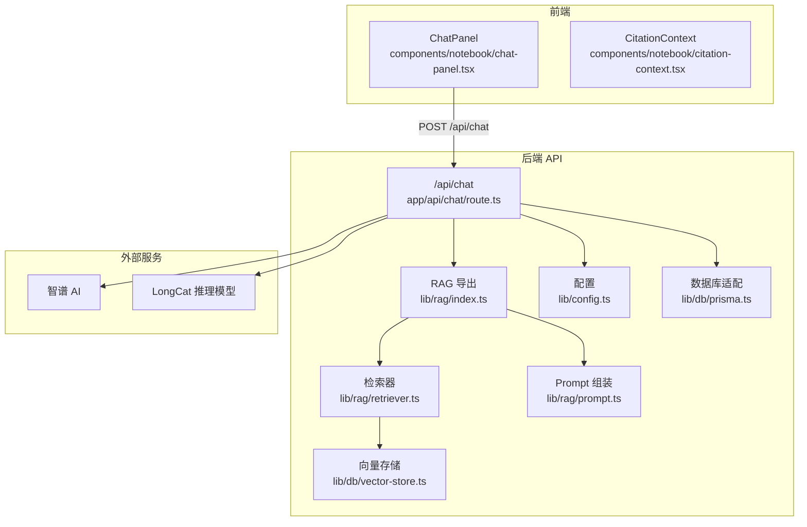
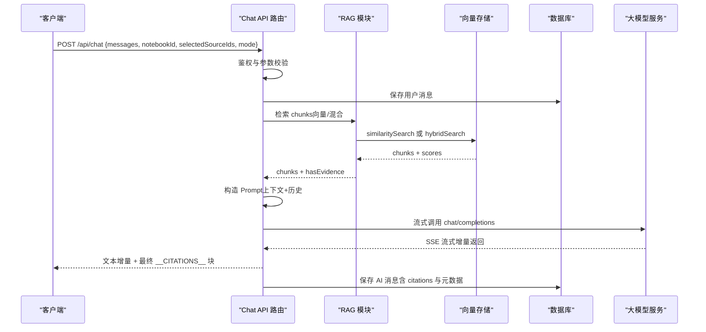
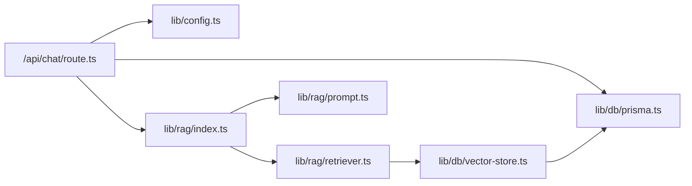

# RAG 问答 API

<cite>
**本文档引用的文件**
- [app/api/chat/route.ts](file://app/api/chat/route.ts)
- [lib/rag/index.ts](file://lib/rag/index.ts)
- [lib/rag/retriever.ts](file://lib/rag/retriever.ts)
- [lib/rag/prompt.ts](file://lib/rag/prompt.ts)
- [lib/db/vector-store.ts](file://lib/db/vector-store.ts)
- [lib/config.ts](file://lib/config.ts)
- [lib/db/prisma.ts](file://lib/db/prisma.ts)
- [types/index.ts](file://types/index.ts)
- [middleware.ts](file://middleware.ts)
- [components/notebook/chat-panel.tsx](file://components/notebook/chat-panel.tsx)
- [components/notebook/citation-context.tsx](file://components/notebook/citation-context.tsx)
- [prisma/migrations/20260120120300_add_composite_indexes/migration.sql](file://prisma/migrations/20260120120300_add_composite_indexes/migration.sql)
</cite>

## 目录
1. [简介](#简介)
2. [项目结构](#项目结构)
3. [核心组件](#核心组件)
4. [架构总览](#架构总览)
5. [详细组件分析](#详细组件分析)
6. [依赖关系分析](#依赖关系分析)
7. [性能考量](#性能考量)
8. [故障排查指南](#故障排查指南)
9. [结论](#结论)
10. [附录](#附录)

## 简介
本文件为基于检索增强生成（RAG）的问答 API 文档，聚焦于 POST /api/chat 接口的设计与使用。该接口支持：
- 流式返回 AI 回答，结束时附加引用来源（citations）
- 检索参数控制（topK、阈值、是否混合检索等）
- 上下文管理与引用溯源格式规范
- 认证与权限控制（基于 Supabase 的会话）
- 错误处理策略（网络异常、模型调用失败、检索超时等）
- 客户端集成示例与性能优化建议

## 项目结构
后端采用 Next.js App Router，API 路由位于 app/api 下；RAG 核心逻辑位于 lib/rag；向量检索与持久化位于 lib/db；前端聊天面板位于 components/notebook。

**图表来源**
- [app/api/chat/route.ts](file://app/api/chat/route.ts#L25-L323)
- [lib/rag/index.ts](file://lib/rag/index.ts#L1-L24)
- [lib/rag/retriever.ts](file://lib/rag/retriever.ts#L1-L206)
- [lib/rag/prompt.ts](file://lib/rag/prompt.ts#L1-L149)
- [lib/db/vector-store.ts](file://lib/db/vector-store.ts#L1-L446)
- [lib/config.ts](file://lib/config.ts#L1-L187)
- [lib/db/prisma.ts](file://lib/db/prisma.ts#L1-L41)

**章节来源**
- [app/api/chat/route.ts](file://app/api/chat/route.ts#L1-L324)
- [lib/rag/index.ts](file://lib/rag/index.ts#L1-L24)
- [lib/rag/retriever.ts](file://lib/rag/retriever.ts#L1-L206)
- [lib/rag/prompt.ts](file://lib/rag/prompt.ts#L1-L149)
- [lib/db/vector-store.ts](file://lib/db/vector-store.ts#L1-L446)
- [lib/config.ts](file://lib/config.ts#L1-L187)
- [lib/db/prisma.ts](file://lib/db/prisma.ts#L1-L41)

## 核心组件
- API 路由：负责鉴权、参数校验、检索、构造 Prompt、调用大模型、流式输出与保存消息
- RAG 模块：检索、去重、Prompt 组装、引用生成
- 向量存储：向量相似检索与混合检索（向量+全文）
- 配置：模型提供商、模型列表、环境变量校验
- 数据库：Prisma 客户端与连接池（Serverless 优化）

**章节来源**
- [app/api/chat/route.ts](file://app/api/chat/route.ts#L25-L323)
- [lib/rag/retriever.ts](file://lib/rag/retriever.ts#L53-L206)
- [lib/rag/prompt.ts](file://lib/rag/prompt.ts#L37-L148)
- [lib/db/vector-store.ts](file://lib/db/vector-store.ts#L77-L446)
- [lib/config.ts](file://lib/config.ts#L31-L187)
- [lib/db/prisma.ts](file://lib/db/prisma.ts#L18-L41)

## 架构总览
POST /api/chat 的端到端流程如下：

**图表来源**
- [app/api/chat/route.ts](file://app/api/chat/route.ts#L25-L323)
- [lib/rag/retriever.ts](file://lib/rag/retriever.ts#L53-L206)
- [lib/db/vector-store.ts](file://lib/db/vector-store.ts#L175-L442)
- [lib/db/prisma.ts](file://lib/db/prisma.ts#L18-L41)

## 详细组件分析

### 接口定义与请求参数
- 方法：POST
- 路径：/api/chat
- 内容类型：application/json
- 请求体字段
  - messages: 数组，每个元素包含 role（user/assistant）与 content
  - notebookId: 字符串，目标笔记本 ID
  - selectedSourceIds: 可选数组，限定检索来源
  - mode: 字符串，模型模式标识（如 fast/precise），用于选择模型配置
- 示例路径
  - [请求体字段定义](file://app/api/chat/route.ts#L39-L46)

**章节来源**
- [app/api/chat/route.ts](file://app/api/chat/route.ts#L39-L46)

### 响应数据结构
- 成功响应类型
  - JSON 响应（无证据时）：包含 content、citations、answerMode、retrievalDetails
  - 流式响应（SSE）：文本增量 + 结束时的 __CITATIONS__ 块，包含 citations 与 retrievalDetails
- JSON 响应字段
  - content: 字符串，AI 回答
  - citations: 数组，引用来源列表
  - answerMode: 字符串，回答模式（grounded/no_evidence）
  - retrievalDetails: 对象，检索详情（查询、参数、模型、chunks、timing）
- 流式响应格式
  - 文本增量：标准 SSE 行，以 data: 开头
  - 结束标记：__CITATIONS__ + JSON + __CITATIONS_END__
- 示例路径
  - [无证据时的 JSON 响应](file://app/api/chat/route.ts#L150-L157)
  - [流式响应构造与结束标记](file://app/api/chat/route.ts#L208-L314)

**章节来源**
- [app/api/chat/route.ts](file://app/api/chat/route.ts#L150-L157)
- [app/api/chat/route.ts](file://app/api/chat/route.ts#L208-L314)

### 认证与权限控制
- 认证机制
  - 通过 Supabase 会话获取当前用户 ID
  - 未登录返回 401
- 权限控制
  - 校验 notebookId 是否存在且属于当前用户
  - 非所有者返回 403
- 示例路径
  - [鉴权与所有权校验](file://app/api/chat/route.ts#L30-L60)

**章节来源**
- [app/api/chat/route.ts](file://app/api/chat/route.ts#L30-L60)
- [middleware.ts](file://middleware.ts#L15-L71)

### 检索与上下文管理
- 检索策略
  - 单一向量检索：retrieveChunks
  - 混合检索：向量 + 全文（hybridSearch），支持权重组合
- 检索参数
  - topK、阈值、sourceIds、useHybridSearch（来自 RAG_CONFIG）
- 去重与引用
  - deduplicateChunks 去重
  - buildCitations 生成引用，按相似度排序并去重（内容前 100 字）
- 上下文组装
  - buildContext 生成“参考资料”块，包含来源标题、内容与相似度
  - buildMessages 组装系统提示、历史对话与当前问题
- 示例路径
  - [检索与去重](file://app/api/chat/route.ts#L79-L100)
  - [混合检索开关](file://app/api/chat/route.ts#L80-L91)
  - [引用生成](file://lib/rag/prompt.ts#L112-L148)
  - [上下文与消息组装](file://lib/rag/prompt.ts#L37-L88)

**章节来源**
- [app/api/chat/route.ts](file://app/api/chat/route.ts#L79-L100)
- [lib/rag/retriever.ts](file://lib/rag/retriever.ts#L53-L206)
- [lib/rag/prompt.ts](file://lib/rag/prompt.ts#L37-L88)
- [lib/rag/prompt.ts](file://lib/rag/prompt.ts#L112-L148)

### 引用溯源格式规范
- 引用数据结构
  - id、sourceId、sourceTitle、sourceType、content（前 150 字）、similarity、metadata（page、chunkIndex、startChar、endChar）
- 去重策略
  - 以内容前 100 字为键，保留相似度更高的条目
- 前端渲染
  - ChatPanel 将引用标记 [1]、[2] 等渲染为可点击按钮，点击后在 CitationContext 中高亮对应来源
- 示例路径
  - [引用结构定义](file://lib/rag/prompt.ts#L93-L106)
  - [引用去重与排序](file://lib/rag/prompt.ts#L112-L148)
  - [前端引用渲染与交互](file://components/notebook/chat-panel.tsx#L604-L659)
  - [引用上下文 Provider](file://components/notebook/citation-context.tsx#L12-L98)

**章节来源**
- [lib/rag/prompt.ts](file://lib/rag/prompt.ts#L93-L106)
- [lib/rag/prompt.ts](file://lib/rag/prompt.ts#L112-L148)
- [components/notebook/chat-panel.tsx](file://components/notebook/chat-panel.tsx#L604-L659)
- [components/notebook/citation-context.tsx](file://components/notebook/citation-context.tsx#L12-L98)

### 流式响应实现原理与客户端处理
- 服务端实现
  - 使用 TransformStream 逐块解码 SSE，解析每行 JSON，提取 content（或 reasoning_content）
  - 在流结束时发送 __CITATIONS__ 块，包含 citations 与 retrievalDetails
- 客户端实现
  - 读取 response.body 的 Reader，分块解码
  - 解析 __CITATIONS__ 块，更新消息的 citations 与 retrievalDetails
  - 支持 LongCat 的 reasoning_content 字段特殊处理
- 示例路径
  - [服务端流式处理与结束标记](file://app/api/chat/route.ts#L208-L314)
  - [客户端流式读取与引用解析](file://components/notebook/chat-panel.tsx#L234-L299)

**章节来源**
- [app/api/chat/route.ts](file://app/api/chat/route.ts#L208-L314)
- [components/notebook/chat-panel.tsx](file://components/notebook/chat-panel.tsx#L234-L299)

### 错误处理策略
- 鉴权失败：401 未登录
- 资源不存在：404 Notebook 不存在
- 权限不足：403 无权访问
- 请求参数缺失：400 缺少 notebookId 或用户消息
- 模型调用失败：捕获响应错误并返回 500 JSON
- 检索异常：向量存储抛出错误，统一记录日志并返回 500
- 示例路径
  - [鉴权与权限校验](file://app/api/chat/route.ts#L35-L60)
  - [模型调用错误处理](file://app/api/chat/route.ts#L202-L206)
  - [通用异常捕获](file://app/api/chat/route.ts#L316-L322)

**章节来源**
- [app/api/chat/route.ts](file://app/api/chat/route.ts#L35-L60)
- [app/api/chat/route.ts](file://app/api/chat/route.ts#L202-L206)
- [app/api/chat/route.ts](file://app/api/chat/route.ts#L316-L322)

### 客户端集成指南
- 前端组件
  - ChatPanel：负责发送请求、处理流式响应、渲染引用标记
  - CitationContext：管理引用高亮与来源定位
- 集成步骤
  - 准备 messages（包含历史与当前用户问题）
  - 调用 /api/chat，传入 notebookId、selectedSourceIds、mode
  - 读取流式响应，解析 __CITATIONS__ 块更新 UI
- 示例路径
  - [前端发送请求与流式处理](file://components/notebook/chat-panel.tsx#L196-L300)
  - [引用上下文提供者](file://components/notebook/citation-context.tsx#L46-L88)

**章节来源**
- [components/notebook/chat-panel.tsx](file://components/notebook/chat-panel.tsx#L196-L300)
- [components/notebook/citation-context.tsx](file://components/notebook/citation-context.tsx#L46-L88)

## 依赖关系分析

**图表来源**
- [app/api/chat/route.ts](file://app/api/chat/route.ts#L8-L20)
- [lib/rag/index.ts](file://lib/rag/index.ts#L1-L24)
- [lib/rag/retriever.ts](file://lib/rag/retriever.ts#L1-L4)
- [lib/db/vector-store.ts](file://lib/db/vector-store.ts#L1-L4)
- [lib/config.ts](file://lib/config.ts#L1-L187)
- [lib/db/prisma.ts](file://lib/db/prisma.ts#L1-L41)

**章节来源**
- [app/api/chat/route.ts](file://app/api/chat/route.ts#L8-L20)
- [lib/rag/index.ts](file://lib/rag/index.ts#L1-L24)
- [lib/rag/retriever.ts](file://lib/rag/retriever.ts#L1-L4)
- [lib/db/vector-store.ts](file://lib/db/vector-store.ts#L1-L4)
- [lib/config.ts](file://lib/config.ts#L1-L187)
- [lib/db/prisma.ts](file://lib/db/prisma.ts#L1-L41)

## 性能考量
- 检索优化
  - 向量检索使用 pgvector HNSW 索引，配合 notebook_id 单列索引提升过滤效率
  - 混合检索结合向量与全文，提升召回质量
- 数据库连接
  - 使用 PrismaPg 与连接池，Serverless 环境建议使用 Supabase Transaction Pooler（端口 6543）
- 批量写入
  - 向量存储批量插入，分批处理减少事务开销
- 环境变量与模型
  - 固定嵌入维度（1024），确保与数据库向量维度一致
- 示例路径
  - [向量检索 SQL 与索引](file://lib/db/vector-store.ts#L215-L296)
  - [混合检索 SQL](file://lib/db/vector-store.ts#L363-L429)
  - [数据库连接池配置](file://lib/db/prisma.ts#L8-L16)
  - [嵌入维度校验](file://lib/config.ts#L6-L29)
  - [复合索引迁移](file://prisma/migrations/20260120120300_add_composite_indexes/migration.sql#L4-L15)

**章节来源**
- [lib/db/vector-store.ts](file://lib/db/vector-store.ts#L215-L296)
- [lib/db/vector-store.ts](file://lib/db/vector-store.ts#L363-L429)
- [lib/db/prisma.ts](file://lib/db/prisma.ts#L8-L16)
- [lib/config.ts](file://lib/config.ts#L6-L29)
- [prisma/migrations/20260120120300_add_composite_indexes/migration.sql](file://prisma/migrations/20260120120300_add_composite_indexes/migration.sql#L4-L15)

## 故障排查指南
- 常见错误与处理
  - 401 未登录：确认 Supabase 会话有效
  - 403 无权访问：确认 notebookId 归当前用户所有
  - 404 Notebook 不存在：确认 notebookId 正确
  - 400 缺少参数：确保 messages、notebookId、用户消息存在
  - 500 模型调用失败：检查模型 API Key、Base URL 与网络连通性
  - 检索异常：查看向量维度与数据库索引是否匹配
- 日志与监控
  - 服务端打印检索耗时、生成耗时、总耗时
  - 向量操作日志记录成功/失败与指标
- 示例路径
  - [错误处理与返回](file://app/api/chat/route.ts#L35-L60)
  - [模型调用错误捕获](file://app/api/chat/route.ts#L202-L206)
  - [向量操作日志记录](file://lib/db/vector-store.ts#L143-L172)

**章节来源**
- [app/api/chat/route.ts](file://app/api/chat/route.ts#L35-L60)
- [app/api/chat/route.ts](file://app/api/chat/route.ts#L202-L206)
- [lib/db/vector-store.ts](file://lib/db/vector-store.ts#L143-L172)

## 结论
POST /api/chat 接口通过严格的鉴权与权限控制、可配置的检索策略、完善的引用溯源与流式响应机制，实现了高质量的 RAG 问答体验。结合数据库索引优化与连接池配置，可在 Serverless 环境中稳定运行。前端组件提供了良好的用户体验与引用高亮能力。建议在生产环境中持续监控检索与生成耗时，并根据业务需求调整 topK、阈值与模型配置。

## 附录

### API 请求与响应示例（路径引用）
- 请求体字段定义
  - [messages, notebookId, selectedSourceIds, mode](file://app/api/chat/route.ts#L39-L46)
- JSON 响应（无证据）
  - [content, citations, answerMode, retrievalDetails](file://app/api/chat/route.ts#L150-L157)
- 流式响应（SSE）
  - [TransformStream 处理与结束标记](file://app/api/chat/route.ts#L208-L314)
- 前端集成
  - [发送请求与流式读取](file://components/notebook/chat-panel.tsx#L196-L300)
  - [引用渲染与交互](file://components/notebook/chat-panel.tsx#L604-L659)