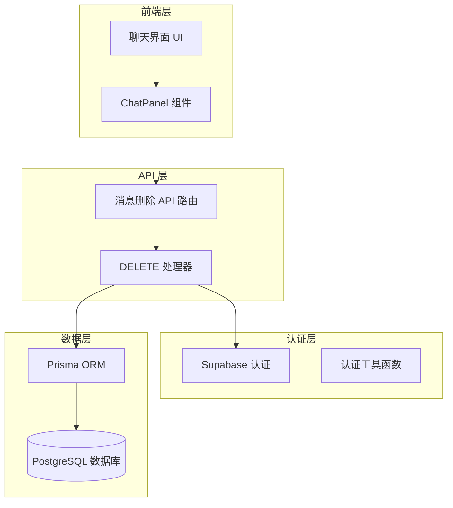
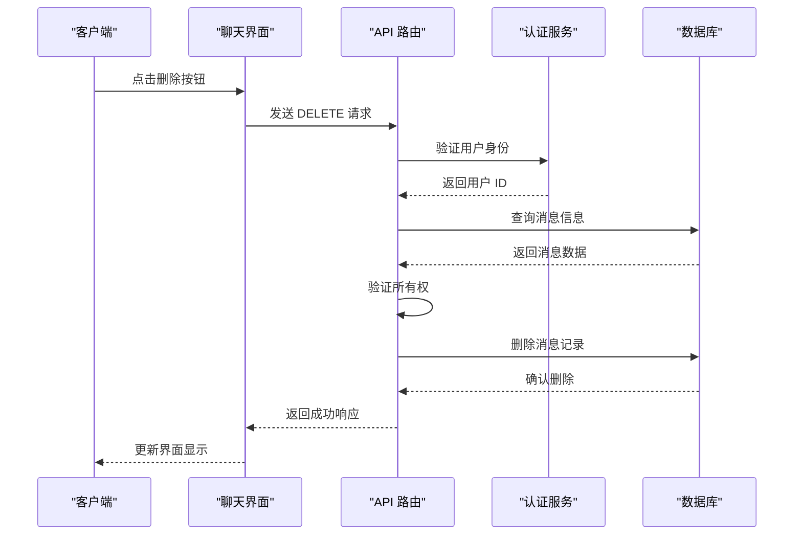
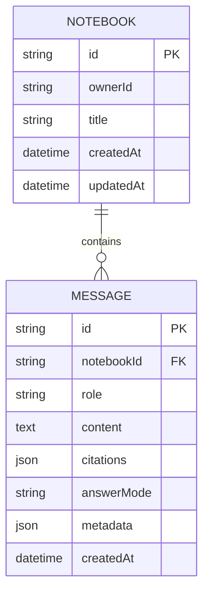
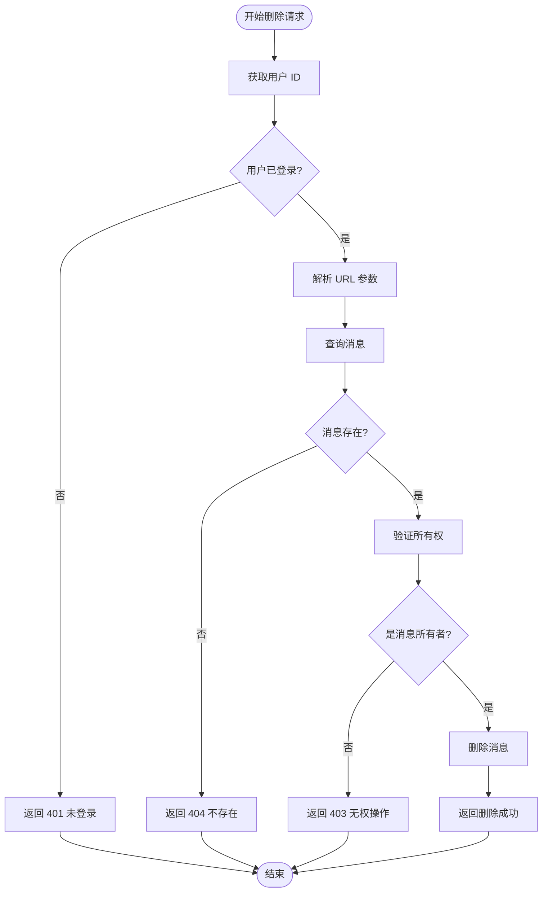
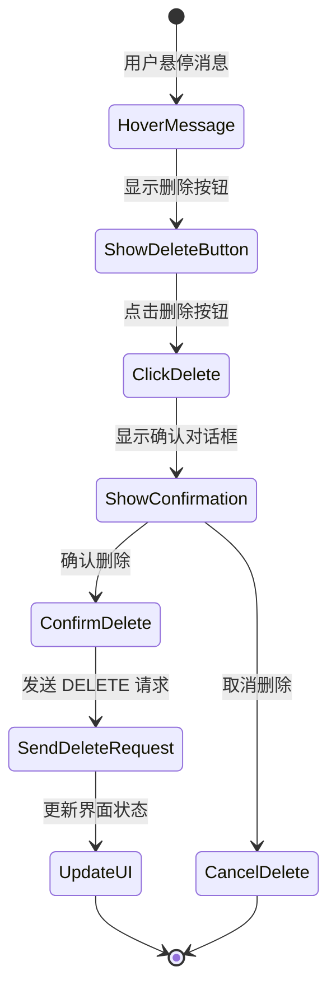
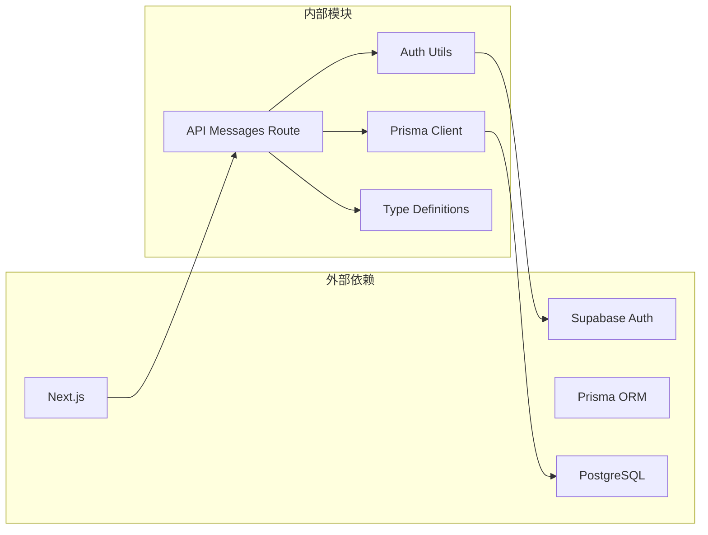

# 消息删除 API

<cite>
**本文档引用的文件**
- [app/api/messages/[id]/route.ts](file://app/api/messages/[id]/route.ts)
- [lib/db/prisma.ts](file://lib/db/prisma.ts)
- [lib/db/supabase.ts](file://lib/db/supabase.ts)
- [lib/supabase/server.ts](file://lib/supabase/server.ts)
- [prisma/schema.prisma](file://prisma/schema.prisma)
- [components/notebook/chat-panel.tsx](file://components/notebook/chat-panel.tsx)
- [types/index.ts](file://types/index.ts)
</cite>

## 目录
1. [简介](#简介)
2. [项目结构](#项目结构)
3. [核心组件](#核心组件)
4. [架构概览](#架构概览)
5. [详细组件分析](#详细组件分析)
6. [依赖关系分析](#依赖关系分析)
7. [性能考虑](#性能考虑)
8. [故障排除指南](#故障排除指南)
9. [结论](#结论)

## 简介

消息删除 API 是 NotebookLM-clone 项目中的一个核心功能，允许用户删除与其账户关联的聊天消息。该 API 实现了完整的身份验证、授权验证和数据删除流程，确保只有消息的所有者才能删除其消息。

该功能通过 Next.js App Router 的 API 路由实现，采用 RESTful 设计原则，使用 HTTP DELETE 方法进行消息删除操作。系统集成了 Supabase 认证服务和 Prisma ORM 来确保数据安全性和一致性。

## 项目结构

消息删除功能涉及多个层次的组件协作：

**图表来源**
- [app/api/messages/[id]/route.ts](file://app/api/messages/[id]/route.ts#L1-L50)
- [lib/db/supabase.ts](file://lib/db/supabase.ts#L1-L39)
- [lib/db/prisma.ts](file://lib/db/prisma.ts#L1-L41)

**章节来源**
- [app/api/messages/[id]/route.ts](file://app/api/messages/[id]/route.ts#L1-L50)
- [lib/db/supabase.ts](file://lib/db/supabase.ts#L1-L39)
- [lib/db/prisma.ts](file://lib/db/prisma.ts#L1-L41)

## 核心组件

### API 路由处理器

消息删除 API 位于 `app/api/messages/[id]/route.ts`，实现了完整的 DELETE 请求处理逻辑：

- **身份验证**: 通过 `getCurrentUserId()` 函数获取当前登录用户 ID
- **参数解析**: 从 URL 参数中提取消息 ID
- **数据查询**: 使用 Prisma 查询消息及其关联的 Notebook 信息
- **权限验证**: 确保消息的所有者与当前用户匹配
- **数据删除**: 执行消息删除操作
- **响应处理**: 返回标准化的 JSON 响应格式

### 认证服务

系统使用 Supabase 进行用户认证和权限验证：

- **getCurrentUserId()**: 获取当前用户的唯一标识符
- **verifyOwnership()**: 验证用户对资源的所有权
- **createClient()**: 创建 Supabase 服务器端客户端实例

### 数据访问层

Prisma ORM 提供类型安全的数据访问：

- **消息模型**: 定义了 Message 表的结构和关系
- **外键约束**: 确保数据完整性
- **级联删除**: 当 Notebook 删除时，关联的消息也会被删除

**章节来源**
- [app/api/messages/[id]/route.ts](file://app/api/messages/[id]/route.ts#L5-L49)
- [lib/db/supabase.ts](file://lib/db/supabase.ts#L12-L33)
- [lib/db/prisma.ts](file://lib/db/prisma.ts#L29-L34)

## 架构概览

消息删除 API 的整体架构遵循分层设计原则：

**图表来源**
- [components/notebook/chat-panel.tsx](file://components/notebook/chat-panel.tsx#L77-L100)
- [app/api/messages/[id]/route.ts](file://app/api/messages/[id]/route.ts#L9-L41)

### 数据模型关系

**图表来源**
- [prisma/schema.prisma](file://prisma/schema.prisma#L16-L80)

**章节来源**
- [prisma/schema.prisma](file://prisma/schema.prisma#L60-L80)

## 详细组件分析

### API 路由实现

消息删除 API 的核心实现包含以下关键步骤：

#### 身份验证流程

**图表来源**
- [app/api/messages/[id]/route.ts](file://app/api/messages/[id]/route.ts#L9-L41)

#### 错误处理机制

API 实现了完善的错误处理策略：

| 状态码 | 错误类型 | 描述 |
|--------|----------|------|
| 401 | 未登录 | 用户未通过 Supabase 认证 |
| 403 | 无权操作 | 用户尝试删除非自己拥有的消息 |
| 404 | 消息不存在 | 指定 ID 的消息不存在 |
| 500 | 删除失败 | 数据库操作异常 |

**章节来源**
- [app/api/messages/[id]/route.ts](file://app/api/messages/[id]/route.ts#L9-L48)

### 前端集成

前端组件通过 ChatPanel 实现消息删除的用户交互：

#### 删除确认流程

**图表来源**
- [components/notebook/chat-panel.tsx](file://components/notebook/chat-panel.tsx#L363-L373)

#### 前端删除实现
前端通过 `handleDelete` 函数实现消息删除功能：

- **HTTP 请求**: 使用 fetch API 发送 DELETE 请求到 `/api/messages/{id}`
- **状态更新**: 成功删除后从消息列表中移除对应消息
- **用户反馈**: 通过 Toast 组件提供操作结果反馈
- **错误处理**: 捕获网络错误并显示相应的错误信息

**章节来源**
- [components/notebook/chat-panel.tsx](file://components/notebook/chat-panel.tsx#L77-L100)

### 数据库设计

消息删除功能的数据库设计确保了数据完整性和安全性：

#### 消息表结构
- **主键**: UUID 类型的唯一标识符
- **外键**: `notebookId` 关联到 Notebook 表
- **索引**: 在 `notebookId` 和 `createdAt` 上建立索引以优化查询性能
- **级联删除**: 当 Notebook 删除时，关联的消息自动删除

#### 权限控制
- **所有者字段**: Notebook 表包含 `ownerId` 字段存储用户 ID
- **查询限制**: 每次操作都验证用户对目标资源的所有权
- **数据隔离**: 确保用户只能访问和修改自己的数据

**章节来源**
- [prisma/schema.prisma](file://prisma/schema.prisma#L60-L80)

## 依赖关系分析

消息删除 API 的依赖关系体现了清晰的分层架构：

**图表来源**
- [app/api/messages/[id]/route.ts](file://app/api/messages/[id]/route.ts#L1-L3)
- [lib/db/supabase.ts](file://lib/db/supabase.ts#L6-L16)
- [lib/db/prisma.ts](file://lib/db/prisma.ts#L1-L3)

### 模块间耦合度

- **低耦合**: API 路由只依赖认证工具函数和数据库客户端
- **高内聚**: 认证、数据库访问和业务逻辑分离在不同的模块中
- **接口清晰**: 每个模块都有明确的职责边界

**章节来源**
- [app/api/messages/[id]/route.ts](file://app/api/messages/[id]/route.ts#L1-L3)
- [lib/db/supabase.ts](file://lib/db/supabase.ts#L1-L39)
- [lib/db/prisma.ts](file://lib/db/prisma.ts#L1-L41)

## 性能考虑

### 查询优化

消息删除操作涉及的查询优化策略：

- **选择性字段**: 查询时只选择必要的字段（如 `ownerId`）减少数据传输
- **索引利用**: 利用 `notebookId` 和 `createdAt` 索引提高查询性能
- **单点查询**: 使用 `findUnique` 确保只进行一次数据库查询

### 连接池管理

数据库连接池配置确保了高并发场景下的稳定性：

- **连接限制**: Serverless 环境下每个实例最多 1 个连接
- **连接复用**: 使用 PrismaPg 适配器实现连接池复用
- **超时处理**: 合理的连接超时和错误重试机制

### 缓存策略

虽然消息删除操作本身不需要缓存，但系统整体采用了合理的缓存策略：

- **认证缓存**: Supabase 会话信息在服务端缓存
- **查询缓存**: 对于只读查询可以考虑适当的缓存策略
- **响应缓存**: API 响应的缓存控制

## 故障排除指南

### 常见问题及解决方案

#### 认证失败
**症状**: 返回 401 未登录状态码
**原因**: 用户会话失效或未正确配置 Supabase
**解决方案**:
1. 检查 Supabase 环境变量配置
2. 验证用户是否已登录
3. 确认 Cookie 设置正确

#### 权限不足
**症状**: 返回 403 无权操作状态码
**原因**: 用户尝试删除非自己拥有的消息
**解决方案**:
1. 确认当前登录用户与消息所有者匹配
2. 检查 Notebook 的所有权关系
3. 验证用户会话状态

#### 消息不存在
**症状**: 返回 404 消息不存在状态码
**原因**: 指定 ID 的消息已被删除或从未存在
**解决方案**:
1. 检查消息 ID 是否正确
2. 验证消息是否存在于数据库中
3. 确认前端传递的 ID 与后端期望一致

#### 数据库错误
**症状**: 返回 500 删除失败状态码
**原因**: 数据库操作异常或连接问题
**解决方案**:
1. 检查数据库连接状态
2. 验证数据库权限设置
3. 查看服务器日志获取详细错误信息

### 调试技巧

#### 日志记录
系统在错误发生时会记录详细的错误信息，便于调试：

- **错误堆栈**: 完整的调用堆栈信息
- **请求上下文**: 包含用户 ID、消息 ID 等上下文信息
- **时间戳**: 精确的错误发生时间

#### 性能监控
可以通过以下方式监控 API 性能：

- **响应时间**: 监控删除操作的平均响应时间
- **错误率**: 跟踪各种错误类型的出现频率
- **并发处理**: 监控同时处理的请求数量

**章节来源**
- [app/api/messages/[id]/route.ts](file://app/api/messages/[id]/route.ts#L42-L48)

## 结论

消息删除 API 是 NotebookLM-clone 项目中一个设计良好的功能模块，它展示了现代 Web 应用开发的最佳实践：

### 设计优势

1. **安全性**: 实现了完整的身份验证和授权验证
2. **可维护性**: 清晰的分层架构和模块化设计
3. **可靠性**: 完善的错误处理和日志记录机制
4. **性能**: 优化的数据库查询和连接池管理

### 技术亮点

- **RESTful 设计**: 符合 HTTP 标准的 API 设计
- **类型安全**: TypeScript 提供的编译时类型检查
- **异步处理**: Promise 和 async/await 的正确使用
- **错误处理**: 结构化的错误处理和响应格式

### 改进建议

1. **事务处理**: 对于复杂的多表操作可以考虑使用数据库事务
2. **审计日志**: 记录重要的删除操作以便追踪
3. **软删除**: 考虑实现软删除以支持数据恢复
4. **批量操作**: 支持批量删除多个消息的功能

该消息删除 API 为整个 NotebookLM-clone 项目提供了坚实的基础，确保了用户数据的安全性和系统的可靠性。