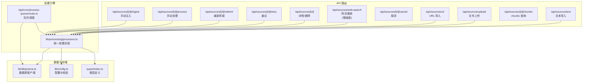
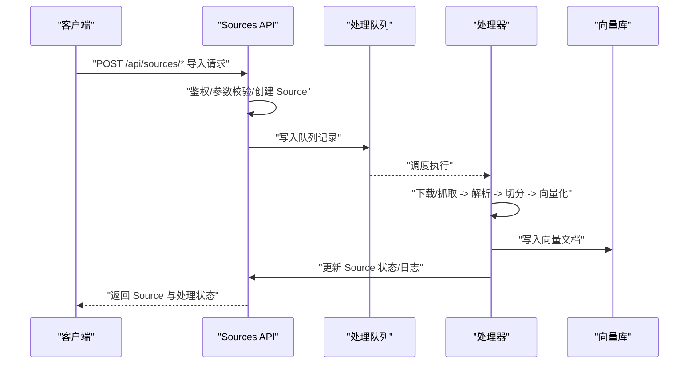
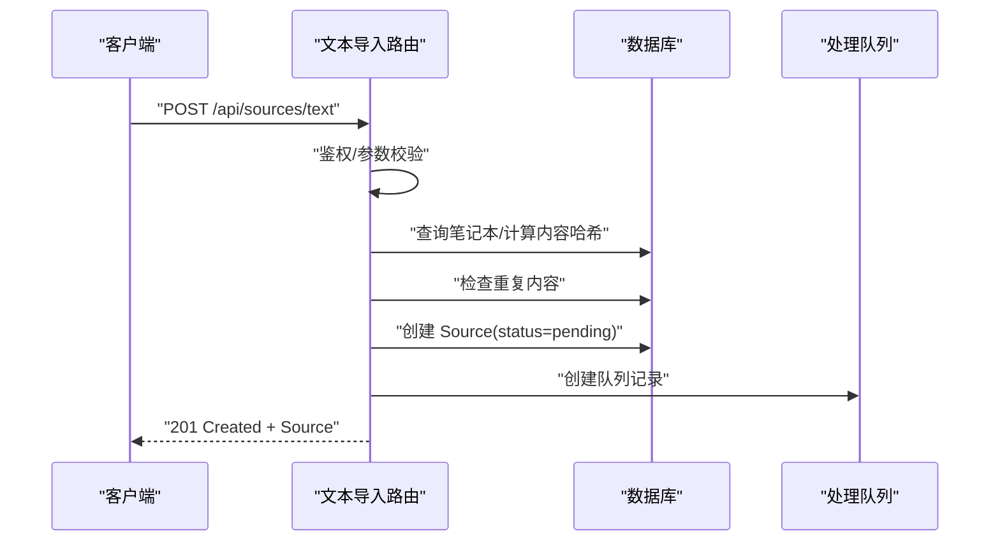
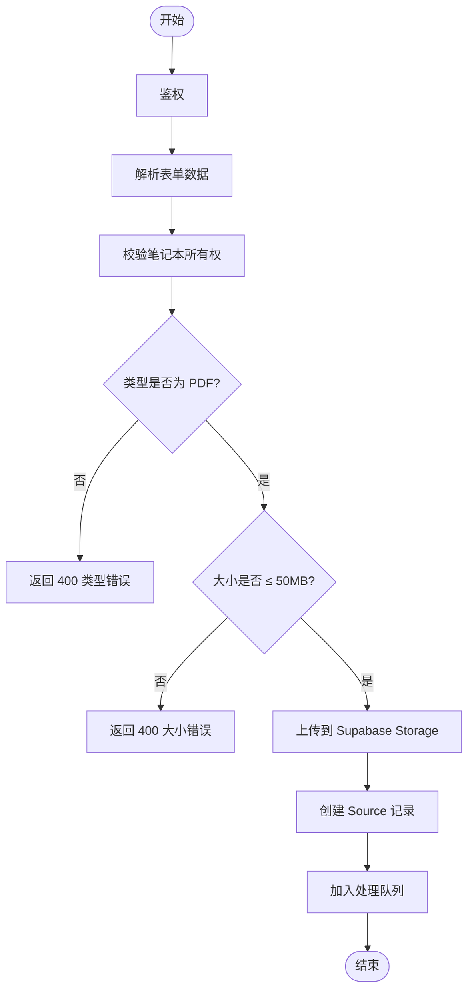
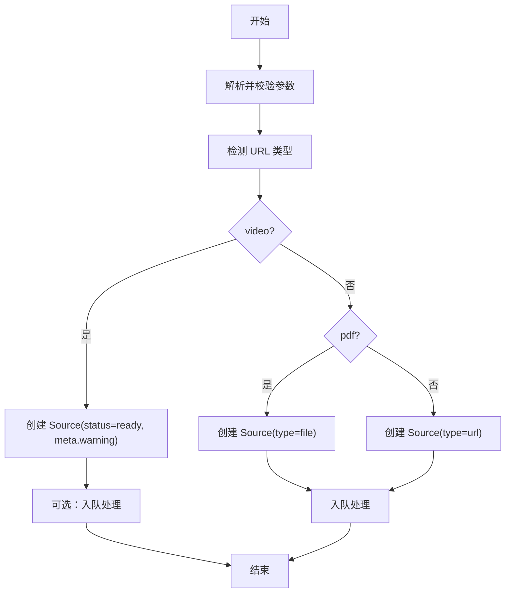
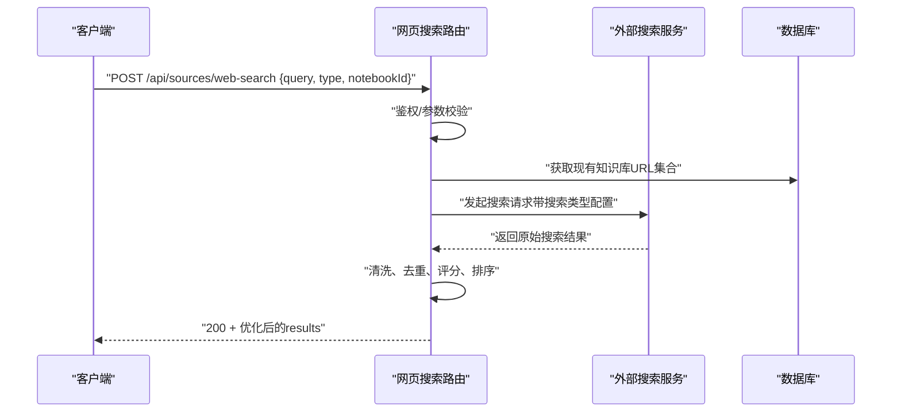
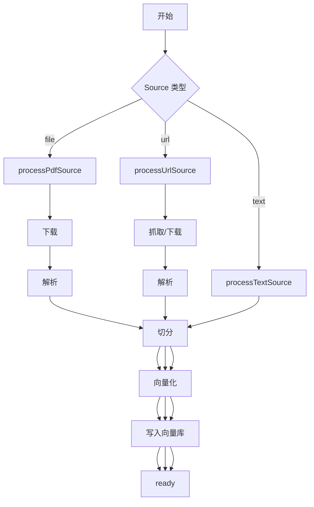
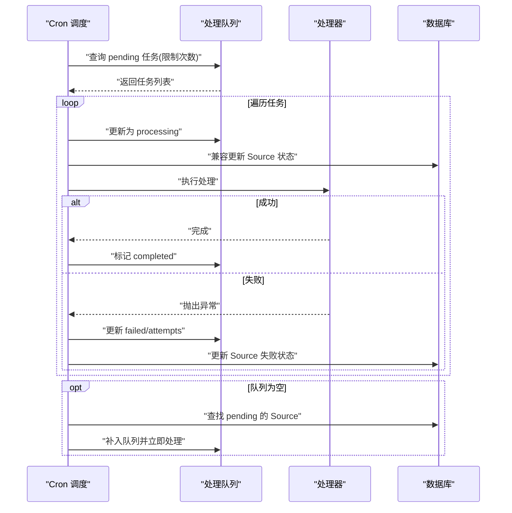
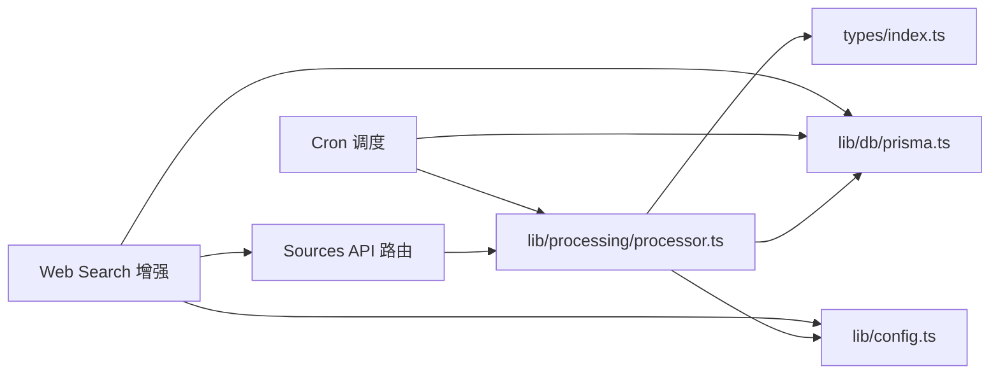

# Sources 导入 API

<cite>
**本文引用的文件**
- [app/api/sources/text/route.ts](file://app/api/sources/text/route.ts)
- [app/api/sources/upload/route.ts](file://app/api/sources/upload/route.ts)
- [app/api/sources/url/route.ts](file://app/api/sources/url/route.ts)
- [app/api/sources/web-search/route.ts](file://app/api/sources/web-search/route.ts)
- [app/api/sources/[id]/route.ts](file://app/api/sources/[id]/route.ts)
- [app/api/sources/[id]/retry/route.ts](file://app/api/sources/[id]/retry/route.ts)
- [app/api/sources/[id]/cancel/route.ts](file://app/api/sources/[id]/cancel/route.ts)
- [app/api/sources/[id]/refetch/route.ts](file://app/api/sources/[id]/refetch/route.ts)
- [app/api/sources/[id]/process/route.ts](file://app/api/sources/[id]/process/route.ts)
- [app/api/sources/[id]/chunks/route.ts](file://app/api/sources/[id]/chunks/route.ts)
- [app/api/sources/[id]/ingest/route.ts](file://app/api/sources/[id]/ingest/route.ts)
- [lib/processing/processor.ts](file://lib/processing/processor.ts)
- [app/api/cron/process-queue/route.ts](file://app/api/cron/process-queue/route.ts)
- [lib/db/prisma.ts](file://lib/db/prisma.ts)
- [lib/config.ts](file://lib/config.ts)
- [types/index.ts](file://types/index.ts)
</cite>

## 更新摘要
**变更内容**
- 增强网页搜索功能，新增三种搜索模式（精度、探索、深度）
- 实现智能URL去重和结果质量评分系统
- 新增 `notebookId` 参数支持知识库联动
- 优化搜索查询语句和结果处理逻辑

## 目录
1. [简介](#简介)
2. [项目结构](#项目结构)
3. [核心组件](#核心组件)
4. [架构总览](#架构总览)
5. [详细组件分析](#详细组件分析)
6. [依赖关系分析](#依赖关系分析)
7. [性能考量](#性能考量)
8. [故障排查指南](#故障排查指南)
9. [结论](#结论)
10. [附录](#附录)

## 简介
本文件为 Sources 导入 API 的完整接口文档，覆盖多格式文档导入（文本、文件上传、URL、网页搜索）、Sources 生命周期管理（创建、处理状态查询、重试、取消、重新获取）、以及文档处理（chunks 管理与 ingest 注入）全流程。文档提供请求格式、响应结构、错误处理机制、文件上传大小限制、格式验证、处理进度查询、异步处理队列工作流与状态转换，并给出常见导入场景的使用示例与最佳实践。

**更新** 本次更新增强了网页搜索功能，新增了三种搜索模式和智能结果处理系统。

## 项目结构
Sources API 采用按功能模块划分的路由组织方式，核心入口位于 app/api/sources 下，包含多种导入方式与资源管理操作；处理流程由 lib/processing/processor.ts 实现，异步队列由定时任务驱动。

**图表来源**
- [app/api/sources/text/route.ts](file://app/api/sources/text/route.ts#L1-L122)
- [app/api/sources/upload/route.ts](file://app/api/sources/upload/route.ts#L1-L111)
- [app/api/sources/url/route.ts](file://app/api/sources/url/route.ts#L1-L167)
- [app/api/sources/web-search/route.ts](file://app/api/sources/web-search/route.ts#L1-L180)
- [app/api/sources/[id]/route.ts](file://app/api/sources/[id]/route.ts#L1-L120)
- [app/api/sources/[id]/retry/route.ts](file://app/api/sources/[id]/retry/route.ts#L1-L72)
- [app/api/sources/[id]/cancel/route.ts](file://app/api/sources/[id]/cancel/route.ts#L1-L46)
- [app/api/sources/[id]/refetch/route.ts](file://app/api/sources/[id]/refetch/route.ts#L1-L86)
- [app/api/sources/[id]/process/route.ts](file://app/api/sources/[id]/process/route.ts#L1-L140)
- [app/api/sources/[id]/chunks/route.ts](file://app/api/sources/[id]/chunks/route.ts#L1-L139)
- [app/api/sources/[id]/ingest/route.ts](file://app/api/sources/[id]/ingest/route.ts#L1-L85)
- [lib/processing/processor.ts](file://lib/processing/processor.ts#L1-L560)
- [app/api/cron/process-queue/route.ts](file://app/api/cron/process-queue/route.ts#L38-L164)
- [lib/db/prisma.ts](file://lib/db/prisma.ts#L1-L41)
- [lib/config.ts](file://lib/config.ts#L1-L187)
- [types/index.ts](file://types/index.ts#L1-L214)

## 核心组件
- 文本导入：接收 notebookId、title、content，进行内容去重、创建 Source、写入处理队列。
- 文件上传：支持 PDF，限制大小与类型，上传至 Supabase Storage，创建 Source 并入队。
- URL 导入：支持普通网页与 PDF 链接，自动检测类型，非视频类 URL 入队处理。
- **增强** 网页搜索：调用外部搜索服务，支持三种搜索模式（精度、探索、深度），实现智能URL去重和结果质量评分。
- 生命周期管理：获取详情、删除、重试失败、取消队列、重新抓取 URL。
- 处理与注入：chunks 查询、手动触发处理/注入、异步队列调度。
- 配置与校验：向量维度强制校验、最大文件大小等。

**章节来源**
- [app/api/sources/text/route.ts](file://app/api/sources/text/route.ts#L13-L17)
- [app/api/sources/upload/route.ts](file://app/api/sources/upload/route.ts#L11-L12)
- [app/api/sources/url/route.ts](file://app/api/sources/url/route.ts#L12-L18)
- [app/api/sources/web-search/route.ts](file://app/api/sources/web-search/route.ts#L6-L22)
- [lib/config.ts](file://lib/config.ts#L162-L166)
- [types/index.ts](file://types/index.ts#L10-L16)

## 架构总览
Sources 导入 API 的整体流程如下：前端调用不同导入接口 -> 后端校验鉴权与参数 -> 创建 Source 记录 -> 入队处理 -> 异步队列调度 -> 处理器执行具体步骤（下载/抓取 -> 解析 -> 切分 -> 向量化 -> 写入向量库）-> 更新 Source 状态与日志 -> 提供 chunks 查询与手动注入能力。

**图表来源**
- [lib/processing/processor.ts](file://lib/processing/processor.ts#L82-L209)
- [lib/processing/processor.ts](file://lib/processing/processor.ts#L215-L397)
- [lib/processing/processor.ts](file://lib/processing/processor.ts#L402-L420)
- [app/api/cron/process-queue/route.ts](file://app/api/cron/process-queue/route.ts#L38-L164)
- [app/api/sources/[id]/process/route.ts](file://app/api/sources/[id]/process/route.ts#L78-L138)

## 详细组件分析

### 文本导入 API
- 路径：POST /api/sources/text
- 功能：将复制的文字作为知识源添加，自动去重、创建 Source、写入处理队列。
- 输入参数：
  - notebookId: UUID，所属笔记本
  - title: 非空字符串，长度 1~200
  - content: 非空字符串，长度 10~50000
- 成功响应：返回创建的 Source 对象（状态 pending）。
- 错误码：
  - 400：参数校验失败、重复内容
  - 401：未登录
  - 403：无权访问笔记本
  - 404：笔记本不存在
  - 500：内部错误

**图表来源**
- [app/api/sources/text/route.ts](file://app/api/sources/text/route.ts#L19-L116)

**章节来源**
- [app/api/sources/text/route.ts](file://app/api/sources/text/route.ts#L13-L17)
- [app/api/sources/text/route.ts](file://app/api/sources/text/route.ts#L19-L116)

### 文件上传导入 API
- 路径：POST /api/sources/upload
- 功能：上传 PDF 文件，校验类型与大小，上传至 Supabase Storage，创建 Source 并入队。
- 限制：
  - 最大文件大小：50MB
  - 允许类型：application/pdf
- 成功响应：返回 Source 对象（状态 pending）。
- 错误码：400（缺少文件/缺少 notebookId/类型不符/大小超限），401/403/404/500。

**图表来源**
- [app/api/sources/upload/route.ts](file://app/api/sources/upload/route.ts#L14-L110)

**章节来源**
- [app/api/sources/upload/route.ts](file://app/api/sources/upload/route.ts#L11-L12)
- [app/api/sources/upload/route.ts](file://app/api/sources/upload/route.ts#L14-L110)

### URL 导入 API
- 路径：POST /api/sources/url
- 功能：添加网页链接作为知识源，自动检测类型（普通网页/PDF/视频），非视频类 URL 入队处理。
- 输入参数：
  - notebookId: UUID
  - url: 以 http/https 开头的有效 URL
- URL 类型检测：
  - 包含 youtube/youtu.be：标记为 video，直接 ready
  - 以 .pdf 结尾：标记为 file
  - 其他：标记为 url
- 成功响应：返回 Source 对象（可能带 warning），非视频类会入队。
- 错误码：400/401/403/404/500。

**图表来源**
- [app/api/sources/url/route.ts](file://app/api/sources/url/route.ts#L68-L166)

**章节来源**
- [app/api/sources/url/route.ts](file://app/api/sources/url/route.ts#L12-L18)
- [app/api/sources/url/route.ts](file://app/api/sources/url/route.ts#L21-L36)
- [app/api/sources/url/route.ts](file://app/api/sources/url/route.ts#L68-L166)

### 增强的网页搜索 API
- 路径：POST /api/sources/web-search
- 功能：调用外部搜索服务，支持三种搜索模式（精度、探索、深度），实现智能URL去重和结果质量评分。
- **新增输入参数**：
  - query: 字符串，必填，搜索关键词
  - notebookId: 字符串，可选，用于知识库联动去重
  - type: 字符串，可选，搜索模式（precision/exploration/deep，默认 exploration）
- **搜索模式说明**：
  - precision（精度）：搜索8个结果，适合精确查询
  - exploration（探索）：默认模式，搜索15个结果，平衡质量和数量
  - deep（深度）：搜索20个结果，适合深入研究
- **智能处理功能**：
  - URL去重：基于现有知识库URL集合进行去重
  - 质量评分：根据内容长度、域名可信度等维度评分
  - 结果排序：已存在的结果优先，然后按分数降序排列
- 成功响应：包含结构化搜索结果数组，每个结果包含标题、链接、内容、媒体、发布日期、质量评分和存在标记。
- 错误码：400/401/5xx。

**图表来源**
- [app/api/sources/web-search/route.ts](file://app/api/sources/web-search/route.ts#L28-L178)

**章节来源**
- [app/api/sources/web-search/route.ts](file://app/api/sources/web-search/route.ts#L6-L22)
- [app/api/sources/web-search/route.ts](file://app/api/sources/web-search/route.ts#L28-L178)

### Sources 生命周期管理 API

#### 获取/删除 Source
- GET /api/sources/[id]：返回 Source 详情，若为文件类型，同时返回一个 1 小时有效期的签名下载地址。
- DELETE /api/sources/[id]：删除 Source，清理存储文件、相关 chunks、处理队列记录。

**章节来源**
- [app/api/sources/[id]/route.ts](file://app/api/sources/[id]/route.ts#L17-L62)
- [app/api/sources/[id]/route.ts](file://app/api/sources/[id]/route.ts#L65-L119)

#### 重试失败的 Source
- POST /api/sources/[id]/retry：仅对 failed 的 Source 允许重试，重置状态为 pending，增加重试计数，提高队列优先级后入队。

**章节来源**
- [app/api/sources/[id]/retry/route.ts](file://app/api/sources/[id]/retry/route.ts#L15-L71)

#### 取消处理
- POST /api/sources/[id]/cancel：将处于 pending/processing 的队列项标记为 cancelled，可用于中断长耗时任务。

**章节来源**
- [app/api/sources/[id]/cancel/route.ts](file://app/api/sources/[id]/cancel/route.ts#L5-L44)

#### 重新抓取 URL
- POST /api/sources/[id]/refetch：仅 URL 类型 Source 支持，重置状态为 pending，增加重试计数，更新元信息并入队。

**章节来源**
- [app/api/sources/[id]/refetch/route.ts](file://app/api/sources/[id]/refetch/route.ts#L11-L85)

### 文档处理与注入 API

#### 手动触发处理
- POST /api/sources/[id]/process：手动启动处理流程，异步执行，不阻塞请求；成功返回"处理已启动"提示。

**章节来源**
- [app/api/sources/[id]/process/route.ts](file://app/api/sources/[id]/process/route.ts#L78-L138)

#### 手动注入（同步）
- POST /api/sources/[id]/ingest：手动同步触发处理，适合测试；完成后返回最终状态与处理时长。

**章节来源**
- [app/api/sources/[id]/ingest/route.ts](file://app/api/sources/[id]/ingest/route.ts#L13-L84)

#### chunks 查询
- GET /api/sources/[id]/chunks：
  - 不带查询参数：分页返回 chunks 列表及总数
  - 带 chunkIndex：返回目标 chunk 及前后各 1 个 chunk 的上下文
- 返回字段：chunks（含 id、chunkIndex、content、metadata、isTarget）、source（基础信息）、pagination（可选）

**章节来源**
- [app/api/sources/[id]/chunks/route.ts](file://app/api/sources/[id]/chunks/route.ts#L16-L139)

### 处理器与异步队列

#### 处理器（processor）
- 自动识别 Source 类型并执行对应流程：
  - file：下载 -> 解析 PDF -> 切分 -> 向量化 -> 写入向量库 -> ready
  - url：抓取网页/PDF -> 解析 -> 切分 -> 向量化 -> 写入向量库 -> ready
  - text：切分 -> 向量化 -> 写入向量库 -> ready
- 处理日志包含各阶段状态、耗时、统计指标；失败时记录错误信息。

**图表来源**
- [lib/processing/processor.ts](file://lib/processing/processor.ts#L402-L420)
- [lib/processing/processor.ts](file://lib/processing/processor.ts#L82-L209)
- [lib/processing/processor.ts](file://lib/processing/processor.ts#L215-L397)
- [lib/processing/processor.ts](file://lib/processing/processor.ts#L426-L526)

**章节来源**
- [lib/processing/processor.ts](file://lib/processing/processor.ts#L1-L560)

#### 异步队列与调度
- 队列记录字段：status（pending/processing/completed/failed）、priority、attempts、startedAt/completedAt/createdAt。
- 定时任务（Cron）：
  - 优先取 pending 且尝试次数 < 3 的任务，按优先级与创建时间排序批量处理。
  - 若队列为空，扫描 Sources 中状态为 pending 的"漏网之鱼"，补入队列并立即处理。
- 失败策略：达到最大尝试次数后标记为 failed；否则回退为 pending 并更新日志。

**图表来源**
- [app/api/cron/process-queue/route.ts](file://app/api/cron/process-queue/route.ts#L38-L164)
- [app/api/sources/[id]/process/route.ts](file://app/api/sources/[id]/process/route.ts#L10-L76)

**章节来源**
- [app/api/cron/process-queue/route.ts](file://app/api/cron/process-queue/route.ts#L38-L164)
- [app/api/sources/[id]/process/route.ts](file://app/api/sources/[id]/process/route.ts#L6-L8)

### 数据模型与类型
- Source 类型与状态：file/url/text，状态 pending/processing/ready/failed。
- ProcessingLog：记录各阶段耗时、统计与错误信息。
- DocumentChunk：包含 notebookId、sourceId、chunkIndex、content、metadata、embedding 等。
- **新增** SearchResult：网页搜索结果结构，包含标题、链接、内容、媒体、发布日期、质量评分和存在标记。

**章节来源**
- [types/index.ts](file://types/index.ts#L10-L16)
- [types/index.ts](file://types/index.ts#L45-L59)
- [types/index.ts](file://types/index.ts#L118-L128)
- [app/api/sources/web-search/route.ts](file://app/api/sources/web-search/route.ts#L14-L22)

## 依赖关系分析

**图表来源**
- [lib/processing/processor.ts](file://lib/processing/processor.ts#L1-L560)
- [lib/db/prisma.ts](file://lib/db/prisma.ts#L1-L41)
- [lib/config.ts](file://lib/config.ts#L1-L187)
- [types/index.ts](file://types/index.ts#L1-L214)
- [app/api/cron/process-queue/route.ts](file://app/api/cron/process-queue/route.ts#L38-L164)
- [app/api/sources/web-search/route.ts](file://app/api/sources/web-search/route.ts#L1-L180)

**章节来源**
- [lib/processing/processor.ts](file://lib/processing/processor.ts#L1-L560)
- [lib/db/prisma.ts](file://lib/db/prisma.ts#L1-L41)
- [lib/config.ts](file://lib/config.ts#L1-L187)
- [types/index.ts](file://types/index.ts#L1-L214)
- [app/api/cron/process-queue/route.ts](file://app/api/cron/process-queue/route.ts#L38-L164)
- [app/api/sources/web-search/route.ts](file://app/api/sources/web-search/route.ts#L1-L180)

## 性能考量
- 并发与异步：导入成功后立即返回，处理在后台异步执行，避免请求超时。
- 队列优先级：重试与重新抓取的优先级高于普通任务，保证用户体验。
- 分页查询：chunks 查询支持分页与上下文查询，降低前端渲染压力。
- 存储与网络：文件上传走 Supabase Storage，网页抓取设置超时与 UA，提升稳定性。
- 向量维度校验：启动时强制校验维度一致性，避免后续向量不匹配问题。
- **新增** 搜索优化：智能去重和评分减少无效结果，提高搜索效率。

## 故障排查指南
- 常见错误与定位：
  - 401 未登录：确认鉴权头或 Cookie 是否正确传递。
  - 403 无权访问：确认当前用户与笔记本归属一致。
  - 400 参数/格式错误：检查 notebookId、URL 格式、文件类型与大小。
  - 404 资源不存在：确认 Source ID 或笔记本是否存在。
  - 500 内部错误：查看服务器日志，关注处理器阶段与外部服务调用。
- 处理失败处理：
  - 使用 /api/sources/[id]/retry 重试失败任务。
  - 使用 /api/sources/[id]/cancel 取消仍在队列中的任务。
  - 使用 /api/sources/[id]/refetch 重新抓取 URL。
  - 使用 /api/sources/[id]/ingest 手动同步触发处理以便调试。
- 队列修复：
  - Cron 会自动扫描 pending 的 Source 并补入队列，必要时可手动触发处理。
- **新增** 网页搜索问题排查：
  - 检查搜索模式参数是否正确（precision/exploration/deep）
  - 验证 notebookId 是否有效，确保知识库联动正常
  - 查看搜索结果评分和去重逻辑是否符合预期

**章节来源**
- [app/api/sources/text/route.ts](file://app/api/sources/text/route.ts#L106-L115)
- [app/api/sources/upload/route.ts](file://app/api/sources/upload/route.ts#L106-L109)
- [app/api/sources/url/route.ts](file://app/api/sources/url/route.ts#L162-L165)
- [app/api/sources/web-search/route.ts](file://app/api/sources/web-search/route.ts#L42-L44)
- [app/api/sources/[id]/retry/route.ts](file://app/api/sources/[id]/retry/route.ts#L42-L44)
- [app/api/sources/[id]/cancel/route.ts](file://app/api/sources/[id]/cancel/route.ts#L28-L37)
- [app/api/sources/[id]/refetch/route.ts](file://app/api/sources/[id]/refetch/route.ts#L57-L69)
- [app/api/sources/[id]/ingest/route.ts](file://app/api/sources/[id]/ingest/route.ts#L46-L55)
- [app/api/cron/process-queue/route.ts](file://app/api/cron/process-queue/route.ts#L109-L151)

## 结论
Sources 导入 API 提供了从文本、文件、URL 到网页搜索的全链路导入能力，并通过统一的处理引擎与异步队列实现稳定高效的文档处理。**本次更新显著增强了网页搜索功能**，新增的三种搜索模式、智能URL去重和质量评分系统大大提升了搜索结果的质量和实用性。配合生命周期管理与手动注入接口，能够满足从快速试用到生产部署的多样化需求。建议在生产环境中结合 Cron 调度与监控告警，确保队列健康运行与处理质量。

## 附录

### API 使用示例与最佳实践
- 文本导入
  - 场景：快速将一段文字加入笔记本
  - 最佳实践：先校验内容长度与去重，再提交；注意字符/单词统计用于后续分析
- 文件上传
  - 场景：上传 PDF 作为知识源
  - 最佳实践：控制文件大小与命名，上传后立即入队；如需预览可使用签名 URL
- URL 导入
  - 场景：添加网页链接
  - 最佳实践：优先使用非视频链接；对 PDF 链接会自动转为 file 类型处理
- **增强** 网页搜索
  - 场景：基于查询获取外部搜索结果
  - 最佳实践：根据需求选择合适的搜索模式
    - 精度模式：适用于需要精确答案的查询，返回较少但高质量的结果
    - 探索模式：默认模式，平衡质量和数量
    - 深度模式：适用于需要广泛调研的查询，返回更多详细内容
  - 使用 notebookId 参数实现知识库联动，避免重复添加相同URL
  - 结合返回结果的评分和存在标记进行二次筛选
- 生命周期管理
  - 场景：失败重试、取消长时间任务、重新抓取
  - 最佳实践：失败后及时重试；对长耗时任务提供取消能力；URL 变更后重新抓取
- 处理与注入
  - 场景：调试或手动触发处理
  - 最佳实践：开发/测试阶段使用 /api/sources/[id]/ingest；生产使用 Cron 调度

### 错误码速查
- 400：参数/格式/大小/类型错误
- 401：未登录
- 403：无权访问
- 404：资源不存在
- 500：内部错误

### 搜索模式对比表
| 模式 | 结果数量 | 适用场景 | 特点 |
|------|----------|----------|------|
| precision | 8个 | 精确查询 | 快速获取高质量答案 |
| exploration | 15个 | 默认模式 | 平衡质量和数量 |
| deep | 20个 | 深入研究 | 获取更多详细内容 |

### 智能处理功能说明
- **URL去重**：基于现有知识库URL集合，避免重复添加相同内容
- **质量评分**：综合内容长度、域名可信度等因素计算质量分数
- **结果排序**：已存在的结果优先，然后按质量分数降序排列
- **搜索优化**：对查询语句进行优化，提高搜索效果