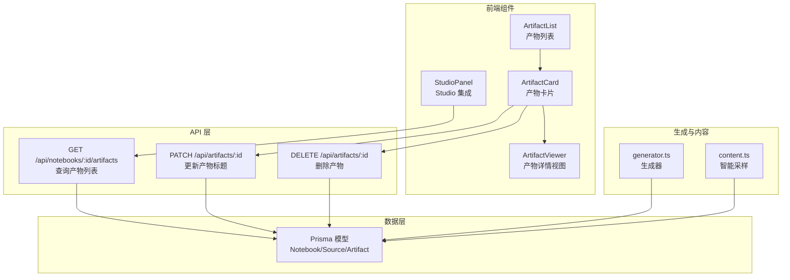
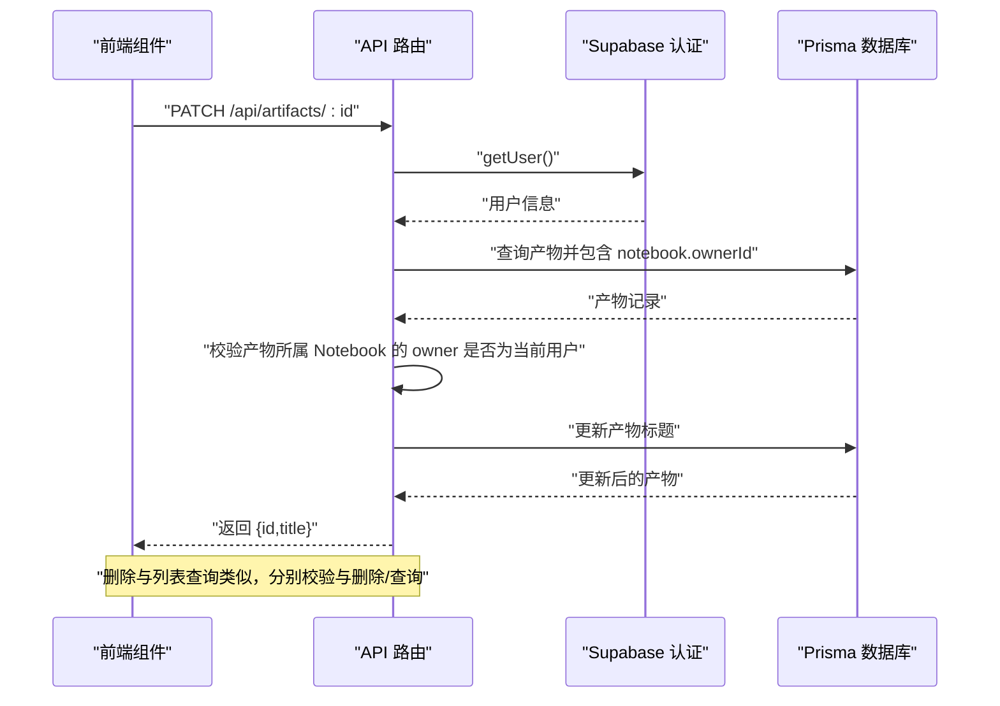
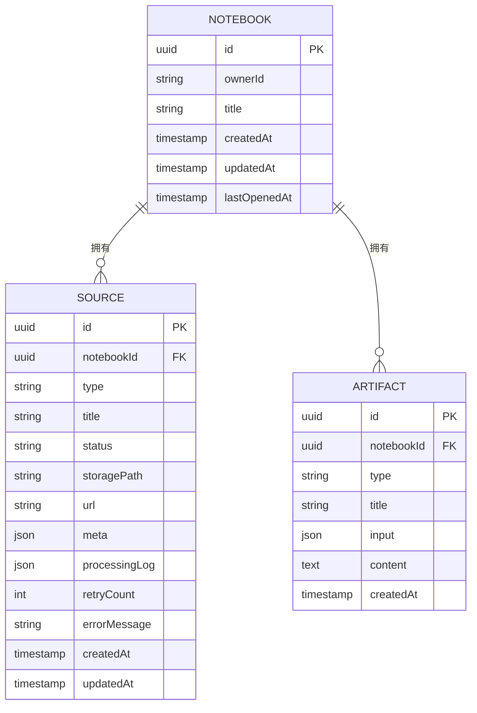
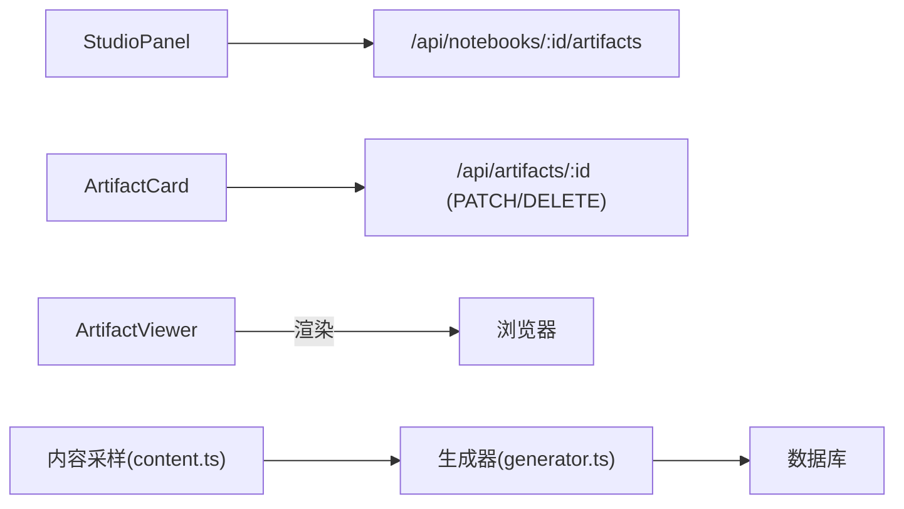

# 产物管理 API

<cite>
**本文档引用的文件**
- [app/api/artifacts/[id]/route.ts](file://app/api/artifacts/[id]/route.ts)
- [app/api/notebooks/[id]/artifacts/route.ts](file://app/api/notebooks/[id]/artifacts/route.ts)
- [prisma/schema.prisma](file://prisma/schema.prisma)
- [types/index.ts](file://types/index.ts)
- [components/notebook/artifact-card.tsx](file://components/notebook/artifact-card.tsx)
- [components/notebook/artifact-list.tsx](file://components/notebook/artifact-list.tsx)
- [components/notebook/artifact-viewer.tsx](file://components/notebook/artifact-viewer.tsx)
- [components/notebook/studio-panel.tsx](file://components/notebook/studio-panel.tsx)
- [lib/studio/generator.ts](file://lib/studio/generator.ts)
- [lib/studio/content.ts](file://lib/studio/content.ts)
</cite>

## 目录
1. [简介](#简介)
2. [项目结构](#项目结构)
3. [核心组件](#核心组件)
4. [架构总览](#架构总览)
5. [详细组件分析](#详细组件分析)
6. [依赖分析](#依赖分析)
7. [性能考量](#性能考量)
8. [故障排查指南](#故障排查指南)
9. [结论](#结论)
10. [附录](#附录)

## 简介
本文件为“产物管理 API”的权威技术文档，面向后端开发者与前端集成工程师，系统性阐述产物（Artifact）的管理接口、数据结构、与 Notebook 和 Sources 的关联机制、访问权限控制、存储与检索策略、调用示例与客户端集成指南，以及产物生命周期与版本控制机制。

## 项目结构
产物管理相关的核心文件分布如下：
- API 层：负责鉴权、校验、数据库交互与响应封装
  - 删除与更新产物：app/api/artifacts/[id]/route.ts
  - 查询产物列表：app/api/notebooks/[id]/artifacts/route.ts
- 类型与模型：定义产物类型、请求/响应结构与数据库模型
  - 类型定义：types/index.ts
  - 数据库模型：prisma/schema.prisma
- 前端组件：展示产物列表、卡片、详情视图与 Studio 集成
  - 列表与卡片：components/notebook/artifact-list.tsx、components/notebook/artifact-card.tsx
  - 详情视图：components/notebook/artifact-viewer.tsx
  - Studio 面板：components/notebook/studio-panel.tsx
- 生成与内容采样：lib/studio/generator.ts、lib/studio/content.ts

图表来源
- [app/api/notebooks/[id]/artifacts/route.ts](file://app/api/notebooks/[id]/artifacts/route.ts#L1-L77)
- [app/api/artifacts/[id]/route.ts](file://app/api/artifacts/[id]/route.ts#L1-L141)
- [components/notebook/artifact-list.tsx](file://components/notebook/artifact-list.tsx#L1-L47)
- [components/notebook/artifact-card.tsx](file://components/notebook/artifact-card.tsx#L1-L225)
- [components/notebook/artifact-viewer.tsx](file://components/notebook/artifact-viewer.tsx#L1-L67)
- [components/notebook/studio-panel.tsx](file://components/notebook/studio-panel.tsx#L1-L260)
- [lib/studio/generator.ts](file://lib/studio/generator.ts#L1-L311)
- [lib/studio/content.ts](file://lib/studio/content.ts#L1-L258)
- [prisma/schema.prisma](file://prisma/schema.prisma#L82-L97)

章节来源
- [app/api/artifacts/[id]/route.ts](file://app/api/artifacts/[id]/route.ts#L1-L141)
- [app/api/notebooks/[id]/artifacts/route.ts](file://app/api/notebooks/[id]/artifacts/route.ts#L1-L77)
- [prisma/schema.prisma](file://prisma/schema.prisma#L82-L97)
- [types/index.ts](file://types/index.ts#L14-L14)

## 核心组件
- 产物实体（Artifact）
  - 字段：id、notebookId、type、title、input、content、createdAt
  - 类型枚举：summary、outline、quiz、mindmap、custom
  - 存储：content 为长文本（Markdown 或 JSON），input 为 JSON（包含 prompt、source 选择等）
- Notebook 与 Sources
  - Notebook：拥有者（ownerId）、标题、时间戳
  - Source：类型（file/url/video/text）、状态（pending/processing/ready/failed）、元信息、处理日志等
- 前端类型与组件
  - 前端 Artifact 接口：id、type、title、content、createdAt
  - 组件：ArtifactList、ArtifactCard、ArtifactViewer、StudioPanel

章节来源
- [prisma/schema.prisma](file://prisma/schema.prisma#L82-L97)
- [types/index.ts](file://types/index.ts#L14-L14)
- [components/notebook/artifact-card.tsx](file://components/notebook/artifact-card.tsx#L33-L39)

## 架构总览
产物管理 API 的调用链路与职责划分：
- 鉴权与校验：通过 Supabase 客户端 getUser 获取当前用户，校验 Notebook 所有权或产物所属 Notebook 的所有权
- 数据访问：通过 Prisma 访问数据库，查询/更新/删除产物
- 响应封装：统一返回 JSON，包含成功与错误场景
- 前端集成：Studio 面板触发生成，产物列表与详情视图渲染不同类型的产物内容

图表来源
- [app/api/artifacts/[id]/route.ts](file://app/api/artifacts/[id]/route.ts#L11-L83)
- [app/api/notebooks/[id]/artifacts/route.ts](file://app/api/notebooks/[id]/artifacts/route.ts#L13-L76)

## 详细组件分析

### API：产物列表查询
- 路径：GET /api/notebooks/:id/artifacts
- 功能：按 Notebook 查询产物列表，按创建时间倒序返回
- 鉴权与校验：
  - 获取当前用户
  - 校验 Notebook 存在且属于当前用户
- 查询与返回：
  - 查询条件：notebookId
  - 返回字段：id、type、title、content、input、createdAt（createdAt 转为 ISO 字符串）

请求参数
- 路径参数
  - id：Notebook ID（UUID）
- 查询参数
  - 无

响应
- 成功：返回对象包含 artifacts 数组，数组元素为产物对象
- 失败：返回错误信息与 HTTP 状态码（401/404/500）

章节来源
- [app/api/notebooks/[id]/artifacts/route.ts](file://app/api/notebooks/[id]/artifacts/route.ts#L1-L77)

### API：更新产物标题
- 路径：PATCH /api/artifacts/:id
- 功能：更新指定产物的标题（允许清空为 null）
- 鉴权与校验：
  - 获取当前用户
  - 校验产物存在且所属 Notebook 的 owner 为当前用户
- 参数与校验：
  - 请求体 JSON：title（字符串）
  - 校验 title 类型与非空有效性
- 返回：
  - 返回更新后的 id 与 title

请求参数
- 路径参数
  - id：产物 ID（UUID）
- 请求体
  - title：字符串（可为空字符串，服务端会转换为 null）

响应
- 成功：返回 { id, title }
- 失败：返回错误信息与 HTTP 状态码（400/401/403/404/500）

章节来源
- [app/api/artifacts/[id]/route.ts](file://app/api/artifacts/[id]/route.ts#L11-L83)

### API：删除产物
- 路径：DELETE /api/artifacts/:id
- 功能：删除指定产物
- 鉴权与校验：
  - 获取当前用户
  - 校验产物存在且所属 Notebook 的 owner 为当前用户
- 删除：
  - 直接删除产物记录
- 返回：
  - 返回 { success: true }

请求参数
- 路径参数
  - id：产物 ID（UUID）

响应
- 成功：返回 { success: true }
- 失败：返回错误信息与 HTTP 状态码（401/403/404/500）

章节来源
- [app/api/artifacts/[id]/route.ts](file://app/api/artifacts/[id]/route.ts#L85-L140)

### 数据模型与关联关系
- Artifact
  - 字段：id、notebookId、type、title、input、content、createdAt
  - 关系：属于一个 Notebook
- Notebook
  - 字段：id、ownerId、title、createdAt、updatedAt、lastOpenedAt
  - 关系：拥有多个 Artifact、Source、Message
- Source
  - 字段：id、notebookId、type、title、status、storagePath、url、meta、processingLog、retryCount、errorMessage、createdAt、updatedAt
  - 关系：属于一个 Notebook

图表来源
- [prisma/schema.prisma](file://prisma/schema.prisma#L16-L97)

章节来源
- [prisma/schema.prisma](file://prisma/schema.prisma#L16-L97)

### 前端组件与集成要点
- 产物类型与接口
  - 前端类型：Artifact（id、type、title、content、createdAt）
  - 类型枚举：summary、outline、quiz、mindmap、custom
- 产物列表与卡片
  - ArtifactList：渲染产物卡片列表
  - ArtifactCard：支持编辑标题、复制内容、删除产物
- 产物详情视图
  - ArtifactViewer：根据类型渲染 Markdown 或 JSON 结构（测验、思维导图）
- Studio 集成
  - StudioPanel：触发生成、展示产物列表、详情视图切换

章节来源
- [components/notebook/artifact-card.tsx](file://components/notebook/artifact-card.tsx#L31-L39)
- [components/notebook/artifact-list.tsx](file://components/notebook/artifact-list.tsx#L1-L47)
- [components/notebook/artifact-viewer.tsx](file://components/notebook/artifact-viewer.tsx#L1-L67)
- [components/notebook/studio-panel.tsx](file://components/notebook/studio-panel.tsx#L1-L260)

### 生成与内容采样（与产物生命周期的关系）
- 生成器（generator.ts）
  - 支持 fast/precise 两种模式
  - fast：智能采样（优先采样每个 Source 的头尾 chunks）
  - precise：Map-Reduce（对每个 Source 生成中间结果再合并）
- 内容采样（content.ts）
  - 智能截断、Token 估算、按 Source 采样策略
  - 保证上下文长度与 Token 上限的平衡

章节来源
- [lib/studio/generator.ts](file://lib/studio/generator.ts#L1-L311)
- [lib/studio/content.ts](file://lib/studio/content.ts#L1-L258)

## 依赖分析
- API 依赖
  - Supabase 认证：获取当前用户
  - Prisma 数据库：查询/更新/删除产物
- 前端依赖
  - 组件间通信：StudioPanel -> ArtifactList/Card -> API
  - 产物渲染：ArtifactViewer 根据类型解析 JSON 或渲染 Markdown
- 生成链路
  - StudioPanel 调用生成器，生成内容后写入数据库并返回给前端

图表来源
- [components/notebook/studio-panel.tsx](file://components/notebook/studio-panel.tsx#L1-L260)
- [components/notebook/artifact-card.tsx](file://components/notebook/artifact-card.tsx#L78-L102)
- [components/notebook/artifact-viewer.tsx](file://components/notebook/artifact-viewer.tsx#L21-L56)
- [lib/studio/generator.ts](file://lib/studio/generator.ts#L242-L262)
- [lib/studio/content.ts](file://lib/studio/content.ts#L67-L154)

章节来源
- [components/notebook/studio-panel.tsx](file://components/notebook/studio-panel.tsx#L1-L260)
- [components/notebook/artifact-card.tsx](file://components/notebook/artifact-card.tsx#L78-L102)
- [components/notebook/artifact-viewer.tsx](file://components/notebook/artifact-viewer.tsx#L21-L56)
- [lib/studio/generator.ts](file://lib/studio/generator.ts#L242-L262)
- [lib/studio/content.ts](file://lib/studio/content.ts#L67-L154)

## 性能考量
- 查询优化
  - 列表查询按 notebookId 与 createdAt 倒序排序，适合分页与增量加载
  - 前端可缓存产物列表，减少重复请求
- 生成性能
  - fast 模式优先采样少量 chunks，降低 Token 与延迟
  - precise 模式进行 Map-Reduce，结果更全面但耗时更长
- 存储与检索
  - 产物 content 为长文本，建议在前端按需渲染，避免一次性加载过多
  - 生成器内置 Token 估算与智能截断，避免超过模型上下文限制

[本节为通用性能建议，不直接分析具体文件]

## 故障排查指南
常见错误与定位
- 未授权（401）
  - 现象：鉴权失败或用户为空
  - 排查：确认前端已登录，Supabase Cookie 正确传递
- Notebook 不存在或无权访问（404）
  - 现象：查询产物列表时 Notebook 不属于当前用户
  - 排查：确认 notebookId 正确，用户与 Notebook 的 owner 关系
- 产物不存在（404）
  - 现象：更新/删除产物时找不到对应记录
  - 排查：确认 artifactId 正确
- 无权操作（403）
  - 现象：更新/删除产物时，产物所属 Notebook 的 owner 与当前用户不一致
  - 排查：检查产物归属与用户身份
- 服务器错误（500）
  - 现象：数据库异常或内部处理错误
  - 排查：查看服务端日志，确认 Prisma 查询与 Supabase 调用正常

章节来源
- [app/api/notebooks/[id]/artifacts/route.ts](file://app/api/notebooks/[id]/artifacts/route.ts#L20-L41)
- [app/api/artifacts/[id]/route.ts](file://app/api/artifacts/[id]/route.ts#L18-L60)

## 结论
产物管理 API 通过清晰的鉴权与所有权校验，结合 Prisma 的数据模型与前端组件化渲染，实现了从生成、存储到展示的完整闭环。fast/precise 两种生成模式兼顾性能与质量；智能采样与 Token 截断策略有效规避了上下文长度风险。建议在生产环境中配合缓存与分页策略进一步优化用户体验。

[本节为总结性内容，不直接分析具体文件]

## 附录

### API 定义与调用示例

- 查询产物列表
  - 方法与路径：GET /api/notebooks/{notebookId}/artifacts
  - 请求参数：路径参数 notebookId（UUID）
  - 响应：包含 artifacts 数组，元素字段：id、type、title、content、input、createdAt（ISO 字符串）
  - 示例响应结构（示意）
    - artifacts: [
        {
          id: "uuid",
          type: "summary|outline|quiz|mindmap|custom",
          title: "可选标题",
          content: "Markdown 或 JSON 字符串",
          input: "{...}",
          createdAt: "2025-01-01T00:00:00Z"
        }
      ]

- 更新产物标题
  - 方法与路径：PATCH /api/artifacts/{artifactId}
  - 请求体：JSON，字段 title（字符串，可为空）
  - 响应：{ id, title }

- 删除产物
  - 方法与路径：DELETE /api/artifacts/{artifactId}
  - 响应：{ success: true }

章节来源
- [app/api/notebooks/[id]/artifacts/route.ts](file://app/api/notebooks/[id]/artifacts/route.ts#L13-L76)
- [app/api/artifacts/[id]/route.ts](file://app/api/artifacts/[id]/route.ts#L11-L140)

### 客户端集成指南
- 列表加载
  - 在 StudioPanel 中首次进入时调用查询接口，将返回的 artifacts 设置到状态，并渲染 ArtifactList
- 产物详情
  - 点击卡片后，ArtifactCard 将触发 onSelect，切换到详情视图 ArtifactViewer
- 标题编辑
  - 在 ArtifactCard 中编辑标题并保存，调用 PATCH /api/artifacts/{id}，成功后更新本地状态
- 删除产物
  - 在 ArtifactCard 中点击删除，调用 DELETE /api/artifacts/{id}，成功后从列表移除并重置选中项

章节来源
- [components/notebook/studio-panel.tsx](file://components/notebook/studio-panel.tsx#L172-L260)
- [components/notebook/artifact-card.tsx](file://components/notebook/artifact-card.tsx#L78-L102)
- [components/notebook/artifact-viewer.tsx](file://components/notebook/artifact-viewer.tsx#L21-L56)

### 产物生命周期与版本控制
- 生命周期
  - 生成：通过 Studio 生成器生成内容，写入数据库
  - 展示：前端渲染产物列表与详情
  - 更新：支持更新标题（可清空）
  - 删除：彻底移除产物记录
- 版本控制
  - 当前实现未提供产物版本字段；如需版本追踪，可在 input 中扩展版本号或引入独立版本表

章节来源
- [lib/studio/generator.ts](file://lib/studio/generator.ts#L242-L262)
- [prisma/schema.prisma](file://prisma/schema.prisma#L82-L97)