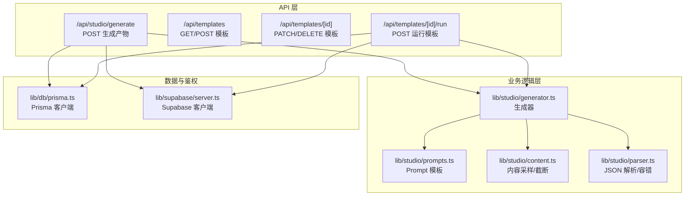
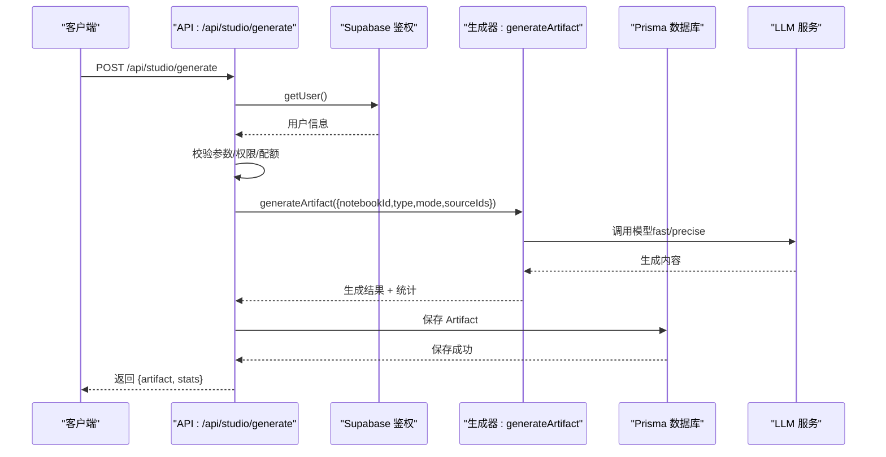
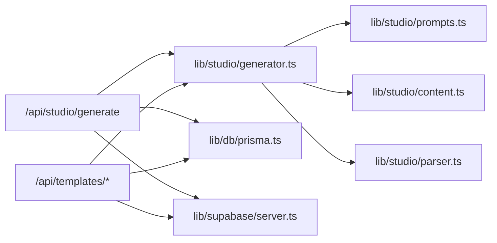

# 内容生成 API

<cite>
**本文引用的文件**
- [app/api/studio/generate/route.ts](file://app/api/studio/generate/route.ts)
- [app/api/templates/route.ts](file://app/api/templates/route.ts)
- [app/api/templates/[id]/route.ts](file://app/api/templates/[id]/route.ts)
- [app/api/templates/[id]/run/route.ts](file://app/api/templates/[id]/run/route.ts)
- [lib/studio/index.ts](file://lib/studio/index.ts)
- [lib/studio/generator.ts](file://lib/studio/generator.ts)
- [lib/studio/prompts.ts](file://lib/studio/prompts.ts)
- [lib/studio/content.ts](file://lib/studio/content.ts)
- [lib/studio/parser.ts](file://lib/studio/parser.ts)
- [lib/db/prisma.ts](file://lib/db/prisma.ts)
- [lib/supabase/server.ts](file://lib/supabase/server.ts)
- [types/index.ts](file://types/index.ts)
- [package.json](file://package.json)
- [README.md](file://README.md)
</cite>

## 目录
1. [简介](#简介)
2. [项目结构](#项目结构)
3. [核心组件](#核心组件)
4. [架构总览](#架构总览)
5. [详细组件分析](#详细组件分析)
6. [依赖分析](#依赖分析)
7. [性能考虑](#性能考虑)
8. [故障排查指南](#故障排查指南)
9. [结论](#结论)
10. [附录](#附录)

## 简介
本文件为基于 Studio 的内容生成 API 提供全面接口文档，涵盖以下能力：
- POST /api/studio/generate：快速/精准模式生成结构化产物（摘要、大纲、测验、思维导图）
- 模板管理 API：模板的创建、获取、更新、删除
- 模板运行接口：基于模板的执行、参数传递与结果保存
- 请求参数与响应结构说明：生成模式、内容类型、输出格式、统计指标
- 使用指南与最佳实践：模板开发、调用示例、错误处理与重试策略

## 项目结构
本项目采用 Next.js App Router，API 路由位于 app/api 下，业务逻辑集中在 lib/studio，数据持久化使用 Prisma + PostgreSQL，鉴权通过 Supabase。

图表来源
- [app/api/studio/generate/route.ts](file://app/api/studio/generate/route.ts#L1-L145)
- [app/api/templates/route.ts](file://app/api/templates/route.ts#L1-L63)
- [app/api/templates/[id]/route.ts](file://app/api/templates/[id]/route.ts#L1-L93)
- [app/api/templates/[id]/run/route.ts](file://app/api/templates/[id]/run/route.ts#L1-L104)
- [lib/studio/generator.ts](file://lib/studio/generator.ts#L1-L311)
- [lib/studio/prompts.ts](file://lib/studio/prompts.ts#L1-L211)
- [lib/studio/content.ts](file://lib/studio/content.ts#L1-L258)
- [lib/studio/parser.ts](file://lib/studio/parser.ts#L1-L183)
- [lib/db/prisma.ts](file://lib/db/prisma.ts#L1-L41)
- [lib/supabase/server.ts](file://lib/supabase/server.ts#L1-L33)

章节来源
- [README.md](file://README.md#L1-L141)
- [package.json](file://package.json#L1-L82)

## 核心组件
- 生成器（lib/studio/generator.ts）
  - 提供统一生成入口 generateArtifact，支持 fast/precise 两种模式
  - 基于模板生成 generateFromTemplate，支持变量替换与上下文注入
  - 内置超时控制与错误码映射（TIMEOUT、GENERATION_FAILED 等）
- Prompt 模板（lib/studio/prompts.ts）
  - 内置摘要、大纲、测验、思维导图的标准 Prompt
  - Map-Reduce 模式下的 Map/Reduce Prompt
- 内容采样与截断（lib/studio/content.ts）
  - 快速模式智能采样：按 Source 采样头尾 chunks，避免 Token 超限
  - Map-Reduce 模式：按 Source 生成中间结果，再 Reduce 合并
  - 智能截断：按 Source 块保留完整上下文
- JSON 解析与容错（lib/studio/parser.ts）
  - 安全解析多种格式的 JSON 输出，提供 fallback
  - 对测验与思维导图结构进行校验与补全
- 数据与鉴权（lib/db/prisma.ts、lib/supabase/server.ts）
  - Prisma 客户端封装，支持 Serverless 连接池
  - Supabase 服务端客户端，用于用户鉴权与会话管理

章节来源
- [lib/studio/generator.ts](file://lib/studio/generator.ts#L1-L311)
- [lib/studio/prompts.ts](file://lib/studio/prompts.ts#L1-L211)
- [lib/studio/content.ts](file://lib/studio/content.ts#L1-L258)
- [lib/studio/parser.ts](file://lib/studio/parser.ts#L1-L183)
- [lib/db/prisma.ts](file://lib/db/prisma.ts#L1-L41)
- [lib/supabase/server.ts](file://lib/supabase/server.ts#L1-L33)

## 架构总览
下面以序列图展示 POST /api/studio/generate 的完整调用链路。

图表来源
- [app/api/studio/generate/route.ts](file://app/api/studio/generate/route.ts#L12-L111)
- [lib/studio/generator.ts](file://lib/studio/generator.ts#L242-L262)
- [lib/db/prisma.ts](file://lib/db/prisma.ts#L1-L41)
- [lib/supabase/server.ts](file://lib/supabase/server.ts#L9-L32)

## 详细组件分析

### POST /api/studio/generate 接口
- 方法与路径
  - POST /api/studio/generate
- 功能概述
  - 基于 Notebook 内资料生成结构化产物（摘要、大纲、测验、思维导图）
  - 支持 fast/precise 两种模式，自动处理上下文采样与 Token 截断
- 请求参数
  - notebookId: string（必填）
  - type: 'summary' | 'outline' | 'quiz' | 'mindmap'（必填）
  - mode: 'fast' | 'precise'（可选，默认 'fast'）
  - sourceIds: string[]（可选，限定资料范围）
- 成功响应
  - artifact.id: string
  - artifact.type: 'summary' | 'outline' | 'quiz' | 'mindmap'
  - artifact.content: string（JSON 或 Markdown，视产物类型而定）
  - artifact.createdAt: string（ISO 时间）
  - stats: ContentStats + 生成统计
- 错误码
  - 400: 缺少参数/无效类型/资料不足/配额超限
  - 401: 未授权
  - 404: Notebook 不存在或无权访问
  - 500: 服务器错误
  - 504: 生成超时
- 关键流程
  - 鉴权：通过 Supabase getUser() 获取当前用户
  - 参数校验：type 有效性、notebook 所有权、产物配额限制
  - 生成：调用 generateArtifact，内部根据 mode 选择 fast/precise
  - 保存：将结果写入 artifacts 表
  - 返回：返回 artifact 与 stats

章节来源
- [app/api/studio/generate/route.ts](file://app/api/studio/generate/route.ts#L12-L145)
- [lib/studio/generator.ts](file://lib/studio/generator.ts#L242-L262)
- [lib/studio/content.ts](file://lib/studio/content.ts#L67-L154)
- [lib/db/prisma.ts](file://lib/db/prisma.ts#L1-L41)
- [lib/supabase/server.ts](file://lib/supabase/server.ts#L9-L32)

### 模板管理 API
- 列表与创建
  - GET /api/templates
    - 返回用户可见模板（系统模板 + 自有模板）
  - POST /api/templates
    - 创建新模板（name、template 必填；description、variables 可选）
- 更新与删除
  - PATCH /api/templates/[id]
    - 更新模板（需为自有模板且非系统模板）
  - DELETE /api/templates/[id]
    - 删除模板（需为自有模板且非系统模板）

章节来源
- [app/api/templates/route.ts](file://app/api/templates/route.ts#L1-L63)
- [app/api/templates/[id]/route.ts](file://app/api/templates/[id]/route.ts#L1-L93)

### 模板运行接口
- POST /api/templates/[id]/run
- 功能概述
  - 基于指定模板与变量生成内容，并保存为自定义产物（type='custom'）
- 请求参数
  - notebookId: string（必填）
  - variables: Record<string,string>（可选）
  - sourceIds: string[]（可选）
- 成功响应
  - artifact.id/type/content/createdAt
  - stats: 生成统计（包含 mode、strategy、duration 等）
- 错误码
  - 400: 缺少 notebookId、资料不足、模板输出为空
  - 401: 未授权
  - 403: 系统模板不可编辑/删除
  - 404: 模板不存在/Notebook 不存在或无权访问
  - 500: 运行失败

章节来源
- [app/api/templates/[id]/run/route.ts](file://app/api/templates/[id]/run/route.ts#L1-L104)
- [lib/studio/generator.ts](file://lib/studio/generator.ts#L267-L310)

### 生成模式与 Prompt 设计
- 生成模式
  - fast：智能采样（按 Source 采样头尾 chunks），适合快速预览
  - precise：Map-Reduce（对每个 Source 生成中间结果，再合并），适合高质量输出
- Prompt 模板
  - 内置标准 Prompt（摘要、大纲、测验、思维导图）
  - Map-Reduce Prompt（Map/Reduce 分别针对不同产物类型）
- 输出格式
  - 摘要/大纲：Markdown
  - 测验/思维导图：JSON（通过解析器安全提取与容错）

章节来源
- [lib/studio/generator.ts](file://lib/studio/generator.ts#L120-L237)
- [lib/studio/prompts.ts](file://lib/studio/prompts.ts#L1-L211)
- [lib/studio/parser.ts](file://lib/studio/parser.ts#L124-L182)

### 数据结构与统计指标
- 产物类型（ArtifactType）
  - 'summary' | 'outline' | 'quiz' | 'mindmap' | 'custom'
- 生成统计（ContentStats）
  - totalChunks、usedChunks、estimatedTokens、sourceCount
- 生成结果（GenerateResult）
  - content、stats（含 mode、strategy、duration）、parseSuccess（可选）

章节来源
- [types/index.ts](file://types/index.ts#L14-L14)
- [lib/studio/generator.ts](file://lib/studio/generator.ts#L40-L48)
- [lib/studio/content.ts](file://lib/studio/content.ts#L16-L21)

### 错误处理与重试机制
- 错误映射
  - NO_SOURCES：资料不足
  - TIMEOUT：生成超时（504）
  - GENERATION_FAILED：生成失败（500）
  - EMPTY_CONTENT:...：模板输出为空或无有效文本
- 重试建议
  - 资料不足：提示用户上传并等待处理完成
  - 超时：适当延长超时时间或切换到 precise 模式
  - 生成失败：检查模板变量与上下文，重试或调整 Prompt

章节来源
- [app/api/studio/generate/route.ts](file://app/api/studio/generate/route.ts#L113-L143)
- [app/api/templates/[id]/run/route.ts](file://app/api/templates/[id]/run/route.ts#L80-L102)
- [lib/studio/generator.ts](file://lib/studio/generator.ts#L53-L115)

## 依赖分析
- 外部依赖
  - 模型服务：LongCat（兼容 OpenAI 接口）
  - 数据库：PostgreSQL + pgvector
  - 认证：Supabase Auth
- 内部模块耦合
  - API 路由依赖鉴权与数据库
  - 生成器依赖 Prompt、内容采样、解析器
  - 模板运行接口复用生成器

图表来源
- [app/api/studio/generate/route.ts](file://app/api/studio/generate/route.ts#L1-L145)
- [app/api/templates/route.ts](file://app/api/templates/route.ts#L1-L63)
- [app/api/templates/[id]/route.ts](file://app/api/templates/[id]/route.ts#L1-L93)
- [app/api/templates/[id]/run/route.ts](file://app/api/templates/[id]/run/route.ts#L1-L104)
- [lib/studio/generator.ts](file://lib/studio/generator.ts#L1-L311)
- [lib/studio/prompts.ts](file://lib/studio/prompts.ts#L1-L211)
- [lib/studio/content.ts](file://lib/studio/content.ts#L1-L258)
- [lib/studio/parser.ts](file://lib/studio/parser.ts#L1-L183)
- [lib/db/prisma.ts](file://lib/db/prisma.ts#L1-L41)
- [lib/supabase/server.ts](file://lib/supabase/server.ts#L1-L33)

## 性能考虑
- Token 控制
  - 快速模式：限制每 Source 采样数量与总 chunks，避免超限
  - Map-Reduce：对每个 Source 截断，减少上下文长度
- 超时策略
  - fast 模式：较短超时，提升响应速度
  - precise 模式：较长超时，保证质量
- 数据库连接
  - 使用连接池适配 Serverless 环境，降低连接开销

章节来源
- [lib/studio/content.ts](file://lib/studio/content.ts#L10-L14)
- [lib/studio/generator.ts](file://lib/studio/generator.ts#L23-L26)
- [lib/db/prisma.ts](file://lib/db/prisma.ts#L1-L41)

## 故障排查指南
- 常见错误与处理
  - 400 缺少参数/无效类型：检查请求体字段与类型枚举
  - 401 未授权：确认登录状态与 Cookie 设置
  - 404 Notebook 不存在：确认 notebookId 与用户所有权
  - 400 资料不足：提示用户上传并等待处理完成
  - 504 超时：切换到 precise 模式或减少 sourceIds
  - 500 生成失败：检查模板变量与上下文，重试
- 日志与调试
  - 开发环境下记录 LLM 返回空内容与解析失败信息
  - 建议开启数据库日志与 API 路由错误日志

章节来源
- [app/api/studio/generate/route.ts](file://app/api/studio/generate/route.ts#L113-L143)
- [app/api/templates/[id]/run/route.ts](file://app/api/templates/[id]/run/route.ts#L80-L102)
- [lib/studio/generator.ts](file://lib/studio/generator.ts#L103-L114)
- [lib/studio/parser.ts](file://lib/studio/parser.ts#L113-L118)

## 结论
本接口体系提供了从资料到结构化产物的完整链路，支持快速与精准两种模式，并内置模板系统与安全解析机制。通过合理的参数控制、超时策略与错误映射，能够在保证质量的同时兼顾性能与稳定性。

## 附录

### API 定义与示例

- POST /api/studio/generate
  - 请求体
    - notebookId: string（必填）
    - type: 'summary' | 'outline' | 'quiz' | 'mindmap'（必填）
    - mode: 'fast' | 'precise'（可选，默认 'fast'）
    - sourceIds: string[]（可选）
  - 成功响应
    - artifact: { id, type, content, createdAt }
    - stats: { mode, strategy, duration, totalChunks, usedChunks, estimatedTokens, sourceCount }
  - 示例调用
    - curl -X POST https://your-domain/api/studio/generate -H "Cookie: ...; Authorization: Bearer ..." -d '{"notebookId":"<uuid>","type":"quiz","mode":"fast"}'

- GET /api/templates
  - 返回用户可见模板数组

- POST /api/templates
  - 请求体
    - name: string（必填）
    - template: string（必填）
    - description: string（可选）
    - variables: string[]（可选）
  - 成功响应：新建模板对象（HTTP 201）

- PATCH /api/templates/[id]
  - 请求体
    - name/description/template/variables（可选）
  - 成功响应：更新后的模板对象

- DELETE /api/templates/[id]
  - 成功响应：{ success: true }

- POST /api/templates/[id]/run
  - 请求体
    - notebookId: string（必填）
    - variables: Record<string,string>（可选）
    - sourceIds: string[]（可选）
  - 成功响应
    - artifact: { id, type, content, createdAt }
    - stats: { mode, strategy, duration, ... }

章节来源
- [app/api/studio/generate/route.ts](file://app/api/studio/generate/route.ts#L28-L111)
- [app/api/templates/route.ts](file://app/api/templates/route.ts#L41-L57)
- [app/api/templates/[id]/route.ts](file://app/api/templates/[id]/route.ts#L20-L48)
- [app/api/templates/[id]/run/route.ts](file://app/api/templates/[id]/run/route.ts#L22-L79)

### 模板开发指南
- 模板变量
  - 支持 {{variable}} 占位符，模板运行时会被替换
  - 可使用 {{context}} 注入智能采样的上下文
- 变量清单
  - 在创建模板时提供 variables 数组，便于前端展示与校验
- 输出约定
  - 测验与思维导图建议输出严格 JSON，以便解析器安全提取
  - 摘要与大纲建议输出 Markdown

章节来源
- [lib/studio/generator.ts](file://lib/studio/generator.ts#L267-L310)
- [types/index.ts](file://types/index.ts#L207-L213)

### 最佳实践
- 选择模式
  - 快速预览：fast 模式
  - 高质量输出：precise 模式
- 控制上下文
  - 明确 sourceIds，减少无关资料带来的 Token 压力
- 错误重试
  - 对超时与失败进行指数退避重试
- 模板复用
  - 将常用 Prompt 抽象为模板，统一变量与输出格式