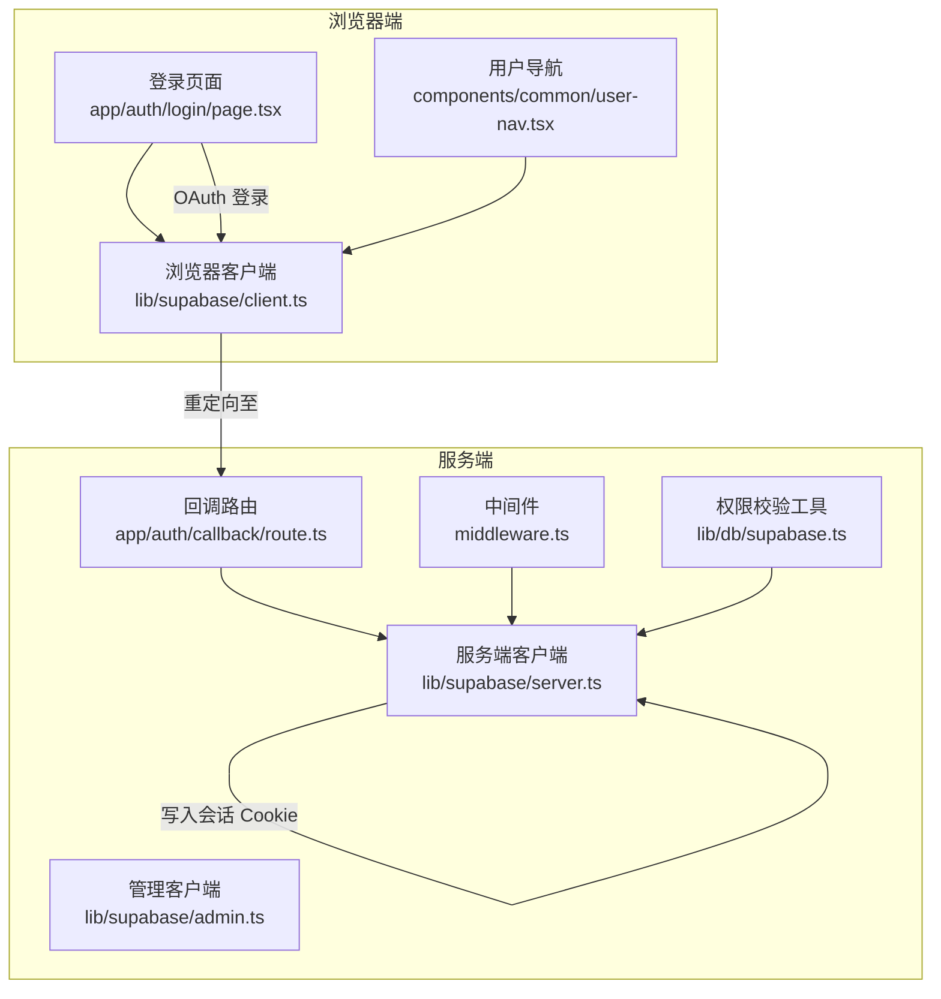
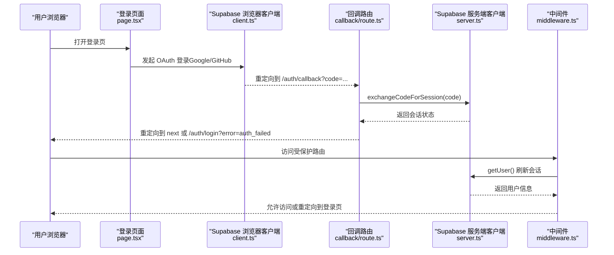
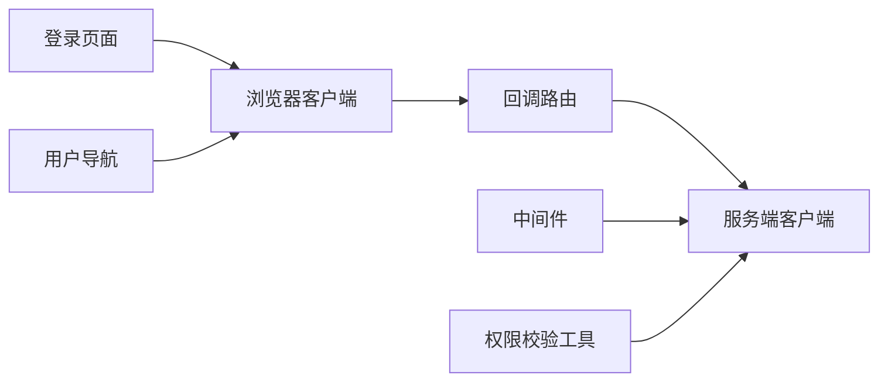

# 认证与回调 API

<cite>
**本文引用的文件**
- [app/auth/callback/route.ts](file://app/auth/callback/route.ts)
- [app/auth/login/page.tsx](file://app/auth/login/page.tsx)
- [lib/supabase/client.ts](file://lib/supabase/client.ts)
- [lib/supabase/server.ts](file://lib/supabase/server.ts)
- [lib/supabase/admin.ts](file://lib/supabase/admin.ts)
- [middleware.ts](file://middleware.ts)
- [components/common/user-nav.tsx](file://components/common/user-nav.tsx)
- [lib/db/supabase.ts](file://lib/db/supabase.ts)
- [lib/config.ts](file://lib/config.ts)
- [README.md](file://README.md)
</cite>

## 目录
1. [简介](#简介)
2. [项目结构](#项目结构)
3. [核心组件](#核心组件)
4. [架构总览](#架构总览)
5. [详细组件分析](#详细组件分析)
6. [依赖关系分析](#依赖关系分析)
7. [性能考量](#性能考量)
8. [故障排查指南](#故障排查指南)
9. [结论](#结论)
10. [附录](#附录)

## 简介
本文件面向认证与回调 API 的使用者与维护者，系统性说明基于 Supabase Auth 的认证流程与接口设计，覆盖登录页面、OAuth 回调处理、会话管理、令牌刷新策略、错误处理与用户引导、跨域与安全防护等主题。文档同时提供客户端集成指南与最佳实践，帮助快速、安全地完成认证集成。

## 项目结构
认证相关的关键文件组织如下：
- 登录页面与交互：app/auth/login/page.tsx
- OAuth 回调处理：app/auth/callback/route.ts
- Supabase 客户端封装：lib/supabase/client.ts、lib/supabase/server.ts、lib/supabase/admin.ts
- 路由保护与会话刷新：middleware.ts
- 用户导航与登出：components/common/user-nav.tsx
- 权限校验工具：lib/db/supabase.ts
- 环境与配置：lib/config.ts、README.md

图表来源
- [app/auth/login/page.tsx](file://app/auth/login/page.tsx#L1-L230)
- [app/auth/callback/route.ts](file://app/auth/callback/route.ts#L1-L26)
- [lib/supabase/client.ts](file://lib/supabase/client.ts#L1-L14)
- [lib/supabase/server.ts](file://lib/supabase/server.ts#L1-L33)
- [lib/supabase/admin.ts](file://lib/supabase/admin.ts#L1-L19)
- [middleware.ts](file://middleware.ts#L1-L78)
- [components/common/user-nav.tsx](file://components/common/user-nav.tsx#L1-L82)
- [lib/db/supabase.ts](file://lib/db/supabase.ts#L1-L38)

章节来源
- [app/auth/login/page.tsx](file://app/auth/login/page.tsx#L1-L230)
- [app/auth/callback/route.ts](file://app/auth/callback/route.ts#L1-L26)
- [lib/supabase/client.ts](file://lib/supabase/client.ts#L1-L14)
- [lib/supabase/server.ts](file://lib/supabase/server.ts#L1-L33)
- [lib/supabase/admin.ts](file://lib/supabase/admin.ts#L1-L19)
- [middleware.ts](file://middleware.ts#L1-L78)
- [components/common/user-nav.tsx](file://components/common/user-nav.tsx#L1-L82)
- [lib/db/supabase.ts](file://lib/db/supabase.ts#L1-L38)
- [lib/config.ts](file://lib/config.ts#L1-L187)
- [README.md](file://README.md#L1-L141)

## 核心组件
- 登录页面（浏览器端）：提供邮箱/密码登录、OAuth 登录（Google/GitHub）、注册流程与错误提示。
- 回调路由（服务端）：接收 OAuth 授权码，调用 Supabase 交换会话，成功后重定向至目标路径或登录页。
- Supabase 客户端封装：
  - 浏览器端：用于前端交互与 OAuth 登录发起。
  - 服务端：用于中间件与路由中读取/刷新会话。
  - 管理端：使用 Secret Key，禁用自动刷新与持久化，仅用于服务端管理操作。
- 中间件：统一进行路由保护、会话刷新与重定向。
- 用户导航：展示用户信息与退出登录。
- 权限校验工具：获取当前用户 ID 并校验资源所有权。

章节来源
- [app/auth/login/page.tsx](file://app/auth/login/page.tsx#L1-L230)
- [app/auth/callback/route.ts](file://app/auth/callback/route.ts#L1-L26)
- [lib/supabase/client.ts](file://lib/supabase/client.ts#L1-L14)
- [lib/supabase/server.ts](file://lib/supabase/server.ts#L1-L33)
- [lib/supabase/admin.ts](file://lib/supabase/admin.ts#L1-L19)
- [middleware.ts](file://middleware.ts#L1-L78)
- [components/common/user-nav.tsx](file://components/common/user-nav.tsx#L1-L82)
- [lib/db/supabase.ts](file://lib/db/supabase.ts#L1-L38)

## 架构总览
下图展示了从登录到回调再到会话建立与路由保护的整体流程。

图表来源
- [app/auth/login/page.tsx](file://app/auth/login/page.tsx#L74-L84)
- [app/auth/callback/route.ts](file://app/auth/callback/route.ts#L9-L25)
- [lib/supabase/client.ts](file://lib/supabase/client.ts#L8-L13)
- [lib/supabase/server.ts](file://lib/supabase/server.ts#L9-L32)
- [middleware.ts](file://middleware.ts#L15-L71)

## 详细组件分析

### 登录页面（app/auth/login/page.tsx）
- 功能要点
  - 支持邮箱/密码登录与注册；注册时自动发送邮箱验证并重定向至回调。
  - 支持 Google 与 GitHub OAuth 登录，统一重定向至回调。
  - 注册时对密码长度进行校验。
  - 展示登录过期提示（来自中间件）。
- 关键交互
  - 登录/注册表单提交：调用 Supabase 客户端相应方法。
  - OAuth 登录：调用 Supabase 客户端发起登录并设置回调地址。
- 错误处理
  - 将错误信息以消息形式展示给用户。
  - 注册密码过短时给出明确提示。

章节来源
- [app/auth/login/page.tsx](file://app/auth/login/page.tsx#L17-L84)

### OAuth 回调处理（app/auth/callback/route.ts）
- 请求参数
  - 查询参数：
    - code：OAuth 授权码（必填）
    - next：登录成功后的重定向路径（可选，默认跳转至笔记本列表）
- 处理流程
  - 若存在授权码：调用服务端客户端交换会话。
  - 成功：根据 origin 与 next 参数重定向。
  - 失败：重定向回登录页并附加错误参数。
- 安全注意
  - 仅在服务端执行交换，避免在浏览器暴露敏感凭据。

章节来源
- [app/auth/callback/route.ts](file://app/auth/callback/route.ts#L9-L25)

### Supabase 客户端封装
- 浏览器端客户端（lib/supabase/client.ts）
  - 用途：前端组件与交互。
  - 关键点：使用公共 URL 与匿名密钥。
- 服务端客户端（lib/supabase/server.ts）
  - 用途：中间件与路由中读取/刷新会话。
  - 关键点：通过 Next.js cookies API 管理会话 Cookie。
- 管理端客户端（lib/supabase/admin.ts）
  - 用途：服务端管理操作，绕过 RLS。
  - 关键点：禁用自动刷新与持久化，使用 Secret Key。

章节来源
- [lib/supabase/client.ts](file://lib/supabase/client.ts#L8-L13)
- [lib/supabase/server.ts](file://lib/supabase/server.ts#L9-L32)
- [lib/supabase/admin.ts](file://lib/supabase/admin.ts#L9-L18)

### 中间件（middleware.ts）
- 路由保护
  - 受保护路由：笔记薄相关路径。
  - 已登录用户不应访问的路由：登录页。
- 会话刷新
  - 每次请求通过 getUser() 刷新会话。
  - 若会话过期，重定向时附带 expired 参数。
- 重定向逻辑
  - 未登录访问受保护路由：重定向至登录页并提示过期。
  - 已登录访问登录页：重定向至笔记本列表。

章节来源
- [middleware.ts](file://middleware.ts#L9-L68)

### 用户导航与登出（components/common/user-nav.tsx）
- 功能要点
  - 展示用户头像与基本信息。
  - 提供退出登录功能，调用 Supabase 客户端登出并重定向至登录页。
- 注意事项
  - 登出后刷新路由确保状态同步。

章节来源
- [components/common/user-nav.tsx](file://components/common/user-nav.tsx#L33-L41)

### 权限校验工具（lib/db/supabase.ts）
- getCurrentUserId：获取当前用户 ID（服务端）。
- verifyOwnership：校验资源所有权，非登录或无权限时抛出错误。
- 作用：所有 API 调用前的架构约束。

章节来源
- [lib/db/supabase.ts](file://lib/db/supabase.ts#L12-L33)

## 依赖关系分析
- 组件耦合
  - 登录页面依赖浏览器端 Supabase 客户端发起 OAuth。
  - 回调路由依赖服务端 Supabase 客户端交换会话。
  - 中间件依赖服务端 Supabase 客户端刷新会话并进行路由保护。
  - 用户导航依赖浏览器端 Supabase 客户端执行登出。
  - 权限校验工具依赖服务端 Supabase 客户端获取用户信息。
- 外部依赖
  - Supabase Auth 与 SSR 客户端。
  - Next.js cookies 与中间件机制。

图表来源
- [app/auth/login/page.tsx](file://app/auth/login/page.tsx#L26-L84)
- [app/auth/callback/route.ts](file://app/auth/callback/route.ts#L15-L20)
- [lib/supabase/server.ts](file://lib/supabase/server.ts#L9-L32)
- [middleware.ts](file://middleware.ts#L22-L41)
- [components/common/user-nav.tsx](file://components/common/user-nav.tsx#L35-L41)
- [lib/db/supabase.ts](file://lib/db/supabase.ts#L12-L16)

章节来源
- [app/auth/login/page.tsx](file://app/auth/login/page.tsx#L26-L84)
- [app/auth/callback/route.ts](file://app/auth/callback/route.ts#L15-L20)
- [lib/supabase/server.ts](file://lib/supabase/server.ts#L9-L32)
- [middleware.ts](file://middleware.ts#L22-L41)
- [components/common/user-nav.tsx](file://components/common/user-nav.tsx#L35-L41)
- [lib/db/supabase.ts](file://lib/db/supabase.ts#L12-L16)

## 性能考量
- 会话刷新频率
  - 中间件每次请求都会调用 getUser() 刷新会话，建议在受保护路由上保持该行为以确保状态一致。
- Cookie 管理
  - 服务端客户端通过 cookies API 设置/读取会话 Cookie，避免在 Server Component 中重复设置导致异常。
- OAuth 重定向
  - 回调路由仅做授权码交换与重定向，逻辑简单，性能开销极低。

章节来源
- [middleware.ts](file://middleware.ts#L40-L41)
- [lib/supabase/server.ts](file://lib/supabase/server.ts#L15-L31)
- [app/auth/callback/route.ts](file://app/auth/callback/route.ts#L14-L21)

## 故障排查指南
- OAuth 回调失败
  - 现象：登录后重定向至登录页并带有错误参数。
  - 排查：确认回调路由中的授权码参数是否存在；检查 Supabase 服务端客户端是否成功交换会话；核对回调地址配置。
- 会话过期
  - 现象：访问受保护路由被重定向至登录页并提示过期。
  - 排查：中间件会在检测到会话过期时附加 expired 参数；可在登录页显示过期提示；检查浏览器 Cookie 是否被清除或过期。
- 登录页无法访问
  - 现象：已登录用户访问登录页被重定向至笔记本列表。
  - 排查：中间件对已登录用户访问认证路由进行重定向，属预期行为。
- 注册失败
  - 现象：注册后未收到邮件或提示错误。
  - 排查：确认邮箱验证选项已设置回调地址；检查 Supabase Auth 邮件配置与网络可达性。
- 环境变量缺失
  - 现象：应用启动时报错缺少必要环境变量。
  - 排查：参考配置文件中的必需项，补齐 .env.local 文件。

章节来源
- [app/auth/callback/route.ts](file://app/auth/callback/route.ts#L23-L24)
- [middleware.ts](file://middleware.ts#L55-L68)
- [app/auth/login/page.tsx](file://app/auth/login/page.tsx#L28-L33)
- [lib/config.ts](file://lib/config.ts#L168-L186)

## 结论
本项目采用 Supabase Auth 实现了完整的登录与回调流程，结合中间件进行统一的路由保护与会话刷新。浏览器端与服务端客户端职责清晰，配合权限校验工具形成可靠的访问控制体系。通过回调路由与中间件的协作，实现了从 OAuth 登录到会话建立、状态维护与错误引导的闭环。

## 附录

### 接口定义与参数说明

- 登录页面（浏览器端）
  - 方法：POST/GET（视具体交互而定）
  - 作用：邮箱/密码登录、注册、OAuth 登录
  - 请求参数（注册时）：
    - email：字符串，必填
    - password：字符串，必填（注册时至少 6 位）
    - options.emailRedirectTo：字符串，回调地址
  - 响应：成功则跳转至笔记本列表；失败显示错误消息
  - OAuth 登录参数：
    - provider：'google' 或 'github'
    - options.redirectTo：回调地址

- OAuth 回调（服务端）
  - 方法：GET
  - 作用：接收授权码并交换会话
  - 请求参数：
    - code：字符串，必填
    - next：字符串，可选，默认 '/notebooks'
  - 响应：
    - 成功：重定向至 origin + next
    - 失败：重定向至 /auth/login?error=auth_failed

- 中间件
  - 作用：路由保护、会话刷新、重定向
  - 受保护路由：'/notebooks'
  - 认证路由：'/auth/login'
  - 会话过期时附加参数 expired=true

- 用户导航
  - 方法：POST/GET（视具体交互而定）
  - 作用：退出登录
  - 响应：调用登出后重定向至登录页

章节来源
- [app/auth/login/page.tsx](file://app/auth/login/page.tsx#L35-L84)
- [app/auth/callback/route.ts](file://app/auth/callback/route.ts#L9-L25)
- [middleware.ts](file://middleware.ts#L9-L68)
- [components/common/user-nav.tsx](file://components/common/user-nav.tsx#L37-L41)

### 会话管理与令牌刷新策略
- 会话刷新
  - 中间件每次请求调用 getUser() 刷新会话，确保状态一致。
- 令牌刷新
  - 服务端客户端默认启用自动刷新；管理端客户端禁用自动刷新与持久化。
- Cookie 管理
  - 服务端客户端通过 cookies API 设置/读取会话 Cookie，避免在 Server Component 中重复设置导致异常。

章节来源
- [middleware.ts](file://middleware.ts#L40-L41)
- [lib/supabase/server.ts](file://lib/supabase/server.ts#L15-L31)
- [lib/supabase/admin.ts](file://lib/supabase/admin.ts#L13-L17)

### 安全与跨域防护
- 环境变量
  - 必需项：NEXT_PUBLIC_SUPABASE_URL、NEXT_PUBLIC_SUPABASE_ANON_KEY、DATABASE_URL、ZHIPU_API_KEY、EMBEDDING_DIM
  - 管理端密钥：SUPABASE_SECRET_KEY（仅服务端使用）
- CORS 与重定向
  - 回调地址需与 Supabase 项目配置一致，避免跨域问题。
- 最佳实践
  - 仅在服务端执行授权码交换。
  - 管理端客户端不持久化会话，避免泄露风险。
  - 在受保护路由上始终进行会话校验。

章节来源
- [lib/config.ts](file://lib/config.ts#L168-L186)
- [lib/supabase/admin.ts](file://lib/supabase/admin.ts#L9-L18)
- [README.md](file://README.md#L66-L93)

### 客户端集成指南与最佳实践
- 集成步骤
  - 在登录页面调用 Supabase 客户端发起 OAuth 登录，并设置回调地址。
  - 在回调路由中接收授权码并调用服务端客户端交换会话。
  - 在中间件中刷新会话并进行路由保护。
  - 在受保护路由前调用权限校验工具进行资源所有权校验。
- 最佳实践
  - 使用浏览器端客户端进行用户交互，使用服务端客户端进行会话管理与权限校验。
  - 对注册密码进行最小长度校验。
  - 在登录页显示会话过期提示，提升用户体验。
  - 管理端客户端仅用于服务端管理操作，避免在前端使用。

章节来源
- [app/auth/login/page.tsx](file://app/auth/login/page.tsx#L35-L84)
- [app/auth/callback/route.ts](file://app/auth/callback/route.ts#L14-L21)
- [middleware.ts](file://middleware.ts#L40-L68)
- [lib/db/supabase.ts](file://lib/db/supabase.ts#L12-L33)