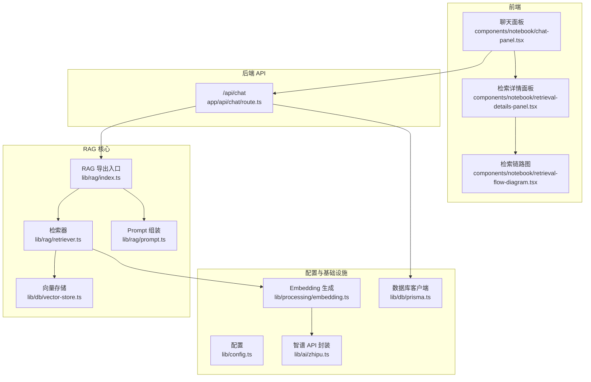
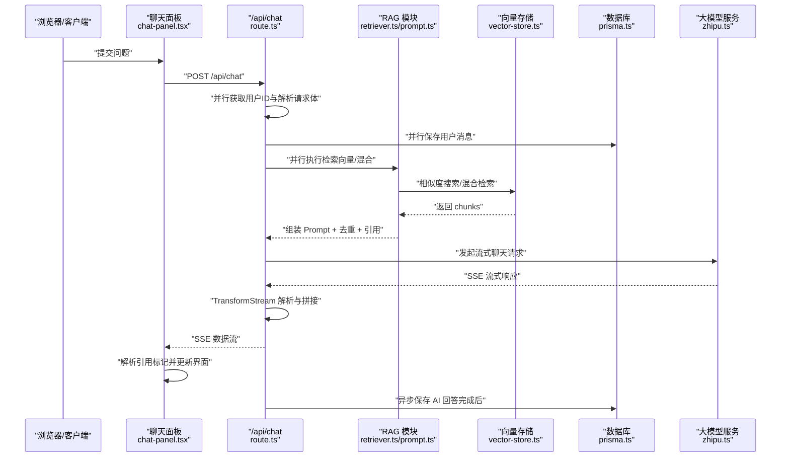
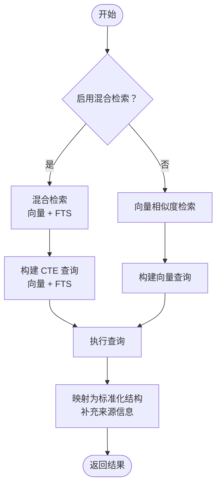
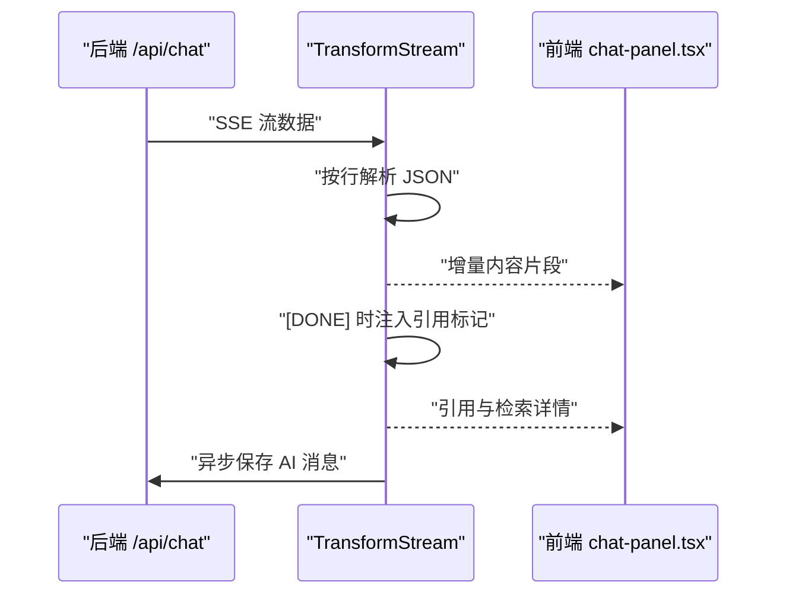
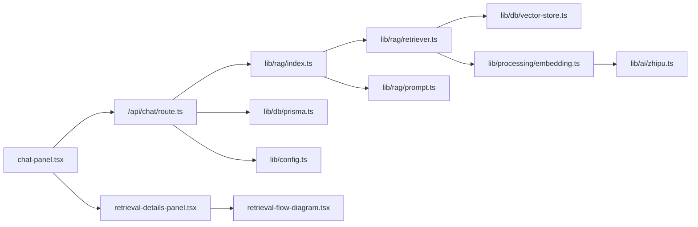

# RAG 工作流程

<cite>
**本文档引用的文件**
- [app/api/chat/route.ts](file://app/api/chat/route.ts)
- [lib/rag/index.ts](file://lib/rag/index.ts)
- [lib/rag/retriever.ts](file://lib/rag/retriever.ts)
- [lib/rag/prompt.ts](file://lib/rag/prompt.ts)
- [lib/db/vector-store.ts](file://lib/db/vector-store.ts)
- [lib/config.ts](file://lib/config.ts)
- [lib/db/prisma.ts](file://lib/db/prisma.ts)
- [lib/processing/embedding.ts](file://lib/processing/embedding.ts)
- [lib/ai/zhipu.ts](file://lib/ai/zhipu.ts)
- [components/notebook/chat-panel.tsx](file://components/notebook/chat-panel.tsx)
- [components/notebook/retrieval-details-panel.tsx](file://components/notebook/retrieval-details-panel.tsx)
- [components/notebook/retrieval-flow-diagram.tsx](file://components/notebook/retrieval-flow-diagram.tsx)
</cite>

## 目录
1. [简介](#简介)
2. [项目结构](#项目结构)
3. [核心组件](#核心组件)
4. [架构总览](#架构总览)
5. [详细组件分析](#详细组件分析)
6. [依赖关系分析](#依赖关系分析)
7. [性能考量](#性能考量)
8. [故障排查指南](#故障排查指南)
9. [结论](#结论)
10. [附录](#附录)

## 简介
本文件面向开发者，系统性阐述从用户提问到生成回答的 RAG 工作流程，覆盖查询理解、并行处理、检索执行、混合检索策略、以及流式响应（SSE）实现。文档通过代码级图示与路径引用，帮助读者快速定位实现细节并进行二次开发。

## 项目结构
该仓库采用前后端同构的 Next.js 项目结构，RAG 相关逻辑集中在后端 API 与 lib 层，前端通过组件消费流式响应并展示检索详情。

图表来源
- [app/api/chat/route.ts](file://app/api/chat/route.ts#L25-L323)
- [lib/rag/index.ts](file://lib/rag/index.ts#L1-L24)
- [lib/rag/retriever.ts](file://lib/rag/retriever.ts#L53-L206)
- [lib/rag/prompt.ts](file://lib/rag/prompt.ts#L62-L88)
- [lib/db/vector-store.ts](file://lib/db/vector-store.ts#L77-L446)
- [lib/config.ts](file://lib/config.ts#L1-L187)
- [lib/db/prisma.ts](file://lib/db/prisma.ts#L1-L41)
- [lib/processing/embedding.ts](file://lib/processing/embedding.ts#L140-L189)
- [lib/ai/zhipu.ts](file://lib/ai/zhipu.ts#L53-L101)
- [components/notebook/chat-panel.tsx](file://components/notebook/chat-panel.tsx#L196-L300)
- [components/notebook/retrieval-details-panel.tsx](file://components/notebook/retrieval-details-panel.tsx#L42-L158)
- [components/notebook/retrieval-flow-diagram.tsx](file://components/notebook/retrieval-flow-diagram.tsx#L16-L51)

章节来源
- [app/api/chat/route.ts](file://app/api/chat/route.ts#L25-L323)
- [lib/rag/index.ts](file://lib/rag/index.ts#L1-L24)
- [lib/rag/retriever.ts](file://lib/rag/retriever.ts#L53-L206)
- [lib/rag/prompt.ts](file://lib/rag/prompt.ts#L62-L88)
- [lib/db/vector-store.ts](file://lib/db/vector-store.ts#L77-L446)
- [lib/config.ts](file://lib/config.ts#L1-L187)
- [lib/db/prisma.ts](file://lib/db/prisma.ts#L1-L41)
- [lib/processing/embedding.ts](file://lib/processing/embedding.ts#L140-L189)
- [lib/ai/zhipu.ts](file://lib/ai/zhipu.ts#L53-L101)
- [components/notebook/chat-panel.tsx](file://components/notebook/chat-panel.tsx#L196-L300)
- [components/notebook/retrieval-details-panel.tsx](file://components/notebook/retrieval-details-panel.tsx#L42-L158)
- [components/notebook/retrieval-flow-diagram.tsx](file://components/notebook/retrieval-flow-diagram.tsx#L16-L51)

## 核心组件
- 查询理解与准备：从请求中提取用户消息、验证 Notebook 权限、解析模型配置。
- 并行处理：用户消息持久化与检索并行执行，提升整体吞吐。
- 检索执行：支持向量检索与混合检索（向量 + 全文），并进行去重与评分。
- Prompt 组装：构造系统提示、历史对话与上下文，形成最终消息序列。
- 流式响应：使用 TransformStream 将大模型流式输出拆分为可消费的片段，同时注入引用标记。
- 引用与详情：前端解析引用标记并展示检索详情与链路可视化。

章节来源
- [app/api/chat/route.ts](file://app/api/chat/route.ts#L25-L323)
- [lib/rag/retriever.ts](file://lib/rag/retriever.ts#L53-L206)
- [lib/rag/prompt.ts](file://lib/rag/prompt.ts#L62-L88)
- [components/notebook/chat-panel.tsx](file://components/notebook/chat-panel.tsx#L196-L300)

## 架构总览
下图展示了从用户提问到流式响应的端到端流程，包括并行策略、检索策略选择与流式传输机制。

图表来源
- [app/api/chat/route.ts](file://app/api/chat/route.ts#L25-L323)
- [lib/rag/retriever.ts](file://lib/rag/retriever.ts#L53-L206)
- [lib/rag/prompt.ts](file://lib/rag/prompt.ts#L62-L88)
- [lib/db/vector-store.ts](file://lib/db/vector-store.ts#L175-L442)
- [lib/db/prisma.ts](file://lib/db/prisma.ts#L1-L41)
- [lib/ai/zhipu.ts](file://lib/ai/zhipu.ts#L136-L156)
- [components/notebook/chat-panel.tsx](file://components/notebook/chat-panel.tsx#L196-L300)

## 详细组件分析

### 查询理解与并行处理
- 用户身份与权限校验：通过认证服务获取当前用户 ID，并校验 Notebook 所有权。
- 请求体解析与模型配置：解析 messages、notebookId、selectedSourceIds、mode；根据 mode 获取模型配置。
- 并行策略：
  - 并行获取用户 ID 与请求体，避免串行阻塞。
  - 并行保存用户消息与检索执行，缩短首字节时间。
- 无证据处理：当检索无依据时，直接返回预设回复并记录元数据。

章节来源
- [app/api/chat/route.ts](file://app/api/chat/route.ts#L25-L158)

### 检索执行与混合检索策略
- 检索类型选择：
  - 若启用混合检索，则调用混合检索；否则走向量相似度检索。
  - 混合检索结合向量相似度与全文检索（FTS），通过权重融合得到综合得分。
- 检索参数：
  - topK 控制返回片段数量；threshold 控制相似度阈值。
  - 支持按 sourceIds 过滤检索范围。
- 结果映射与来源信息：
  - 将向量存储返回的原始 chunk 映射为标准化结构，补充来源标题与类型。
- 性能考量：
  - 向量检索使用 pgvector 的向量距离函数；混合检索使用 CTE 合并向量与 FTS 得分。
  - 按 sourceIds 过滤可显著减少扫描范围。

图表来源
- [lib/rag/retriever.ts](file://lib/rag/retriever.ts#L127-L206)
- [lib/db/vector-store.ts](file://lib/db/vector-store.ts#L312-L442)

章节来源
- [lib/rag/retriever.ts](file://lib/rag/retriever.ts#L53-L206)
- [lib/db/vector-store.ts](file://lib/db/vector-store.ts#L175-L442)

### Prompt 组装与引用生成
- 上下文构建：将检索到的 chunks 按编号组织为参考资料，包含来源信息与相似度。
- 历史对话：截取最近若干条历史消息，增强上下文连贯性。
- 引用去重：以内容前 100 字为键进行去重，保留相似度更高的片段，确保引用质量。

章节来源
- [lib/rag/prompt.ts](file://lib/rag/prompt.ts#L37-L88)
- [lib/rag/prompt.ts](file://lib/rag/prompt.ts#L112-L148)

### 流式响应与 SSE 实现
- SSE 协议应用：后端以 text/event-stream 返回，前端使用 ReadableStream 与 TransformStream 实时消费。
- TransformStream 处理：
  - 将底层流按行切分，解析 JSON 片段，提取 content 或 reasoning_content 字段。
  - 在流结束时注入引用标记与检索详情，随后异步保存 AI 回答。
- 前端消费：
  - 识别 __CITATIONS__ 标记，解析 JSON 并更新引用与检索详情。
  - 支持长猫模型的 reasoning_content 字段特殊处理。

图表来源
- [app/api/chat/route.ts](file://app/api/chat/route.ts#L208-L314)
- [components/notebook/chat-panel.tsx](file://components/notebook/chat-panel.tsx#L234-L288)

章节来源
- [app/api/chat/route.ts](file://app/api/chat/route.ts#L208-L314)
- [components/notebook/chat-panel.tsx](file://components/notebook/chat-panel.tsx#L234-L288)

### 引用与检索详情展示
- 引用列表：按相似度排序展示来源卡片，支持高亮与点击跳转。
- 检索详情面板：展示检索参数、召回片段、链路可视化（时序步骤）。
- 链路可视化：包含“向量化”“混合检索”“召回片段”“生成回答”等阶段及耗时。

章节来源
- [components/notebook/chat-panel.tsx](file://components/notebook/chat-panel.tsx#L481-L537)
- [components/notebook/retrieval-details-panel.tsx](file://components/notebook/retrieval-details-panel.tsx#L42-L158)
- [components/notebook/retrieval-flow-diagram.tsx](file://components/notebook/retrieval-flow-diagram.tsx#L16-L51)

## 依赖关系分析
- 组件耦合与职责分离：
  - /api/chat 聚合 RAG 与数据库交互，负责并行与流式控制。
  - RAG 模块专注于检索与 Prompt 组装，保持纯函数特性。
  - 向量存储抽象与数据库适配层清晰，便于替换实现。
- 外部依赖：
  - 智谱 AI Embedding 与 Chat API。
  - PostgreSQL + pgvector + FTS。
  - Next.js Serverless 环境下的连接池配置。

图表来源
- [app/api/chat/route.ts](file://app/api/chat/route.ts#L12-L20)
- [lib/rag/index.ts](file://lib/rag/index.ts#L5-L23)
- [lib/rag/retriever.ts](file://lib/rag/retriever.ts#L1-L4)
- [lib/db/vector-store.ts](file://lib/db/vector-store.ts#L1-L4)
- [lib/processing/embedding.ts](file://lib/processing/embedding.ts#L6-L7)
- [lib/ai/zhipu.ts](file://lib/ai/zhipu.ts#L8)
- [lib/db/prisma.ts](file://lib/db/prisma.ts#L1-L3)
- [lib/config.ts](file://lib/config.ts#L6-L7)
- [components/notebook/chat-panel.tsx](file://components/notebook/chat-panel.tsx#L1-L16)
- [components/notebook/retrieval-details-panel.tsx](file://components/notebook/retrieval-details-panel.tsx#L1-L7)
- [components/notebook/retrieval-flow-diagram.tsx](file://components/notebook/retrieval-flow-diagram.tsx#L1-L3)

章节来源
- [app/api/chat/route.ts](file://app/api/chat/route.ts#L12-L20)
- [lib/rag/index.ts](file://lib/rag/index.ts#L5-L23)
- [lib/rag/retriever.ts](file://lib/rag/retriever.ts#L1-L4)
- [lib/db/vector-store.ts](file://lib/db/vector-store.ts#L1-L4)
- [lib/processing/embedding.ts](file://lib/processing/embedding.ts#L6-L7)
- [lib/ai/zhipu.ts](file://lib/ai/zhipu.ts#L8)
- [lib/db/prisma.ts](file://lib/db/prisma.ts#L1-L3)
- [lib/config.ts](file://lib/config.ts#L6-L7)
- [components/notebook/chat-panel.tsx](file://components/notebook/chat-panel.tsx#L1-L16)
- [components/notebook/retrieval-details-panel.tsx](file://components/notebook/retrieval-details-panel.tsx#L1-L7)
- [components/notebook/retrieval-flow-diagram.tsx](file://components/notebook/retrieval-flow-diagram.tsx#L1-L3)

## 性能考量
- 并行策略
  - 用户消息保存与检索并行，降低首字节时间。
  - 检索与嵌入生成并行，充分利用 I/O 时间。
- 检索优化
  - 向量检索使用 pgvector 的向量距离函数，混合检索通过 CTE 合并向量与 FTS 得分，避免重复计算。
  - 按 sourceIds 过滤可显著减少扫描范围，提升检索效率。
- 流式传输
  - 使用 TransformStream 逐块解析，避免一次性缓冲大量数据。
  - SSE 协议适合长连接与低延迟场景。
- 向量维度与批处理
  - 强制向量维度为 1024（Embedding-3），确保与数据库一致。
  - 批量插入与批量生成 Embedding，减少网络往返与数据库压力。

章节来源
- [app/api/chat/route.ts](file://app/api/chat/route.ts#L29-L96)
- [lib/db/vector-store.ts](file://lib/db/vector-store.ts#L175-L442)
- [lib/processing/embedding.ts](file://lib/processing/embedding.ts#L140-L189)
- [lib/config.ts](file://lib/config.ts#L6-L29)

## 故障排查指南
- 常见错误与定位
  - 未登录/无权访问：检查认证与 Notebook 所有权校验。
  - 缺少必要参数：确认 messages、notebookId、selectedSourceIds 是否齐全。
  - LLM API 错误：检查模型配置、API Key、网络连通性。
  - 向量维度不匹配：确认 EMBEDDING_DIM 与 Embedding-3 一致。
- 日志与监控
  - 后端打印检索与生成耗时，前端展示检索详情面板，便于定位瓶颈。
  - 数据库层记录向量操作日志，便于审计与排错。

章节来源
- [app/api/chat/route.ts](file://app/api/chat/route.ts#L35-L66)
- [app/api/chat/route.ts](file://app/api/chat/route.ts#L202-L206)
- [lib/config.ts](file://lib/config.ts#L18-L29)
- [lib/db/vector-store.ts](file://lib/db/vector-store.ts#L263-L296)

## 结论
本项目通过严格的并行策略、混合检索与流式响应机制，实现了低延迟、高质量的 RAG 问答体验。前端与后端职责清晰，RAG 模块可独立演进，具备良好的扩展性与可维护性。

## 附录
- 关键实现路径参考
  - 查询理解与并行处理：[app/api/chat/route.ts](file://app/api/chat/route.ts#L25-L96)
  - 检索执行与混合检索：[lib/rag/retriever.ts](file://lib/rag/retriever.ts#L127-L206)、[lib/db/vector-store.ts](file://lib/db/vector-store.ts#L312-L442)
  - Prompt 组装与引用生成：[lib/rag/prompt.ts](file://lib/rag/prompt.ts#L37-L88)、[lib/rag/prompt.ts](file://lib/rag/prompt.ts#L112-L148)
  - 流式响应与 SSE：[app/api/chat/route.ts](file://app/api/chat/route.ts#L208-L314)、[components/notebook/chat-panel.tsx](file://components/notebook/chat-panel.tsx#L234-L288)
  - 引用与检索详情展示：[components/notebook/chat-panel.tsx](file://components/notebook/chat-panel.tsx#L481-L537)、[components/notebook/retrieval-details-panel.tsx](file://components/notebook/retrieval-details-panel.tsx#L42-L158)、[components/notebook/retrieval-flow-diagram.tsx](file://components/notebook/retrieval-flow-diagram.tsx#L16-L51)
  - 配置与基础设施：[lib/config.ts](file://lib/config.ts#L1-L187)、[lib/db/prisma.ts](file://lib/db/prisma.ts#L1-L41)、[lib/processing/embedding.ts](file://lib/processing/embedding.ts#L140-L189)、[lib/ai/zhipu.ts](file://lib/ai/zhipu.ts#L53-L101)