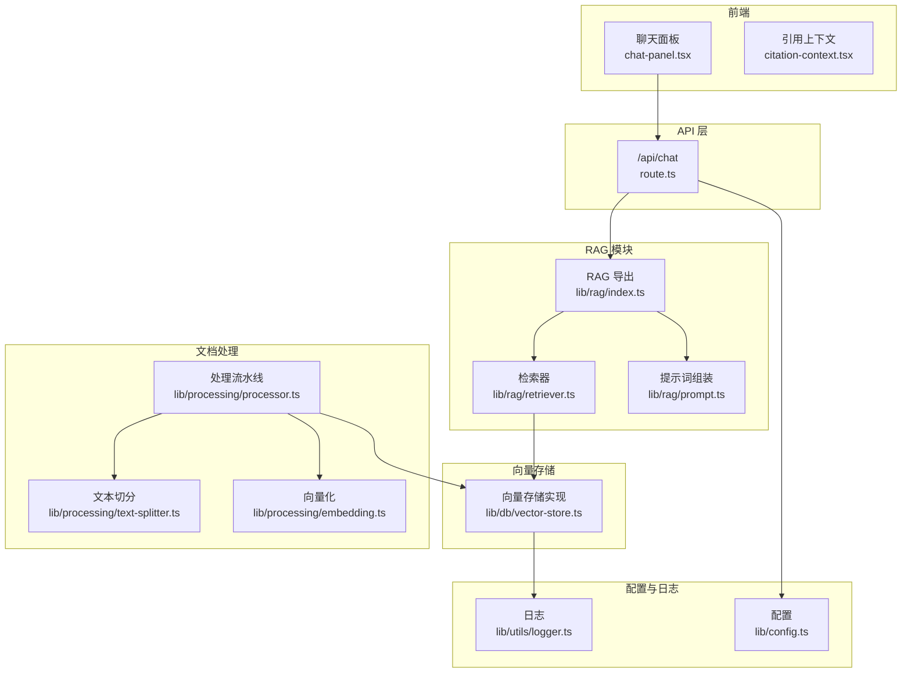
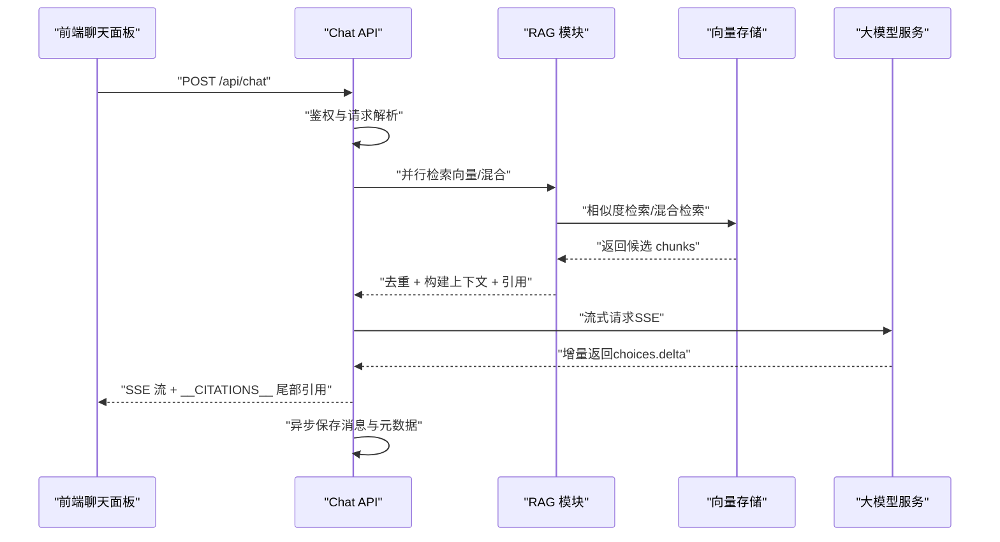
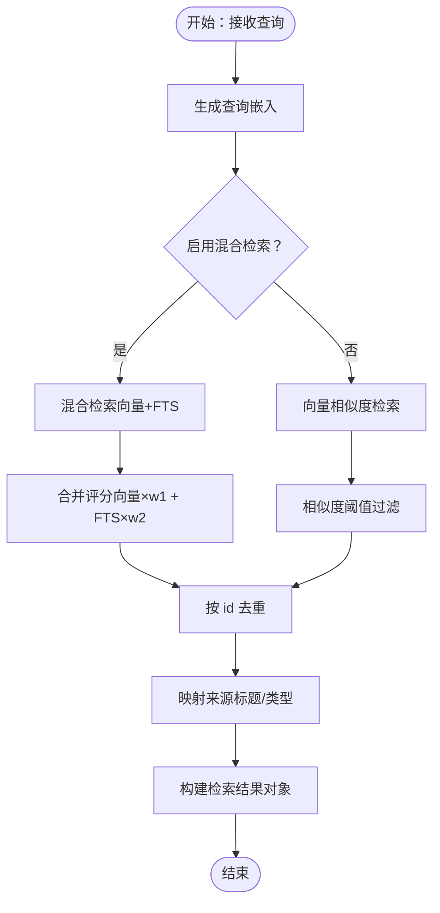
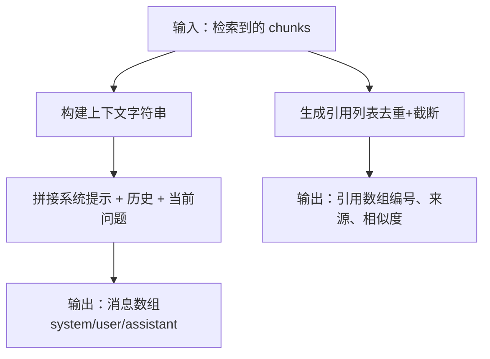
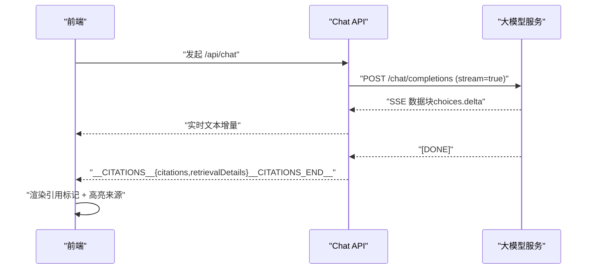
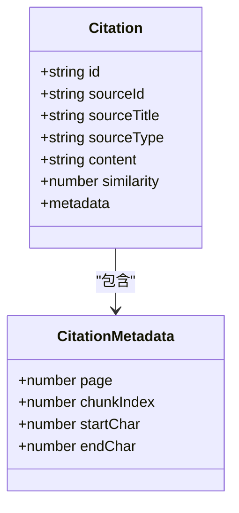
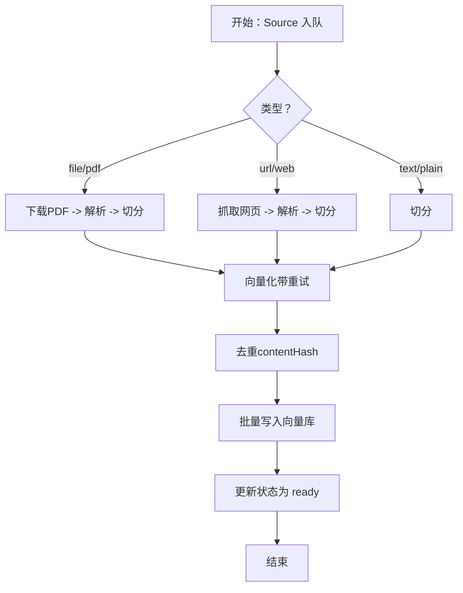
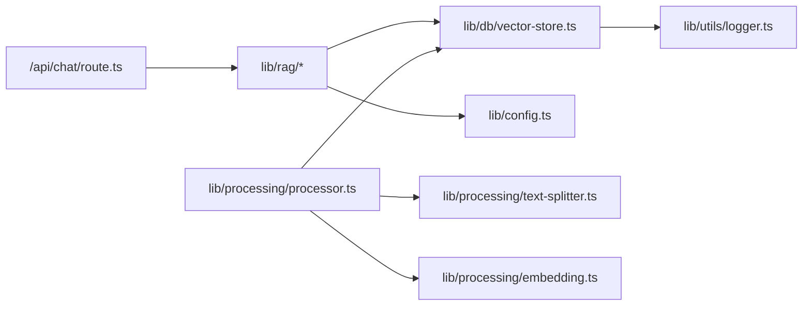

# RAG 问答系统

<cite>
**本文引用的文件**
- [app/api/chat/route.ts](file://app/api/chat/route.ts)
- [lib/rag/index.ts](file://lib/rag/index.ts)
- [lib/rag/retriever.ts](file://lib/rag/retriever.ts)
- [lib/rag/prompt.ts](file://lib/rag/prompt.ts)
- [lib/db/vector-store.ts](file://lib/db/vector-store.ts)
- [lib/config.ts](file://lib/config.ts)
- [lib/processing/processor.ts](file://lib/processing/processor.ts)
- [lib/processing/embedding.ts](file://lib/processing/embedding.ts)
- [lib/processing/text-splitter.ts](file://lib/processing/text-splitter.ts)
- [lib/utils/logger.ts](file://lib/utils/logger.ts)
- [components/notebook/chat-panel.tsx](file://components/notebook/chat-panel.tsx)
- [components/notebook/citation-context.tsx](file://components/notebook/citation-context.tsx)
- [types/index.ts](file://types/index.ts)
</cite>

## 目录
1. [简介](#简介)
2. [项目结构](#项目结构)
3. [核心组件](#核心组件)
4. [架构总览](#架构总览)
5. [详细组件分析](#详细组件分析)
6. [依赖关系分析](#依赖关系分析)
7. [性能考量](#性能考量)
8. [故障排查指南](#故障排查指南)
9. [结论](#结论)
10. [附录](#附录)

## 简介
本文件面向 notebookLM-clone 项目中的 RAG（检索增强生成）问答系统，系统性梳理从“查询理解、向量检索、上下文组装、生成回答”到“引用溯源、流式输出、性能优化、错误处理”的完整链路。文档以代码为依据，结合架构图与流程图，帮助开发者快速理解与扩展问答能力。

## 项目结构
RAG 问答系统主要由以下层次构成：
- API 层：负责鉴权、请求解析、并行检索、流式生成与持久化
- RAG 模块：检索策略、上下文与提示词组装、引用生成
- 向量存储层：向量/全文检索、混合检索、批量写入与去重
- 文档处理流水线：PDF/URL/文本解析、切分、向量化、入库
- 前端组件：聊天面板、引用上下文、检索详情面板
- 配置与日志：模型配置、环境校验、统一日志

图表来源
- [app/api/chat/route.ts](file://app/api/chat/route.ts#L25-L324)
- [lib/rag/index.ts](file://lib/rag/index.ts#L1-L24)
- [lib/rag/retriever.ts](file://lib/rag/retriever.ts#L1-L206)
- [lib/rag/prompt.ts](file://lib/rag/prompt.ts#L1-L149)
- [lib/db/vector-store.ts](file://lib/db/vector-store.ts#L1-L446)
- [lib/processing/processor.ts](file://lib/processing/processor.ts#L1-L560)
- [lib/processing/text-splitter.ts](file://lib/processing/text-splitter.ts#L1-L270)
- [lib/processing/embedding.ts](file://lib/processing/embedding.ts#L1-L189)
- [lib/config.ts](file://lib/config.ts#L1-L187)
- [lib/utils/logger.ts](file://lib/utils/logger.ts#L1-L98)

章节来源
- [app/api/chat/route.ts](file://app/api/chat/route.ts#L25-L324)
- [lib/rag/index.ts](file://lib/rag/index.ts#L1-L24)
- [lib/rag/retriever.ts](file://lib/rag/retriever.ts#L1-L206)
- [lib/rag/prompt.ts](file://lib/rag/prompt.ts#L1-L149)
- [lib/db/vector-store.ts](file://lib/db/vector-store.ts#L1-L446)
- [lib/processing/processor.ts](file://lib/processing/processor.ts#L1-L560)
- [lib/processing/text-splitter.ts](file://lib/processing/text-splitter.ts#L1-L270)
- [lib/processing/embedding.ts](file://lib/processing/embedding.ts#L1-L189)
- [lib/config.ts](file://lib/config.ts#L1-L187)
- [lib/utils/logger.ts](file://lib/utils/logger.ts#L1-L98)

## 核心组件
- 检索器：支持向量检索、混合检索（向量+全文）、去重与结果评分
- 提示词组装：系统提示、上下文注入、历史对话拼接、引用生成
- 向量存储：批量写入、相似度检索、混合检索（向量+FTS）、日志记录
- 文档处理：PDF/URL/文本解析、递归切分、向量化、入库与去重
- API：鉴权校验、并行检索与消息保存、流式生成、引用与元数据持久化
- 前端：流式渲染、引用标记点击、检索详情面板、模型选择

章节来源
- [lib/rag/retriever.ts](file://lib/rag/retriever.ts#L53-L206)
- [lib/rag/prompt.ts](file://lib/rag/prompt.ts#L37-L149)
- [lib/db/vector-store.ts](file://lib/db/vector-store.ts#L77-L446)
- [lib/processing/processor.ts](file://lib/processing/processor.ts#L82-L560)
- [app/api/chat/route.ts](file://app/api/chat/route.ts#L25-L324)
- [components/notebook/chat-panel.tsx](file://components/notebook/chat-panel.tsx#L60-L675)

## 架构总览
RAG 问答链路由“前端 -> API -> 检索 -> 组装提示 -> 流式生成 -> 引用与元数据持久化”构成，支持混合检索与流式输出，前端实时渲染并支持引用高亮与检索详情查看。

图表来源
- [app/api/chat/route.ts](file://app/api/chat/route.ts#L25-L324)
- [lib/rag/retriever.ts](file://lib/rag/retriever.ts#L53-L206)
- [lib/rag/prompt.ts](file://lib/rag/prompt.ts#L62-L88)
- [lib/db/vector-store.ts](file://lib/db/vector-store.ts#L175-L442)

## 详细组件分析

### 检索策略与实现
- 检索类型与参数
  - 向量检索：基于嵌入相似度，支持 topK 与阈值过滤
  - 混合检索：向量相似度与全文检索（FTS）加权融合，提升召回质量
  - 去重：按 chunk id 去重，确保上下文唯一性
- 关键实现要点
  - 查询嵌入生成与时间统计
  - 混合检索评分结构化返回（向量/FTS/合并）
  - 源信息映射与来源标题/类型补全
- 参数配置
  - topK、相似度阈值、是否启用混合检索、向量与 FTS 权重等集中配置

图表来源
- [lib/rag/retriever.ts](file://lib/rag/retriever.ts#L53-L206)
- [lib/db/vector-store.ts](file://lib/db/vector-store.ts#L175-L442)

章节来源
- [lib/rag/retriever.ts](file://lib/rag/retriever.ts#L6-L13)
- [lib/rag/retriever.ts](file://lib/rag/retriever.ts#L53-L206)
- [lib/db/vector-store.ts](file://lib/db/vector-store.ts#L312-L442)

### 上下文组装与提示词工程
- 上下文构建
  - 为每个 chunk 注入编号与来源信息（文件页码、URL 等）
  - 显示相似度百分比，便于溯源与可信度评估
- 提示词工程
  - 系统提示强调“仅基于参考资料回答、明确标注引用、清晰专业语言”
  - 历史对话最多保留最近若干条，避免上下文溢出
  - 将上下文与用户问题拼接为最终消息数组
- 引用生成
  - 基于相似度排序，按内容前 100 字去重，保留最高相似度
  - 截断引用内容长度，保留关键信息

图表来源
- [lib/rag/prompt.ts](file://lib/rag/prompt.ts#L37-L88)
- [lib/rag/prompt.ts](file://lib/rag/prompt.ts#L112-L149)

章节来源
- [lib/rag/prompt.ts](file://lib/rag/prompt.ts#L10-L32)
- [lib/rag/prompt.ts](file://lib/rag/prompt.ts#L37-L88)
- [lib/rag/prompt.ts](file://lib/rag/prompt.ts#L112-L149)

### 流式输出与前端交互
- API 层流式生成
  - 通过 SSE 将大模型增量返回内容实时推送到前端
  - 在流结束时发送特殊标记携带引用与检索详情
  - 支持长猫推理模型的 reasoning_content 字段兼容
- 前端渲染
  - 使用流式读取器解析数据片段，动态更新消息内容
  - 引用标记 [1]、[2] 等渲染为可点击按钮，支持高亮与定位
  - 支持查看检索详情面板，展示检索参数、耗时与命中 chunk

图表来源
- [app/api/chat/route.ts](file://app/api/chat/route.ts#L172-L314)
- [components/notebook/chat-panel.tsx](file://components/notebook/chat-panel.tsx#L234-L299)

章节来源
- [app/api/chat/route.ts](file://app/api/chat/route.ts#L172-L314)
- [components/notebook/chat-panel.tsx](file://components/notebook/chat-panel.tsx#L196-L300)

### 引用溯源机制
- 引用数据结构
  - 包含 chunk id、来源 id、标题、类型、相似度、片段截取、定位信息（页码/字符区间）
- 生成策略
  - 按相似度降序，以内容前 100 字为去重键，保留最高相似度
  - 截断引用内容长度，便于阅读与节省上下文
- 前端交互
  - 引用标记点击触发高亮与侧边栏详情展示
  - 支持按编号快速定位到对应来源

图表来源
- [lib/rag/prompt.ts](file://lib/rag/prompt.ts#L93-L106)
- [components/notebook/citation-context.tsx](file://components/notebook/citation-context.tsx#L12-L27)

章节来源
- [lib/rag/prompt.ts](file://lib/rag/prompt.ts#L93-L149)
- [components/notebook/citation-context.tsx](file://components/notebook/citation-context.tsx#L1-L98)
- [types/index.ts](file://types/index.ts#L22-L39)

### 文档处理流水线（入库前）
- 处理阶段
  - PDF：下载 -> 解析 -> 切分 -> 向量 -> 写库
  - URL：抓取 -> 解析 -> 切分 -> 向量 -> 写库
  - 文本：切分 -> 向量 -> 写库
- 关键优化
  - 递归切分器优先按章节/段落/句子切分，保留语义边界
  - 批量向量化与指数退避重试，降低失败率
  - Source 内去重：基于 contentHash，避免重复入库
- 日志与可观测性
  - 各阶段耗时、字数/页数/块数、token 使用量等

图表来源
- [lib/processing/processor.ts](file://lib/processing/processor.ts#L82-L560)
- [lib/processing/text-splitter.ts](file://lib/processing/text-splitter.ts#L83-L264)
- [lib/processing/embedding.ts](file://lib/processing/embedding.ts#L140-L189)

章节来源
- [lib/processing/processor.ts](file://lib/processing/processor.ts#L82-L560)
- [lib/processing/text-splitter.ts](file://lib/processing/text-splitter.ts#L1-L270)
- [lib/processing/embedding.ts](file://lib/processing/embedding.ts#L1-L189)

## 依赖关系分析
- 模块耦合
  - API 层依赖 RAG 模块与配置；RAG 模块依赖向量存储与配置
  - 文档处理流水线独立运行，通过向量存储与数据库交互
- 外部依赖
  - 大模型服务（智谱/长猫），向量维度与模型需严格匹配
  - 数据库（PostgreSQL + 向量扩展），支持 HNSW/FTS
- 循环依赖
  - 未发现循环依赖，各模块职责清晰

图表来源
- [app/api/chat/route.ts](file://app/api/chat/route.ts#L11-L20)
- [lib/rag/index.ts](file://lib/rag/index.ts#L5-L23)
- [lib/db/vector-store.ts](file://lib/db/vector-store.ts#L1-L4)
- [lib/config.ts](file://lib/config.ts#L6-L7)
- [lib/processing/processor.ts](file://lib/processing/processor.ts#L10-L17)
- [lib/utils/logger.ts](file://lib/utils/logger.ts#L1-L4)

章节来源
- [app/api/chat/route.ts](file://app/api/chat/route.ts#L11-L20)
- [lib/rag/index.ts](file://lib/rag/index.ts#L5-L23)
- [lib/db/vector-store.ts](file://lib/db/vector-store.ts#L1-L4)
- [lib/config.ts](file://lib/config.ts#L6-L7)
- [lib/processing/processor.ts](file://lib/processing/processor.ts#L10-L17)
- [lib/utils/logger.ts](file://lib/utils/logger.ts#L1-L4)

## 性能考量
- 检索性能
  - 向量检索使用 CTE 避免重复计算，支持按 sourceIds 过滤
  - 混合检索在 SQL 中统一计算向量与 FTS 评分并加权
  - topK 与阈值参数可调，平衡召回与性能
- 写入性能
  - 向量库批量写入（每批上限），减少往返开销
  - Source 内 contentHash 去重，避免重复写入
- 生成性能
  - 流式输出降低首字节延迟，提升交互体验
  - 前端按需渲染，避免一次性渲染大量 DOM
- 资源管理
  - API 层最大执行时长限制，避免冷启动与超时
  - 指数退避重试与最大批大小控制，防止 API 限流

章节来源
- [lib/db/vector-store.ts](file://lib/db/vector-store.ts#L105-L173)
- [lib/db/vector-store.ts](file://lib/db/vector-store.ts#L215-L297)
- [lib/db/vector-store.ts](file://lib/db/vector-store.ts#L363-L442)
- [lib/processing/embedding.ts](file://lib/processing/embedding.ts#L140-L189)
- [app/api/chat/route.ts](file://app/api/chat/route.ts#L22-L23)

## 故障排查指南
- 常见错误与定位
  - 向量维度不匹配：启动时强制校验维度，需与数据库向量维度一致
  - LLM API 错误：捕获响应状态与错误文本，记录到日志
  - 检索失败：向量存储层记录查询/写入日志，包含耗时与平均相似度
- 日志与监控
  - 统一日志工具仅在开发环境输出，生产环境静默
  - 向量操作日志包含操作类型、耗时、成功与否与关键元数据
- 恢复策略
  - 文档处理失败会记录阶段日志与错误信息，便于重试与修复
  - 向量写入失败会抛出异常并记录错误，避免脏数据

章节来源
- [lib/config.ts](file://lib/config.ts#L9-L29)
- [lib/utils/logger.ts](file://lib/utils/logger.ts#L75-L94)
- [lib/db/vector-store.ts](file://lib/db/vector-store.ts#L157-L172)
- [lib/db/vector-store.ts](file://lib/db/vector-store.ts#L282-L296)
- [app/api/chat/route.ts](file://app/api/chat/route.ts#L202-L206)

## 结论
该 RAG 问答系统以“混合检索 + 流式生成 + 引用溯源”为核心，结合严格的向量维度校验、批量写入与指数退避重试等工程实践，实现了稳定高效的问答体验。前端通过引用标记与检索详情面板增强了可解释性与可追溯性。建议在生产环境中持续关注检索参数调优、缓存与并发控制，以进一步提升吞吐与稳定性。

## 附录

### API 使用示例与集成指南
- 聊天接口（流式）
  - 方法与路径：POST /api/chat
  - 请求体字段：messages（消息数组）、notebookId（笔记本 ID）、selectedSourceIds（可选）、mode（模型标识）
  - 响应：SSE 流，结束时携带 __CITATIONS__ 引用与检索详情
- 建议问题接口
  - 方法与路径：POST /api/notebooks/{id}/suggest
  - 用途：初始化聊天时加载建议问题
- 集成步骤
  - 前端：使用 fetch 发起 /api/chat，读取流并解析 __CITATIONS__ 尾部数据
  - 后端：鉴权校验、并行检索、构建提示词、流式调用大模型、异步保存消息

章节来源
- [app/api/chat/route.ts](file://app/api/chat/route.ts#L25-L324)
- [components/notebook/chat-panel.tsx](file://components/notebook/chat-panel.tsx#L81-L101)