# 引用溯源机制

<cite>
**本文档引用的文件**
- [citation-context.tsx](file://components/notebook/citation-context.tsx)
- [chat-panel.tsx](file://components/notebook/chat-panel.tsx)
- [source-sidebar.tsx](file://components/notebook/source-sidebar.tsx)
- [retrieval-details-panel.tsx](file://components/notebook/retrieval-details-panel.tsx)
- [retrieval-flow-diagram.tsx](file://components/notebook/retrieval-flow-diagram.tsx)
- [chunk-card.tsx](file://components/notebook/chunk-card.tsx)
- [route.ts](file://app/api/chat/route.ts)
- [index.ts](file://lib/rag/index.ts)
- [prompt.ts](file://lib/rag/prompt.ts)
- [retriever.ts](file://lib/rag/retriever.ts)
- [vector-store.ts](file://lib/db/vector-store.ts)
- [zhipu.ts](file://lib/ai/zhipu.ts)
- [config.ts](file://lib/config.ts)
</cite>

## 目录
1. [简介](#简介)
2. [项目结构](#项目结构)
3. [核心组件](#核心组件)
4. [架构概览](#架构概览)
5. [详细组件分析](#详细组件分析)
6. [依赖关系分析](#依赖关系分析)
7. [性能考虑](#性能考虑)
8. [故障排除指南](#故障排除指南)
9. [结论](#结论)
10. [附录](#附录)

## 简介

本项目实现了完整的引用溯源机制，为用户提供基于证据的智能问答体验。该机制涵盖了从证据提取、引用格式化到上下文展示的完整流程，确保用户能够追溯每个回答的来源，增强信息的可信度和透明度。

引用溯源机制的核心目标：
- **证据提取**：从知识库中检索相关文档片段
- **引用格式化**：生成规范化的引用标记和来源标注
- **上下文展示**：提供直观的引用面板和高亮显示
- **来源定位**：支持点击跳转到具体的知识源
- **未找到依据**：优雅处理无证据情况并提供用户指导

## 项目结构

项目采用模块化架构，将引用溯源功能分布在多个层次中：

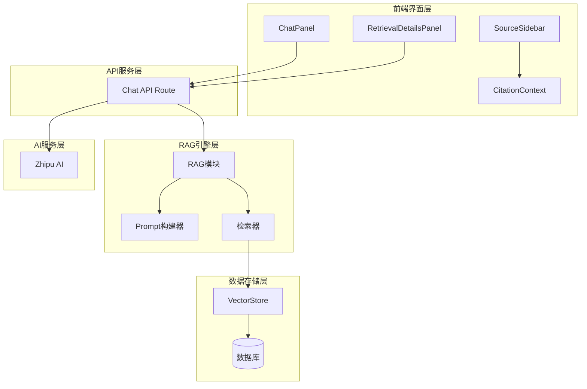

**图表来源**
- [chat-panel.tsx](file://components/notebook/chat-panel.tsx#L60-L412)
- [route.ts](file://app/api/chat/route.ts#L25-L324)
- [index.ts](file://lib/rag/index.ts#L5-L24)

**章节来源**
- [chat-panel.tsx](file://components/notebook/chat-panel.tsx#L60-L412)
- [source-sidebar.tsx](file://components/notebook/source-sidebar.tsx#L49-L317)
- [retrieval-details-panel.tsx](file://components/notebook/retrieval-details-panel.tsx#L42-L159)

## 核心组件

### 引用上下文管理器

引用上下文管理器是整个引用溯源机制的核心，负责管理选中的引用和高亮状态：

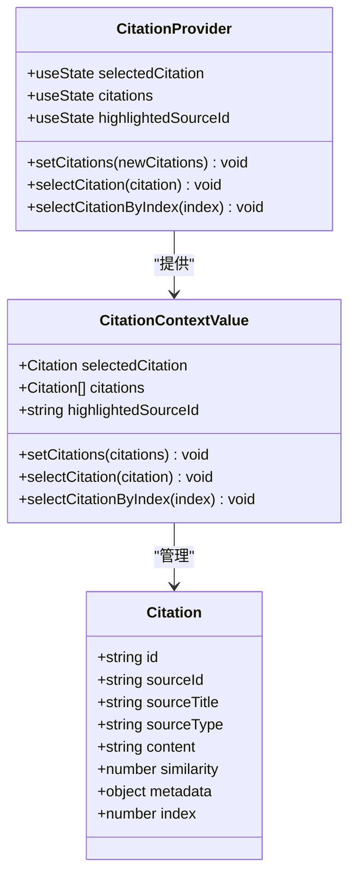

**图表来源**
- [citation-context.tsx](file://components/notebook/citation-context.tsx#L12-L89)

### 检索详情面板

检索详情面板提供了完整的检索过程可视化，包括参数配置、结果统计和链路展示：

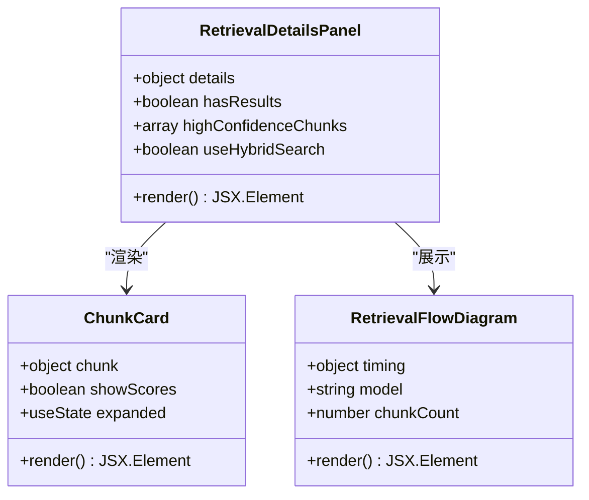

**图表来源**
- [retrieval-details-panel.tsx](file://components/notebook/retrieval-details-panel.tsx#L9-L159)
- [chunk-card.tsx](file://components/notebook/chunk-card.tsx#L9-L94)
- [retrieval-flow-diagram.tsx](file://components/notebook/retrieval-flow-diagram.tsx#L5-L82)

**章节来源**
- [citation-context.tsx](file://components/notebook/citation-context.tsx#L12-L89)
- [retrieval-details-panel.tsx](file://components/notebook/retrieval-details-panel.tsx#L42-L159)

## 架构概览

引用溯源机制采用分层架构设计，确保各组件职责清晰、耦合度低：

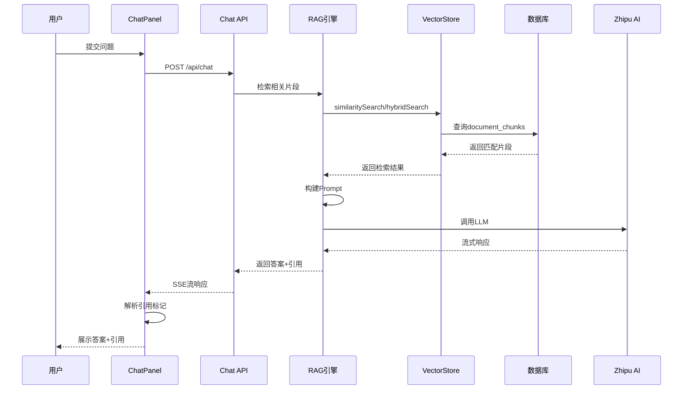

**图表来源**
- [route.ts](file://app/api/chat/route.ts#L79-L324)
- [retriever.ts](file://lib/rag/retriever.ts#L53-L206)
- [vector-store.ts](file://lib/db/vector-store.ts#L175-L446)

## 详细组件分析

### 证据提取算法实现

证据提取是引用溯源的基础，采用混合检索策略确保准确性：

#### 检索配置与权重

系统默认使用混合检索策略，结合向量相似度和全文检索：

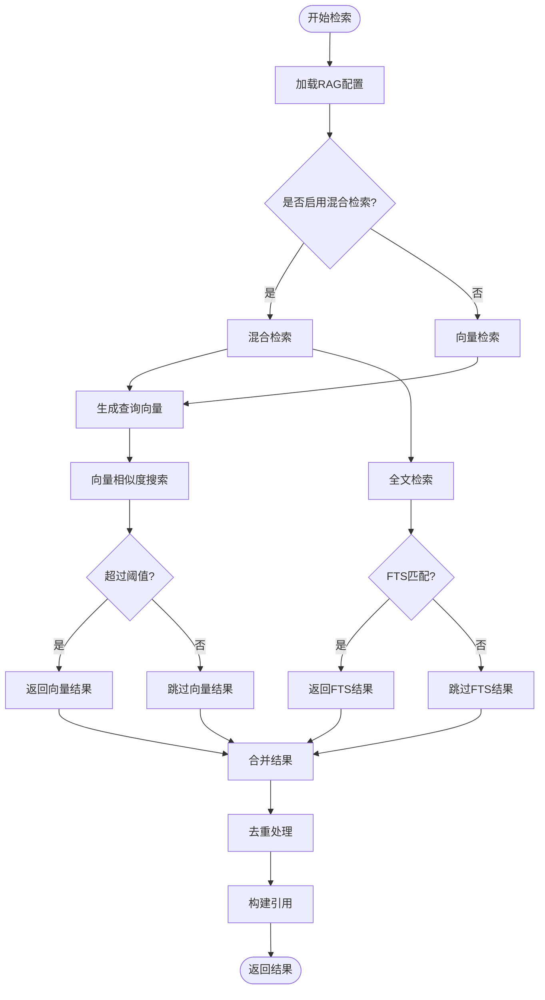

**图表来源**
- [retriever.ts](file://lib/rag/retriever.ts#L6-L206)
- [vector-store.ts](file://lib/db/vector-store.ts#L312-L446)

#### 去重算法设计

引用去重采用内容前缀哈希策略，确保相同内容只保留最高相似度的引用：

**章节来源**
- [retriever.ts](file://lib/rag/retriever.ts#L118-L125)
- [prompt.ts](file://lib/rag/prompt.ts#L112-L148)

### 引用格式化设计

引用格式化遵循严格的规范，确保引用标记的一致性和可追溯性：

#### 引用标记生成

系统使用数字索引生成引用标记，格式为 `[1]`、`[2]` 等：

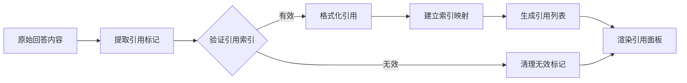

**图表来源**
- [chat-panel.tsx](file://components/notebook/chat-panel.tsx#L604-L659)
- [prompt.ts](file://lib/rag/prompt.ts#L37-L57)

#### 引用元数据提取

每个引用包含完整的元数据信息：

| 元数据字段 | 类型 | 描述 | 示例 |
|------------|------|------|------|
| id | string | 片段唯一标识 | "chunk-123" |
| sourceId | string | 来源文档ID | "source-456" |
| sourceTitle | string | 文档标题 | "机器学习导论" |
| sourceType | enum | 来源类型 | "file" 或 "url" |
| content | string | 片段内容（前150字符） | "机器学习是..." |
| similarity | number | 相似度分数 | 0.85 |
| metadata.page | number | 页面号 | 15 |
| metadata.chunkIndex | number | 片段索引 | 3 |
| metadata.startChar | number | 起始字符位置 | 120 |
| metadata.endChar | number | 结束字符位置 | 250 |

**章节来源**
- [prompt.ts](file://lib/rag/prompt.ts#L93-L106)
- [chat-panel.tsx](file://components/notebook/chat-panel.tsx#L503-L537)

### 引用上下文展示机制

引用上下文展示提供了多种交互方式，确保用户能够轻松理解和导航引用：

#### 引用面板布局

引用面板采用底部浮动布局，包含以下组件：

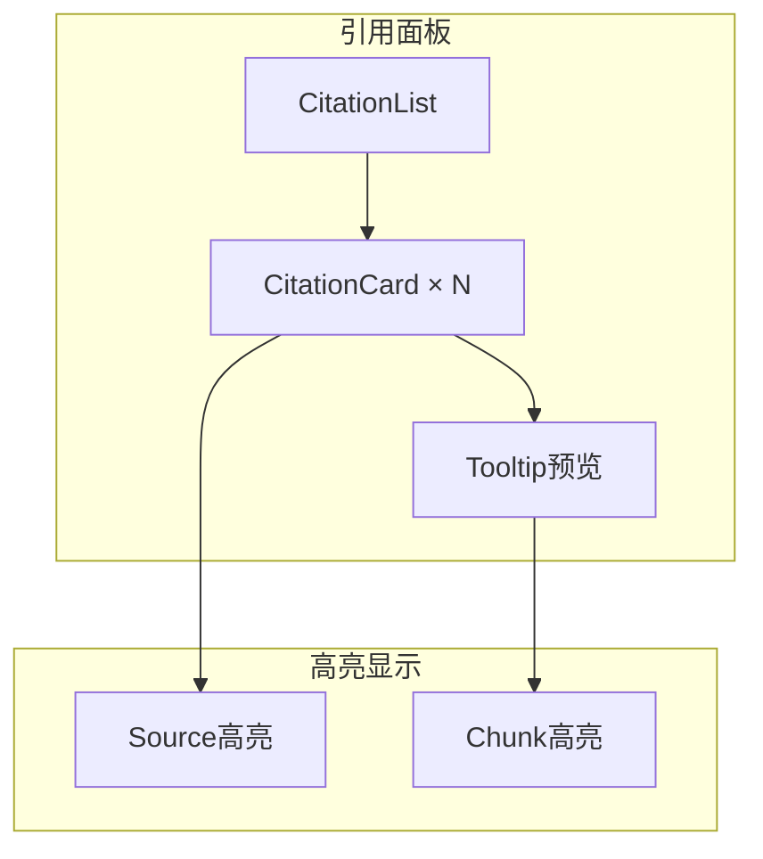

**图表来源**
- [chat-panel.tsx](file://components/notebook/chat-panel.tsx#L481-L537)
- [source-sidebar.tsx](file://components/notebook/source-sidebar.tsx#L148-L167)

#### 高亮显示策略

系统实现了多层次的高亮显示机制：

1. **引用高亮**：点击引用标记时，对应引用卡片高亮显示
2. **来源高亮**：选中引用时，对应来源卡片边框变为橙色
3. **片段高亮**：在知识源中定位到具体的片段位置

**章节来源**
- [chat-panel.tsx](file://components/notebook/chat-panel.tsx#L503-L537)
- [source-sidebar.tsx](file://components/notebook/source-sidebar.tsx#L148-L167)

### 未找到依据处理策略

系统提供了完善的未找到依据情况处理机制：

#### 固定回复生成

当检索不到相关证据时，系统返回标准化的固定回复：

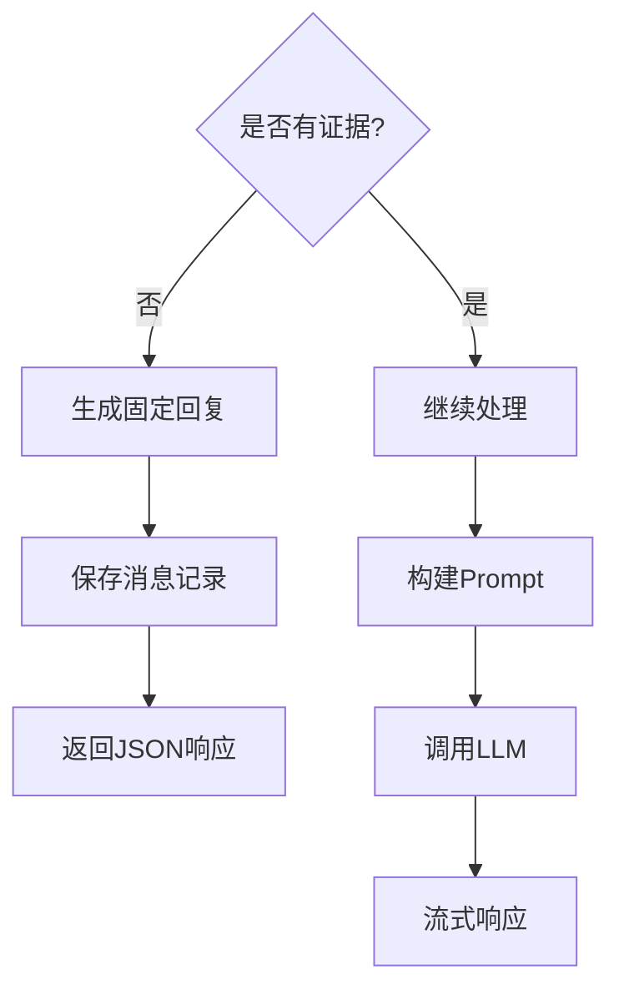

**图表来源**
- [route.ts](file://app/api/chat/route.ts#L129-L158)
- [prompt.ts](file://lib/rag/prompt.ts#L25-L32)

#### 用户提示机制

系统提供多层次的用户提示：

1. **视觉提示**：引用面板显示"未找到相关依据"警告
2. **操作建议**：提供上传资料和调整问题范围的建议
3. **交互反馈**：通过Toast通知用户当前状态

**章节来源**
- [route.ts](file://app/api/chat/route.ts#L129-L158)
- [chat-panel.tsx](file://components/notebook/chat-panel.tsx#L664-L674)

### 可视化设计

引用溯源的可视化设计注重用户体验和信息密度的平衡：

#### 检索详情可视化

检索详情面板提供了三个主要视图：

1. **检索片段视图**：展示所有匹配的文档片段
2. **链路可视化视图**：展示完整的检索流程
3. **参数配置视图**：显示检索参数和统计信息

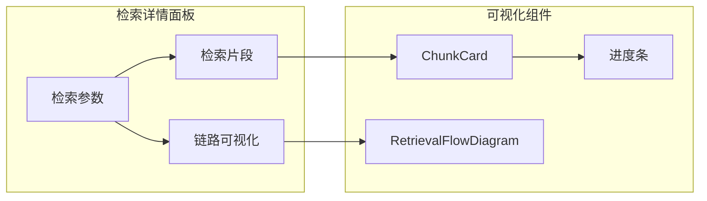

**图表来源**
- [retrieval-details-panel.tsx](file://components/notebook/retrieval-details-panel.tsx#L42-L159)
- [chunk-card.tsx](file://components/notebook/chunk-card.tsx#L26-L94)
- [retrieval-flow-diagram.tsx](file://components/notebook/retrieval-flow-diagram.tsx#L16-L82)

**章节来源**
- [retrieval-details-panel.tsx](file://components/notebook/retrieval-details-panel.tsx#L42-L159)
- [chunk-card.tsx](file://components/notebook/chunk-card.tsx#L26-L94)

## 依赖关系分析

引用溯源机制涉及多个层面的依赖关系：

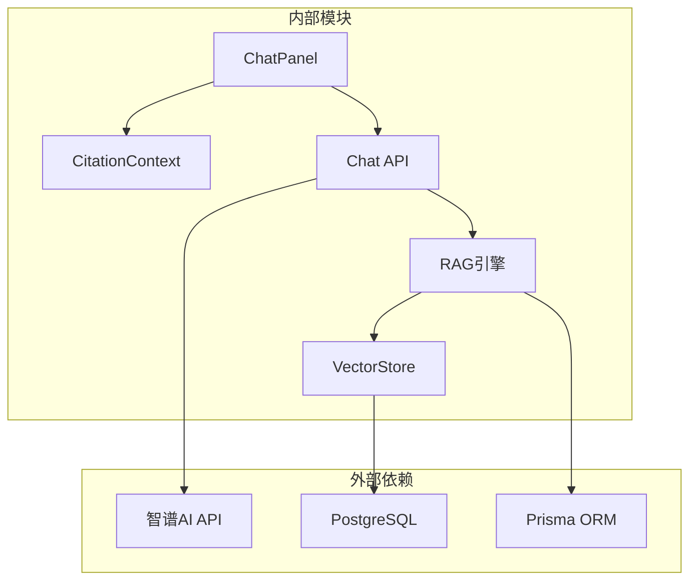

**图表来源**
- [route.ts](file://app/api/chat/route.ts#L8-L21)
- [vector-store.ts](file://lib/db/vector-store.ts#L1-L76)

**章节来源**
- [route.ts](file://app/api/chat/route.ts#L8-L21)
- [vector-store.ts](file://lib/db/vector-store.ts#L1-L76)

## 性能考虑

引用溯源机制在设计时充分考虑了性能优化：

### 检索性能优化

1. **向量索引优化**：使用pgvector扩展进行高效相似度计算
2. **批量处理**：向量嵌入和文档插入采用批量处理策略
3. **缓存机制**：合理利用数据库索引和查询缓存

### 流式响应优化

系统采用Server-Sent Events实现流式响应，提升用户体验：

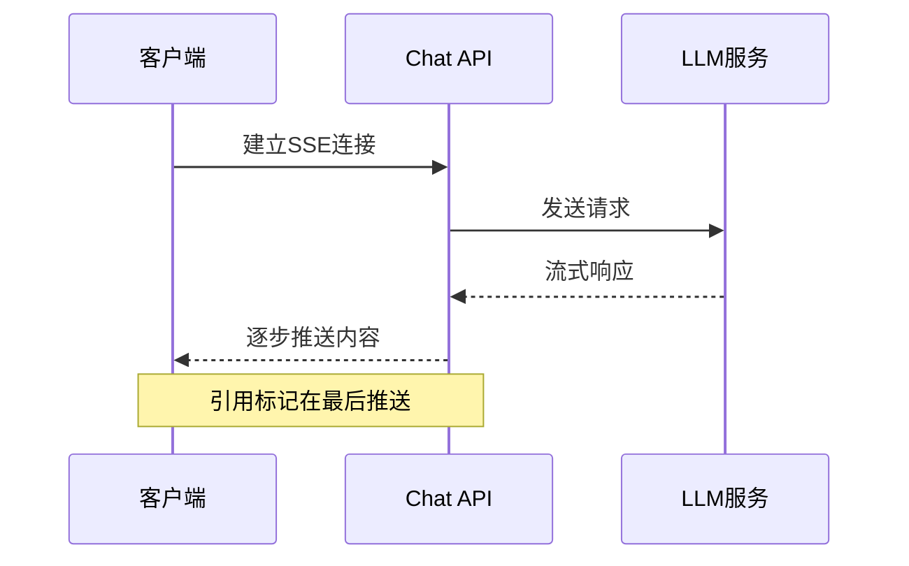

**图表来源**
- [route.ts](file://app/api/chat/route.ts#L214-L306)

### 内存管理优化

1. **引用去重**：避免重复引用占用内存
2. **懒加载**：检索详情面板采用动态加载
3. **状态管理**：使用React Context避免不必要的重渲染

## 故障排除指南

### 常见问题及解决方案

#### 引用标记不显示

**问题症状**：回答中包含引用标记但不显示为可点击按钮

**可能原因**：
1. 引用上下文未正确初始化
2. 引用标记格式不符合规范
3. 引用索引超出范围

**解决步骤**：
1. 检查CitationContext是否正确提供
2. 验证引用标记格式为`[数字]`
3. 确认引用索引在有效范围内

#### 检索结果为空

**问题症状**：用户提问后没有返回任何检索结果

**可能原因**：
1. 知识库中没有相关文档
2. 检索阈值设置过高
3. 向量维度不匹配

**解决步骤**：
1. 检查知识库内容完整性
2. 调整相似度阈值配置
3. 验证EMBEDDING_DIM配置

#### 高亮功能失效

**问题症状**：点击引用标记无法高亮对应来源

**可能原因**：
1. 引用ID不匹配
2. 状态管理异常
3. DOM引用丢失

**解决步骤**：
1. 检查引用ID生成逻辑
2. 验证CitationContext状态
3. 确认DOM引用更新

**章节来源**
- [chat-panel.tsx](file://components/notebook/chat-panel.tsx#L604-L659)
- [source-sidebar.tsx](file://components/notebook/source-sidebar.tsx#L148-L167)

## 结论

本项目的引用溯源机制实现了从证据提取到上下文展示的完整闭环，具有以下特点：

1. **技术先进性**：采用混合检索策略，结合向量相似度和全文检索
2. **用户体验优秀**：提供直观的可视化界面和流畅的交互体验
3. **可扩展性强**：模块化设计便于功能扩展和维护
4. **可靠性高**：完善的错误处理和性能优化机制

该机制为构建可信的人工智能问答系统奠定了坚实基础，为用户提供了透明、可追溯的信息获取体验。

## 附录

### 实现示例路径

以下是一些关键实现的文件路径示例：

- **引用上下文管理**：`components/notebook/citation-context.tsx`
- **聊天面板实现**：`components/notebook/chat-panel.tsx`
- **检索API实现**：`app/api/chat/route.ts`
- **RAG引擎**：`lib/rag/`
- **向量存储**：`lib/db/vector-store.ts`
- **AI服务封装**：`lib/ai/zhipu.ts`

### 用户体验优化建议

1. **加载状态指示**：为长检索过程提供进度指示
2. **错误恢复机制**：在网络异常时提供重试选项
3. **键盘快捷键**：支持键盘导航引用面板
4. **导出功能**：允许用户导出引用列表
5. **主题适配**：支持深色模式下的高对比度显示