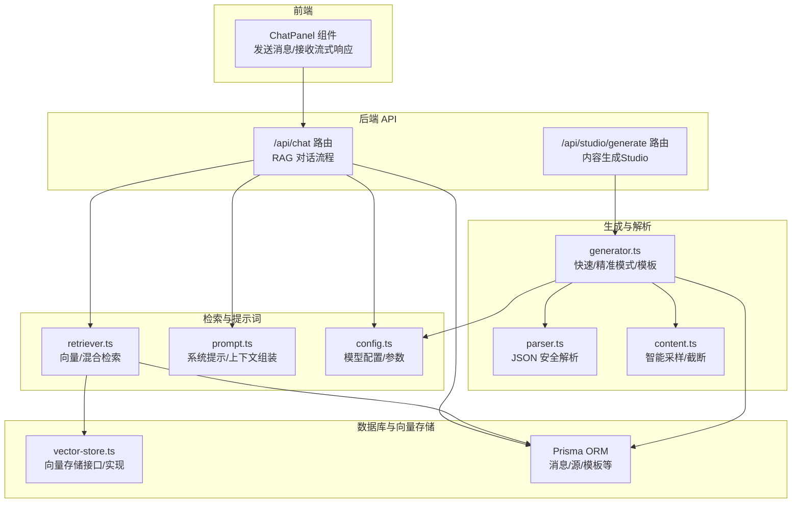
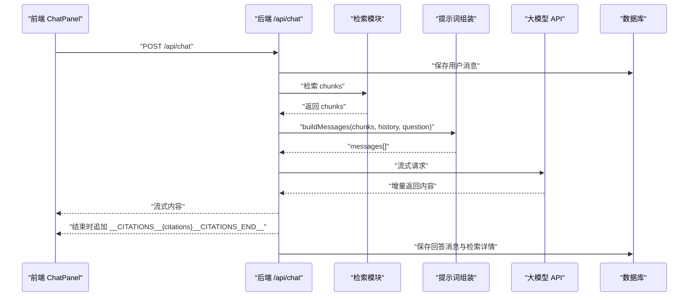
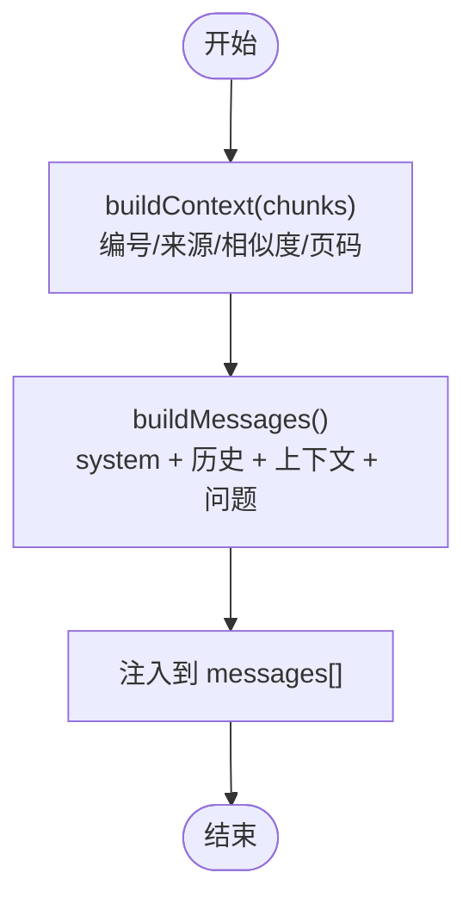
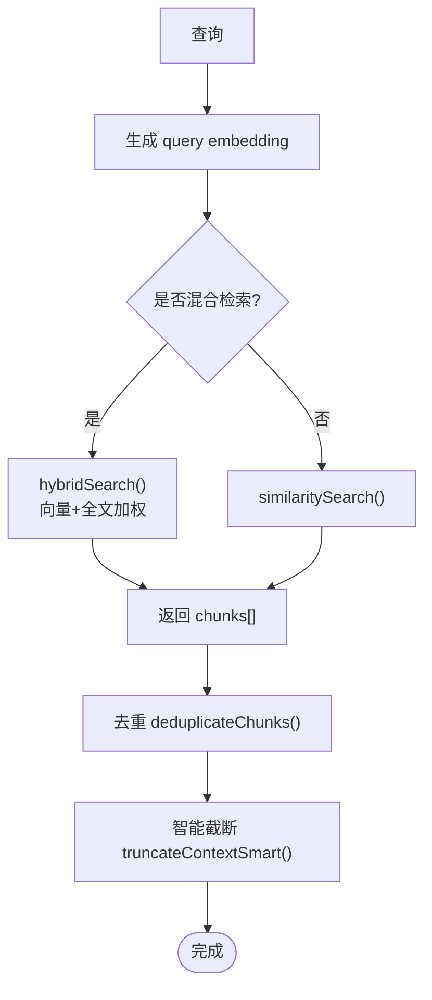
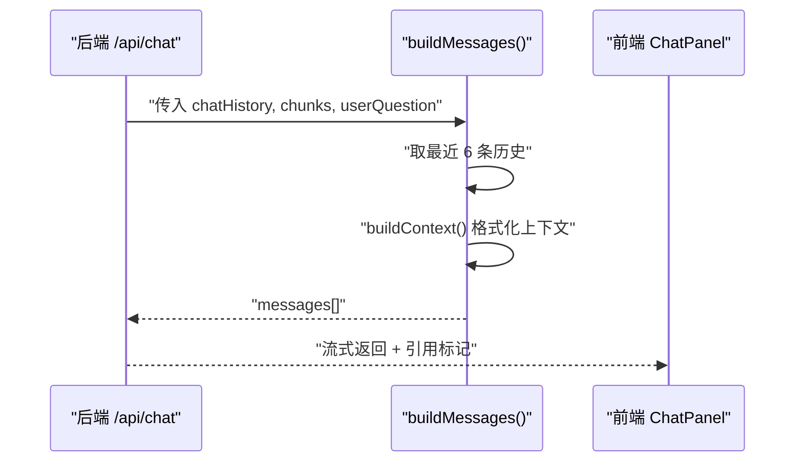
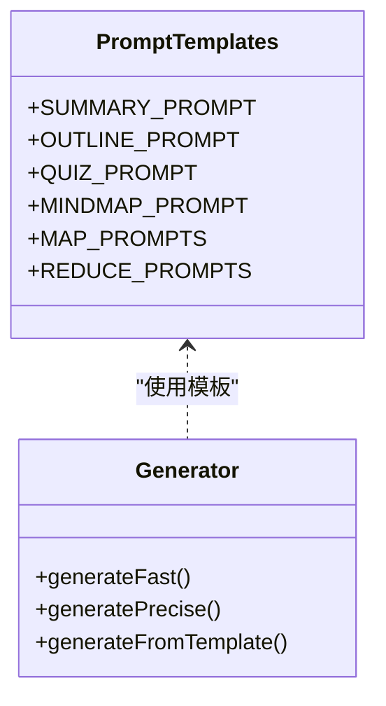
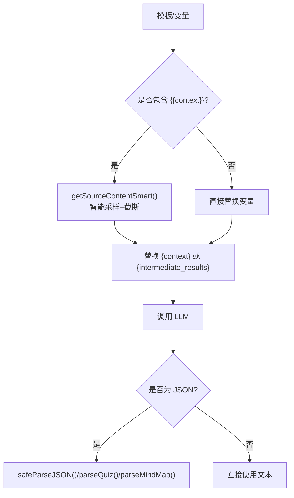
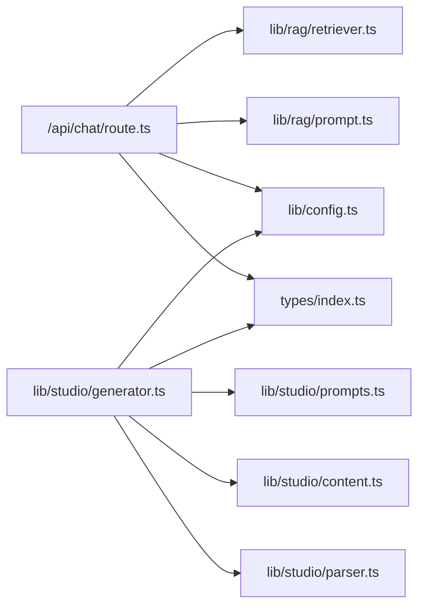

# 提示词工程

<cite>
**本文档引用的文件**
- [lib/rag/prompt.ts](file://lib/rag/prompt.ts)
- [lib/rag/retriever.ts](file://lib/rag/retriever.ts)
- [lib/rag/index.ts](file://lib/rag/index.ts)
- [app/api/chat/route.ts](file://app/api/chat/route.ts)
- [components/notebook/chat-panel.tsx](file://components/notebook/chat-panel.tsx)
- [lib/studio/prompts.ts](file://lib/studio/prompts.ts)
- [lib/studio/generator.ts](file://lib/studio/generator.ts)
- [lib/studio/parser.ts](file://lib/studio/parser.ts)
- [lib/studio/content.ts](file://lib/studio/content.ts)
- [lib/config.ts](file://lib/config.ts)
- [types/index.ts](file://types/index.ts)
- [lib/db/vector-store.ts](file://lib/db/vector-store.ts)
</cite>

## 目录
1. [简介](#简介)
2. [项目结构](#项目结构)
3. [核心组件](#核心组件)
4. [架构总览](#架构总览)
5. [详细组件分析](#详细组件分析)
6. [依赖关系分析](#依赖关系分析)
7. [性能考量](#性能考量)
8. [故障排查指南](#故障排查指南)
9. [结论](#结论)
10. [附录](#附录)

## 简介
本文件面向提示词工程实践，结合仓库中的 RAG 问答与 Studio 内容生成能力，系统阐述提示词构建的最佳实践，包括：
- 上下文注入策略与格式化
- 指令设计原则与输出格式控制
- 聊天历史的处理机制与上下文窗口管理
- 不同类型问题的提示词模板设计（事实性、推理性、开放式）
- 提示词的动态构建过程（检索上下文的格式化与注入）
- 提示词优化技巧与测试方法
- 具体模板与示例路径，便于快速落地

## 项目结构
该项目围绕“笔记 + 源材料 + 向量化检索 + 大模型对话/生成”的闭环展开。前端通过聊天面板发起请求，后端 API 调用检索模块获取上下文，组装提示词并调用大模型，最终以流式方式返回回答，并在末尾附加引用信息；同时提供 Studio 模块用于结构化内容生成（摘要、大纲、测验、思维导图），并支持模板库与 Map-Reduce 生成策略。

图表来源
- [app/api/chat/route.ts](file://app/api/chat/route.ts#L25-L324)
- [lib/rag/retriever.ts](file://lib/rag/retriever.ts#L53-L116)
- [lib/rag/prompt.ts](file://lib/rag/prompt.ts#L62-L88)
- [lib/config.ts](file://lib/config.ts#L118-L157)
- [lib/db/vector-store.ts](file://lib/db/vector-store.ts#L77-L200)
- [lib/studio/generator.ts](file://lib/studio/generator.ts#L242-L262)
- [lib/studio/content.ts](file://lib/studio/content.ts#L67-L154)
- [lib/studio/parser.ts](file://lib/studio/parser.ts#L56-L182)

章节来源
- [app/api/chat/route.ts](file://app/api/chat/route.ts#L25-L324)
- [lib/rag/retriever.ts](file://lib/rag/retriever.ts#L53-L116)
- [lib/rag/prompt.ts](file://lib/rag/prompt.ts#L62-L88)
- [lib/config.ts](file://lib/config.ts#L118-L157)
- [lib/db/vector-store.ts](file://lib/db/vector-store.ts#L77-L200)
- [lib/studio/generator.ts](file://lib/studio/generator.ts#L242-L262)
- [lib/studio/content.ts](file://lib/studio/content.ts#L67-L154)
- [lib/studio/parser.ts](file://lib/studio/parser.ts#L56-L182)

## 核心组件
- RAG 提示词与上下文组装：负责系统提示、历史对话注入、检索上下文格式化与引用标注。
- 检索模块：支持向量相似检索与混合检索，提供去重与评分。
- 聊天 API：统一的 RAG 对话入口，支持流式返回与引用信息追加。
- Studio 内容生成：提供摘要、大纲、测验、思维导图的模板与 Map-Reduce 策略，以及 JSON 安全解析。
- 配置与类型：统一的模型配置、RAG 参数、消息元数据与引用结构。

章节来源
- [lib/rag/prompt.ts](file://lib/rag/prompt.ts#L10-L88)
- [lib/rag/retriever.ts](file://lib/rag/retriever.ts#L53-L116)
- [app/api/chat/route.ts](file://app/api/chat/route.ts#L25-L324)
- [lib/studio/prompts.ts](file://lib/studio/prompts.ts#L6-L210)
- [lib/studio/generator.ts](file://lib/studio/generator.ts#L242-L310)
- [lib/studio/parser.ts](file://lib/studio/parser.ts#L56-L182)
- [lib/config.ts](file://lib/config.ts#L118-L157)
- [types/index.ts](file://types/index.ts#L22-L104)

## 架构总览
RAG 对话的关键流程如下：
- 前端提交消息与 notebookId、selectedSourceIds、模式（fast/precise）
- 后端并行保存用户消息与执行检索
- 去重与引用构建，构造系统提示+历史+上下文+问题的消息序列
- 调用大模型 API，流式返回回答，末尾追加引用信息
- 保存回答消息与检索详情元数据

图表来源
- [app/api/chat/route.ts](file://app/api/chat/route.ts#L62-L314)
- [lib/rag/prompt.ts](file://lib/rag/prompt.ts#L62-L88)
- [lib/rag/retriever.ts](file://lib/rag/retriever.ts#L53-L116)

章节来源
- [app/api/chat/route.ts](file://app/api/chat/route.ts#L62-L314)
- [lib/rag/prompt.ts](file://lib/rag/prompt.ts#L62-L88)
- [lib/rag/retriever.ts](file://lib/rag/retriever.ts#L53-L116)

## 详细组件分析

### RAG 提示词与上下文注入
- 系统提示：强调基于参考资料回答、引用标注规范、语言风格与问题澄清策略。
- 历史注入：最近若干条历史消息（默认 6 条）按原角色顺序注入，保持上下文连贯。
- 上下文格式化：对每个检索到的块进行编号与来源标注，包含相似度与页码信息，便于引用与溯源。
- 引用构建：对重复内容进行去重（基于内容前缀哈希），保留相似度更高的块，形成稳定引用集合。

图表来源
- [lib/rag/prompt.ts](file://lib/rag/prompt.ts#L37-L88)

章节来源
- [lib/rag/prompt.ts](file://lib/rag/prompt.ts#L10-L88)

### 检索与上下文窗口管理
- 检索策略：支持向量相似检索与混合检索（向量分数、全文检索分数加权），并可限定 sourceIds 与阈值。
- 去重策略：按 chunk id 去重，避免重复块影响上下文。
- 上下文截断：Studio 模块提供智能截断，按 Source 块边界保留完整块，超过 token 限制时省略部分，避免切分语义碎片。
- RAG 参数：topK、相似度阈值、最大上下文 token 数、是否启用混合检索与权重。

图表来源
- [lib/rag/retriever.ts](file://lib/rag/retriever.ts#L53-L116)
- [lib/studio/content.ts](file://lib/studio/content.ts#L42-L61)

章节来源
- [lib/rag/retriever.ts](file://lib/rag/retriever.ts#L53-L116)
- [lib/studio/content.ts](file://lib/studio/content.ts#L42-L61)

### 聊天历史处理与上下文窗口
- 历史注入：取除最新一条以外的历史消息，最多 6 条，避免过度占用上下文。
- 上下文窗口：RAG 模块通过相似度阈值与 topK 控制上下文规模；Studio 模块通过 token 估算与智能截断进一步保障稳定性。
- 引用标注：系统提示要求在句子末尾添加引用标记，前端渲染时将 [1][2] 等标记转换为可点击按钮，提升溯源体验。

图表来源
- [lib/rag/prompt.ts](file://lib/rag/prompt.ts#L62-L88)
- [components/notebook/chat-panel.tsx](file://components/notebook/chat-panel.tsx#L244-L299)

章节来源
- [lib/rag/prompt.ts](file://lib/rag/prompt.ts#L62-L88)
- [components/notebook/chat-panel.tsx](file://components/notebook/chat-panel.tsx#L244-L299)

### 不同类型问题的提示词模板设计
- 事实性问题：强调“仅使用参考资料回答”“明确告知无相关信息”，并要求引用标记。适合 RAG 的系统提示与无证据回复策略。
- 推理性问题：需要更强的推理能力，Studio 模块提供“精准模式”（推理模型）与 Map-Reduce 策略，先对每个 Source 生成中间结果，再合并。
- 开放式问题：通过结构化模板（摘要、大纲、测验、思维导图）引导模型按固定格式输出，降低歧义与漂移。

图表来源
- [lib/studio/prompts.ts](file://lib/studio/prompts.ts#L6-L210)
- [lib/studio/generator.ts](file://lib/studio/generator.ts#L120-L262)

章节来源
- [lib/studio/prompts.ts](file://lib/studio/prompts.ts#L6-L210)
- [lib/studio/generator.ts](file://lib/studio/generator.ts#L120-L262)

### 提示词的动态构建过程
- RAG：根据检索到的 chunks 动态格式化上下文，注入系统提示与历史，最后拼接用户问题。
- Studio：根据模板变量动态替换，必要时注入智能采样的上下文，再调用 LLM。
- JSON 安全解析：对测验与思维导图的 JSON 输出进行多策略提取与验证，确保稳定性。

图表来源
- [lib/studio/generator.ts](file://lib/studio/generator.ts#L276-L310)
- [lib/studio/content.ts](file://lib/studio/content.ts#L67-L154)
- [lib/studio/parser.ts](file://lib/studio/parser.ts#L56-L182)

章节来源
- [lib/studio/generator.ts](file://lib/studio/generator.ts#L276-L310)
- [lib/studio/content.ts](file://lib/studio/content.ts#L67-L154)
- [lib/studio/parser.ts](file://lib/studio/parser.ts#L56-L182)

### 提示词优化技巧与测试方法
- 明确规则与边界：在系统提示中明确“仅使用参考资料回答”“引用标记位置”“语言风格”等，减少幻觉与漂移。
- 控制上下文规模：通过 topK、阈值、智能截断与去重，确保上下文质量与稳定性。
- 输出格式约束：对结构化输出（如测验、思维导图）给出严格 JSON 格式要求，并配合安全解析。
- 测试方法：
  - 单元测试：对 buildContext/buildMessages、智能截断、JSON 解析分别编写用例。
  - A/B 对比：对比 fast/precise 模式在相同问题上的差异，评估召回与生成质量。
  - 引用一致性：验证 [1][2] 标记与引用列表的一致性与页码信息。
  - 边界用例：空上下文、极长上下文、重复内容、JSON 解析失败等。

章节来源
- [lib/rag/prompt.ts](file://lib/rag/prompt.ts#L10-L88)
- [lib/studio/parser.ts](file://lib/studio/parser.ts#L56-L182)
- [lib/studio/content.ts](file://lib/studio/content.ts#L42-L61)

### 具体提示词示例与模板（路径）
- 系统提示与无证据回复
  - [SYSTEM_PROMPT](file://lib/rag/prompt.ts#L10-L22)
  - [NO_EVIDENCE_RESPONSE](file://lib/rag/prompt.ts#L27-L32)
- RAG 消息组装
  - [buildMessages](file://lib/rag/prompt.ts#L62-L88)
- Studio 模板
  - [SUMMARY_PROMPT](file://lib/studio/prompts.ts#L6-L31)
  - [OUTLINE_PROMPT](file://lib/studio/prompts.ts#L33-L55)
  - [QUIZ_PROMPT](file://lib/studio/prompts.ts#L57-L82)
  - [MINDMAP_PROMPT](file://lib/studio/prompts.ts#L84-L116)
  - [MAP_PROMPTS/REDUCE_PROMPTS](file://lib/studio/prompts.ts#L119-L198)
- 模板运行与变量替换
  - [generateFromTemplate](file://lib/studio/generator.ts#L267-L310)

章节来源
- [lib/rag/prompt.ts](file://lib/rag/prompt.ts#L10-L88)
- [lib/studio/prompts.ts](file://lib/studio/prompts.ts#L6-L210)
- [lib/studio/generator.ts](file://lib/studio/generator.ts#L267-L310)

## 依赖关系分析
- 组件耦合
  - /api/chat 依赖检索模块与提示词组装，耦合度适中，职责清晰。
  - Studio 模块内部通过 content 与 parser 解耦生成与解析。
- 外部依赖
  - 大模型 API（智谱/LongCat），通过配置模块集中管理。
  - 向量存储与数据库，通过 vector-store 与 Prisma 抽象隔离。
- 循环依赖
  - 未发现循环依赖迹象；各模块通过导出接口与类型文件解耦。

图表来源
- [app/api/chat/route.ts](file://app/api/chat/route.ts#L12-L20)
- [lib/studio/generator.ts](file://lib/studio/generator.ts#L6-L21)
- [lib/config.ts](file://lib/config.ts#L118-L157)
- [types/index.ts](file://types/index.ts#L22-L104)

章节来源
- [app/api/chat/route.ts](file://app/api/chat/route.ts#L12-L20)
- [lib/studio/generator.ts](file://lib/studio/generator.ts#L6-L21)
- [lib/config.ts](file://lib/config.ts#L118-L157)
- [types/index.ts](file://types/index.ts#L22-L104)

## 性能考量
- 检索性能
  - 使用向量相似检索与混合检索，合理设置 topK 与阈值，避免上下文过大。
  - 批量插入与分批处理，减少数据库压力。
- 生成性能
  - Studio 模块对推理模型设置较长超时，避免因模型推理耗时导致中断。
  - 流式返回缩短首字节延迟，提升交互体验。
- 上下文控制
  - 通过 token 估算与智能截断，避免超过模型上下文上限。
  - 去重与评分过滤，提升上下文质量。

章节来源
- [lib/rag/retriever.ts](file://lib/rag/retriever.ts#L6-L13)
- [lib/db/vector-store.ts](file://lib/db/vector-store.ts#L88-L173)
- [lib/studio/generator.ts](file://lib/studio/generator.ts#L23-L26)
- [lib/studio/content.ts](file://lib/studio/content.ts#L33-L61)

## 故障排查指南
- 无证据回复
  - 现象：返回固定“未找到相关依据”的提示。
  - 排查：确认检索 hasEvidence 与 chunks 是否为空；检查阈值与 topK 设置。
  - 参考：[NO_EVIDENCE_RESPONSE](file://lib/rag/prompt.ts#L27-L32)
- 引用不一致或缺失
  - 现象：回答中标注 [1]，但底部引用列表为空或不完整。
  - 排查：检查 buildCitations 去重逻辑与前端渲染 [1][2] 的映射。
  - 参考：[buildCitations](file://lib/rag/prompt.ts#L112-L148)，[ContentWithCitations](file://components/notebook/chat-panel.tsx#L543-L575)
- JSON 解析失败
  - 现象：测验/思维导图 JSON 解析报错。
  - 排查：使用 safeParseJSON 的多策略提取；检查 LLM 输出格式是否符合模板要求。
  - 参考：[safeParseJSON](file://lib/studio/parser.ts#L56-L119)，[parseQuiz/parseMindMap](file://lib/studio/parser.ts#L124-L182)
- 上下文过长导致截断
  - 现象：生成内容被截断或不完整。
  - 排查：调整智能截断阈值或减少 source 数量；检查 token 估算逻辑。
  - 参考：[truncateContextSmart](file://lib/studio/content.ts#L42-L61)
- 模型配置错误
  - 现象：API 调用失败或返回异常。
  - 排查：核对模型提供商、API Key、Base URL 与模型名；检查维度一致性。
  - 参考：[getModelConfig](file://lib/config.ts#L118-L135)，[EMBEDDING_DIM 校验](file://lib/config.ts#L9-L29)

章节来源
- [lib/rag/prompt.ts](file://lib/rag/prompt.ts#L27-L32)
- [lib/rag/prompt.ts](file://lib/rag/prompt.ts#L112-L148)
- [components/notebook/chat-panel.tsx](file://components/notebook/chat-panel.tsx#L543-L575)
- [lib/studio/parser.ts](file://lib/studio/parser.ts#L56-L119)
- [lib/studio/content.ts](file://lib/studio/content.ts#L42-L61)
- [lib/config.ts](file://lib/config.ts#L118-L135)

## 结论
本项目的提示词工程实践体现了“高质量上下文 + 明确规则 + 结构化输出 + 安全解析”的闭环设计。通过系统提示、历史注入、智能截断与引用标注，有效提升了问答质量与可追溯性；通过 Studio 的模板与 Map-Reduce 策略，实现了对不同任务类型的稳定输出。建议在后续迭代中持续完善提示词模板的 A/B 测试与自动化评估体系，以进一步提升提示词工程的可维护性与效果。

## 附录
- 关键类型与元数据
  - [Citation/MessageMetadata](file://types/index.ts#L22-L104)
- 向量存储与维度校验
  - [PrismaVectorStore 接口与实现](file://lib/db/vector-store.ts#L24-L75)
  - [EMBEDDING_DIM 校验](file://lib/config.ts#L9-L29)

章节来源
- [types/index.ts](file://types/index.ts#L22-L104)
- [lib/db/vector-store.ts](file://lib/db/vector-store.ts#L24-L75)
- [lib/config.ts](file://lib/config.ts#L9-L29)