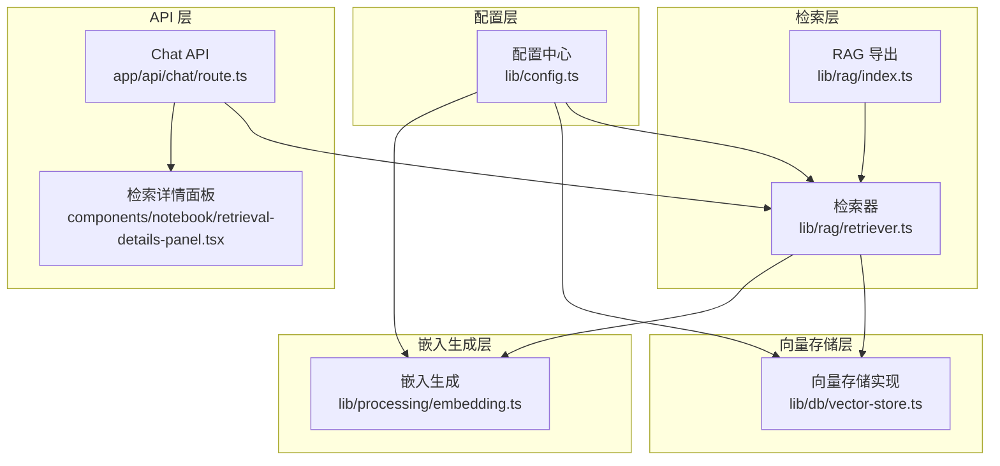
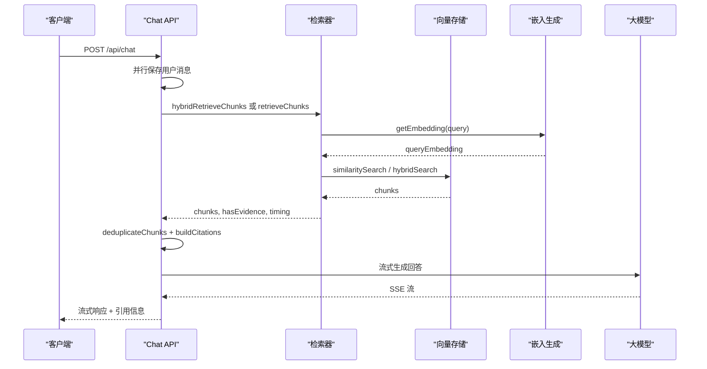
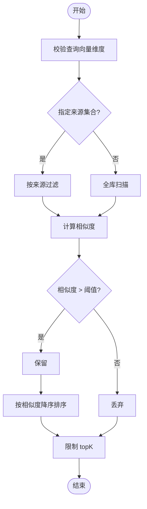
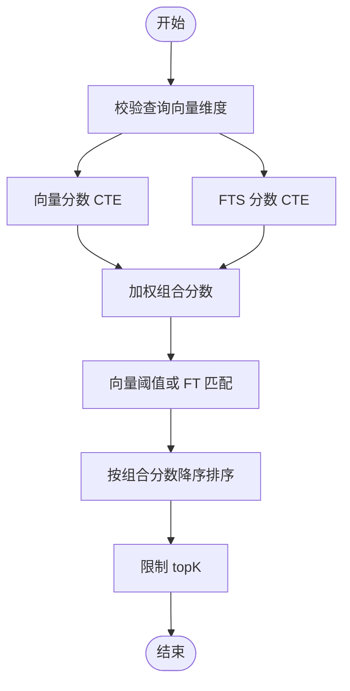
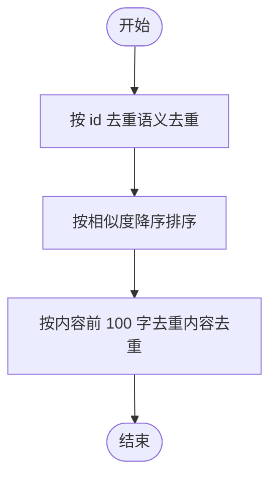
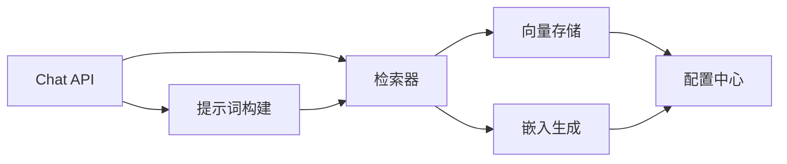

# 检索策略设计

<cite>
**本文档引用的文件**
- [lib/rag/retriever.ts](file://lib/rag/retriever.ts)
- [lib/db/vector-store.ts](file://lib/db/vector-store.ts)
- [lib/processing/embedding.ts](file://lib/processing/embedding.ts)
- [lib/rag/prompt.ts](file://lib/rag/prompt.ts)
- [app/api/chat/route.ts](file://app/api/chat/route.ts)
- [components/notebook/retrieval-details-panel.tsx](file://components/notebook/retrieval-details-panel.tsx)
- [lib/config.ts](file://lib/config.ts)
- [lib/rag/index.ts](file://lib/rag/index.ts)
</cite>

## 目录
1. [简介](#简介)
2. [项目结构](#项目结构)
3. [核心组件](#核心组件)
4. [架构概览](#架构概览)
5. [详细组件分析](#详细组件分析)
6. [依赖关系分析](#依赖关系分析)
7. [性能考量](#性能考量)
8. [故障排除指南](#故障排除指南)
9. [结论](#结论)
10. [附录](#附录)

## 简介
本文件系统性阐述该代码库中的检索策略设计，重点覆盖向量检索与混合检索的实现原理、相似度计算与阈值过滤机制、结果排序策略、去重算法设计、检索参数配置与调优策略，以及不同策略的性能对比与适用场景分析。文档旨在帮助开发者在实际项目中根据业务需求选择合适的检索策略，并进行有效的参数调优。

## 项目结构
检索系统主要由以下层次构成：
- API 层：负责接收用户查询、触发检索、组装提示词并流式返回答案
- 检索层：封装向量检索与混合检索的入口，统一处理去重与结果排序
- 向量存储层：提供向量相似度搜索、全文检索（FTS）与混合搜索能力
- 嵌入生成层：负责文本嵌入的批量生成、重试与维度校验
- 配置层：集中管理检索参数、模型配置与环境变量验证

**图表来源**
- [app/api/chat/route.ts](file://app/api/chat/route.ts#L25-L324)
- [lib/rag/retriever.ts](file://lib/rag/retriever.ts#L53-L206)
- [lib/db/vector-store.ts](file://lib/db/vector-store.ts#L77-L446)
- [lib/processing/embedding.ts](file://lib/processing/embedding.ts#L140-L189)
- [lib/rag/index.ts](file://lib/rag/index.ts#L5-L24)
- [lib/config.ts](file://lib/config.ts#L6-L52)

**章节来源**
- [app/api/chat/route.ts](file://app/api/chat/route.ts#L25-L324)
- [lib/rag/retriever.ts](file://lib/rag/retriever.ts#L53-L206)
- [lib/db/vector-store.ts](file://lib/db/vector-store.ts#L77-L446)
- [lib/processing/embedding.ts](file://lib/processing/embedding.ts#L140-L189)
- [lib/rag/index.ts](file://lib/rag/index.ts#L5-L24)
- [lib/config.ts](file://lib/config.ts#L6-L52)

## 核心组件
- 检索器（Retriever）：提供向量检索与混合检索两种入口，统一处理去重与结果映射
- 向量存储（VectorStore）：实现向量相似度搜索、全文检索（FTS）与混合搜索
- 嵌入生成（Embedding）：批量生成文本嵌入，包含指数退避重试与维度校验
- 提示词构建（Prompt）：将检索结果组织为上下文，支持引用标注与内容去重
- API 路由（Chat API）：串联检索、去重、提示词构建与流式生成

**章节来源**
- [lib/rag/retriever.ts](file://lib/rag/retriever.ts#L53-L206)
- [lib/db/vector-store.ts](file://lib/db/vector-store.ts#L77-L446)
- [lib/processing/embedding.ts](file://lib/processing/embedding.ts#L140-L189)
- [lib/rag/prompt.ts](file://lib/rag/prompt.ts#L37-L149)
- [app/api/chat/route.ts](file://app/api/chat/route.ts#L25-L324)

## 架构概览
检索系统采用“API -> 检索器 -> 向量存储 -> 嵌入生成”的分层架构。API 层负责并发执行检索与消息保存，检索器负责调用向量存储并进行去重与结果映射，向量存储层通过 PostgreSQL 的向量扩展与全文检索实现高效检索，嵌入生成层负责文本向量化与错误重试。

**图表来源**
- [app/api/chat/route.ts](file://app/api/chat/route.ts#L79-L126)
- [lib/rag/retriever.ts](file://lib/rag/retriever.ts#L131-L206)
- [lib/db/vector-store.ts](file://lib/db/vector-store.ts#L312-L442)
- [lib/processing/embedding.ts](file://lib/processing/embedding.ts#L140-L189)

**章节来源**
- [app/api/chat/route.ts](file://app/api/chat/route.ts#L79-L126)
- [lib/rag/retriever.ts](file://lib/rag/retriever.ts#L131-L206)
- [lib/db/vector-store.ts](file://lib/db/vector-store.ts#L312-L442)
- [lib/processing/embedding.ts](file://lib/processing/embedding.ts#L140-L189)

## 详细组件分析

### 向量检索实现原理
- 相似度计算：使用余弦距离的补值（1 - 向量点积），在 PostgreSQL 中通过向量扩展运算符实现
- 阈值过滤：对相似度进行阈值过滤，仅保留高于阈值的结果
- 结果排序：按相似度降序排列，限制返回数量（topK）
- 检索范围控制：支持按 sourceIds 进行范围限定

**图表来源**
- [lib/db/vector-store.ts](file://lib/db/vector-store.ts#L175-L297)

**章节来源**
- [lib/db/vector-store.ts](file://lib/db/vector-store.ts#L175-L297)

### 混合检索实现原理
- 向量分数：基于向量相似度计算
- 全文检索分数（FTS）：使用 PostgreSQL 的 ts_rank 与简单分词器（simple）进行多语言支持
- 组合分数：加权求和，权重可配置（默认向量权重 0.7，FTS 权重 0.3）
- 过滤策略：只要向量分数超过阈值或存在 FT 文档匹配，即纳入候选集
- 排序策略：按组合分数降序排序，限制返回数量（topK）

**图表来源**
- [lib/db/vector-store.ts](file://lib/db/vector-store.ts#L312-L442)

**章节来源**
- [lib/db/vector-store.ts](file://lib/db/vector-store.ts#L312-L442)

### 检索参数配置与调优策略
- topK：控制返回片段数量，默认 8；越大召回越多但可能降低质量
- 相似度阈值：过滤低相关片段，默认 0.3（向量检索）/ 0.1（混合检索）；越高越严格
- 检索范围：通过 sourceIds 限定来源，提升相关性
- 混合检索权重：向量权重 0.7、FTS 权重 0.3；可根据语料特点调整
- 最大上下文令牌数：用于后续提示词构建的上下文裁剪（见配置文件）

调优建议：
- 低召回场景：增大 topK，降低阈值，启用混合检索
- 高精度场景：减小 topK，提高阈值，优先向量检索
- 多语言语料：确保使用 simple 分词器，混合检索更稳健
- 性能敏感场景：限制 sourceIds，减少扫描范围

**章节来源**
- [lib/rag/retriever.ts](file://lib/rag/retriever.ts#L6-L13)
- [lib/db/vector-store.ts](file://lib/db/vector-store.ts#L332-L341)
- [lib/config.ts](file://lib/config.ts#L160-L166)

### 去重算法设计
- 语义去重：在检索器中按 chunk id 去重，避免同一片段重复返回
- 内容去重：在提示词构建阶段，按内容前 100 字进行去重，保留相似度更高的片段

**图表来源**
- [lib/rag/retriever.ts](file://lib/rag/retriever.ts#L118-L125)
- [lib/rag/prompt.ts](file://lib/rag/prompt.ts#L112-L149)

**章节来源**
- [lib/rag/retriever.ts](file://lib/rag/retriever.ts#L118-L125)
- [lib/rag/prompt.ts](file://lib/rag/prompt.ts#L112-L149)

### 检索结果的质量评估与排序
- 质量评估指标：相似度分数、组合分数（混合检索）、引用数量与分布
- 排序策略：向量检索按相似度降序；混合检索按组合分数降序；内容去重后仍按相似度排序
- 上下文构建：将检索结果组织为结构化上下文，便于大模型引用

**章节来源**
- [lib/rag/prompt.ts](file://lib/rag/prompt.ts#L37-L88)

### 不同检索策略的性能对比与适用场景
- 向量检索
  - 优点：语义理解强，适合长文本与概念检索
  - 缺点：对关键词精确匹配较弱
  - 场景：知识问答、文档摘要、跨文档关联
- 混合检索
  - 优点：兼顾语义与关键词，鲁棒性更强
  - 缺点：计算开销略增
  - 场景：复杂查询、多语言语料、需要精确匹配的场景
- 去重策略
  - 语义去重：消除重复片段
  - 内容去重：避免重复引用，提升阅读体验

**章节来源**
- [lib/db/vector-store.ts](file://lib/db/vector-store.ts#L312-L442)
- [lib/rag/retriever.ts](file://lib/rag/retriever.ts#L118-L125)
- [lib/rag/prompt.ts](file://lib/rag/prompt.ts#L112-L149)

### 具体配置示例与调优建议
- 基础配置
  - topK：8
  - 相似度阈值：0.3（向量检索）/ 0.1（混合检索）
  - 混合检索权重：向量 0.7，FTS 0.3
- 调优建议
  - 高召回：topK=16，阈值=0.2，启用混合检索
  - 高精度：topK=4，阈值=0.5，优先向量检索
  - 多语言：启用混合检索，FTS 权重适当提高
  - 性能：限定 sourceIds，减少扫描范围

**章节来源**
- [lib/rag/retriever.ts](file://lib/rag/retriever.ts#L6-L13)
- [lib/db/vector-store.ts](file://lib/db/vector-store.ts#L332-L341)
- [lib/config.ts](file://lib/config.ts#L160-L166)

## 依赖关系分析
检索系统的关键依赖关系如下：
- Chat API 依赖检索器与提示词构建模块
- 检索器依赖向量存储与嵌入生成
- 向量存储依赖配置中心以获取维度与权重
- 嵌入生成依赖配置中心的模型与维度信息

**图表来源**
- [app/api/chat/route.ts](file://app/api/chat/route.ts#L12-L20)
- [lib/rag/retriever.ts](file://lib/rag/retriever.ts#L1-L4)
- [lib/db/vector-store.ts](file://lib/db/vector-store.ts#L1-L4)
- [lib/processing/embedding.ts](file://lib/processing/embedding.ts#L6-L7)
- [lib/config.ts](file://lib/config.ts#L6-L52)

**章节来源**
- [app/api/chat/route.ts](file://app/api/chat/route.ts#L12-L20)
- [lib/rag/retriever.ts](file://lib/rag/retriever.ts#L1-L4)
- [lib/db/vector-store.ts](file://lib/db/vector-store.ts#L1-L4)
- [lib/processing/embedding.ts](file://lib/processing/embedding.ts#L6-L7)
- [lib/config.ts](file://lib/config.ts#L6-L52)

## 性能考量
- 向量维度一致性：严格校验嵌入维度，避免运行时错误
- 批量插入与分批处理：向量存储支持批量插入与分批处理，减少数据库往返
- CTE 优化：使用 CTE 避免重复计算，提升查询性能
- 简单分词器：统一使用 simple 分词器，支持多语言，减少分词复杂度
- 指数退避重试：嵌入生成 API 调用具备指数退避与最大重试次数，提升稳定性
- 并行执行：API 层并行保存消息与检索，缩短端到端延迟

**章节来源**
- [lib/config.ts](file://lib/config.ts#L6-L29)
- [lib/db/vector-store.ts](file://lib/db/vector-store.ts#L77-L173)
- [lib/db/vector-store.ts](file://lib/db/vector-store.ts#L204-L297)
- [lib/db/vector-store.ts](file://lib/db/vector-store.ts#L349-L442)
- [lib/processing/embedding.ts](file://lib/processing/embedding.ts#L115-L134)
- [app/api/chat/route.ts](file://app/api/chat/route.ts#L70-L96)

## 故障排除指南
- 向量维度错误
  - 现象：启动时报错或运行时抛出维度不匹配异常
  - 处理：确保 EMBEDDING_DIM 与数据库向量维度一致，推荐 1024
- API 请求失败
  - 现象：Chat API 返回错误或流式响应中断
  - 处理：检查模型 API Key、Base URL 与网络连通性；查看服务端日志
- 检索结果为空
  - 现象：无证据回复或检索详情为空
  - 处理：调整阈值、增大 topK、限定 sourceIds、确认语料是否正确入库
- 嵌入生成失败
  - 现象：嵌入生成报错或维度不匹配
  - 处理：检查 API Key、模型名称与网络状态；启用指数退避重试

**章节来源**
- [lib/config.ts](file://lib/config.ts#L9-L29)
- [lib/processing/embedding.ts](file://lib/processing/embedding.ts#L72-L110)
- [app/api/chat/route.ts](file://app/api/chat/route.ts#L174-L206)

## 结论
该检索系统通过向量检索与混合检索相结合的方式，在保证语义理解能力的同时兼顾关键词匹配的准确性。系统在性能方面采用多项优化措施，包括维度校验、批量处理、CTE 优化与指数退避重试等。通过合理的参数配置与调优策略，可以在不同业务场景下取得良好的检索效果与用户体验。

## 附录
- 检索详情面板：展示检索参数、返回片段与链路可视化，便于调试与优化
- 引用标注：在提示词构建阶段自动添加引用标记，提升回答可信度

**章节来源**
- [components/notebook/retrieval-details-panel.tsx](file://components/notebook/retrieval-details-panel.tsx#L9-L40)
- [lib/rag/prompt.ts](file://lib/rag/prompt.ts#L37-L88)