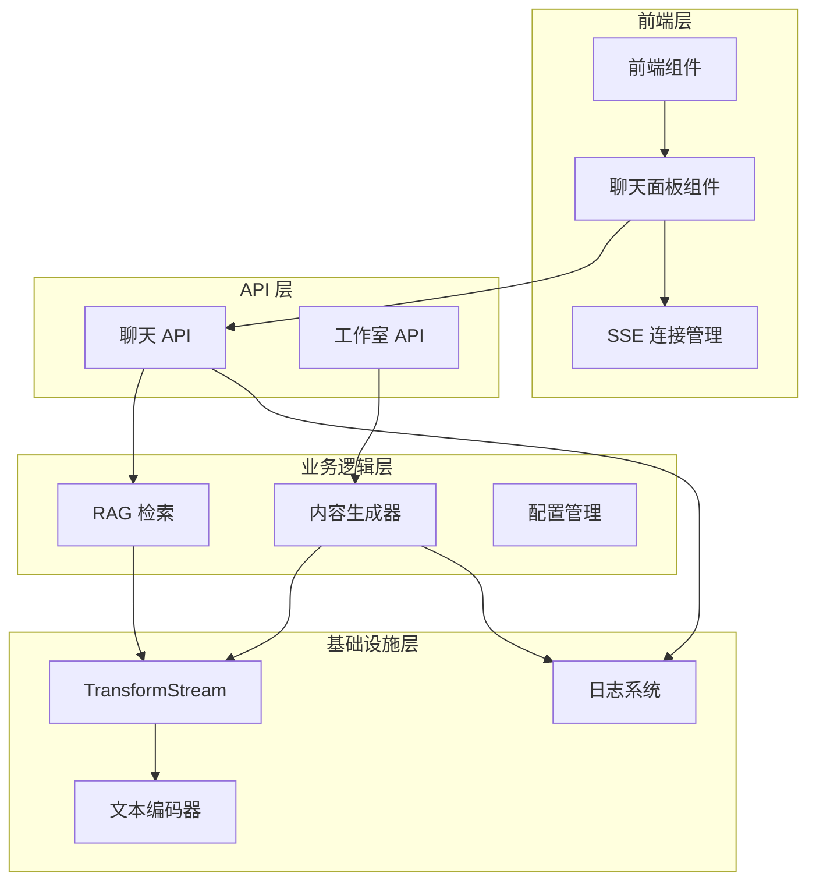
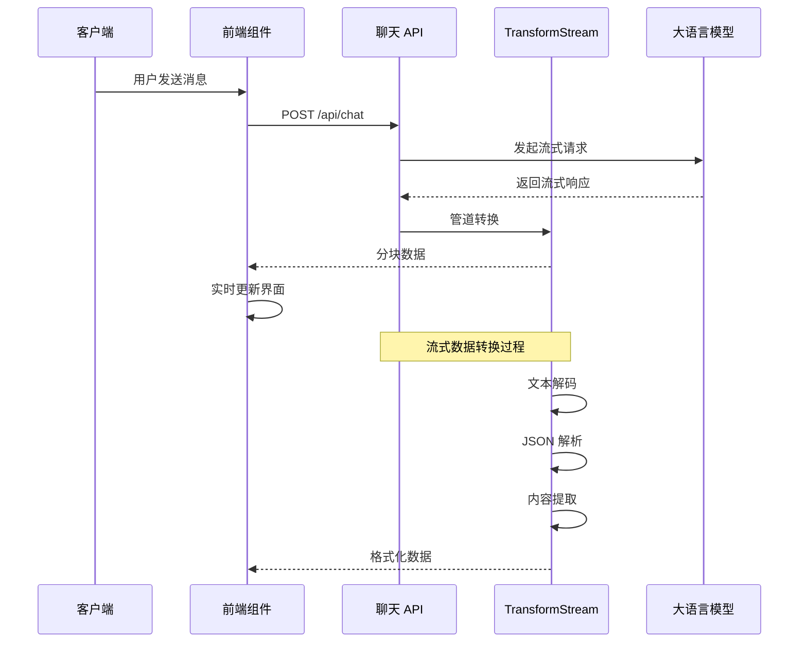
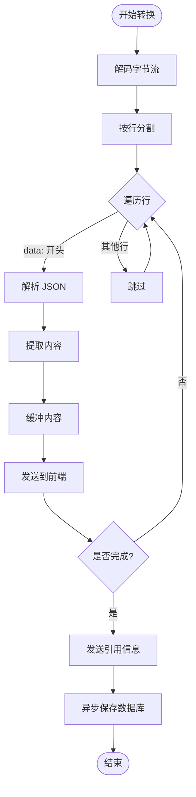
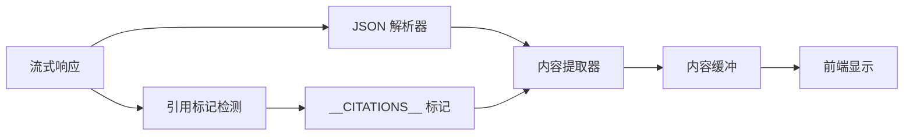
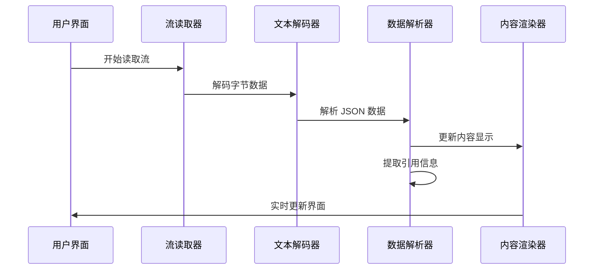
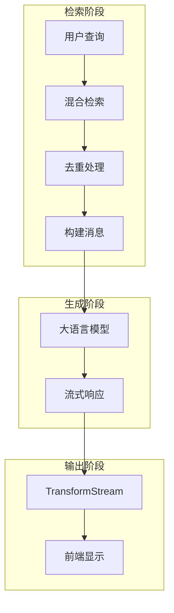
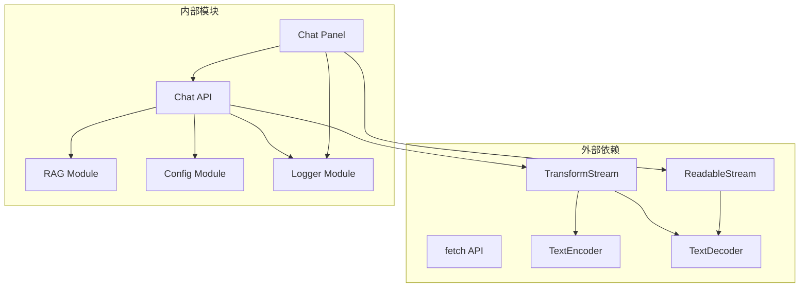

# 流式输出实现

<cite>
**本文档引用的文件**
- [app/api/chat/route.ts](file://app/api/chat/route.ts)
- [components/notebook/chat-panel.tsx](file://components/notebook/chat-panel.tsx)
- [lib/rag/index.ts](file://lib/rag/index.ts)
- [lib/studio/generator.ts](file://lib/studio/generator.ts)
- [lib/config.ts](file://lib/config.ts)
- [lib/utils/logger.ts](file://lib/utils/logger.ts)
- [lib/ai/zhipu.ts](file://lib/ai/zhipu.ts)
</cite>

## 目录
1. [简介](#简介)
2. [项目结构](#项目结构)
3. [核心组件](#核心组件)
4. [架构概览](#架构概览)
5. [详细组件分析](#详细组件分析)
6. [依赖关系分析](#依赖关系分析)
7. [性能考虑](#性能考虑)
8. [故障排除指南](#故障排除指南)
9. [结论](#结论)

## 简介

本项目实现了基于 Server-Sent Events (SSE) 协议的流式输出功能，为问答系统提供了实时的、低延迟的响应体验。该实现通过 TransformStream 对底层的流式响应进行转换和缓冲管理，确保了数据传输的实时性和用户体验的流畅性。

流式输出的核心价值在于：
- **实时性保障**：用户可以立即看到生成的内容，无需等待完整响应
- **内存效率**：采用流式处理避免大对象占用过多内存
- **用户体验优化**：渐进式的内容呈现提升了交互体验
- **系统稳定性**：完善的错误处理和资源管理机制

## 项目结构

该项目采用 Next.js 应用架构，流式输出功能主要分布在以下层次：

**图表来源**
- [app/api/chat/route.ts](file://app/api/chat/route.ts#L1-L324)
- [components/notebook/chat-panel.tsx](file://components/notebook/chat-panel.tsx#L1-L675)
- [lib/rag/index.ts](file://lib/rag/index.ts#L1-L24)

**章节来源**
- [app/api/chat/route.ts](file://app/api/chat/route.ts#L1-L324)
- [components/notebook/chat-panel.tsx](file://components/notebook/chat-panel.tsx#L1-L675)

## 核心组件

### 1. SSE 协议实现

项目实现了标准的 Server-Sent Events 协议，通过 `text/event-stream` 内容类型提供实时数据传输。

**关键特性**：
- **连接保持**：使用 `keep-alive` 头维持长连接
- **缓存控制**：禁用缓存确保实时性
- **错误处理**：完整的异常捕获和错误响应

### 2. TransformStream 数据转换

核心的数据转换逻辑由 TransformStream 实现，负责将底层流式响应转换为前端可消费的格式。

**转换流程**：
1. 接收底层字节流
2. 文本解码和行分割
3. JSON 数据解析
4. 内容提取和缓冲
5. 前端格式转换

### 3. 前端流式读取

前端组件使用原生的 ReadableStream API 进行流式数据读取和处理。

**前端处理**：
- 流式读取响应体
- 实时更新界面内容
- 引用信息的动态加载

**章节来源**
- [app/api/chat/route.ts](file://app/api/chat/route.ts#L208-L314)
- [components/notebook/chat-panel.tsx](file://components/notebook/chat-panel.tsx#L234-L288)

## 架构概览

**图表来源**
- [app/api/chat/route.ts](file://app/api/chat/route.ts#L193-L314)
- [components/notebook/chat-panel.tsx](file://components/notebook/chat-panel.tsx#L196-L288)

## 详细组件分析

### 聊天 API 实现

#### TransformStream 核心逻辑

**图表来源**
- [app/api/chat/route.ts](file://app/api/chat/route.ts#L214-L306)

#### 数据流处理机制

1. **字节流解码**：使用 `TextDecoder` 将底层字节流转换为文本
2. **行分割处理**：按换行符分割流式数据
3. **JSON 解析**：解析每行的 JSON 数据块
4. **内容提取**：从不同模型提供商的响应中提取内容字段
5. **实时传输**：通过 `controller.enqueue` 实时发送给客户端

#### 引用信息处理

系统实现了复杂的引用信息处理机制：

**图表来源**
- [app/api/chat/route.ts](file://app/api/chat/route.ts#L225-L247)

**章节来源**
- [app/api/chat/route.ts](file://app/api/chat/route.ts#L208-L323)

### 前端流式读取组件

#### 流式读取流程

前端组件实现了完整的流式数据读取和处理逻辑：

**图表来源**
- [components/notebook/chat-panel.tsx](file://components/notebook/chat-panel.tsx#L234-L288)

#### 实时更新机制

前端实现了智能的实时更新机制：

1. **增量更新**：只更新新增的内容部分
2. **引用信息同步**：动态加载和显示引用信息
3. **滚动管理**：自动滚动到最新消息
4. **状态管理**：准确的状态跟踪和错误处理

**章节来源**
- [components/notebook/chat-panel.tsx](file://components/notebook/chat-panel.tsx#L170-L299)

### RAG 检索集成

#### 检索链路优化

系统集成了 RAG 检索功能，为流式问答提供了丰富的上下文信息：

**图表来源**
- [lib/rag/index.ts](file://lib/rag/index.ts#L1-L24)

**章节来源**
- [lib/rag/index.ts](file://lib/rag/index.ts#L1-L24)

### 配置管理系统

#### 模型配置集成

系统支持多种模型提供商的流式输出：

| 模型提供商 | 内容字段 | 特殊处理 |
|-----------|----------|----------|
| 智谱 AI | `choices[0].delta.content` | 标准内容字段 |
| LongCat | `choices[0].delta.reasoning_content` | 推理内容字段 |

**章节来源**
- [lib/config.ts](file://lib/config.ts#L117-L141)

## 依赖关系分析

**图表来源**
- [app/api/chat/route.ts](file://app/api/chat/route.ts#L1-L324)
- [components/notebook/chat-panel.tsx](file://components/notebook/chat-panel.tsx#L1-L675)

**章节来源**
- [lib/ai/zhipu.ts](file://lib/ai/zhipu.ts#L155-L195)

## 性能考虑

### 1. 内存管理策略

#### 流式处理优势
- **零拷贝传输**：数据直接通过流管道传递，避免额外的内存复制
- **增量缓冲**：只保留当前处理的数据块，及时释放已处理的数据
- **异步保存**：数据库写入采用异步方式，不影响流式传输性能

#### 资源释放机制
- **流关闭处理**：正确处理流的完成信号，释放相关资源
- **错误清理**：异常情况下及时清理未使用的资源
- **连接池管理**：合理管理外部 API 连接

### 2. 并发控制

#### 请求并发管理
- **并行处理**：用户认证和请求解析采用并行方式提高响应速度
- **异步数据库操作**：检索结果保存采用异步方式，不阻塞主流程
- **流式数据处理**：避免等待完整响应，实时处理数据块

#### 背压处理
- **浏览器自动背压**：利用浏览器的流式处理能力自动处理背压
- **内存监控**：监控内存使用情况，避免过度增长
- **超时控制**：设置合理的超时机制防止资源泄露

### 3. 吞吐量优化

#### 网络优化
- **HTTP/2 支持**：利用现代浏览器的 HTTP/2 特性
- **压缩传输**：通过流式传输减少网络开销
- **连接复用**：合理管理连接生命周期

#### 计算优化
- **增量计算**：只处理新增的数据块
- **缓存策略**：合理利用浏览器缓存机制
- **渲染优化**：使用虚拟滚动等技术优化大量内容的渲染

## 故障排除指南

### 1. 常见问题诊断

#### 流式连接问题
- **检查网络连接**：确认网络稳定性和带宽充足
- **验证 CORS 配置**：确保跨域请求配置正确
- **检查防火墙设置**：确认防火墙允许长连接

#### 数据解析错误
- **验证 JSON 格式**：检查上游服务返回的数据格式
- **处理异常数据**：实现健壮的异常处理机制
- **日志记录**：详细记录错误信息便于调试

#### 内存泄漏排查
- **监控内存使用**：使用浏览器开发者工具监控内存
- **检查事件监听器**：确保正确移除事件监听器
- **验证流关闭**：确认流正确关闭和清理

### 2. 调试技巧

#### 开发环境调试
- **启用详细日志**：在开发环境中启用详细的日志输出
- **使用浏览器工具**：利用浏览器的网络面板和性能面板
- **模拟慢网络**：使用网络模拟工具测试性能表现

#### 生产环境监控
- **错误追踪**：集成错误追踪系统收集异常信息
- **性能监控**：监控关键性能指标如首字节时间
- **用户反馈**：收集用户反馈识别潜在问题

### 3. 性能优化建议

#### 前端优化
- **虚拟滚动**：对于大量历史消息使用虚拟滚动
- **懒加载**：实现图片和其他资源的懒加载
- **缓存策略**：合理使用浏览器缓存机制

#### 后端优化
- **连接池管理**：优化外部 API 连接池配置
- **压缩配置**：启用适当的压缩策略
- **超时设置**：合理设置各种超时参数

**章节来源**
- [lib/utils/logger.ts](file://lib/utils/logger.ts#L1-L98)
- [lib/ai/zhipu.ts](file://lib/ai/zhipu.ts#L168-L195)

## 结论

本项目的流式输出实现展现了现代 Web 应用的最佳实践，通过精心设计的架构和完善的错误处理机制，为用户提供了流畅、实时的问答体验。

### 主要成就

1. **技术实现**：成功实现了基于 SSE 的流式输出，支持多种模型提供商
2. **性能优化**：通过 TransformStream 实现高效的流式数据处理
3. **用户体验**：提供实时的内容呈现和引用信息展示
4. **系统稳定性**：完善的错误处理和资源管理机制

### 技术亮点

- **实时性保障**：通过流式处理确保用户能够立即看到生成内容
- **内存效率**：采用增量处理避免内存峰值过高
- **扩展性设计**：支持多种模型提供商和配置选项
- **错误恢复**：完善的异常处理和重试机制

### 未来改进方向

1. **性能监控**：增加更详细的性能指标监控
2. **用户反馈**：增强用户对流式过程的可见性
3. **缓存策略**：实现更智能的缓存和预加载机制
4. **移动端优化**：针对移动设备的特殊优化

该实现为构建高性能的流式问答系统提供了坚实的技术基础，开发者可以在此基础上进一步扩展和优化，以满足更复杂的应用需求。