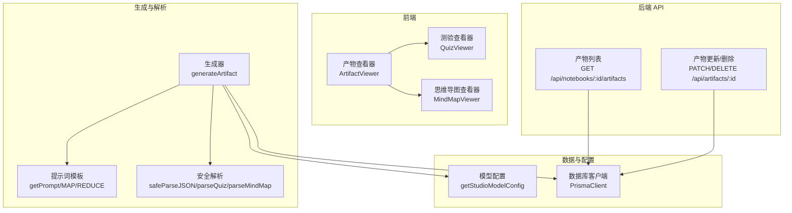
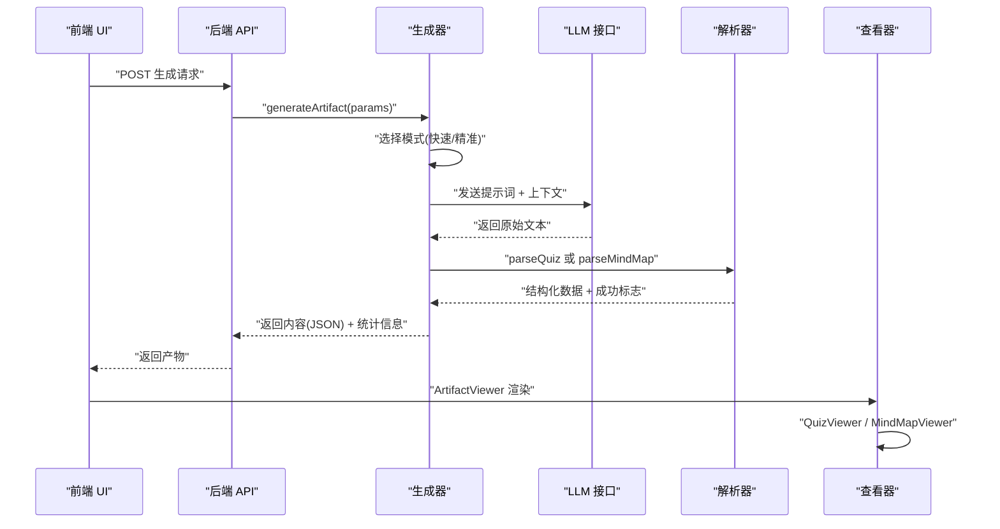
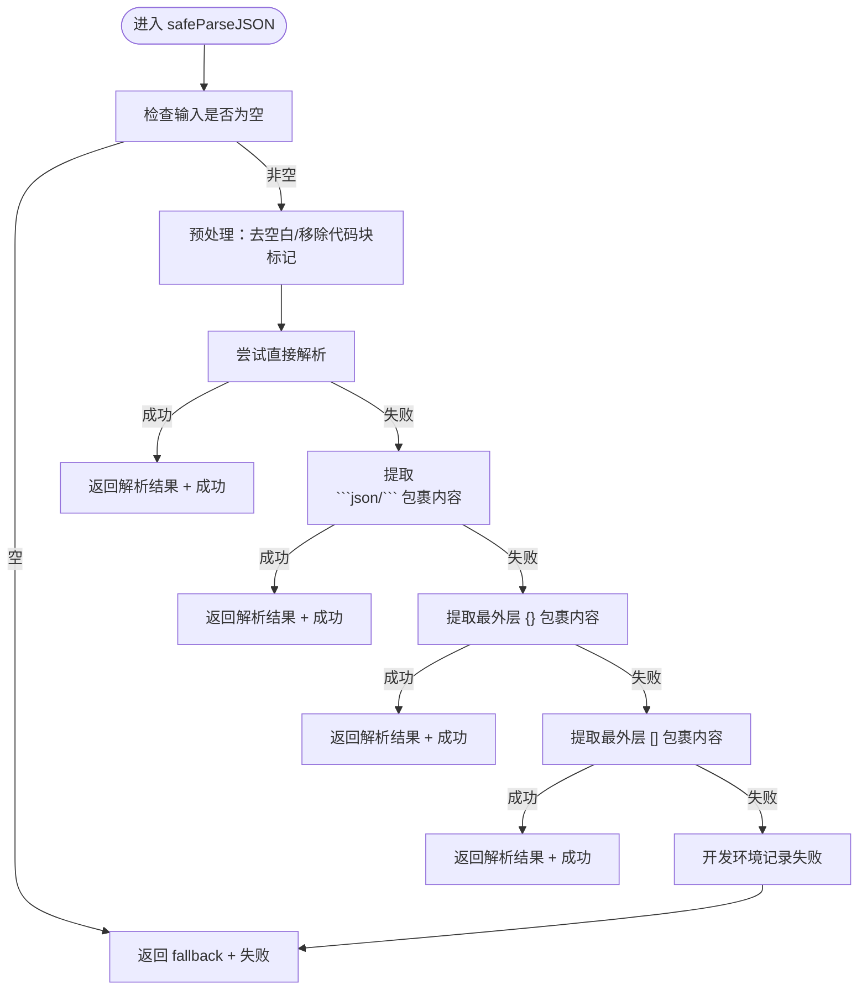
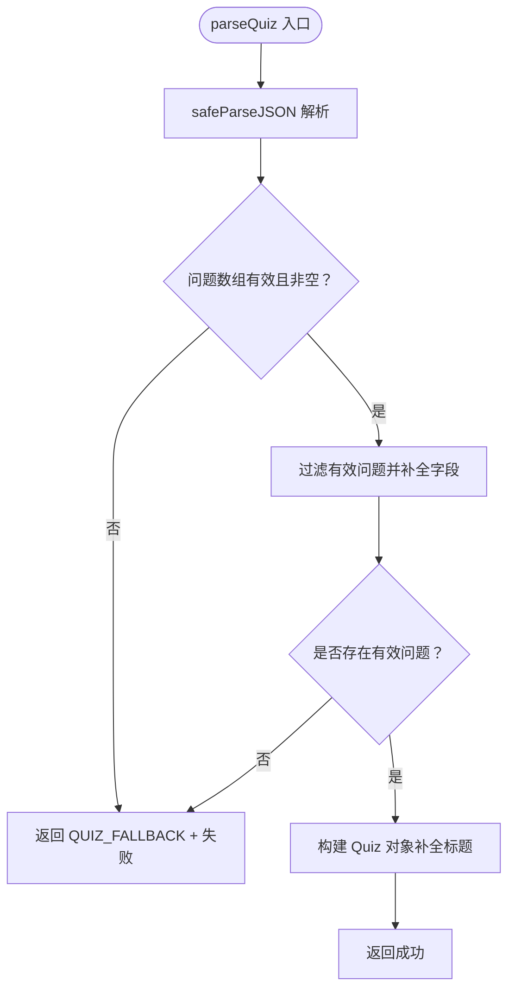
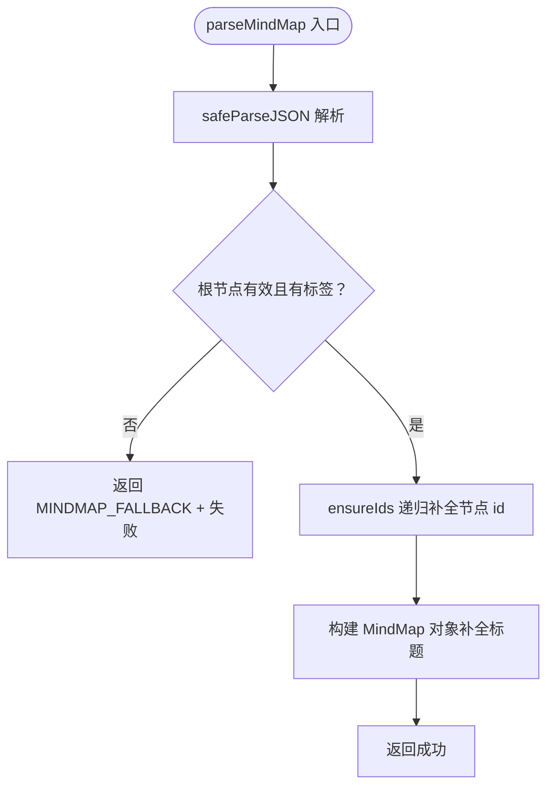
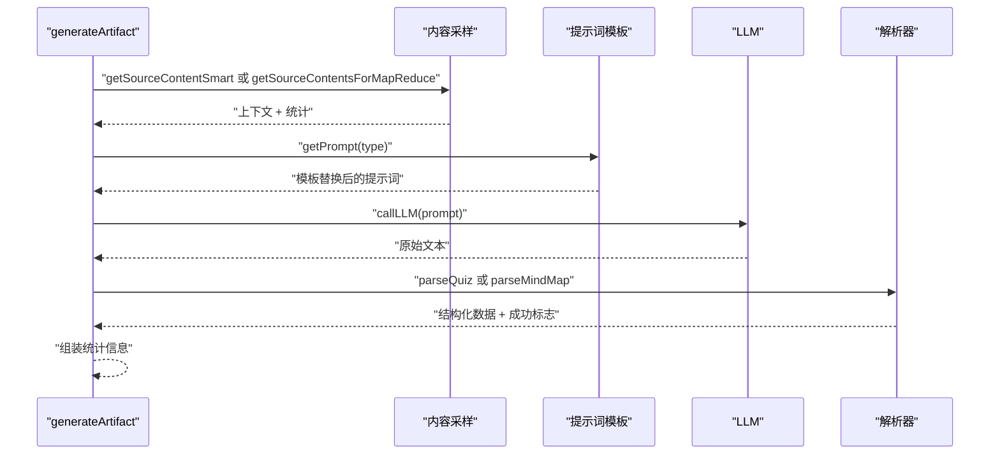
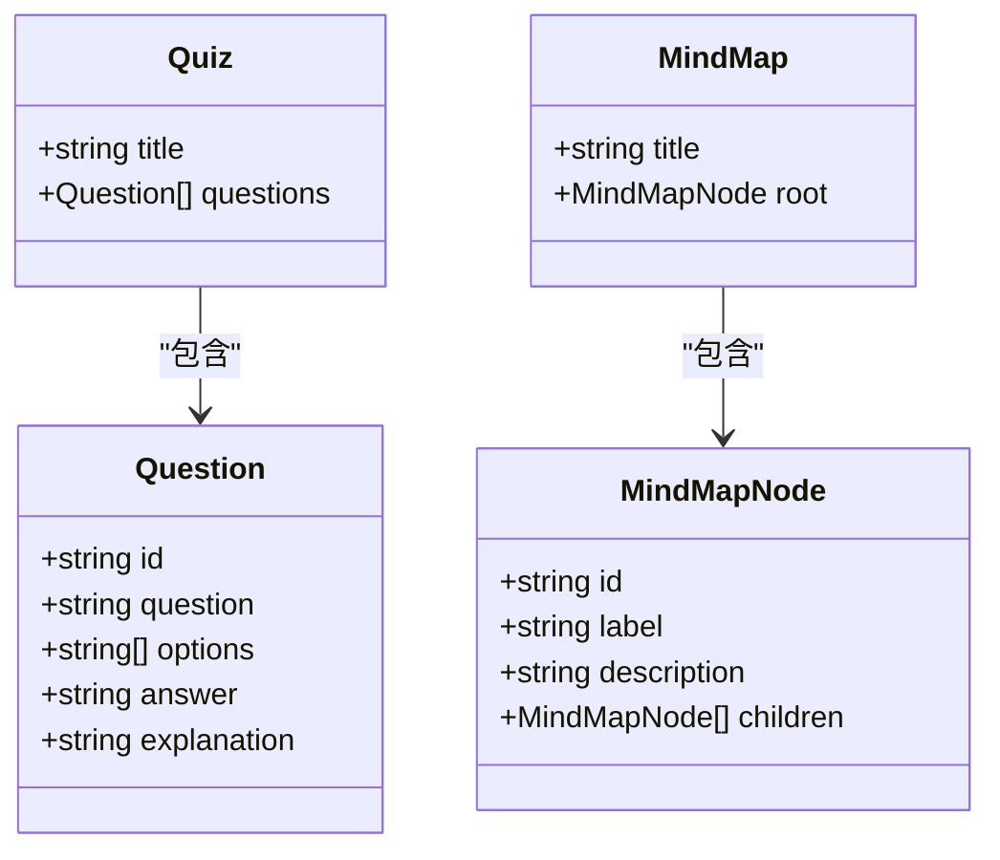
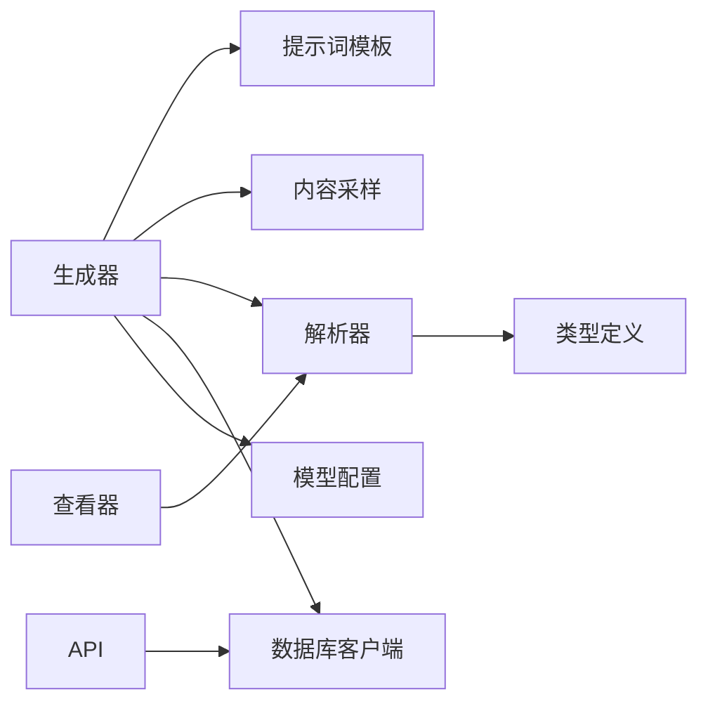

# 产物解析与格式化

<cite>
**本文引用的文件**
- [lib/studio/parser.ts](file://lib/studio/parser.ts)
- [lib/studio/generator.ts](file://lib/studio/generator.ts)
- [lib/studio/prompts.ts](file://lib/studio/prompts.ts)
- [lib/studio/content.ts](file://lib/studio/content.ts)
- [lib/studio/index.ts](file://lib/studio/index.ts)
- [types/index.ts](file://types/index.ts)
- [components/notebook/quiz-viewer.tsx](file://components/notebook/quiz-viewer.tsx)
- [components/notebook/mindmap-viewer.tsx](file://components/notebook/mindmap-viewer.tsx)
- [components/notebook/artifact-viewer.tsx](file://components/notebook/artifact-viewer.tsx)
- [app/api/notebooks/[id]/artifacts/route.ts](file://app/api/notebooks/[id]/artifacts/route.ts)
- [app/api/artifacts/[id]/route.ts](file://app/api/artifacts/[id]/route.ts)
- [lib/config.ts](file://lib/config.ts)
- [lib/db/prisma.ts](file://lib/db/prisma.ts)
</cite>

## 目录
1. [简介](#简介)
2. [项目结构](#项目结构)
3. [核心组件](#核心组件)
4. [架构总览](#架构总览)
5. [详细组件分析](#详细组件分析)
6. [依赖关系分析](#依赖关系分析)
7. [性能考量](#性能考量)
8. [故障排查指南](#故障排查指南)
9. [结论](#结论)
10. [附录](#附录)

## 简介
本文件面向“产物解析与格式化”系统，围绕测验（quiz）与思维导图（mindmap）两类产物，系统性阐述其数据结构设计、解析与格式化流程、错误处理策略、验证与质量保障、性能优化与扩展指南。目标是帮助开发者快速理解并安全地扩展解析能力，同时为非技术读者提供清晰的使用与维护指引。

## 项目结构
该系统位于前端应用与后端 API 之间，采用“提示词驱动 + LLM 生成 + 安全解析 + 组件渲染”的分层架构：
- 提示词层：定义不同产物的输出约束与格式规范
- 生成层：根据模式（快速/精准）调用模型，产出原始文本
- 解析层：将原始文本安全地解析为结构化数据，并进行验证与补全
- 渲染层：根据产物类型渲染为可交互的 UI 组件
- API 层：提供产物的增删改查接口，保障权限与数据一致性

图表来源
- [lib/studio/generator.ts](file://lib/studio/generator.ts#L1-L311)
- [lib/studio/prompts.ts](file://lib/studio/prompts.ts#L1-L211)
- [lib/studio/parser.ts](file://lib/studio/parser.ts#L1-L183)
- [components/notebook/artifact-viewer.tsx](file://components/notebook/artifact-viewer.tsx#L1-L66)
- [components/notebook/quiz-viewer.tsx](file://components/notebook/quiz-viewer.tsx#L1-L205)
- [components/notebook/mindmap-viewer.tsx](file://components/notebook/mindmap-viewer.tsx#L1-L183)
- [app/api/notebooks/[id]/artifacts/route.ts](file://app/api/notebooks/[id]/artifacts/route.ts#L1-L77)
- [app/api/artifacts/[id]/route.ts](file://app/api/artifacts/[id]/route.ts#L1-L141)
- [lib/config.ts](file://lib/config.ts#L1-L187)
- [lib/db/prisma.ts](file://lib/db/prisma.ts#L1-L41)

章节来源
- [lib/studio/index.ts](file://lib/studio/index.ts#L1-L25)
- [lib/studio/generator.ts](file://lib/studio/generator.ts#L1-L311)
- [lib/studio/parser.ts](file://lib/studio/parser.ts#L1-L183)
- [lib/studio/prompts.ts](file://lib/studio/prompts.ts#L1-L211)
- [lib/studio/content.ts](file://lib/studio/content.ts#L1-L258)
- [components/notebook/artifact-viewer.tsx](file://components/notebook/artifact-viewer.tsx#L1-L66)
- [components/notebook/quiz-viewer.tsx](file://components/notebook/quiz-viewer.tsx#L1-L205)
- [components/notebook/mindmap-viewer.tsx](file://components/notebook/mindmap-viewer.tsx#L1-L183)
- [app/api/notebooks/[id]/artifacts/route.ts](file://app/api/notebooks/[id]/artifacts/route.ts#L1-L77)
- [app/api/artifacts/[id]/route.ts](file://app/api/artifacts/[id]/route.ts#L1-L141)
- [lib/config.ts](file://lib/config.ts#L1-L187)
- [lib/db/prisma.ts](file://lib/db/prisma.ts#L1-L41)

## 核心组件
- 产物类型与数据结构
  - 测验（quiz）：包含标题与问题数组；问题包含唯一标识、题干、选项数组、正确答案与解析
  - 思维导图（mindmap）：包含标题与根节点；根节点包含唯一标识、标签、可选描述与可选子节点数组
- 安全解析与验证
  - safeParseJSON：多策略提取与解析，支持去除代码块标记、提取大括号/方括号包裹内容等
  - parseQuiz：验证问题集合有效性，补全缺失字段并返回结构化对象
  - parseMindMap：验证根节点有效性，递归补全节点 ID 并返回结构化对象
- 生成与模式
  - 快速模式：智能采样 + 单轮提示词生成
  - 精准模式：Map-Reduce 分布式生成，先按来源拆分，再合并提炼
- 渲染与交互
  - 测验查看器：本地存储答题进度、计算得分、展示解析
  - 思维导图查看器：基于 React Flow 渲染，支持导出 PNG

章节来源
- [lib/studio/parser.ts](file://lib/studio/parser.ts#L6-L50)
- [lib/studio/parser.ts](file://lib/studio/parser.ts#L56-L182)
- [lib/studio/generator.ts](file://lib/studio/generator.ts#L118-L237)
- [lib/studio/prompts.ts](file://lib/studio/prompts.ts#L57-L116)
- [components/notebook/quiz-viewer.tsx](file://components/notebook/quiz-viewer.tsx#L19-L205)
- [components/notebook/mindmap-viewer.tsx](file://components/notebook/mindmap-viewer.tsx#L102-L183)

## 架构总览
系统以“提示词模板 + 生成器 + 安全解析 + 组件渲染”为主线，结合 API 层实现产物的持久化与权限控制。

图表来源
- [lib/studio/generator.ts](file://lib/studio/generator.ts#L242-L262)
- [lib/studio/generator.ts](file://lib/studio/generator.ts#L118-L166)
- [lib/studio/generator.ts](file://lib/studio/generator.ts#L171-L237)
- [lib/studio/parser.ts](file://lib/studio/parser.ts#L124-L150)
- [lib/studio/parser.ts](file://lib/studio/parser.ts#L155-L182)
- [components/notebook/artifact-viewer.tsx](file://components/notebook/artifact-viewer.tsx#L21-L56)

## 详细组件分析

### JSON 安全解析模块（safeParseJSON）
- 设计目标：规避 LLM 输出格式不规范带来的解析失败风险
- 解析策略（优先级）：
  1) 直接解析清理后的文本
  2) 提取 Markdown 代码块中的 JSON 片段
  3) 提取最外层大括号包裹的对象
  4) 提取最外层方括号包裹的数组
- 容错与回退：若全部失败，返回预设 fallback 对象并标记失败
- 开发环境日志：记录原始输入片段以便调试

图表来源
- [lib/studio/parser.ts](file://lib/studio/parser.ts#L56-L119)

章节来源
- [lib/studio/parser.ts](file://lib/studio/parser.ts#L56-L119)

### 测验解析（parseQuiz）
- 输入：LLM 返回的原始文本
- 解析步骤：
  1) 使用 safeParseJSON 进行安全解析
  2) 验证问题数组存在且非空
  3) 过滤并补全每个问题的必要字段（如缺失 id、explanation）
- 输出：结构化的 Quiz 对象与解析成功标志

图表来源
- [lib/studio/parser.ts](file://lib/studio/parser.ts#L124-L150)

章节来源
- [lib/studio/parser.ts](file://lib/studio/parser.ts#L124-L150)

### 思维导图解析（parseMindMap）
- 输入：LLM 返回的原始文本
- 解析步骤：
  1) 使用 safeParseJSON 进行安全解析
  2) 验证根节点存在且包含标签
  3) 递归补全每个节点的 id（若缺失），并保持层级关系
- 输出：结构化的 MindMap 对象与解析成功标志

图表来源
- [lib/studio/parser.ts](file://lib/studio/parser.ts#L155-L182)

章节来源
- [lib/studio/parser.ts](file://lib/studio/parser.ts#L155-L182)

### 生成器（generateArtifact）
- 模式选择：快速模式（智能采样） vs 精准模式（Map-Reduce）
- 快速模式：
  - 通过智能采样获取上下文
  - 发送单轮提示词给 LLM
  - 调用对应解析器（parseQuiz/parseMindMap）
- 精准模式：
  - Map 阶段：对每个来源生成中间结果
  - Reduce 阶段：合并中间结果并再次调用 LLM
  - 最终调用解析器
- 超时与错误：
  - 使用 AbortController 控制超时
  - 对推理模型尝试从 reasoning_content 中提取 JSON
- 统计信息：包含模式、策略、耗时、token 估算等

图表来源
- [lib/studio/generator.ts](file://lib/studio/generator.ts#L118-L166)
- [lib/studio/generator.ts](file://lib/studio/generator.ts#L171-L237)
- [lib/studio/content.ts](file://lib/studio/content.ts#L67-L154)
- [lib/studio/content.ts](file://lib/studio/content.ts#L159-L224)
- [lib/studio/prompts.ts](file://lib/studio/prompts.ts#L202-L210)

章节来源
- [lib/studio/generator.ts](file://lib/studio/generator.ts#L118-L237)
- [lib/studio/content.ts](file://lib/studio/content.ts#L67-L224)
- [lib/studio/prompts.ts](file://lib/studio/prompts.ts#L202-L210)

### 提示词模板（Prompts）
- 测验与思维导图均要求严格 JSON 输出
- Map-Reduce 模式分别提供 Map 与 Reduce 阶段的提示词
- 通过占位符注入上下文或中间结果

章节来源
- [lib/studio/prompts.ts](file://lib/studio/prompts.ts#L57-L116)
- [lib/studio/prompts.ts](file://lib/studio/prompts.ts#L119-L198)
- [lib/studio/prompts.ts](file://lib/studio/prompts.ts#L202-L210)

### 内容采样与截断（Content Sampling & Truncation）
- 快速模式：对每个来源取头部与尾部若干 chunks，确保覆盖全面
- Map-Reduce 模式：对每个来源限制最大 chunks 数并单独截断
- 智能截断：按 Source 块边界保留完整块，避免切分语义单元

章节来源
- [lib/studio/content.ts](file://lib/studio/content.ts#L67-L154)
- [lib/studio/content.ts](file://lib/studio/content.ts#L159-L224)
- [lib/studio/content.ts](file://lib/studio/content.ts#L42-L61)

### 前端渲染与交互
- 产物查看器：根据类型判断是否需要 JSON 解析，否则直接渲染 Markdown
- 测验查看器：本地存储答题进度，计算得分，展示解析
- 思维导图查看器：将树形结构转换为 React Flow 节点与边，支持导出 PNG

图表来源
- [lib/studio/parser.ts](file://lib/studio/parser.ts#L6-L27)

章节来源
- [components/notebook/artifact-viewer.tsx](file://components/notebook/artifact-viewer.tsx#L21-L56)
- [components/notebook/quiz-viewer.tsx](file://components/notebook/quiz-viewer.tsx#L19-L205)
- [components/notebook/mindmap-viewer.tsx](file://components/notebook/mindmap-viewer.tsx#L102-L183)
- [lib/studio/parser.ts](file://lib/studio/parser.ts#L6-L27)

### API 层（产物管理）
- 列表接口：按笔记本查询产物列表，返回基础元信息
- 更新/删除接口：鉴权 + 所有权校验，支持更新标题与删除产物

章节来源
- [app/api/notebooks/[id]/artifacts/route.ts](file://app/api/notebooks/[id]/artifacts/route.ts#L13-L76)
- [app/api/artifacts/[id]/route.ts](file://app/api/artifacts/[id]/route.ts#L11-L82)
- [app/api/artifacts/[id]/route.ts](file://app/api/artifacts/[id]/route.ts#L85-L140)

## 依赖关系分析
- 生成器依赖提示词模板与内容采样模块
- 解析器依赖安全解析函数与预设 fallback
- 前端查看器依赖解析器输出与组件库
- API 层依赖数据库客户端与认证服务

图表来源
- [lib/studio/generator.ts](file://lib/studio/generator.ts#L1-L311)
- [lib/studio/prompts.ts](file://lib/studio/prompts.ts#L1-L211)
- [lib/studio/content.ts](file://lib/studio/content.ts#L1-L258)
- [lib/studio/parser.ts](file://lib/studio/parser.ts#L1-L183)
- [types/index.ts](file://types/index.ts#L14-L14)
- [components/notebook/artifact-viewer.tsx](file://components/notebook/artifact-viewer.tsx#L1-L66)
- [app/api/notebooks/[id]/artifacts/route.ts](file://app/api/notebooks/[id]/artifacts/route.ts#L1-L77)
- [lib/db/prisma.ts](file://lib/db/prisma.ts#L1-L41)
- [lib/config.ts](file://lib/config.ts#L149-L157)

章节来源
- [lib/studio/index.ts](file://lib/studio/index.ts#L6-L24)
- [types/index.ts](file://types/index.ts#L14-L14)

## 性能考量
- 采样策略
  - 快速模式：优先采样每个来源的头部与尾部 chunks，减少 token 使用并提升响应速度
  - Map-Reduce 模式：对每个来源限制最大 chunks 数，降低单次调用压力
- 截断策略
  - 按 Source 块边界截断，避免切分语义单元，提高生成质量
- 超时控制
  - 不同阶段设置不同超时，防止长尾请求阻塞
- 模型选择
  - 精准模式强制使用推理模型，适合复杂任务；快速模式适合快速反馈
- 建议
  - 批量生成时合并请求，减少网络往返
  - 对高频产物可考虑缓存解析结果（注意版本与来源变更）

[本节为通用性能建议，无需特定文件引用]

## 故障排查指南
- 解析失败
  - 现象：parseQuiz/parseMindMap 返回 fallback 且 success=false
  - 排查：确认提示词模板要求严格 JSON 输出；检查 LLM 是否返回代码块包裹；查看开发环境日志
- 空响应
  - 现象：LLM 返回空内容或 reasoning_content 为空
  - 排查：检查模型配置与 API Key；确认推理模型的 reasoning_content 提取逻辑
- 权限与数据
  - 现象：更新/删除产物返回 401/403/404
  - 排查：确认用户登录状态、产物所有权与笔记本归属
- 数据库连接
  - 现象：查询失败或连接异常
  - 排查：检查 DATABASE_URL 与连接池配置；确认 Serverless 环境下的连接限制

章节来源
- [lib/studio/parser.ts](file://lib/studio/parser.ts#L113-L118)
- [lib/studio/generator.ts](file://lib/studio/generator.ts#L85-L105)
- [app/api/artifacts/[id]/route.ts](file://app/api/artifacts/[id]/route.ts#L22-L60)
- [lib/db/prisma.ts](file://lib/db/prisma.ts#L8-L16)

## 结论
本系统通过严格的提示词约束、多策略的安全解析与完善的错误回退机制，确保测验与思维导图两类产物在多样化 LLM 输出场景下的稳定生成与高质量渲染。结合智能采样、分阶段生成与前端交互组件，实现了从生成到可视化的完整闭环。后续可在解析器扩展、缓存策略与批处理方面持续优化，以满足更大规模与更高并发的需求。

[本节为总结性内容，无需特定文件引用]

## 附录

### 解析结果验证与质量保证流程
- 结构验证：确保必要字段存在（测验的问题数组、思维导图的根节点标签）
- 数据完整性：补全缺失字段（如问题 id、解析说明、节点 id）
- 成功标志：统一返回 success 标志，便于上层决策
- 回退策略：失败时返回预设 fallback，保证 UI 可用性

章节来源
- [lib/studio/parser.ts](file://lib/studio/parser.ts#L128-L147)
- [lib/studio/parser.ts](file://lib/studio/parser.ts#L159-L179)

### 错误处理策略
- 输入校验：空输入直接回退
- 多策略解析：逐级尝试，失败记录日志
- LLM 超时：统一超时控制与错误抛出
- API 权限：鉴权 + 所有权校验，拒绝非法操作

章节来源
- [lib/studio/parser.ts](file://lib/studio/parser.ts#L57-L118)
- [lib/studio/generator.ts](file://lib/studio/generator.ts#L53-L115)
- [app/api/artifacts/[id]/route.ts](file://app/api/artifacts/[id]/route.ts#L18-L60)

### 解析器扩展指南
- 新增产物类型步骤
  1) 在类型定义中新增产物类型枚举
  2) 在提示词模板中添加对应的提示词与 Map/Reduce 模板
  3) 在解析器中新增 parseXxx 函数，遵循安全解析与验证流程
  4) 在生成器中接入新模式分支与调用逻辑
  5) 在前端查看器中新增渲染组件并接入 ArtifactViewer
  6) 在 API 层补充必要的权限与数据校验
- 现有解析器改进
  - 增强容错：支持更多 LLM 输出变体（如注释、多余内容）
  - 性能优化：引入缓存与批量处理
  - 质量提升：增加结构化校验规则与字段映射

章节来源
- [types/index.ts](file://types/index.ts#L14-L14)
- [lib/studio/prompts.ts](file://lib/studio/prompts.ts#L119-L198)
- [lib/studio/parser.ts](file://lib/studio/parser.ts#L124-L182)
- [lib/studio/generator.ts](file://lib/studio/generator.ts#L118-L237)
- [components/notebook/artifact-viewer.tsx](file://components/notebook/artifact-viewer.tsx#L35-L56)