# 内容生成系统

<cite>
**本文引用的文件**
- [app/api/studio/generate/route.ts](file://app/api/studio/generate/route.ts)
- [lib/studio/generator.ts](file://lib/studio/generator.ts)
- [lib/studio/parser.ts](file://lib/studio/parser.ts)
- [lib/studio/prompts.ts](file://lib/studio/prompts.ts)
- [lib/studio/content.ts](file://lib/studio/content.ts)
- [lib/studio/index.ts](file://lib/studio/index.ts)
- [app/api/templates/[id]/run/route.ts](file://app/api/templates/[id]/run/route.ts)
- [lib/config.ts](file://lib/config.ts)
- [components/notebook/studio-panel.tsx](file://components/notebook/studio-panel.tsx)
- [components/notebook/studio-mode-select.tsx](file://components/notebook/studio-mode-select.tsx)
- [components/notebook/artifact-card.tsx](file://components/notebook/artifact-card.tsx)
- [app/api/artifacts/[id]/route.ts](file://app/api/artifacts/[id]/route.ts)
- [lib/db/prisma.ts](file://lib/db/prisma.ts)
- [prisma/schema.prisma](file://prisma/schema.prisma)
- [scripts/seed-templates.ts](file://scripts/seed-templates.ts)
</cite>

## 更新摘要
**所做变更**
- 优化了生成器的代码格式化和异常处理机制
- 改进了提示工程系统的结构化设计
- 增强了API路由的错误处理和参数验证
- 优化了推理模型的响应处理和JSON提取逻辑
- 完善了Map-Reduce并行处理的重试机制

## 目录
1. [简介](#简介)
2. [项目结构](#项目结构)
3. [核心组件](#核心组件)
4. [架构总览](#架构总览)
5. [详细组件分析](#详细组件分析)
6. [依赖关系分析](#依赖关系分析)
7. [性能考量](#性能考量)
8. [故障排查指南](#故障排查指南)
9. [结论](#结论)
10. [附录](#附录)

## 简介
本文件面向 notebookLM-clone 项目中的内容生成系统，围绕 Studio 架构设计进行系统化说明。重点涵盖：
- 生成模式选择：快速模式与精准模式的差异、适用场景与性能特征
- 模板系统：模板定义、参数注入与动态渲染机制
- 产物解析机制：JSON/Markdown 格式的解析、结构化数据提取与容错处理
- 提示词工程：上下文构建、指令设计与输出格式控制
- 质量评估与优化：参数调优、迭代改进与效果验证
- 扩展性设计：新模板支持、模型适配与功能扩展
- 监控、日志与调试：生成过程的可观测性与问题定位

## 项目结构
内容生成系统由三层组成：
- 前端交互层：Studio 面板、模式选择、产物展示与操作
- API 控制层：生成与模板运行接口，鉴权与参数校验
- 生成与解析层：内容采样、提示词模板、LLM 调用、Map-Reduce 实现、产物解析

```mermaid
graph TB
subgraph "前端"
SP["Studio 面板<br/>components/notebook/studio-panel.tsx"]
SMS["模式选择<br/>components/notebook/studio-mode-select.tsx"]
AC["产物卡片<br/>components/notebook/artifact-card.tsx"]
end
subgraph "API"
APIG["生成接口<br/>app/api/studio/generate/route.ts"]
APIT["模板运行接口<br/>app/api/templates/[id]/run/route.ts"]
APIA["产物 CRUD 接口<br/>app/api/artifacts/[id]/route.ts"]
end
subgraph "生成与解析"
GEN["生成器<br/>lib/studio/generator.ts"]
PROMPT["提示词模板<br/>lib/studio/prompts.ts"]
CONTENT["内容采样<br/>lib/studio/content.ts"]
PARSER["产物解析<br/>lib/studio/parser.ts"]
end
subgraph "基础设施"
CONF["配置<br/>lib/config.ts"]
PRISMA["ORM/Schema<br/>lib/db/prisma.ts<br/>prisma/schema.prisma"]
end
SP --> APIG
SMS --> APIG
AC --> APIA
APIG --> GEN
APIT --> GEN
GEN --> PROMPT
GEN --> CONTENT
GEN --> PARSER
GEN --> CONF
GEN --> PRISMA
APIG --> PRISMA
APIT --> PRISMA
```

**图表来源**
- [components/notebook/studio-panel.tsx](file://components/notebook/studio-panel.tsx#L1-L261)
- [components/notebook/studio-mode-select.tsx](file://components/notebook/studio-mode-select.tsx#L1-L65)
- [components/notebook/artifact-card.tsx](file://components/notebook/artifact-card.tsx#L1-L223)
- [app/api/studio/generate/route.ts](file://app/api/studio/generate/route.ts#L1-L145)
- [app/api/templates/[id]/run/route.ts](file://app/api/templates/[id]/run/route.ts#L1-L104)
- [app/api/artifacts/[id]/route.ts](file://app/api/artifacts/[id]/route.ts#L1-L140)
- [lib/studio/generator.ts](file://lib/studio/generator.ts#L1-L523)
- [lib/studio/prompts.ts](file://lib/studio/prompts.ts#L1-L211)
- [lib/studio/content.ts](file://lib/studio/content.ts#L1-L258)
- [lib/studio/parser.ts](file://lib/studio/parser.ts#L1-L183)
- [lib/config.ts](file://lib/config.ts#L1-L187)
- [lib/db/prisma.ts](file://lib/db/prisma.ts#L1-L41)
- [prisma/schema.prisma](file://prisma/schema.prisma#L1-L140)

**章节来源**
- [components/notebook/studio-panel.tsx](file://components/notebook/studio-panel.tsx#L1-L261)
- [app/api/studio/generate/route.ts](file://app/api/studio/generate/route.ts#L1-L145)
- [lib/studio/generator.ts](file://lib/studio/generator.ts#L1-L523)
- [lib/studio/prompts.ts](file://lib/studio/prompts.ts#L1-L211)
- [lib/studio/content.ts](file://lib/studio/content.ts#L1-L258)
- [lib/studio/parser.ts](file://lib/studio/parser.ts#L1-L183)
- [lib/config.ts](file://lib/config.ts#L1-L187)
- [lib/db/prisma.ts](file://lib/db/prisma.ts#L1-L41)
- [prisma/schema.prisma](file://prisma/schema.prisma#L1-L140)

## 核心组件
- 生成器（generator.ts）：统一生成入口，实现快速模式与精准模式，封装 LLM 调用、超时控制、Map-Reduce 流程与产物解析
- 内容采样（content.ts）：智能采样策略，按 Source 分割与截断，估算 token，保障上下文大小可控
- 提示词模板（prompts.ts）：定义摘要、大纲、测验、思维导图的标准模板与 Map-Reduce 的 Map/Reduce 模板
- 产物解析（parser.ts）：安全解析 JSON，提供结构化数据与回退策略
- 模板运行（app/api/templates/[id]/run/route.ts）：基于模板变量与上下文生成自定义产物
- 配置（config.ts）：模型提供商与默认模型配置，Studio 默认强制使用推理模型
- 数据模型（schema.prisma）：Notebook、Source、Message、Artifact、PromptTemplate 等核心实体
- 前端组件（studio-panel.tsx、studio-mode-select.tsx、artifact-card.tsx）：用户交互与产物展示

**章节来源**
- [lib/studio/generator.ts](file://lib/studio/generator.ts#L1-L523)
- [lib/studio/content.ts](file://lib/studio/content.ts#L1-L258)
- [lib/studio/prompts.ts](file://lib/studio/prompts.ts#L1-L211)
- [lib/studio/parser.ts](file://lib/studio/parser.ts#L1-L183)
- [app/api/templates/[id]/run/route.ts](file://app/api/templates/[id]/run/route.ts#L1-L104)
- [lib/config.ts](file://lib/config.ts#L1-L187)
- [prisma/schema.prisma](file://prisma/schema.prisma#L1-L140)
- [components/notebook/studio-panel.tsx](file://components/notebook/studio-panel.tsx#L1-L261)
- [components/notebook/studio-mode-select.tsx](file://components/notebook/studio-mode-select.tsx#L1-L65)
- [components/notebook/artifact-card.tsx](file://components/notebook/artifact-card.tsx#L1-L223)

## 架构总览
内容生成系统采用"前端触发 → API 校验 → 生成器调度 → LLM 调用 → 解析入库"的闭环流程。生成器根据模式选择走"智能采样"或"Map-Reduce"，并在生成后进行结构化解析与持久化。

**图表来源**
- [app/api/studio/generate/route.ts](file://app/api/studio/generate/route.ts#L1-L145)
- [lib/studio/generator.ts](file://lib/studio/generator.ts#L1-L523)
- [lib/studio/content.ts](file://lib/studio/content.ts#L1-L258)
- [lib/studio/parser.ts](file://lib/studio/parser.ts#L1-L183)
- [lib/db/prisma.ts](file://lib/db/prisma.ts#L1-L41)

## 详细组件分析

### 生成模式：快速模式 vs 精准模式
- 快速模式（fast）
  - 采样策略：对每个 Source 采样头部与尾部若干片段，兼顾覆盖面与效率
  - 上下文截断：按 Source 块智能截断，避免超过 token 限制
  - 超时控制：较短超时时间，适合快速反馈
  - 适用场景：快速预览、小规模资料、对时效敏感的任务
- 精准模式（precise）
  - Map-Reduce 实现：对每个 Source 生成中间结果，再在 Reduce 阶段合并
  - 更多上下文：每个 Source 读取限定数量的片段，整体上下文更全面
  - 超时控制：较长超时时间，适合高质量产出
  - 适用场景：大规模资料、需要全面整合的场景

**图表来源**
- [lib/studio/generator.ts](file://lib/studio/generator.ts#L124-L448)
- [lib/studio/content.ts](file://lib/studio/content.ts#L63-L224)
- [lib/studio/parser.ts](file://lib/studio/parser.ts#L121-L182)

**章节来源**
- [lib/studio/generator.ts](file://lib/studio/generator.ts#L124-L448)
- [lib/studio/content.ts](file://lib/studio/content.ts#L63-L224)

### 模板系统：定义、参数注入与动态渲染
- 模板存储：PromptTemplate 表，支持系统模板与用户模板，定义变量列表
- 模板运行：通过模板 ID 与变量字典调用生成器，支持自动注入上下文占位符
- 参数注入：将变量名替换为实际值；若模板包含上下文占位符，则先注入上下文
- 产物类型：模板运行生成的产物类型为自定义，便于灵活扩展

**图表来源**
- [app/api/templates/[id]/run/route.ts](file://app/api/templates/[id]/run/route.ts#L1-L104)
- [lib/studio/generator.ts](file://lib/studio/generator.ts#L478-L522)
- [prisma/schema.prisma](file://prisma/schema.prisma#L99-L115)

**章节来源**
- [app/api/templates/[id]/run/route.ts](file://app/api/templates/[id]/run/route.ts#L1-L104)
- [lib/studio/generator.ts](file://lib/studio/generator.ts#L478-L522)
- [prisma/schema.prisma](file://prisma/schema.prisma#L99-L115)
- [scripts/seed-templates.ts](file://scripts/seed-templates.ts#L45-L85)

### 产物解析机制：JSON/Markdown 解析与容错
- 结构化解析：针对测验与思维导图两类结构化产物，提供安全解析函数
- 容错策略：支持多种包裹形式（JSON 代码块、对象包裹、数组包裹），并提供回退结构
- 回退机制：解析失败时返回预设回退对象，保证前端稳定展示

**图表来源**
- [lib/studio/parser.ts](file://lib/studio/parser.ts#L52-L182)

**章节来源**
- [lib/studio/parser.ts](file://lib/studio/parser.ts#L1-L183)

### 提示词工程：上下文构建、指令设计与输出格式控制
- 上下文构建：按 Source 分块拼接，保留完整 Source 边界，避免截断语义碎片
- 指令设计：为不同产物类型提供明确的输出格式约束（如 JSON 结构、层级大纲）
- 输出格式控制：严格约束输出格式，减少解析歧义；对推理模型返回的 reasoning_content 进行 JSON 提取

**章节来源**
- [lib/studio/prompts.ts](file://lib/studio/prompts.ts#L1-L211)
- [lib/studio/content.ts](file://lib/studio/content.ts#L40-L61)
- [lib/studio/generator.ts](file://lib/studio/generator.ts#L56-L119)

### 生成质量评估与优化
- 统计指标：总 chunk 数、使用 chunk 数、估算 token 数、Source 数、耗时
- 评估维度：覆盖率（是否覆盖关键头尾）、一致性（格式约束）、完整性（结构化字段）
- 优化建议：
  - 调整采样比例与最大片段数，平衡速度与覆盖
  - 优化 Map-Reduce 的中间结果长度与截断策略
  - 通过模板变量精细化控制上下文与输出格式
  - 增加重试与降级策略，提升稳定性

**章节来源**
- [lib/studio/generator.ts](file://lib/studio/generator.ts#L43-L51)
- [lib/studio/content.ts](file://lib/studio/content.ts#L16-L21)

### 扩展性设计
- 新模板支持：通过 PromptTemplate 表新增模板，定义变量列表，即可在模板运行接口中使用
- 模型适配：配置层抽象模型提供商，Studio 默认推理模型可替换
- 功能扩展：生成器支持自定义产物类型，解析器可扩展新的结构化格式

**章节来源**
- [prisma/schema.prisma](file://prisma/schema.prisma#L99-L115)
- [lib/config.ts](file://lib/config.ts#L149-L157)
- [lib/studio/generator.ts](file://lib/studio/generator.ts#L478-L522)

### 异常处理与错误恢复机制
- 超时处理：精确模式下为 Map 阶段设置独立超时时间，支持指数退避重试
- 错误分类：区分超时、网络错误和业务错误，提供针对性的错误响应
- 进度监控：Map 阶段支持实时进度回调，便于用户感知生成状态
- 开发调试：在开发环境下提供详细的错误日志和响应分析

**章节来源**
- [lib/studio/generator.ts](file://lib/studio/generator.ts#L190-L282)
- [lib/studio/generator.ts](file://lib/studio/generator.ts#L412-L414)

## 依赖关系分析
- 生成器依赖提示词模板、内容采样与解析模块，并通过配置模块获取模型信息
- API 层负责鉴权、参数校验与数据库持久化
- 数据层通过 Prisma ORM 管理核心实体，Schema 定义了产物与模板的结构

**图表来源**
- [app/api/studio/generate/route.ts](file://app/api/studio/generate/route.ts#L1-L145)
- [app/api/templates/[id]/run/route.ts](file://app/api/templates/[id]/run/route.ts#L1-L104)
- [lib/studio/generator.ts](file://lib/studio/generator.ts#L1-L523)
- [lib/studio/prompts.ts](file://lib/studio/prompts.ts#L1-L211)
- [lib/studio/content.ts](file://lib/studio/content.ts#L1-L258)
- [lib/studio/parser.ts](file://lib/studio/parser.ts#L1-L183)
- [lib/config.ts](file://lib/config.ts#L1-L187)
- [lib/db/prisma.ts](file://lib/db/prisma.ts#L1-L41)
- [prisma/schema.prisma](file://prisma/schema.prisma#L1-L140)

**章节来源**
- [lib/studio/index.ts](file://lib/studio/index.ts#L1-L25)
- [lib/db/prisma.ts](file://lib/db/prisma.ts#L1-L41)
- [prisma/schema.prisma](file://prisma/schema.prisma#L1-L140)

## 性能考量
- 采样与截断：通过智能截断与最大片段数限制，控制上下文大小，避免超限
- 超时策略：快速模式与精准模式分别设定不同超时时间，满足不同 SLA
- Map-Reduce：在精准模式下分 Source 并行 Map，降低单次调用压力
- 并发控制：Map 阶段使用 p-limit 控制并发数，支持重试机制
- 日志与统计：生成器返回耗时与 token 估算，便于性能分析与优化

**章节来源**
- [lib/studio/content.ts](file://lib/studio/content.ts#L40-L61)
- [lib/studio/generator.ts](file://lib/studio/generator.ts#L24-L29)
- [lib/studio/generator.ts](file://lib/studio/generator.ts#L124-L448)

## 故障排查指南
- 常见错误与处理
  - 未授权：鉴权失败或用户为空，返回 401
  - 缺少参数：缺少 notebookId 或 type，返回 400
  - 无效类型：type 不在允许范围内，返回 400
  - Notebook 不存在或无权访问：返回 404
  - 产物数量上限：超过 10 个，返回 400
  - 没有可用资料：无 ready 状态的 Source，抛出特定错误
  - 生成超时：LLM 调用超时，返回 504
  - 生成失败：Map-Reduce 中无中间结果，返回 500
  - Map 阶段失败：支持最多 2 次重试，最终失败返回具体错误
- 前端提示：Toast 展示错误信息，便于用户感知
- 开发环境：在开发模式下输出更详细的日志，辅助定位问题

**章节来源**
- [app/api/studio/generate/route.ts](file://app/api/studio/generate/route.ts#L113-L144)
- [app/api/templates/[id]/run/route.ts](file://app/api/templates/[id]/run/route.ts#L80-L102)
- [lib/studio/generator.ts](file://lib/studio/generator.ts#L108-L115)
- [lib/studio/generator.ts](file://lib/studio/generator.ts#L412-L414)
- [lib/studio/generator.ts](file://lib/studio/generator.ts#L216-L245)

## 结论
本内容生成系统以 Studio 为核心，结合快速与精准两种生成策略、完善的模板系统与结构化解析机制，在保证生成质量的同时兼顾性能与时效。通过清晰的模块划分、严格的提示词工程与可观测的统计指标，系统具备良好的扩展性与可维护性。最新的优化包括改进的异常处理、增强的Map-Reduce并行机制和优化的推理模型响应处理，进一步提升了系统的稳定性和用户体验。

## 附录

### 数据模型概览

**图表来源**
- [prisma/schema.prisma](file://prisma/schema.prisma#L16-L115)

### 生成器配置参数
- **MAX_OUTPUT_TOKENS**: 4096 - 增加 token 限制，推理模型需要更多空间
- **TIMEOUT_FAST**: 90000ms - 快速模式 90 秒（推理模型需要更长时间）
- **TIMEOUT_PRECISE**: 180000ms - 精准模式 180 秒
- **TIMEOUT_MAP_STEP**: 45000ms - Map 步骤 45 秒
- **MAP_CONCURRENCY_LIMIT**: 8 - Map 阶段并发数限制
- **MAP_MAX_RETRIES**: 2 - Map 失败最大重试次数

**章节来源**
- [lib/studio/generator.ts](file://lib/studio/generator.ts#L24-L29)