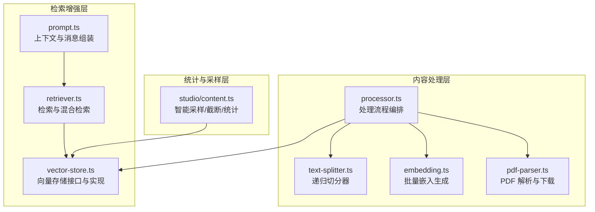
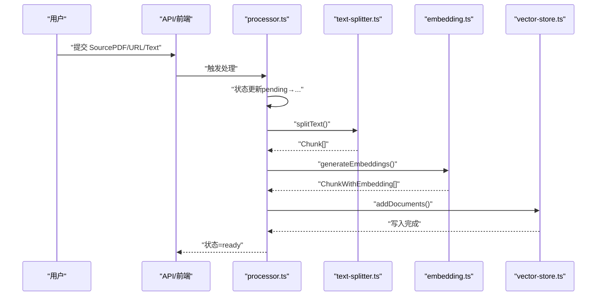
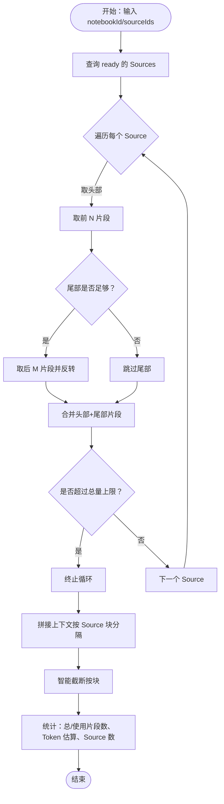
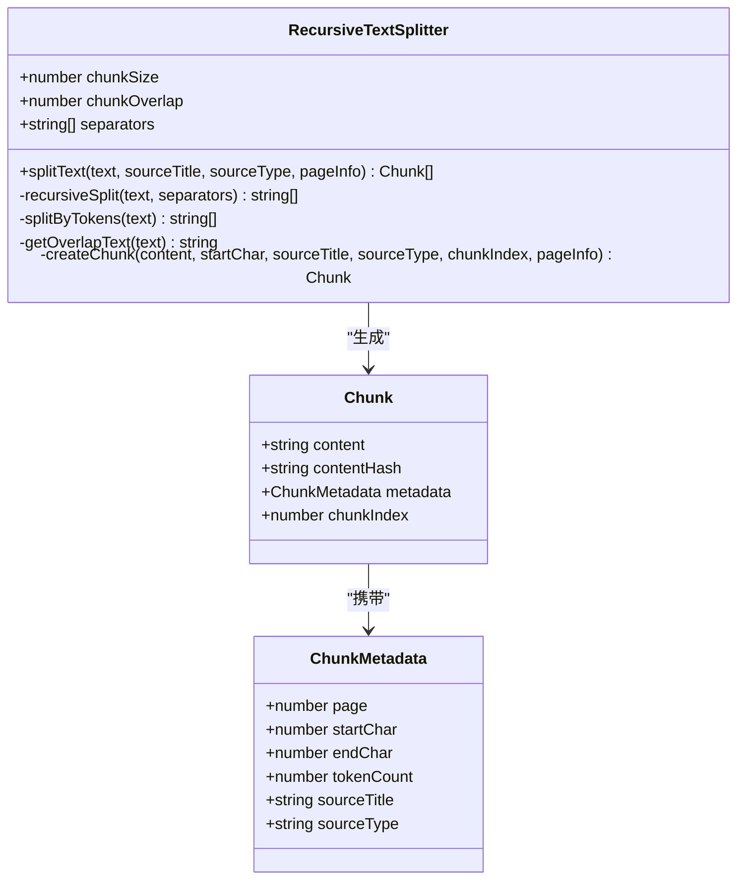
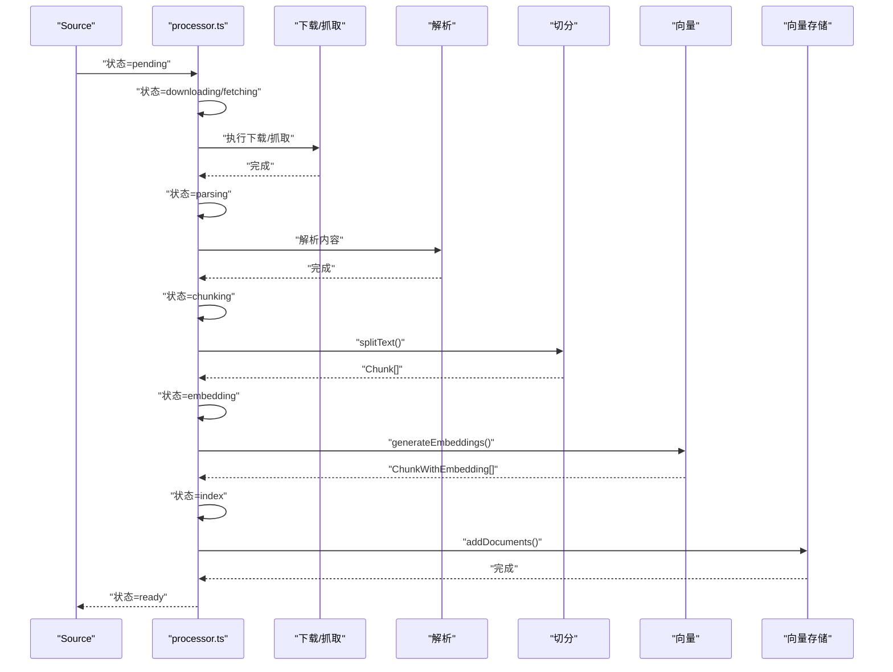
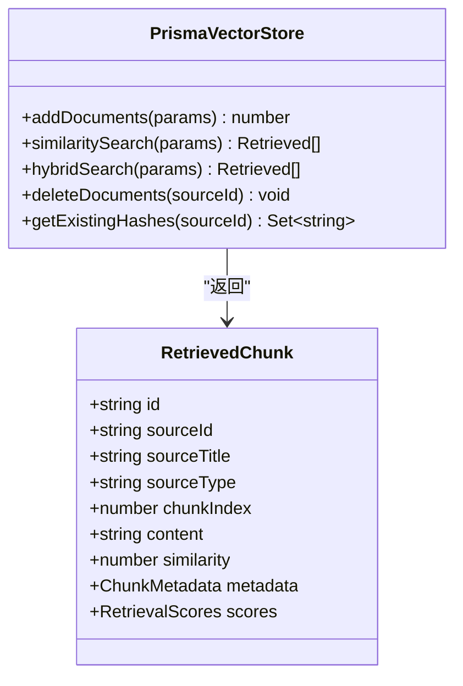
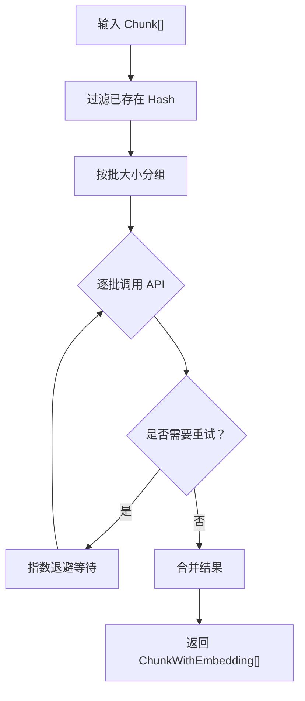
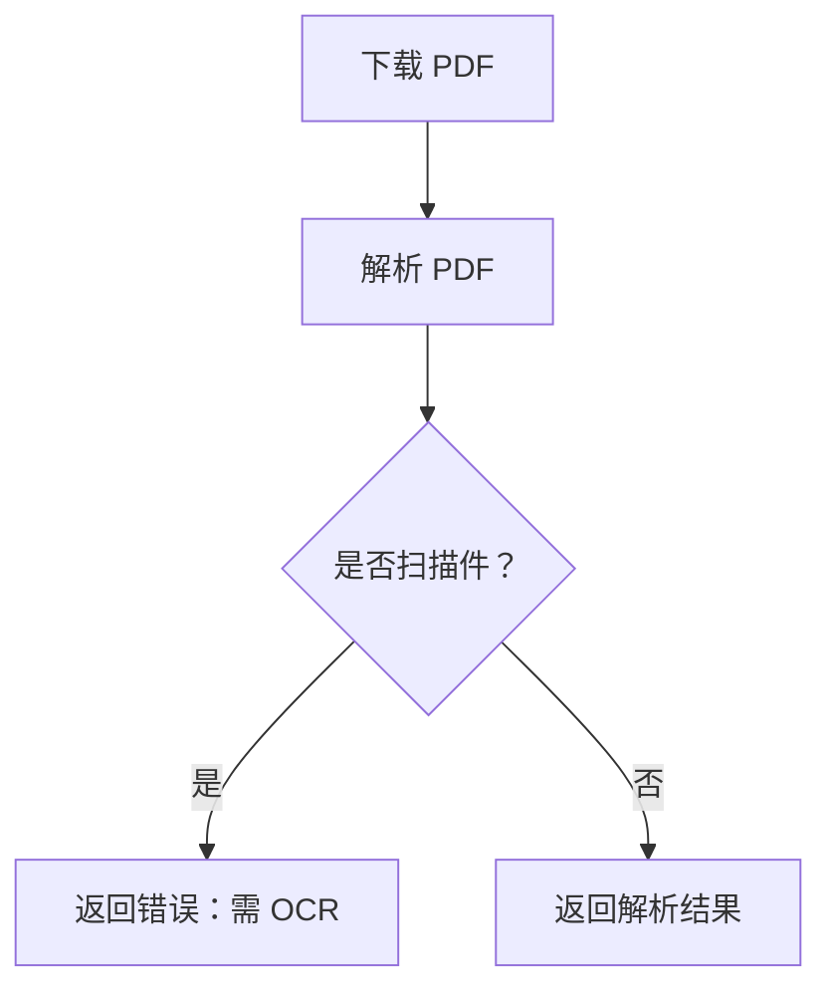
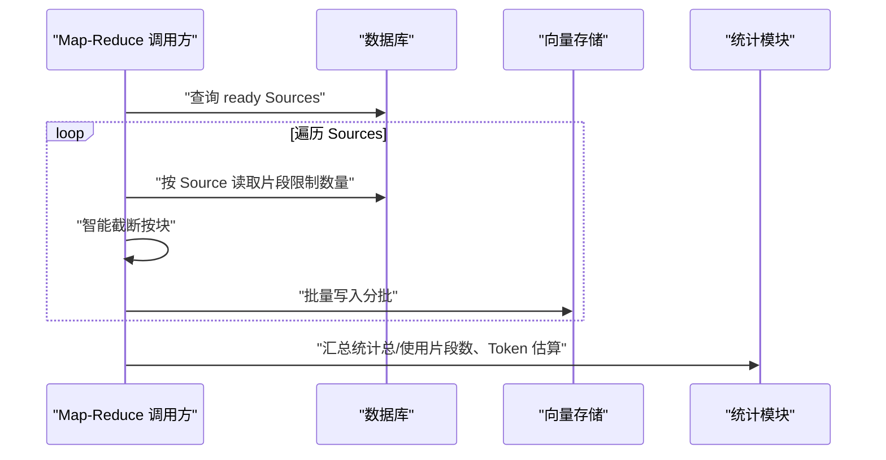
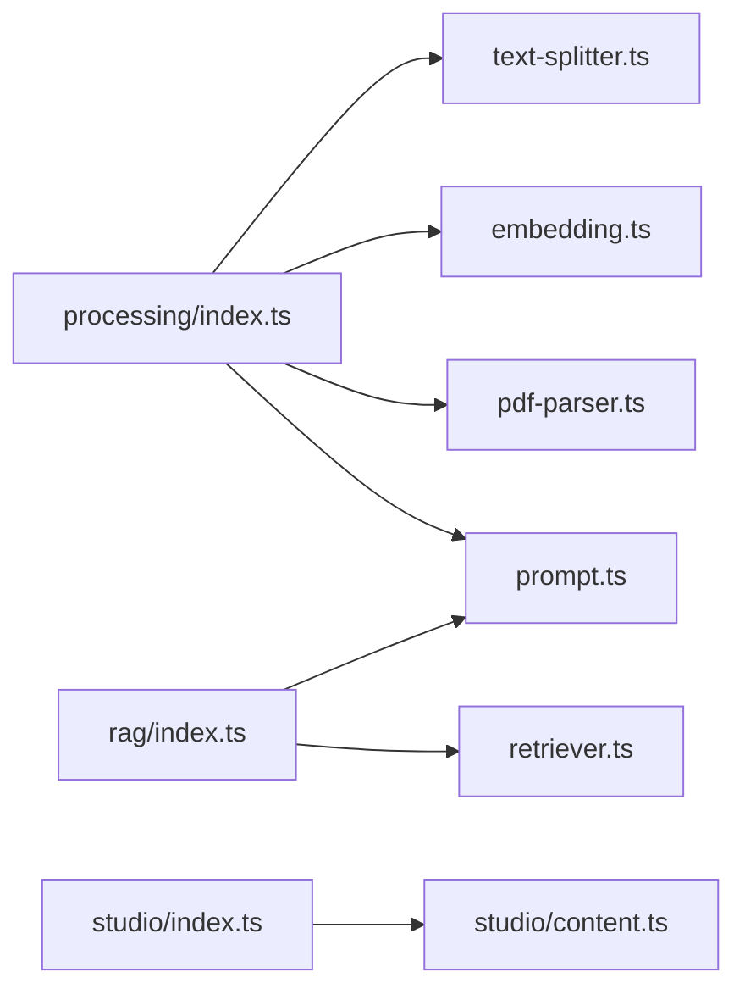

# 内容获取与统计

<cite>
**本文引用的文件**
- [lib/studio/content.ts](file://lib/studio/content.ts)
- [lib/processing/text-splitter.ts](file://lib/processing/text-splitter.ts)
- [lib/processing/processor.ts](file://lib/processing/processor.ts)
- [lib/processing/embedding.ts](file://lib/processing/embedding.ts)
- [lib/processing/pdf-parser.ts](file://lib/processing/pdf-parser.ts)
- [lib/rag/retriever.ts](file://lib/rag/retriever.ts)
- [lib/rag/prompt.ts](file://lib/rag/prompt.ts)
- [lib/db/vector-store.ts](file://lib/db/vector-store.ts)
- [lib/studio/index.ts](file://lib/studio/index.ts)
- [lib/processing/index.ts](file://lib/processing/index.ts)
- [lib/rag/index.ts](file://lib/rag/index.ts)
</cite>

## 目录
1. [简介](#简介)
2. [项目结构](#项目结构)
3. [核心组件](#核心组件)
4. [架构总览](#架构总览)
5. [详细组件分析](#详细组件分析)
6. [依赖关系分析](#依赖关系分析)
7. [性能考量](#性能考量)
8. [故障排查指南](#故障排查指南)
9. [结论](#结论)
10. [附录](#附录)

## 简介
本文件面向“内容获取与统计系统”，围绕以下目标展开：
- 智能内容获取算法：内容采样、长度控制与相关性排序
- Map-Reduce 模式下的内容分发机制：Source 切分、并行处理与负载均衡
- 内容统计功能：令牌估算、处理时间统计与资源使用监控
- 上下文截断策略：智能截断、重要信息保留与性能优化
- 内容质量评估指标：相关性评分、完整性检查与重复检测
- 内容管理最佳实践：存储优化、访问控制与缓存策略

## 项目结构
系统采用分层模块化设计，核心分为“内容处理”“检索增强”“统计与采样”“向量存储”等模块，配合数据库与外部 AI 服务完成端到端内容获取与统计。

图表来源
- [lib/processing/processor.ts](file://lib/processing/processor.ts#L1-L560)
- [lib/processing/text-splitter.ts](file://lib/processing/text-splitter.ts#L1-L270)
- [lib/processing/embedding.ts](file://lib/processing/embedding.ts#L1-L189)
- [lib/processing/pdf-parser.ts](file://lib/processing/pdf-parser.ts#L1-L150)
- [lib/db/vector-store.ts](file://lib/db/vector-store.ts#L1-L446)
- [lib/rag/retriever.ts](file://lib/rag/retriever.ts#L1-L206)
- [lib/rag/prompt.ts](file://lib/rag/prompt.ts#L1-L149)
- [lib/studio/content.ts](file://lib/studio/content.ts#L1-L258)

章节来源
- [lib/processing/index.ts](file://lib/processing/index.ts#L1-L51)
- [lib/rag/index.ts](file://lib/rag/index.ts#L1-L24)
- [lib/studio/index.ts](file://lib/studio/index.ts#L1-L25)

## 核心组件
- 内容采样与统计：提供智能采样、上下文截断与统计信息输出，支撑快速检索与成本控制
- 文本切分器：基于多级分隔符的递归切分，结合重叠窗口与令牌估算，保障语义完整性
- 处理流水线：统一的 Source 处理状态机，涵盖下载/抓取、解析、切分、向量化与入库
- 向量存储：支持相似度检索、混合检索与批量写入，具备维度校验与日志记录
- 检索与提示：向量+全文检索的混合策略，构建上下文与引用标注
- 批量嵌入：指数退避重试、分批处理与去重优化，提升稳定性与吞吐

章节来源
- [lib/studio/content.ts](file://lib/studio/content.ts#L1-L258)
- [lib/processing/text-splitter.ts](file://lib/processing/text-splitter.ts#L1-L270)
- [lib/processing/processor.ts](file://lib/processing/processor.ts#L1-L560)
- [lib/db/vector-store.ts](file://lib/db/vector-store.ts#L1-L446)
- [lib/rag/retriever.ts](file://lib/rag/retriever.ts#L1-L206)
- [lib/rag/prompt.ts](file://lib/rag/prompt.ts#L1-L149)
- [lib/processing/embedding.ts](file://lib/processing/embedding.ts#L1-L189)

## 架构总览
系统以“Source（来源）”为中心，通过统一的处理流水线将其转化为可检索的向量片段；检索阶段结合向量相似度与全文检索，输出上下文供大模型使用；统计模块贯穿采集、切分、向量化与检索全过程，提供令牌估算、耗时统计与资源使用监控。

图表来源
- [lib/processing/processor.ts](file://lib/processing/processor.ts#L82-L209)
- [lib/processing/text-splitter.ts](file://lib/processing/text-splitter.ts#L97-L152)
- [lib/processing/embedding.ts](file://lib/processing/embedding.ts#L140-L188)
- [lib/db/vector-store.ts](file://lib/db/vector-store.ts#L77-L173)

## 详细组件分析

### 智能内容采样与统计（Studio）
- 目标：在满足 Token 上限的前提下，尽可能覆盖每个 Source 的关键片段，同时提供统计信息
- 关键能力
  - 快速采样：每个 Source 优先取头部与尾部若干片段，兼顾全局覆盖
  - 总量限制：整体片段数上限，避免上下文膨胀
  - 智能截断：按 Source 块为单位进行截断，保留完整语义块
  - 统计输出：总片段数、使用片段数、估算 Token 数、Source 数
- Map-Reduce 模式：按 Source 并行切片，每个 Source 产出固定上限的片段，再汇总统计

图表来源
- [lib/studio/content.ts](file://lib/studio/content.ts#L67-L154)
- [lib/studio/content.ts](file://lib/studio/content.ts#L159-L224)

章节来源
- [lib/studio/content.ts](file://lib/studio/content.ts#L1-L258)

### 文本切分器（RecursiveTextSplitter）
- 设计要点
  - 多级分隔符优先级：标题→段落→换行→标点→空格→字符，优先保持自然边界
  - 重叠窗口：chunkOverlap 占比约 12.5%，避免关键信息被截断
  - 令牌估算：中英混合估算，用于控制 chunkSize
  - 元数据：页码、字符范围、tokenCount、来源标题与类型
- 复杂度与优化
  - 时间复杂度近似 O(N)，其中 N 为文本长度；分隔符递归拆分在极端情况下退化为按字符切分
  - 重叠窗口通过滑动窗口与重叠文本复用降低开销

图表来源
- [lib/processing/text-splitter.ts](file://lib/processing/text-splitter.ts#L83-L264)

章节来源
- [lib/processing/text-splitter.ts](file://lib/processing/text-splitter.ts#L1-L270)

### 处理流水线（Processor）
- 状态机：pending → downloading/fetching → parsing → chunking → embedding → index → ready 或 failed
- PDF 流程：下载 → 解析 → 切分 → 向量 → 写入
- URL 流程：抓取（网页/PDF）→ 解析 → 切分 → 向量 → 写入
- Text 流程：切分 → 向量 → 写入
- 日志与统计：各阶段记录耗时、字数、页数、片段数、平均 token 数、向量用量等

图表来源
- [lib/processing/processor.ts](file://lib/processing/processor.ts#L82-L209)
- [lib/processing/processor.ts](file://lib/processing/processor.ts#L215-L397)
- [lib/processing/processor.ts](file://lib/processing/processor.ts#L426-L526)

章节来源
- [lib/processing/processor.ts](file://lib/processing/processor.ts#L1-L560)

### 向量存储与检索（VectorStore + Retriever）
- 向量存储
  - 批量插入：分批写入，ON CONFLICT DO NOTHING 去重
  - 维度校验：严格校验 embedding 维度，防止异常
  - 日志记录：操作类型、耗时、成功/失败与元数据
- 检索
  - 相似度检索：基于向量内积，支持阈值与 topK
  - 混合检索：向量相似度与全文检索（tsv）加权融合
  - 去重：按 ID 去重，必要时按内容前缀去重
- 提示工程
  - 构建上下文：按来源与页码组织，附带相关度
  - 构建消息：系统提示 + 历史 + 当前问题 + 上下文
  - 引用标注：去重后的引用列表，便于溯源

图表来源
- [lib/db/vector-store.ts](file://lib/db/vector-store.ts#L77-L446)
- [lib/rag/retriever.ts](file://lib/rag/retriever.ts#L29-L51)

章节来源
- [lib/db/vector-store.ts](file://lib/db/vector-store.ts#L1-L446)
- [lib/rag/retriever.ts](file://lib/rag/retriever.ts#L1-L206)
- [lib/rag/prompt.ts](file://lib/rag/prompt.ts#L1-L149)

### 批量嵌入与重试（Embedding）
- 批量策略：最大批大小与单条最大 token 数控制
- 指数退避：对 429/500/502/503/504 等错误进行重试，最大延迟控制
- 去重优化：基于 contentHash 去重，避免重复向量化
- 统计：累计 tokensUsed 与 skipped 数量

图表来源
- [lib/processing/embedding.ts](file://lib/processing/embedding.ts#L140-L188)

章节来源
- [lib/processing/embedding.ts](file://lib/processing/embedding.ts#L1-L189)

### PDF 解析与扫描件检测（PDF Parser）
- 下载：从存储服务下载二进制
- 解析：提取文本、页数、词数与页码映射
- 扫描件检测：按平均每页字符数阈值判断
- 错误分类：加密、损坏等错误类型识别

图表来源
- [lib/processing/pdf-parser.ts](file://lib/processing/pdf-parser.ts#L133-L149)

章节来源
- [lib/processing/pdf-parser.ts](file://lib/processing/pdf-parser.ts#L1-L150)

### Map-Reduce 模式下的内容分发
- Source 切分：按 notebookId 与可选 sourceIds 查询 ready 的 Sources
- 并行处理：每个 Source 独立切分与截断，限制单 Source 片段数
- 负载均衡：通过并发与批处理控制资源占用；向量存储分批写入避免单次压力过大
- 统计汇总：累加总片段数、使用片段数与 Token 估算

图表来源
- [lib/studio/content.ts](file://lib/studio/content.ts#L159-L224)
- [lib/db/vector-store.ts](file://lib/db/vector-store.ts#L105-L173)

章节来源
- [lib/studio/content.ts](file://lib/studio/content.ts#L156-L224)
- [lib/db/vector-store.ts](file://lib/db/vector-store.ts#L1-L446)

## 依赖关系分析
- 模块导出
  - processing/index.ts：统一导出文本切分、PDF/网页解析、嵌入生成与处理流程
  - rag/index.ts：统一导出检索与提示工程
  - studio/index.ts：统一导出智能采样、统计与解析工具
- 关键依赖链
  - processor.ts 依赖 text-splitter.ts、embedding.ts、vector-store.ts、pdf-parser.ts
  - retriever.ts 依赖 vector-store.ts、prisma 与 AI 服务
  - studio/content.ts 依赖 prisma 与自定义统计函数

图表来源
- [lib/processing/index.ts](file://lib/processing/index.ts#L1-L51)
- [lib/rag/index.ts](file://lib/rag/index.ts#L1-L24)
- [lib/studio/index.ts](file://lib/studio/index.ts#L1-L25)

章节来源
- [lib/processing/index.ts](file://lib/processing/index.ts#L1-L51)
- [lib/rag/index.ts](file://lib/rag/index.ts#L1-L24)
- [lib/studio/index.ts](file://lib/studio/index.ts#L1-L25)

## 性能考量
- 切分与重叠：合理设置 chunkSize 与 chunkOverlap，在语义完整性与上下文长度间平衡
- 批处理与分片：向量写入与嵌入调用采用分批策略，减少单次压力
- 指数退避：对外部 API 调用进行指数退避，提升稳定性
- 维度校验：严格校验 embedding 维度，避免后续检索异常
- 检索阈值与 topK：根据业务需求调整阈值与 topK，兼顾召回与性能
- 截断策略：按 Source 块截断，避免在中间语义处打断

## 故障排查指南
- 处理失败
  - 检查 Source 状态与 processingLog，定位失败阶段与错误信息
  - 关注嵌入 API 返回状态与错误码，必要时查看重试日志
- 向量维度不匹配
  - 核对 EMBEDDING_DIM 配置与返回向量维度
- PDF 解析失败
  - 检查是否为加密/损坏/扫描件，必要时提示用户更换文件
- 检索无证据
  - 调整阈值、topK 或启用混合检索，检查 queryEmbedding 维度
- 统计异常
  - 确认统计函数使用的 Token 估算方法与上下文拼接格式一致

章节来源
- [lib/processing/processor.ts](file://lib/processing/processor.ts#L198-L208)
- [lib/processing/embedding.ts](file://lib/processing/embedding.ts#L97-L104)
- [lib/processing/pdf-parser.ts](file://lib/processing/pdf-parser.ts#L88-L116)
- [lib/db/vector-store.ts](file://lib/db/vector-store.ts#L198-L202)
- [lib/rag/retriever.ts](file://lib/rag/retriever.ts#L140-L153)

## 结论
本系统通过“智能采样 + 递归切分 + 向量检索”的组合，实现了高效、可控的内容获取与统计。Map-Reduce 模式下的并行处理与分批写入，提升了吞吐与稳定性；完善的统计与日志体系，为性能优化与问题定位提供了依据。建议在生产环境中持续监控 Token 估算误差、检索阈值与批处理参数，以获得更优的成本与效果平衡。

## 附录
- 内容质量评估指标建议
  - 相关性评分：使用检索相似度或混合评分作为相关性参考
  - 完整性检查：统计有效片段占比、Token 估算与上下文长度
  - 重复检测：基于内容前缀哈希或向量相似度进行去重
- 内容管理最佳实践
  - 存储优化：分 Source 存储，定期清理无效/重复片段
  - 访问控制：基于 notebookId 与 SourceId 的权限隔离
  - 缓存策略：对高频检索结果与引用列表进行短期缓存