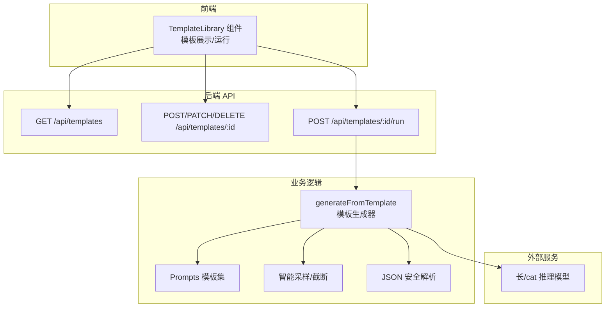
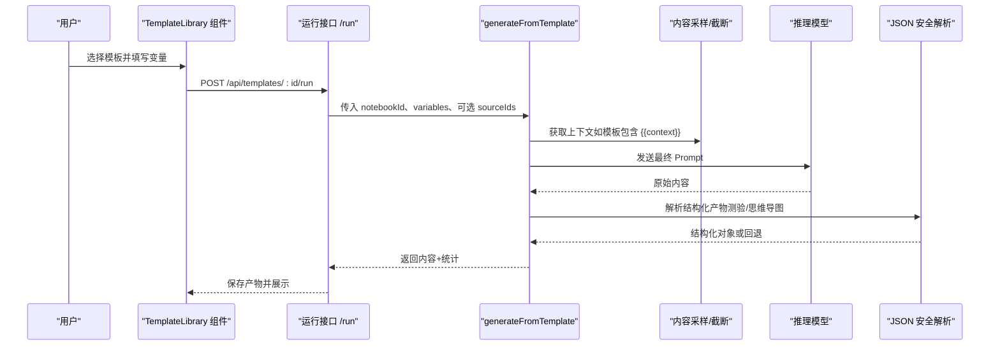
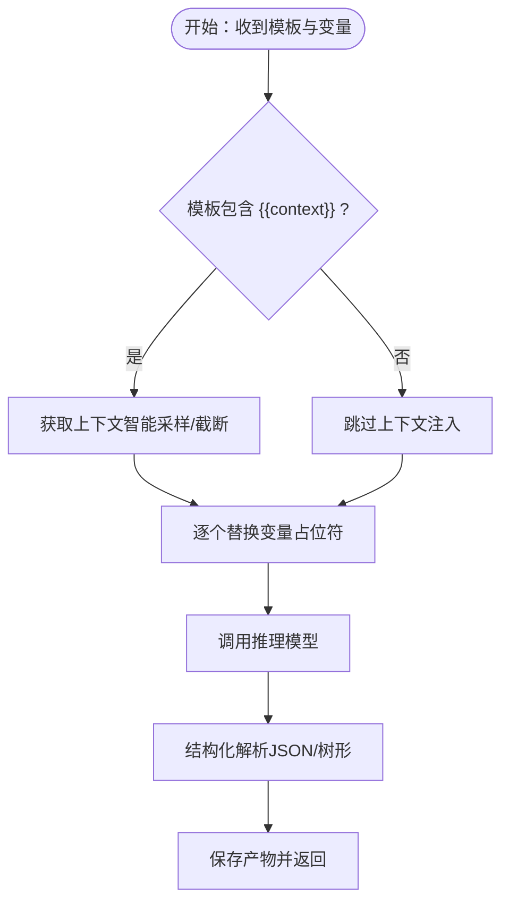
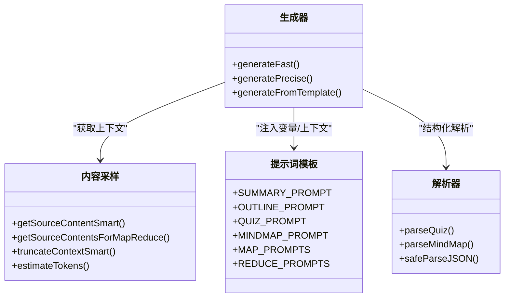
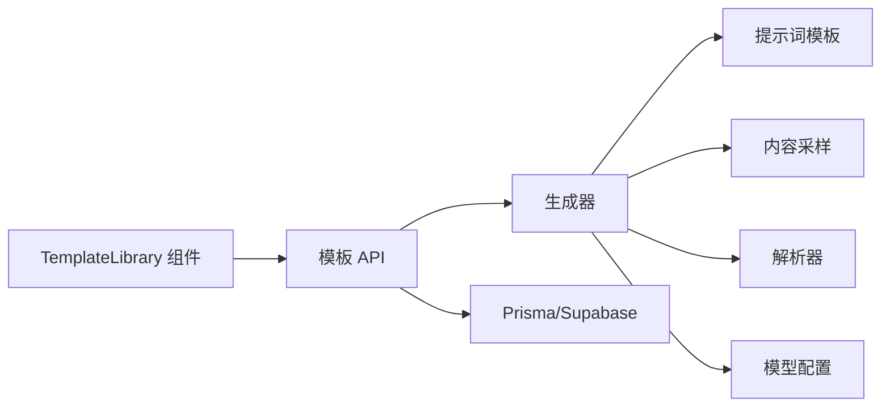

# 提示词工程与模板系统

<cite>
**本文引用的文件**
- [lib/studio/prompts.ts](file://lib/studio/prompts.ts)
- [lib/studio/generator.ts](file://lib/studio/generator.ts)
- [lib/studio/content.ts](file://lib/studio/content.ts)
- [lib/studio/parser.ts](file://lib/studio/parser.ts)
- [lib/rag/prompt.ts](file://lib/rag/prompt.ts)
- [app/api/templates/route.ts](file://app/api/templates/route.ts)
- [app/api/templates/[id]/route.ts](file://app/api/templates/[id]/route.ts)
- [app/api/templates/[id]/run/route.ts](file://app/api/templates/[id]/run/route.ts)
- [components/notebook/template-library.tsx](file://components/notebook/template-library.tsx)
- [lib/studio/index.ts](file://lib/studio/index.ts)
- [lib/config.ts](file://lib/config.ts)
- [types/index.ts](file://types/index.ts)
- [scripts/seed-templates.ts](file://scripts/seed-templates.ts)
</cite>

## 目录
1. [引言](#引言)
2. [项目结构](#项目结构)
3. [核心组件](#核心组件)
4. [架构总览](#架构总览)
5. [详细组件分析](#详细组件分析)
6. [依赖分析](#依赖分析)
7. [性能考虑](#性能考虑)
8. [故障排除指南](#故障排除指南)
9. [结论](#结论)
10. [附录](#附录)

## 引言
本文件系统化梳理“提示词工程与模板系统”，围绕以下目标展开：
- 提示词设计原则：上下文构建、指令明确性、输出格式控制
- 不同产物（摘要、大纲、测验、思维导图）的专用提示词模板
- 模板系统的动态参数注入机制（变量替换、上下文注入、条件处理）
- 版本管理与迭代优化策略
- 调试与测试方法（效果评估指标、质量控制流程）
- 常见提示词模式、最佳实践与故障排除

## 项目结构
该系统由“提示词模板库”“内容采样与上下文组装”“生成器与解析器”“RAG 辅助提示”“API 与前端组件”等模块组成，形成“模板 -> 上下文 -> 生成 -> 解析 -> 展示”的闭环。

图表来源
- [components/notebook/template-library.tsx](file://components/notebook/template-library.tsx#L52-L186)
- [app/api/templates/route.ts](file://app/api/templates/route.ts#L5-L27)
- [app/api/templates/[id]/route.ts](file://app/api/templates/[id]/route.ts#L5-L53)
- [app/api/templates/[id]/run/route.ts](file://app/api/templates/[id]/run/route.ts#L28-L79)
- [lib/studio/generator.ts](file://lib/studio/generator.ts#L267-L310)
- [lib/studio/prompts.ts](file://lib/studio/prompts.ts#L202-L211)
- [lib/studio/content.ts](file://lib/studio/content.ts#L67-L154)
- [lib/studio/parser.ts](file://lib/studio/parser.ts#L56-L119)

章节来源
- [lib/studio/prompts.ts](file://lib/studio/prompts.ts#L1-L211)
- [lib/studio/generator.ts](file://lib/studio/generator.ts#L1-L311)
- [lib/studio/content.ts](file://lib/studio/content.ts#L1-L258)
- [lib/studio/parser.ts](file://lib/studio/parser.ts#L1-L183)
- [lib/rag/prompt.ts](file://lib/rag/prompt.ts#L1-L149)
- [app/api/templates/route.ts](file://app/api/templates/route.ts#L1-L63)
- [app/api/templates/[id]/route.ts](file://app/api/templates/[id]/route.ts#L1-L93)
- [app/api/templates/[id]/run/route.ts](file://app/api/templates/[id]/run/route.ts#L1-L104)
- [components/notebook/template-library.tsx](file://components/notebook/template-library.tsx#L1-L386)
- [lib/studio/index.ts](file://lib/studio/index.ts#L1-L25)
- [lib/config.ts](file://lib/config.ts#L1-L187)
- [types/index.ts](file://types/index.ts#L188-L214)
- [scripts/seed-templates.ts](file://scripts/seed-templates.ts#L1-L86)

## 核心组件
- 提示词模板集：内置摘要、大纲、测验、思维导图的标准模板，以及 Map-Reduce 的 Map/Reduce 模板集合
- 内容采样与上下文组装：智能采样、Token 估算与截断、Map-Reduce 每 Source 截断
- 生成器：快速模式（智能采样 + 直接调用）、精准模式（Map-Reduce + 合并）、模板生成器（动态变量注入）
- JSON 安全解析：多策略提取与验证，保障测验与思维导图的结构稳定性
- RAG 提示辅助：系统提示、上下文组装、引用标注、引用去重
- 模板库 API 与前端：模板 CRUD、变量提取、运行对话框、上下文注入

章节来源
- [lib/studio/prompts.ts](file://lib/studio/prompts.ts#L6-L211)
- [lib/studio/generator.ts](file://lib/studio/generator.ts#L1-L311)
- [lib/studio/content.ts](file://lib/studio/content.ts#L1-L258)
- [lib/studio/parser.ts](file://lib/studio/parser.ts#L1-L183)
- [lib/rag/prompt.ts](file://lib/rag/prompt.ts#L1-L149)
- [app/api/templates/route.ts](file://app/api/templates/route.ts#L1-L63)
- [app/api/templates/[id]/route.ts](file://app/api/templates/[id]/route.ts#L1-L93)
- [app/api/templates/[id]/run/route.ts](file://app/api/templates/[id]/run/route.ts#L1-L104)
- [components/notebook/template-library.tsx](file://components/notebook/template-library.tsx#L1-L386)

## 架构总览
系统通过“模板库”提供统一的 Prompt 管理入口；运行时根据模板动态注入变量与上下文，调用推理模型生成内容；对结构化产物进行安全解析与回退；最终将产物持久化并反馈给前端。

图表来源
- [components/notebook/template-library.tsx](file://components/notebook/template-library.tsx#L150-L186)
- [app/api/templates/[id]/run/route.ts](file://app/api/templates/[id]/run/route.ts#L28-L79)
- [lib/studio/generator.ts](file://lib/studio/generator.ts#L267-L310)
- [lib/studio/content.ts](file://lib/studio/content.ts#L67-L154)
- [lib/studio/parser.ts](file://lib/studio/parser.ts#L56-L119)

## 详细组件分析

### 提示词模板设计原则
- 上下文构建：通过占位符注入资料块，按 Source 分隔，便于后续截断与溯源
- 指令明确性：对任务、格式、语言、长度、难度等给出清晰约束
- 输出格式控制：强制 JSON 或特定 Markdown 结构，减少歧义
- 语言自适应：根据资料语言自动选择输出语言，提升本地化体验

章节来源
- [lib/studio/prompts.ts](file://lib/studio/prompts.ts#L6-L116)
- [lib/studio/prompts.ts](file://lib/studio/prompts.ts#L119-L198)

### 产物专用模板设计
- 摘要模板：强调核心主题、关键要点、客观准确、字数控制
- 大纲模板：层级结构、简洁要点、Markdown 格式
- 测验模板：题目覆盖、选项数量、难度适中、提供解析、JSON 输出
- 思维导图模板：核心概念、逻辑关系、层级深度、节点描述、JSON 输出

章节来源
- [lib/studio/prompts.ts](file://lib/studio/prompts.ts#L6-L116)

### Map-Reduce 模板体系
- Map 模板：针对单 Source 的提炼，输出中间结果
- Reduce 模板：合并多个中间结果，生成最终产物
- 适用场景：长文档、多来源、需要全局整合的复杂产物

章节来源
- [lib/studio/prompts.ts](file://lib/studio/prompts.ts#L119-L198)

### 模板系统的动态参数注入机制
- 变量替换：前端自动提取模板中的变量并生成输入表单；后端按 key/value 替换占位符
- 上下文注入：当模板包含 {{context}} 时，自动从选中 Notebook 的 Source 中采样并拼接
- 条件处理：模板运行前进行 Notebook 所有权校验与 Source 可用性检查

图表来源
- [lib/studio/generator.ts](file://lib/studio/generator.ts#L267-L310)
- [lib/studio/content.ts](file://lib/studio/content.ts#L67-L154)
- [lib/studio/parser.ts](file://lib/studio/parser.ts#L56-L119)

章节来源
- [lib/studio/generator.ts](file://lib/studio/generator.ts#L267-L310)
- [components/notebook/template-library.tsx](file://components/notebook/template-library.tsx#L90-L101)
- [app/api/templates/[id]/run/route.ts](file://app/api/templates/[id]/run/route.ts#L28-L79)

### 生成器与解析器
- 快速模式：智能采样 + 直接生成，适合小体量、低延迟需求
- 精准模式：Map-Reduce，适合大体量、强一致性需求
- JSON 安全解析：多策略提取 JSON，结构校验与回退，保证产物可用性

图表来源
- [lib/studio/generator.ts](file://lib/studio/generator.ts#L1-L311)
- [lib/studio/content.ts](file://lib/studio/content.ts#L1-L258)
- [lib/studio/parser.ts](file://lib/studio/parser.ts#L1-L183)
- [lib/studio/prompts.ts](file://lib/studio/prompts.ts#L1-L211)

章节来源
- [lib/studio/generator.ts](file://lib/studio/generator.ts#L117-L262)
- [lib/studio/parser.ts](file://lib/studio/parser.ts#L56-L182)

### RAG 提示辅助
- 系统提示：限定依据、引用标注、语言风格
- 上下文组装：编号引用、来源信息、相似度标注
- 引用去重：基于内容前缀去重，保留高相似度条目

章节来源
- [lib/rag/prompt.ts](file://lib/rag/prompt.ts#L10-L88)
- [lib/rag/prompt.ts](file://lib/rag/prompt.ts#L112-L149)

### 模板库 API 与前端
- 模板 CRUD：获取、创建、更新、删除（系统模板不可编辑/删除）
- 模板运行：鉴权、变量收集、上下文注入、产物保存
- 前端交互：变量提取、运行对话框、加载状态、错误提示

章节来源
- [app/api/templates/route.ts](file://app/api/templates/route.ts#L1-L63)
- [app/api/templates/[id]/route.ts](file://app/api/templates/[id]/route.ts#L1-L93)
- [app/api/templates/[id]/run/route.ts](file://app/api/templates/[id]/run/route.ts#L1-L104)
- [components/notebook/template-library.tsx](file://components/notebook/template-library.tsx#L52-L186)

## 依赖分析
- 模块内聚与耦合
  - 生成器与提示词模板、内容采样、解析器紧密耦合，职责清晰
  - 模板库 API 与前端组件通过统一的 PromptTemplate 类型交互
- 外部依赖
  - 推理模型（长/cat）：统一配置与调用
  - 数据库：Prisma 访问 Source/Chunk/PromptTemplate/Artifact
- 循环依赖
  - 未发现循环导入；各模块通过导出函数/类型解耦

图表来源
- [components/notebook/template-library.tsx](file://components/notebook/template-library.tsx#L1-L386)
- [app/api/templates/[id]/run/route.ts](file://app/api/templates/[id]/run/route.ts#L1-L104)
- [lib/studio/generator.ts](file://lib/studio/generator.ts#L1-L311)
- [lib/studio/prompts.ts](file://lib/studio/prompts.ts#L1-L211)
- [lib/studio/content.ts](file://lib/studio/content.ts#L1-L258)
- [lib/studio/parser.ts](file://lib/studio/parser.ts#L1-L183)
- [lib/config.ts](file://lib/config.ts#L38-L52)

章节来源
- [lib/studio/index.ts](file://lib/studio/index.ts#L1-L25)
- [types/index.ts](file://types/index.ts#L188-L214)

## 性能考虑
- Token 控制
  - 智能采样：每 Source 采样头尾若干块，避免全量拼接
  - 截断策略：按 Source 块保留边界，超过阈值时截断并提示省略
  - Token 估算：中英字符分治估算，避免越界
- 超时与并发
  - 不同模式设置不同超时（快速/精准/Map 步骤），防止阻塞
  - Map-Reduce 并行处理 Source，降低总体时延
- 模型选择
  - 推理模型具备更强的结构化输出能力，必要时启用

章节来源
- [lib/studio/content.ts](file://lib/studio/content.ts#L10-L61)
- [lib/studio/generator.ts](file://lib/studio/generator.ts#L23-L27)
- [lib/studio/generator.ts](file://lib/studio/generator.ts#L171-L237)

## 故障排除指南
- 常见错误与处理
  - 无可用资料：提示“当前 Notebook 中没有可用的资料”
  - 空内容：提示“资料中没有可识别的文本内容”
  - 超时：捕获超时并返回统一错误
  - JSON 解析失败：采用多策略提取与回退结构
- 调试建议
  - 开发环境下打印空响应与解析失败详情
  - 使用最小变量集与少量 Source 快速定位问题
  - 对比 Map 与 Reduce 两种模式的产物差异
- 质量控制
  - 产物统计：Token 估算、使用的 Source 数、采样块数
  - 回退策略：测验与思维导图均有默认回退结构

章节来源
- [app/api/templates/[id]/run/route.ts](file://app/api/templates/[id]/run/route.ts#L84-L101)
- [lib/studio/generator.ts](file://lib/studio/generator.ts#L108-L114)
- [lib/studio/parser.ts](file://lib/studio/parser.ts#L56-L119)
- [lib/studio/parser.ts](file://lib/studio/parser.ts#L124-L150)
- [lib/studio/parser.ts](file://lib/studio/parser.ts#L155-L182)

## 结论
该系统以“模板 + 上下文 + 生成 + 解析”的链路为核心，结合智能采样与 Map-Reduce，实现了对多种产物的稳定生成。通过严格的输出格式控制与 JSON 安全解析，提升了产物质量与可用性。模板库与前端组件提供了良好的扩展与用户体验，便于持续迭代与优化。

## 附录

### 版本管理与迭代优化策略
- 系统模板初始化：脚本预置常用模板，固定 ID 保证幂等
- 模板演进：通过前端变量提取与后端运行接口，快速验证新模板
- 迭代路径：先在模板库中验证，再下沉到标准模板集，最后沉淀为系统模板

章节来源
- [scripts/seed-templates.ts](file://scripts/seed-templates.ts#L16-L76)
- [app/api/templates/route.ts](file://app/api/templates/route.ts#L12-L22)
- [types/index.ts](file://types/index.ts#L188-L214)

### 提示词设计最佳实践
- 明确角色与任务边界，避免模糊指令
- 严格约束输出格式，必要时强制 JSON
- 为长上下文设置清晰的截断策略与边界提示
- 为结构化产物提供回退方案与默认值

### 常见提示词模式
- 结构化输出模式：先给定输出结构，再要求填充
- 两阶段模式：先提炼（Map），再整合（Reduce）
- 引用标注模式：要求在回答中标注来源编号