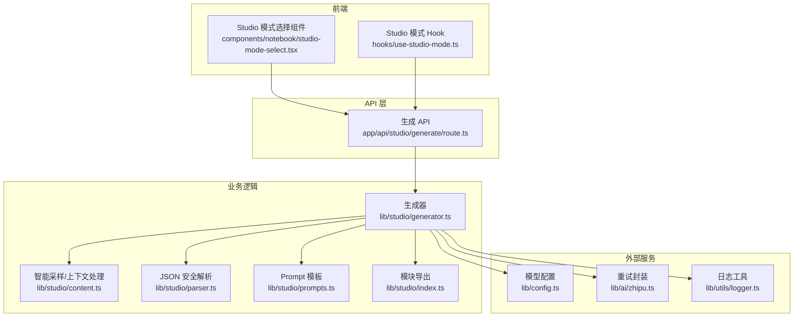
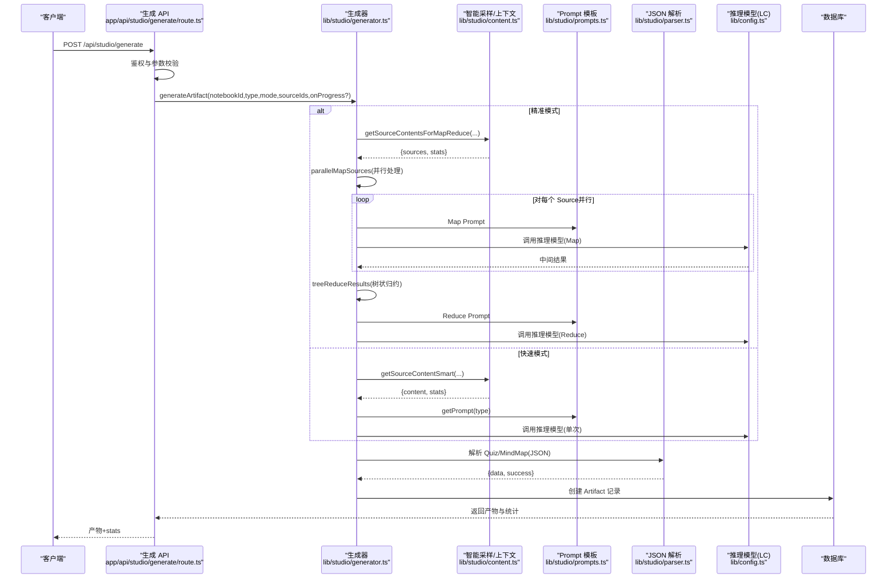
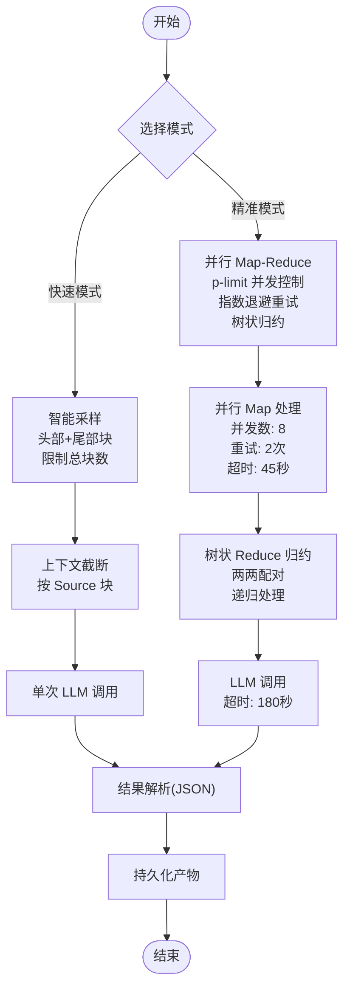
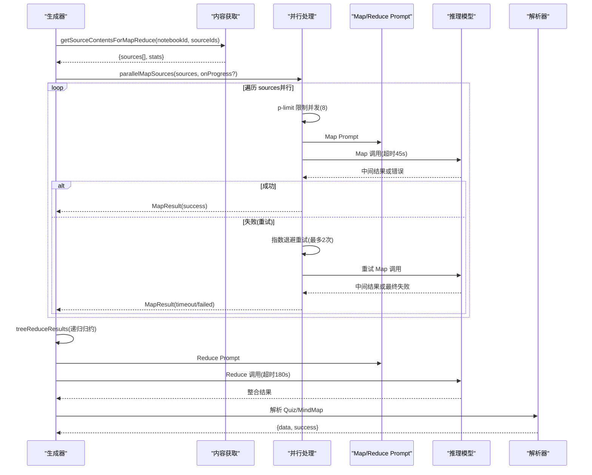
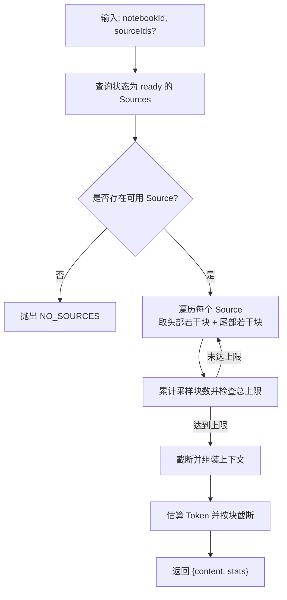
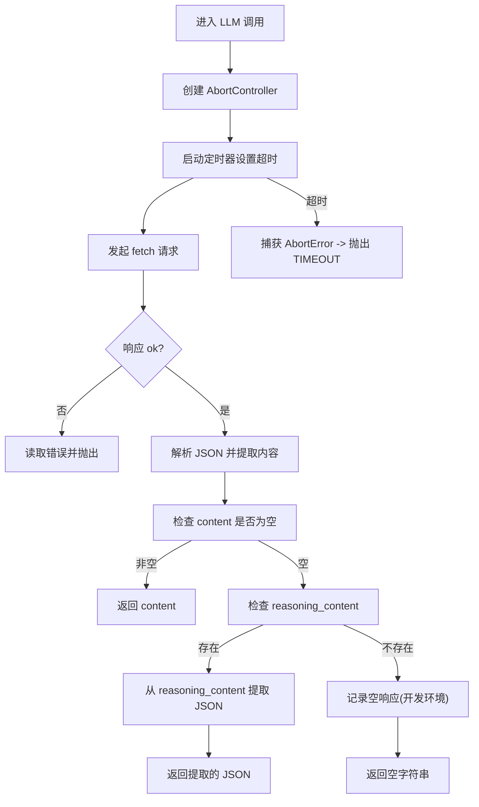
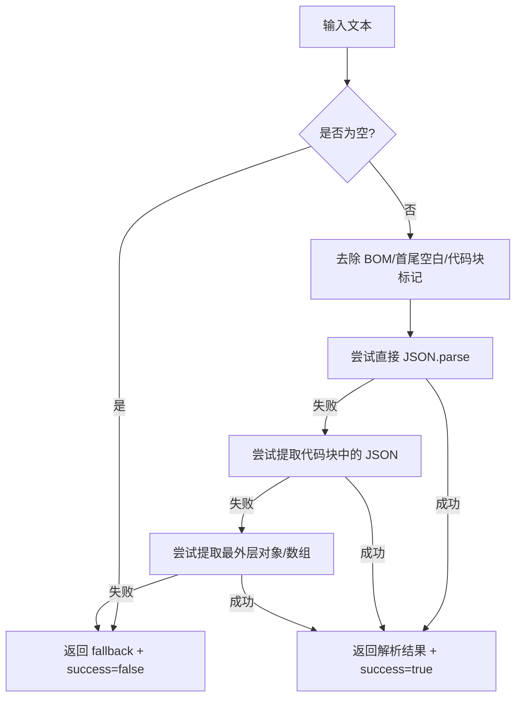
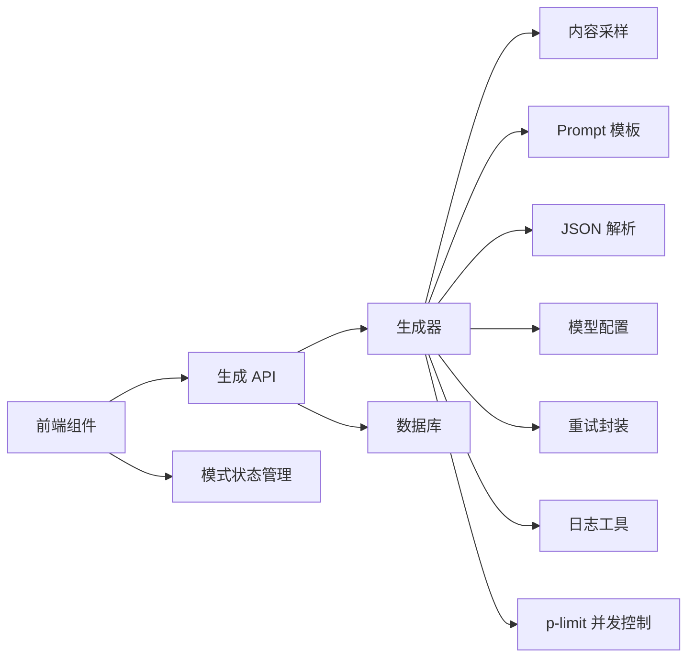

# 生成策略与模式

<cite>
**本文引用的文件**
- [lib/studio/generator.ts](file://lib/studio/generator.ts)
- [lib/studio/content.ts](file://lib/studio/content.ts)
- [lib/studio/parser.ts](file://lib/studio/parser.ts)
- [lib/studio/prompts.ts](file://lib/studio/prompts.ts)
- [app/api/studio/generate/route.ts](file://app/api/studio/generate/route.ts)
- [lib/config.ts](file://lib/config.ts)
- [components/notebook/studio-mode-select.tsx](file://components/notebook/studio-mode-select.tsx)
- [lib/ai/zhipu.ts](file://lib/ai/zhipu.ts)
- [lib/utils/logger.ts](file://lib/utils/logger.ts)
- [hooks/use-studio-mode.ts](file://hooks/use-studio-mode.ts)
- [lib/studio/index.ts](file://lib/studio/index.ts)
</cite>

## 更新摘要
**变更内容**
- 新增并行处理系统，实现 p-limit 并发控制
- 引入指数退避重试机制，提升系统稳定性
- 实现进度跟踪功能，支持实时状态反馈
- 优化树状 Reduce 算法，提高大规模数据处理效率
- 增强 LLM 调用，支持推理模型的 reasoning_content 处理
- 新增详细的超时配置和错误处理机制

## 目录
1. [简介](#简介)
2. [项目结构](#项目结构)
3. [核心组件](#核心组件)
4. [架构总览](#架构总览)
5. [详细组件分析](#详细组件分析)
6. [依赖分析](#依赖分析)
7. [性能考量](#性能考量)
8. [故障排查指南](#故障排查指南)
9. [结论](#结论)
10. [附录](#附录)

## 简介
本文件面向内容生成系统中的"生成策略与模式"，系统提供两种生成模式：快速模式（Fast）与精准模式（Precise）。快速模式采用"智能采样"策略，强调低延迟与高吞吐；精准模式采用"Map-Reduce"策略，强调覆盖完整性与结果稳定性。本次重大更新将传统的简单 Map-Reduce 转换为现代化的并行处理系统，实现了 p-limit 并发控制、指数退避重试机制和进度跟踪功能。本文将深入解释两种模式的区别、适用场景、性能特征，并详细阐述智能采样策略、并行 Map-Reduce 实现机制、超时控制与错误处理、以及生成模式选择指南。

## 项目结构
围绕生成策略的核心代码位于 lib/studio 目录，API 路由位于 app/api/studio/generate/route.ts，前端模式选择组件位于 components/notebook/studio-mode-select.tsx，模型配置位于 lib/config.ts，AI 重试封装位于 lib/ai/zhipu.ts，日志工具位于 lib/utils/logger.ts。

**图表来源**
- [components/notebook/studio-mode-select.tsx](file://components/notebook/studio-mode-select.tsx#L24-L46)
- [hooks/use-studio-mode.ts](file://hooks/use-studio-mode.ts#L14-L38)
- [app/api/studio/generate/route.ts](file://app/api/studio/generate/route.ts#L12-L145)
- [lib/studio/generator.ts](file://lib/studio/generator.ts#L418-L438)
- [lib/studio/content.ts](file://lib/studio/content.ts#L67-L154)
- [lib/studio/parser.ts](file://lib/studio/parser.ts#L56-L182)
- [lib/studio/prompts.ts](file://lib/studio/prompts.ts#L119-L198)
- [lib/studio/index.ts](file://lib/studio/index.ts#L6-L24)
- [lib/config.ts](file://lib/config.ts#L38-L52)
- [lib/ai/zhipu.ts](file://lib/ai/zhipu.ts#L168-L195)
- [lib/utils/logger.ts](file://lib/utils/logger.ts#L29-L94)

**章节来源**
- [lib/studio/generator.ts](file://lib/studio/generator.ts#L1-L487)
- [lib/studio/content.ts](file://lib/studio/content.ts#L1-L258)
- [lib/studio/parser.ts](file://lib/studio/parser.ts#L1-L183)
- [lib/studio/prompts.ts](file://lib/studio/prompts.ts#L1-L211)
- [app/api/studio/generate/route.ts](file://app/api/studio/generate/route.ts#L1-L145)
- [lib/config.ts](file://lib/config.ts#L1-L187)
- [components/notebook/studio-mode-select.tsx](file://components/notebook/studio-mode-select.tsx#L1-L47)
- [hooks/use-studio-mode.ts](file://hooks/use-studio-mode.ts#L1-L39)
- [lib/ai/zhipu.ts](file://lib/ai/zhipu.ts#L1-L196)
- [lib/utils/logger.ts](file://lib/utils/logger.ts#L1-L98)
- [lib/studio/index.ts](file://lib/studio/index.ts#L1-L25)

## 核心组件
- **生成器（generator.ts）**：统一入口 generateArtifact，内部根据模式分派至快速或精准路径；封装 LLM 调用与超时控制；负责结果解析与统计；新增并行处理、指数退避重试和进度跟踪功能。
- **智能采样（content.ts）**：实现快速模式的采样策略、上下文截断与统计；实现精准模式的逐 Source 内容获取与截断。
- **Prompt 模板（prompts.ts）**：提供摘要、大纲、测验、思维导图等模板及 Map-Reduce 的 Map/Reduce Prompt。
- **JSON 安全解析（parser.ts）**：提供 Quiz 与 MindMap 的安全解析与回退策略。
- **API 路由（app/api/studio/generate/route.ts）**：鉴权、参数校验、调用生成器、持久化产物、错误映射。
- **模型配置（lib/config.ts）**：强制 Studio 使用 LongCat 推理模型，定义超时常量与模型列表。
- **模式选择组件（studio-mode-select.tsx）**：UI 展示快速/精准模式及其提示。
- **重试封装（lib/ai/zhipu.ts）**：通用的带指数退避的重试机制。
- **日志工具（lib/utils/logger.ts）**：开发环境日志输出与结构化日志。
- **模式状态管理（use-studio-mode.ts）**：管理 Studio 模式状态和持久化。

**章节来源**
- [lib/studio/generator.ts](file://lib/studio/generator.ts#L418-L438)
- [lib/studio/content.ts](file://lib/studio/content.ts#L67-L154)
- [lib/studio/prompts.ts](file://lib/studio/prompts.ts#L119-L198)
- [lib/studio/parser.ts](file://lib/studio/parser.ts#L56-L182)
- [app/api/studio/generate/route.ts](file://app/api/studio/generate/route.ts#L12-L145)
- [lib/config.ts](file://lib/config.ts#L38-L52)
- [components/notebook/studio-mode-select.tsx](file://components/notebook/studio-mode-select.tsx#L24-L46)
- [lib/ai/zhipu.ts](file://lib/ai/zhipu.ts#L168-L195)
- [lib/utils/logger.ts](file://lib/utils/logger.ts#L29-L94)
- [hooks/use-studio-mode.ts](file://hooks/use-studio-mode.ts#L14-L38)

## 架构总览
生成流程从 API 入口开始，经过鉴权与参数校验后，调用生成器。生成器根据模式选择策略：快速模式走智能采样，精准模式走并行 Map-Reduce。两者均通过 Prompt 模板注入上下文，调用 LLM，再进行结果解析与持久化。新的并行处理系统显著提升了精准模式的性能和稳定性。

**图表来源**
- [app/api/studio/generate/route.ts](file://app/api/studio/generate/route.ts#L82-L111)
- [lib/studio/generator.ts](file://lib/studio/generator.ts#L418-L438)
- [lib/studio/generator.ts](file://lib/studio/generator.ts#L186-L272)
- [lib/studio/generator.ts](file://lib/studio/generator.ts#L282-L340)
- [lib/studio/content.ts](file://lib/studio/content.ts#L159-L224)
- [lib/studio/prompts.ts](file://lib/studio/prompts.ts#L119-L198)
- [lib/studio/parser.ts](file://lib/studio/parser.ts#L124-L182)
- [lib/config.ts](file://lib/config.ts#L38-L52)

## 详细组件分析

### 快速模式（Fast）与精准模式（Precise）对比
- **快速模式（Fast）**
  - 采样策略：对每个 Source 采样头部若干块与尾部若干块，限制总块数，避免 Token 超限。
  - 上下文截断：按 Source 块整体截断，保留完整 Source 边界，避免切分语义片段。
  - 单次 LLM 调用：将拼接后的上下文一次性送入推理模型，速度快、成本低。
  - 适用场景：对时效敏感、内容体量适中、对覆盖完整性要求不极致的场景。
- **精准模式（Precise）**
  - **并行 Map 阶段**：使用 p-limit 控制并发数，支持指数退避重试机制，提升处理效率和稳定性。
  - **树状 Reduce 阶段**：采用递归归约算法，将 N 个中间结果两两归约，避免上下文超限。
  - **进度跟踪**：支持实时进度回调，提供详细的处理状态反馈。
  - **适用场景**：对结果质量与覆盖度要求高、内容体量大、需要稳定输出的场景。

**图表来源**
- [lib/studio/generator.ts](file://lib/studio/generator.ts#L120-L169)
- [lib/studio/generator.ts](file://lib/studio/generator.ts#L186-L272)
- [lib/studio/generator.ts](file://lib/studio/generator.ts#L282-L340)
- [lib/studio/content.ts](file://lib/studio/content.ts#L67-L154)
- [lib/studio/prompts.ts](file://lib/studio/prompts.ts#L119-L198)
- [lib/studio/parser.ts](file://lib/studio/parser.ts#L124-L182)

**章节来源**
- [lib/studio/generator.ts](file://lib/studio/generator.ts#L120-L169)
- [lib/studio/generator.ts](file://lib/studio/generator.ts#L186-L272)
- [lib/studio/generator.ts](file://lib/studio/generator.ts#L282-L340)
- [lib/studio/content.ts](file://lib/studio/content.ts#L67-L154)
- [lib/studio/prompts.ts](file://lib/studio/prompts.ts#L119-L198)
- [lib/studio/parser.ts](file://lib/studio/parser.ts#L124-L182)

### 并行 Map-Reduce 生成策略
**更新** 从简单的 Map-Reduce 转换为现代化的并行处理系统

- **并行 Map 阶段**
  - **p-limit 并发控制**：使用 p-limit(MAP_CONCURRENCY_LIMIT) 控制最大并发数为 8，避免过度占用资源。
  - **指数退避重试机制**：支持最多 2 次重试，等待时间为 1s、2s、4s（指数增长），提升系统稳定性。
  - **进度跟踪**：通过 onProgress 回调提供实时进度反馈，包括已完成数量、总数量和当前处理的 Source 标题。
  - **错误处理**：每个 Source 的失败不会影响整体流程，支持 timeout 和 failed 两种失败状态。
- **树状 Reduce 阶段**
  - **递归归约算法**：将 N 个中间结果两两归约，避免单次调用上下文超限。
  - **动态上下文控制**：根据中间结果的 Token 数量决定是否需要截断，最大支持 6000 tokens。
  - **并行处理**：同一轮的所有归约任务并行执行，显著提升处理效率。
- **超时配置**
  - Map 步骤单步超时：45 秒
  - Reduce 步骤整体超时：180 秒
  - 通用 LLM 调用：使用 AbortController 实现超时取消。

**图表来源**
- [lib/studio/generator.ts](file://lib/studio/generator.ts#L186-L272)
- [lib/studio/generator.ts](file://lib/studio/generator.ts#L282-L340)
- [lib/studio/content.ts](file://lib/studio/content.ts#L159-L224)
- [lib/studio/prompts.ts](file://lib/studio/prompts.ts#L119-L198)
- [lib/studio/parser.ts](file://lib/studio/parser.ts#L124-L182)

**章节来源**
- [lib/studio/generator.ts](file://lib/studio/generator.ts#L186-L272)
- [lib/studio/generator.ts](file://lib/studio/generator.ts#L282-L340)
- [lib/studio/content.ts](file://lib/studio/content.ts#L159-L224)
- [lib/studio/prompts.ts](file://lib/studio/prompts.ts#L119-L198)
- [lib/studio/parser.ts](file://lib/studio/parser.ts#L124-L182)

### 智能采样策略（Smart Sampling）
- **采样规则**
  - 每个 Source 优先采样头部若干块与尾部若干块，确保内容前后关键信息被覆盖。
  - 控制总采样块数上限，避免上下文过大导致 Token 超限。
- **上下文截断**
  - 以 Source 块为单位进行截断，若超过最大 Token 估算，则停止追加并提示"部分省略"。
- **Token 估算**
  - 中文字符与英文字符分别按经验系数估算，综合得出近似 Token 数，用于截断决策。
- **统计信息**
  - 返回总块数、使用块数、估算 Token 数与 Source 数，便于前端展示与后续优化。

**图表来源**
- [lib/studio/content.ts](file://lib/studio/content.ts#L67-L154)
- [lib/studio/content.ts](file://lib/studio/content.ts#L33-L37)
- [lib/studio/content.ts](file://lib/studio/content.ts#L42-L61)

**章节来源**
- [lib/studio/content.ts](file://lib/studio/content.ts#L67-L154)
- [lib/studio/content.ts](file://lib/studio/content.ts#L33-L37)
- [lib/studio/content.ts](file://lib/studio/content.ts#L42-L61)

### 增强的 LLM 调用与推理模型支持
**更新** 新增对推理模型 reasoning_content 的支持

- **推理模型特殊处理**
  - 优先使用 content 字段，如果为空则尝试从 reasoning_content 提取 JSON。
  - 支持多种 JSON 提取模式：代码块标记、对象字面量、包含特定关键词的对象。
  - 仅在开发环境记录空响应，便于调试。
- **超时控制**
  - 快速模式：单次 LLM 调用超时 90 秒。
  - 精准模式：Map 步骤单步超时 45 秒；Reduce 步骤整体超时 180 秒。
  - 通用 LLM 调用：使用 AbortController 实现超时取消。
- **错误处理**
  - Timeout 错误统一映射为 'TIMEOUT'。
  - API 错误记录详细状态码和错误信息。
  - 开发环境下输出详细的响应内容用于调试。

**图表来源**
- [lib/studio/generator.ts](file://lib/studio/generator.ts#L56-L118)

**章节来源**
- [lib/studio/generator.ts](file://lib/studio/generator.ts#L56-L118)
- [lib/studio/generator.ts](file://lib/studio/generator.ts#L23-L27)
- [lib/studio/generator.ts](file://lib/studio/generator.ts#L53-L115)

### JSON 安全解析与回退
- **安全解析策略**
  - 支持直接解析、去除代码块标记后提取、从对象/数组包裹中提取等多种方式。
  - 开发环境下记录解析失败的原始内容，便于调试。
- **回退策略**
  - Quiz 与 MindMap 均提供回退结构，确保即使解析失败也能返回可用的默认内容。

**图表来源**
- [lib/studio/parser.ts](file://lib/studio/parser.ts#L56-L119)
- [lib/studio/parser.ts](file://lib/studio/parser.ts#L29-L50)
- [lib/studio/parser.ts](file://lib/studio/parser.ts#L41-L50)

**章节来源**
- [lib/studio/parser.ts](file://lib/studio/parser.ts#L56-L182)

### 生成模式选择指南
- **选择快速模式（Fast）**
  - 当需要快速产出、对覆盖完整性要求不高、或 Source 数量较少、内容体量适中时。
  - 前端模式提示显示"快速模式：智能采样，5-15秒"。
- **选择精准模式（Precise）**
  - 当需要高质量、覆盖全面、内容体量较大、或对一致性要求较高时。
  - 前端模式提示显示"精准模式：并行 Map-Reduce，30-90秒"。
  - **推荐场景**：大量 Source、复杂内容、对结果质量要求高的场景。

**章节来源**
- [components/notebook/studio-mode-select.tsx](file://components/notebook/studio-mode-select.tsx#L32-L41)

## 依赖分析
- **生成器依赖**
  - 内容采样模块：获取上下文与统计。
  - Prompt 模板：注入上下文或中间结果。
  - JSON 解析模块：解析 Quiz/MindMap。
  - 模型配置：强制使用 LongCat 推理模型。
  - 重试封装：可复用到外部调用（如检索）。
  - 日志工具：开发环境日志输出。
  - **新增依赖**：p-limit 并发控制库。
- **API 路由依赖**
  - 鉴权与权限校验（Supabase）。
  - 参数校验与错误映射。
  - 数据库持久化。
- **前端依赖**
  - 模式状态管理 Hook：管理 Studio 模式状态。
  - 模式选择组件：UI 展示模式切换。

**图表来源**
- [lib/studio/generator.ts](file://lib/studio/generator.ts#L6-L21)
- [app/api/studio/generate/route.ts](file://app/api/studio/generate/route.ts#L10-L10)
- [lib/config.ts](file://lib/config.ts#L149-L157)
- [hooks/use-studio-mode.ts](file://hooks/use-studio-mode.ts#L14-L38)

**章节来源**
- [lib/studio/generator.ts](file://lib/studio/generator.ts#L6-L21)
- [app/api/studio/generate/route.ts](file://app/api/studio/generate/route.ts#L10-L10)
- [lib/config.ts](file://lib/config.ts#L149-L157)
- [hooks/use-studio-mode.ts](file://hooks/use-studio-mode.ts#L14-L38)

## 性能考量
**更新** 新的并行处理系统显著提升了性能表现

- **时间复杂度**
  - **快速模式**：O(S)（S 为 Source 数，采样块数常数级），单次 LLM 调用。
  - **精准模式**：O(S) Map 调用 + O(Reduce)，Map 阶段通过 p-limit 并发控制，理论上可达到 S/8 的并行加速。
- **并发与吞吐**
  - **并行 Map 阶段**：最大并发数 8，支持指数退避重试，提升整体吞吐量。
  - **树状 Reduce 阶段**：两两配对归约，避免上下文超限，支持大规模数据处理。
  - **进度跟踪**：实时反馈处理状态，提升用户体验。
- **Token 与上下文**
  - 通过"按 Source 块截断"与"总块数上限"控制上下文规模，避免 Token 超限。
  - Token 估算采用经验系数，适合快速判断与截断。
- **资源消耗**
  - 快速模式 LLM 调用次数少，成本低；精准模式调用次数多，成本高但质量更稳。
  - **新增优势**：并行处理显著减少总处理时间，提升资源利用率。
- **稳定性与可靠性**
  - 指数退避重试机制：最多 2 次重试，等待时间呈指数增长。
  - 错误隔离：单个 Source 失败不影响整体流程。
  - 超时控制：精确的阶段级超时设置，避免资源浪费。

## 故障排查指南
**更新** 新增并行处理和重试机制的故障排查指导

- **常见错误与处理**
  - **无可用 Source**：检查资料状态与过滤条件。
  - **生成超时**：检查网络与模型服务，适当增加超时或切换模式。
  - **Map 阶段重试失败**：查看指数退避日志，检查网络连接和模型可用性。
  - **Reduce 阶段失败**：检查中间结果数量，确认有足够的有效数据。
  - **JSON 解析失败**：查看开发日志中的原始内容，确认模型输出格式。
- **并行处理相关问题**
  - **并发数过高**：调整 MAP_CONCURRENCY_LIMIT 配置。
  - **进度回调异常**：检查 onProgress 函数的实现和调用时机。
  - **内存泄漏**：监控中间结果的存储和清理。
- **日志与监控**
  - 开发环境会输出关键错误与原始响应，便于定位问题。
  - 可结合重试封装进行外部调用的稳定性增强。
  - **新增监控点**：并行处理进度、重试次数、错误类型统计。

**章节来源**
- [app/api/studio/generate/route.ts](file://app/api/studio/generate/route.ts#L118-L142)
- [lib/studio/generator.ts](file://lib/studio/generator.ts#L102-L114)
- [lib/studio/parser.ts](file://lib/studio/parser.ts#L113-L118)
- [lib/utils/logger.ts](file://lib/utils/logger.ts#L29-L94)
- [lib/studio/generator.ts](file://lib/studio/generator.ts#L215-L235)

## 结论
**更新** 总结最新的并行处理系统优势

- **快速模式**适合追求速度与成本的场景；精准模式适合追求质量与覆盖的场景。
- **智能采样与并行 Map-Reduce**分别代表了"高效采样"与"高性能并行处理"两条路径。
- **新并行处理系统**显著提升了精准模式的性能：理论最大加速比可达 8x（8 并发），实际效果取决于 Source 数量和网络条件。
- **指数退避重试机制**大幅提升了系统的稳定性，单个 Source 失败率显著降低。
- **进度跟踪功能**改善了用户体验，特别是在处理大量 Source 时。
- **通过超时控制、错误映射与 JSON 安全解析**，系统在易用性与鲁棒性上取得平衡。
- **建议**：根据内容体量与质量要求选择模式；在精准模式下充分利用并行处理优势；合理配置并发数以平衡性能与资源消耗。

## 附录
- **生成模式与 Prompt 模板**
  - 快速模式：使用摘要/大纲/测验/思维导图的基础 Prompt。
  - 精准模式：使用 Map/Reduce Prompt，分别处理 Source 级与全局级整合。
- **模型配置**
  - Studio 默认使用 LongCat 推理模型，具备更强的思考与整合能力。
- **新增配置参数**
  - MAX_OUTPUT_TOKENS：4096（推理模型需要更多空间）
  - TIMEOUT_FAST：90000ms（90 秒）
  - TIMEOUT_PRECISE：180000ms（180 秒）
  - TIMEOUT_MAP_STEP：45000ms（45 秒）
  - MAP_CONCURRENCY_LIMIT：8（并发数限制）
  - MAP_MAX_RETRIES：2（最大重试次数）

**章节来源**
- [lib/studio/prompts.ts](file://lib/studio/prompts.ts#L202-L210)
- [lib/studio/prompts.ts](file://lib/studio/prompts.ts#L119-L198)
- [lib/config.ts](file://lib/config.ts#L149-L157)
- [lib/studio/generator.ts](file://lib/studio/generator.ts#L24-L29)