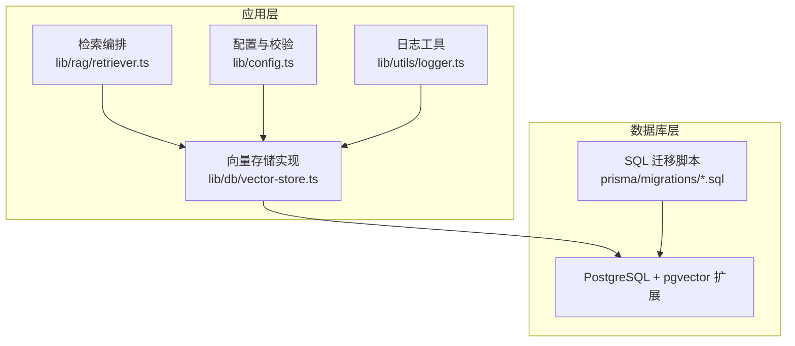
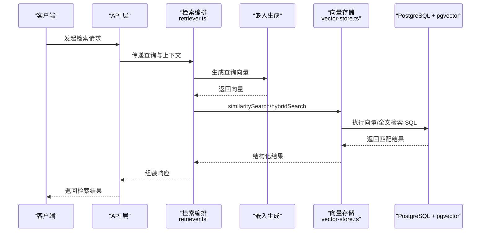
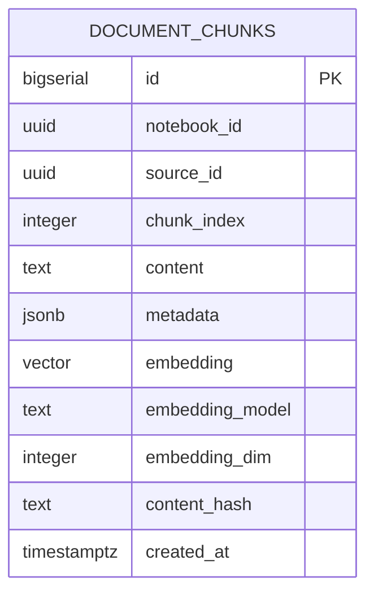
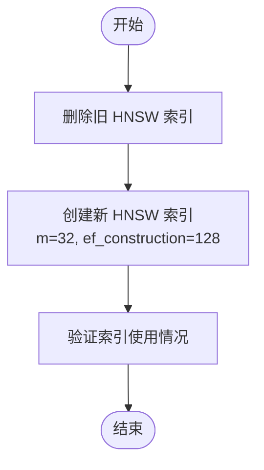
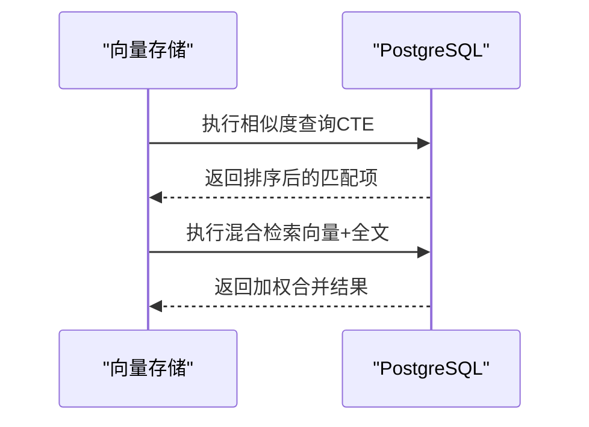
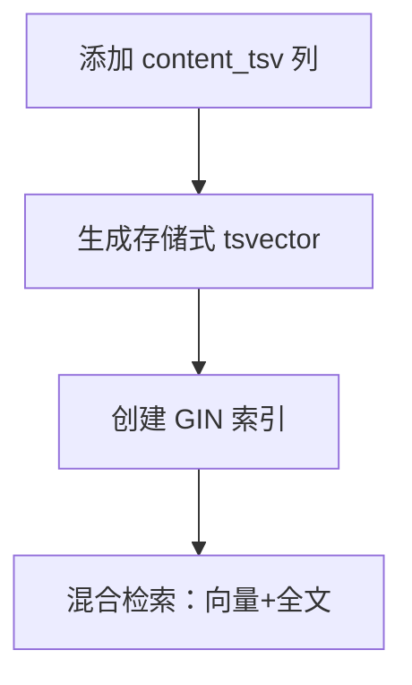
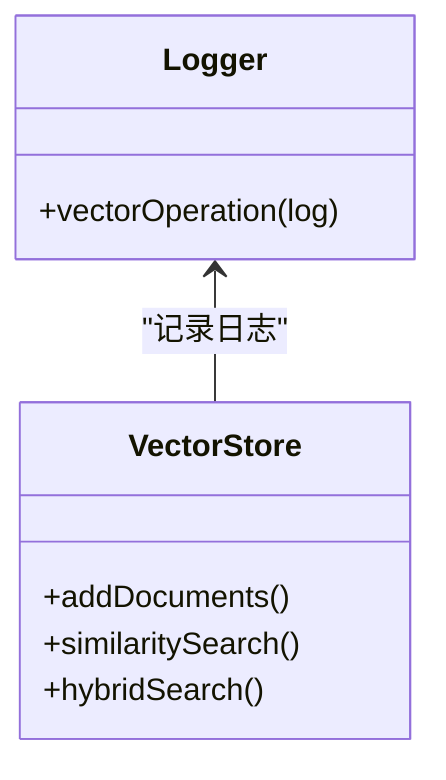
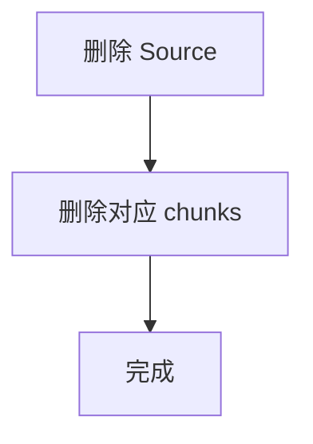
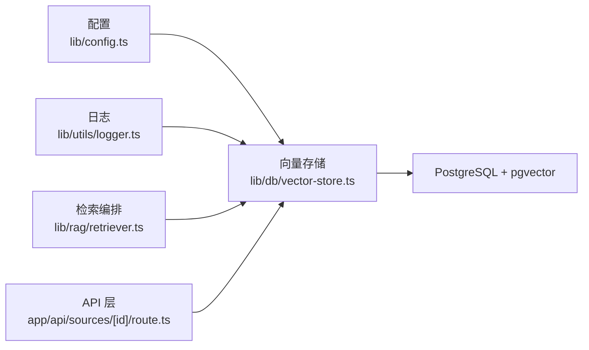

# pgvector 集成

<cite>
**本文引用的文件**
- [prisma/migrations/00000000000000_init_vector/migration.sql](file://prisma/migrations/00000000000000_init_vector/migration.sql)
- [prisma/migrations/20241223_create_vector_table/migration.sql](file://prisma/migrations/20241223_create_vector_table/migration.sql)
- [prisma/migrations/20260120042257_sync_schema_changes/migration.sql](file://prisma/migrations/20260120042257_sync_schema_changes/migration.sql)
- [prisma/migrations/20260120050505_add_content_tsv/migration.sql](file://prisma/migrations/20260120050505_add_content_tsv/migration.sql)
- [prisma/migrations/20260120050654_test/migration.sql](file://prisma/migrations/20260120050654_test/migration.sql)
- [prisma/migrations/20260120120000_add_unique_constraint/migration.sql](file://prisma/migrations/20260120120000_add_unique_constraint/migration.sql)
- [prisma/migrations/20260120120100_fix_fts_language/migration.sql](file://prisma/migrations/20260120120100_fix_fts_language/migration.sql)
- [prisma/migrations/20260120120200_optimize_hnsw_index/migration.sql](file://prisma/migrations/20260120120200_optimize_hnsw_index/migration.sql)
- [prisma/migrations/20260120120300_add_composite_indexes/migration.sql](file://prisma/migrations/20260120120300_add_composite_indexes/migration.sql)
- [lib/db/vector-store.ts](file://lib/db/vector-store.ts)
- [lib/config.ts](file://lib/config.ts)
- [lib/rag/retriever.ts](file://lib/rag/retriever.ts)
- [lib/utils/logger.ts](file://lib/utils/logger.ts)
- [app/api/sources/[id]/route.ts](file://app/api/sources/[id]/route.ts)
</cite>

## 目录
1. [简介](#简介)
2. [项目结构](#项目结构)
3. [核心组件](#核心组件)
4. [架构总览](#架构总览)
5. [详细组件分析](#详细组件分析)
6. [依赖关系分析](#依赖关系分析)
7. [性能考量](#性能考量)
8. [故障排查指南](#故障排查指南)
9. [结论](#结论)
10. [附录](#附录)

## 简介
本文件面向 notebookLM-clone 项目的 pgvector 集成，系统化阐述 PostgreSQL 向量扩展的安装与配置、向量表结构设计、HNSW 索引参数与维护、SQL 向量查询实现、全文检索索引（content_tsv）设计与使用、以及监控与诊断方法。文档同时提供可直接参考的 SQL 迁移脚本路径与配置要点，帮助读者快速完成从零到一的向量数据库集成。

## 项目结构
本项目采用 Prisma 管理通用业务表，而向量表与相关 SQL 功能通过独立的 SQL 迁移脚本进行管理，确保向量能力与业务模型解耦。关键位置如下：
- 向量表与索引：位于 prisma/migrations 下的多版本 SQL 迁移
- 向量存储实现：lib/db/vector-store.ts 提供批量写入、相似度检索、混合检索等能力
- 检索编排：lib/rag/retriever.ts 将嵌入生成与检索流程整合
- 配置与校验：lib/config.ts 固定向量维度并进行启动时校验
- 日志与可观测：lib/utils/logger.ts 输出向量操作日志
- 数据删除：app/api/sources/[id]/route.ts 通过原生 SQL 删除对应 chunks

**图表来源**
- [lib/db/vector-store.ts](file://lib/db/vector-store.ts#L1-L446)
- [lib/rag/retriever.ts](file://lib/rag/retriever.ts#L1-L206)
- [lib/config.ts](file://lib/config.ts#L1-L187)
- [lib/utils/logger.ts](file://lib/utils/logger.ts#L1-L98)
- [prisma/migrations/20241223_create_vector_table/migration.sql](file://prisma/migrations/20241223_create_vector_table/migration.sql#L1-L65)

**章节来源**
- [lib/db/vector-store.ts](file://lib/db/vector-store.ts#L1-L446)
- [lib/rag/retriever.ts](file://lib/rag/retriever.ts#L1-L206)
- [lib/config.ts](file://lib/config.ts#L1-L187)
- [lib/utils/logger.ts](file://lib/utils/logger.ts#L1-L98)
- [prisma/migrations/20241223_create_vector_table/migration.sql](file://prisma/migrations/20241223_create_vector_table/migration.sql#L1-L65)

## 核心组件
- 向量表与扩展
  - 扩展启用：在多个迁移中显式创建 vector 扩展
  - 表结构：document_chunks 表包含向量字段、元数据、内容哈希、时间戳等
  - 索引：HNSW 向量索引、普通索引、TSV 全文索引
- 向量存储实现
  - 批量插入：分批写入、ON CONFLICT 去重
  - 相似度检索：基于余弦距离的向量匹配
  - 混合检索：结合向量相似度与全文检索评分
- 检索编排
  - 统一入口：retrieveChunks 与 hybridRetrieveChunks
  - 参数控制：topK、阈值、权重、源过滤
- 配置与校验
  - 固定向量维度（1024），强制校验
  - 环境变量验证
- 日志与可观测
  - 统一向量操作日志，包含耗时、成功率、统计指标

**章节来源**
- [lib/db/vector-store.ts](file://lib/db/vector-store.ts#L24-L75)
- [lib/rag/retriever.ts](file://lib/rag/retriever.ts#L6-L13)
- [lib/config.ts](file://lib/config.ts#L6-L29)
- [lib/utils/logger.ts](file://lib/utils/logger.ts#L11-L27)

## 架构总览
下图展示了从应用到数据库的向量检索链路，包括嵌入生成、向量写入、相似度检索与混合检索。

**图表来源**
- [lib/rag/retriever.ts](file://lib/rag/retriever.ts#L53-L116)
- [lib/db/vector-store.ts](file://lib/db/vector-store.ts#L175-L297)
- [prisma/migrations/20241223_create_vector_table/migration.sql](file://prisma/migrations/20241223_create_vector_table/migration.sql#L32-L60)

## 详细组件分析

### 向量表结构设计（document_chunks）
- 字段定义与约束
  - 主键：自增 id
  - 关联字段：notebook_id、source_id
  - 内容与元数据：content（TEXT）、metadata（JSONB，默认空对象）
  - 向量：embedding（vector(1024)）、embedding_model（默认 embedding-3）、embedding_dim（默认 1024）
  - 去重：content_hash（可空）
  - 时间：created_at（默认当前时间）
  - 唯一性：(source_id, chunk_index) 唯一索引
- 设计要点
  - 明确维度（1024）与固定模型名，确保查询与写入一致性
  - content_hash 支持去重与幂等写入
  - JSONB 存储元信息，便于扩展

**图表来源**
- [prisma/migrations/20241223_create_vector_table/migration.sql](file://prisma/migrations/20241223_create_vector_table/migration.sql#L6-L20)
- [prisma/migrations/20260120120000_add_unique_constraint/migration.sql](file://prisma/migrations/20260120120000_add_unique_constraint/migration.sql#L15-L16)

**章节来源**
- [prisma/migrations/20241223_create_vector_table/migration.sql](file://prisma/migrations/20241223_create_vector_table/migration.sql#L6-L20)
- [prisma/migrations/20260120120000_add_unique_constraint/migration.sql](file://prisma/migrations/20260120120000_add_unique_constraint/migration.sql#L4-L16)

### HNSW 向量索引：创建与优化
- 初始索引
  - 使用 HNSW，向量运算符为 vector_cosine_ops
- 优化策略
  - 参数调整：m=32、ef_construction=128
  - 目标：提升召回率与查询性能
- 维护与重建
  - 通过迁移脚本先删除旧索引，再创建新索引
  - 建议在低峰期执行重建

**图表来源**
- [prisma/migrations/20260120120200_optimize_hnsw_index/migration.sql](file://prisma/migrations/20260120120200_optimize_hnsw_index/migration.sql#L4-L12)

**章节来源**
- [prisma/migrations/20241223_create_vector_table/migration.sql](file://prisma/migrations/20241223_create_vector_table/migration.sql#L22-L24)
- [prisma/migrations/20260120120200_optimize_hnsw_index/migration.sql](file://prisma/migrations/20260120120200_optimize_hnsw_index/migration.sql#L1-L16)

### 向量检索 SQL 实现
- 相似度函数
  - 使用向量运算符计算余弦距离，并转换为相似度
- 查询优化
  - CTE 消除重复计算
  - 支持按 source_ids 过滤
  - 支持阈值过滤与 topK 限制
- 混合检索
  - 结合向量相似度与全文检索评分
  - 默认权重：向量 0.7、全文 0.3

**图表来源**
- [lib/db/vector-store.ts](file://lib/db/vector-store.ts#L204-L297)
- [lib/db/vector-store.ts](file://lib/db/vector-store.ts#L349-L442)

**章节来源**
- [lib/db/vector-store.ts](file://lib/db/vector-store.ts#L175-L297)
- [lib/db/vector-store.ts](file://lib/db/vector-store.ts#L312-L442)

### 全文检索索引（content_tsv）设计与使用
- 设计
  - 新增 content_tsv tsvector 列，使用 to_tsvector('english', content) 生成
  - 创建 GIN 索引以加速全文检索
- 使用
  - 混合检索中使用 plainto_tsquery('simple', query) 与 ts_rank 计算相关度
  - 支持多语言分词器（simple）

**图表来源**
- [prisma/migrations/20260120050505_add_content_tsv/migration.sql](file://prisma/migrations/20260120050505_add_content_tsv/migration.sql#L1-L7)
- [lib/db/vector-store.ts](file://lib/db/vector-store.ts#L349-L442)

**章节来源**
- [prisma/migrations/20260120050505_add_content_tsv/migration.sql](file://prisma/migrations/20260120050505_add_content_tsv/migration.sql#L1-L7)
- [lib/db/vector-store.ts](file://lib/db/vector-store.ts#L349-L442)

### 向量存储的监控与诊断
- 日志指标
  - 操作类型（insert/search/hybrid_search/delete）
  - notebookId/sourceId、chunkCount、耗时、成功率、阈值、平均相似度等
- 诊断建议
  - 观察向量操作日志中的耗时与成功率
  - 使用 EXPLAIN/EXPLAIN ANALYZE 分析慢查询
  - 监控索引使用率与缓存命中

**图表来源**
- [lib/utils/logger.ts](file://lib/utils/logger.ts#L75-L94)
- [lib/db/vector-store.ts](file://lib/db/vector-store.ts#L142-L172)

**章节来源**
- [lib/utils/logger.ts](file://lib/utils/logger.ts#L11-L27)
- [lib/utils/logger.ts](file://lib/utils/logger.ts#L75-L94)
- [lib/db/vector-store.ts](file://lib/db/vector-store.ts#L142-L172)

### 数据删除与幂等写入
- 删除
  - 通过原生 SQL 删除指定 source_id 的所有 chunks
- 幂等写入
  - 批量插入使用 ON CONFLICT (source_id, chunk_index) DO NOTHING
  - 配合 content_hash 去重

**图表来源**
- [app/api/sources/[id]/route.ts](file://app/api/sources/[id]/route.ts#L99-L102)

**章节来源**
- [app/api/sources/[id]/route.ts](file://app/api/sources/[id]/route.ts#L99-L102)
- [lib/db/vector-store.ts](file://lib/db/vector-store.ts#L135-L136)

## 依赖关系分析
- 组件耦合
  - vector-store.ts 依赖配置模块（固定维度）与日志模块
  - retriever.ts 依赖向量存储与嵌入生成
  - API 层通过原生 SQL 与向量表交互
- 外部依赖
  - PostgreSQL + pgvector 扩展
  - Prisma（非向量表部分）

**图表来源**
- [lib/config.ts](file://lib/config.ts#L6-L29)
- [lib/db/vector-store.ts](file://lib/db/vector-store.ts#L1-L446)
- [lib/utils/logger.ts](file://lib/utils/logger.ts#L1-L98)
- [lib/rag/retriever.ts](file://lib/rag/retriever.ts#L1-L206)
- [app/api/sources/[id]/route.ts](file://app/api/sources/[id]/route.ts#L1-L120)

**章节来源**
- [lib/config.ts](file://lib/config.ts#L6-L29)
- [lib/db/vector-store.ts](file://lib/db/vector-store.ts#L1-L446)
- [lib/utils/logger.ts](file://lib/utils/logger.ts#L1-L98)
- [lib/rag/retriever.ts](file://lib/rag/retriever.ts#L1-L206)
- [app/api/sources/[id]/route.ts](file://app/api/sources/[id]/route.ts#L1-L120)

## 性能考量
- 写入性能
  - 批量插入（每批上限 500），减少往返开销
  - ON CONFLICT 去重避免重复写入
- 查询性能
  - HNSW 索引参数优化（m、ef_construction）
  - CTE 减少重复计算
  - 按 source_ids 过滤缩小搜索范围
- 混合检索
  - 合理设置向量与全文权重
  - 使用简单分词器提升多语言支持

[本节为通用性能指导，不直接分析具体文件]

## 故障排查指南
- 维度不匹配
  - 现象：插入或查询时报维度错误
  - 排查：确认 EMBEDDING_DIM 与数据库向量维度一致（1024）
- 索引缺失或失效
  - 现象：查询变慢或报错
  - 排查：确认 HNSW 与 GIN 索引存在且未被删除
- 数据重复
  - 现象：重复写入导致数据膨胀
  - 排查：检查唯一索引与 ON CONFLICT 逻辑
- 日志定位
  - 查看向量操作日志，关注耗时与错误信息

**章节来源**
- [lib/config.ts](file://lib/config.ts#L18-L29)
- [lib/db/vector-store.ts](file://lib/db/vector-store.ts#L92-L99)
- [lib/utils/logger.ts](file://lib/utils/logger.ts#L75-L94)

## 结论
本项目通过 SQL 迁移脚本与 TypeScript 向量存储实现，构建了稳定、可扩展的 pgvector 集成方案。通过严格的维度校验、索引优化、混合检索与完善的日志监控，能够在保证性能的同时满足 RAG 场景的检索需求。后续可在生产环境中持续优化索引参数与查询策略，并结合监控指标进行容量与性能评估。

[本节为总结性内容，不直接分析具体文件]

## 附录

### 完整迁移脚本与 SQL 示例（路径）
- 启用扩展与创建表
  - [prisma/migrations/20241223_create_vector_table/migration.sql](file://prisma/migrations/20241223_create_vector_table/migration.sql#L1-L65)
  - [prisma/migrations/00000000000000_init_vector/migration.sql](file://prisma/migrations/00000000000000_init_vector/migration.sql#L1-L65)
- 添加全文检索列与索引
  - [prisma/migrations/20260120050505_add_content_tsv/migration.sql](file://prisma/migrations/20260120050505_add_content_tsv/migration.sql#L1-L7)
- 优化 HNSW 索引
  - [prisma/migrations/20260120120200_optimize_hnsw_index/migration.sql](file://prisma/migrations/20260120120200_optimize_hnsw_index/migration.sql#L1-L16)
- 添加唯一性约束
  - [prisma/migrations/20260120120000_add_unique_constraint/migration.sql](file://prisma/migrations/20260120120000_add_unique_constraint/migration.sql#L1-L26)
- 同步业务表结构（非向量表）
  - [prisma/migrations/20260120042257_sync_schema_changes/migration.sql](file://prisma/migrations/20260120042257_sync_schema_changes/migration.sql#L1-L146)

### 关键配置与实现（路径）
- 向量维度与环境校验
  - [lib/config.ts](file://lib/config.ts#L6-L29)
- 向量存储接口与实现
  - [lib/db/vector-store.ts](file://lib/db/vector-store.ts#L24-L75)
  - [lib/db/vector-store.ts](file://lib/db/vector-store.ts#L77-L446)
- 检索编排
  - [lib/rag/retriever.ts](file://lib/rag/retriever.ts#L53-L116)
  - [lib/rag/retriever.ts](file://lib/rag/retriever.ts#L131-L206)
- 日志工具
  - [lib/utils/logger.ts](file://lib/utils/logger.ts#L75-L94)
- 数据删除
  - [app/api/sources/[id]/route.ts](file://app/api/sources/[id]/route.ts#L99-L102)