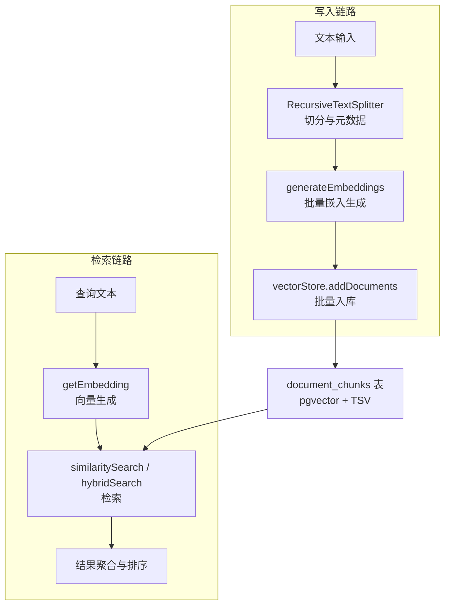
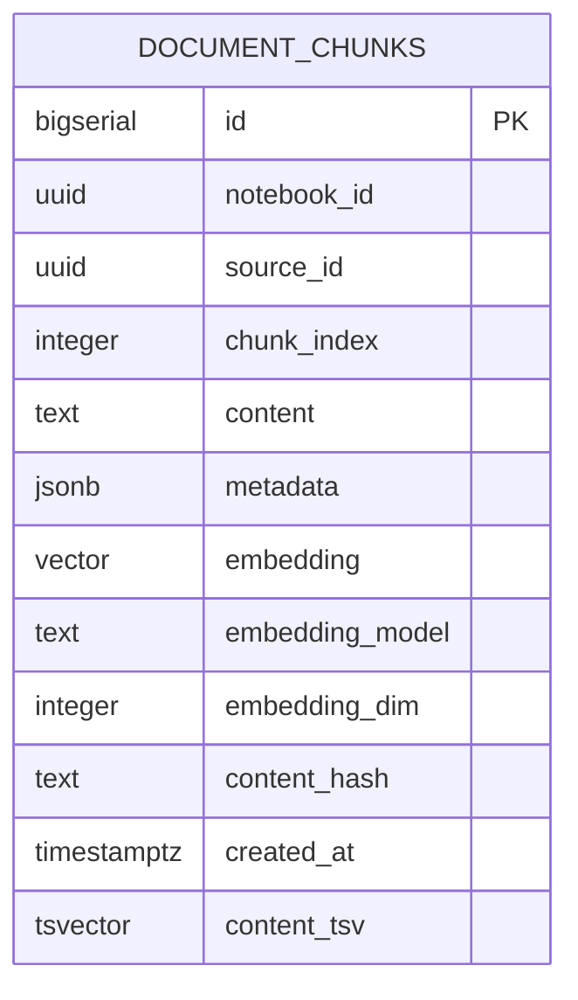
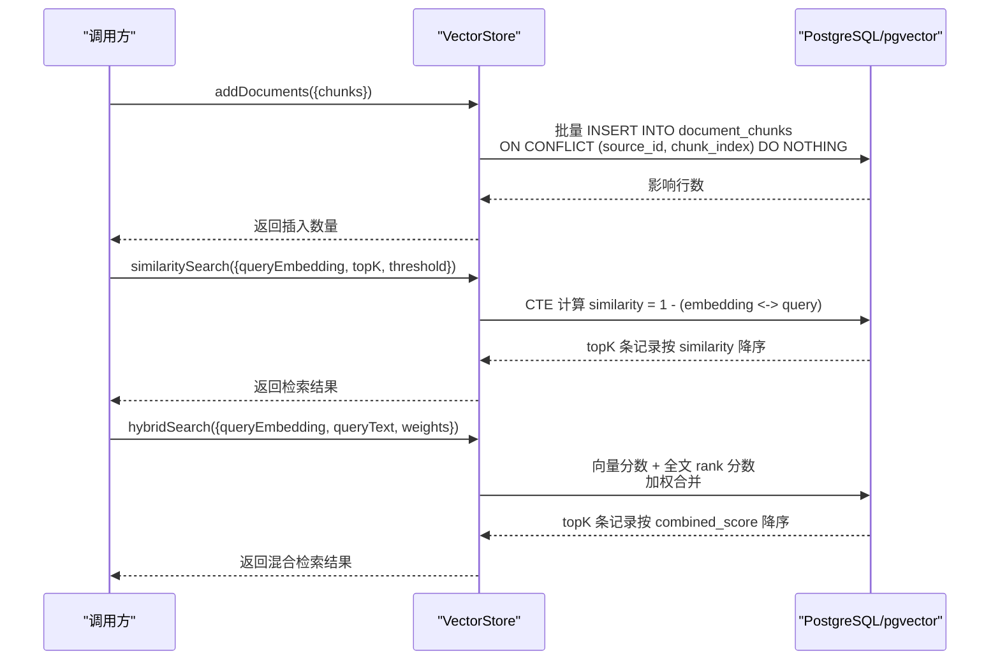
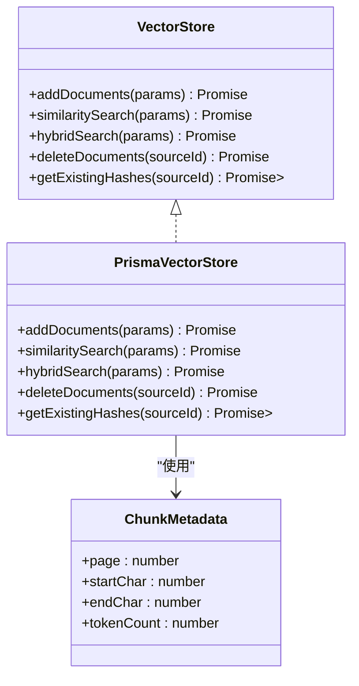
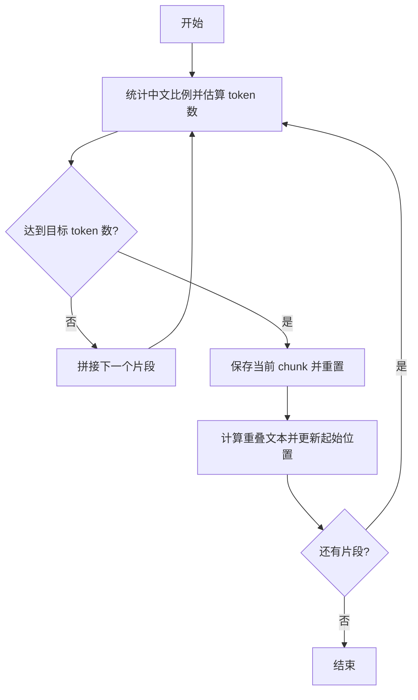
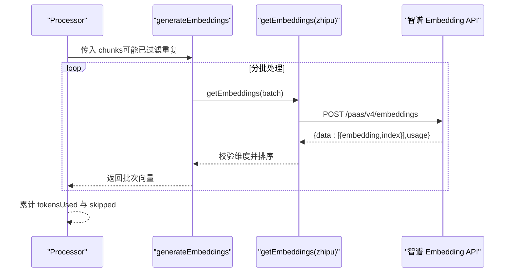
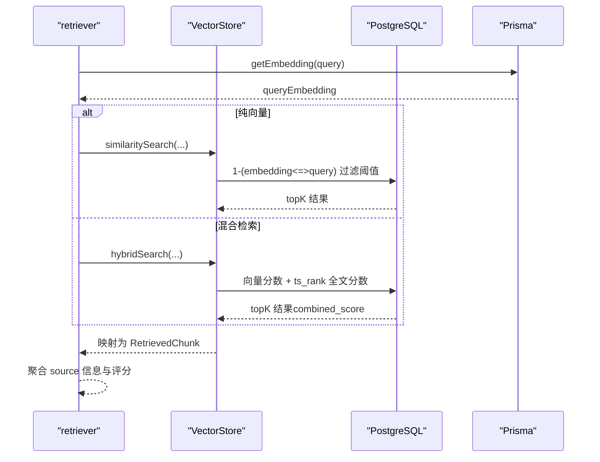
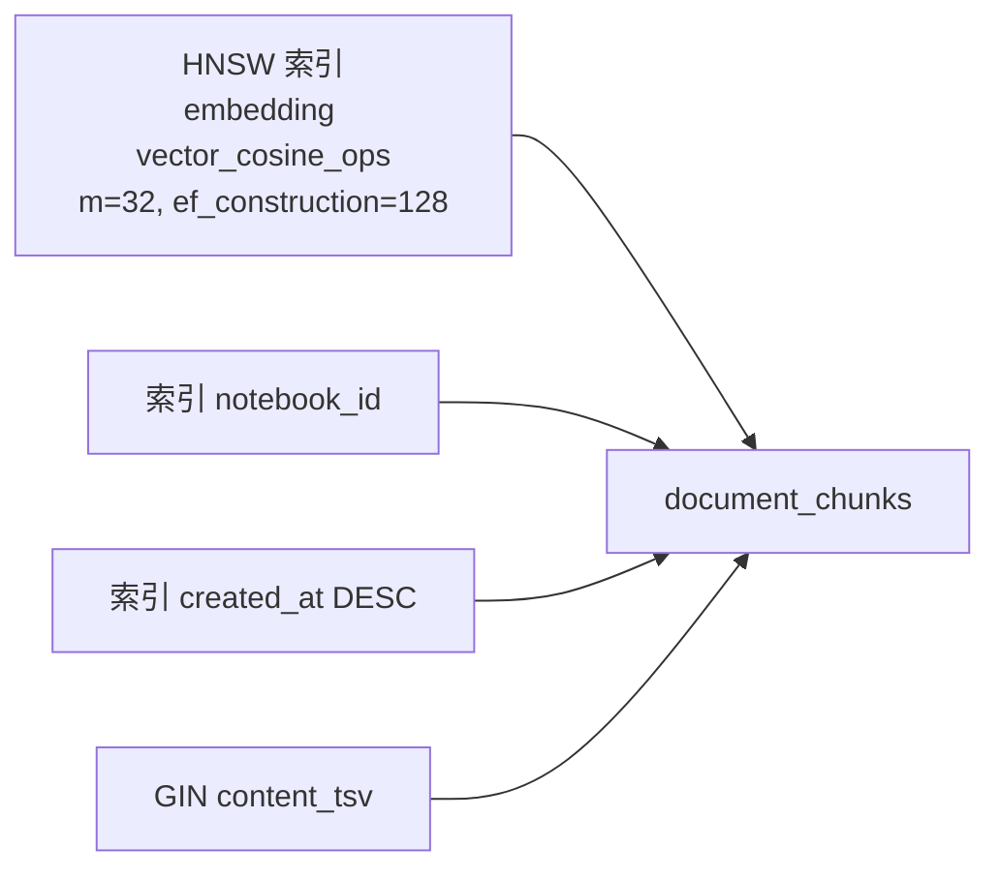
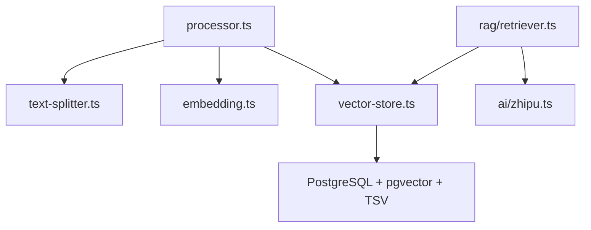

# 向量存储系统

<cite>
**本文引用的文件**
- [lib/db/vector-store.ts](file://lib/db/vector-store.ts)
- [lib/processing/embedding.ts](file://lib/processing/embedding.ts)
- [lib/processing/text-splitter.ts](file://lib/processing/text-splitter.ts)
- [lib/processing/processor.ts](file://lib/processing/processor.ts)
- [lib/rag/retriever.ts](file://lib/rag/retriever.ts)
- [lib/rag/index.ts](file://lib/rag/index.ts)
- [lib/ai/zhipu.ts](file://lib/ai/zhipu.ts)
- [lib/config.ts](file://lib/config.ts)
- [lib/utils/logger.ts](file://lib/utils/logger.ts)
- [prisma/migrations/20241223_create_vector_table/migration.sql](file://prisma/migrations/20241223_create_vector_table/migration.sql)
- [prisma/migrations/20260120050505_add_content_tsv/migration.sql](file://prisma/migrations/20260120050505_add_content_tsv/migration.sql)
- [prisma/migrations/20260120120200_optimize_hnsw_index/migration.sql](file://prisma/migrations/20260120120200_optimize_hnsw_index/migration.sql)
- [prisma/migrations/20260120120300_add_composite_indexes/migration.sql](file://prisma/migrations/20260120120300_add_composite_indexes/migration.sql)
</cite>

## 目录
1. [简介](#简介)
2. [项目结构](#项目结构)
3. [核心组件](#核心组件)
4. [架构总览](#架构总览)
5. [详细组件分析](#详细组件分析)
6. [依赖关系分析](#依赖关系分析)
7. [性能考量](#性能考量)
8. [故障排除指南](#故障排除指南)
9. [结论](#结论)
10. [附录](#附录)

## 简介
本文件系统性地阐述 notebookLM-clone 项目的向量存储系统，覆盖以下主题：
- 向量检索工作原理：向量嵌入生成、相似度计算与检索算法实现
- pgvector 集成：向量表设计、索引策略与查询优化
- 文本处理流程：文本切分、去重与批量嵌入生成
- 检索策略设计：纯向量检索、关键词检索与混合检索
- 性能优化：索引调优、查询缓存与批量处理
- 参数配置：向量维度、相似度阈值与排序机制
- 监控与可观测性：日志结构与指标
- 错误处理与故障排除
- 使用模式与扩展建议

## 项目结构
向量存储系统由“数据写入”和“数据检索”两条主线构成：
- 数据写入链路：文本切分 → 去重 → 批量嵌入 → 批量入库（向量表 + 全文字段）
- 数据检索链路：查询文本向量化 → 向量检索/混合检索 → 结果聚合与排序

图表来源
- [lib/processing/text-splitter.ts](file://lib/processing/text-splitter.ts#L83-L264)
- [lib/processing/embedding.ts](file://lib/processing/embedding.ts#L140-L188)
- [lib/db/vector-store.ts](file://lib/db/vector-store.ts#L77-L443)
- [lib/rag/retriever.ts](file://lib/rag/retriever.ts#L53-L206)
- [lib/ai/zhipu.ts](file://lib/ai/zhipu.ts#L53-L101)
- [prisma/migrations/20241223_create_vector_table/migration.sql](file://prisma/migrations/20241223_create_vector_table/migration.sql#L4-L30)

章节来源
- [lib/processing/text-splitter.ts](file://lib/processing/text-splitter.ts#L1-L270)
- [lib/processing/embedding.ts](file://lib/processing/embedding.ts#L1-L189)
- [lib/db/vector-store.ts](file://lib/db/vector-store.ts#L1-L446)
- [lib/rag/retriever.ts](file://lib/rag/retriever.ts#L1-L206)
- [lib/ai/zhipu.ts](file://lib/ai/zhipu.ts#L1-L196)
- [prisma/migrations/20241223_create_vector_table/migration.sql](file://prisma/migrations/20241223_create_vector_table/migration.sql#L1-L65)

## 核心组件
- 向量存储接口与实现
  - 接口定义：添加文档、向量相似度检索、混合检索、删除文档、获取现有哈希集合
  - 实现类：PrismaVectorStore，基于 Prisma 原生 SQL 执行批量插入与查询
- 文本切分器
  - 递归字符切分器，支持中英混合与多种分隔符，带重叠窗口与 token 估算
- 嵌入生成器
  - 基于智谱 Embedding API，支持批量请求、指数退避重试、维度校验
- 检索器
  - 纯向量检索与混合检索，支持阈值过滤、权重融合与结果排序
- 配置与日志
  - 维度常量与启动校验、日志结构与向量操作日志

章节来源
- [lib/db/vector-store.ts](file://lib/db/vector-store.ts#L24-L75)
- [lib/db/vector-store.ts](file://lib/db/vector-store.ts#L77-L443)
- [lib/processing/text-splitter.ts](file://lib/processing/text-splitter.ts#L83-L264)
- [lib/processing/embedding.ts](file://lib/processing/embedding.ts#L140-L188)
- [lib/rag/retriever.ts](file://lib/rag/retriever.ts#L53-L206)
- [lib/config.ts](file://lib/config.ts#L6-L29)
- [lib/utils/logger.ts](file://lib/utils/logger.ts#L11-L94)

## 架构总览
向量存储系统围绕 document_chunks 表构建，采用 pgvector 存储向量并结合全文检索（TSV）实现混合检索。

图表来源
- [prisma/migrations/20241223_create_vector_table/migration.sql](file://prisma/migrations/20241223_create_vector_table/migration.sql#L4-L30)
- [prisma/migrations/20260120050505_add_content_tsv/migration.sql](file://prisma/migrations/20260120050505_add_content_tsv/migration.sql#L1-L7)

图表来源
- [lib/db/vector-store.ts](file://lib/db/vector-store.ts#L77-L443)
- [prisma/migrations/20241223_create_vector_table/migration.sql](file://prisma/migrations/20241223_create_vector_table/migration.sql#L31-L65)

## 详细组件分析

### 向量存储接口与实现（PrismaVectorStore）
- 批量插入
  - 维度校验：确保每个 chunk 的 embedding 维度与全局配置一致
  - 分批处理：每批最多 500 条，使用原生 SQL 插入并去重
  - 日志记录：记录插入耗时、插入/跳过数量等
- 相似度检索
  - 使用余弦距离的向量内积计算相似度：similarity = 1 - (embedding <-> query)
  - 支持按 sourceIds 过滤与阈值过滤，按 similarity 降序取 topK
- 混合检索
  - 向量分数：1 - (embedding <-> query)
  - 全文分数：content_tsv 的 ts_rank，使用 simple 分词器
  - 权重融合：combined_score = vectorWeight * vector_score + ftsWeight * fts_score
  - 过滤条件：vector_score > threshold 或 fts_score 非空
- 其他能力
  - 删除文档：按 source_id 清理
  - 哈希去重：查询现有 content_hash 集合，避免重复入库

图表来源
- [lib/db/vector-store.ts](file://lib/db/vector-store.ts#L24-L75)
- [lib/db/vector-store.ts](file://lib/db/vector-store.ts#L77-L443)

章节来源
- [lib/db/vector-store.ts](file://lib/db/vector-store.ts#L77-L443)
- [lib/config.ts](file://lib/config.ts#L6-L29)
- [lib/utils/logger.ts](file://lib/utils/logger.ts#L72-L94)

### 文本切分与去重（RecursiveTextSplitter 与哈希）
- 切分策略
  - 优先级分隔符：Markdown 标题、段落、换行、中文标点、英文标点、空格、字符
  - 重叠窗口：chunkOverlap 约占 chunkSize 的 12.5%，避免语义断裂
  - token 估算：根据中英文字符比例加权估算，便于控制 chunkSize
- 去重策略
  - 生成 content_md5 哈希，入库前查询现有哈希集合，跳过已存在内容
  - Source 内部去重，避免重复嵌入与索引

图表来源
- [lib/processing/text-splitter.ts](file://lib/processing/text-splitter.ts#L83-L264)

章节来源
- [lib/processing/text-splitter.ts](file://lib/processing/text-splitter.ts#L13-L78)
- [lib/processing/text-splitter.ts](file://lib/processing/text-splitter.ts#L83-L264)

### 嵌入生成与重试（generateEmbeddings）
- 批量请求
  - 单批最多 64 条，单条最多 3072 tokens
  - 自动按 index 排序返回，保证顺序一致性
- 重试机制
  - 指数退避：初始 1s，最大 30s，最多 3 次重试
  - 可重试状态：429、500、502、503、504
- 维度校验
  - 返回向量维度必须与 EMBEDDING_DIM 一致，否则抛错

图表来源
- [lib/processing/embedding.ts](file://lib/processing/embedding.ts#L140-L188)
- [lib/ai/zhipu.ts](file://lib/ai/zhipu.ts#L62-L101)

章节来源
- [lib/processing/embedding.ts](file://lib/processing/embedding.ts#L1-L189)
- [lib/ai/zhipu.ts](file://lib/ai/zhipu.ts#L53-L101)

### 检索策略（纯向量 vs 混合检索）
- 纯向量检索
  - 输入：queryEmbedding、topK、threshold、可选 sourceIds
  - 输出：chunk 与 similarity
- 混合检索
  - 输入：queryEmbedding、queryText、weights、topK、threshold、可选 sourceIds
  - 输出：chunk、vectorScore、ftsScore、combinedScore
  - 过滤：vector_score > threshold 或命中全文关键词
  - 排序：combined_score 降序

图表来源
- [lib/rag/retriever.ts](file://lib/rag/retriever.ts#L53-L206)
- [lib/db/vector-store.ts](file://lib/db/vector-store.ts#L175-L443)

章节来源
- [lib/rag/retriever.ts](file://lib/rag/retriever.ts#L1-L206)
- [lib/db/vector-store.ts](file://lib/db/vector-store.ts#L175-L443)

### 数据库表设计与索引策略
- 表结构要点
  - 向量列：embedding(vector(1024))，embedding_model、embedding_dim 固化
  - 元数据：JSONB metadata，content_hash 用于去重
  - 全文字段：content_tsv（to_tsvector('english', content) stored）
- 索引策略
  - HNSW 向量索引：cosine 距离，m=32、ef_construction=128 提升召回率
  - 单列索引：notebook_id、created_at（降序）优化过滤与统计
  - 全文索引：GIN(content_tsv) 提升混合检索性能

图表来源
- [prisma/migrations/20241223_create_vector_table/migration.sql](file://prisma/migrations/20241223_create_vector_table/migration.sql#L22-L30)
- [prisma/migrations/20260120120200_optimize_hnsw_index/migration.sql](file://prisma/migrations/20260120120200_optimize_hnsw_index/migration.sql#L10-L12)
- [prisma/migrations/20260120050505_add_content_tsv/migration.sql](file://prisma/migrations/20260120050505_add_content_tsv/migration.sql#L4-L5)
- [prisma/migrations/20260120120300_add_composite_indexes/migration.sql](file://prisma/migrations/20260120120300_add_composite_indexes/migration.sql#L6-L15)

章节来源
- [prisma/migrations/20241223_create_vector_table/migration.sql](file://prisma/migrations/20241223_create_vector_table/migration.sql#L4-L65)
- [prisma/migrations/20260120050505_add_content_tsv/migration.sql](file://prisma/migrations/20260120050505_add_content_tsv/migration.sql#L1-L7)
- [prisma/migrations/20260120120200_optimize_hnsw_index/migration.sql](file://prisma/migrations/20260120120200_optimize_hnsw_index/migration.sql#L1-L16)
- [prisma/migrations/20260120120300_add_composite_indexes/migration.sql](file://prisma/migrations/20260120120300_add_composite_indexes/migration.sql#L1-L20)

## 依赖关系分析
- 组件耦合
  - Processor 依赖 TextSplitter、Embedding、VectorStore，形成完整的写入流水线
  - Retriever 依赖 Embedding 与 VectorStore，负责检索与结果映射
  - VectorStore 依赖 Prisma 与数据库（pgvector + TSV）
- 关键外部依赖
  - 智谱 AI Embedding API：提供 1024 维向量
  - PostgreSQL 扩展：vector、to_tsvector、hnsw

图表来源
- [lib/processing/processor.ts](file://lib/processing/processor.ts#L10-L17)
- [lib/rag/retriever.ts](file://lib/rag/retriever.ts#L1-L4)
- [lib/db/vector-store.ts](file://lib/db/vector-store.ts#L1-L5)
- [lib/ai/zhipu.ts](file://lib/ai/zhipu.ts#L8)

章节来源
- [lib/processing/processor.ts](file://lib/processing/processor.ts#L1-L200)
- [lib/rag/retriever.ts](file://lib/rag/retriever.ts#L1-L206)
- [lib/db/vector-store.ts](file://lib/db/vector-store.ts#L1-L446)
- [lib/ai/zhipu.ts](file://lib/ai/zhipu.ts#L1-L196)

## 性能考量
- 索引调优
  - HNSW：m=32、ef_construction=128，提升召回率与查询稳定性
  - 单列索引：notebook_id 与 created_at 优化过滤与统计
  - 全文索引：GIN(content_tsv) 提升混合检索性能
- 批量处理
  - 写入：每批最多 500 条，减少事务开销
  - 嵌入：每批最多 64 条，单条最多 3072 tokens，避免超限
- 查询优化
  - CTE 避免重复计算，先过滤再排序
  - 混合检索使用 LEFT JOIN + WHERE 条件短路，减少不必要的计算
- 缓存与复用
  - 建议在应用层缓存 sourceId → content_hash 集合，降低重复查询成本
  - 对热点查询可考虑短期缓存检索结果（注意一致性）

章节来源
- [lib/db/vector-store.ts](file://lib/db/vector-store.ts#L105-L140)
- [lib/processing/embedding.ts](file://lib/processing/embedding.ts#L23-L26)
- [lib/processing/embedding.ts](file://lib/processing/embedding.ts#L164-L181)
- [prisma/migrations/20260120120200_optimize_hnsw_index/migration.sql](file://prisma/migrations/20260120120200_optimize_hnsw_index/migration.sql#L8-L12)
- [prisma/migrations/20260120120300_add_composite_indexes/migration.sql](file://prisma/migrations/20260120120300_add_composite_indexes/migration.sql#L6-L15)

## 故障排除指南
- 维度不匹配
  - 现象：插入或查询时报错“维度错误”
  - 原因：EMBEDDING_DIM 与数据库 vector(D) 不一致
  - 处理：确保 EMBEDDING_DIM=1024，且数据库表 embedding(vector(1024)) 一致
- API 限流/错误
  - 现象：Embedding API 返回 429/5xx
  - 处理：启用指数退避重试；必要时降低批大小或并发
- 查询性能差
  - 现象：相似度检索慢
  - 处理：确认 HNSW 索引已创建且参数合理；适当提高 topK 或放宽阈值
- 混合检索无结果
  - 现象：向量分数均低于阈值且无全文命中
  - 处理：降低阈值或调整权重；检查 content_tsv 是否正确建立
- 重复数据
  - 现象：相同 chunk 多次入库
  - 处理：确认 content_hash 去重逻辑生效；检查 sourceId 与 chunkIndex 唯一约束

章节来源
- [lib/config.ts](file://lib/config.ts#L17-L29)
- [lib/processing/embedding.ts](file://lib/processing/embedding.ts#L115-L134)
- [lib/db/vector-store.ts](file://lib/db/vector-store.ts#L92-L99)
- [prisma/migrations/20241223_create_vector_table/migration.sql](file://prisma/migrations/20241223_create_vector_table/migration.sql#L22-L30)

## 结论
该向量存储系统以 pgvector 为核心，结合文本切分、去重与批量嵌入，实现了高效稳定的向量检索能力。通过 HNSW 索引、全文索引与合理的批处理策略，在召回率与性能之间取得平衡。混合检索进一步提升了检索质量，适合多样化的应用场景。建议在生产环境中持续关注索引参数、批大小与阈值设置，并配合日志与监控进行迭代优化。

## 附录

### 参数与配置清单
- 向量维度
  - EMBEDDING_DIM：必须为 1024（与数据库 embedding(vector(1024)) 一致）
- 批处理配置
  - 向量存储：每批最多 500 条
  - 嵌入生成：每批最多 64 条，单条最多 3072 tokens
- 检索配置
  - topK：默认 8
  - 相似度阈值：默认 0.0（向量检索）/ 0.1（混合检索）
  - 权重：向量权重 0.7，全文权重 0.3
- 索引参数
  - HNSW：m=32，ef_construction=128
  - 全文：GIN(content_tsv)

章节来源
- [lib/config.ts](file://lib/config.ts#L6-L29)
- [lib/db/vector-store.ts](file://lib/db/vector-store.ts#L9-L9)
- [lib/processing/embedding.ts](file://lib/processing/embedding.ts#L23-L26)
- [lib/rag/retriever.ts](file://lib/rag/retriever.ts#L6-L13)
- [prisma/migrations/20260120120200_optimize_hnsw_index/migration.sql](file://prisma/migrations/20260120120200_optimize_hnsw_index/migration.sql#L8-L12)

### 监控指标与日志
- 向量操作日志结构
  - operation：insert/search/hybrid_search/delete
  - notebookId/sourceId：上下文标识
  - chunkCount/duration：性能指标
  - success/error/metadata：结果与附加信息
- 建议指标
  - 插入吞吐（条/秒）、平均耗时（ms）
  - 检索延迟（ms）、命中率、平均相似度
  - 嵌入调用成功率、重试次数、tokens 使用量
  - 全文命中率、混合检索权重影响

章节来源
- [lib/utils/logger.ts](file://lib/utils/logger.ts#L11-L27)
- [lib/utils/logger.ts](file://lib/utils/logger.ts#L72-L94)
- [lib/db/vector-store.ts](file://lib/db/vector-store.ts#L143-L154)
- [lib/db/vector-store.ts](file://lib/db/vector-store.ts#L268-L279)

### 使用模式与扩展建议
- 写入模式
  - PDF/URL 处理：下载 → 解析 → 切分 → 去重 → 嵌入 → 批量入库
  - 增量更新：按 sourceId 清理旧数据，重新入库
- 检索模式
  - 纯向量：适合语义近似匹配
  - 混合检索：兼顾语义与关键词，提升准确性
  - 多源过滤：通过 sourceIds 限定检索范围
- 扩展方向
  - 多模型向量：统一维度与表结构，支持动态切换
  - 热点缓存：对高频查询结果进行短期缓存
  - 动态阈值：基于业务反馈自适应调整相似度阈值
  - 多语言分词：FTS 使用合适的语言配置提升效果

章节来源
- [lib/processing/processor.ts](file://lib/processing/processor.ts#L82-L200)
- [lib/rag/retriever.ts](file://lib/rag/retriever.ts#L53-L206)
- [lib/db/vector-store.ts](file://lib/db/vector-store.ts#L215-L252)
- [lib/db/vector-store.ts](file://lib/db/vector-store.ts#L363-L429)