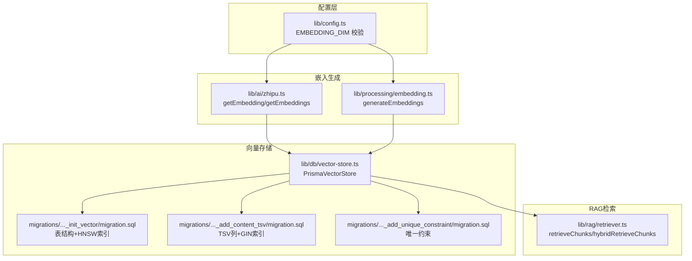
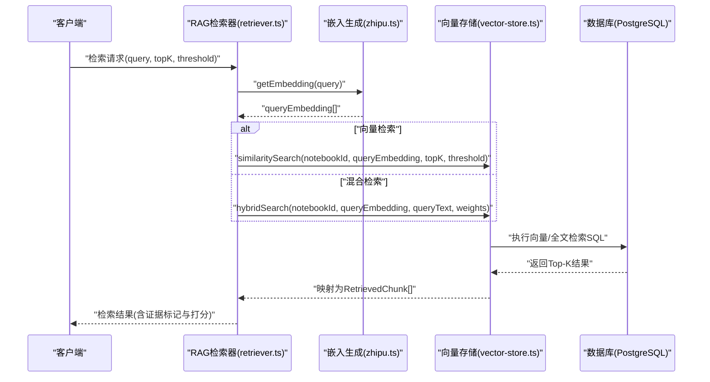
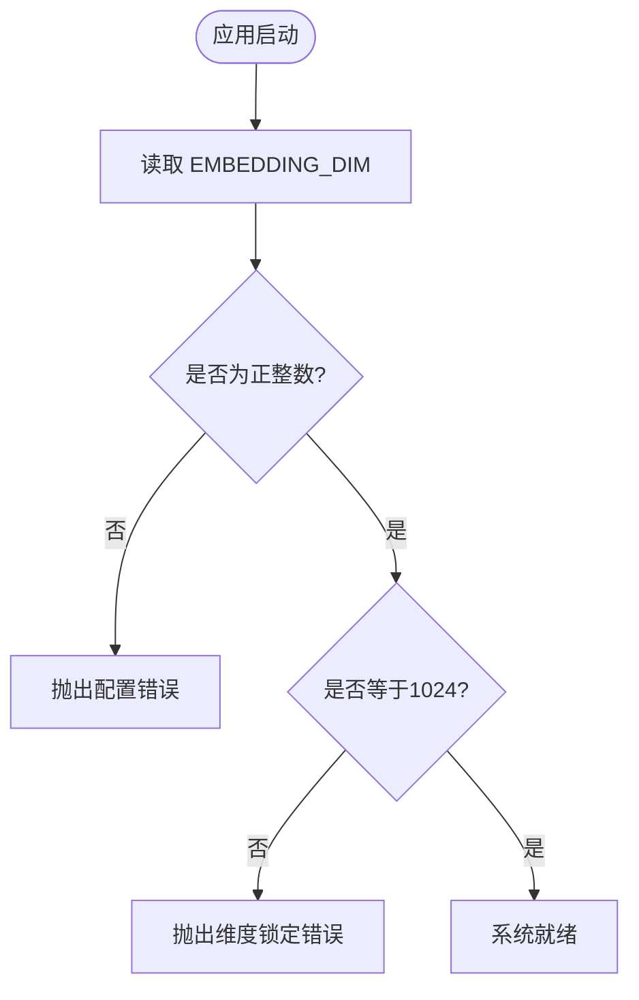
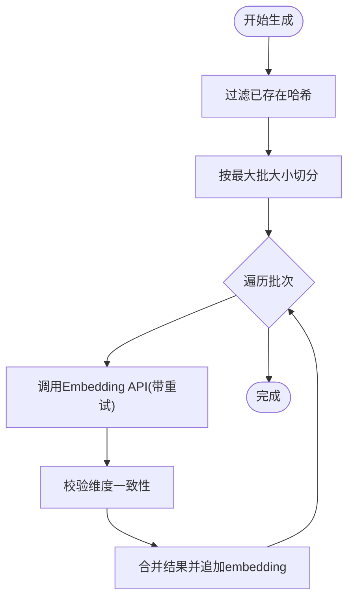
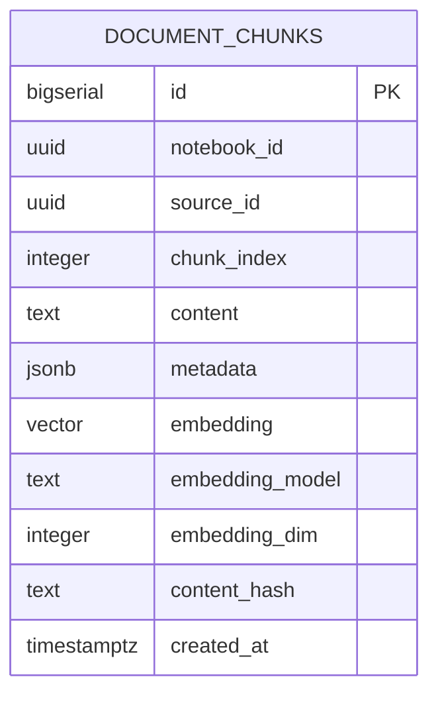
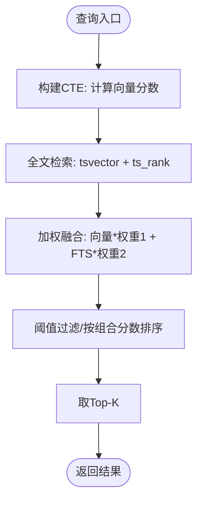
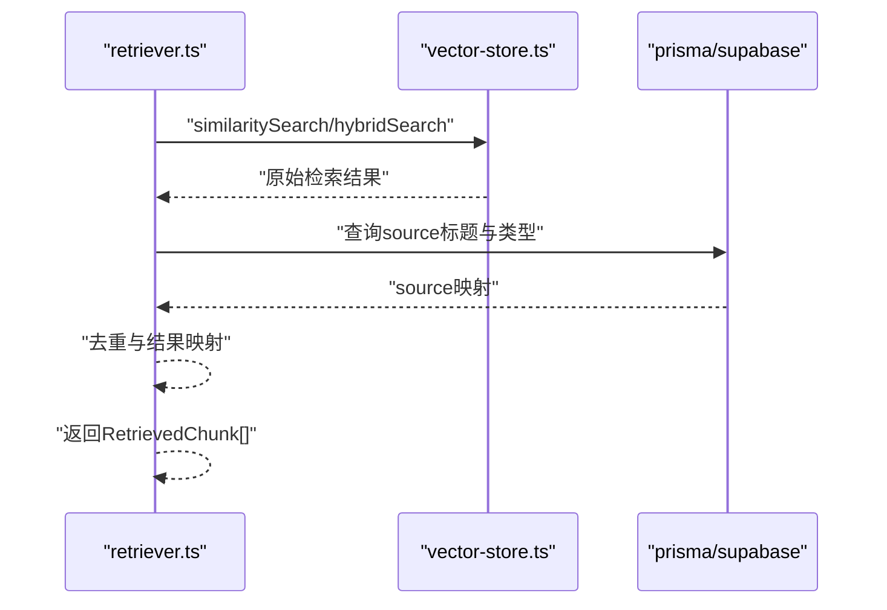
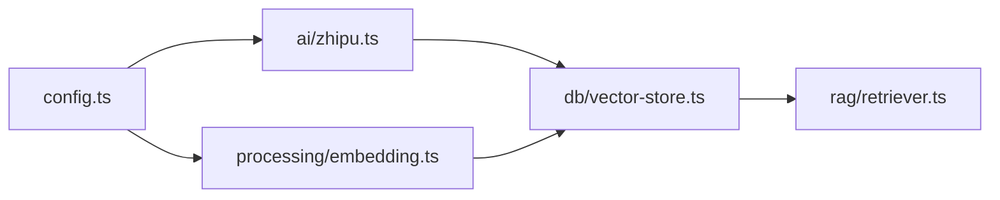

# 向量检索原理

<cite>
**本文引用的文件**
- [lib/db/vector-store.ts](file://lib/db/vector-store.ts)
- [lib/processing/embedding.ts](file://lib/processing/embedding.ts)
- [lib/rag/retriever.ts](file://lib/rag/retriever.ts)
- [lib/config.ts](file://lib/config.ts)
- [lib/ai/zhipu.ts](file://lib/ai/zhipu.ts)
- [prisma/migrations/00000000000000_init_vector/migration.sql](file://prisma/migrations/00000000000000_init_vector/migration.sql)
- [prisma/migrations/20260120050505_add_content_tsv/migration.sql](file://prisma/migrations/20260120050505_add_content_tsv/migration.sql)
- [prisma/migrations/20260120120000_add_unique_constraint/migration.sql](file://prisma/migrations/20260120120000_add_unique_constraint/migration.sql)
</cite>

## 目录
1. [简介](#简介)
2. [项目结构](#项目结构)
3. [核心组件](#核心组件)
4. [架构总览](#架构总览)
5. [详细组件分析](#详细组件分析)
6. [依赖关系分析](#依赖关系分析)
7. [性能考量](#性能考量)
8. [故障排查指南](#故障排查指南)
9. [结论](#结论)
10. [附录](#附录)

## 简介
本文件面向 notebookLM-clone 项目的向量检索子系统，系统性阐述向量嵌入的基本概念与数学原理，解释相似度计算方法（余弦相似度、向量内积与距离的关系），说明向量维度配置（EMBEDDING_DIM）的作用与影响，并基于仓库中的数据库迁移与实现细节，给出向量存储的数据结构设计、索引策略与相似度搜索的实现原理。最后提供性能特征分析与实践建议，并通过代码片段路径展示向量嵌入生成、相似度计算与检索结果处理的完整流程。

## 项目结构
向量检索相关的关键模块分布如下：
- 配置层：统一管理 EMBEDDING_DIM、模型与环境变量校验
- 嵌入生成：调用智谱 Embedding API，批量生成并校验向量维度
- 向量存储：封装向量写入、相似度检索与混合检索的数据库操作
- RAG 检索器：对外暴露检索接口，整合嵌入与检索结果
- 数据库迁移：定义向量表结构、索引与全文检索列

图表来源
- [lib/config.ts](file://lib/config.ts#L6-L29)
- [lib/ai/zhipu.ts](file://lib/ai/zhipu.ts#L53-L101)
- [lib/processing/embedding.ts](file://lib/processing/embedding.ts#L140-L188)
- [lib/db/vector-store.ts](file://lib/db/vector-store.ts#L77-L442)
- [prisma/migrations/00000000000000_init_vector/migration.sql](file://prisma/migrations/00000000000000_init_vector/migration.sql#L6-L25)
- [prisma/migrations/20260120050505_add_content_tsv/migration.sql](file://prisma/migrations/20260120050505_add_content_tsv/migration.sql#L1-L7)
- [prisma/migrations/20260120120000_add_unique_constraint/migration.sql](file://prisma/migrations/20260120120000_add_unique_constraint/migration.sql#L1-L26)

章节来源
- [lib/config.ts](file://lib/config.ts#L6-L29)
- [lib/ai/zhipu.ts](file://lib/ai/zhipu.ts#L53-L101)
- [lib/processing/embedding.ts](file://lib/processing/embedding.ts#L140-L188)
- [lib/db/vector-store.ts](file://lib/db/vector-store.ts#L77-L442)
- [prisma/migrations/00000000000000_init_vector/migration.sql](file://prisma/migrations/00000000000000_init_vector/migration.sql#L6-L25)
- [prisma/migrations/20260120050505_add_content_tsv/migration.sql](file://prisma/migrations/20260120050505_add_content_tsv/migration.sql#L1-L7)
- [prisma/migrations/20260120120000_add_unique_constraint/migration.sql](file://prisma/migrations/20260120120000_add_unique_constraint/migration.sql#L1-L26)

## 核心组件
- 向量维度配置（EMBEDDING_DIM）
  - 作用：确保嵌入生成、入库与检索三者维度一致，避免运行期错误
  - 影响：直接影响向量表的列类型、索引策略与检索相似度计算
  - 仓库约束：系统强制要求 EMBEDDING_DIM=1024，对应智谱 embedding-3 模型
- 向量嵌入生成
  - 批量调用智谱 Embedding API，支持指数退避重试与去重
  - 返回标准化 ChunkWithEmbedding，包含 content、contentHash、metadata、embedding
- 向量存储与检索
  - 写入：批量插入 document_chunks，按 source_id+chunk_index 去重
  - 相似度检索：使用向量内积与余弦相似度的等价变换（1 - (u·v)/(|u||v|)）
  - 混合检索：结合向量相似度与全文检索（TSV）加权融合
- RAG 检索器
  - 对外提供向量检索与混合检索接口，返回带证据标记与打分详情的结果

章节来源
- [lib/config.ts](file://lib/config.ts#L6-L29)
- [lib/processing/embedding.ts](file://lib/processing/embedding.ts#L140-L188)
- [lib/db/vector-store.ts](file://lib/db/vector-store.ts#L77-L442)
- [lib/rag/retriever.ts](file://lib/rag/retriever.ts#L53-L206)

## 架构总览
向量检索的端到端流程如下：
- 输入查询文本 → 生成查询向量 → 向量检索（向量相似度或混合）→ 返回 Top-K 片段与证据信息

图表来源
- [lib/rag/retriever.ts](file://lib/rag/retriever.ts#L53-L206)
- [lib/ai/zhipu.ts](file://lib/ai/zhipu.ts#L53-L101)
- [lib/db/vector-store.ts](file://lib/db/vector-store.ts#L175-L297)
- [lib/db/vector-store.ts](file://lib/db/vector-store.ts#L312-L442)

## 详细组件分析

### 向量维度配置与一致性校验
- EMBEDDING_DIM 由环境变量读取并进行有效性与强制值校验，确保与数据库 vector(1024)、索引策略与嵌入模型一致
- 若不一致，启动即抛出错误，避免运行期维度不匹配导致的异常

图表来源
- [lib/config.ts](file://lib/config.ts#L6-L29)

章节来源
- [lib/config.ts](file://lib/config.ts#L6-L29)

### 向量嵌入生成与批量处理
- 批大小与令牌上限控制：最大批 64，单条输入约 3072 tokens
- 指数退避重试：支持 429/5xx 等可重试错误码
- 维度校验：返回向量逐一校验维度一致性
- 去重优化：根据 content_hash 过滤已存在片段，减少重复入库

图表来源
- [lib/processing/embedding.ts](file://lib/processing/embedding.ts#L140-L188)
- [lib/ai/zhipu.ts](file://lib/ai/zhipu.ts#L62-L101)

章节来源
- [lib/processing/embedding.ts](file://lib/processing/embedding.ts#L140-L188)
- [lib/ai/zhipu.ts](file://lib/ai/zhipu.ts#L62-L101)

### 向量存储的数据结构与索引策略
- 表结构要点
  - 字段：notebook_id、source_id、chunk_index、content、metadata、embedding(vector)、embedding_model、embedding_dim、content_hash、created_at
  - 唯一性约束：(source_id, chunk_index)，防止同源重复分片
- 索引策略
  - HNSW 向量索引：使用向量余弦距离（vector_cosine_ops），适合高维单位化向量
  - 其他常用索引：notebook_id、source_id、content_hash
  - 全文检索列：content_tsv（tsvector），配合 GIN 索引，支持混合检索
- 写入策略
  - 批量插入，每批最多 500 条；遇到冲突（source_id, chunk_index）则跳过
  - 写入前进行维度校验，失败即抛错

图表来源
- [prisma/migrations/00000000000000_init_vector/migration.sql](file://prisma/migrations/00000000000000_init_vector/migration.sql#L6-L20)
- [prisma/migrations/20260120120000_add_unique_constraint/migration.sql](file://prisma/migrations/20260120120000_add_unique_constraint/migration.sql#L1-L26)

章节来源
- [prisma/migrations/00000000000000_init_vector/migration.sql](file://prisma/migrations/00000000000000_init_vector/migration.sql#L6-L25)
- [prisma/migrations/20260120050505_add_content_tsv/migration.sql](file://prisma/migrations/20260120050505_add_content_tsv/migration.sql#L1-L7)
- [prisma/migrations/20260120120000_add_unique_constraint/migration.sql](file://prisma/migrations/20260120120000_add_unique_constraint/migration.sql#L1-L26)
- [lib/db/vector-store.ts](file://lib/db/vector-store.ts#L77-L173)

### 相似度搜索与混合检索实现
- 相似度计算
  - 使用 PostgreSQL 向量内积操作符 "<=>"，相似度定义为 1 - (u·v)/(|u||v|)，等价于余弦距离的变换形式
  - 支持按 sourceIds 过滤与阈值筛选，最终按相似度降序取 Top-K
- 混合检索
  - 向量分数：1 - (embedding <=> queryEmbedding)
  - 全文检索分数：ts_rank(content_tsv, plainto_tsquery('simple', queryText))
  - 加权融合：vector_score * w1 + fts_score * w2，按组合分数排序取 Top-K
- 查询优化
  - 使用 CTE 消除重复计算
  - 统一使用 simple 分词器，提升多语言支持

图表来源
- [lib/db/vector-store.ts](file://lib/db/vector-store.ts#L175-L297)
- [lib/db/vector-store.ts](file://lib/db/vector-store.ts#L312-L442)
- [prisma/migrations/20260120050505_add_content_tsv/migration.sql](file://prisma/migrations/20260120050505_add_content_tsv/migration.sql#L1-L7)

章节来源
- [lib/db/vector-store.ts](file://lib/db/vector-store.ts#L175-L297)
- [lib/db/vector-store.ts](file://lib/db/vector-store.ts#L312-L442)
- [prisma/migrations/20260120050505_add_content_tsv/migration.sql](file://prisma/migrations/20260120050505_add_content_tsv/migration.sql#L1-L7)

### RAG 检索器：检索流程与结果映射
- 向量检索：生成查询向量 → 调用 similaritySearch → 映射为 RetrievedChunk（含证据标记）
- 混合检索：生成查询向量 → 调用 hybridSearch → 映射为 RetrievedChunk（含向量/FTS/组合分数）
- 结果去重：按 id 去重，避免重复片段

图表来源
- [lib/rag/retriever.ts](file://lib/rag/retriever.ts#L53-L206)
- [lib/db/vector-store.ts](file://lib/db/vector-store.ts#L175-L297)
- [lib/db/vector-store.ts](file://lib/db/vector-store.ts#L312-L442)

章节来源
- [lib/rag/retriever.ts](file://lib/rag/retriever.ts#L53-L206)

## 依赖关系分析
- 组件耦合
  - vector-store 依赖 config 的 EMBEDDING_DIM，确保写入与检索维度一致
  - embedding 与 zhipu 依赖 config 的 EMBEDDING_DIM，确保 API 请求维度正确
  - retriever 依赖 vector-store 与 prisma，负责检索流程编排
- 外部依赖
  - PostgreSQL vector 扩展与 HNSW 索引
  - 智谱 AI Embedding API
- 潜在循环依赖
  - 未发现直接循环依赖；各模块职责清晰

图表来源
- [lib/config.ts](file://lib/config.ts#L6-L29)
- [lib/ai/zhipu.ts](file://lib/ai/zhipu.ts#L53-L101)
- [lib/processing/embedding.ts](file://lib/processing/embedding.ts#L140-L188)
- [lib/db/vector-store.ts](file://lib/db/vector-store.ts#L77-L442)
- [lib/rag/retriever.ts](file://lib/rag/retriever.ts#L53-L206)

章节来源
- [lib/config.ts](file://lib/config.ts#L6-L29)
- [lib/ai/zhipu.ts](file://lib/ai/zhipu.ts#L53-L101)
- [lib/processing/embedding.ts](file://lib/processing/embedding.ts#L140-L188)
- [lib/db/vector-store.ts](file://lib/db/vector-store.ts#L77-L442)
- [lib/rag/retriever.ts](file://lib/rag/retriever.ts#L53-L206)

## 性能考量
- 时间复杂度
  - 相似度检索：PostgreSQL HNSW 索引下，查询近似最近邻的平均复杂度显著低于全表扫描，具体取决于索引参数与数据分布
  - 混合检索：向量分数计算 O(N) + 全文检索 O(log N + k)（k 为命中词条数），整体仍受 N 与阈值影响
- 空间复杂度
  - 向量列占用：embedding_dim × sizeof(float4)；1024 维向量每条约 4KB
  - HNSW 索引：额外存储图结构，通常为向量数量的若干倍
  - TSV 列与 GIN 索引：按内容长度与词汇量决定
- 内存使用
  - 写入阶段：批量插入缓冲与 Prisma 执行开销；单批最多 500 条
  - 查询阶段：CTE 临时结果集与排序内存；Top-K 限制有效控制输出规模
- 优化建议
  - 控制 topK 与阈值，避免返回过多候选
  - 使用 sourceIds 过滤缩小搜索范围
  - 合理设置向量维度（当前固定 1024），避免不必要的扩容
  - 定期清理与归档旧 Notebook 的向量数据

[本节为通用性能讨论，不直接分析具体文件]

## 故障排查指南
- 维度不匹配
  - 现象：插入或检索时报维度错误
  - 排查：确认 EMBEDDING_DIM=1024，且嵌入 API 请求与返回均满足该维度
- 索引缺失或失效
  - 现象：检索变慢或报索引相关错误
  - 排查：确认 HNSW 与 TSV/GIN 索引存在；必要时重建索引
- 重复数据与去重问题
  - 现象：重复片段出现
  - 排查：检查 content_hash 去重逻辑与唯一约束是否生效
- API 调用失败
  - 现象：嵌入生成失败或超时
  - 排查：检查网络、鉴权与重试策略；关注 429/5xx 错误码

章节来源
- [lib/config.ts](file://lib/config.ts#L6-L29)
- [lib/db/vector-store.ts](file://lib/db/vector-store.ts#L77-L173)
- [lib/processing/embedding.ts](file://lib/processing/embedding.ts#L140-L188)
- [prisma/migrations/20260120120000_add_unique_constraint/migration.sql](file://prisma/migrations/20260120120000_add_unique_constraint/migration.sql#L1-L26)

## 结论
notebookLM-clone 的向量检索体系以“强一致的 1024 维”为核心，结合 PostgreSQL 向量扩展与 HNSW 索引，实现了高效的向量相似度检索；通过混合检索融合全文检索，进一步提升了召回质量。配置层严格校验维度，嵌入层提供稳健的批量生成与去重能力，存储层以索引与约束保障性能与数据完整性，RAG 层则提供了简洁易用的检索接口。整体设计在工程上具备良好的可维护性与扩展性。

[本节为总结性内容，不直接分析具体文件]

## 附录
- 代码示例路径（不展示具体代码内容）
  - 向量嵌入生成与维度校验
    - [lib/processing/embedding.ts](file://lib/processing/embedding.ts#L140-L188)
    - [lib/ai/zhipu.ts](file://lib/ai/zhipu.ts#L62-L101)
  - 相似度检索与阈值过滤
    - [lib/db/vector-store.ts](file://lib/db/vector-store.ts#L175-L297)
  - 混合检索与加权融合
    - [lib/db/vector-store.ts](file://lib/db/vector-store.ts#L312-L442)
    - [prisma/migrations/20260120050505_add_content_tsv/migration.sql](file://prisma/migrations/20260120050505_add_content_tsv/migration.sql#L1-L7)
  - 表结构与索引
    - [prisma/migrations/00000000000000_init_vector/migration.sql](file://prisma/migrations/00000000000000_init_vector/migration.sql#L6-L25)
    - [prisma/migrations/20260120120000_add_unique_constraint/migration.sql](file://prisma/migrations/20260120120000_add_unique_constraint/migration.sql#L1-L26)
  - RAG 检索器接口
    - [lib/rag/retriever.ts](file://lib/rag/retriever.ts#L53-L206)