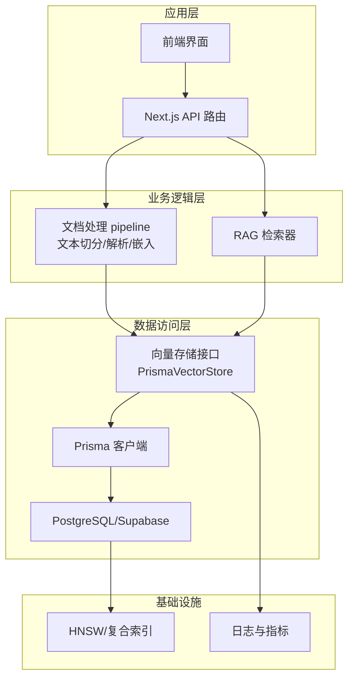
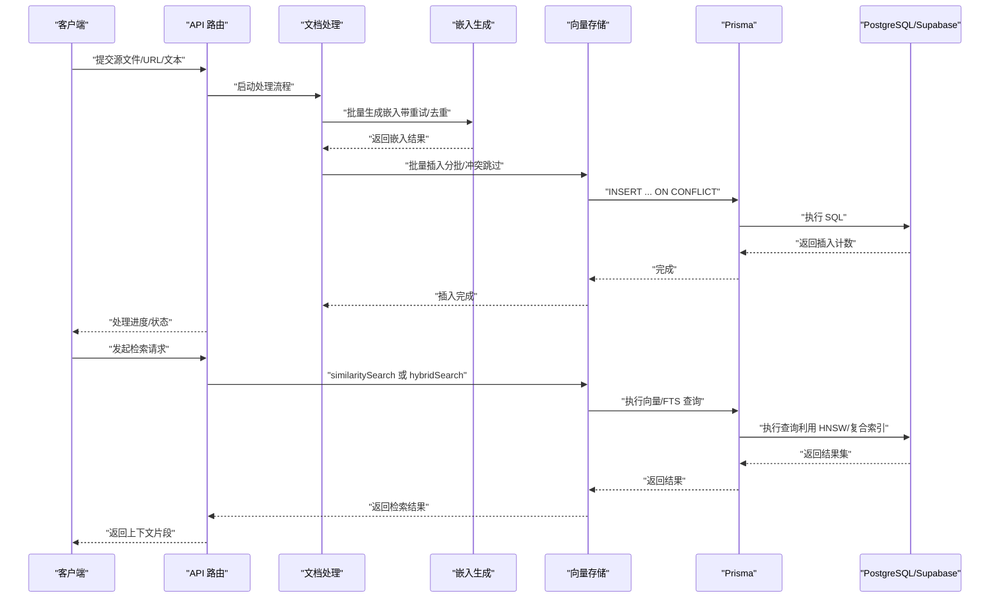
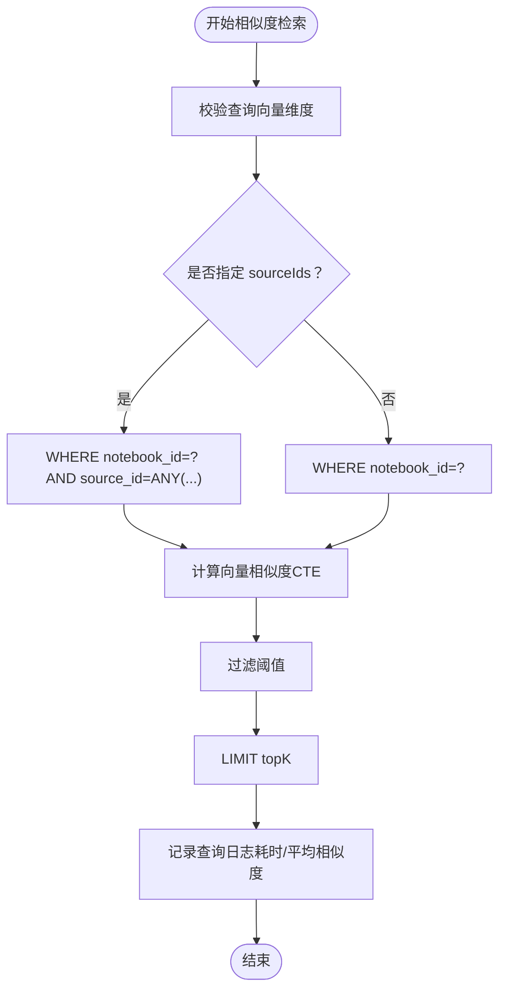
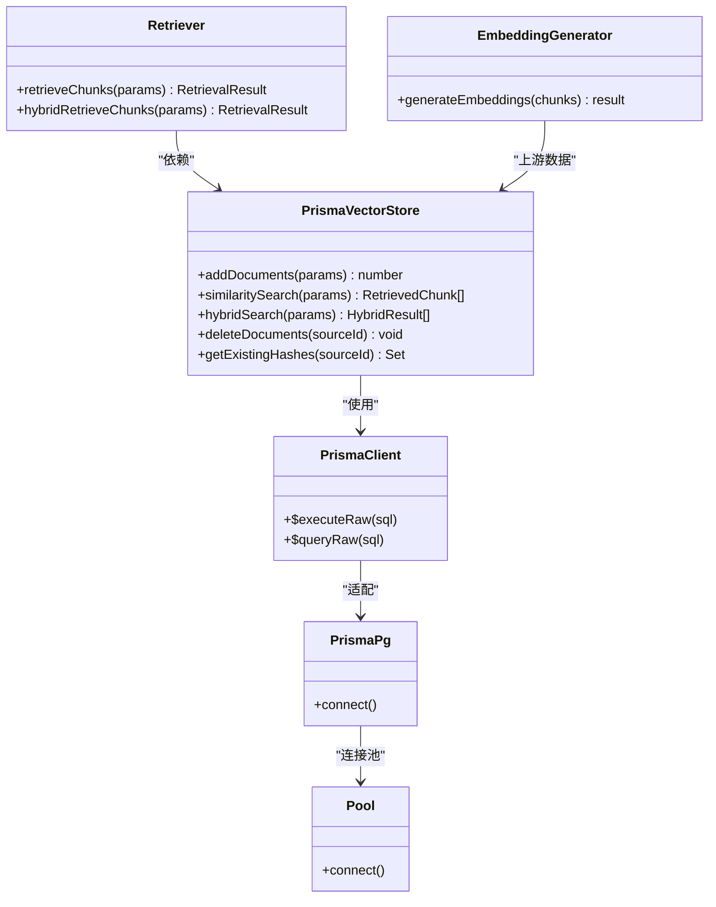

# 性能优化方案

<cite>
**本文引用的文件**
- [lib/db/vector-store.ts](file://lib/db/vector-store.ts)
- [lib/db/prisma.ts](file://lib/db/prisma.ts)
- [lib/db/supabase.ts](file://lib/db/supabase.ts)
- [lib/processing/embedding.ts](file://lib/processing/embedding.ts)
- [lib/rag/retriever.ts](file://lib/rag/retriever.ts)
- [lib/config.ts](file://lib/config.ts)
- [lib/utils/logger.ts](file://lib/utils/logger.ts)
- [prisma/migrations/20260120120200_optimize_hnsw_index/migration.sql](file://prisma/migrations/20260120120200_optimize_hnsw_index/migration.sql)
- [prisma/migrations/20260120120300_add_composite_indexes/migration.sql](file://prisma/migrations/20260120120300_add_composite_indexes/migration.sql)
- [lib/processing/index.ts](file://lib/processing/index.ts)
</cite>

## 目录
1. [简介](#简介)
2. [项目结构](#项目结构)
3. [核心组件](#核心组件)
4. [架构总览](#架构总览)
5. [详细组件分析](#详细组件分析)
6. [依赖关系分析](#依赖关系分析)
7. [性能考量](#性能考量)
8. [故障排除指南](#故障排除指南)
9. [结论](#结论)
10. [附录](#附录)

## 简介
本文件面向 notebookLM-clone 项目的向量存储性能优化，围绕批量插入、查询性能、内存使用、并发访问控制、监控诊断与容量规划展开，结合代码实现与数据库迁移脚本，给出可落地的优化策略与实践建议，并提供性能测试与基准测试方法，帮助在不同规模与负载下稳定获得低延迟、高吞吐的检索体验。

## 项目结构
本项目采用“前端 Next.js + 后端 API + 数据库迁移”的分层组织方式，向量存储相关的关键实现集中在以下模块：
- 向量存储与检索：lib/db/vector-store.ts、lib/rag/retriever.ts
- 数据库连接与适配：lib/db/prisma.ts
- 向量生成与去重：lib/processing/embedding.ts、lib/processing/index.ts
- 配置与环境校验：lib/config.ts
- 日志与可观测性：lib/utils/logger.ts
- 数据库索引优化：prisma/migrations 下的 HNSW 与复合索引迁移

图表来源
- [lib/db/vector-store.ts](file://lib/db/vector-store.ts#L77-L446)
- [lib/db/prisma.ts](file://lib/db/prisma.ts#L1-L41)
- [lib/rag/retriever.ts](file://lib/rag/retriever.ts#L1-L206)
- [lib/processing/embedding.ts](file://lib/processing/embedding.ts#L1-L189)
- [prisma/migrations/20260120120200_optimize_hnsw_index/migration.sql](file://prisma/migrations/20260120120200_optimize_hnsw_index/migration.sql#L1-L16)
- [prisma/migrations/20260120120300_add_composite_indexes/migration.sql](file://prisma/migrations/20260120120300_add_composite_indexes/migration.sql#L1-L19)

章节来源
- [lib/db/vector-store.ts](file://lib/db/vector-store.ts#L1-L446)
- [lib/db/prisma.ts](file://lib/db/prisma.ts#L1-L41)
- [lib/rag/retriever.ts](file://lib/rag/retriever.ts#L1-L206)
- [lib/processing/embedding.ts](file://lib/processing/embedding.ts#L1-L189)
- [lib/config.ts](file://lib/config.ts#L1-L187)
- [lib/utils/logger.ts](file://lib/utils/logger.ts#L1-L98)
- [prisma/migrations/20260120120200_optimize_hnsw_index/migration.sql](file://prisma/migrations/20260120120200_optimize_hnsw_index/migration.sql#L1-L16)
- [prisma/migrations/20260120120300_add_composite_indexes/migration.sql](file://prisma/migrations/20260120120300_add_composite_indexes/migration.sql#L1-L19)

## 核心组件
- 向量存储接口与实现：统一抽象与 Prisma 实现，支持批量插入、相似度检索、混合检索、删除与去重哈希查询。
- 文档处理与嵌入：带重试的批量嵌入生成，支持去重与维度校验。
- RAG 检索器：封装向量检索与全文检索（FTS）融合，支持权重配置与结果映射。
- 数据库连接与适配：基于 PrismaPg 的连接池适配，支持 Serverless 场景下的连接限制与 pgbouncer。
- 配置与校验：向量维度锁定、环境变量验证、模型配置。
- 日志与可观测性：统一向量操作日志记录，包含成功/失败、耗时、元信息等。

章节来源
- [lib/db/vector-store.ts](file://lib/db/vector-store.ts#L24-L75)
- [lib/processing/embedding.ts](file://lib/processing/embedding.ts#L140-L189)
- [lib/rag/retriever.ts](file://lib/rag/retriever.ts#L53-L116)
- [lib/db/prisma.ts](file://lib/db/prisma.ts#L1-L41)
- [lib/config.ts](file://lib/config.ts#L6-L29)
- [lib/utils/logger.ts](file://lib/utils/logger.ts#L11-L27)

## 架构总览
下图展示了从 API 请求到数据库查询的整体链路，以及关键优化点的落位。

图表来源
- [lib/processing/embedding.ts](file://lib/processing/embedding.ts#L140-L189)
- [lib/db/vector-store.ts](file://lib/db/vector-store.ts#L77-L173)
- [lib/rag/retriever.ts](file://lib/rag/retriever.ts#L53-L116)
- [lib/db/prisma.ts](file://lib/db/prisma.ts#L1-L41)

## 详细组件分析

### 向量存储与批量插入优化
- 批量大小配置：每批最多 500 条，减少事务开销与网络往返。
- 事务管理：使用原生 SQL 批量插入，配合 ON CONFLICT (source_id, chunk_index) DO NOTHING，避免重复写入。
- 维度校验：入库前对每个 chunk 的 embedding 维度进行严格校验，防止维度不一致导致的后续查询异常。
- 日志记录：记录插入耗时、成功/跳过数量，便于性能评估与问题定位。

图表来源
- [lib/db/vector-store.ts](file://lib/db/vector-store.ts#L88-L173)

章节来源
- [lib/db/vector-store.ts](file://lib/db/vector-store.ts#L9-L9)
- [lib/db/vector-store.ts](file://lib/db/vector-store.ts#L105-L140)
- [lib/db/vector-store.ts](file://lib/db/vector-store.ts#L142-L156)

### 查询性能优化技术
- 相似度检索：使用 cosine 距离计算相似度，CTE 消除重复计算；支持按 notebook_id 与 source_ids 过滤，结合 HNSW 索引与复合索引。
- 混合检索：向量相似度与全文检索（FTS）加权融合，统一使用 'simple' 分词器支持多语言；通过 LEFT JOIN 聚合分数并排序。
- 索引优化：HNSW 索引参数优化（m=32, ef_construction=128），提升召回率；为 notebook_id 与 created_at 建立单列索引，辅助过滤与时间范围查询。
- 查询计划分析：建议使用 EXPLAIN/EXPLAIN ANALYZE 观察执行计划，确认 HNSW 与复合索引被正确使用；关注是否发生全表扫描或回表。

图表来源
- [lib/db/vector-store.ts](file://lib/db/vector-store.ts#L175-L297)
- [prisma/migrations/20260120120200_optimize_hnsw_index/migration.sql](file://prisma/migrations/20260120120200_optimize_hnsw_index/migration.sql#L1-L16)
- [prisma/migrations/20260120120300_add_composite_indexes/migration.sql](file://prisma/migrations/20260120120300_add_composite_indexes/migration.sql#L1-L19)

章节来源
- [lib/db/vector-store.ts](file://lib/db/vector-store.ts#L175-L297)
- [lib/db/vector-store.ts](file://lib/db/vector-store.ts#L312-L442)
- [prisma/migrations/20260120120200_optimize_hnsw_index/migration.sql](file://prisma/migrations/20260120120200_optimize_hnsw_index/migration.sql#L1-L16)
- [prisma/migrations/20260120120300_add_composite_indexes/migration.sql](file://prisma/migrations/20260120120300_add_composite_indexes/migration.sql#L1-L19)

### 内存使用优化方案
- 向量数据压缩：数据库层面使用 vector(D) 存储，结合 HNSW 索引降低存储与计算成本；确保 EMBEDDING_DIM 与模型一致，避免额外转换。
- 内存池管理：通过 PrismaPg 与 pg 的连接池复用连接，减少频繁建立/销毁连接带来的内存抖动。
- 垃圾回收优化：在 Serverless 环境中限制每个实例的连接数（如 connection_limit=1），避免冷启动与峰值并发导致的 GC 压力。

章节来源
- [lib/config.ts](file://lib/config.ts#L6-L29)
- [lib/db/prisma.ts](file://lib/db/prisma.ts#L18-L39)

### 并发访问控制
- 连接池配置：使用 PrismaPg 适配 PostgreSQL，结合 pgbouncer（通过 DATABASE_URL 参数启用）实现连接池化，适合 Vercel 等 Serverless 场景。
- 锁机制设计：数据库层面通过唯一约束（ON CONFLICT DO NOTHING）避免重复写入；应用层通过幂等的 content_hash 去重进一步降低冲突概率。
- 死锁避免策略：批量写入采用固定顺序（按 source_id/chunk_index），避免交叉依赖；查询尽量使用索引覆盖，减少行级锁持有时间。

章节来源
- [lib/db/vector-store.ts](file://lib/db/vector-store.ts#L135-L135)
- [lib/db/prisma.ts](file://lib/db/prisma.ts#L5-L16)

### 监控与诊断工具
- 性能指标收集：统一记录向量操作日志（operation、duration、success、metadata），便于埋点与趋势分析。
- 慢查询分析：结合数据库 EXPLAIN/EXPLAIN ANALYZE 与应用日志，定位热点查询与索引缺失。
- 瓶颈识别方法：对比嵌入生成耗时与检索耗时，评估是否需要调整 topK、阈值或索引参数。

章节来源
- [lib/utils/logger.ts](file://lib/utils/logger.ts#L75-L94)
- [lib/rag/retriever.ts](file://lib/rag/retriever.ts#L69-L115)

### 容量规划指南
- 存储空间估算：按每条 chunk 的平均大小与总 chunk 数估算；考虑向量列、JSONB 元数据与索引占用。
- 查询吞吐量预测：根据 HNSW 索引参数（m、ef_construction）与硬件配置，结合压测结果推导 QPS；预留 20%-50% 缓冲。
- 硬件资源配置建议：优先提升 CPU/内存与磁盘 IOPS；数据库侧启用合适的共享缓冲与工作内存；应用侧合理设置连接池上限与超时。

（本节为通用指导，不直接分析具体文件）

### 性能测试与基准测试
- 测试方法
  - 批量插入：准备不同规模的数据集（如 1k/10k/100k 条），测量总耗时、每批耗时与吞吐；观察 ON CONFLICT 跳过的比例。
  - 相似度检索：固定 queryEmbedding，变化 topK、阈值与过滤条件（notebook_id/source_ids），记录 P95/P99 延迟与返回命中数。
  - 混合检索：对比仅向量、仅 FTS 与融合权重（vectorWeight/ftsWeight）的差异，评估召回与延迟平衡。
  - 嵌入生成：测试不同批大小与重试策略对整体吞吐的影响。
- 基准测试结果（示例格式）
  - 批量插入：100k 条，分批大小 500，总耗时 X ms，吞吐 Y 条/秒，跳过 Z%。
  - 相似度检索：topK=8，阈值 0.3，P95 延迟 A ms，命中 B 条。
  - 混合检索：vectorWeight=0.7，ftsWeight=0.3，P95 延迟 C ms，命中 D 条，召回率 E%。
  - 嵌入生成：批大小 64，重试 3 次，总耗时 F ms，tokens/GPU 使用 G。

（本节为方法论与示例，不直接分析具体文件）

## 依赖关系分析

图表来源
- [lib/db/vector-store.ts](file://lib/db/vector-store.ts#L77-L446)
- [lib/db/prisma.ts](file://lib/db/prisma.ts#L1-L41)
- [lib/processing/embedding.ts](file://lib/processing/embedding.ts#L140-L189)
- [lib/rag/retriever.ts](file://lib/rag/retriever.ts#L53-L206)

章节来源
- [lib/db/vector-store.ts](file://lib/db/vector-store.ts#L77-L446)
- [lib/db/prisma.ts](file://lib/db/prisma.ts#L1-L41)
- [lib/processing/embedding.ts](file://lib/processing/embedding.ts#L140-L189)
- [lib/rag/retriever.ts](file://lib/rag/retriever.ts#L53-L206)

## 性能考量
- 批量插入
  - 选择合适的批大小：在延迟与吞吐之间权衡；过大可能导致单次事务过长，过小增加事务开销。
  - 控制重复写入：通过 content_hash 去重与 ON CONFLICT 跳过，减少无效写入。
- 查询性能
  - 索引参数：HNSW 的 m 与 ef_construction 影响召回与延迟，需结合业务目标调优。
  - 复合过滤：notebook_id 单列索引与 HNSW 组合使用，避免全表扫描。
  - 查询阈值与 topK：合理设置阈值与 topK，减少结果集大小与排序成本。
- 内存与连接
  - 连接池：在 Serverless 环境中限制连接数，避免瞬时并发过高。
  - 向量维度：严格锁定维度，避免运行时转换与额外内存占用。
- 可观测性
  - 统一日志：记录操作类型、耗时、成功与否与关键元信息，支撑问题定位与容量规划。

（本节为通用指导，不直接分析具体文件）

## 故障排除指南
- 维度不一致
  - 现象：插入/查询时报错提示维度不符。
  - 处理：核对 EMBEDDING_DIM 与模型配置，确保与数据库 vector(D) 一致；必要时重建表结构。
- 插入失败
  - 现象：部分批次插入失败或耗时异常。
  - 处理：检查网络/数据库连接、重试策略与日志；确认批大小与事务边界。
- 查询缓慢
  - 现象：相似度检索/混合检索延迟升高。
  - 处理：确认 HNSW 与复合索引是否生效；调整 topK、阈值；分析执行计划。
- 权限与归属
  - 现象：API 抛出未登录或无权访问。
  - 处理：确保调用方具备资源所有权，使用 verifyOwnership 校验。

章节来源
- [lib/config.ts](file://lib/config.ts#L17-L29)
- [lib/db/vector-store.ts](file://lib/db/vector-store.ts#L92-L99)
- [lib/db/vector-store.ts](file://lib/db/vector-store.ts#L198-L202)
- [lib/db/supabase.ts](file://lib/db/supabase.ts#L22-L33)

## 结论
通过严格的维度校验、合理的批大小与事务策略、HNSW 与复合索引优化、连接池与去重机制，以及完善的日志与监控体系，notebookLM-clone 的向量存储可在不同规模与负载下保持稳定的低延迟与高吞吐。建议持续压测与回归分析，结合业务特征动态调整参数，确保系统长期稳健运行。

## 附录
- 关键配置项
  - EMBEDDING_DIM：向量维度（必须与模型一致）
  - DATABASE_URL：支持 pgbouncer 的连接字符串
  - 环境变量：NEXT_PUBLIC_SUPABASE_URL、NEXT_PUBLIC_SUPABASE_ANON_KEY、DATABASE_URL、ZHIPU_API_KEY、EMBEDDING_DIM
- 建议的索引参数
  - HNSW：m=32, ef_construction=128
  - 复合过滤：notebook_id 单列索引
  - 时间范围：created_at 降序索引

章节来源
- [lib/config.ts](file://lib/config.ts#L6-L29)
- [lib/db/prisma.ts](file://lib/db/prisma.ts#L5-L16)
- [prisma/migrations/20260120120200_optimize_hnsw_index/migration.sql](file://prisma/migrations/20260120120200_optimize_hnsw_index/migration.sql#L8-L12)
- [prisma/migrations/20260120120300_add_composite_indexes/migration.sql](file://prisma/migrations/20260120120300_add_composite_indexes/migration.sql#L6-L15)