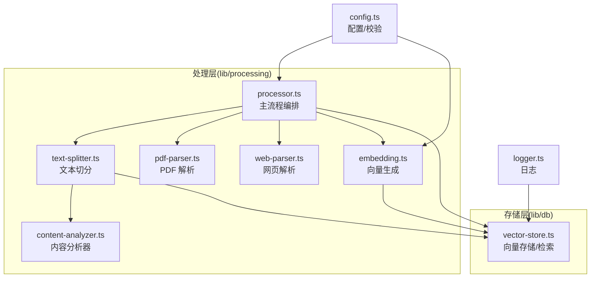
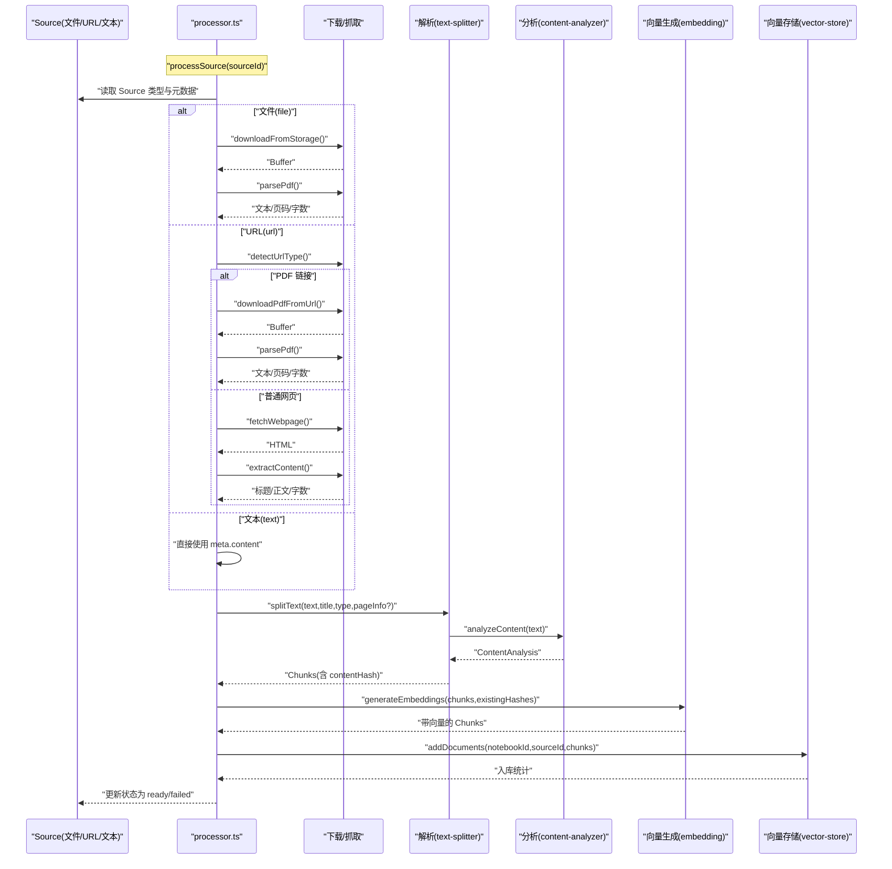
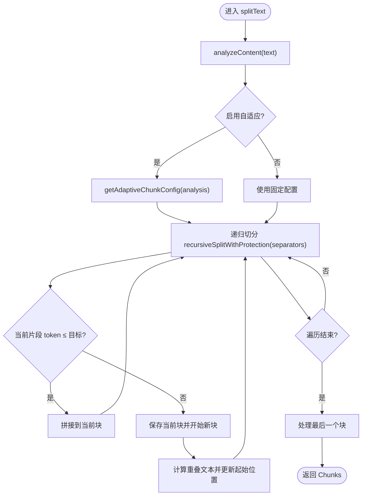
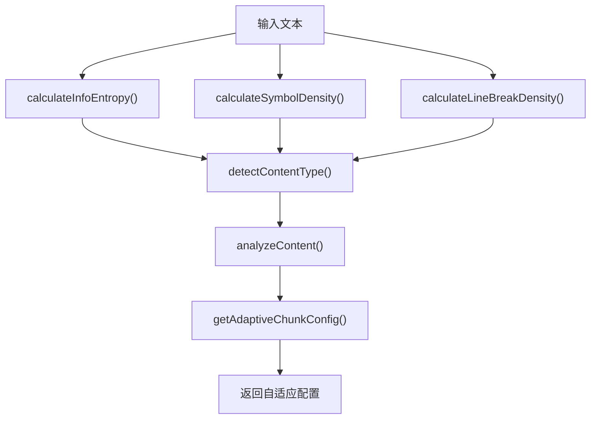
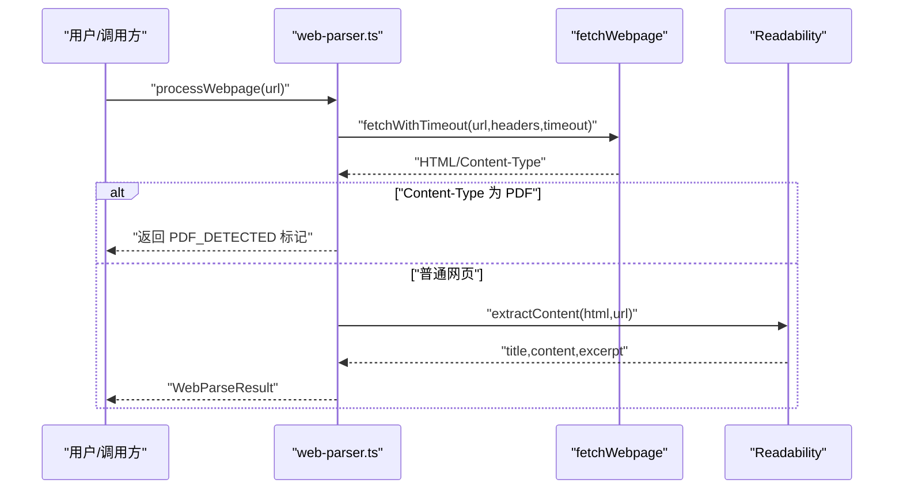
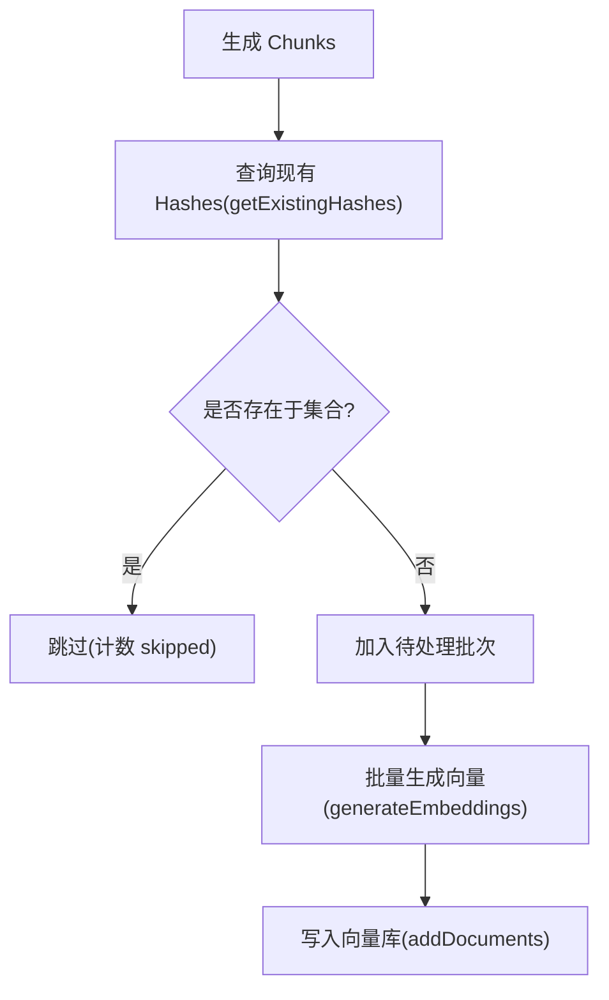
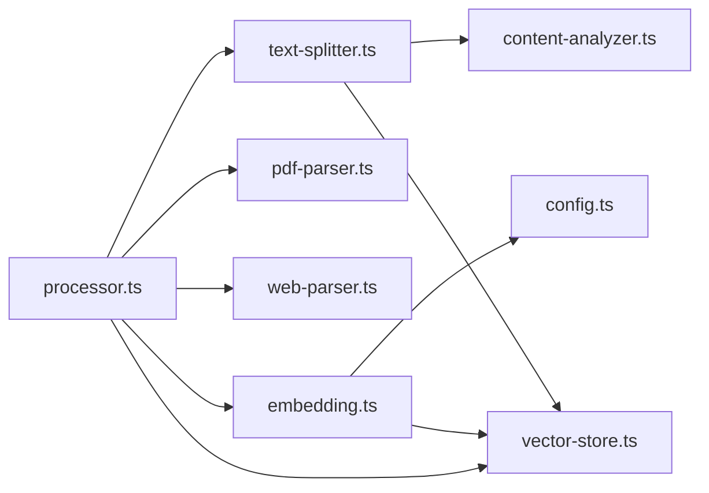

# 文本处理流水线

<cite>
**本文引用的文件**
- [lib/processing/text-splitter.ts](file://lib/processing/text-splitter.ts)
- [lib/processing/content-analyzer.ts](file://lib/processing/content-analyzer.ts)
- [lib/processing/pdf-parser.ts](file://lib/processing/pdf-parser.ts)
- [lib/processing/web-parser.ts](file://lib/processing/web-parser.ts)
- [lib/processing/processor.ts](file://lib/processing/processor.ts)
- [lib/processing/embedding.ts](file://lib/processing/embedding.ts)
- [lib/db/vector-store.ts](file://lib/db/vector-store.ts)
- [lib/config.ts](file://lib/config.ts)
- [lib/utils/logger.ts](file://lib/utils/logger.ts)
- [lib/processing/index.ts](file://lib/processing/index.ts)
- [scripts/test-adaptive-splitting.ts](file://scripts/test-adaptive-splitting.ts)
</cite>

## 更新摘要
**变更内容**
- 新增内容分析器模块，提供智能内容特征分析与自适应切分策略
- 增强文本切分器，集成递归分块算法与特殊内容保护机制
- 实现智能边界检测，支持高密度、中密度、低密度内容的差异化处理
- 新增详细的元数据追踪，包括内容类型、密度分析、切分策略等
- 提供完整的测试示例，展示自适应切分功能的实际效果

## 目录
1. [简介](#简介)
2. [项目结构](#项目结构)
3. [核心组件](#核心组件)
4. [架构总览](#架构总览)
5. [详细组件分析](#详细组件分析)
6. [依赖关系分析](#依赖关系分析)
7. [性能考量](#性能考量)
8. [故障排查指南](#故障排查指南)
9. [结论](#结论)
10. [附录](#附录)

## 简介
本文件面向 notebookLM-clone 项目的"文本处理流水线"，系统性阐述从原始文档到向量嵌入的完整处理链路，重点覆盖以下方面：
- 文本切分算法：句子边界检测、段落分割与块大小优化策略
- 文本预处理流程：编码转换、特殊字符处理、空白字符清理与格式标准化
- 多格式文档解析：PDF 解析、网页抓取与正文提取的技术细节
- 文本去重机制：哈希计算、相似度比较与重复内容过滤策略
- 批量处理优化：内存管理、并发控制与错误恢复机制
- 文本质量评估：长度检查、内容完整性验证与异常处理策略
- 完整处理流程示例：从原始文档到向量嵌入的端到端序列图与关键边界场景说明

## 项目结构
本项目采用"功能域"组织方式，文本处理相关逻辑集中在 lib/processing 与 lib/db 两个目录：
- lib/processing：负责文本切分、PDF/网页解析、向量生成与主流程编排
- lib/db：负责向量存储、检索与去重
- lib/config：全局配置与启动时一致性校验
- lib/utils：统一日志工具

**图表来源**
- [lib/processing/processor.ts](file://lib/processing/processor.ts#L1-L560)
- [lib/processing/text-splitter.ts](file://lib/processing/text-splitter.ts#L1-L432)
- [lib/processing/content-analyzer.ts](file://lib/processing/content-analyzer.ts#L1-L476)
- [lib/processing/pdf-parser.ts](file://lib/processing/pdf-parser.ts#L1-L150)
- [lib/processing/web-parser.ts](file://lib/processing/web-parser.ts#L1-L228)
- [lib/processing/embedding.ts](file://lib/processing/embedding.ts#L1-L189)
- [lib/db/vector-store.ts](file://lib/db/vector-store.ts#L1-L446)
- [lib/config.ts](file://lib/config.ts#L1-L187)
- [lib/utils/logger.ts](file://lib/utils/logger.ts#L1-L98)

**章节来源**
- [lib/processing/index.ts](file://lib/processing/index.ts#L1-L51)

## 核心组件
- 文本切分器：基于递归字符策略，优先自然边界（标题、段落、句子、空格），结合重叠窗口与 token 估算，确保上下文连续性与块大小目标
- 内容分析器：智能分析文本内容特征，包括信息熵、符号密度、换行密度等指标，自动识别高密度、中密度、低密度内容
- PDF 解析器：从 Supabase Storage 下载 PDF，使用 pdf-parse 提取文本与页码信息，并进行扫描件检测与错误分类
- 网页解析器：带超时控制的 fetch，使用 @mozilla/readability 提取正文，支持 PDF 链接识别与下载
- 主流程编排：根据 Source 类型（file/url/text）驱动下载/抓取/解析/切分/向量/入库，记录阶段日志与状态
- 向量生成：批量调用智谱 Embedding API，指数退避重试，按批大小与 token 上限控制请求规模
- 向量存储：批量写入 document_chunks，按 source_id + chunk_index 去重；提供相似度检索与混合检索
- 配置与日志：统一环境变量校验与日志输出，保障运行一致性与可观测性

**章节来源**
- [lib/processing/text-splitter.ts](file://lib/processing/text-splitter.ts#L1-L432)
- [lib/processing/content-analyzer.ts](file://lib/processing/content-analyzer.ts#L1-L476)
- [lib/processing/pdf-parser.ts](file://lib/processing/pdf-parser.ts#L1-L150)
- [lib/processing/web-parser.ts](file://lib/processing/web-parser.ts#L1-L228)
- [lib/processing/processor.ts](file://lib/processing/processor.ts#L1-L560)
- [lib/processing/embedding.ts](file://lib/processing/embedding.ts#L1-L189)
- [lib/db/vector-store.ts](file://lib/db/vector-store.ts#L1-L446)
- [lib/config.ts](file://lib/config.ts#L1-L187)
- [lib/utils/logger.ts](file://lib/utils/logger.ts#L1-L98)

## 架构总览
下图展示了从"原始文档/URL/文本"到"向量嵌入"的端到端处理流程，涵盖 PDF 与网页两类知识源的差异路径。

**图表来源**
- [lib/processing/processor.ts](file://lib/processing/processor.ts#L82-L397)
- [lib/processing/pdf-parser.ts](file://lib/processing/pdf-parser.ts#L133-L150)
- [lib/processing/web-parser.ts](file://lib/processing/web-parser.ts#L174-L190)
- [lib/processing/text-splitter.ts](file://lib/processing/text-splitter.ts#L97-L152)
- [lib/processing/content-analyzer.ts](file://lib/processing/content-analyzer.ts#L196-L241)
- [lib/processing/embedding.ts](file://lib/processing/embedding.ts#L140-L188)
- [lib/db/vector-store.ts](file://lib/db/vector-store.ts#L77-L173)

## 详细组件分析

### 文本切分算法与策略
- 递归切分思路：按优先级分隔符（Markdown 标题、段落、换行、中文/英文句号、空格、字符）逐层切分，优先保留自然边界
- token 估算：按中文≈1.5字符/token、其他≈4字符/token 的混合权重估算，便于控制块大小
- 重叠窗口：每次切分后保留尾部重叠，避免关键信息被截断，重叠长度按 chunkOverlap*2 估算
- 元数据：记录起止字符位置、token 数、来源标题/类型、页码（PDF）等，便于溯源与检索

**更新** 新增内容分析器集成，实现智能自适应切分策略

**图表来源**
- [lib/processing/text-splitter.ts](file://lib/processing/text-splitter.ts#L97-L152)
- [lib/processing/text-splitter.ts](file://lib/processing/text-splitter.ts#L158-L194)
- [lib/processing/text-splitter.ts](file://lib/processing/text-splitter.ts#L228-L263)

**章节来源**
- [lib/processing/text-splitter.ts](file://lib/processing/text-splitter.ts#L14-L31)
- [lib/processing/text-splitter.ts](file://lib/processing/text-splitter.ts#L38-L49)
- [lib/processing/text-splitter.ts](file://lib/processing/text-splitter.ts#L215-L223)

### 内容分析器与智能切分
- 内容密度分析：通过信息熵、符号密度、换行密度等指标自动识别内容类型
- 自适应配置：根据内容密度动态调整 chunk 大小和重叠比例
- 特殊内容保护：识别代码块、表格、列表等特殊内容区域，避免破坏其结构完整性
- 智能边界检测：根据不同内容类型选择最优的切分策略

**新增功能** 内容分析器提供完整的智能切分解决方案

**图表来源**
- [lib/processing/content-analyzer.ts](file://lib/processing/content-analyzer.ts#L49-L68)
- [lib/processing/content-analyzer.ts](file://lib/processing/content-analyzer.ts#L74-L82)
- [lib/processing/content-analyzer.ts](file://lib/processing/content-analyzer.ts#L88-L94)
- [lib/processing/content-analyzer.ts](file://lib/processing/content-analyzer.ts#L99-L118)
- [lib/processing/content-analyzer.ts](file://lib/processing/content-analyzer.ts#L196-L241)
- [lib/processing/content-analyzer.ts](file://lib/processing/content-analyzer.ts#L246-L283)

**章节来源**
- [lib/processing/content-analyzer.ts](file://lib/processing/content-analyzer.ts#L1-L476)

### 文本预处理与格式标准化
- PDF 文本：由 pdf-parse 提取 raw 文本，后续在网页解析器中进行空白压缩与段落规范化
- 网页正文：使用 Readability 提取正文后，统一替换多余空白为单个空格，合并连续空行为双换行，去除首尾空白
- 编码与字符集：统一以 UTF-8 文本形式处理，避免跨编码问题

**章节来源**
- [lib/processing/pdf-parser.ts](file://lib/processing/pdf-parser.ts#L64-L84)
- [lib/processing/web-parser.ts](file://lib/processing/web-parser.ts#L146-L159)

### 多格式文档解析实现
- PDF 解析
  - 从 Supabase Storage 下载文件，解析为文本与页码
  - 估算每页起始字符位置，构建 pageInfo 用于块元数据
  - 错误分类：加密、损坏、其他异常，分别返回不同错误信息
  - 扫描件检测：平均每页字符数过低（阈值）视为扫描件，提示暂不支持 OCR
- 网页抓取与正文提取
  - 带超时控制的 fetch，设置 UA 与 Accept 头，支持 302/301 重定向
  - 通过 Content-Type 判定 PDF 链接，走 PDF 流程
  - 使用 Readability 提取正文，若失败返回可读错误信息
  - 对 HTML 进行清洗，得到可检索的纯文本

**图表来源**
- [lib/processing/web-parser.ts](file://lib/processing/web-parser.ts#L174-L190)
- [lib/processing/web-parser.ts](file://lib/processing/web-parser.ts#L82-L126)
- [lib/processing/web-parser.ts](file://lib/processing/web-parser.ts#L131-L169)

**章节来源**
- [lib/processing/pdf-parser.ts](file://lib/processing/pdf-parser.ts#L57-L117)
- [lib/processing/pdf-parser.ts](file://lib/processing/pdf-parser.ts#L133-L149)
- [lib/processing/web-parser.ts](file://lib/processing/web-parser.ts#L12-L19)
- [lib/processing/web-parser.ts](file://lib/processing/web-parser.ts#L35-L53)
- [lib/processing/web-parser.ts](file://lib/processing/web-parser.ts#L174-L190)

### 文本去重机制
- 哈希计算：对每个切分后的文本计算 MD5，作为内容指纹
- 去重策略：
  - Source 内去重：入库前查询该 Source 已存在的 contentHash 集合，过滤重复
  - 全局去重：当前实现聚焦 Source 内去重；如需全局去重，可在入库前扩展为跨 Source 查询
- 重复内容过滤：通过 contentHash 集合快速判定，避免重复向量化与入库

**图表来源**
- [lib/processing/embedding.ts](file://lib/processing/embedding.ts#L152-L161)
- [lib/db/vector-store.ts](file://lib/db/vector-store.ts#L305-L310)

**章节来源**
- [lib/processing/text-splitter.ts](file://lib/processing/text-splitter.ts#L54-L56)
- [lib/processing/embedding.ts](file://lib/processing/embedding.ts#L152-L161)
- [lib/db/vector-store.ts](file://lib/db/vector-store.ts#L305-L310)

### 批量处理优化
- 批量大小与令牌上限：每批最多 64 条，单条最大约 3072 tokens，避免 API 限制与内存峰值
- 指数退避重试：最大重试 3 次，初始延迟 1 秒，上限 30 秒，针对 429/500/502/503/504 等错误码
- 写入优化：向量库按 500 条一批进行批量插入，使用 ON CONFLICT (source_id, chunk_index) DO NOTHING 去重
- 维度校验：严格校验向量维度与配置一致，防止运行期不一致导致的检索/存储异常

**章节来源**
- [lib/processing/embedding.ts](file://lib/processing/embedding.ts#L23-L26)
- [lib/processing/embedding.ts](file://lib/processing/embedding.ts#L115-L134)
- [lib/db/vector-store.ts](file://lib/db/vector-store.ts#L9-L10)
- [lib/db/vector-store.ts](file://lib/db/vector-store.ts#L105-L140)
- [lib/config.ts](file://lib/config.ts#L7-L29)

### 文本质量评估与异常处理
- 长度检查：切分后统计平均 token 数，便于评估块大小合理性
- 内容完整性：网页解析失败返回明确错误；PDF 解析失败区分"加密/损坏/其他"
- 异常处理：主流程按阶段记录日志与耗时，失败时更新状态并保留错误信息
- 日志可观测：统一日志工具输出向量操作的插入/查询/混合检索结果，包含成功/失败、耗时与关键指标

**章节来源**
- [lib/processing/processor.ts](file://lib/processing/processor.ts#L138-L148)
- [lib/processing/pdf-parser.ts](file://lib/processing/pdf-parser.ts#L88-L116)
- [lib/processing/web-parser.ts](file://lib/processing/web-parser.ts#L93-L104)
- [lib/utils/logger.ts](file://lib/utils/logger.ts#L75-L94)

## 依赖关系分析
- 组件耦合
  - processor.ts 依赖 text-splitter.ts、pdf-parser.ts、web-parser.ts、embedding.ts、vector-store.ts
  - text-splitter.ts 依赖 content-analyzer.ts 提供智能分析能力
  - embedding.ts 依赖 config.ts 中的模型与维度配置
  - vector-store.ts 依赖 config.ts 的 EMBEDDING_DIM 与 Prisma 数据库
- 关键依赖链
  - PDF：storage → pdf-parse → text-splitter → embedding → vector-store
  - URL：fetch → web-parser → text-splitter → embedding → vector-store
  - Text：text-splitter → embedding → vector-store
- 循环依赖：未发现循环依赖，模块职责清晰

**图表来源**
- [lib/processing/processor.ts](file://lib/processing/processor.ts#L10-L18)
- [lib/processing/embedding.ts](file://lib/processing/embedding.ts#L6-L7)
- [lib/db/vector-store.ts](file://lib/db/vector-store.ts#L1-L4)

**章节来源**
- [lib/processing/index.ts](file://lib/processing/index.ts#L1-L51)

## 性能考量
- 切分效率：优先自然边界减少二次切分次数；token 估算避免频繁 API 调用
- 批量吞吐：embedding 批大小与令牌上限平衡吞吐与稳定性；向量库批量插入降低数据库往返
- 内存占用：按批处理与重叠窗口控制内存峰值；超时控制避免长时间阻塞
- 稳定性：指数退避与错误分类提升整体成功率；维度校验与日志记录便于定位问题
- 智能优化：内容分析器自动识别高密度内容，采用更精细的切分策略，提高检索精度

## 故障排查指南
- PDF 解析失败
  - 加密/密码保护：返回"文件已加密，无法解析"
  - 文件损坏：返回"文件损坏，无法读取"
  - 其他异常：返回"PDF 解析失败: …"
- 网页抓取失败
  - 登录/权限：返回"需要登录才能访问"
  - 禁止访问：返回"网站拒绝访问"
  - 页面不存在：返回"页面不存在"
  - 超时：返回"请求超时"
- 向量生成失败
  - API 返回非 2xx：抛出包含状态码与响应体的错误
  - 维度不匹配：抛出维度错误，需检查 EMBEDDING_DIM 配置
- 存储失败
  - 插入异常：记录失败日志，包含错误信息与耗时
  - 维度校验失败：在入库前严格校验维度
- 内容分析失败
  - 文本为空：返回默认分析结果
  - 分析异常：降级为固定切分策略，不影响整体流程

**章节来源**
- [lib/processing/pdf-parser.ts](file://lib/processing/pdf-parser.ts#L88-L116)
- [lib/processing/web-parser.ts](file://lib/processing/web-parser.ts#L93-L125)
- [lib/processing/embedding.ts](file://lib/processing/embedding.ts#L90-L110)
- [lib/db/vector-store.ts](file://lib/db/vector-store.ts#L92-L99)
- [lib/utils/logger.ts](file://lib/utils/logger.ts#L159-L172)

## 结论
本文本处理流水线以"可维护、可扩展、可观测"为目标，围绕递归切分、多格式解析、批量向量化与向量存储构建了稳健的处理链路。通过 token 估算、重叠窗口与去重策略，兼顾检索质量与吞吐性能；通过指数退避与超时控制，提升稳定性与用户体验。新增的内容分析器进一步增强了系统的智能化水平，能够根据内容特征自动调整切分策略，显著提升了不同内容类型的处理效果。建议在后续迭代中引入全局去重、更细粒度的错误恢复与重试策略，以及对视频等非文本资源的统一入口与提示。

## 附录
- 从原始文档到向量嵌入的完整处理流程示例（路径参考）
  - PDF：[processPdfSource](file://lib/processing/processor.ts#L82-L209)
  - URL：[processUrlSource](file://lib/processing/processor.ts#L215-L397)
  - 文本：[processTextSource](file://lib/processing/processor.ts#L426-L526)
  - 切分：[splitText](file://lib/processing/text-splitter.ts#L97-L152)
  - 内容分析：[analyzeContent](file://lib/processing/content-analyzer.ts#L196-L241)
  - 向量：[generateEmbeddings](file://lib/processing/embedding.ts#L140-L188)
  - 存储：[addDocuments](file://lib/db/vector-store.ts#L77-L173)
- 自适应切分测试示例
  - [test-adaptive-splitting.ts](file://scripts/test-adaptive-splitting.ts#L1-L113)