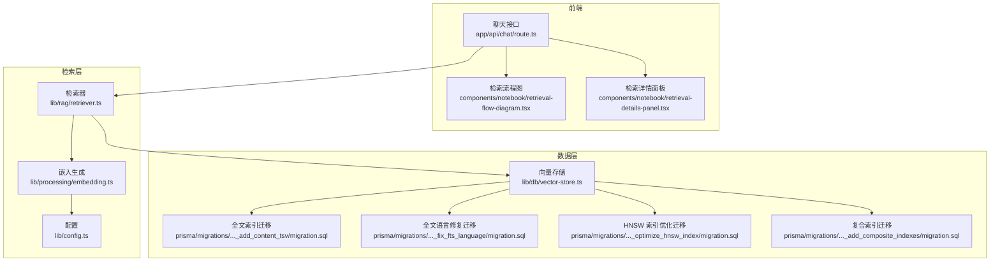
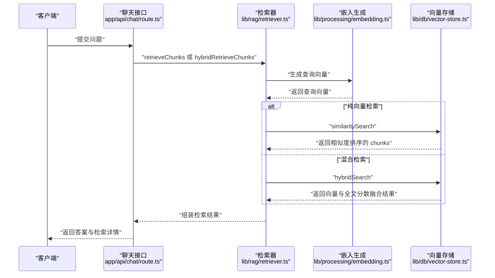
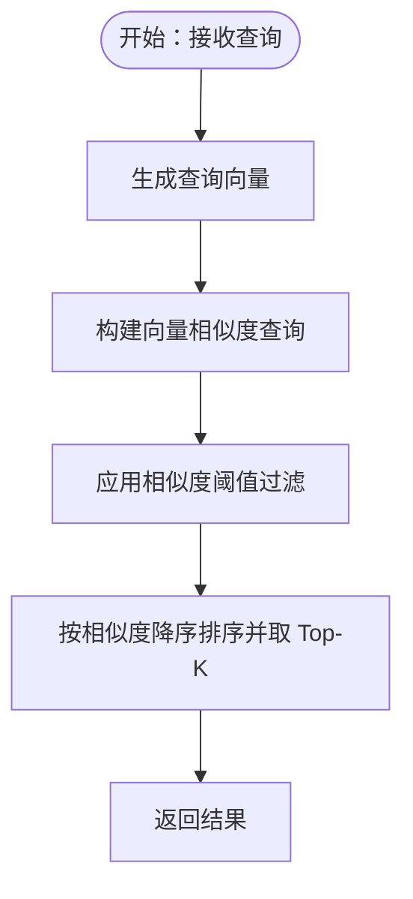
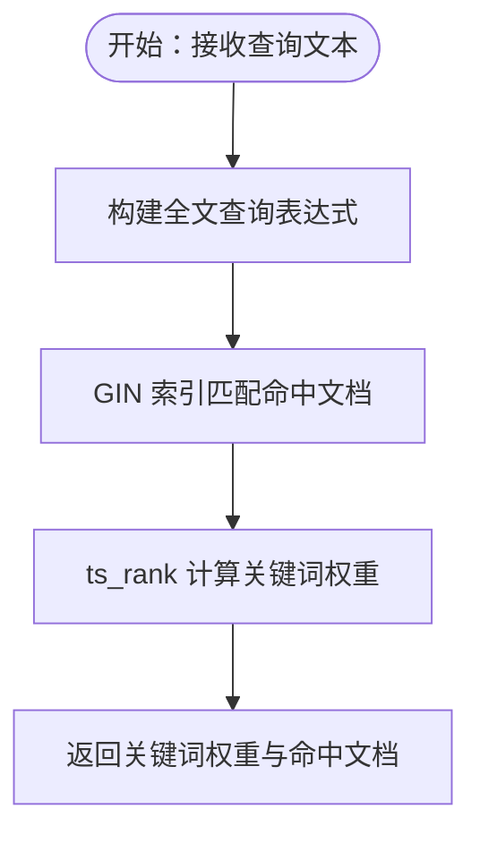
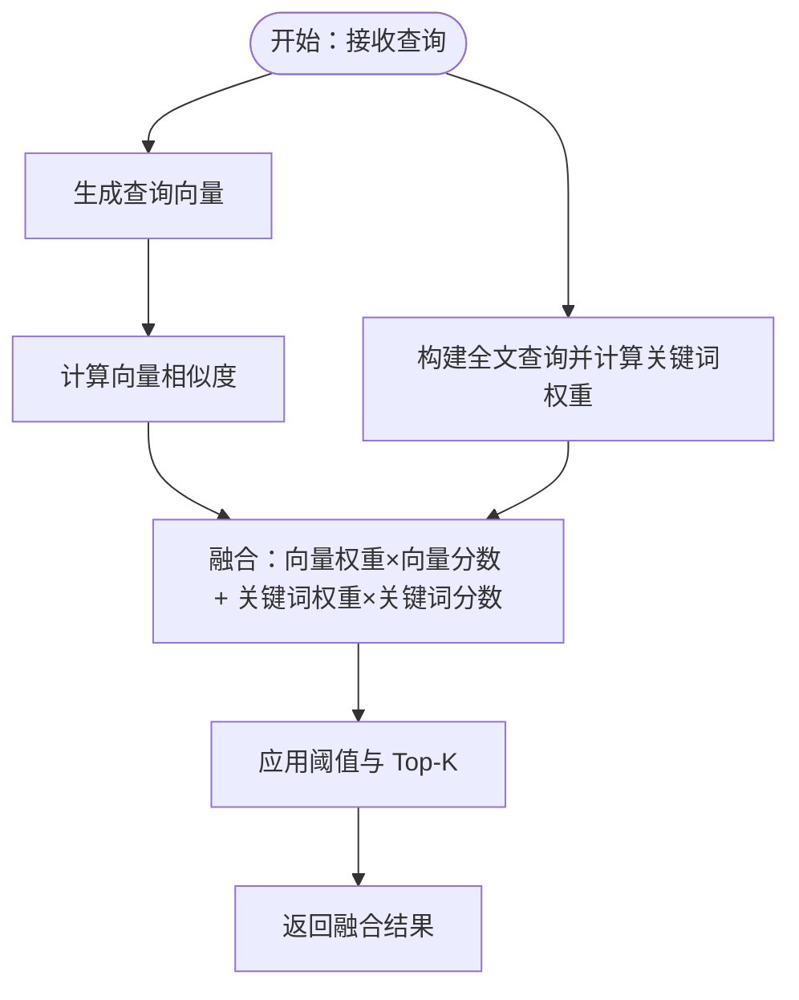
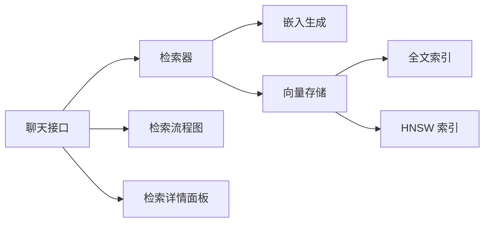

# 检索策略设计

<cite>
**本文档引用的文件**
- [lib/db/vector-store.ts](file://lib/db/vector-store.ts)
- [lib/rag/retriever.ts](file://lib/rag/retriever.ts)
- [lib/processing/embedding.ts](file://lib/processing/embedding.ts)
- [lib/config.ts](file://lib/config.ts)
- [prisma/migrations/20260120050505_add_content_tsv/migration.sql](file://prisma/migrations/20260120050505_add_content_tsv/migration.sql)
- [prisma/migrations/20260120120100_fix_fts_language/migration.sql](file://prisma/migrations/20260120120100_fix_fts_language/migration.sql)
- [prisma/migrations/20260120120200_optimize_hnsw_index/migration.sql](file://prisma/migrations/20260120120200_optimize_hnsw_index/migration.sql)
- [prisma/migrations/20260120120300_add_composite_indexes/migration.sql](file://prisma/migrations/20260120120300_add_composite_indexes/migration.sql)
- [app/api/chat/route.ts](file://app/api/chat/route.ts)
- [components/notebook/retrieval-flow-diagram.tsx](file://components/notebook/retrieval-flow-diagram.tsx)
- [components/notebook/retrieval-details-panel.tsx](file://components/notebook/retrieval-details-panel.tsx)
</cite>

## 目录
1. [简介](#简介)
2. [项目结构](#项目结构)
3. [核心组件](#核心组件)
4. [架构总览](#架构总览)
5. [详细组件分析](#详细组件分析)
6. [依赖关系分析](#依赖关系分析)
7. [性能考量](#性能考量)
8. [故障排查指南](#故障排查指南)
9. [结论](#结论)
10. [附录](#附录)

## 简介
本文件面向 notebookLM-clone 项目的检索策略设计，系统化阐述三种核心检索策略的实现原理与适用场景：纯向量检索、关键词检索（全文搜索）与混合检索。文档覆盖向量相似度计算、阈值设置、结果排序、全文索引构建与分词器配置、权重融合算法与动态调整机制，并提供检索参数调优方法与不同场景下的策略选择指南。同时，通过流程图与代码示例路径帮助读者快速定位实现细节。

## 项目结构
项目采用前后端分离与模块化组织，检索相关的关键位置如下：
- 数据层：向量存储与全文索引由数据库迁移脚本定义，查询逻辑集中在向量存储类中
- 检索层：检索器负责调用嵌入模型、执行检索、去重与结果组装
- 处理层：嵌入生成模块负责批量生成向量、指数退避重试与去重优化
- 配置层：统一管理向量维度、模型与检索参数
- 前端展示：检索流程图与详情面板用于可视化展示检索过程与参数

图表来源
- [app/api/chat/route.ts](file://app/api/chat/route.ts#L98-L126)
- [lib/rag/retriever.ts](file://lib/rag/retriever.ts#L53-L116)
- [lib/processing/embedding.ts](file://lib/processing/embedding.ts#L140-L189)
- [lib/db/vector-store.ts](file://lib/db/vector-store.ts#L37-L75)
- [prisma/migrations/20260120050505_add_content_tsv/migration.sql](file://prisma/migrations/20260120050505_add_content_tsv/migration.sql#L1-L5)
- [prisma/migrations/20260120120100_fix_fts_language/migration.sql](file://prisma/migrations/20260120120100_fix_fts_language/migration.sql#L1-L18)
- [prisma/migrations/20260120120200_optimize_hnsw_index/migration.sql](file://prisma/migrations/20260120120200_optimize_hnsw_index/migration.sql#L1-L15)
- [prisma/migrations/20260120120300_add_composite_indexes/migration.sql](file://prisma/migrations/20260120120300_add_composite_indexes/migration.sql#L1-L19)

章节来源
- [lib/db/vector-store.ts](file://lib/db/vector-store.ts#L1-L446)
- [lib/rag/retriever.ts](file://lib/rag/retriever.ts#L1-L206)
- [lib/processing/embedding.ts](file://lib/processing/embedding.ts#L1-L189)
- [lib/config.ts](file://lib/config.ts#L1-L187)

## 核心组件
- 向量存储接口与实现：提供向量插入、纯向量检索、混合检索与删除等能力，内置维度校验、批量插入与日志记录
- 检索器：封装检索流程，支持纯向量检索与混合检索，负责嵌入生成、去重与结果组装
- 嵌入生成：批量生成向量，支持指数退避重试、去重与令牌估算
- 配置：统一管理向量维度、模型与检索参数，确保系统一致性

章节来源
- [lib/db/vector-store.ts](file://lib/db/vector-store.ts#L24-L75)
- [lib/rag/retriever.ts](file://lib/rag/retriever.ts#L53-L206)
- [lib/processing/embedding.ts](file://lib/processing/embedding.ts#L140-L189)
- [lib/config.ts](file://lib/config.ts#L6-L29)

## 架构总览
下图展示了从用户提问到检索结果返回的完整流程，涵盖向量化、向量检索与混合检索两条主干路径，以及前端展示环节。

图表来源
- [app/api/chat/route.ts](file://app/api/chat/route.ts#L98-L126)
- [lib/rag/retriever.ts](file://lib/rag/retriever.ts#L53-L206)
- [lib/processing/embedding.ts](file://lib/processing/embedding.ts#L140-L189)
- [lib/db/vector-store.ts](file://lib/db/vector-store.ts#L175-L297)

## 详细组件分析

### 纯向量检索
纯向量检索通过余弦距离计算相似度，使用数据库的向量索引进行高效近邻搜索，并支持阈值过滤与 Top-K 排序。

- 相似度计算
  - 使用向量运算符计算查询向量与文档向量的余弦距离，再转换为相似度
  - SQL 中通过向量比较操作符实现，避免在应用层进行昂贵的相似度计算
- 阈值设置
  - 提供相似度阈值参数，低于阈值的结果被过滤，减少噪声
- 结果排序
  - 按相似度降序排序，限制返回数量为 Top-K
- 性能优化
  - HNSW 索引优化：提升召回率与查询性能
  - 复合索引：加速按笔记本过滤的查询
  - 批量插入：降低写入开销

图表来源
- [lib/db/vector-store.ts](file://lib/db/vector-store.ts#L175-L297)
- [lib/rag/retriever.ts](file://lib/rag/retriever.ts#L53-L116)
- [prisma/migrations/20260120120200_optimize_hnsw_index/migration.sql](file://prisma/migrations/20260120120200_optimize_hnsw_index/migration.sql#L1-L15)
- [prisma/migrations/20260120120300_add_composite_indexes/migration.sql](file://prisma/migrations/20260120120300_add_composite_indexes/migration.sql#L1-L19)

章节来源
- [lib/db/vector-store.ts](file://lib/db/vector-store.ts#L175-L297)
- [lib/rag/retriever.ts](file://lib/rag/retriever.ts#L53-L116)
- [prisma/migrations/20260120120200_optimize_hnsw_index/migration.sql](file://prisma/migrations/20260120120200_optimize_hnsw_index/migration.sql#L1-L15)
- [prisma/migrations/20260120120300_add_composite_indexes/migration.sql](file://prisma/migrations/20260120120300_add_composite_indexes/migration.sql#L1-L19)

### 关键词检索（全文搜索）
关键词检索基于 PostgreSQL 的全文搜索（TSV + GIN 索引），使用简单分词器支持多语言，结合查询文本与文档内容进行匹配与打分。

- 全文索引使用
  - 新增 content_tsv 列并建立 GIN 索引，加速关键词匹配
- 分词器配置
  - 使用 simple 分词器，支持中英文混合与多语言字符
- 权重计算方法
  - 使用 ts_rank 对匹配结果进行打分，作为关键词权重参与融合
- 查询优化
  - 仅对满足条件的文档进行全文匹配，避免全表扫描

图表来源
- [prisma/migrations/20260120050505_add_content_tsv/migration.sql](file://prisma/migrations/20260120050505_add_content_tsv/migration.sql#L1-L5)
- [prisma/migrations/20260120120100_fix_fts_language/migration.sql](file://prisma/migrations/20260120120100_fix_fts_language/migration.sql#L1-L18)
- [lib/db/vector-store.ts](file://lib/db/vector-store.ts#L312-L442)

章节来源
- [prisma/migrations/20260120050505_add_content_tsv/migration.sql](file://prisma/migrations/20260120050505_add_content_tsv/migration.sql#L1-L5)
- [prisma/migrations/20260120120100_fix_fts_language/migration.sql](file://prisma/migrations/20260120120100_fix_fts_language/migration.sql#L1-L18)
- [lib/db/vector-store.ts](file://lib/db/vector-store.ts#L312-L442)

### 混合检索
混合检索将向量相似度与关键词权重进行加权融合，既保留语义匹配的优势，又增强关键词召回的准确性。

- 综合策略
  - 向量权重与关键词权重之和为 1，融合公式为：combined_score = vector_weight × vector_score + fts_weight × fts_score
  - 通过 OR 条件允许任一来源（向量或关键词）满足阈值即进入候选集
- 动态调整机制
  - 支持运行时调整向量权重与关键词权重，以适配不同业务场景
- 排序与过滤
  - 仍以融合后的 combined_score 降序排序并取 Top-K

图表来源
- [lib/db/vector-store.ts](file://lib/db/vector-store.ts#L312-L442)
- [lib/rag/retriever.ts](file://lib/rag/retriever.ts#L131-L206)

章节来源
- [lib/db/vector-store.ts](file://lib/db/vector-store.ts#L312-L442)
- [lib/rag/retriever.ts](file://lib/rag/retriever.ts#L131-L206)

### 检索参数调优
- topK 设置
  - 控制返回的候选片段数量，影响上下文长度与生成质量
- 相似度阈值优化
  - 向量检索：通过阈值过滤低质量片段，提升准确性
  - 混合检索：任一来源满足阈值即可进入候选，降低漏召回风险
- 召回率控制策略
  - 通过阈值与权重动态调整召回与精度的平衡
  - 前端检索详情面板可直观查看检索参数与结果分布

章节来源
- [lib/rag/retriever.ts](file://lib/rag/retriever.ts#L6-RAG_CONFIG)
- [components/notebook/retrieval-details-panel.tsx](file://components/notebook/retrieval-details-panel.tsx#L13-L79)

### 场景选择指南
- 准确性优先
  - 使用纯向量检索或混合检索（提高向量权重），并适当提高相似度阈值
- 速度优先
  - 使用纯向量检索，减少全文匹配开销；或降低 topK 与阈值以缩短处理时间
- 平衡性考虑
  - 使用混合检索，默认权重组合兼顾语义与关键词召回；根据领域特性微调权重

章节来源
- [lib/rag/retriever.ts](file://lib/rag/retriever.ts#L6-RAG_CONFIG)
- [lib/db/vector-store.ts](file://lib/db/vector-store.ts#L336-L341)

## 依赖关系分析
- 检索器依赖嵌入生成模块以获得查询向量
- 向量存储依赖数据库迁移脚本提供的索引与列结构
- 前端通过聊天接口与检索详情面板展示检索过程与参数

图表来源
- [app/api/chat/route.ts](file://app/api/chat/route.ts#L98-L126)
- [lib/rag/retriever.ts](file://lib/rag/retriever.ts#L53-L206)
- [lib/db/vector-store.ts](file://lib/db/vector-store.ts#L312-L442)
- [prisma/migrations/20260120050505_add_content_tsv/migration.sql](file://prisma/migrations/20260120050505_add_content_tsv/migration.sql#L1-L5)
- [prisma/migrations/20260120120200_optimize_hnsw_index/migration.sql](file://prisma/migrations/20260120120200_optimize_hnsw_index/migration.sql#L1-L15)
- [components/notebook/retrieval-flow-diagram.tsx](file://components/notebook/retrieval-flow-diagram.tsx#L16-L51)
- [components/notebook/retrieval-details-panel.tsx](file://components/notebook/retrieval-details-panel.tsx#L42-L79)

章节来源
- [app/api/chat/route.ts](file://app/api/chat/route.ts#L98-L126)
- [lib/rag/retriever.ts](file://lib/rag/retriever.ts#L53-L206)
- [lib/db/vector-store.ts](file://lib/db/vector-store.ts#L312-L442)

## 性能考量
- 向量维度与一致性
  - 固定为 1024 维（与 embedding-3 模型一致），启动时进行维度校验，避免运行期错误
- 索引优化
  - HNSW 索引参数优化（m=32, ef_construction=128）提升召回率与查询性能
  - 复合索引与时间索引优化过滤与统计查询
- 全文搜索
  - 使用 simple 分词器支持多语言，GIN 索引加速匹配
- 批量与重试
  - 向量生成支持批量与指数退避重试，提升吞吐与稳定性

章节来源
- [lib/config.ts](file://lib/config.ts#L6-L29)
- [prisma/migrations/20260120120200_optimize_hnsw_index/migration.sql](file://prisma/migrations/20260120120200_optimize_hnsw_index/migration.sql#L1-L15)
- [prisma/migrations/20260120120300_add_composite_indexes/migration.sql](file://prisma/migrations/20260120120300_add_composite_indexes/migration.sql#L1-L19)
- [prisma/migrations/20260120050505_add_content_tsv/migration.sql](file://prisma/migrations/20260120050505_add_content_tsv/migration.sql#L1-L5)
- [lib/processing/embedding.ts](file://lib/processing/embedding.ts#L140-L189)

## 故障排查指南
- 向量维度不匹配
  - 现象：插入或查询时报维度错误
  - 处理：确认 EMBEDDING_DIM 与模型要求一致（1024），检查环境变量与数据库表结构
- 相似度阈值过高导致无结果
  - 现象：混合检索返回空
  - 处理：降低阈值或提高关键词权重，或切换为纯向量检索验证
- 全文检索无命中
  - 现象：关键词权重为 0
  - 处理：检查 content_tsv 列与 GIN 索引是否存在，确认分词器配置
- 查询性能下降
  - 现象：检索耗时上升
  - 处理：检查 HNSW 与复合索引状态，评估 topK 与阈值设置

章节来源
- [lib/db/vector-store.ts](file://lib/db/vector-store.ts#L92-L102)
- [lib/config.ts](file://lib/config.ts#L19-L29)
- [prisma/migrations/20260120050505_add_content_tsv/migration.sql](file://prisma/migrations/20260120050505_add_content_tsv/migration.sql#L1-L5)
- [prisma/migrations/20260120120200_optimize_hnsw_index/migration.sql](file://prisma/migrations/20260120120200_optimize_hnsw_index/migration.sql#L1-L15)

## 结论
本项目通过纯向量检索、关键词检索与混合检索三套策略，实现了在准确性、速度与平衡性之间的灵活取舍。向量检索强调语义匹配，关键词检索强化精确召回，混合检索则在两者间取得协同优势。配合完善的索引优化、参数调优与前端可视化，系统能够在不同业务场景下稳定高效地提供检索服务。

## 附录
- 代码示例路径参考
  - 纯向量检索调用：[lib/rag/retriever.ts](file://lib/rag/retriever.ts#L75-L81)
  - 混合检索调用：[lib/rag/retriever.ts](file://lib/rag/retriever.ts#L157-L166)
  - 向量相似度查询 SQL：[lib/db/vector-store.ts](file://lib/db/vector-store.ts#L215-L252)
  - 混合检索 SQL：[lib/db/vector-store.ts](file://lib/db/vector-store.ts#L363-L429)
  - 全文索引迁移：[prisma/migrations/20260120050505_add_content_tsv/migration.sql](file://prisma/migrations/20260120050505_add_content_tsv/migration.sql#L1-L5)
  - HNSW 索引优化：[prisma/migrations/20260120120200_optimize_hnsw_index/migration.sql](file://prisma/migrations/20260120120200_optimize_hnsw_index/migration.sql#L1-L15)
  - 复合索引与时间索引：[prisma/migrations/20260120120300_add_composite_indexes/migration.sql](file://prisma/migrations/20260120120300_add_composite_indexes/migration.sql#L1-L19)
  - 嵌入生成与重试：[lib/processing/embedding.ts](file://lib/processing/embedding.ts#L140-L189)
  - 检索流程图组件：[components/notebook/retrieval-flow-diagram.tsx](file://components/notebook/retrieval-flow-diagram.tsx#L16-L51)
  - 检索详情面板：[components/notebook/retrieval-details-panel.tsx](file://components/notebook/retrieval-details-panel.tsx#L42-L79)