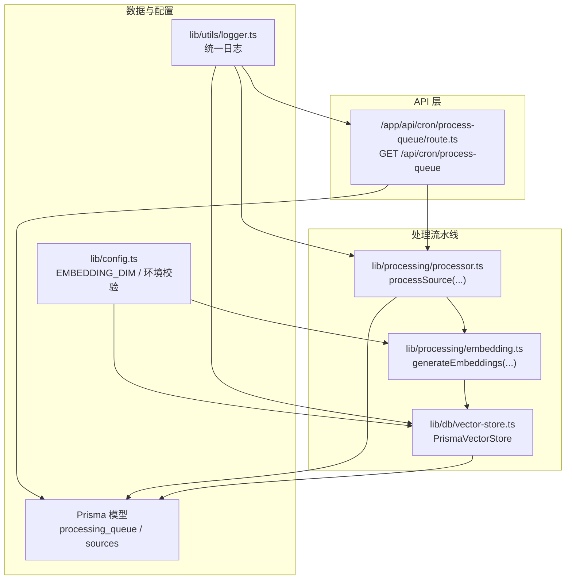
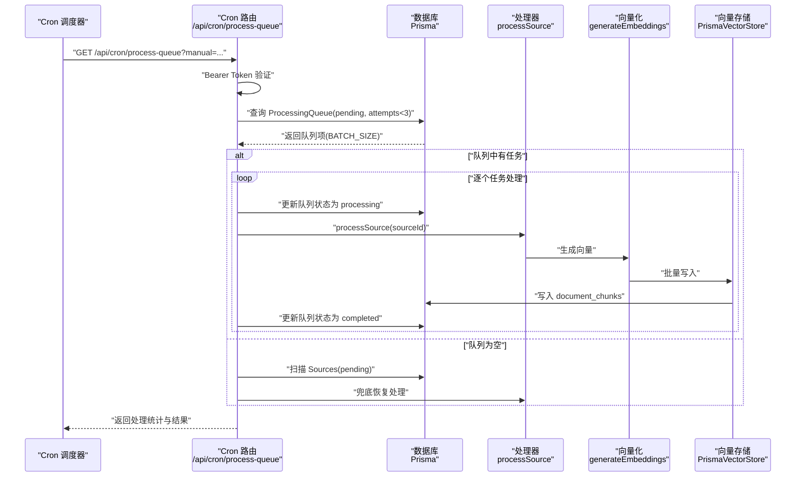
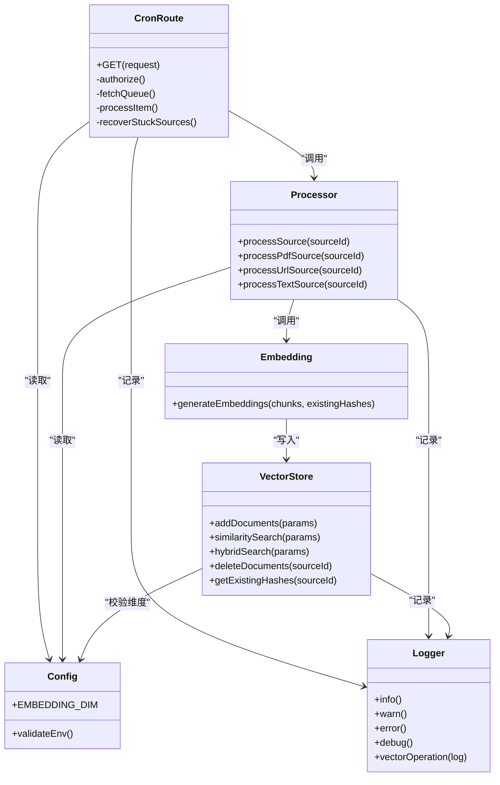
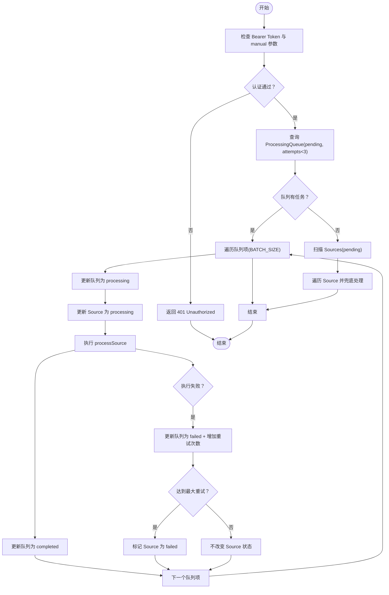

# Cron Worker 实现

<cite>
**本文引用的文件**
- [app/api/cron/process-queue/route.ts](file://app/api/cron/process-queue/route.ts)
- [lib/processing/processor.ts](file://lib/processing/processor.ts)
- [lib/processing/embedding.ts](file://lib/processing/embedding.ts)
- [lib/db/vector-store.ts](file://lib/db/vector-store.ts)
- [lib/config.ts](file://lib/config.ts)
- [lib/utils/logger.ts](file://lib/utils/logger.ts)
- [prisma/migrations/20260120042257_sync_schema_changes/migration.sql](file://prisma/migrations/20260120042257_sync_schema_changes/migration.sql)
- [app/api/sources/[id]/process/route.ts](file://app/api/sources/[id]/process/route.ts)
</cite>

## 目录
1. [简介](#简介)
2. [项目结构](#项目结构)
3. [核心组件](#核心组件)
4. [架构总览](#架构总览)
5. [详细组件分析](#详细组件分析)
6. [依赖关系分析](#依赖关系分析)
7. [性能考量](#性能考量)
8. [故障排查指南](#故障排查指南)
9. [结论](#结论)
10. [附录](#附录)

## 简介
本文件面向 notebookLM-clone 项目的 Cron Worker 实现，系统性阐述其架构设计、定时任务调度机制、执行周期控制、负载均衡策略、认证与安全访问控制、任务执行流程、批处理与并发控制、超时与重试策略、监控与日志记录以及扩展性设计（水平扩展、分布式部署与集群协调）。目标是帮助开发者与运维人员快速理解并高效维护该 Cron Worker。

## 项目结构
Cron Worker 的实现集中在 API 层的一个路由中，配合处理流水线与数据库模型，形成端到端的任务编排与执行闭环。

图表来源
- [app/api/cron/process-queue/route.ts](file://app/api/cron/process-queue/route.ts#L1-L165)
- [lib/processing/processor.ts](file://lib/processing/processor.ts#L1-L560)
- [lib/processing/embedding.ts](file://lib/processing/embedding.ts#L1-L189)
- [lib/db/vector-store.ts](file://lib/db/vector-store.ts#L1-L446)
- [lib/config.ts](file://lib/config.ts#L1-L187)
- [lib/utils/logger.ts](file://lib/utils/logger.ts#L1-L98)
- [prisma/migrations/20260120042257_sync_schema_changes/migration.sql](file://prisma/migrations/20260120042257_sync_schema_changes/migration.sql#L87-L100)

章节来源
- [app/api/cron/process-queue/route.ts](file://app/api/cron/process-queue/route.ts#L1-L165)
- [prisma/migrations/20260120042257_sync_schema_changes/migration.sql](file://prisma/migrations/20260120042257_sync_schema_changes/migration.sql#L87-L100)

## 核心组件
- Cron 路由处理器：负责认证、任务拉取、状态更新、执行与结果记录。
- 处理器流水线：根据 Source 类型（文件/URL/文本）执行下载、解析、切分、向量化、入库等阶段。
- 向量存储：封装批量写入、相似度检索与混合检索，内置维度校验与日志。
- 配置与日志：统一环境变量校验、向量维度约束与日志输出策略。
- 数据模型：ProcessingQueue 与 Sources 的索引与字段设计支撑优先级与重试控制。

章节来源
- [app/api/cron/process-queue/route.ts](file://app/api/cron/process-queue/route.ts#L1-L165)
- [lib/processing/processor.ts](file://lib/processing/processor.ts#L1-L560)
- [lib/db/vector-store.ts](file://lib/db/vector-store.ts#L1-L446)
- [lib/config.ts](file://lib/config.ts#L1-L187)
- [lib/utils/logger.ts](file://lib/utils/logger.ts#L1-L98)
- [prisma/migrations/20260120042257_sync_schema_changes/migration.sql](file://prisma/migrations/20260120042257_sync_schema_changes/migration.sql#L87-L100)

## 架构总览
Cron Worker 的工作流分为“认证与入口”、“任务拉取与优先级”、“执行与状态回写”、“异常与重试”、“自我修复与兜底”五个阶段，整体通过数据库事务与状态机保证一致性。

图表来源
- [app/api/cron/process-queue/route.ts](file://app/api/cron/process-queue/route.ts#L11-L165)
- [lib/processing/processor.ts](file://lib/processing/processor.ts#L402-L420)
- [lib/processing/embedding.ts](file://lib/processing/embedding.ts#L140-L189)
- [lib/db/vector-store.ts](file://lib/db/vector-store.ts#L77-L173)

## 详细组件分析

### 认证与安全访问控制
- Bearer Token 验证：要求请求头 Authorization 为 Bearer ${CRON_SECRET}，用于 CI/CD 触发。
- 手动触发参数：当 manual=true 时，允许无密钥访问（前端触发场景），但存在安全风险，建议后续增加会话验证。
- 未授权响应：对不符合条件的请求返回 401。

章节来源
- [app/api/cron/process-queue/route.ts](file://app/api/cron/process-queue/route.ts#L13-L36)

### 任务获取与优先级控制
- 查询条件：仅处理状态为 pending 且重试次数小于 3 的队列项。
- 排序策略：按优先级降序、创建时间升序，确保高优先级与公平性。
- 批大小：BATCH_SIZE=2，避免 Vercel Serverless 超时限制。

章节来源
- [app/api/cron/process-queue/route.ts](file://app/api/cron/process-queue/route.ts#L40-L50)

### 任务执行流程
- 状态更新：将队列项状态置为 processing，并同步更新 Source 状态为 processing。
- 处理执行：调用 processSource，按 Source 类型执行对应阶段（下载/抓取、解析、切分、向量化、入库）。
- 成功完成：将队列项状态置为 completed。
- 失败处理：捕获异常，更新队列项状态为 failed，记录错误消息与重试次数；若达到最大重试次数，同时标记 Source 为 failed。

章节来源
- [app/api/cron/process-queue/route.ts](file://app/api/cron/process-queue/route.ts#L55-L107)
- [lib/processing/processor.ts](file://lib/processing/processor.ts#L56-L77)

### 自我修复与兜底机制
- 队列空时扫描 Sources 表中状态为 pending 的记录，检查是否遗漏入队。
- 对未入队的 Source 创建 processing 队列项并立即执行，记录恢复结果。

章节来源
- [app/api/cron/process-queue/route.ts](file://app/api/cron/process-queue/route.ts#L108-L152)

### 批处理策略与并发控制
- 批大小：BATCH_SIZE=2，限制每次并发任务数量，避免超时。
- 向量化批处理：每批最多 64 条，单条最多 3072 tokens，支持指数退避重试。
- 写入批处理：每批最多 500 条，使用 ON CONFLICT DO NOTHING 去重。

章节来源
- [app/api/cron/process-queue/route.ts](file://app/api/cron/process-queue/route.ts#L7)
- [lib/processing/embedding.ts](file://lib/processing/embedding.ts#L23-L26)
- [lib/db/vector-store.ts](file://lib/db/vector-store.ts#L9)

### 超时与重试策略
- Cron 路由：为避免 Vercel 超时，限制批大小为 2；同时在处理过程中等待执行完成以记录日志。
- 向量化：最大重试 3 次，初始延迟 1 秒，最大延迟 30 秒，指数退避。
- API 封装：最大重试 4 次，延迟序列 [1s, 5s, 15s, 60s]，对 429/5xx 错误进行重试。

章节来源
- [app/api/cron/process-queue/route.ts](file://app/api/cron/process-queue/route.ts#L5-L7)
- [lib/processing/embedding.ts](file://lib/processing/embedding.ts#L12-L18)
- [lib/ai/zhipu.ts](file://lib/ai/zhipu.ts#L162-L195)

### 监控与日志记录
- 统一日志：开发环境输出 info/warn/error/debug；生产环境仅输出 error。
- 向量操作日志：记录插入/搜索/混合检索的持续时间、成功与否、元数据（如插入数、跳过数、平均相似度）。
- Cron 处理统计：返回 processed 数量与每个任务的结果明细。

章节来源
- [lib/utils/logger.ts](file://lib/utils/logger.ts#L1-L98)
- [lib/db/vector-store.ts](file://lib/db/vector-store.ts#L143-L172)
- [app/api/cron/process-queue/route.ts](file://app/api/cron/process-queue/route.ts#L154-L158)

### 数据模型与索引
- ProcessingQueue：包含 sourceId、status、priority、attempts、createdAt/startedAt/completedAt 等字段，复合索引支持查询优化。
- Sources：包含 status、processingLog、meta、errorMessage 等字段，便于跟踪处理进度与错误。

章节来源
- [prisma/migrations/20260120042257_sync_schema_changes/migration.sql](file://prisma/migrations/20260120042257_sync_schema_changes/migration.sql#L87-L100)
- [prisma/migrations/20260120042257_sync_schema_changes/migration.sql](file://prisma/migrations/20260120042257_sync_schema_changes/migration.sql#L135-L136)

### 扩展性设计
- 水平扩展：通过队列与优先级排序，多个 Cron Worker 可并行运行，互不冲突。
- 分布式部署：队列与数据库集中管理，Worker 无状态，可弹性扩缩容。
- 集群协调：无需额外协调器，基于数据库事务与状态机实现一致性。

章节来源
- [app/api/cron/process-queue/route.ts](file://app/api/cron/process-queue/route.ts#L40-L50)
- [lib/db/vector-store.ts](file://lib/db/vector-store.ts#L105-L140)

## 依赖关系分析

图表来源
- [app/api/cron/process-queue/route.ts](file://app/api/cron/process-queue/route.ts#L1-L165)
- [lib/processing/processor.ts](file://lib/processing/processor.ts#L1-L560)
- [lib/processing/embedding.ts](file://lib/processing/embedding.ts#L1-L189)
- [lib/db/vector-store.ts](file://lib/db/vector-store.ts#L1-L446)
- [lib/config.ts](file://lib/config.ts#L1-L187)
- [lib/utils/logger.ts](file://lib/utils/logger.ts#L1-L98)

## 性能考量
- 批大小与并发：BATCH_SIZE=2，避免超时；向量化批大小 64，写入批大小 500，兼顾吞吐与稳定性。
- 索引优化：processing_queue 上的复合索引支持高效查询与排序。
- 维度校验：启动时强制校验 EMBEDDING_DIM，避免运行期向量维度不一致导致的性能与功能问题。
- 日志开销：生产环境仅输出 error，降低日志成本。

章节来源
- [app/api/cron/process-queue/route.ts](file://app/api/cron/process-queue/route.ts#L7)
- [lib/processing/embedding.ts](file://lib/processing/embedding.ts#L23-L26)
- [lib/db/vector-store.ts](file://lib/db/vector-store.ts#L9)
- [lib/config.ts](file://lib/config.ts#L6-L29)
- [lib/utils/logger.ts](file://lib/utils/logger.ts#L30-L54)

## 故障排查指南
- 401 Unauthorized：确认 Authorization 头与 CRON_SECRET 是否匹配，或 manual 参数是否正确传递。
- 任务长时间 pending：检查 ProcessingQueue 中 attempts 是否已达上限（<3），或是否存在阻塞的 Source。
- 失败重试：查看队列项 attempts 与 errorMessage 字段，结合日志定位具体阶段与错误原因。
- 向量维度不一致：启动时报错或运行时报错，检查 EMBEDDING_DIM 配置与向量模型是否匹配。
- 写入失败：检查向量存储日志中的错误信息，确认网络、权限与数据库连接状态。

章节来源
- [app/api/cron/process-queue/route.ts](file://app/api/cron/process-queue/route.ts#L33-L36)
- [app/api/cron/process-queue/route.ts](file://app/api/cron/process-queue/route.ts#L87-L103)
- [lib/config.ts](file://lib/config.ts#L19-L29)
- [lib/db/vector-store.ts](file://lib/db/vector-store.ts#L158-L172)

## 结论
该 Cron Worker 通过“队列+优先级+批处理+重试”的组合，在有限的 Serverless 资源下实现了稳定可靠的异步处理能力。认证策略兼顾 CI 与前端触发场景，日志与监控覆盖关键路径，数据模型与索引保障了查询效率。未来可在前端触发场景引入会话验证、完善失败告警与重试上限策略，并考虑引入更细粒度的限流与熔断机制以进一步提升鲁棒性。

## 附录

### 配置选项与环境变量
- CRON_SECRET：Cron 路由的 Bearer Token 密钥。
- EMBEDDING_DIM：向量维度，必须为 1024（与 embedding-3 模型一致）。
- ZHIPU_API_KEY：向量化服务密钥。
- DATABASE_URL：数据库连接串。
- NEXT_PUBLIC_SUPABASE_URL、NEXT_PUBLIC_SUPABASE_ANON_KEY：Supabase 前端配置。
- SUPABASE_SECRET_KEY：Supabase 后端密钥。

章节来源
- [app/api/cron/process-queue/route.ts](file://app/api/cron/process-queue/route.ts#L13-L15)
- [lib/config.ts](file://lib/config.ts#L169-L186)

### 关键流程图：任务执行与状态更新

图表来源
- [app/api/cron/process-queue/route.ts](file://app/api/cron/process-queue/route.ts#L11-L165)