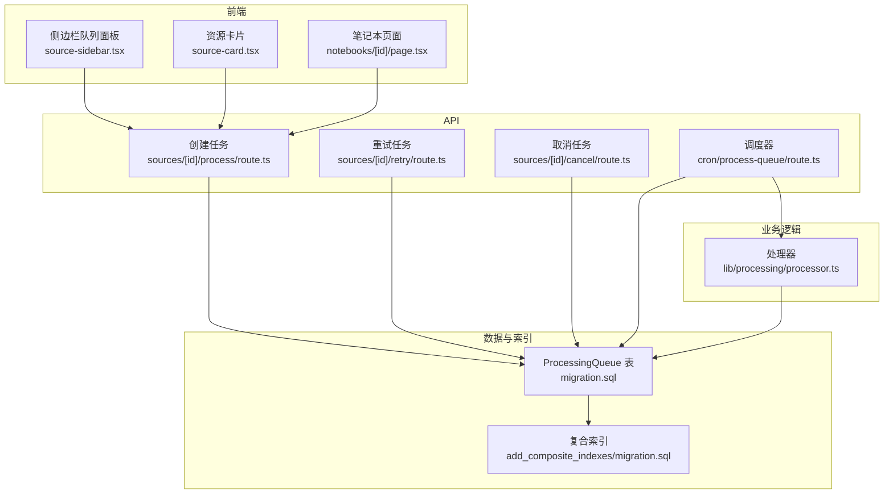
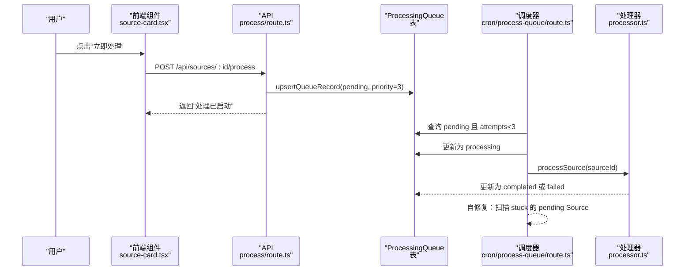
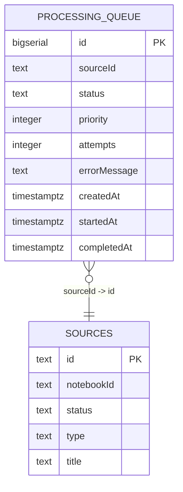
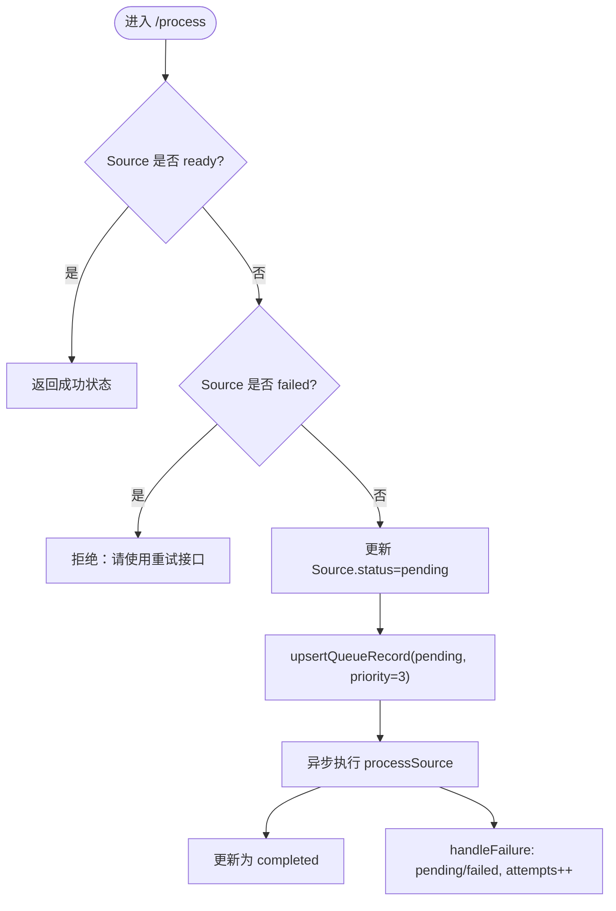
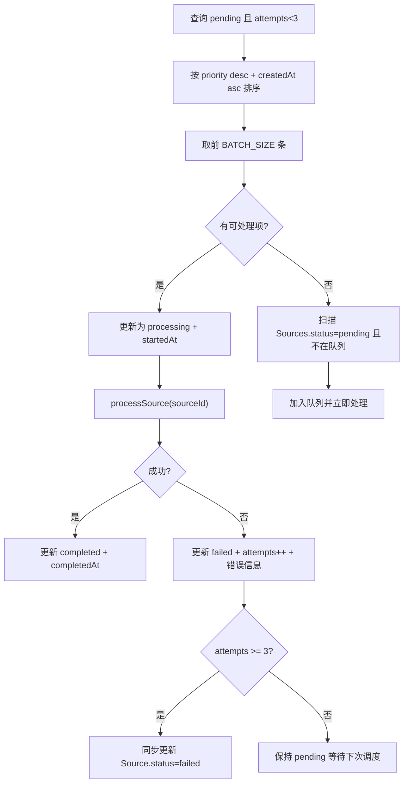
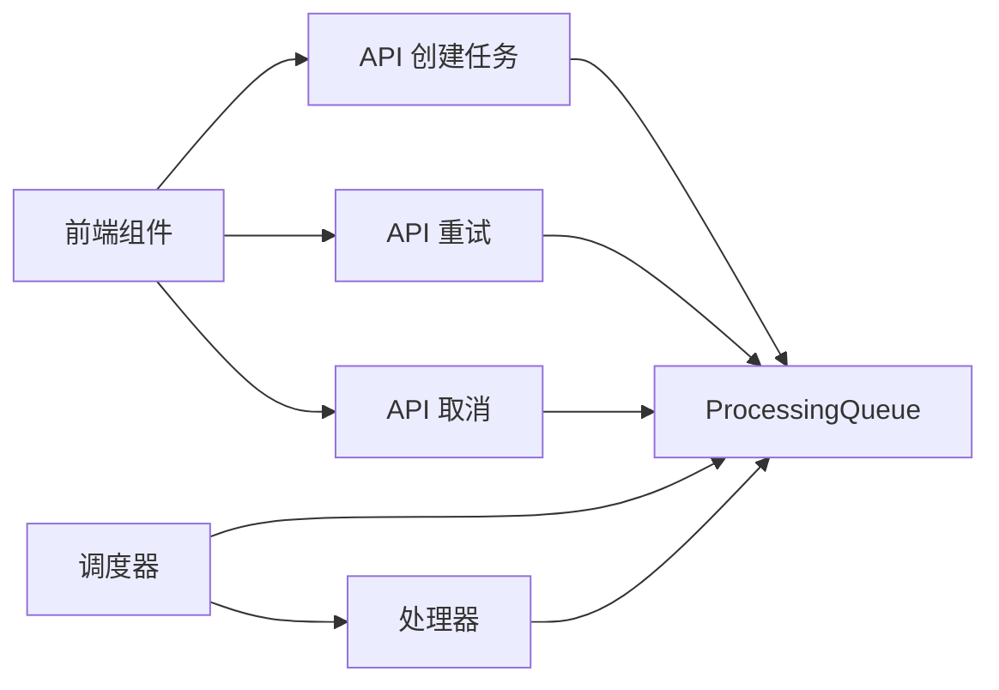

# 任务队列设计

<cite>
**本文引用的文件**
- [app/api/cron/process-queue/route.ts](file://app/api/cron/process-queue/route.ts)
- [app/api/sources/[id]/process/route.ts](file://app/api/sources/[id]/process/route.ts)
- [app/api/sources/[id]/retry/route.ts](file://app/api/sources/[id]/retry/route.ts)
- [app/api/sources/[id]/cancel/route.ts](file://app/api/sources/[id]/cancel/route.ts)
- [lib/processing/processor.ts](file://lib/processing/processor.ts)
- [prisma/migrations/20260120042257_sync_schema_changes/migration.sql](file://prisma/migrations/20260120042257_sync_schema_changes/migration.sql)
- [prisma/migrations/20260120120300_add_composite_indexes/migration.sql](file://prisma/migrations/20260120120300_add_composite_indexes/migration.sql)
- [components/notebook/source-card.tsx](file://components/notebook/source-card.tsx)
- [components/notebook/source-sidebar.tsx](file://components/notebook/source-sidebar.tsx)
- [app/notebooks/[id]/page.tsx](file://app/notebooks/[id]/page.tsx)
- [lib/config.ts](file://lib/config.ts)
- [lib/utils/logger.ts](file://lib/utils/logger.ts)
</cite>

## 目录
1. [简介](#简介)
2. [项目结构](#项目结构)
3. [核心组件](#核心组件)
4. [架构总览](#架构总览)
5. [详细组件分析](#详细组件分析)
6. [依赖关系分析](#依赖关系分析)
7. [性能考量](#性能考量)
8. [故障排查指南](#故障排查指南)
9. [结论](#结论)
10. [附录](#附录)

## 简介
本文件面向 notebookLM-clone 项目的“任务队列”子系统，系统性阐述处理队列的数据结构设计、任务创建流程、调度算法、状态管理、查询优化与监控指标。目标是帮助开发者与运维人员理解并高效维护基于 ProcessingQueue 的异步处理流水线。

## 项目结构
与任务队列相关的核心代码分布在以下位置：
- API 层：负责任务创建、重试、取消与调度触发
- 处理器：封装具体的知识源处理流程（PDF/URL/文本）
- 数据库迁移：定义 ProcessingQueue 表结构与索引
- 前端组件：展示队列状态、位置与交互入口
- 工具与配置：日志、环境校验与向量维度约束

图表来源
- [app/api/sources/[id]/process/route.ts](file://app/api/sources/[id]/process/route.ts#L1-L140)
- [app/api/sources/[id]/retry/route.ts](file://app/api/sources/[id]/retry/route.ts#L1-L72)
- [app/api/sources/[id]/cancel/route.ts](file://app/api/sources/[id]/cancel/route.ts#L1-L46)
- [app/api/cron/process-queue/route.ts](file://app/api/cron/process-queue/route.ts#L38-L164)
- [lib/processing/processor.ts](file://lib/processing/processor.ts#L1-L560)
- [prisma/migrations/20260120042257_sync_schema_changes/migration.sql](file://prisma/migrations/20260120042257_sync_schema_changes/migration.sql#L87-L100)
- [prisma/migrations/20260120120300_add_composite_indexes/migration.sql](file://prisma/migrations/20260120120300_add_composite_indexes/migration.sql#L1-L20)

章节来源
- [app/api/sources/[id]/process/route.ts](file://app/api/sources/[id]/process/route.ts#L1-L140)
- [app/api/sources/[id]/retry/route.ts](file://app/api/sources/[id]/retry/route.ts#L1-L72)
- [app/api/sources/[id]/cancel/route.ts](file://app/api/sources/[id]/cancel/route.ts#L1-L46)
- [app/api/cron/process-queue/route.ts](file://app/api/cron/process-queue/route.ts#L38-L164)
- [lib/processing/processor.ts](file://lib/processing/processor.ts#L1-L560)
- [prisma/migrations/20260120042257_sync_schema_changes/migration.sql](file://prisma/migrations/20260120042257_sync_schema_changes/migration.sql#L87-L100)
- [prisma/migrations/20260120120300_add_composite_indexes/migration.sql](file://prisma/migrations/20260120120300_add_composite_indexes/migration.sql#L1-L20)

## 核心组件
- ProcessingQueue 表：持久化任务元数据，包含状态、优先级、重试次数、时间戳等
- 任务创建 API：将 Source 状态转为 pending，并写入 ProcessingQueue
- 调度器（Cron）：按优先级与时间顺序拉取任务，执行处理并更新状态
- 重试与取消：根据业务需要提升优先级或终止排队任务
- 处理器：统一的 PDF/URL/文本处理流程，更新 Source 状态与日志
- 前端展示：队列位置计算、状态可视化与交互按钮

章节来源
- [prisma/migrations/20260120042257_sync_schema_changes/migration.sql](file://prisma/migrations/20260120042257_sync_schema_changes/migration.sql#L87-L100)
- [app/api/sources/[id]/process/route.ts](file://app/api/sources/[id]/process/route.ts#L1-L140)
- [app/api/cron/process-queue/route.ts](file://app/api/cron/process-queue/route.ts#L38-L164)
- [lib/processing/processor.ts](file://lib/processing/processor.ts#L1-L560)
- [components/notebook/source-card.tsx](file://components/notebook/source-card.tsx#L396-L494)
- [components/notebook/source-sidebar.tsx](file://components/notebook/source-sidebar.tsx#L276-L316)

## 架构总览
下图展示了从前端触发到后端调度与处理的整体流程，以及与数据库的交互。

图表来源
- [components/notebook/source-card.tsx](file://components/notebook/source-card.tsx#L396-L447)
- [app/api/sources/[id]/process/route.ts](file://app/api/sources/[id]/process/route.ts#L78-L138)
- [app/api/cron/process-queue/route.ts](file://app/api/cron/process-queue/route.ts#L38-L164)
- [lib/processing/processor.ts](file://lib/processing/processor.ts#L402-L420)

## 详细组件分析

### ProcessingQueue 表结构与字段定义
- 字段概览
  - id：自增主键
  - sourceId：关联知识源标识
  - status：任务状态（pending/processing/completed/failed/cancelled）
  - priority：整数优先级（数值越大优先级越高）
  - attempts：失败重试次数
  - errorMessage：错误信息
  - createdAt/startedAt/completedAt：时间戳
- 索引设计
  - processing_queue_status_priority_createdAt_idx：复合索引，支撑调度器高效查询
  - 其他表索引：sources_status_idx 等，辅助前端与后台查询

图表来源
- [prisma/migrations/20260120042257_sync_schema_changes/migration.sql](file://prisma/migrations/20260120042257_sync_schema_changes/migration.sql#L87-L100)
- [prisma/migrations/20260120042257_sync_schema_changes/migration.sql](file://prisma/migrations/20260120042257_sync_schema_changes/migration.sql#L24-L41)

章节来源
- [prisma/migrations/20260120042257_sync_schema_changes/migration.sql](file://prisma/migrations/20260120042257_sync_schema_changes/migration.sql#L87-L100)
- [prisma/migrations/20260120120300_add_composite_indexes/migration.sql](file://prisma/migrations/20260120120300_add_composite_indexes/migration.sql#L1-L20)

### 任务创建流程与优先级策略
- 创建入口
  - 用户点击“立即处理”，调用 /api/sources/:id/process
  - 若 Source 已处于 ready，则直接返回；若 failed，则提示使用重试
  - 将 Source 状态置为 pending，并调用 upsertQueueRecord 写入 ProcessingQueue
- upsertQueueRecord 语义
  - 若存在相同 sourceId 的记录，更新其状态、优先级、时间戳与重试次数
  - 否则新建一条记录，初始 attempts 为 0 或失败时为 1
- 优先级策略
  - 立即处理：priority=3
  - 重试：priority=2（略高于普通 pending）
  - 默认：priority=1（来自表结构默认值）

图表来源
- [app/api/sources/[id]/process/route.ts](file://app/api/sources/[id]/process/route.ts#L78-L138)
- [app/api/sources/[id]/process/route.ts](file://app/api/sources/[id]/process/route.ts#L10-L76)

章节来源
- [app/api/sources/[id]/process/route.ts](file://app/api/sources/[id]/process/route.ts#L1-L140)
- [app/api/sources/[id]/retry/route.ts](file://app/api/sources/[id]/retry/route.ts#L1-L72)

### 调度算法与批量处理
- 查询条件与排序
  - status='pending' 且 attempts < 3
  - 排序：priority 降序，createdAt 升序（FIFO）
  - 批量大小：BATCH_SIZE（由调度器常量控制）
- 执行流程
  - 将队列项更新为 processing，记录 startedAt
  - 调用 processSource 执行处理
  - 成功：更新 completed，记录 completedAt
  - 失败：更新 failed，记录 errorMessage 与 attempts++；当 attempts 达到阈值时同步更新 Source 状态
- 自修复机制
  - 若队列为空，扫描 Sources 中 status='pending' 的“漏网之鱼”，若不在队列中则加入并立即处理

图表来源
- [app/api/cron/process-queue/route.ts](file://app/api/cron/process-queue/route.ts#L38-L164)
- [lib/processing/processor.ts](file://lib/processing/processor.ts#L402-L420)

章节来源
- [app/api/cron/process-queue/route.ts](file://app/api/cron/process-queue/route.ts#L38-L164)

### 队列状态管理与转换
- 状态集合：pending、processing、completed、failed、cancelled
- 转换条件
  - pending → processing：调度器选取并更新
  - processing → completed/failed：处理器执行完成后回写
  - pending → cancelled：用户主动取消，更新 completedAt
  - failed：达到最大重试次数后同步更新 Source
- 时间戳管理
  - startedAt/completedAt 在状态变更时精确记录，便于统计耗时

章节来源
- [app/api/cron/process-queue/route.ts](file://app/api/cron/process-queue/route.ts#L55-L107)
- [app/api/sources/[id]/cancel/route.ts](file://app/api/sources/[id]/cancel/route.ts#L28-L37)
- [lib/processing/processor.ts](file://lib/processing/processor.ts#L56-L77)

### 队列查询优化与并发控制
- 索引优化
  - processing_queue_status_priority_createdAt_idx：支撑调度器高效筛选与排序
  - sources_status_idx：支撑前端与后台对 Source 的快速过滤
- 查询建议
  - 调度器使用复合索引进行过滤与排序，避免全表扫描
  - 前端按 notebookId/状态等维度查询时，确保命中对应索引
- 并发控制
  - 调度器采用“取一批、处理一批”的方式，降低锁竞争
  - upsertQueueRecord 保证同一 sourceId 的幂等更新

章节来源
- [prisma/migrations/20260120042257_sync_schema_changes/migration.sql](file://prisma/migrations/20260120042257_sync_schema_changes/migration.sql#L135-L136)
- [prisma/migrations/20260120120300_add_composite_indexes/migration.sql](file://prisma/migrations/20260120120300_add_composite_indexes/migration.sql#L1-L20)
- [app/api/sources/[id]/process/route.ts](file://app/api/sources/[id]/process/route.ts#L10-L42)

### 队列监控指标与展示
- 关键指标
  - 队列长度：pending 数量
  - 平均处理时间：(completedAt - startedAt) 的均值
  - 成功率：completed / (completed + failed)
  - 平均排队时长：(startedAt - createdAt) 的均值
  - 重试率：attempts>0 的比例
- 数据来源
  - ProcessingQueue 表的时间戳与状态字段
  - Source 表的 processingLog 与状态
- 展示位置
  - 前端侧边栏与资源卡片展示队列位置、状态与进度条
  - 页面 notebooks/[id]/page.tsx 聚合每个 Source 的最新队列记录

章节来源
- [components/notebook/source-card.tsx](file://components/notebook/source-card.tsx#L396-L494)
- [components/notebook/source-sidebar.tsx](file://components/notebook/source-sidebar.tsx#L276-L316)
- [app/notebooks/[id]/page.tsx](file://app/notebooks/[id]/page.tsx#L49-L95)

## 依赖关系分析
- 组件耦合
  - API 与 ProcessingQueue：强耦合（读写队列状态）
  - 调度器与处理器：弱耦合（通过队列状态驱动）
  - 前端与 API：弱耦合（REST 接口）
- 外部依赖
  - 数据库索引：影响查询性能
  - 环境变量与向量维度：影响处理器行为与一致性

图表来源
- [app/api/sources/[id]/process/route.ts](file://app/api/sources/[id]/process/route.ts#L1-L140)
- [app/api/sources/[id]/retry/route.ts](file://app/api/sources/[id]/retry/route.ts#L1-L72)
- [app/api/sources/[id]/cancel/route.ts](file://app/api/sources/[id]/cancel/route.ts#L1-L46)
- [app/api/cron/process-queue/route.ts](file://app/api/cron/process-queue/route.ts#L38-L164)
- [lib/processing/processor.ts](file://lib/processing/processor.ts#L1-L560)

章节来源
- [app/api/sources/[id]/process/route.ts](file://app/api/sources/[id]/process/route.ts#L1-L140)
- [app/api/sources/[id]/retry/route.ts](file://app/api/sources/[id]/retry/route.ts#L1-L72)
- [app/api/sources/[id]/cancel/route.ts](file://app/api/sources/[id]/cancel/route.ts#L1-L46)
- [app/api/cron/process-queue/route.ts](file://app/api/cron/process-queue/route.ts#L38-L164)
- [lib/processing/processor.ts](file://lib/processing/processor.ts#L1-L560)

## 性能考量
- 索引与查询
  - 使用 processing_queue_status_priority_createdAt_idx 保障调度查询高性能
  - sources_status_idx 保障按状态过滤的效率
- 批量处理
  - 调度器按 BATCH_SIZE 分批处理，避免长时间持有锁
- 超时与可靠性
  - /process 接口采用异步处理，避免请求超时
  - 调度器内部 await 处理，确保日志与状态一致性
- 环境一致性
  - EMBEDDING_DIM 固定为 1024，避免向量维度不一致导致的异常

章节来源
- [prisma/migrations/20260120120300_add_composite_indexes/migration.sql](file://prisma/migrations/20260120120300_add_composite_indexes/migration.sql#L1-L20)
- [lib/config.ts](file://lib/config.ts#L6-L29)

## 故障排查指南
- 常见问题
  - 任务卡在 pending：检查调度器是否运行、索引是否生效、BATCH_SIZE 是否合理
  - 处理失败：查看 ProcessingQueue.errorMessage 与 Source.processingLog
  - 重试无效：确认 attempts 是否达到上限、重试接口是否正确调用
  - 队列不显示：确认前端查询逻辑与最新队列记录的聚合逻辑
- 日志与告警
  - 使用统一日志工具输出关键事件
  - 对向量操作进行结构化日志记录，便于定位性能瓶颈

章节来源
- [lib/utils/logger.ts](file://lib/utils/logger.ts#L1-L98)
- [app/api/cron/process-queue/route.ts](file://app/api/cron/process-queue/route.ts#L83-L106)

## 结论
本设计通过清晰的表结构、严格的优先级与 FIFO 排序、完善的重试与取消机制，以及针对调度查询的索引优化，构建了稳定高效的异步处理队列。结合前端可视化与日志体系，能够有效支撑知识源的批量处理与可观测性需求。

## 附录
- 术语
  - pending：已入队但尚未开始处理
  - processing：正在处理中
  - completed：处理成功完成
  - failed：处理失败，可能重试
  - cancelled：用户取消排队
- 最佳实践
  - 为高频查询建立合适索引
  - 控制批处理大小，平衡吞吐与延迟
  - 严格区分“立即处理”与“重试”的优先级
  - 使用统一日志与监控指标，持续优化队列性能