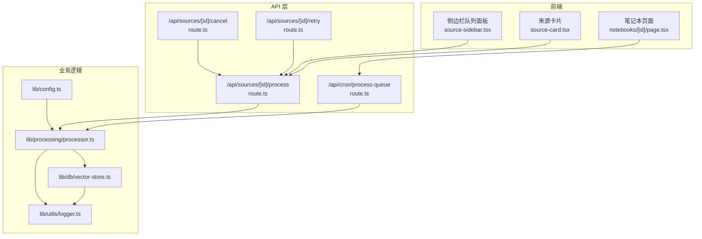
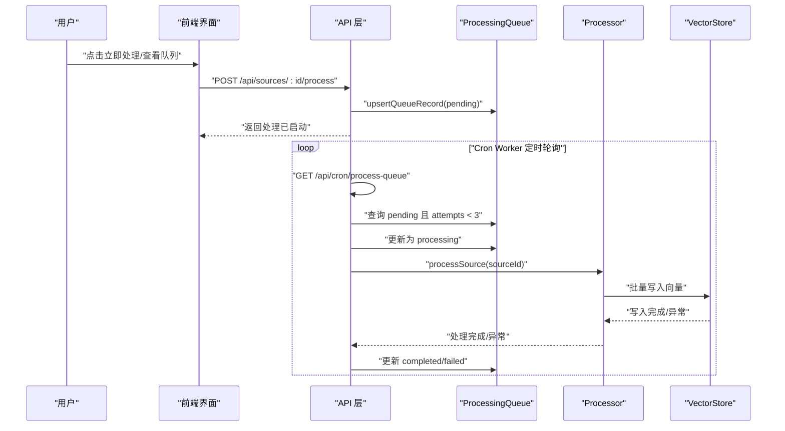
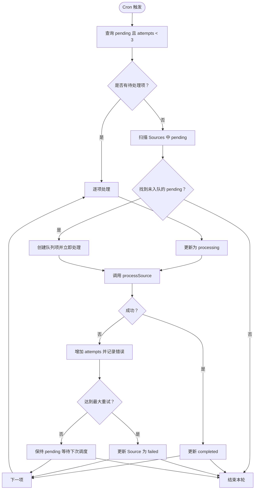
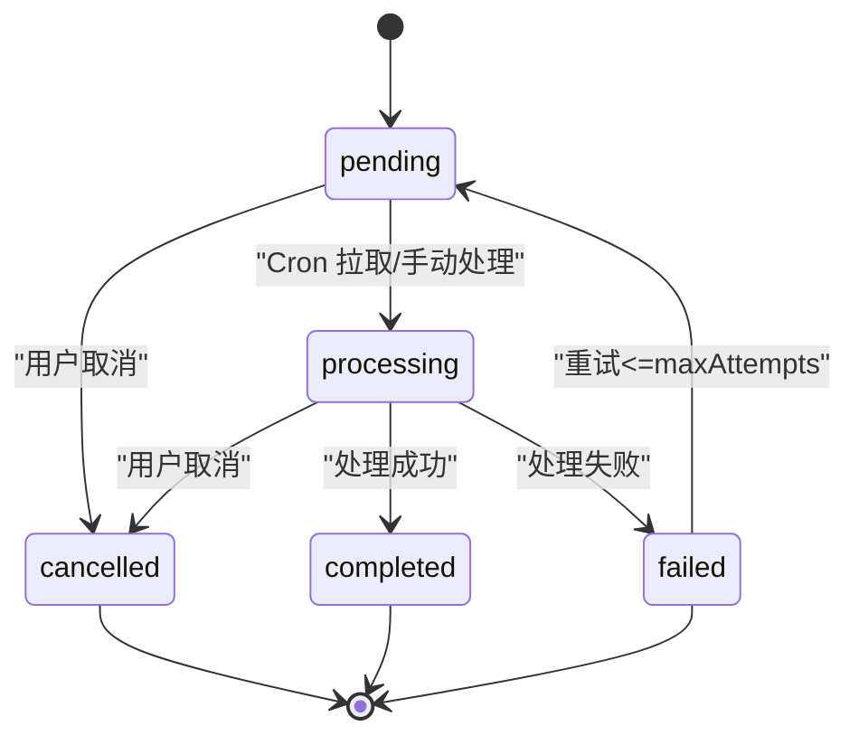
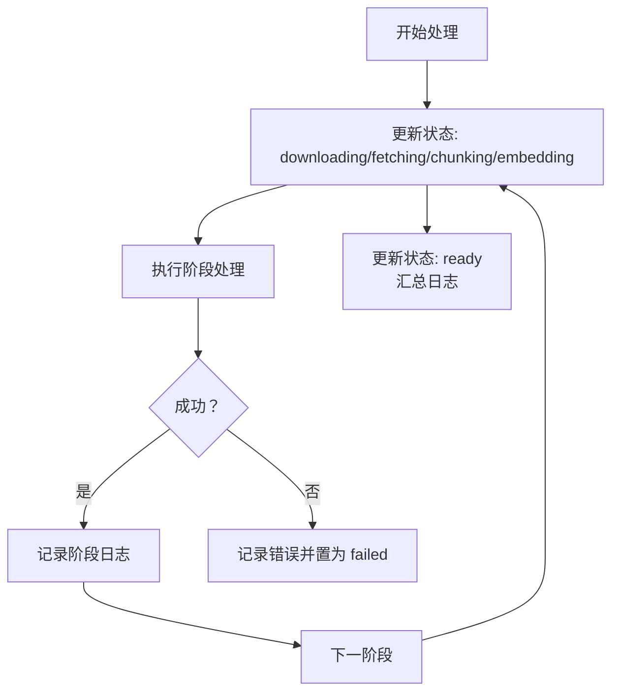
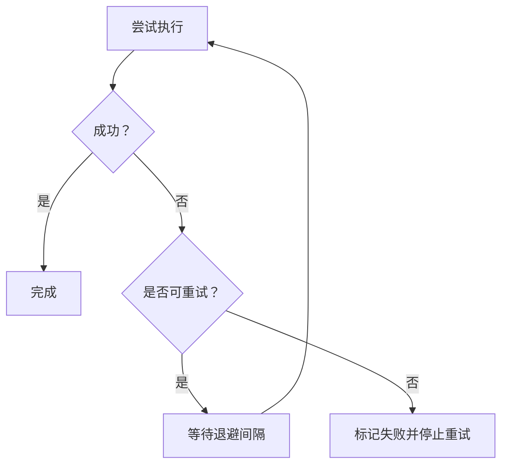

# 处理队列与后台任务

<cite>
**本文引用的文件**
- [app/api/cron/process-queue/route.ts](file://app/api/cron/process-queue/route.ts)
- [app/api/sources/[id]/process/route.ts](file://app/api/sources/[id]/process/route.ts)
- [app/api/sources/[id]/cancel/route.ts](file://app/api/sources/[id]/cancel/route.ts)
- [app/api/sources/[id]/retry/route.ts](file://app/api/sources/[id]/retry/route.ts)
- [lib/processing/processor.ts](file://lib/processing/processor.ts)
- [lib/db/vector-store.ts](file://lib/db/vector-store.ts)
- [lib/utils/logger.ts](file://lib/utils/logger.ts)
- [lib/config.ts](file://lib/config.ts)
- [app/notebooks/[id]/page.tsx](file://app/notebooks/[id]/page.tsx)
- [components/notebook/source-sidebar.tsx](file://components/notebook/source-sidebar.tsx)
- [components/notebook/source-card.tsx](file://components/notebook/source-card.tsx)
- [prisma/migrations/20260120120000_add_unique_constraint/migration.sql](file://prisma/migrations/20260120120000_add_unique_constraint/migration.sql)
- [prisma/migrations/20260120120100_fix_fts_language/migration.sql](file://prisma/migrations/20260120120100_fix_fts_language/migration.sql)
</cite>

## 目录
1. [简介](#简介)
2. [项目结构](#项目结构)
3. [核心组件](#核心组件)
4. [架构总览](#架构总览)
5. [详细组件分析](#详细组件分析)
6. [依赖关系分析](#依赖关系分析)
7. [性能考量](#性能考量)
8. [故障排查指南](#故障排查指南)
9. [结论](#结论)
10. [附录](#附录)

## 简介
本文件面向 notebookLM-clone 项目的“处理队列与后台任务”子系统，系统性阐述异步任务处理的设计理念与实现细节，覆盖任务队列管理、并发控制、资源分配、Cron Worker 定时调度、重试与故障恢复、性能优化、监控与日志、以及扩展性设计。文档同时提供可视化图示与实操建议，帮助开发者快速理解与维护该子系统。

## 项目结构
本子系统围绕“Source（知识源）—ProcessingQueue（处理队列）—Processor（处理管线）—VectorStore（向量存储）”展开，前端通过 API 控制队列状态，后端 Cron Worker 定时拉取并执行任务，处理过程贯穿状态更新与日志记录。



图表来源
- [app/api/sources/[id]/process/route.ts](file://app/api/sources/[id]/process/route.ts#L1-L140)
- [app/api/sources/[id]/cancel/route.ts](file://app/api/sources/[id]/cancel/route.ts#L1-L46)
- [app/api/sources/[id]/retry/route.ts](file://app/api/sources/[id]/retry/route.ts#L1-L72)
- [app/api/cron/process-queue/route.ts](file://app/api/cron/process-queue/route.ts#L1-L165)
- [lib/processing/processor.ts](file://lib/processing/processor.ts#L1-L560)
- [lib/db/vector-store.ts](file://lib/db/vector-store.ts#L1-L446)
- [lib/utils/logger.ts](file://lib/utils/logger.ts#L1-L98)
- [lib/config.ts](file://lib/config.ts#L1-L187)
- [components/notebook/source-sidebar.tsx](file://components/notebook/source-sidebar.tsx#L269-L300)
- [components/notebook/source-card.tsx](file://components/notebook/source-card.tsx#L396-L447)
- [app/notebooks/[id]/page.tsx](file://app/notebooks/[id]/page.tsx#L49-L95)

章节来源
- [app/api/cron/process-queue/route.ts](file://app/api/cron/process-queue/route.ts#L1-L165)
- [lib/processing/processor.ts](file://lib/processing/processor.ts#L1-L560)
- [lib/db/vector-store.ts](file://lib/db/vector-store.ts#L1-L446)
- [lib/utils/logger.ts](file://lib/utils/logger.ts#L1-L98)
- [lib/config.ts](file://lib/config.ts#L1-L187)
- [components/notebook/source-sidebar.tsx](file://components/notebook/source-sidebar.tsx#L269-L300)
- [components/notebook/source-card.tsx](file://components/notebook/source-card.tsx#L396-L447)
- [app/notebooks/[id]/page.tsx](file://app/notebooks/[id]/page.tsx#L49-L95)

## 核心组件
- 处理队列与状态机
  - ProcessingQueue：持久化记录每个 Source 的处理状态、优先级、尝试次数与时间戳。
  - Source：记录来源元数据、当前状态、错误信息与处理日志。
- Cron Worker（定时任务）
  - 拉取 pending 且尝试次数小于阈值的任务，按优先级与入队时间排序，批量处理。
- 处理器 Pipeline
  - PDF/URL/Text 三类来源的统一处理流程：下载/抓取 → 解析 → 切分 → 向量化 → 写入向量库 → 更新 Source 状态。
- 向量存储与日志
  - 向量写入批量优化、维度校验、唯一性约束；日志统一输出与性能指标记录。
- 前端交互
  - 队列面板展示排队任务与位置；支持“立即处理”“取消排队”“重试失败”等操作。

章节来源
- [app/api/sources/[id]/process/route.ts](file://app/api/sources/[id]/process/route.ts#L1-L140)
- [app/api/cron/process-queue/route.ts](file://app/api/cron/process-queue/route.ts#L1-L165)
- [lib/processing/processor.ts](file://lib/processing/processor.ts#L1-L560)
- [lib/db/vector-store.ts](file://lib/db/vector-store.ts#L1-L446)
- [lib/utils/logger.ts](file://lib/utils/logger.ts#L1-L98)

## 架构总览
下图展示从用户触发到 Cron Worker 执行再到处理完成的端到端流程。



图表来源
- [app/api/sources/[id]/process/route.ts](file://app/api/sources/[id]/process/route.ts#L1-L140)
- [app/api/cron/process-queue/route.ts](file://app/api/cron/process-queue/route.ts#L1-L165)
- [lib/processing/processor.ts](file://lib/processing/processor.ts#L1-L560)
- [lib/db/vector-store.ts](file://lib/db/vector-store.ts#L1-L446)

## 详细组件分析

### Cron Worker 设计与实现
- 触发方式
  - 通过定时调用 /api/cron/process-queue，支持 Bearer Token 验证与 manual 参数（前端触发）。
- 任务拉取与排序
  - 查询 ProcessingQueue 中 status=pending 且 attempts < 3 的任务，按 priority 降序、createdAt 升序，限制批量大小。
- 执行策略
  - 将任务标记为 processing，调用 processSource 同步执行，完成后标记 completed；异常则记录错误、增加 attempts，并在达到阈值时将 Source 标记 failed。
- 自我修复
  - 若队列为空，扫描 Sources 中 status=pending 的来源，若不在队列中则创建队列项并立即处理，确保“漏网之鱼”被修复。
- 并发与超时
  - 采用小批量（BATCH_SIZE=2）处理，避免单次执行时间过长导致超时。



图表来源
- [app/api/cron/process-queue/route.ts](file://app/api/cron/process-queue/route.ts#L1-L165)

章节来源
- [app/api/cron/process-queue/route.ts](file://app/api/cron/process-queue/route.ts#L1-L165)

### 任务队列管理与状态跟踪
- 队列记录
  - upsertQueueRecord：根据 sourceId 查找最新记录，若存在则更新状态/时间戳/重试次数；否则新建记录。
- 状态流转
  - pending → processing → completed/failed/cancelled；失败时根据重试次数决定是否再次入队。
- 前端展示
  - 页面聚合 ProcessingQueue 最新记录，计算队列位置与优先级，供 UI 展示。



图表来源
- [app/api/sources/[id]/process/route.ts](file://app/api/sources/[id]/process/route.ts#L1-L140)
- [app/notebooks/[id]/page.tsx](file://app/notebooks/[id]/page.tsx#L49-L95)

章节来源
- [app/api/sources/[id]/process/route.ts](file://app/api/sources/[id]/process/route.ts#L1-L140)
- [app/notebooks/[id]/page.tsx](file://app/notebooks/[id]/page.tsx#L49-L95)

### 处理流水线与进度报告
- 流程阶段
  - PDF：下载 → 解析 → 切分 → 向量化 → 写入 → ready
  - URL：抓取 → 解析 → 切分 → 向量化 → 写入 → ready
  - Text：切分 → 向量化 → 写入 → ready
- 进度与日志
  - 每阶段更新 Source 状态并记录阶段日志（耗时、数量、tokens 等），最终汇总 totalDuration。
- 错误处理
  - 任一阶段失败均记录错误并置为 failed，前端可据此提示重试。



图表来源
- [lib/processing/processor.ts](file://lib/processing/processor.ts#L1-L560)

章节来源
- [lib/processing/processor.ts](file://lib/processing/processor.ts#L1-L560)

### 重试机制与故障恢复
- 最大重试次数
  - Source 级别与队列级别均有限制（例如 attempts < 3 与 maxAttempts=3）。
- 指数退避
  - 当前处理器对上游 API 调用提供带重试的封装（withRetry），内部使用固定延迟序列与最大重试次数，适合在处理阶段对第三方服务进行重试。
- 死信处理
  - 达到最大重试后，队列项标记 failed，Source 状态也标记 failed，前端可引导用户重试。



图表来源
- [app/api/cron/process-queue/route.ts](file://app/api/cron/process-queue/route.ts#L83-L106)
- [lib/ai/zhipu.ts](file://lib/ai/zhipu.ts#L162-L195)

章节来源
- [app/api/cron/process-queue/route.ts](file://app/api/cron/process-queue/route.ts#L1-L165)
- [lib/ai/zhipu.ts](file://lib/ai/zhipu.ts#L162-L195)

### 并发控制与资源分配
- 批处理策略
  - Cron Worker 采用小批量（BATCH_SIZE=2）处理，避免超时与资源争用。
- 优先级排序
  - 队列项按 priority 降序、createdAt 升序，优先处理高优先级与更早入队的任务。
- 资源限制
  - 处理器对向量写入采用批量插入（默认每批 500），减少事务开销与网络往返。

章节来源
- [app/api/cron/process-queue/route.ts](file://app/api/cron/process-queue/route.ts#L7-L7)
- [lib/db/vector-store.ts](file://lib/db/vector-store.ts#L9-L9)
- [lib/processing/processor.ts](file://lib/processing/processor.ts#L1-L560)

### 任务监控与日志记录
- 日志规范
  - 统一日志工具在开发环境输出 info/warn/error/debug，在生产环境仅输出 error（其余静默）。
- 向量操作日志
  - 向量存储模块记录 insert/search/hybrid_search/delete 的操作、耗时、成功与否及关键指标（如插入条数、跳过条数、相似度均值等）。
- 性能指标
  - 处理器阶段日志包含各阶段耗时、token 数、块数等，便于性能分析与优化。

章节来源
- [lib/utils/logger.ts](file://lib/utils/logger.ts#L1-L98)
- [lib/db/vector-store.ts](file://lib/db/vector-store.ts#L142-L173)
- [lib/db/vector-store.ts](file://lib/db/vector-store.ts#L268-L296)
- [lib/processing/processor.ts](file://lib/processing/processor.ts#L33-L51)

### 扩展性设计
- 水平扩展
  - Cron Worker 通过 API 拉取任务，可横向部署多个实例，天然支持水平扩展。
- 分布式处理
  - 队列与状态持久化于数据库，处理节点无状态，便于跨节点调度。
- 集群管理
  - 通过环境变量与配置（如 EMBEDDING_DIM）集中管理，确保各节点一致性。

章节来源
- [lib/config.ts](file://lib/config.ts#L1-L187)
- [app/api/cron/process-queue/route.ts](file://app/api/cron/process-queue/route.ts#L1-L165)

## 依赖关系分析
- 数据模型与约束
  - 向量表对 (source_id, chunk_index) 建立唯一索引，防止重复插入。
  - 全文检索列使用 simple 分词器，提升多语言支持。
- 维度一致性
  - 启动时强制校验 EMBEDDING_DIM，确保与数据库向量维度一致。

```mermaid
erDiagram
PROCESSING_QUEUE {
uuid id PK
uuid source_id FK
enum status
int attempts
int priority
timestamp created_at
timestamp started_at
timestamp completed_at
}
SOURCE {
uuid id PK
uuid notebook_id FK
enum status
string error_message
jsonb processing_log
jsonb meta
int retry_count
int last_processed_chunk_index
timestamp created_at
timestamp updated_at
}
DOCUMENT_CHUNKS {
uuid id PK
uuid notebook_id FK
uuid source_id FK
int chunk_index
text content
string content_hash
jsonb metadata
vector embedding
string embedding_model
int embedding_dim
}
PROCESSING_QUEUE }o--|| SOURCE : "属于"
DOCUMENT_CHUNKS }o{|| SOURCE : "属于"
```

图表来源
- [prisma/migrations/20260120120000_add_unique_constraint/migration.sql](file://prisma/migrations/20260120120000_add_unique_constraint/migration.sql#L1-L26)
- [prisma/migrations/20260120120100_fix_fts_language/migration.sql](file://prisma/migrations/20260120120100_fix_fts_language/migration.sql#L1-L19)
- [lib/db/vector-store.ts](file://lib/db/vector-store.ts#L1-L446)

章节来源
- [prisma/migrations/20260120120000_add_unique_constraint/migration.sql](file://prisma/migrations/20260120120000_add_unique_constraint/migration.sql#L1-L26)
- [prisma/migrations/20260120120100_fix_fts_language/migration.sql](file://prisma/migrations/20260120120100_fix_fts_language/migration.sql#L1-L19)
- [lib/db/vector-store.ts](file://lib/db/vector-store.ts#L1-L446)

## 性能考量
- 批处理策略
  - 向量写入默认每批 500 条，显著降低事务与网络开销。
- 内存管理
  - 处理器按阶段推进，避免一次性加载全部内容；切分阶段使用流式/分块策略。
- 超时控制
  - Cron Worker 限制批量大小，前端异步处理避免阻塞 UI。
- 资源限制
  - 维度校验与唯一性约束保障数据一致性，减少无效写入与回滚成本。

章节来源
- [lib/db/vector-store.ts](file://lib/db/vector-store.ts#L9-L9)
- [lib/config.ts](file://lib/config.ts#L1-L187)
- [app/api/cron/process-queue/route.ts](file://app/api/cron/process-queue/route.ts#L7-L7)

## 故障排查指南
- 常见问题定位
  - 队列无任务：检查 Cron Worker 是否正常调用 /api/cron/process-queue；确认 Authorization 与 manual 参数。
  - 任务卡住：确认 attempts 是否已达上限；查看 Source 的 errorMessage 与 ProcessingLog。
  - 向量写入失败：检查 EMBEDDING_DIM 配置与数据库维度；查看向量操作日志中的错误详情。
- 前端操作
  - “立即处理”：调用 /api/sources/:id/process；若失败可使用“重试失败”接口。
  - “取消排队”：调用 /api/sources/:id/cancel；仅对 pending/processing 生效。
- 自我修复
  - Cron Worker 在队列为空时会扫描 Sources 中 pending 的来源，自动补入队列并处理。

章节来源
- [app/api/cron/process-queue/route.ts](file://app/api/cron/process-queue/route.ts#L1-L165)
- [app/api/sources/[id]/process/route.ts](file://app/api/sources/[id]/process/route.ts#L1-L140)
- [app/api/sources/[id]/cancel/route.ts](file://app/api/sources/[id]/cancel/route.ts#L1-L46)
- [app/api/sources/[id]/retry/route.ts](file://app/api/sources/[id]/retry/route.ts#L1-L72)
- [lib/db/vector-store.ts](file://lib/db/vector-store.ts#L142-L173)

## 结论
本子系统以“数据库驱动的队列 + Cron Worker 拉取 + 处理器流水线”的架构实现了稳定可靠的异步处理能力。通过优先级排序、小批量处理、统一日志与维度校验等手段，兼顾了性能与可靠性。结合前端队列面板与重试/取消接口，形成了完整的用户体验闭环。未来可在任务分片、动态优先级与分布式锁等方面进一步演进。

## 附录
- 关键接口一览
  - POST /api/sources/:id/process：提交处理任务并异步执行
  - POST /api/sources/:id/cancel：取消排队中的任务
  - POST /api/sources/:id/retry：重试失败的来源
  - GET /api/cron/process-queue：Cron Worker 调用的队列拉取接口
- 前端交互要点
  - 队列面板展示排队来源与位置；支持“立即处理”“取消”“重试”等操作。

章节来源
- [components/notebook/source-sidebar.tsx](file://components/notebook/source-sidebar.tsx#L269-L300)
- [components/notebook/source-card.tsx](file://components/notebook/source-card.tsx#L396-L447)
- [app/api/sources/[id]/process/route.ts](file://app/api/sources/[id]/process/route.ts#L1-L140)
- [app/api/sources/[id]/cancel/route.ts](file://app/api/sources/[id]/cancel/route.ts#L1-L46)
- [app/api/sources/[id]/retry/route.ts](file://app/api/sources/[id]/retry/route.ts#L1-L72)
- [app/api/cron/process-queue/route.ts](file://app/api/cron/process-queue/route.ts#L1-L165)