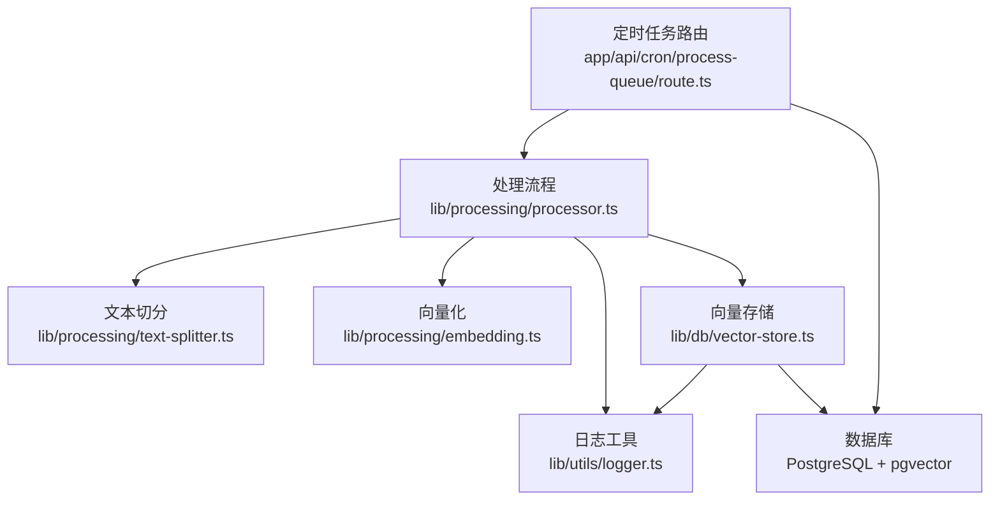
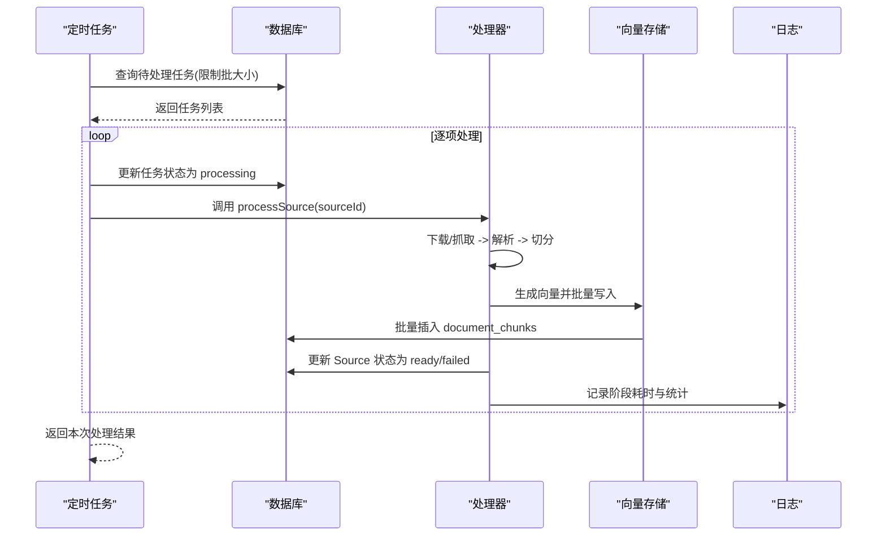
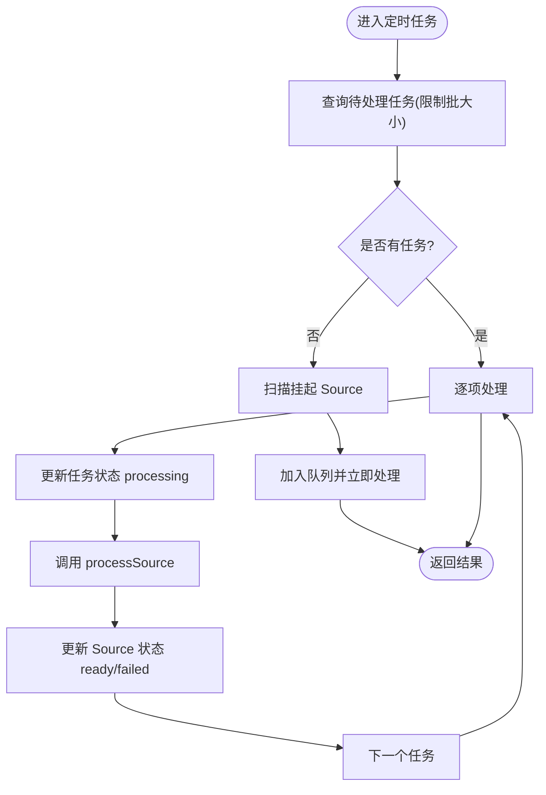
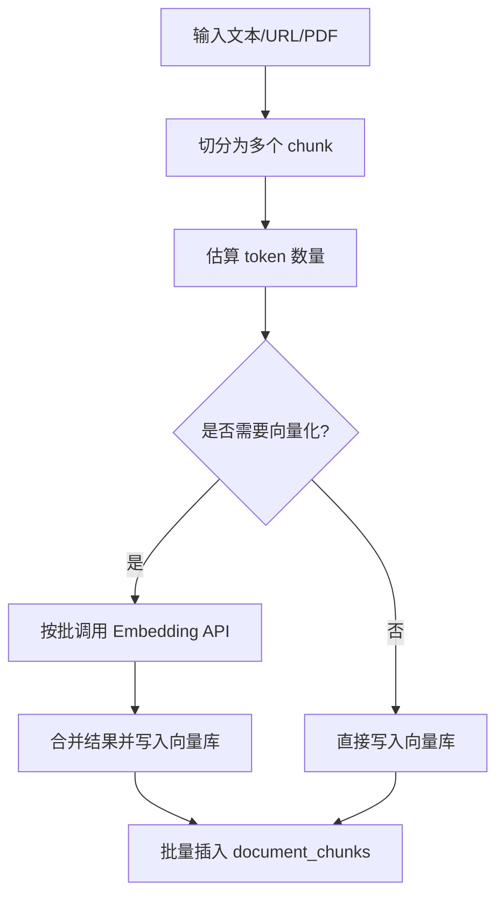
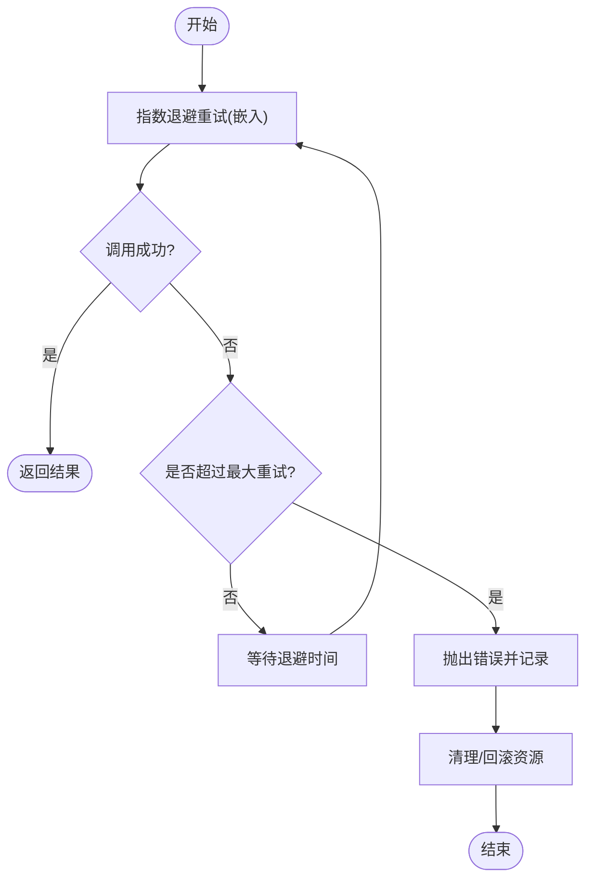
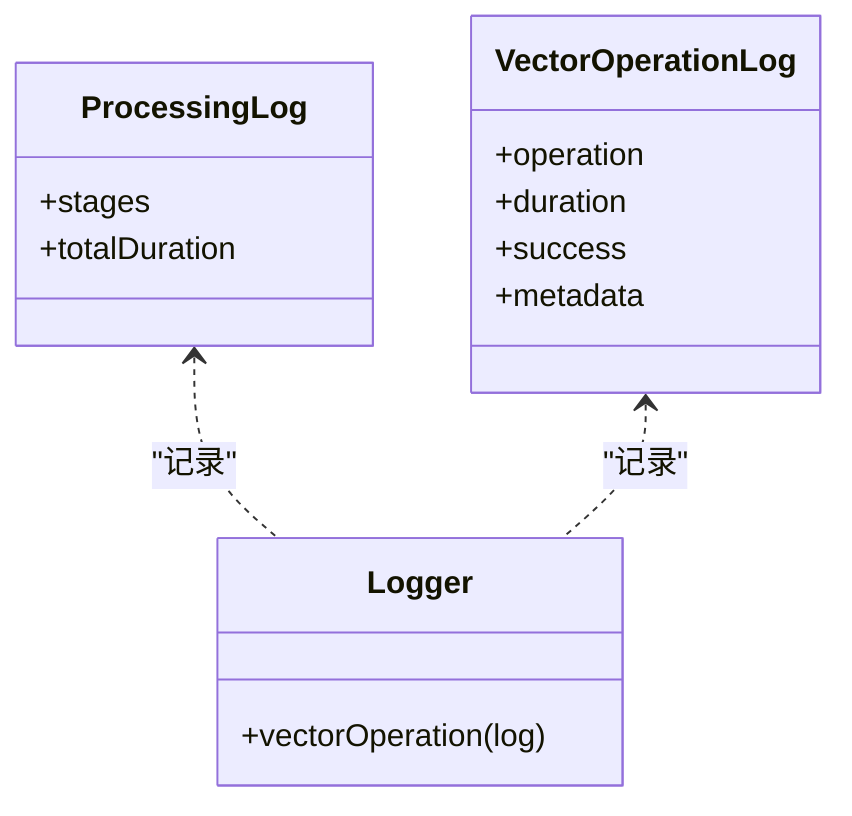
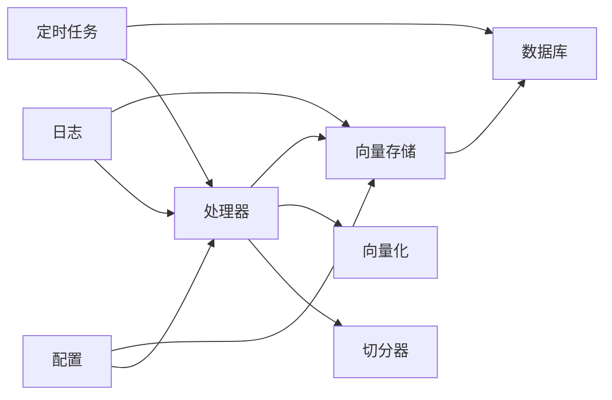

# 性能优化

<cite>
**本文引用的文件**
- [app/api/cron/process-queue/route.ts](file://app/api/cron/process-queue/route.ts)
- [lib/processing/processor.ts](file://lib/processing/processor.ts)
- [lib/processing/embedding.ts](file://lib/processing/embedding.ts)
- [lib/processing/text-splitter.ts](file://lib/processing/text-splitter.ts)
- [lib/db/vector-store.ts](file://lib/db/vector-store.ts)
- [lib/db/prisma.ts](file://lib/db/prisma.ts)
- [lib/config.ts](file://lib/config.ts)
- [lib/utils/logger.ts](file://lib/utils/logger.ts)
- [prisma/migrations/20260120120200_optimize_hnsw_index/migration.sql](file://prisma/migrations/20260120120200_optimize_hnsw_index/migration.sql)
- [prisma/migrations/20260120120300_add_composite_indexes/migration.sql](file://prisma/migrations/20260120120300_add_composite_indexes/migration.sql)
- [next.config.js](file://next.config.js)
</cite>

## 目录
1. [简介](#简介)
2. [项目结构](#项目结构)
3. [核心组件](#核心组件)
4. [架构总览](#架构总览)
5. [详细组件分析](#详细组件分析)
6. [依赖关系分析](#依赖关系分析)
7. [性能考量](#性能考量)
8. [故障排查指南](#故障排查指南)
9. [结论](#结论)
10. [附录](#附录)

## 简介
本文件聚焦 notebookLM-clone 项目的“处理队列”性能优化，围绕批处理策略、并发控制、资源分配、内存管理、超时控制、负载均衡、性能监控与调优进行系统化梳理。文档基于仓库现有代码与迁移脚本，结合可落地的优化建议，帮助在 Vercel Serverless 环境下稳定、高效地运行文档处理流水线。

## 项目结构
- 处理队列入口位于定时任务路由，负责拉取待处理任务、更新状态、调用处理流程，并对异常进行重试与失败标记。
- 处理流程由处理器模块统一编排，涵盖 PDF/URL/文本三类来源的切分、向量化与入库。
- 向量存储层通过批量写入与索引优化保障检索与写入性能。
- 数据库连接采用 Prisma + Postgres Pooler，适配 Serverless 的连接限制。
- 日志与监控通过统一日志工具输出关键指标，便于性能观测与问题定位。

图表来源
- [app/api/cron/process-queue/route.ts](file://app/api/cron/process-queue/route.ts#L11-L164)
- [lib/processing/processor.ts](file://lib/processing/processor.ts#L1-L560)
- [lib/processing/text-splitter.ts](file://lib/processing/text-splitter.ts#L1-L270)
- [lib/processing/embedding.ts](file://lib/processing/embedding.ts#L1-L189)
- [lib/db/vector-store.ts](file://lib/db/vector-store.ts#L1-L446)
- [lib/utils/logger.ts](file://lib/utils/logger.ts#L1-L98)

章节来源
- [app/api/cron/process-queue/route.ts](file://app/api/cron/process-queue/route.ts#L1-L165)
- [lib/processing/processor.ts](file://lib/processing/processor.ts#L1-L560)

## 核心组件
- 处理队列定时任务：限制单次批处理规模、严格的状态流转与重试上限、自修复扫描挂起任务。
- 处理器：按来源类型编排下载/抓取、解析、切分、向量化、入库；记录阶段耗时与统计。
- 文本切分器：基于多级分隔符的递归切分，估算 token 数量，支持重叠窗口。
- 向量化模块：批量调用外部 Embedding API，带指数退避重试与去重跳过。
- 向量存储：批量插入、相似度检索、混合检索、删除与去重哈希查询；配套数据库索引优化。
- 数据库连接：Prisma + PG Pooler，Serverless 环境连接限制与日志级别控制。
- 日志工具：统一输出向量操作日志，包含耗时、成功与否、元数据等。

章节来源
- [app/api/cron/process-queue/route.ts](file://app/api/cron/process-queue/route.ts#L7-L107)
- [lib/processing/processor.ts](file://lib/processing/processor.ts#L56-L209)
- [lib/processing/text-splitter.ts](file://lib/processing/text-splitter.ts#L13-L78)
- [lib/processing/embedding.ts](file://lib/processing/embedding.ts#L23-L188)
- [lib/db/vector-store.ts](file://lib/db/vector-store.ts#L7-L173)
- [lib/db/prisma.ts](file://lib/db/prisma.ts#L5-L34)
- [lib/utils/logger.ts](file://lib/utils/logger.ts#L72-L94)

## 架构总览
处理队列在 Serverless 环境中以定时任务形式运行，单次仅处理少量任务，避免超时；处理器内部按阶段拆分，每个阶段独立记录耗时与统计；向量存储采用批量写入与索引优化，降低写入与查询成本；数据库连接通过 Pooler 控制并发连接数。

图表来源
- [app/api/cron/process-queue/route.ts](file://app/api/cron/process-queue/route.ts#L38-L107)
- [lib/processing/processor.ts](file://lib/processing/processor.ts#L82-L209)
- [lib/db/vector-store.ts](file://lib/db/vector-store.ts#L105-L173)
- [lib/utils/logger.ts](file://lib/utils/logger.ts#L75-L94)

## 详细组件分析

### 批处理策略与并发控制
- 单次批大小：定时任务固定批大小，避免单次执行时间过长导致超时。
- 任务优先级与顺序：按优先级降序、创建时间升序排序，保证高优先级与公平性。
- 重试策略：任务失败时尝试有限次数重试，超过上限则标记失败并更新 Source 状态。
- 自修复扫描：当队列为空时扫描挂起的 Source，确保无遗漏。
- 并发连接：数据库连接池限制每实例最多一个连接，避免 Serverless 超额占用。

图表来源
- [app/api/cron/process-queue/route.ts](file://app/api/cron/process-queue/route.ts#L38-L152)

章节来源
- [app/api/cron/process-queue/route.ts](file://app/api/cron/process-queue/route.ts#L7-L107)
- [lib/db/prisma.ts](file://lib/db/prisma.ts#L5-L34)

### 内存管理与大文件处理
- 文本切分：采用递归分隔符策略与重叠窗口，避免关键信息截断；估算 token 数量，便于控制批大小。
- 向量化：分批调用外部 API，避免单次请求过大；对已存在哈希的 chunk 进行跳过，减少内存与网络开销。
- 批量入库：向量存储按固定批大小分批写入，避免一次性构造巨大 SQL。
- 大文件上传：Next.js 配置了较大的上传体限制，配合存储服务下载与解析。

图表来源
- [lib/processing/text-splitter.ts](file://lib/processing/text-splitter.ts#L83-L264)
- [lib/processing/embedding.ts](file://lib/processing/embedding.ts#L140-L188)
- [lib/db/vector-store.ts](file://lib/db/vector-store.ts#L105-L173)

章节来源
- [lib/processing/text-splitter.ts](file://lib/processing/text-splitter.ts#L13-L78)
- [lib/processing/embedding.ts](file://lib/processing/embedding.ts#L23-L67)
- [lib/db/vector-store.ts](file://lib/db/vector-store.ts#L7-L173)
- [next.config.js](file://next.config.js#L13-L17)

### 超时控制与资源清理
- Serverless 执行时间限制：定时任务采用小批处理，避免超时。
- 任务超时与重试：嵌入式重试采用指数退避，限制最大重试次数。
- 失败清理：任务失败时更新状态与错误信息，必要时将 Source 标记为失败。
- 资源清理：删除 Source 时同步清理向量库、存储文件与队列记录。

图表来源
- [lib/processing/embedding.ts](file://lib/processing/embedding.ts#L115-L134)
- [app/api/cron/process-queue/route.ts](file://app/api/cron/process-queue/route.ts#L83-L106)

章节来源
- [lib/processing/embedding.ts](file://lib/processing/embedding.ts#L12-L18)
- [app/api/cron/process-queue/route.ts](file://app/api/cron/process-queue/route.ts#L83-L106)

### 负载均衡与任务分发
- 任务分发：按优先级与创建时间排序，保证高优先级与公平性。
- 节点间负载：当前实现为单一定时任务实例，无多节点分发；可通过增加定时任务频率或并行实例（如多路由）扩展。
- 故障转移：失败任务自动重试，超过上限后标记失败；自修复扫描挂起 Source，降低人工干预。

章节来源
- [app/api/cron/process-queue/route.ts](file://app/api/cron/process-queue/route.ts#L40-L49)
- [lib/db/vector-store.ts](file://lib/db/vector-store.ts#L305-L310)

### 性能监控指标
- 处理速度：各阶段耗时与总耗时，来源于处理器的日志结构。
- 资源利用率：向量操作日志包含插入/查询耗时、成功与否、跳过数量等。
- 队列长度：通过查询队列表与 Source 状态统计。
- 错误率：失败任务数量与错误信息统计。

图表来源
- [lib/processing/processor.ts](file://lib/processing/processor.ts#L33-L51)
- [lib/utils/logger.ts](file://lib/utils/logger.ts#L11-L27)
- [lib/utils/logger.ts](file://lib/utils/logger.ts#L75-L94)

章节来源
- [lib/processing/processor.ts](file://lib/processing/processor.ts#L33-L51)
- [lib/utils/logger.ts](file://lib/utils/logger.ts#L72-L94)

## 依赖关系分析
- 处理器依赖切分器、向量化模块与向量存储；向量存储依赖数据库连接与索引。
- 定时任务依赖处理器与数据库；失败时更新任务与 Source 状态。
- 配置模块集中定义向量维度、应用参数与环境校验。

图表来源
- [app/api/cron/process-queue/route.ts](file://app/api/cron/process-queue/route.ts#L1-L165)
- [lib/processing/processor.ts](file://lib/processing/processor.ts#L1-L560)
- [lib/processing/text-splitter.ts](file://lib/processing/text-splitter.ts#L1-L270)
- [lib/processing/embedding.ts](file://lib/processing/embedding.ts#L1-L189)
- [lib/db/vector-store.ts](file://lib/db/vector-store.ts#L1-L446)
- [lib/config.ts](file://lib/config.ts#L1-L187)
- [lib/utils/logger.ts](file://lib/utils/logger.ts#L1-L98)

章节来源
- [lib/config.ts](file://lib/config.ts#L6-L29)
- [lib/db/vector-store.ts](file://lib/db/vector-store.ts#L92-L99)

## 性能考量

### 批处理策略优化
- BATCH_SIZE 优化：当前定时任务固定为小批量，适合 Serverless 超时限制。可根据实际吞吐与超时情况微调，同时评估失败重试与队列积压的影响。
- 分阶段批处理：向量化与入库分别采用批处理，避免单次请求过大与内存峰值过高。
- 去重与跳过：基于内容哈希跳过已存在 chunk，减少重复计算与网络开销。

章节来源
- [app/api/cron/process-queue/route.ts](file://app/api/cron/process-queue/route.ts#L7-L73)
- [lib/processing/embedding.ts](file://lib/processing/embedding.ts#L152-L161)
- [lib/db/vector-store.ts](file://lib/db/vector-store.ts#L305-L310)

### 并发控制与资源分配
- 数据库连接：每实例最多一个连接，避免超额占用；建议在多实例部署时配合连接池参数调整。
- Serverless 超时：单次处理小批量，确保在限制时间内完成；若需更大吞吐，考虑增加定时任务频率或并行实例。

章节来源
- [lib/db/prisma.ts](file://lib/db/prisma.ts#L5-L34)
- [app/api/cron/process-queue/route.ts](file://app/api/cron/process-queue/route.ts#L5-L7)

### 内存管理与大文件处理
- 切分策略：优先保留自然边界，重叠窗口避免信息断裂；估算 token 数量指导批大小。
- 向量化批处理：限制单批文本数量与 token 数，避免请求过大。
- 批量入库：固定批大小写入，降低内存峰值与 SQL 构造成本。

章节来源
- [lib/processing/text-splitter.ts](file://lib/processing/text-splitter.ts#L13-L31)
- [lib/processing/embedding.ts](file://lib/processing/embedding.ts#L23-L26)
- [lib/db/vector-store.ts](file://lib/db/vector-store.ts#L9-L9)

### 超时控制与资源清理
- 指数退避：嵌入式调用具备重试与退避，避免瞬时拥塞放大。
- 失败清理：失败任务更新状态与错误信息，必要时将 Source 标记失败，避免无限重试。
- 删除清理：删除 Source 时同步清理向量库、存储文件与队列记录。

章节来源
- [lib/processing/embedding.ts](file://lib/processing/embedding.ts#L12-L18)
- [app/api/cron/process-queue/route.ts](file://app/api/cron/process-queue/route.ts#L83-L106)
- [lib/processing/processor.ts](file://lib/processing/processor.ts#L531-L559)

### 负载均衡与任务分发
- 当前为单实例定时任务；可通过增加定时任务频率或并行实例扩展吞吐。
- 任务分发策略：优先级与创建时间排序，兼顾公平性与响应性。

章节来源
- [app/api/cron/process-queue/route.ts](file://app/api/cron/process-queue/route.ts#L40-L49)

### 性能监控与指标
- 处理速度：阶段耗时与总耗时，来源于处理器日志结构。
- 资源利用率：向量操作日志包含插入/查询耗时、成功与否、跳过数量等。
- 队列长度：通过查询队列表与 Source 状态统计。
- 错误率：失败任务数量与错误信息统计。

章节来源
- [lib/processing/processor.ts](file://lib/processing/processor.ts#L33-L51)
- [lib/utils/logger.ts](file://lib/utils/logger.ts#L72-L94)

### 调优建议
- 数据库查询优化
  - HNSW 索引参数优化：增大每层最大连接数与构建探索深度，提升召回率与查询性能。
  - 复合索引：为 notebook_id 与时间字段建立索引，优化过滤与范围查询。
- 网络请求优化
  - 向量化批大小与 token 上限：根据 API 限额与延迟调优，避免单次请求过大。
  - 指数退避与重试：合理设置最大重试次数与退避上限，避免雪崩。
- 缓存策略
  - Source 内去重：基于内容哈希跳过已存在 chunk，减少重复计算。
  - 向量库命中：利用现有哈希集合快速跳过，降低网络与计算成本。

章节来源
- [prisma/migrations/20260120120200_optimize_hnsw_index/migration.sql](file://prisma/migrations/20260120120200_optimize_hnsw_index/migration.sql#L7-L12)
- [prisma/migrations/20260120120300_add_composite_indexes/migration.sql](file://prisma/migrations/20260120120300_add_composite_indexes/migration.sql#L4-L15)
- [lib/processing/embedding.ts](file://lib/processing/embedding.ts#L23-L26)
- [lib/processing/embedding.ts](file://lib/processing/embedding.ts#L115-L134)
- [lib/db/vector-store.ts](file://lib/db/vector-store.ts#L305-L310)

### 瓶颈识别与解决方案
- 慢查询分析
  - 向量检索：确认 HNSW 索引参数与 notebook_id 过滤条件是否生效。
  - 文本检索：确认全文检索索引与查询权重配置。
- 资源竞争检测
  - 数据库连接：确保每实例连接数不超过限制，避免争用。
  - API 速率限制：监控嵌入式 API 的 429/5xx 错误，调整批大小与退避策略。
- 系统容量规划
  - 批大小与重试上限：根据平均处理时长与超时限制反推合理批大小。
  - 并发实例：在满足连接限制前提下，评估增加实例数量带来的吞吐提升。

章节来源
- [lib/db/vector-store.ts](file://lib/db/vector-store.ts#L196-L296)
- [lib/db/prisma.ts](file://lib/db/prisma.ts#L5-L34)
- [lib/processing/embedding.ts](file://lib/processing/embedding.ts#L12-L18)

## 故障排查指南
- 任务长时间 pending
  - 检查队列是否积压，确认批大小与优先级排序是否合理。
  - 关注自修复扫描逻辑是否正常工作。
- 处理失败频繁
  - 查看失败任务的错误信息与重试次数，确认是否达到上限。
  - 检查嵌入式 API 的可用性与限额。
- 向量维度不匹配
  - 确认配置中的维度与数据库表结构一致，避免运行时报错。
- 写入性能下降
  - 检查批大小与索引参数，确认 HNSW 与复合索引是否生效。

章节来源
- [app/api/cron/process-queue/route.ts](file://app/api/cron/process-queue/route.ts#L83-L106)
- [lib/processing/embedding.ts](file://lib/processing/embedding.ts#L97-L104)
- [lib/db/vector-store.ts](file://lib/db/vector-store.ts#L92-L99)

## 结论
本项目在 Serverless 环境下通过“小批量、分阶段、指数退避、去重跳过、索引优化”的策略实现了稳定的处理队列性能。建议在现有基础上进一步完善多实例扩展、更细粒度的监控与告警、以及针对不同来源类型的批大小与重试策略调优，以获得更高的吞吐与更低的延迟。

## 附录
- 关键配置与常量
  - 向量维度：固定为 1024，与数据库表结构一致。
  - 应用参数：最大文件大小、切分块大小、TopK、相似度阈值等。
  - Next.js 上传体限制：支持较大文件上传。

章节来源
- [lib/config.ts](file://lib/config.ts#L6-L29)
- [lib/config.ts](file://lib/config.ts#L162-L166)
- [next.config.js](file://next.config.js#L13-L17)