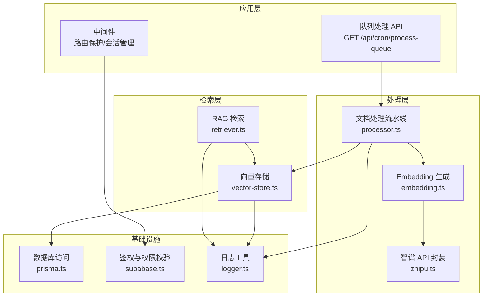
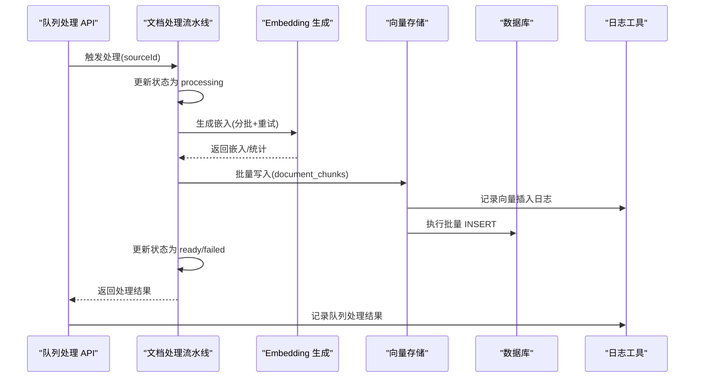
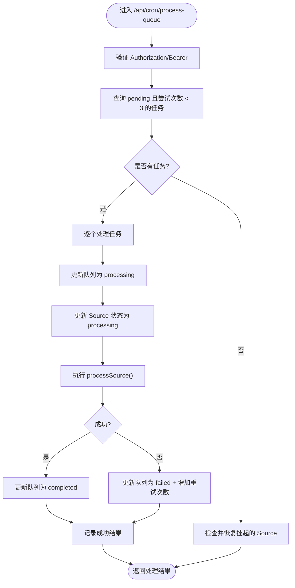
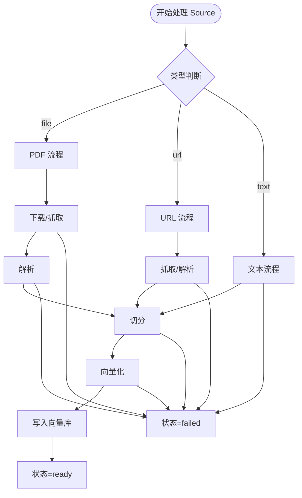
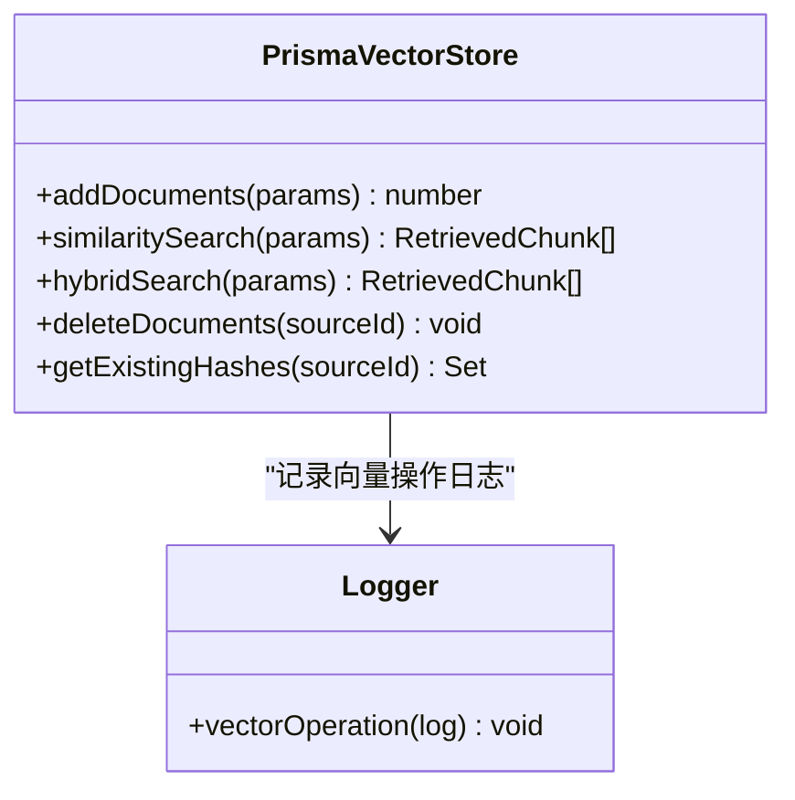
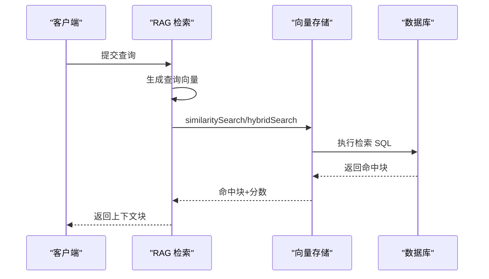
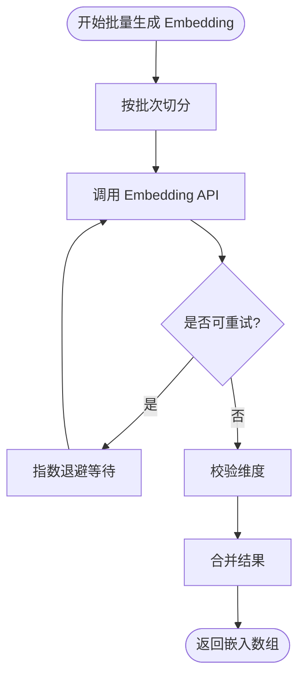
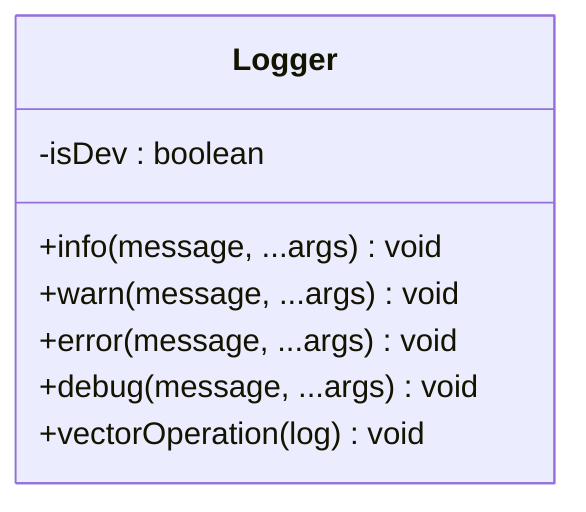
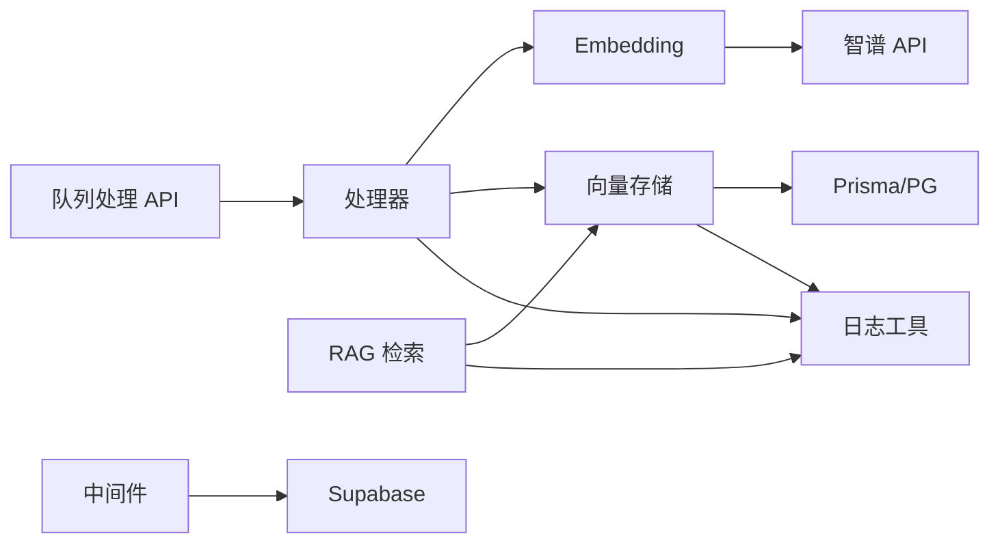

# 监控与日志

<cite>
**本文引用的文件**   
- [lib/utils/logger.ts](file://lib/utils/logger.ts)
- [app/api/cron/process-queue/route.ts](file://app/api/cron/process-queue/route.ts)
- [lib/processing/processor.ts](file://lib/processing/processor.ts)
- [lib/db/vector-store.ts](file://lib/db/vector-store.ts)
- [lib/rag/retriever.ts](file://lib/rag/retriever.ts)
- [lib/processing/embedding.ts](file://lib/processing/embedding.ts)
- [lib/ai/zhipu.ts](file://lib/ai/zhipu.ts)
- [lib/db/prisma.ts](file://lib/db/prisma.ts)
- [lib/db/supabase.ts](file://lib/db/supabase.ts)
- [middleware.ts](file://middleware.ts)
- [package.json](file://package.json)
</cite>

## 目录
1. [简介](#简介)
2. [项目结构](#项目结构)
3. [核心组件](#核心组件)
4. [架构总览](#架构总览)
5. [详细组件分析](#详细组件分析)
6. [依赖关系分析](#依赖关系分析)
7. [性能考量](#性能考量)
8. [故障排查指南](#故障排查指南)
9. [结论](#结论)
10. [附录](#附录)

## 简介
本文件面向 notebookLM-clone 项目的监控与日志系统，目标是建立一套完整的可观测性方案，覆盖以下方面：
- 监控指标体系：队列状态监控、任务执行统计、性能指标收集、错误追踪
- 日志记录策略：结构化日志格式、日志级别分类、敏感信息过滤
- 监控数据采集：Prometheus 指标暴露、APM 集成、自定义监控端点
- 告警机制设计：阈值设置、告警规则、通知渠道
- 监控仪表板设计：关键指标可视化、趋势分析、异常检测
- 日志分析工具：日志聚合、搜索查询、性能分析
- 扩展性：分布式监控、多环境部署、监控数据持久化

## 项目结构
项目采用 Next.js 14 应用，核心业务围绕“知识源处理—向量索引—RAG 检索”链路展开。监控与日志的关键落点包括：
- 统一日志工具：统一输出与结构化日志
- 处理队列 API：定时任务、重试与失败处理
- 文档处理流水线：阶段化日志与状态更新
- 向量存储：批量写入、查询与混合检索的性能与错误日志
- RAG 检索：向量与全文检索的耗时与命中情况
- Embedding 生成：批量与重试策略
- 数据库与鉴权：Prisma 连接池与 Supabase 权限校验

图表来源
- [app/api/cron/process-queue/route.ts](file://app/api/cron/process-queue/route.ts#L1-L165)
- [lib/processing/processor.ts](file://lib/processing/processor.ts#L1-L560)
- [lib/processing/embedding.ts](file://lib/processing/embedding.ts#L1-L189)
- [lib/ai/zhipu.ts](file://lib/ai/zhipu.ts#L1-L196)
- [lib/db/vector-store.ts](file://lib/db/vector-store.ts#L1-L446)
- [lib/rag/retriever.ts](file://lib/rag/retriever.ts#L1-L206)
- [lib/db/prisma.ts](file://lib/db/prisma.ts#L1-L41)
- [lib/db/supabase.ts](file://lib/db/supabase.ts#L1-L39)
- [lib/utils/logger.ts](file://lib/utils/logger.ts#L1-L98)
- [middleware.ts](file://middleware.ts#L1-L78)

章节来源
- [app/api/cron/process-queue/route.ts](file://app/api/cron/process-queue/route.ts#L1-L165)
- [lib/processing/processor.ts](file://lib/processing/processor.ts#L1-L560)
- [lib/db/vector-store.ts](file://lib/db/vector-store.ts#L1-L446)
- [lib/rag/retriever.ts](file://lib/rag/retriever.ts#L1-L206)
- [lib/processing/embedding.ts](file://lib/processing/embedding.ts#L1-L189)
- [lib/ai/zhipu.ts](file://lib/ai/zhipu.ts#L1-L196)
- [lib/db/prisma.ts](file://lib/db/prisma.ts#L1-L41)
- [lib/db/supabase.ts](file://lib/db/supabase.ts#L1-L39)
- [lib/utils/logger.ts](file://lib/utils/logger.ts#L1-L98)
- [middleware.ts](file://middleware.ts#L1-L78)

## 核心组件
- 统一日志工具：提供 info/warn/error/debug 四级日志，并内置向量操作专用日志结构，按环境控制输出。
- 队列处理 API：定时拉取待处理任务，支持手动触发与密钥验证，失败自动重试并更新状态。
- 文档处理流水线：按阶段记录处理日志（下载/抓取、解析、切分、向量化、索引），失败回滚并记录错误。
- 向量存储：批量写入、相似度检索、混合检索均记录结构化日志，包含耗时、命中数、平均相似度等。
- RAG 检索：记录向量化耗时、检索耗时、命中证据与检索类型。
- Embedding 生成：批量与指数退避重试，记录成功/跳过/令牌用量。
- 数据库与鉴权：Prisma 连接池配置与 Supabase 权限校验。

章节来源
- [lib/utils/logger.ts](file://lib/utils/logger.ts#L1-L98)
- [app/api/cron/process-queue/route.ts](file://app/api/cron/process-queue/route.ts#L1-L165)
- [lib/processing/processor.ts](file://lib/processing/processor.ts#L1-L560)
- [lib/db/vector-store.ts](file://lib/db/vector-store.ts#L1-L446)
- [lib/rag/retriever.ts](file://lib/rag/retriever.ts#L1-L206)
- [lib/processing/embedding.ts](file://lib/processing/embedding.ts#L1-L189)
- [lib/db/prisma.ts](file://lib/db/prisma.ts#L1-L41)
- [lib/db/supabase.ts](file://lib/db/supabase.ts#L1-L39)

## 架构总览
下图展示监控与日志在系统中的位置与交互：

图表来源
- [app/api/cron/process-queue/route.ts](file://app/api/cron/process-queue/route.ts#L11-L165)
- [lib/processing/processor.ts](file://lib/processing/processor.ts#L402-L420)
- [lib/processing/embedding.ts](file://lib/processing/embedding.ts#L140-L189)
- [lib/db/vector-store.ts](file://lib/db/vector-store.ts#L77-L173)
- [lib/utils/logger.ts](file://lib/utils/logger.ts#L75-L94)

## 详细组件分析

### 组件 A：队列处理与任务执行统计
- 功能要点
  - 支持 Bearer Token 与手动参数两种触发方式
  - 优先处理 ProcessingQueue 中 pending 且尝试次数小于阈值的任务
  - 每次仅处理少量任务以避免超时
  - 成功/失败分别更新队列与 Source 状态，并记录结果
- 监控指标建议
  - 队列长度：pending/processing 数量
  - 处理吞吐：单位时间处理任务数
  - 失败率：失败任务占比
  - 重试次数分布：尝试次数统计
  - 处理耗时：单任务处理时延分布
- 错误追踪
  - 记录失败原因与重试次数
  - 达到最大重试后标记 Source 为 failed

图表来源
- [app/api/cron/process-queue/route.ts](file://app/api/cron/process-queue/route.ts#L11-L165)

章节来源
- [app/api/cron/process-queue/route.ts](file://app/api/cron/process-queue/route.ts#L1-L165)

### 组件 B：文档处理流水线与阶段化日志
- 功能要点
  - 支持 PDF、URL、文本三种 Source 类型
  - 阶段化状态更新与日志记录（下载/抓取、解析、切分、向量化、索引）
  - 失败时记录错误与阶段耗时
- 监控指标建议
  - 各阶段耗时：download/fetch、parse、chunk、embed、index
  - 总耗时：单 Source 处理总时长
  - 成功率：各阶段成功/失败计数
  - 文本规模：页数、字数、块数、平均 token 数
  - Tokens 使用：估算/统计
- 错误追踪
  - 阶段错误定位与回滚
  - 失败后 Source 状态标记为 failed

图表来源
- [lib/processing/processor.ts](file://lib/processing/processor.ts#L82-L209)
- [lib/processing/processor.ts](file://lib/processing/processor.ts#L215-L397)
- [lib/processing/processor.ts](file://lib/processing/processor.ts#L426-L526)

章节来源
- [lib/processing/processor.ts](file://lib/processing/processor.ts#L1-L560)

### 组件 C：向量存储与检索日志
- 功能要点
  - 批量写入 document_chunks，带维度校验与冲突忽略
  - 相似度检索与混合检索，记录命中数、平均相似度、检索类型
  - 统一记录向量操作日志（插入/搜索/混合搜索/删除）
- 监控指标建议
  - 插入：写入条数、跳过条数、耗时
  - 搜索：命中数、平均相似度、topK、阈值
  - 混合检索：向量权重、全文权重、组合分数
- 错误追踪
  - 维度不匹配、SQL 执行异常
  - 搜索/插入失败时记录错误详情

图表来源
- [lib/db/vector-store.ts](file://lib/db/vector-store.ts#L77-L446)
- [lib/utils/logger.ts](file://lib/utils/logger.ts#L75-L94)

章节来源
- [lib/db/vector-store.ts](file://lib/db/vector-store.ts#L1-L446)
- [lib/utils/logger.ts](file://lib/utils/logger.ts#L1-L98)

### 组件 D：RAG 检索与性能指标
- 功能要点
  - 生成查询向量，支持向量/全文/混合检索
  - 记录检索耗时、向量耗时、命中证据
- 监控指标建议
  - 查询向量耗时、检索耗时、总耗时
  - 命中证据数量、检索类型分布
  - 相似度阈值与 topK 影响

图表来源
- [lib/rag/retriever.ts](file://lib/rag/retriever.ts#L53-L116)
- [lib/rag/retriever.ts](file://lib/rag/retriever.ts#L131-L206)
- [lib/db/vector-store.ts](file://lib/db/vector-store.ts#L175-L297)
- [lib/db/vector-store.ts](file://lib/db/vector-store.ts#L312-L442)

章节来源
- [lib/rag/retriever.ts](file://lib/rag/retriever.ts#L1-L206)
- [lib/db/vector-store.ts](file://lib/db/vector-store.ts#L1-L446)

### 组件 E：Embedding 生成与重试策略
- 功能要点
  - 批量调用智谱 Embedding API，支持重试与维度校验
  - 分批处理与令牌用量估算
- 监控指标建议
  - API 调用成功率、重试次数
  - 单批大小、tokens 使用量
  - 延迟分布与错误码分布

图表来源
- [lib/processing/embedding.ts](file://lib/processing/embedding.ts#L115-L134)
- [lib/processing/embedding.ts](file://lib/processing/embedding.ts#L140-L189)
- [lib/ai/zhipu.ts](file://lib/ai/zhipu.ts#L62-L101)

章节来源
- [lib/processing/embedding.ts](file://lib/processing/embedding.ts#L1-L189)
- [lib/ai/zhipu.ts](file://lib/ai/zhipu.ts#L1-L196)

### 组件 F：日志工具与结构化日志
- 功能要点
  - 四级日志：info/warn/error/debug
  - 开发环境全量输出；生产环境仅 error 输出
  - 向量操作专用日志结构：operation、sourceId、notebookId、duration、success、metadata、error
- 敏感信息过滤建议
  - 避免记录明文 API Key、用户私密内容
  - 对日志进行脱敏（如截断、掩码）

图表来源
- [lib/utils/logger.ts](file://lib/utils/logger.ts#L29-L98)

章节来源
- [lib/utils/logger.ts](file://lib/utils/logger.ts#L1-L98)

### 组件 G：数据库与鉴权
- 功能要点
  - Prisma 使用 Postgres Pool，Serverless 环境建议使用 Supabase Transaction Pooler
  - Supabase 权限校验：verifyOwnership 保障资源归属
- 监控指标建议
  - 数据库连接数、活跃连接数
  - 查询耗时分布、慢查询
  - 鉴权失败次数

章节来源
- [lib/db/prisma.ts](file://lib/db/prisma.ts#L1-L41)
- [lib/db/supabase.ts](file://lib/db/supabase.ts#L1-L39)

## 依赖关系分析
- 组件耦合
  - 队列处理 API 依赖处理器与数据库
  - 处理器依赖 Embedding 与向量存储
  - 检索模块依赖向量存储与数据库
  - 日志工具被多个组件复用
- 外部依赖
  - 智谱 AI API、PostgreSQL、Supabase
- 潜在循环依赖
  - 当前结构清晰，无明显循环导入

图表来源
- [app/api/cron/process-queue/route.ts](file://app/api/cron/process-queue/route.ts#L1-L165)
- [lib/processing/processor.ts](file://lib/processing/processor.ts#L1-L560)
- [lib/processing/embedding.ts](file://lib/processing/embedding.ts#L1-L189)
- [lib/ai/zhipu.ts](file://lib/ai/zhipu.ts#L1-L196)
- [lib/db/vector-store.ts](file://lib/db/vector-store.ts#L1-L446)
- [lib/rag/retriever.ts](file://lib/rag/retriever.ts#L1-L206)
- [lib/db/prisma.ts](file://lib/db/prisma.ts#L1-L41)
- [lib/utils/logger.ts](file://lib/utils/logger.ts#L1-L98)
- [middleware.ts](file://middleware.ts#L1-L78)
- [lib/db/supabase.ts](file://lib/db/supabase.ts#L1-L39)

章节来源
- [package.json](file://package.json#L1-L82)

## 性能考量
- 批量与分页
  - 向量存储批量插入与检索 SQL 使用 CTE 与 LIMIT，减少重复计算与 IO
  - Embedding 批次大小与令牌上限控制，避免单次请求过大
- 超时与重试
  - 队列处理每次仅处理少量任务，避免 Serverless 超时
  - Embedding 与外部 API 调用采用指数退避重试
- 连接池
  - Prisma 使用 PG Pool，Serverless 环境建议开启连接池参数
- 指标建议
  - 关键路径延迟分布、吞吐量、错误率、重试率、连接池利用率

## 故障排查指南
- 队列处理失败
  - 检查 Authorization 与 manual 参数
  - 查看失败任务的错误消息与重试次数
  - 恢复机制：扫描 pending 但不在队列中的 Source 并处理
- 处理阶段失败
  - 查看 Source processingLog 中各阶段的 timestamp、duration、error
  - 确认文本切分、向量化、索引是否成功
- 向量检索异常
  - 检查维度不匹配、阈值设置、topK 是否合理
  - 关注平均相似度与命中数
- 外部 API 错误
  - 检查智谱 API Key、网络连通性、配额限制
  - 关注重试策略与延迟

章节来源
- [app/api/cron/process-queue/route.ts](file://app/api/cron/process-queue/route.ts#L11-L165)
- [lib/processing/processor.ts](file://lib/processing/processor.ts#L198-L208)
- [lib/db/vector-store.ts](file://lib/db/vector-store.ts#L198-L202)
- [lib/rag/retriever.ts](file://lib/rag/retriever.ts#L60-L83)
- [lib/processing/embedding.ts](file://lib/processing/embedding.ts#L115-L134)
- [lib/ai/zhipu.ts](file://lib/ai/zhipu.ts#L81-L84)

## 结论
本项目已具备完善的日志与错误追踪基础，建议在此基础上补充：
- Prometheus 指标暴露与 APM 集成
- 告警规则与通知渠道配置
- 监控仪表板与日志分析工具
- 分布式监控与多环境部署策略

## 附录

### 监控指标清单（建议）
- 队列与任务
  - 队列长度（pending/processing/count）
  - 处理吞吐（任务/分钟）
  - 失败率、重试次数分布
  - 单任务处理耗时分布
- 处理流水线
  - 各阶段耗时（download/fetch、parse、chunk、embed、index）
  - 总耗时、成功率、文本规模（页数/字数/块数）
  - Tokens 使用量
- 向量与检索
  - 插入：写入条数、跳过条数、耗时
  - 搜索：命中数、平均相似度、topK、阈值
  - 混合检索：向量/全文权重、组合分数
- 外部依赖
  - Embedding API 调用成功率、延迟、错误码分布
- 数据库
  - 连接池利用率、慢查询、错误

### 日志级别与结构化字段
- 日志级别
  - info：常规运行信息
  - warn：潜在问题
  - error：错误事件
  - debug：调试信息（开发环境）
- 结构化字段（向量操作）
  - operation、sourceId、notebookId、chunkCount、duration、success、metadata、error

章节来源
- [lib/utils/logger.ts](file://lib/utils/logger.ts#L6-L27)
- [lib/utils/logger.ts](file://lib/utils/logger.ts#L75-L94)