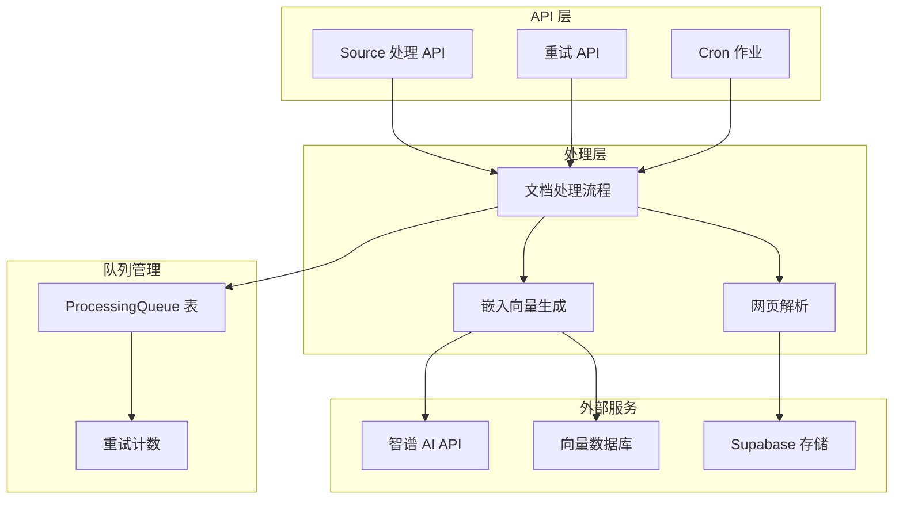
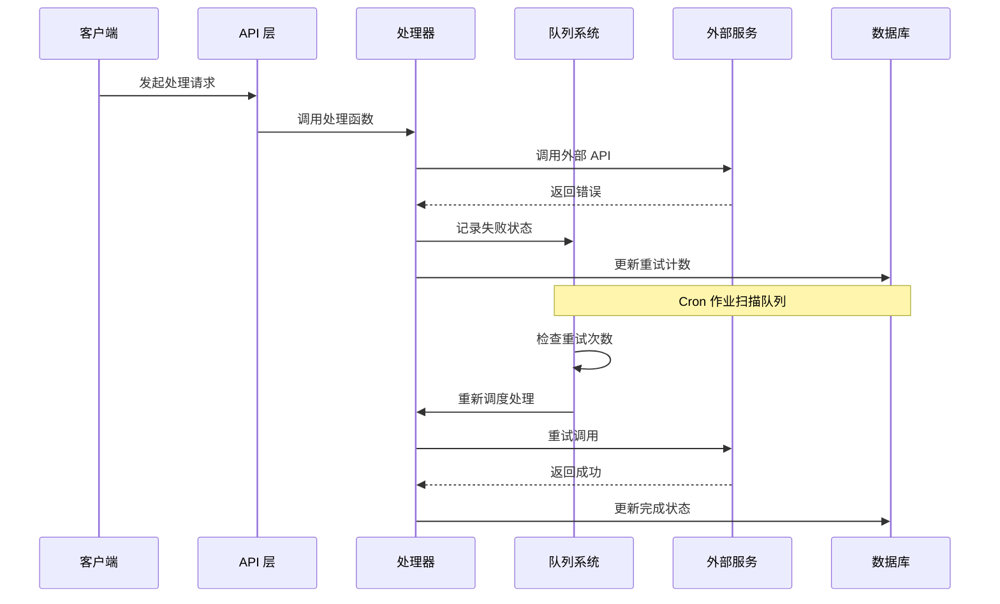
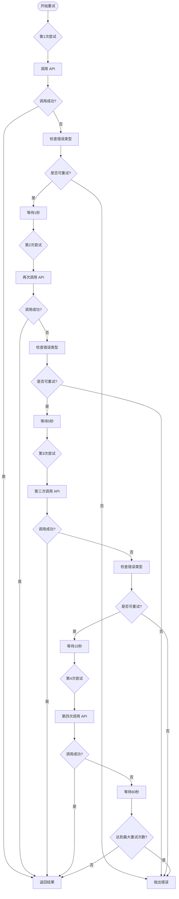
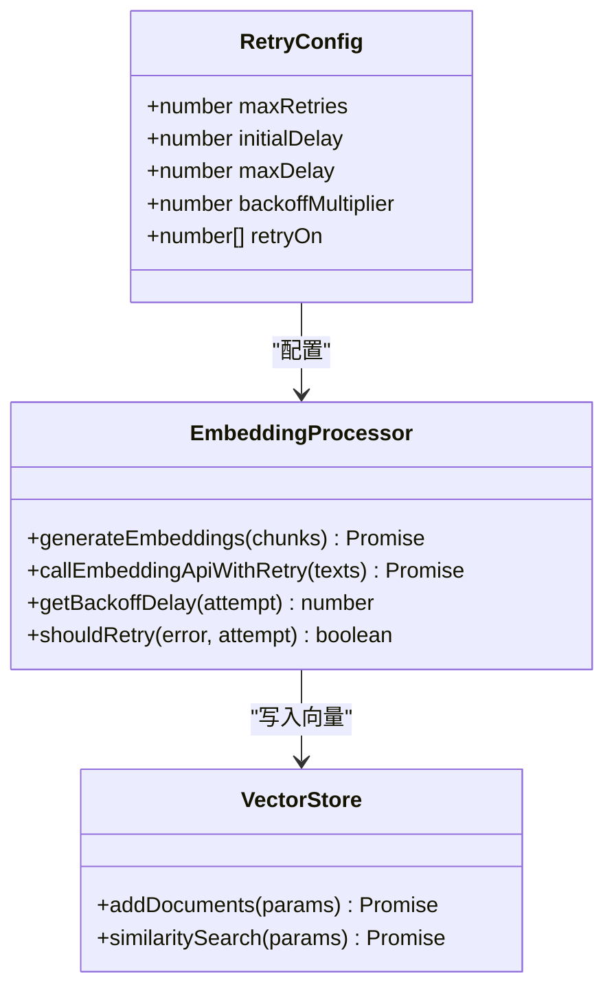
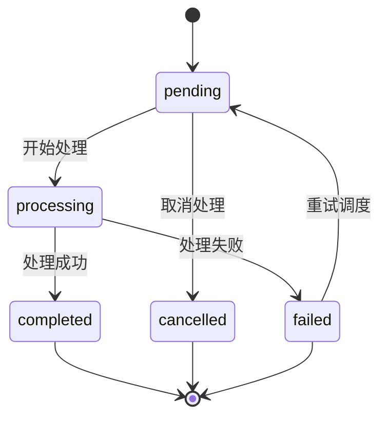
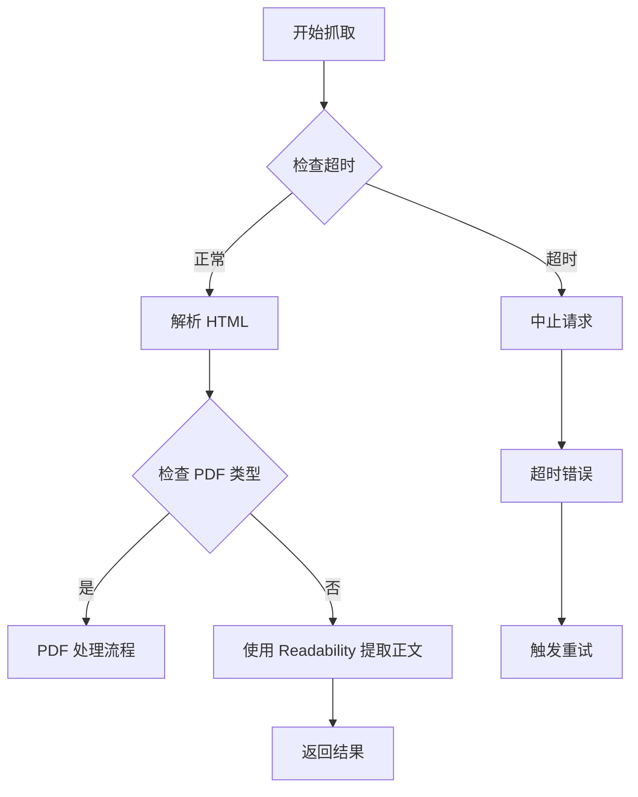
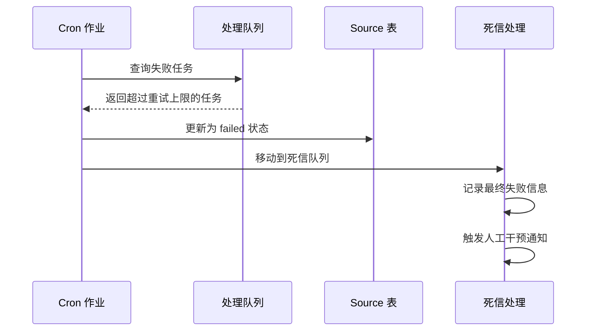
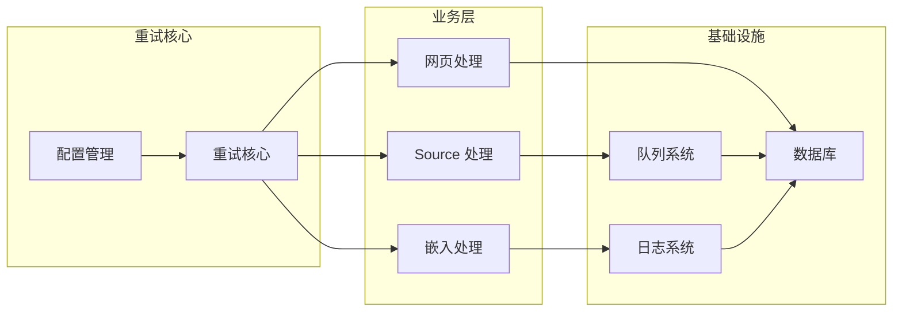
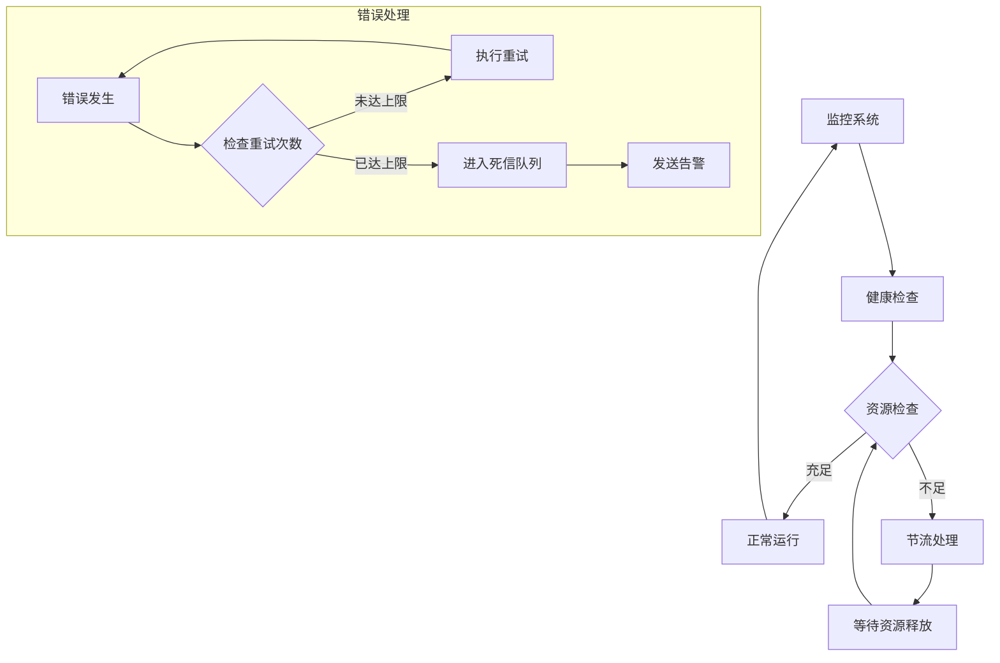
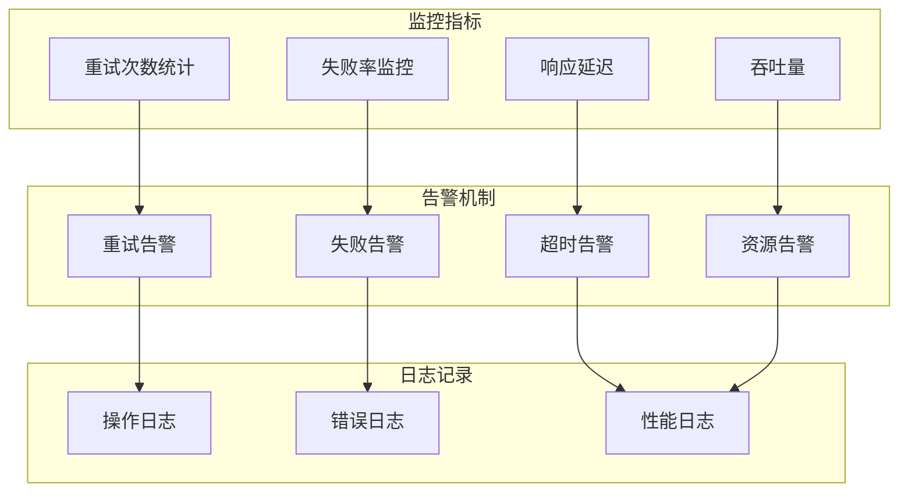

# 重试机制

<cite>
**本文档引用的文件**
- [lib/ai/zhipu.ts](file://lib/ai/zhipu.ts)
- [lib/processing/embedding.ts](file://lib/processing/embedding.ts)
- [app/api/sources/[id]/process/route.ts](file://app/api/sources/[id]/process/route.ts)
- [app/api/sources/[id]/retry/route.ts](file://app/api/sources/[id]/retry/route.ts)
- [app/api/cron/process-queue/route.ts](file://app/api/cron/process-queue/route.ts)
- [lib/processing/processor.ts](file://lib/processing/processor.ts)
- [lib/processing/web-parser.ts](file://lib/processing/web-parser.ts)
- [lib/db/vector-store.ts](file://lib/db/vector-store.ts)
- [lib/config.ts](file://lib/config.ts)
- [lib/utils/logger.ts](file://lib/utils/logger.ts)
</cite>

## 目录
1. [简介](#简介)
2. [项目结构](#项目结构)
3. [核心组件](#核心组件)
4. [架构概览](#架构概览)
5. [详细组件分析](#详细组件分析)
6. [依赖关系分析](#依赖关系分析)
7. [性能考虑](#性能考虑)
8. [故障排查指南](#故障排查指南)
9. [结论](#结论)

## 简介

notebookLM-clone 项目实现了多层次的重试机制，确保系统在面对网络异常、超时错误、临时故障和系统资源不足等情况下能够自动恢复并保持服务的稳定性。该重试机制采用指数退避算法，结合队列管理和状态跟踪，为整个文档处理流水线提供了可靠的容错能力。

## 项目结构

项目中的重试机制分布在多个层次中，形成了完整的容错体系：

**图表来源**
- [app/api/sources/[id]/process/route.ts](file://app/api/sources/[id]/process/route.ts#L1-L140)
- [lib/processing/processor.ts](file://lib/processing/processor.ts#L1-L560)
- [lib/processing/embedding.ts](file://lib/processing/embedding.ts#L1-L189)

## 核心组件

### 重试策略设计

项目实现了两种主要的重试策略：

1. **指数退避重试**：基于预定义的延迟序列进行重试
2. **队列化重试**：通过数据库队列实现持久化的重试管理

### 错误分类机制

系统能够识别和处理多种类型的错误：

- **429 限流错误**：API 请求过于频繁
- **5xx 服务器错误**：服务端临时故障
- **超时错误**：网络请求超时
- **资源不足**：系统资源暂时不可用

**章节来源**
- [lib/ai/zhipu.ts](file://lib/ai/zhipu.ts#L162-L195)
- [lib/processing/embedding.ts](file://lib/processing/embedding.ts#L12-L18)

## 架构概览

重试机制的整体架构采用了分层设计，确保每个组件都有明确的职责和边界：

**图表来源**
- [app/api/sources/[id]/process/route.ts](file://app/api/sources/[id]/process/route.ts#L119-L127)
- [app/api/cron/process-queue/route.ts](file://app/api/cron/process-queue/route.ts#L55-L107)

## 详细组件分析

### 指数退避重试实现

#### 智谱 AI API 重试封装

智谱 AI API 提供了专门的重试封装函数，实现了固定延迟序列的重试机制：

**图表来源**
- [lib/ai/zhipu.ts](file://lib/ai/zhipu.ts#L168-L195)

#### 嵌入向量生成重试机制

嵌入向量生成模块实现了更复杂的指数退避算法：

**图表来源**
- [lib/processing/embedding.ts](file://lib/processing/embedding.ts#L12-L189)
- [lib/db/vector-store.ts](file://lib/db/vector-store.ts#L77-L446)

**章节来源**
- [lib/ai/zhipu.ts](file://lib/ai/zhipu.ts#L162-L195)
- [lib/processing/embedding.ts](file://lib/processing/embedding.ts#L12-L189)

### 队列化重试管理

#### 处理队列状态管理

系统使用 ProcessingQueue 表来管理所有处理任务的状态：

#### 重试计数和状态更新

每次失败都会更新重试计数和状态信息：

**章节来源**
- [app/api/sources/[id]/process/route.ts](file://app/api/sources/[id]/process/route.ts#L44-L76)
- [app/api/cron/process-queue/route.ts](file://app/api/cron/process-queue/route.ts#L83-L106)

### 错误处理和超时控制

#### 网络超时处理

网页解析模块实现了严格的超时控制：

**图表来源**
- [lib/processing/web-parser.ts](file://lib/processing/web-parser.ts#L58-L126)

**章节来源**
- [lib/processing/web-parser.ts](file://lib/processing/web-parser.ts#L12-L126)

### 死信队列处理

系统实现了自动化的死信队列处理机制：

**图表来源**
- [app/api/cron/process-queue/route.ts](file://app/api/cron/process-queue/route.ts#L97-L103)

**章节来源**
- [app/api/cron/process-queue/route.ts](file://app/api/cron/process-queue/route.ts#L97-L103)

## 依赖关系分析

### 组件耦合度分析

重试机制的各个组件之间具有良好的内聚性和较低的耦合度：

**图表来源**
- [lib/processing/processor.ts](file://lib/processing/processor.ts#L1-L560)
- [lib/processing/embedding.ts](file://lib/processing/embedding.ts#L1-L189)

### 外部依赖关系

系统对外部服务的依赖关系清晰明确：

**章节来源**
- [lib/processing/processor.ts](file://lib/processing/processor.ts#L1-L560)
- [lib/db/vector-store.ts](file://lib/db/vector-store.ts#L1-L446)

## 性能考虑

### 资源消耗控制

系统通过多种机制控制资源消耗：

1. **批量处理优化**：嵌入向量生成支持批量处理，减少 API 调用次数
2. **内存管理**：及时清理超时的 AbortController 实例
3. **数据库连接池**：合理配置 Prisma 连接池参数

### 并发限制

系统实现了多层并发控制：

- **队列并发控制**：Cron 作业每次只处理有限数量的任务
- **API 并发限制**：智谱 AI API 重试封装限制最大重试次数
- **内存并发限制**：网页解析使用 AbortController 控制并发请求

### 系统稳定性保障

**图表来源**
- [app/api/cron/process-queue/route.ts](file://app/api/cron/process-queue/route.ts#L38-L164)

## 故障排查指南

### 常见问题诊断

#### 重试循环问题

当系统陷入无限重试循环时，可以通过以下方式诊断：

1. **检查重试配置**：确认最大重试次数和延迟设置
2. **查看队列状态**：检查 ProcessingQueue 表中的 attempts 字段
3. **分析错误日志**：查看具体的错误类型和频率

#### 超时问题排查

对于超时错误，建议检查：

1. **网络连接**：验证外部 API 的可达性
2. **超时配置**：检查网页抓取的超时设置
3. **资源限制**：监控系统资源使用情况

#### 死信队列处理

当任务进入死信队列时：

1. **人工干预**：检查具体失败原因
2. **手动重试**：通过重试 API 手动触发重试
3. **配置调整**：根据失败模式调整重试策略

**章节来源**
- [app/api/sources/[id]/retry/route.ts](file://app/api/sources/[id]/retry/route.ts#L15-L71)
- [lib/utils/logger.ts](file://lib/utils/logger.ts#L1-L97)

### 监控和告警

系统提供了完善的监控和告警机制：

**图表来源**
- [lib/utils/logger.ts](file://lib/utils/logger.ts#L75-L94)

**章节来源**
- [lib/utils/logger.ts](file://lib/utils/logger.ts#L1-L97)

## 结论

notebookLM-clone 项目的重试机制设计体现了现代分布式系统的最佳实践，通过多层次的容错设计确保了系统的稳定性和可靠性。主要特点包括：

1. **多层次重试策略**：从 API 层面的指数退避到队列层面的持久化重试
2. **智能错误分类**：能够准确识别可重试错误和永久性错误
3. **完善的监控体系**：提供全面的重试统计和告警机制
4. **资源保护机制**：通过超时控制和并发限制保护系统资源

该重试机制为 notebookLM-clone 提供了强大的容错能力，能够在面对各种异常情况时保持服务的连续性和稳定性，为用户提供了可靠的文档处理体验。