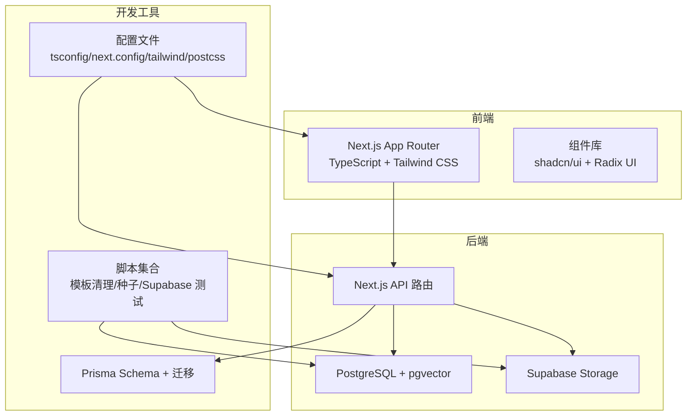
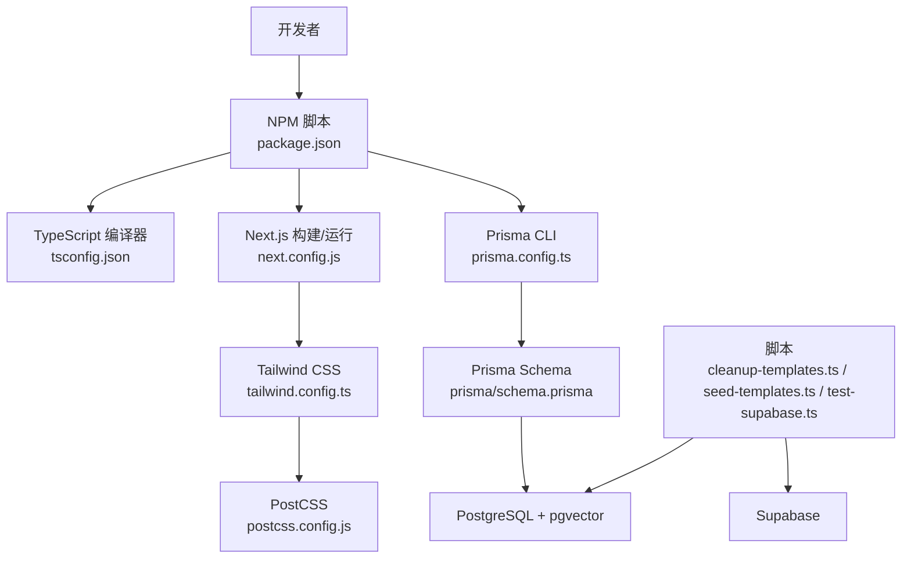
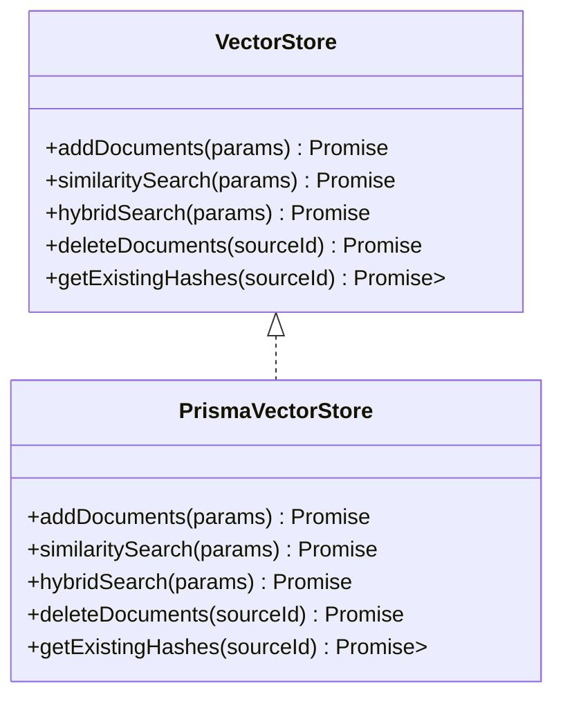
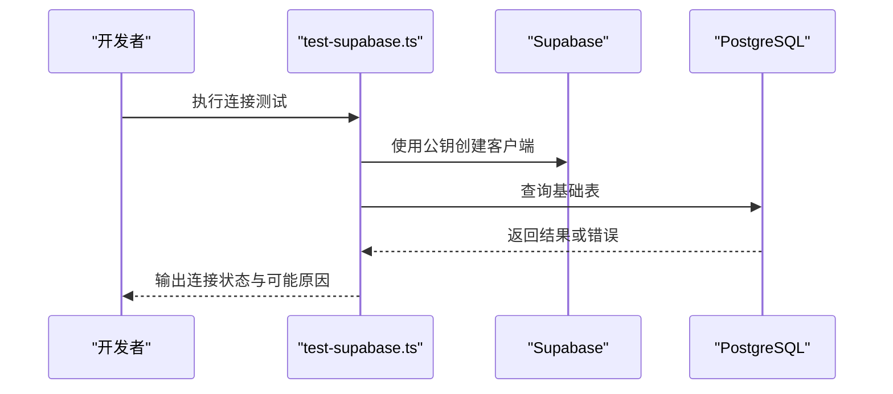
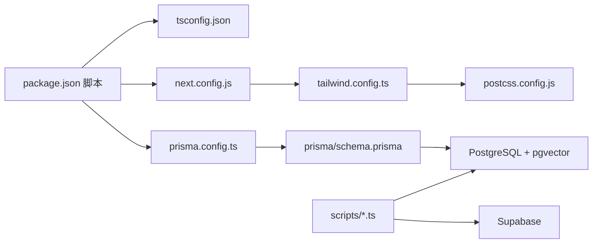

# 开发工具与脚本

<cite>
**本文引用的文件**
- [package.json](file://package.json)
- [tsconfig.json](file://tsconfig.json)
- [next.config.js](file://next.config.js)
- [prisma.config.ts](file://prisma.config.ts)
- [tailwind.config.ts](file://tailwind.config.ts)
- [postcss.config.js](file://postcss.config.js)
- [components.json](file://components.json)
- [README.md](file://README.md)
- [scripts/cleanup-templates.ts](file://scripts/cleanup-templates.ts)
- [scripts/seed-templates.ts](file://scripts/seed-templates.ts)
- [scripts/test-supabase.ts](file://scripts/test-supabase.ts)
- [prisma/schema.prisma](file://prisma/schema.prisma)
- [lib/db/prisma.ts](file://lib/db/prisma.ts)
- [lib/db/supabase.ts](file://lib/db/supabase.ts)
- [lib/db/vector-store.ts](file://lib/db/vector-store.ts)
- [lib/config.ts](file://lib/config.ts)
</cite>

## 目录
1. [简介](#简介)
2. [项目结构](#项目结构)
3. [核心组件](#核心组件)
4. [架构总览](#架构总览)
5. [详细组件分析](#详细组件分析)
6. [依赖关系分析](#依赖关系分析)
7. [性能考量](#性能考量)
8. [故障排除指南](#故障排除指南)
9. [结论](#结论)
10. [附录](#附录)

## 简介
本文件面向 notebookLM-clone 项目的开发者，系统化梳理开发工具与脚本，覆盖以下主题：
- 开发环境配置：IDE 设置、调试配置、代码格式化与 Lint 规则
- 数据库迁移工具：Prisma 迁移管理、种子数据脚本、数据库版本控制
- 测试脚本设计与实现：单元测试、集成测试与端到端测试的执行
- 开发工具链：TypeScript 配置、构建工具配置与打包优化
- 自动化脚本：模板清理、Supabase 测试与部署脚本
- 开发流程最佳实践：分支管理、代码审查与持续集成
- 故障排除：常见问题、性能调试与工具配置优化
- 扩展与定制：如何为团队建立高效开发工作流

## 项目结构
该项目采用 Next.js 14 App Router + TypeScript + Tailwind CSS + shadcn/ui + Radix UI 的前端技术栈；后端数据层结合 Supabase（Postgres + Storage）与 Prisma（业务表与迁移），向量检索基于 pgvector。

图表来源
- [next.config.js](file://next.config.js#L1-L21)
- [prisma/schema.prisma](file://prisma/schema.prisma#L1-L140)
- [lib/db/prisma.ts](file://lib/db/prisma.ts#L1-L41)
- [lib/db/supabase.ts](file://lib/db/supabase.ts#L1-L39)
- [lib/db/vector-store.ts](file://lib/db/vector-store.ts#L1-L446)
- [scripts/cleanup-templates.ts](file://scripts/cleanup-templates.ts#L1-L24)
- [scripts/seed-templates.ts](file://scripts/seed-templates.ts#L1-L86)
- [scripts/test-supabase.ts](file://scripts/test-supabase.ts#L1-L40)
- [tsconfig.json](file://tsconfig.json#L1-L28)
- [tailwind.config.ts](file://tailwind.config.ts#L1-L95)
- [postcss.config.js](file://postcss.config.js#L1-L7)

章节来源
- [README.md](file://README.md#L1-L141)

## 核心组件
- 开发脚本与命令
  - 通过包管理脚本统一管理开发、构建、类型检查、Prisma 生成与迁移、数据库 Studio 启动等任务
- TypeScript 配置
  - 严格模式、增量编译、路径别名、Bundler 模块解析等
- Next.js 配置
  - React Strict Mode、图片域名与远程模式、Server Actions 体限制
- Tailwind CSS 与 PostCSS
  - 主题扩展、动画、插件、内容扫描范围
- Prisma 配置
  - Schema、迁移路径、数据源 URL（通过环境变量）
- 数据库访问与向量检索
  - Prisma + PostgreSQL + pgvector，提供相似度搜索与混合检索能力
- Supabase 集成
  - 认证与权限校验、客户端封装

章节来源
- [package.json](file://package.json#L5-L16)
- [tsconfig.json](file://tsconfig.json#L2-L24)
- [next.config.js](file://next.config.js#L2-L18)
- [tailwind.config.ts](file://tailwind.config.ts#L3-L92)
- [postcss.config.js](file://postcss.config.js#L1-L7)
- [prisma.config.ts](file://prisma.config.ts#L6-L19)
- [lib/db/prisma.ts](file://lib/db/prisma.ts#L1-L41)
- [lib/db/vector-store.ts](file://lib/db/vector-store.ts#L77-L446)
- [lib/db/supabase.ts](file://lib/db/supabase.ts#L1-L39)

## 架构总览
下图展示开发工具与脚本在整体架构中的位置与交互关系。

图表来源
- [package.json](file://package.json#L5-L16)
- [tsconfig.json](file://tsconfig.json#L2-L24)
- [next.config.js](file://next.config.js#L2-L18)
- [tailwind.config.ts](file://tailwind.config.ts#L3-L92)
- [postcss.config.js](file://postcss.config.js#L1-L7)
- [prisma.config.ts](file://prisma.config.ts#L6-L19)
- [prisma/schema.prisma](file://prisma/schema.prisma#L1-L140)
- [scripts/cleanup-templates.ts](file://scripts/cleanup-templates.ts#L1-L24)
- [scripts/seed-templates.ts](file://scripts/seed-templates.ts#L1-L86)
- [scripts/test-supabase.ts](file://scripts/test-supabase.ts#L1-L40)

## 详细组件分析

### 开发脚本与命令
- 开发与构建
  - 启动开发服务器、构建应用、启动生产服务器
- 质量检查
  - ESLint Lint、TypeScript 类型检查
- Prisma 相关
  - 生成客户端、推送模式、创建迁移、启动 Studio、生成客户端
- 环境初始化
  - README 提供了完整的初始化步骤与常用命令

章节来源
- [package.json](file://package.json#L5-L16)
- [README.md](file://README.md#L106-L122)

### TypeScript 配置
- 编译选项
  - 目标版本、库、严格模式、禁止 emit、模块解析策略、路径映射、插件启用等
- 包含与排除
  - 显式包含 Next 类型与所有 ts/tsx 文件，排除 node_modules

章节来源
- [tsconfig.json](file://tsconfig.json#L2-L26)

### Next.js 配置
- React Strict Mode
- 图片安全策略：本地域名与 Supabase 远程模式
- Server Actions 体大小限制以支持大文件上传
- 通过实验性配置启用相关能力

章节来源
- [next.config.js](file://next.config.js#L2-L18)

### Tailwind CSS 与 PostCSS
- Tailwind 配置
  - 深色模式、内容扫描范围、主题扩展（颜色、动画、keyframes、圆角）、插件启用
- PostCSS 配置
  - 启用 Tailwind CSS 与 Autoprefixer

章节来源
- [tailwind.config.ts](file://tailwind.config.ts#L3-L92)
- [postcss.config.js](file://postcss.config.js#L1-L7)

### Prisma 配置与迁移
- 配置文件
  - 读取 .env.local，指定 schema 与迁移目录，数据源 URL 来自环境变量
- Schema 设计
  - 核心业务表（Notebook、Source、Message、Artifact、PromptTemplate）
  - 处理队列表（ProcessingQueue）
  - 向量表 document_chunks 通过 SQL 迁移创建
- 迁移管理
  - 使用 Prisma CLI 创建迁移，配合数据库版本控制
- 数据库连接
  - 通过 Prisma + PostgreSQL + pgvector 实现向量检索与混合检索

章节来源
- [prisma.config.ts](file://prisma.config.ts#L6-L19)
- [prisma/schema.prisma](file://prisma/schema.prisma#L1-L140)
- [lib/db/prisma.ts](file://lib/db/prisma.ts#L1-L41)
- [lib/db/vector-store.ts](file://lib/db/vector-store.ts#L77-L446)

### Supabase 集成与权限校验
- 服务端获取当前用户 ID
- 资源所有权验证（抛出未登录或无权访问错误）
- 重新导出客户端封装（浏览器/服务端）

章节来源
- [lib/db/supabase.ts](file://lib/db/supabase.ts#L1-L39)

### 向量存储与检索
- 接口与实现
  - 支持批量插入、相似度搜索、混合检索、删除与去重哈希查询
- 批处理与性能
  - 批量插入大小限制、CTE 避免重复计算、日志记录
- 维度一致性
  - 启动时强制校验 EMBEDDING_DIM，确保与数据库向量维度一致

图表来源
- [lib/db/vector-store.ts](file://lib/db/vector-store.ts#L24-L75)
- [lib/db/vector-store.ts](file://lib/db/vector-store.ts#L77-L446)

章节来源
- [lib/db/vector-store.ts](file://lib/db/vector-store.ts#L77-L446)
- [lib/config.ts](file://lib/config.ts#L6-L29)

### 自动化脚本
- 模板清理脚本
  - 删除旧系统模板，避免冲突与冗余
- 种子模板脚本
  - 同步系统模板（Upsert），固定 UUID 确保幂等
- Supabase 连接测试脚本
  - 基础连通性测试与常见错误提示

图表来源
- [scripts/test-supabase.ts](file://scripts/test-supabase.ts#L17-L37)

章节来源
- [scripts/cleanup-templates.ts](file://scripts/cleanup-templates.ts#L1-L24)
- [scripts/seed-templates.ts](file://scripts/seed-templates.ts#L1-L86)
- [scripts/test-supabase.ts](file://scripts/test-supabase.ts#L1-L40)

### 配置与工具链
- shadcn/ui 配置
  - 样式风格、RSC、TSX、Tailwind 配置、CSS 变量、图标库、别名映射
- 模型与应用配置
  - 向量维度校验、模型提供商配置、Studio 默认模型、应用参数与环境变量校验

章节来源
- [components.json](file://components.json#L1-L23)
- [lib/config.ts](file://lib/config.ts#L6-L29)
- [lib/config.ts](file://lib/config.ts#L169-L187)

## 依赖关系分析
- 开发脚本对工具链的依赖
  - NPM 脚本驱动 TypeScript、ESLint、Next.js、Prisma CLI、Tailwind CSS
- 工具链对配置文件的依赖
  - tsconfig.json 影响编译行为；next.config.js 影响运行时行为；tailwind/postcss 配置影响样式输出
- 数据层依赖
  - Prisma 依赖数据库连接；向量检索依赖 pgvector；Supabase 依赖认证与存储

图表来源
- [package.json](file://package.json#L5-L16)
- [tsconfig.json](file://tsconfig.json#L2-L24)
- [next.config.js](file://next.config.js#L2-L18)
- [prisma.config.ts](file://prisma.config.ts#L6-L19)
- [prisma/schema.prisma](file://prisma/schema.prisma#L1-L140)
- [tailwind.config.ts](file://tailwind.config.ts#L3-L92)
- [postcss.config.js](file://postcss.config.js#L1-L7)
- [scripts/cleanup-templates.ts](file://scripts/cleanup-templates.ts#L1-L24)
- [scripts/seed-templates.ts](file://scripts/seed-templates.ts#L1-L86)
- [scripts/test-supabase.ts](file://scripts/test-supabase.ts#L1-L40)

章节来源
- [package.json](file://package.json#L5-L16)
- [tsconfig.json](file://tsconfig.json#L2-L24)
- [next.config.js](file://next.config.js#L2-L18)
- [prisma.config.ts](file://prisma.config.ts#L6-L19)
- [prisma/schema.prisma](file://prisma/schema.prisma#L1-L140)
- [tailwind.config.ts](file://tailwind.config.ts#L3-L92)
- [postcss.config.js](file://postcss.config.js#L1-L7)
- [scripts/cleanup-templates.ts](file://scripts/cleanup-templates.ts#L1-L24)
- [scripts/seed-templates.ts](file://scripts/seed-templates.ts#L1-L86)
- [scripts/test-supabase.ts](file://scripts/test-supabase.ts#L1-L40)

## 性能考量
- 向量检索优化
  - 批量插入与分批处理，降低单次事务压力
  - 使用 CTE 减少重复计算，提升相似度与混合检索性能
  - 统一使用简单分词器支持多语言 FTS
- 连接与日志
  - 开发环境开启 Prisma 日志，生产关闭以减少开销
  - 通过日志记录操作耗时、成功率与统计指标，便于定位瓶颈
- 构建与运行
  - Next.js Server Actions 体大小限制适配大文件上传场景
  - Tailwind 内容扫描范围明确，避免不必要的样式扫描

章节来源
- [lib/db/vector-store.ts](file://lib/db/vector-store.ts#L105-L173)
- [lib/db/vector-store.ts](file://lib/db/vector-store.ts#L204-L296)
- [lib/db/vector-store.ts](file://lib/db/vector-store.ts#L349-L429)
- [lib/db/prisma.ts](file://lib/db/prisma.ts#L33-L34)
- [next.config.js](file://next.config.js#L13-L17)
- [tailwind.config.ts](file://tailwind.config.ts#L5-L9)

## 故障排除指南
- Supabase 连接失败
  - 症状：查询报错或连接异常
  - 可能原因：数据库表未创建、API Key 不正确、URL 不正确
  - 解决：先执行数据库迁移，核对 .env.local 中的 URL 与 Key
- Prisma 迁移问题
  - 症状：迁移失败或客户端不匹配
  - 解决：确认 DIRECT_URL/DATABASE_URL 正确，使用 Prisma CLI 生成客户端与迁移
- 向量维度不一致
  - 症状：启动时报维度错误或运行时报错
  - 解决：确保 EMBEDDING_DIM 与数据库向量维度一致，必要时重建向量表
- 权限与资源归属
  - 症状：无权访问资源或未登录
  - 解决：调用所有权校验函数，确保当前用户与资源所有者一致

章节来源
- [scripts/test-supabase.ts](file://scripts/test-supabase.ts#L22-L29)
- [README.md](file://README.md#L95-L105)
- [lib/config.ts](file://lib/config.ts#L19-L29)
- [lib/db/supabase.ts](file://lib/db/supabase.ts#L26-L32)

## 结论
本文件系统化梳理了 notebookLM-clone 的开发工具与脚本，涵盖开发环境配置、数据库迁移与版本控制、测试脚本、工具链配置、自动化脚本、性能优化与故障排除。建议团队在日常开发中遵循统一的脚本命令、严格的类型与 Lint 规范、完善的迁移与种子脚本，以及清晰的权限与资源归属校验，以保障系统的稳定性与可维护性。

## 附录
- 开发流程最佳实践
  - 分支管理：主干稳定、特性分支、小步快跑
  - 代码审查：强制审查、关注安全性与性能
  - 持续集成：自动化 Lint、类型检查、迁移与数据库测试
- 扩展与定制建议
  - 将常用命令封装为 Makefile 或一键脚本
  - 增加单元测试与集成测试覆盖率，尤其是向量检索与处理队列
  - 为不同环境（本地/预发布/生产）提供独立的 .env.local 与 Prisma 配置