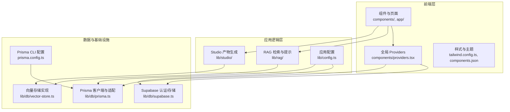
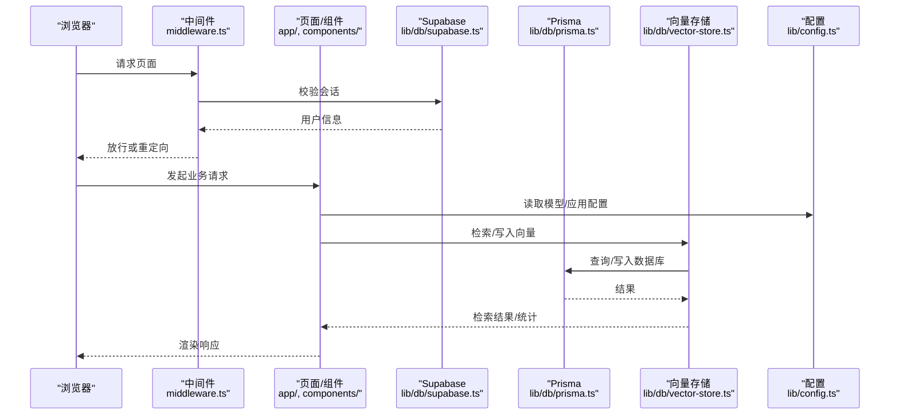
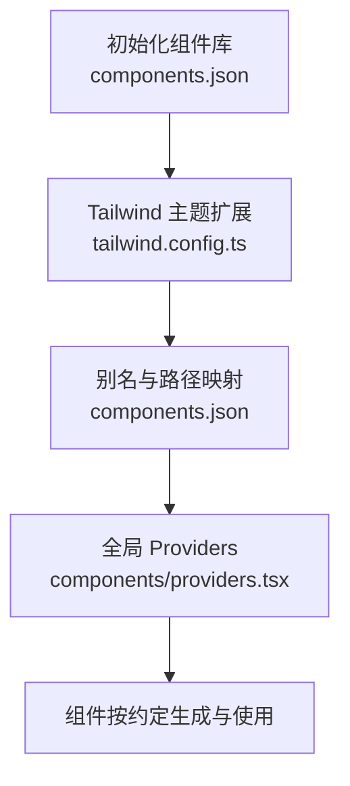
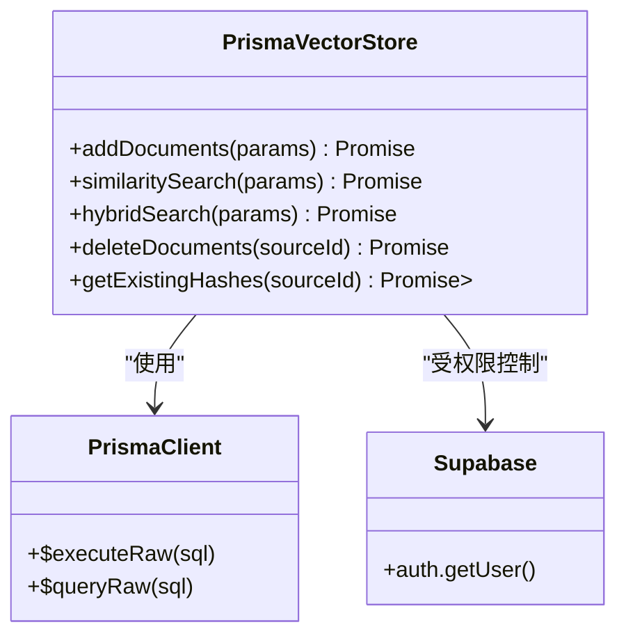
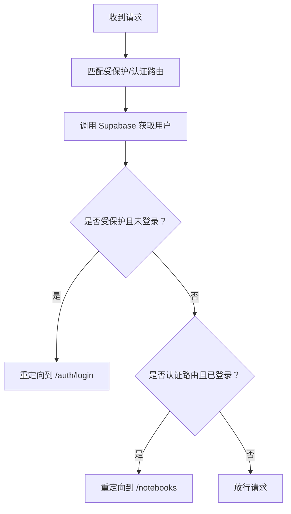
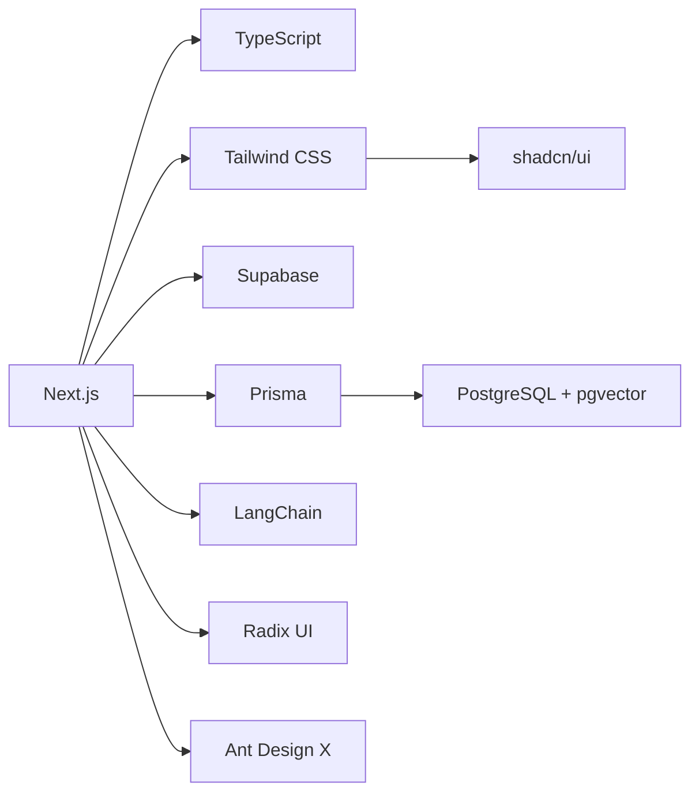

# 开发流程与最佳实践

<cite>
**本文引用的文件**
- [package.json](file://package.json)
- [pnpm-lock.yaml](file://pnpm-lock.yaml)
- [next.config.js](file://next.config.js)
- [tailwind.config.ts](file://tailwind.config.ts)
- [components.json](file://components.json)
- [tsconfig.json](file://tsconfig.json)
- [postcss.config.js](file://postcss.config.js)
- [README.md](file://README.md)
- [lib/config.ts](file://lib/config.ts)
- [middleware.ts](file://middleware.ts)
- [prisma.config.ts](file://prisma.config.ts)
- [components/providers.tsx](file://components/providers.tsx)
- [lib/db/prisma.ts](file://lib/db/prisma.ts)
- [lib/db/supabase.ts](file://lib/db/supabase.ts)
- [lib/db/vector-store.ts](file://lib/db/vector-store.ts)
- [lib/rag/index.ts](file://lib/rag/index.ts)
- [lib/studio/index.ts](file://lib/studio/index.ts)
</cite>

## 目录
1. [简介](#简介)
2. [项目结构](#项目结构)
3. [核心组件](#核心组件)
4. [架构总览](#架构总览)
5. [详细组件分析](#详细组件分析)
6. [依赖分析](#依赖分析)
7. [性能考虑](#性能考虑)
8. [故障排查指南](#故障排查指南)
9. [结论](#结论)
10. [附录](#附录)

## 简介
本文件面向 notebookLM-clone 项目的开发团队，系统性梳理从分支管理、提交规范、代码审查到依赖管理、组件库配置、开发工作流自动化、团队协作与效率提升、质量保障等全流程最佳实践。目标是帮助新成员快速上手，同时为长期演进提供可遵循的工程化标准。

## 项目结构
该项目采用 Next.js 14 App Router + TypeScript + Tailwind CSS + shadcn/ui + Radix UI + Supabase + Prisma + RAG 的技术栈组合，围绕“Notebook 知识库 + Sources 导入 + 向量化检索 + Studio 结构化产物”的主业务闭环组织代码。

图表来源
- [components/providers.tsx](file://components/providers.tsx#L1-L34)
- [lib/db/prisma.ts](file://lib/db/prisma.ts#L1-L41)
- [lib/db/supabase.ts](file://lib/db/supabase.ts#L1-L39)
- [lib/db/vector-store.ts](file://lib/db/vector-store.ts#L1-L446)
- [lib/rag/index.ts](file://lib/rag/index.ts#L1-L24)
- [lib/studio/index.ts](file://lib/studio/index.ts#L1-L25)
- [lib/config.ts](file://lib/config.ts#L1-L187)
- [prisma.config.ts](file://prisma.config.ts#L1-L20)

章节来源
- [README.md](file://README.md#L42-L49)

## 核心组件
- 应用配置与模型选择：负责环境变量校验、模型提供商配置、应用参数（最大文件大小、分块大小、TopK、相似度阈值）等。
- 全局 Providers：整合 Ant Design X 与 shadcn/ui 的主题与国际化，确保 UI 组件的一致性。
- 数据层：Prisma 客户端与 PostgreSQL 适配，Supabase 认证与权限校验，向量存储（pgvector）封装。
- RAG 检索：向量检索、混合检索（向量 + FTS）、去重与上下文构建。
- Studio 产物：根据模板或直接生成结构化产物（测验、思维导图等），并提供解析与容错。

章节来源
- [lib/config.ts](file://lib/config.ts#L1-L187)
- [components/providers.tsx](file://components/providers.tsx#L1-L34)
- [lib/db/prisma.ts](file://lib/db/prisma.ts#L1-L41)
- [lib/db/supabase.ts](file://lib/db/supabase.ts#L1-L39)
- [lib/db/vector-store.ts](file://lib/db/vector-store.ts#L1-L446)
- [lib/rag/index.ts](file://lib/rag/index.ts#L1-L24)
- [lib/studio/index.ts](file://lib/studio/index.ts#L1-L25)

## 架构总览
下图展示从浏览器到数据库与外部模型服务的整体调用路径，强调鉴权中间件、数据访问层与检索/生成模块之间的边界。

图表来源
- [middleware.ts](file://middleware.ts#L1-L78)
- [lib/db/supabase.ts](file://lib/db/supabase.ts#L1-L39)
- [lib/db/prisma.ts](file://lib/db/prisma.ts#L1-L41)
- [lib/db/vector-store.ts](file://lib/db/vector-store.ts#L1-L446)
- [lib/config.ts](file://lib/config.ts#L1-L187)

## 详细组件分析

### 组件库配置：shadcn/ui 与 Ant Design X
- 安装与初始化：通过组件库配置文件声明主题风格、Tailwind 集成、别名映射与图标库，确保组件按约定生成与导入。
- 主题一致性：全局 Providers 将 Ant Design X 与 shadcn/ui 的主题色与圆角统一，避免视觉割裂。
- 自定义组件开发：遵循组件库约定，使用 Tailwind 扩展与 CSS 变量，保证暗色模式与动画效果一致。

图表来源
- [components.json](file://components.json#L1-L23)
- [tailwind.config.ts](file://tailwind.config.ts#L1-L95)
- [components/providers.tsx](file://components/providers.tsx#L1-L34)

章节来源
- [components.json](file://components.json#L1-L23)
- [tailwind.config.ts](file://tailwind.config.ts#L1-L95)
- [components/providers.tsx](file://components/providers.tsx#L1-L34)

### 依赖管理与版本锁定：PNPM
- 包管理器：使用 PNPM，脚本中通过 npm run 方式调用，但锁文件为 pnpm-lock.yaml，确保跨平台一致性。
- 版本锁定：以 pnpm-lock.yaml 为准，避免因 package-lock.json 不一致导致的依赖漂移。
- 依赖更新策略：建议采用受控更新（小步快跑），先在隔离分支验证，再合并到主干；对关键依赖（Next.js、Prisma、LangChain 等）进行灰度发布。

章节来源
- [package.json](file://package.json#L1-L82)
- [pnpm-lock.yaml](file://pnpm-lock.yaml#L1-L800)

### 开发工作流自动化：格式化、Lint、类型检查与构建
- Lint：使用 ESLint（Next.js 配置），建议在提交前执行 npm run lint，并结合编辑器自动修复。
- 类型检查：通过 npm run type-check 确保 TS 类型安全，避免运行时隐患。
- 构建与启动：npm run build 与 npm run start，配合 Next.js 的实验特性（如大文件上传限制）。
- Prisma：通过 npm run db:* 系列命令进行迁移、生成与 Studio 调试。

章节来源
- [package.json](file://package.json#L5-L16)
- [next.config.js](file://next.config.js#L1-L21)
- [README.md](file://README.md#L106-L122)

### 数据层与检索：Prisma + pgvector + 混合检索
- 连接池与适配：使用 PrismaPg 适配 PostgreSQL，开发环境启用更详细的日志，生产关闭冗余日志。
- 向量存储：封装批量插入、相似度检索、混合检索（向量 + FTS），并记录操作日志以便追踪性能与异常。
- 权限校验：所有 API 调用前通过 Supabase 校验用户身份与资源归属，防止越权访问。

图表来源
- [lib/db/vector-store.ts](file://lib/db/vector-store.ts#L77-L446)
- [lib/db/prisma.ts](file://lib/db/prisma.ts#L1-L41)
- [lib/db/supabase.ts](file://lib/db/supabase.ts#L1-L39)

章节来源
- [lib/db/prisma.ts](file://lib/db/prisma.ts#L1-L41)
- [lib/db/vector-store.ts](file://lib/db/vector-store.ts#L1-L446)
- [lib/db/supabase.ts](file://lib/db/supabase.ts#L1-L39)

### 路由保护与会话管理：中间件
- 受保护路由：/notebooks 等需登录访问。
- 登录页保护：已登录用户不应访问 /auth/login。
- 会话刷新：通过 Supabase SSR 客户端刷新用户状态，必要时重定向并携带过期提示参数。

图表来源
- [middleware.ts](file://middleware.ts#L15-L71)

章节来源
- [middleware.ts](file://middleware.ts#L1-L78)

### 应用配置与模型选择
- 环境变量校验：启动时强制校验关键变量，避免运行时错误。
- 模型提供商：支持智谱与 LongCat，提供模型列表与默认配置，Studio 默认使用 LongCat。
- 应用参数：统一的最大文件大小、分块大小、TopK、相似度阈值，便于性能与成本平衡。

章节来源
- [lib/config.ts](file://lib/config.ts#L1-L187)

### Studio 产物生成与解析
- 生成：根据模板或直接生成结构化产物（JSON/Markdown），支持解析与容错。
- 内容统计与估算：提供源内容智能提取、Map-Reduce 内容聚合、Token 估算与统计。

章节来源
- [lib/studio/index.ts](file://lib/studio/index.ts#L1-L25)

## 依赖分析
- 前端框架与构建：Next.js 14（App Router）、TypeScript、Tailwind CSS。
- UI 生态：shadcn/ui + Radix UI + Ant Design X（国际化与主题）。
- 数据与认证：Supabase（Auth/Storage/Postgres）、Prisma（客户端与适配）。
- 检索与嵌入：pgvector 向量检索 + SQL/RPC、文本切分与嵌入。
- 工具与生态：ESLint、PostCSS、Autoprefixer、LangChain、Zustand 状态管理等。

图表来源
- [package.json](file://package.json#L17-L80)
- [next.config.js](file://next.config.js#L1-L21)
- [tailwind.config.ts](file://tailwind.config.ts#L1-L95)
- [components.json](file://components.json#L1-L23)

章节来源
- [package.json](file://package.json#L1-L82)

## 性能考虑
- 向量检索性能
  - 批量插入：分批（每批上限）写入，减少单次事务压力。
  - CTE 与联合查询：避免重复计算，优先使用向量相似度与 FTS 的组合评分。
  - 索引与阈值：合理设置 TopK 与相似度阈值，降低返回集规模。
- 数据库连接
  - 使用连接池（PrismaPg + Pool），开发环境开启日志，生产关闭冗余日志。
- 构建与传输
  - 图片域名与远程模式白名单，限制不必要的外链加载。
  - 服务器动作体大小限制，满足大文件上传场景。

章节来源
- [lib/db/vector-store.ts](file://lib/db/vector-store.ts#L8-L173)
- [lib/db/vector-store.ts](file://lib/db/vector-store.ts#L175-L297)
- [lib/db/vector-store.ts](file://lib/db/vector-store.ts#L312-L442)
- [lib/db/prisma.ts](file://lib/db/prisma.ts#L1-L41)
- [next.config.js](file://next.config.js#L13-L17)

## 故障排查指南
- 环境变量缺失
  - 启动时报错缺少必要变量，检查 .env.local 是否存在并包含必需字段。
- 向量维度不一致
  - 系统强制校验 EMBEDDING_DIM，若与数据库不一致会抛错；需调整配置或重建向量表。
- 权限校验失败
  - 未登录或越权访问会触发错误；确认登录态与资源归属校验逻辑。
- 数据库连接问题
  - 开发环境日志开启，定位连接池与 SQL 执行异常；生产环境关注错误级别。
- 中间件重定向循环
  - 检查受保护路由与登录页判定逻辑，确保会话刷新后正确跳转。

章节来源
- [lib/config.ts](file://lib/config.ts#L169-L187)
- [lib/config.ts](file://lib/config.ts#L9-L29)
- [lib/db/supabase.ts](file://lib/db/supabase.ts#L22-L33)
- [lib/db/prisma.ts](file://lib/db/prisma.ts#L31-L34)
- [middleware.ts](file://middleware.ts#L55-L68)

## 结论
本项目在工程化方面具备清晰的层次划分与完善的基础设施：统一的 UI 组件库、严格的配置与权限校验、可扩展的数据层与检索能力。建议团队在后续迭代中持续完善自动化流程（CI/CD、安全扫描、覆盖率）、文档与知识沉淀，并保持依赖的可控更新节奏，以确保长期可维护性与稳定性。

## 附录

### 分支管理策略
- 主干保护：master/main 作为发布基线，禁止直接推送。
- 功能分支：feature/*，完成评审后合并至 develop。
- 预发布分支：release/*，用于最终验证与热修复。
- 热修复分支：hotfix/*，紧急修复后回并至 master 与 develop。

### 提交规范
- 标准格式：type(scope): subject
  - 示例：feat(studio): 增加模板解析功能
- 类型建议：feat、fix、docs、style、refactor、perf、test、chore
- 说明：简短描述 + 详细说明（必要时），引用 Issue 或 PR 链接。

### 代码审查流程
- 自检清单：通过 Lint、类型检查、单元/集成测试。
- 评审要点：架构影响、安全性、性能、可维护性、文档与注释。
- 合并策略：至少一名维护者批准，冲突解决后方可合并。

### 依赖更新策略
- 受控更新：小步快跑，先在隔离分支验证，再合并到主干。
- 关键依赖：Next.js、Prisma、LangChain、Supabase 等需灰度发布。
- 锁定策略：以 pnpm-lock.yaml 为准，避免 package-lock.json 干扰。

### 开发效率提升
- IDE 配置：启用 ESLint、TypeScript 自动修复、保存即格式化。
- 快捷键：常用操作（格式化、跳转定义/引用、查找/替换）建立快捷键。
- 工具推荐：Git 图形化工具、终端增强、数据库可视化（Prisma Studio）。

### 质量保证
- 代码覆盖率：为关键模块（RAG、向量检索、权限校验）设定阈值。
- 性能测试：对批量插入、相似度检索、混合检索进行基准测试。
- 安全扫描：定期扫描依赖漏洞，修复高危与严重风险。