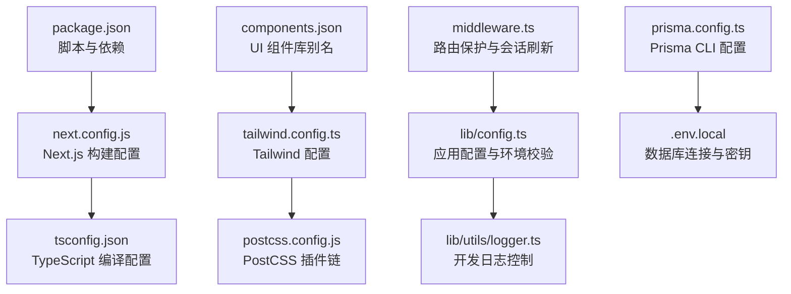
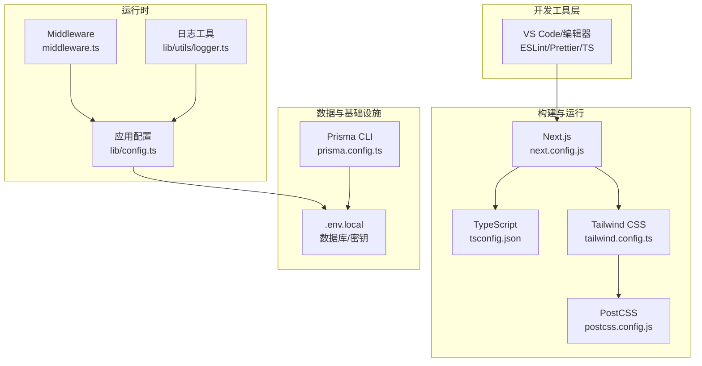
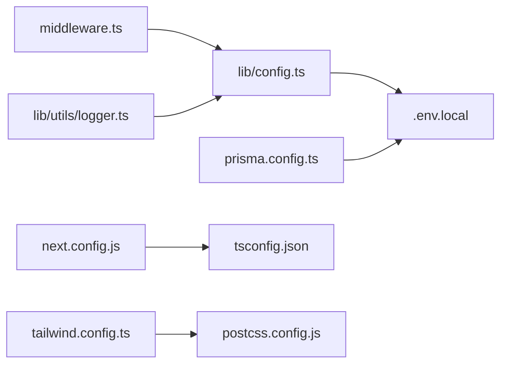

# 开发环境配置

<cite>
**本文引用的文件**
- [package.json](file://package.json)
- [next.config.js](file://next.config.js)
- [tsconfig.json](file://tsconfig.json)
- [tailwind.config.ts](file://tailwind.config.ts)
- [postcss.config.js](file://postcss.config.js)
- [next-env.d.ts](file://next-env.d.ts)
- [components.json](file://components.json)
- [middleware.ts](file://middleware.ts)
- [lib/config.ts](file://lib/config.ts)
- [lib/utils/logger.ts](file://lib/utils/logger.ts)
- [prisma.config.ts](file://prisma.config.ts)
</cite>

## 目录
1. [简介](#简介)
2. [项目结构](#项目结构)
3. [核心组件](#核心组件)
4. [架构总览](#架构总览)
5. [详细组件分析](#详细组件分析)
6. [依赖关系分析](#依赖关系分析)
7. [性能考虑](#性能考虑)
8. [故障排查指南](#故障排查指南)
9. [结论](#结论)
10. [附录](#附录)

## 简介
本文件面向 notebookLM-clone 项目的开发者，提供从 IDE 设置、TypeScript 配置、构建工具、样式工具、环境变量、代码格式化与 Lint、开发服务器与热重载到性能监控的完整开发环境配置指南。内容基于仓库中的实际配置文件进行梳理与说明，帮助新成员快速搭建一致且高效的本地开发环境。

## 项目结构
该项目采用 Next.js App Router 结构，前端样式使用 Tailwind CSS，构建与运行通过 Next.js 完成，数据库相关通过 Prisma 管理。关键配置集中在根目录下的多个配置文件中，分别负责包管理与脚本、Next.js 构建行为、TypeScript 编译、Tailwind CSS 与 PostCSS、中间件与运行时环境等。

图表来源
- [package.json](file://package.json#L1-L82)
- [next.config.js](file://next.config.js#L1-L21)
- [tsconfig.json](file://tsconfig.json#L1-L28)
- [tailwind.config.ts](file://tailwind.config.ts#L1-L95)
- [postcss.config.js](file://postcss.config.js#L1-L7)
- [components.json](file://components.json#L1-L23)
- [middleware.ts](file://middleware.ts#L1-L78)
- [lib/config.ts](file://lib/config.ts#L1-L187)
- [lib/utils/logger.ts](file://lib/utils/logger.ts#L1-L98)
- [prisma.config.ts](file://prisma.config.ts#L1-L20)

章节来源
- [package.json](file://package.json#L1-L82)
- [next.config.js](file://next.config.js#L1-L21)
- [tsconfig.json](file://tsconfig.json#L1-L28)
- [tailwind.config.ts](file://tailwind.config.ts#L1-L95)
- [postcss.config.js](file://postcss.config.js#L1-L7)
- [components.json](file://components.json#L1-L23)
- [middleware.ts](file://middleware.ts#L1-L78)
- [lib/config.ts](file://lib/config.ts#L1-L187)
- [lib/utils/logger.ts](file://lib/utils/logger.ts#L1-L98)
- [prisma.config.ts](file://prisma.config.ts#L1-L20)

## 核心组件
- 包管理与脚本：通过 npm/yarn/pnpm 的 scripts 字段定义开发、构建、启动、类型检查与 Prisma 相关命令。
- Next.js 配置：启用严格模式、图片域名与远程模式、实验性服务端动作体大小限制等。
- TypeScript 配置：严格模式、Bundler 解析、路径映射、插件启用等。
- 样式体系：Tailwind CSS 主题、动画、颜色与插件；PostCSS 自动前缀与 Tailwind 集成。
- 中间件：基于 Supabase 的会话刷新与路由保护。
- 应用配置：模型提供商、嵌入维度、应用参数与环境变量校验。
- 日志工具：按环境输出日志，便于开发阶段可观测性。
- Prisma CLI：从 .env.local 加载数据库连接，指定 schema 与迁移目录。

章节来源
- [package.json](file://package.json#L5-L16)
- [next.config.js](file://next.config.js#L3-L17)
- [tsconfig.json](file://tsconfig.json#L2-L24)
- [tailwind.config.ts](file://tailwind.config.ts#L3-L91)
- [postcss.config.js](file://postcss.config.js#L1-L7)
- [middleware.ts](file://middleware.ts#L15-L71)
- [lib/config.ts](file://lib/config.ts#L6-L166)
- [lib/utils/logger.ts](file://lib/utils/logger.ts#L29-L94)
- [prisma.config.ts](file://prisma.config.ts#L6-L19)

## 架构总览
下图展示了开发环境的关键配置如何协同工作：IDE 与编辑器通过 TypeScript 与 ESLint/Prettier 提升开发体验；Next.js 读取 tsconfig 与 next.config；Tailwind CSS 与 PostCSS 处理样式；运行时通过 middleware 与 lib/config 注入环境变量与业务配置；Prisma 通过 prisma.config 与 .env.local 访问数据库。

图表来源
- [next.config.js](file://next.config.js#L1-L21)
- [tsconfig.json](file://tsconfig.json#L1-L28)
- [tailwind.config.ts](file://tailwind.config.ts#L1-L95)
- [postcss.config.js](file://postcss.config.js#L1-L7)
- [middleware.ts](file://middleware.ts#L15-L71)
- [lib/config.ts](file://lib/config.ts#L1-L187)
- [lib/utils/logger.ts](file://lib/utils/logger.ts#L1-L98)
- [prisma.config.ts](file://prisma.config.ts#L1-L20)

## 详细组件分析

### IDE 设置与扩展推荐
- 推荐扩展
  - ESLint：提供实时语法与风格检查，与 next lint 脚本配合。
  - Prettier：统一代码格式，建议与编辑器保存时自动格式化集成。
  - TypeScript Importer：自动导入模块，提升 DX。
  - Tailwind CSS IntelliSense：增强 Tailwind 类名补全与错误提示。
  - DotENV：.env 文件高亮与校验。
  - Prisma：数据库 schema 与查询语言支持。
- VS Code 工作区设置建议
  - 将 TypeScript 编译器设置为使用项目内 tsserver，确保与 tsconfig 一致。
  - 启用“编辑器：格式化在保存时”并选择 Prettier。
  - 在工作区设置中启用 ESLint 自动修复与问题面板显示。
- 调试配置
  - 使用 VS Code 的 Node 调试器附加到 Next.js 开发进程（端口通常为 9229），或通过 launch.json 配置启动脚本并启用断点。
  - 对 API Route 或中间件设置断点进行交互式调试。

[本节为通用 IDE 配置建议，不直接分析具体文件，故无章节来源]

### TypeScript 配置详解
- 编译目标与模块系统
  - 目标版本与库：面向现代浏览器与 Node 环境。
  - 模块与解析：使用 esnext 与 bundler 解析，适配 Next.js App Router。
- 严格性与增量编译
  - 启用严格模式与增量编译，提升类型检查效率。
- 路径映射
  - 通过路径映射简化导入路径，统一使用 @/* 前缀。
- JSX 与插件
  - JSX 保留策略用于 Next.js App Router；启用 Next.js TypeScript 插件以获得最佳兼容性。
- 类型声明
  - next-env.d.ts 用于声明 Next.js 内置类型，避免手动维护。

章节来源
- [tsconfig.json](file://tsconfig.json#L2-L24)
- [next-env.d.ts](file://next-env.d.ts#L1-L6)

### 构建工具配置（Next.js、Webpack 与打包策略）
- Next.js 构建优化
  - 严格模式：提升 React 与内存使用稳定性。
  - 图片安全：限定允许的远程主机与域名，减少 SSR 风险。
  - 实验性配置：增大 serverActions 的请求体大小，满足大文件上传场景。
- Webpack 与打包策略
  - Next.js 默认使用 Webpack，无需额外配置即可获得按路由拆分的代码分割与懒加载。
  - 生产构建通过 next build 生成静态资源与服务端产物，启动时通过 next start。
- 脚本与任务
  - 开发：next dev
  - 构建：next build
  - 启动：next start
  - 类型检查：tsc --noEmit 或 npm run type-check
  - Lint：next lint

章节来源
- [next.config.js](file://next.config.js#L3-L17)
- [package.json](file://package.json#L5-L16)

### 样式工具配置（Tailwind CSS 与 PostCSS）
- Tailwind CSS
  - 内容扫描范围覆盖 pages、components、app，确保按需生成样式。
  - 主题扩展：颜色、动画、关键帧与圆角变量，统一设计系统。
  - 插件：tailwindcss-animate 与 @tailwindcss/typography。
- PostCSS
  - 集成 tailwindcss 与 autoprefixer，自动处理厂商前缀与样式生成。
- 组件库别名
  - components.json 定义了 UI 组件库的别名与 tailwind 配置路径，便于全局复用。

章节来源
- [tailwind.config.ts](file://tailwind.config.ts#L3-L91)
- [postcss.config.js](file://postcss.config.js#L1-L7)
- [components.json](file://components.json#L6-L21)

### 环境变量配置指南
- 配置来源与加载
  - Prisma CLI 通过 prisma.config.ts 从 .env.local 加载 DIRECT_URL。
  - 应用运行时通过 lib/config.ts 读取 NEXT_PUBLIC_*、DATABASE_URL、ZHIPU_*、EMBEDDING_DIM 等。
- 开发/测试/生产差异
  - 开发：使用 .env.local 存放本地密钥与数据库直连地址；NODE_ENV=development。
  - 测试：可复用 .env.local 或在 CI 中注入对应变量。
  - 生产：通过平台环境变量注入 NEXT_PUBLIC_* 与 DATABASE_URL、ZHIPU_* 等。
- 关键变量与校验
  - 必需变量：NEXT_PUBLIC_SUPABASE_URL、NEXT_PUBLIC_SUPABASE_ANON_KEY、DATABASE_URL、ZHIPU_API_KEY、EMBEDDING_DIM。
  - 启动时会进行环境变量完整性校验，缺失将抛出错误提示。

章节来源
- [prisma.config.ts](file://prisma.config.ts#L6-L19)
- [lib/config.ts](file://lib/config.ts#L168-L186)

### 代码格式化与 Lint 规则
- ESLint
  - 使用 eslint 与 eslint-config-next，遵循 Next.js 推荐规则。
  - 建议在 VS Code 中启用保存时自动修复，并在 CI 中执行 next lint。
- Prettier
  - 作为独立格式化工具，与 ESLint 协同工作，避免风格分歧。
  - 建议在保存时触发格式化，保持团队一致的代码风格。
- TypeScript 编译器
  - 通过 tsconfig.json 的严格模式与 noEmit 确保类型安全与构建一致性。
  - 使用 npm run type-check 执行类型检查，避免提交带类型错误的代码。

章节来源
- [package.json](file://package.json#L66-L80)
- [tsconfig.json](file://tsconfig.json#L7-L8)

### 开发服务器启动与热重载
- 启动流程
  - 开发：npm run dev 启动 Next.js 开发服务器，自动监听文件变更并热重载。
  - 中间件：middleware.ts 在每次请求时刷新 Supabase 会话并根据路由进行重定向。
- 热重载机制
  - 修改页面、组件或配置文件后，Next.js 自动重新编译并更新浏览器。
  - 若修改 tsconfig.json、next.config.js 或样式相关配置，需要重启开发服务器。

章节来源
- [package.json](file://package.json#L5-L6)
- [middleware.ts](file://middleware.ts#L15-L71)

### 性能监控与可观测性
- 日志策略
  - lib/utils/logger.ts 仅在 development 输出 info/warn/debug，error 在所有环境均输出。
  - 提供向量操作专用日志接口，记录插入、检索、混合检索与删除的耗时与结果。
- 运行时可观测性
  - 建议在开发阶段结合浏览器性能面板与网络面板观察请求与渲染性能。
  - 对于数据库与向量检索，可通过 logger 的向量操作日志定位瓶颈。

章节来源
- [lib/utils/logger.ts](file://lib/utils/logger.ts#L29-L94)
- [lib/config.ts](file://lib/config.ts#L160-L166)

## 依赖关系分析
- 组件耦合
  - middleware.ts 依赖 Supabase 客户端与路由匹配逻辑，影响用户鉴权与页面访问。
  - lib/config.ts 为全局配置中心，被各业务模块引用，对环境变量与模型配置有强约束。
  - lib/utils/logger.ts 与 lib/config.ts 解耦，仅依赖 NODE_ENV 控制输出。
  - prisma.config.ts 与 .env.local 强耦合，决定数据库连接与迁移行为。
- 外部依赖
  - Next.js、React、Tailwind CSS、Prisma、Supabase、AI SDK 等生态组件共同构成运行时栈。

图表来源
- [middleware.ts](file://middleware.ts#L15-L71)
- [lib/config.ts](file://lib/config.ts#L1-L187)
- [lib/utils/logger.ts](file://lib/utils/logger.ts#L29-L94)
- [prisma.config.ts](file://prisma.config.ts#L6-L19)
- [next.config.js](file://next.config.js#L1-L21)
- [tsconfig.json](file://tsconfig.json#L1-L28)
- [tailwind.config.ts](file://tailwind.config.ts#L1-L95)
- [postcss.config.js](file://postcss.config.js#L1-L7)

章节来源
- [middleware.ts](file://middleware.ts#L15-L71)
- [lib/config.ts](file://lib/config.ts#L1-L187)
- [lib/utils/logger.ts](file://lib/utils/logger.ts#L29-L94)
- [prisma.config.ts](file://prisma.config.ts#L6-L19)
- [next.config.js](file://next.config.js#L1-L21)
- [tsconfig.json](file://tsconfig.json#L1-L28)
- [tailwind.config.ts](file://tailwind.config.ts#L1-L95)
- [postcss.config.js](file://postcss.config.js#L1-L7)

## 性能考虑
- 构建与运行
  - 使用 Next.js 的默认代码分割与懒加载，避免单页体积过大。
  - 合理拆分页面与组件，利用 App Router 的并行加载能力。
- 样式与资源
  - Tailwind CSS 按需生成，避免引入未使用的样式类。
  - 图片资源通过 next/image 与 remotePatterns 限制来源，减少 SSR 压力。
- 数据与检索
  - 向量检索的 topK 与相似度阈值可在 lib/config.ts 中调整，平衡召回率与性能。
  - 使用 logger 的向量操作日志监控检索耗时，识别热点与异常。

[本节为通用性能建议，不直接分析具体文件，故无章节来源]

## 故障排查指南
- 环境变量缺失
  - 症状：启动时报错提示缺少必需的环境变量。
  - 处理：复制 .env.example 到 .env.local 并填入实际值；确认 lib/config.ts 的 validateEnv 是否通过。
- 嵌入维度不一致
  - 症状：启动时因 EMBEDDING_DIM 非 1024 抛出错误。
  - 处理：在 .env.local 中设置 EMBEDDING_DIM=1024，或按要求重建数据库表。
- 数据库连接失败
  - 症状：Prisma CLI 或运行时无法连接数据库。
  - 处理：检查 prisma.config.ts 中 DIRECT_URL 与 .env.local 的 DATABASE_URL；确认网络与权限。
- 中间件重定向循环
  - 症状：登录后仍被重定向至登录页或出现循环重定向。
  - 处理：检查 middleware.ts 的受保护路由与认证路由匹配逻辑，确认 Supabase 会话状态。
- 开发日志过多
  - 症状：开发环境日志噪声较大。
  - 处理：调整 logger 的级别与输出策略，或在生产环境关闭非 error 日志。

章节来源
- [lib/config.ts](file://lib/config.ts#L168-L186)
- [lib/config.ts](file://lib/config.ts#L6-L29)
- [prisma.config.ts](file://prisma.config.ts#L6-L19)
- [middleware.ts](file://middleware.ts#L15-L71)
- [lib/utils/logger.ts](file://lib/utils/logger.ts#L29-L94)

## 结论
本指南基于仓库现有配置，给出了从 IDE、TypeScript、Next.js、Tailwind CSS、环境变量到 Lint 与性能监控的完整开发环境配置说明。建议团队在本地与 CI 中统一这些配置，以保证一致性与可维护性。对于新增功能或第三方依赖，应同步更新相应配置文件并进行回归验证。

[本节为总结性内容，不直接分析具体文件，故无章节来源]

## 附录
- 常用命令速查
  - 开发：npm run dev
  - 构建：npm run build
  - 启动：npm run start
  - 类型检查：npm run type-check
  - Lint：npm run lint
  - Prisma：npm run db:generate / db:push / db:migrate / db:studio

章节来源
- [package.json](file://package.json#L5-L16)