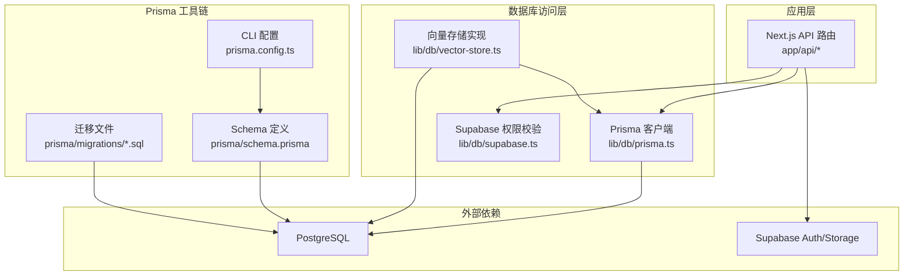
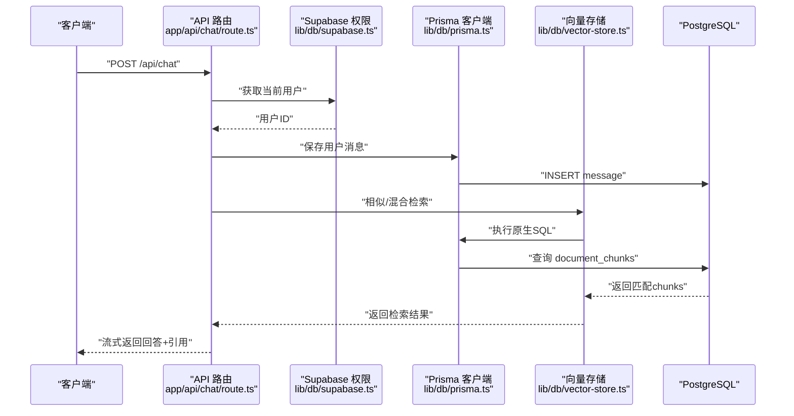
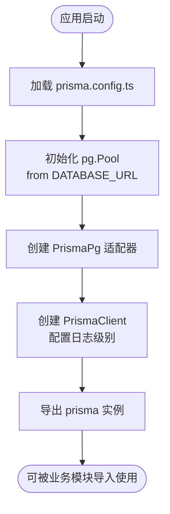
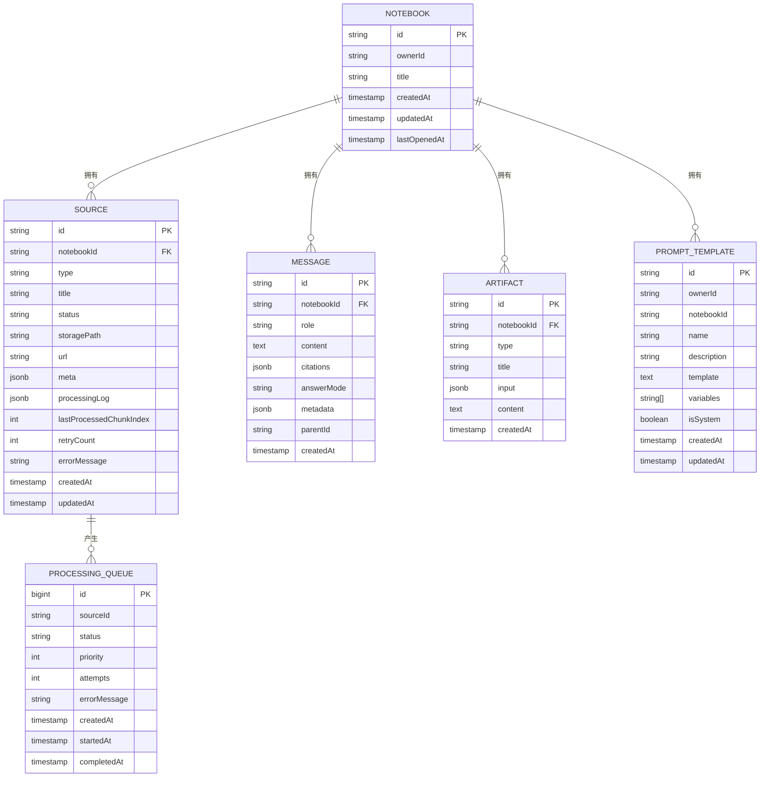
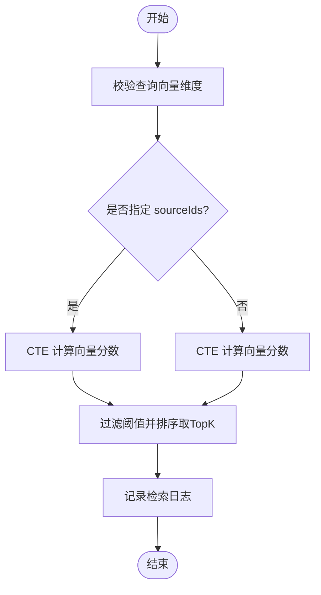
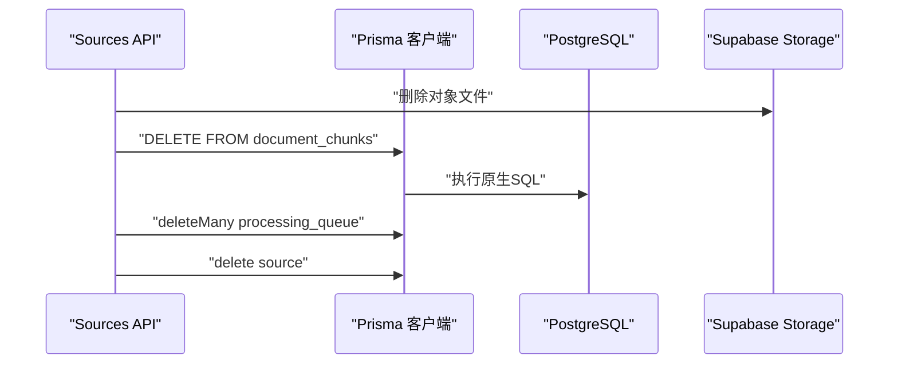
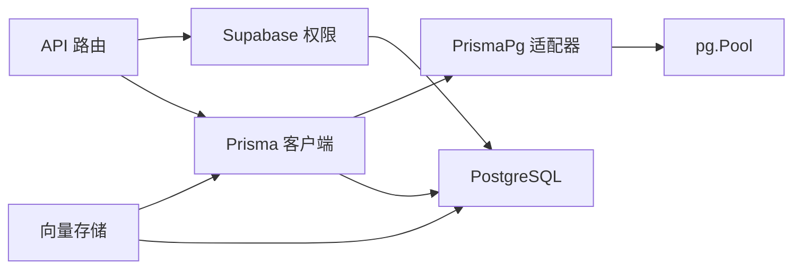

# 数据库工具

<cite>
**本文引用的文件**
- [prisma.config.ts](file://prisma.config.ts)
- [schema.prisma](file://prisma/schema.prisma)
- [lib/db/prisma.ts](file://lib/db/prisma.ts)
- [lib/db/supabase.ts](file://lib/db/supabase.ts)
- [lib/db/vector-store.ts](file://lib/db/vector-store.ts)
- [lib/config.ts](file://lib/config.ts)
- [app/api/notebooks/route.ts](file://app/api/notebooks/route.ts)
- [app/api/sources/[id]/route.ts](file://app/api/sources/[id]/route.ts)
- [app/api/chat/route.ts](file://app/api/chat/route.ts)
- [package.json](file://package.json)
- [prisma/migrations/00000000000000_init_vector/migration.sql](file://prisma/migrations/00000000000000_init_vector/migration.sql)
- [prisma/migrations/20241223_create_vector_table/migration.sql](file://prisma/migrations/20241223_create_vector_table/migration.sql)
- [prisma/migrations/20260120042257_sync_schema_changes/migration.sql](file://prisma/migrations/20260120042257_sync_schema_changes/migration.sql)
</cite>

## 目录
1. [简介](#简介)
2. [项目结构](#项目结构)
3. [核心组件](#核心组件)
4. [架构总览](#架构总览)
5. [详细组件分析](#详细组件分析)
6. [依赖关系分析](#依赖关系分析)
7. [性能考虑](#性能考虑)
8. [故障排查指南](#故障排查指南)
9. [结论](#结论)
10. [附录](#附录)

## 简介
本文件面向 notebookLM-clone 项目的数据库工具链，系统性说明 Prisma ORM 的配置与使用、数据库迁移与版本控制、模式管理与优化、性能与监控、以及安全配置。文档基于仓库中现有的 Prisma 配置、Schema 定义、迁移脚本与实际 API 使用场景进行整理，帮助开发者在本地开发、部署与运维过程中高效、安全地管理数据库。

## 项目结构
与数据库相关的关键位置如下：
- Prisma CLI 配置：prisma.config.ts
- Prisma Schema：prisma/schema.prisma
- 数据库适配与连接池：lib/db/prisma.ts
- 向量检索实现：lib/db/vector-store.ts
- Supabase 权限校验：lib/db/supabase.ts
- 应用配置与环境校验：lib/config.ts
- API 使用示例：app/api/*.ts
- 迁移文件：prisma/migrations/*.sql
- 任务脚本：package.json

图表来源
- [prisma.config.ts](file://prisma.config.ts#L1-L20)
- [schema.prisma](file://prisma/schema.prisma#L1-L140)
- [lib/db/prisma.ts](file://lib/db/prisma.ts#L1-L41)
- [lib/db/vector-store.ts](file://lib/db/vector-store.ts#L1-L446)
- [lib/db/supabase.ts](file://lib/db/supabase.ts#L1-L39)
- [prisma/migrations/20260120042257_sync_schema_changes/migration.sql](file://prisma/migrations/20260120042257_sync_schema_changes/migration.sql#L1-L146)

章节来源
- [prisma.config.ts](file://prisma.config.ts#L1-L20)
- [prisma/schema.prisma](file://prisma/schema.prisma#L1-L140)
- [lib/db/prisma.ts](file://lib/db/prisma.ts#L1-L41)
- [lib/db/vector-store.ts](file://lib/db/vector-store.ts#L1-L446)
- [lib/db/supabase.ts](file://lib/db/supabase.ts#L1-L39)
- [prisma/migrations/20260120042257_sync_schema_changes/migration.sql](file://prisma/migrations/20260120042257_sync_schema_changes/migration.sql#L1-L146)

## 核心组件
- Prisma 客户端与适配器：通过 @prisma/adapter-pg 将 Prisma 与 pg 的连接池结合，支持在 Serverless 环境下稳定连接。
- 向量存储实现：封装 document_chunks 表的插入、相似度检索、混合检索与删除逻辑，并提供批量写入与日志记录。
- 权限校验：统一从 Supabase 获取当前用户并校验资源归属，确保 API 层的数据安全。
- 配置与校验：对向量维度、数据库连接、模型配置等进行运行时校验，避免不一致导致的异常。

章节来源
- [lib/db/prisma.ts](file://lib/db/prisma.ts#L1-L41)
- [lib/db/vector-store.ts](file://lib/db/vector-store.ts#L1-L446)
- [lib/db/supabase.ts](file://lib/db/supabase.ts#L1-L39)
- [lib/config.ts](file://lib/config.ts#L1-L187)

## 架构总览
下面的序列图展示了典型 API 请求如何与数据库交互，包括权限校验、Prisma 查询与向量检索。

图表来源
- [app/api/chat/route.ts](file://app/api/chat/route.ts#L1-L324)
- [lib/db/supabase.ts](file://lib/db/supabase.ts#L1-L39)
- [lib/db/prisma.ts](file://lib/db/prisma.ts#L1-L41)
- [lib/db/vector-store.ts](file://lib/db/vector-store.ts#L1-L446)

## 详细组件分析

### Prisma 配置与连接
- CLI 配置：prisma.config.ts 指定 schema 位置、迁移目录与数据源 URL（通过环境变量 DIRECT_URL），供 migrate、db push 等命令读取。
- 客户端初始化：lib/db/prisma.ts 使用 @prisma/adapter-pg 与 pg.Pool 结合，创建适配器；在开发环境下启用日志级别，生产环境仅记录错误。
- Serverless 连接池：注释建议使用 Supabase Transaction Pooler（端口 6543）并设置连接池参数，避免冷启动与并发连接问题。

图表来源
- [prisma.config.ts](file://prisma.config.ts#L1-L20)
- [lib/db/prisma.ts](file://lib/db/prisma.ts#L1-L41)

章节来源
- [prisma.config.ts](file://prisma.config.ts#L1-L20)
- [lib/db/prisma.ts](file://lib/db/prisma.ts#L1-L41)

### Prisma Schema 与模型
- 数据源与生成器：datasource db 使用 PostgreSQL；generator client 指向 prisma-client-js。
- 核心模型：Notebook、Source、Message、Artifact、PromptTemplate、ProcessingQueue。
- 索引与映射：模型上定义了多个索引（如 owner、status、createdAt 等），并通过 @@map 指定表名，确保与迁移保持一致。
- 特殊表：document_chunks 通过 SQL 迁移创建，不在 Prisma Schema 中，因此需要通过原生 SQL 访问。

图表来源
- [prisma/schema.prisma](file://prisma/schema.prisma#L1-L140)
- [prisma/migrations/20260120042257_sync_schema_changes/migration.sql](file://prisma/migrations/20260120042257_sync_schema_changes/migration.sql#L11-L146)

章节来源
- [prisma/schema.prisma](file://prisma/schema.prisma#L1-L140)
- [prisma/migrations/20260120042257_sync_schema_changes/migration.sql](file://prisma/migrations/20260120042257_sync_schema_changes/migration.sql#L1-L146)

### 向量存储与检索
- 批量插入：按批次大小分批写入 document_chunks，使用 ON CONFLICT (source_id, chunk_index) DO NOTHING 避免重复。
- 相似度检索：使用向量距离运算符计算余弦相似度，支持按 sourceIds 过滤与阈值筛选。
- 混合检索：结合向量分数与全文检索（content_tsv）权重，CTE 消除重复计算，提升性能。
- 删除与去重：提供按 sourceId 删除与获取已存在 content_hash 的能力，便于增量处理。

图表来源
- [lib/db/vector-store.ts](file://lib/db/vector-store.ts#L175-L297)

章节来源
- [lib/db/vector-store.ts](file://lib/db/vector-store.ts#L1-L446)

### API 使用示例与数据库交互
- 创建笔记本：app/api/notebooks/route.ts 使用 prisma.notebook.create，结合 Supabase 当前用户 ID 作为 ownerId。
- 源文件详情与删除：app/api/sources/[id]/route.ts 在删除时，先删除 Supabase 存储文件，再通过原生 SQL 删除 document_chunks，最后删除处理队列与源记录。
- 聊天与检索：app/api/chat/route.ts 并行保存用户消息与检索相关片段，构造引用与检索详情，最终异步保存助手回复。

图表来源
- [app/api/sources/[id]/route.ts](file://app/api/sources/[id]/route.ts#L99-L112)
- [lib/db/prisma.ts](file://lib/db/prisma.ts#L1-L41)

章节来源
- [app/api/notebooks/route.ts](file://app/api/notebooks/route.ts#L1-L67)
- [app/api/sources/[id]/route.ts](file://app/api/sources/[id]/route.ts#L1-L120)
- [app/api/chat/route.ts](file://app/api/chat/route.ts#L1-L324)

### 迁移工具与版本控制
- 迁移命令：package.json 提供 db:generate、db:push、db:migrate、db:studio 等脚本，配合 prisma.config.ts 使用。
- 迁移策略：仓库包含多份 SQL 迁移，其中 document_chunks 通过独立 SQL 迁移维护，Prisma Schema 与 SQL 迁移并存，需保持同步。
- 最佳实践：
  - 优先使用 Prisma Schema 管理可迁移的表结构；对于复杂索引、扩展（如 vector）、函数等使用 SQL 迁移。
  - 迁移前备份数据库，迁移后验证索引与函数是否存在且正确。
  - 对于向量表，确保向量维度与应用配置一致，避免运行时报错。

章节来源
- [package.json](file://package.json#L5-L16)
- [prisma.config.ts](file://prisma.config.ts#L1-L20)
- [prisma/migrations/00000000000000_init_vector/migration.sql](file://prisma/migrations/00000000000000_init_vector/migration.sql#L1-L65)
- [prisma/migrations/20241223_create_vector_table/migration.sql](file://prisma/migrations/20241223_create_vector_table/migration.sql#L1-L65)
- [prisma/migrations/20260120042257_sync_schema_changes/migration.sql](file://prisma/migrations/20260120042257_sync_schema_changes/migration.sql#L1-L146)

### 模式管理与索引优化
- 模型更新：通过 Prisma Schema 定义新增字段、索引与外键，迁移后自动同步到数据库。
- 字段变更：注意字段类型与默认值变更可能影响现有数据，建议使用非破坏性迁移或先创建新列再迁移数据。
- 索引优化：仓库中已为常用查询字段建立索引（如 owner、status、createdAt 等）。向量检索使用 HNSW 索引与余弦距离，全文检索使用 content_tsv 与 ts_rank。

章节来源
- [prisma/schema.prisma](file://prisma/schema.prisma#L1-L140)
- [lib/db/vector-store.ts](file://lib/db/vector-store.ts#L22-L29)
- [prisma/migrations/20260120050505_add_content_tsv/migration.sql](file://prisma/migrations/20260120050505_add_content_tsv/migration.sql#L1-L200)

### 性能优化指南
- 查询优化：使用 CTE 减少重复计算；对高频查询字段建立复合索引；合理设置 topK 与阈值。
- 索引设计：向量索引采用 HNSW 与余弦距离；全文检索使用 simple 分词器；为 source_id、content_hash 等建立索引。
- 连接池配置：在 Serverless 环境使用 Supabase Transaction Pooler，设置 connection_limit=1，避免连接过多导致超限。
- 批量写入：向量插入按批次进行，减少单次事务压力。

章节来源
- [lib/db/vector-store.ts](file://lib/db/vector-store.ts#L7-L173)
- [lib/db/prisma.ts](file://lib/db/prisma.ts#L5-L16)

### 监控与调试
- 日志记录：向量操作封装了日志记录，包含操作类型、耗时、成功与否与元数据，便于定位问题。
- Prisma 日志：开发环境开启错误与警告日志，生产环境仅记录错误，有助于排查慢查询与异常。
- 慢查询分析：结合向量检索日志与 Prisma 日志，定位耗时过长的查询；必要时调整阈值、topK 或索引。

章节来源
- [lib/db/vector-store.ts](file://lib/db/vector-store.ts#L143-L172)
- [lib/db/vector-store.ts](file://lib/db/vector-store.ts#L268-L295)
- [lib/db/prisma.ts](file://lib/db/prisma.ts#L31-L34)

### 安全配置
- 访问控制：所有 API 在操作前调用 Supabase 权限校验，确保资源归属与登录状态。
- 加密与审计：建议对敏感环境变量（如 DATABASE_URL、API 密钥）进行加密存储与轮换；对关键数据库操作记录审计日志。
- 环境变量校验：应用启动时校验必需的环境变量，防止因配置缺失导致的运行时错误。

章节来源
- [lib/db/supabase.ts](file://lib/db/supabase.ts#L12-L33)
- [lib/config.ts](file://lib/config.ts#L169-L187)

## 依赖关系分析
- 组件耦合：API 路由依赖 Supabase 权限与 Prisma 客户端；向量存储依赖 Prisma 客户端与原生 SQL；Prisma 客户端依赖连接池与适配器。
- 外部依赖：PostgreSQL（含 vector 扩展）、Supabase Auth/Storage。
- 循环依赖：当前结构清晰，未发现循环依赖迹象。

图表来源
- [lib/db/prisma.ts](file://lib/db/prisma.ts#L1-L41)
- [lib/db/vector-store.ts](file://lib/db/vector-store.ts#L1-L446)
- [lib/db/supabase.ts](file://lib/db/supabase.ts#L1-L39)

章节来源
- [lib/db/prisma.ts](file://lib/db/prisma.ts#L1-L41)
- [lib/db/vector-store.ts](file://lib/db/vector-store.ts#L1-L446)
- [lib/db/supabase.ts](file://lib/db/supabase.ts#L1-L39)

## 性能考虑
- 向量维度一致性：严格锁定为 1024 维，避免运行时转换开销与错误。
- 批处理与分页：向量插入采用分批策略，降低单次事务压力。
- 索引与查询：为高频过滤与排序字段建立索引；使用 CTE 与阈值过滤减少结果集。
- 连接池与 Serverless：使用 Supabase Transaction Pooler，限制每个实例连接数，避免冷启动与并发峰值。

章节来源
- [lib/config.ts](file://lib/config.ts#L6-L29)
- [lib/db/vector-store.ts](file://lib/db/vector-store.ts#L7-L173)
- [lib/db/prisma.ts](file://lib/db/prisma.ts#L5-L16)

## 故障排查指南
- 迁移失败：检查 prisma.config.ts 的 schema 与 datasource.url 是否正确；确认迁移文件顺序与依赖。
- 向量维度错误：若报 embedding 维度不匹配，检查 EMBEDDING_DIM 与数据库向量维度是否一致。
- 权限不足：确认 Supabase 当前用户已登录且资源归属匹配。
- 慢查询：查看向量检索日志与 Prisma 日志，调整 topK、阈值或索引策略。

章节来源
- [prisma.config.ts](file://prisma.config.ts#L1-L20)
- [lib/config.ts](file://lib/config.ts#L6-L29)
- [lib/db/supabase.ts](file://lib/db/supabase.ts#L12-L33)
- [lib/db/vector-store.ts](file://lib/db/vector-store.ts#L143-L172)

## 结论
本项目采用 Prisma 管理核心业务表，同时通过 SQL 迁移维护向量表与全文检索函数，形成“Schema + SQL 迁移”的混合模式。通过连接池适配、严格的维度校验、索引优化与日志记录，系统在 Serverless 环境下具备较好的稳定性与可维护性。建议持续完善迁移策略、监控与审计机制，确保数据库演进过程可控、可观测、可回滚。

## 附录
- 常用命令
  - 生成客户端：npm run db:generate
  - 推送模式：npm run db:push
  - 执行迁移：npm run db:migrate
  - 打开 Studio：npm run db:studio
- 环境变量
  - DATABASE_URL：数据库连接字符串
  - DIRECT_URL：Prisma CLI 使用的直连地址
  - EMBEDDING_DIM：向量维度（建议 1024）

章节来源
- [package.json](file://package.json#L5-L16)
- [lib/config.ts](file://lib/config.ts#L169-L187)