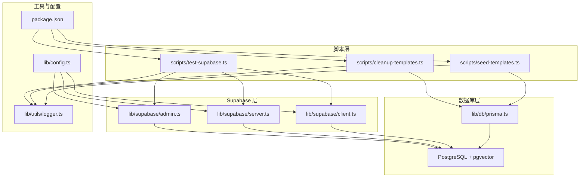
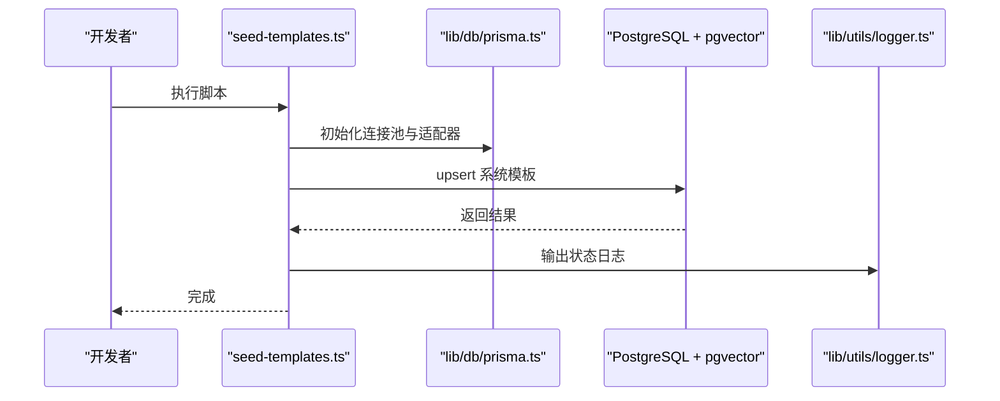
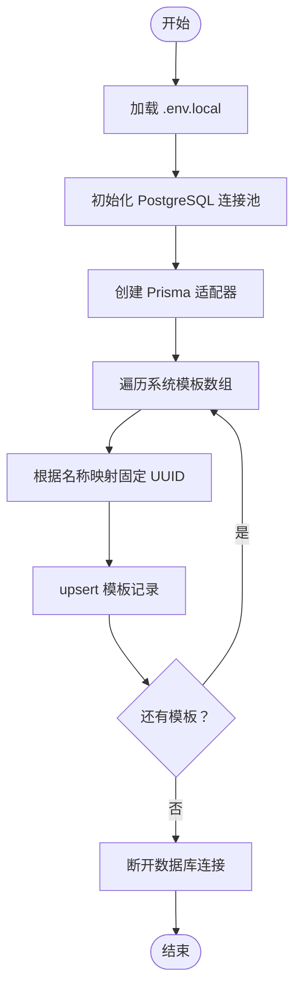
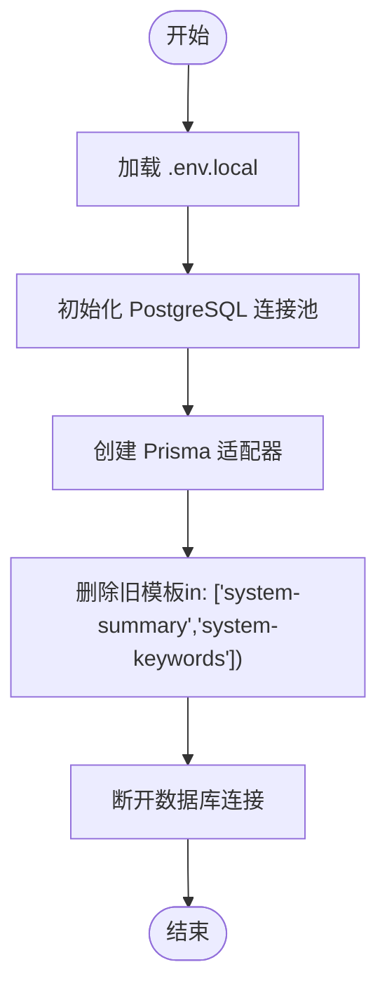
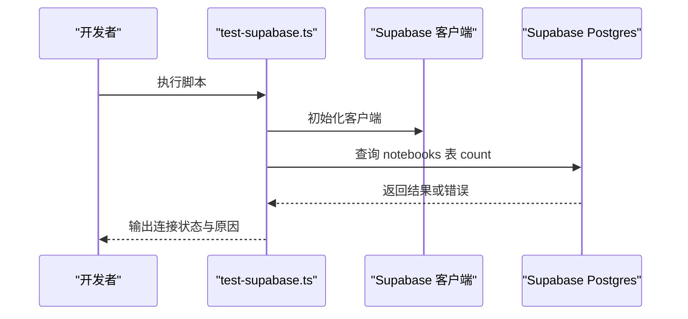
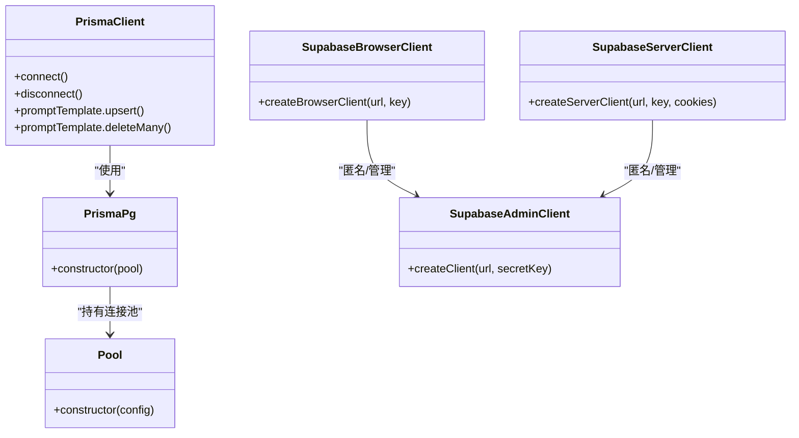
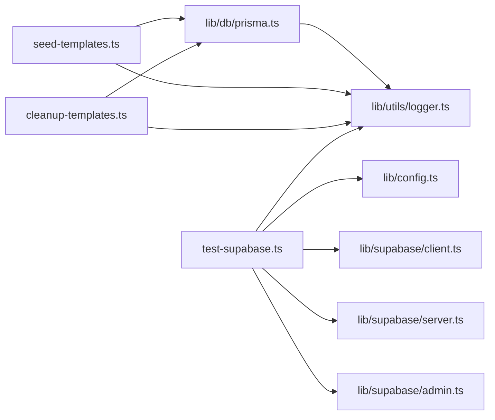

# 自动化脚本

<cite>
**本文引用的文件**
- [scripts/seed-templates.ts](file://scripts/seed-templates.ts)
- [scripts/cleanup-templates.ts](file://scripts/cleanup-templates.ts)
- [scripts/test-supabase.ts](file://scripts/test-supabase.ts)
- [lib/supabase/client.ts](file://lib/supabase/client.ts)
- [lib/supabase/server.ts](file://lib/supabase/server.ts)
- [lib/supabase/admin.ts](file://lib/supabase/admin.ts)
- [lib/db/prisma.ts](file://lib/db/prisma.ts)
- [lib/utils/logger.ts](file://lib/utils/logger.ts)
- [lib/config.ts](file://lib/config.ts)
- [package.json](file://package.json)
- [README.md](file://README.md)
</cite>

## 目录
1. [简介](#简介)
2. [项目结构](#项目结构)
3. [核心组件](#核心组件)
4. [架构总览](#架构总览)
5. [详细组件分析](#详细组件分析)
6. [依赖关系分析](#依赖关系分析)
7. [性能考量](#性能考量)
8. [故障排查指南](#故障排查指南)
9. [结论](#结论)
10. [附录](#附录)

## 简介
本文件面向 notebookLM-clone 项目的自动化脚本，系统性梳理模板种子脚本、模板清理脚本与 Supabase 测试脚本的功能、实现与使用方式。文档同时覆盖参数配置、环境变量、错误处理与日志记录、定时执行与自动化部署、以及安全配置与权限管理，帮助开发者在本地与 CI/CD 环境中稳定地运行这些脚本。

## 项目结构
本项目采用 Next.js App Router 结构，自动化脚本位于 scripts/ 目录；数据库访问通过 Prisma 适配器连接 PostgreSQL；Supabase 提供认证、存储与 Postgres 数据库能力；日志工具统一输出。

图表来源
- [scripts/seed-templates.ts](file://scripts/seed-templates.ts#L1-L86)
- [scripts/cleanup-templates.ts](file://scripts/cleanup-templates.ts#L1-L24)
- [scripts/test-supabase.ts](file://scripts/test-supabase.ts#L1-L40)
- [lib/db/prisma.ts](file://lib/db/prisma.ts#L1-L41)
- [lib/supabase/client.ts](file://lib/supabase/client.ts#L1-L14)
- [lib/supabase/server.ts](file://lib/supabase/server.ts#L1-L33)
- [lib/supabase/admin.ts](file://lib/supabase/admin.ts#L1-L18)
- [lib/utils/logger.ts](file://lib/utils/logger.ts#L1-L98)
- [lib/config.ts](file://lib/config.ts#L1-L186)
- [package.json](file://package.json#L1-L82)

章节来源
- [README.md](file://README.md#L42-L50)
- [package.json](file://package.json#L5-L16)

## 核心组件
- 模板种子脚本：将系统模板（摘要、关键词）写入数据库，使用 upsert 确保幂等与可重复执行。
- 模板清理脚本：删除旧的系统模板标识，为后续迁移或升级做准备。
- Supabase 测试脚本：验证 Supabase 连接与基础读取权限，辅助定位配置问题。
- 数据库适配：Prisma + PostgreSQL + pgvector，支持 Serverless 环境连接池优化。
- Supabase 客户端：浏览器端与服务端客户端封装，区分匿名访问与管理员权限。
- 日志工具：统一日志输出，开发环境全量输出，生产环境仅错误级别输出。
- 配置校验：环境变量完整性与向量维度强制校验，保障运行一致性。

章节来源
- [scripts/seed-templates.ts](file://scripts/seed-templates.ts#L16-L76)
- [scripts/cleanup-templates.ts](file://scripts/cleanup-templates.ts#L13-L21)
- [scripts/test-supabase.ts](file://scripts/test-supabase.ts#L17-L37)
- [lib/db/prisma.ts](file://lib/db/prisma.ts#L5-L16)
- [lib/supabase/client.ts](file://lib/supabase/client.ts#L8-L13)
- [lib/supabase/server.ts](file://lib/supabase/server.ts#L9-L32)
- [lib/supabase/admin.ts](file://lib/supabase/admin.ts#L9-L18)
- [lib/utils/logger.ts](file://lib/utils/logger.ts#L29-L94)
- [lib/config.ts](file://lib/config.ts#L6-L29)

## 架构总览
自动化脚本围绕数据库与 Supabase 两大基础设施工作，通过统一的环境变量与配置模块进行参数注入与校验。模板脚本通过 Prisma 访问数据库，Supabase 测试脚本通过浏览器/服务端客户端访问 Supabase。

图表来源
- [scripts/seed-templates.ts](file://scripts/seed-templates.ts#L10-L76)
- [lib/db/prisma.ts](file://lib/db/prisma.ts#L18-L34)
- [lib/utils/logger.ts](file://lib/utils/logger.ts#L32-L54)

## 详细组件分析

### 模板种子脚本（seed-templates.ts）
- 功能概述
  - 将系统模板（摘要、关键词）写入数据库，使用固定 UUID 确保幂等与可重复运行。
  - 通过 upsert 保证创建或更新模板，避免重复插入。
- 关键流程
  - 加载 .env.local 环境变量。
  - 创建 PostgreSQL 连接池与 Prisma 适配器。
  - 遍历系统模板数组，根据名称映射固定 UUID。
  - 使用 upsert 写入数据库，字段包含名称、描述、模板文本、变量列表与 isSystem 标记。
  - 断开数据库连接。
- 错误处理
  - 捕获异常并退出进程，最终断开数据库连接。
- 最佳实践
  - 在执行前确保数据库迁移已完成，且 .env.local 包含 DATABASE_URL。
  - 可在 CI/CD 中作为部署后任务运行，确保系统模板始终处于预期状态。

图表来源
- [scripts/seed-templates.ts](file://scripts/seed-templates.ts#L7-L85)

章节来源
- [scripts/seed-templates.ts](file://scripts/seed-templates.ts#L1-L86)

### 模板清理脚本（cleanup-templates.ts）
- 功能概述
  - 删除旧的系统模板标识，为后续迁移或升级做准备。
- 关键流程
  - 加载 .env.local 环境变量。
  - 创建 PostgreSQL 连接池与 Prisma 适配器。
  - 使用 deleteMany 删除指定 id 的旧模板。
  - 断开数据库连接。
- 最佳实践
  - 在数据库 schema 升级或模板 ID 变更后运行，确保数据一致性。

图表来源
- [scripts/cleanup-templates.ts](file://scripts/cleanup-templates.ts#L7-L23)

章节来源
- [scripts/cleanup-templates.ts](file://scripts/cleanup-templates.ts#L1-L24)

### Supabase 测试脚本（test-supabase.ts）
- 功能概述
  - 验证 Supabase 连接与基础读取权限，辅助定位配置问题。
- 关键流程
  - 从环境变量读取 Supabase URL 与匿名 Key。
  - 创建客户端实例。
  - 发起一次最小权限查询（读取 notebooks 表 count）。
  - 输出连接状态与可能原因。
- 最佳实践
  - 在本地开发与 CI 环境中定期运行，确保 Supabase 配置正确。
  - 若失败，优先检查数据库迁移是否完成、Key 是否正确、URL 是否可达。

图表来源
- [scripts/test-supabase.ts](file://scripts/test-supabase.ts#L17-L37)
- [lib/supabase/client.ts](file://lib/supabase/client.ts#L8-L13)
- [lib/supabase/server.ts](file://lib/supabase/server.ts#L9-L32)
- [lib/supabase/admin.ts](file://lib/supabase/admin.ts#L9-L18)

章节来源
- [scripts/test-supabase.ts](file://scripts/test-supabase.ts#L1-L40)

### 数据库与 Supabase 客户端
- Prisma 适配器
  - 通过连接池与适配器连接 PostgreSQL，支持 Serverless 环境的连接限制与 pgbouncer 参数。
- Supabase 客户端
  - 浏览器端：用于 Client Components。
  - 服务端：用于 Server Components/Actions/Route Handlers，处理 Cookie 生命周期。
  - 管理端：使用 Secret Key 绕过 RLS，仅用于服务端管理操作。

图表来源
- [lib/db/prisma.ts](file://lib/db/prisma.ts#L18-L34)
- [lib/supabase/client.ts](file://lib/supabase/client.ts#L8-L13)
- [lib/supabase/server.ts](file://lib/supabase/server.ts#L9-L32)
- [lib/supabase/admin.ts](file://lib/supabase/admin.ts#L9-L18)

章节来源
- [lib/db/prisma.ts](file://lib/db/prisma.ts#L1-L41)
- [lib/supabase/client.ts](file://lib/supabase/client.ts#L1-L14)
- [lib/supabase/server.ts](file://lib/supabase/server.ts#L1-L33)
- [lib/supabase/admin.ts](file://lib/supabase/admin.ts#L1-L18)

## 依赖关系分析
- 脚本依赖
  - seed-templates.ts 与 cleanup-templates.ts 依赖 Prisma 与 PostgreSQL 连接池。
  - test-supabase.ts 依赖 Supabase 客户端与环境变量。
- 配置与校验
  - lib/config.ts 对环境变量进行完整性与向量维度校验，确保运行一致性。
- 日志
  - lib/utils/logger.ts 控制日志输出级别，开发环境全量输出，生产环境仅错误级别输出。

图表来源
- [scripts/seed-templates.ts](file://scripts/seed-templates.ts#L1-L86)
- [scripts/cleanup-templates.ts](file://scripts/cleanup-templates.ts#L1-L24)
- [scripts/test-supabase.ts](file://scripts/test-supabase.ts#L1-L40)
- [lib/db/prisma.ts](file://lib/db/prisma.ts#L1-L41)
- [lib/config.ts](file://lib/config.ts#L169-L186)
- [lib/supabase/client.ts](file://lib/supabase/client.ts#L1-L14)
- [lib/supabase/server.ts](file://lib/supabase/server.ts#L1-L33)
- [lib/supabase/admin.ts](file://lib/supabase/admin.ts#L1-L18)
- [lib/utils/logger.ts](file://lib/utils/logger.ts#L29-L94)

章节来源
- [lib/config.ts](file://lib/config.ts#L169-L186)
- [lib/utils/logger.ts](file://lib/utils/logger.ts#L29-L94)

## 性能考量
- 连接池与并发
  - Prisma 在 Serverless 环境建议使用 Supabase Transaction Pooler（端口 6543），并设置连接限制，避免过多并发连接导致超限。
- 脚本执行频率
  - 模板种子脚本适合在部署后运行一次，避免频繁执行造成数据库压力。
  - Supabase 测试脚本可在 CI/CD 中作为健康检查步骤，周期性运行。
- 日志输出
  - 生产环境仅输出错误级别日志，减少 I/O 压力。

章节来源
- [lib/db/prisma.ts](file://lib/db/prisma.ts#L8-L16)
- [lib/utils/logger.ts](file://lib/utils/logger.ts#L29-L54)

## 故障排查指南
- 环境变量缺失
  - 使用 lib/config.ts 的 validateEnv 方法进行校验，确保 NEXT_PUBLIC_SUPABASE_URL、NEXT_PUBLIC_SUPABASE_ANON_KEY、DATABASE_URL、ZHIPU_API_KEY、EMBEDDING_DIM 等变量齐全。
- 数据库连接失败
  - 检查 DATABASE_URL 是否正确，确认已执行数据库迁移；若使用 Serverless，确认连接池参数与端口配置。
- Supabase 连接失败
  - 使用 test-supabase.ts 进行连接测试，核对 URL 与匿名 Key；若 notebooks 表尚未创建，先执行数据库迁移。
- 权限与鉴权
  - 管理端使用 Secret Key 绕过 RLS，仅在服务端使用；浏览器端与服务端客户端分别用于前端与后端场景。
- 日志与调试
  - 开发环境可看到完整日志；生产环境仅错误日志。可通过日志定位 upsert/delete 等操作的执行情况。

章节来源
- [lib/config.ts](file://lib/config.ts#L169-L186)
- [scripts/test-supabase.ts](file://scripts/test-supabase.ts#L17-L37)
- [lib/supabase/admin.ts](file://lib/supabase/admin.ts#L9-L18)
- [lib/utils/logger.ts](file://lib/utils/logger.ts#L29-L54)

## 结论
本项目自动化脚本围绕数据库与 Supabase 的配置与连通性展开，通过幂等的 upsert 操作确保系统模板的稳定同步，通过清理脚本为后续升级做好准备，通过连接测试快速定位配置问题。配合严格的环境变量校验与日志控制，能够在本地与 CI/CD 环境中可靠运行。

## 附录

### 参数配置与环境变量
- 必需环境变量
  - Supabase：NEXT_PUBLIC_SUPABASE_URL、NEXT_PUBLIC_SUPABASE_ANON_KEY、SUPABASE_SECRET_KEY
  - 数据库：DATABASE_URL、DIRECT_URL
  - 模型：ZHIPU_API_KEY、ZHIPU_BASE_URL、ZHIPU_EMBEDDING_MODEL、ZHIPU_CHAT_MODEL、LONGCAT_API_KEY、LONGCAT_BASE_URL、LONGCAT_CHAT_MODEL
  - 向量维度：EMBEDDING_DIM（必须为 1024）
  - Cron 鉴权：CRON_SECRET（用于 /api/cron/process-queue）
- 配置校验
  - 启动时强制校验 EMBEDDING_DIM 与必需变量，不满足则抛出错误并终止。

章节来源
- [README.md](file://README.md#L66-L93)
- [lib/config.ts](file://lib/config.ts#L6-L29)
- [lib/config.ts](file://lib/config.ts#L169-L186)

### 脚本执行最佳实践
- 模板种子脚本
  - 在部署后执行一次，确保系统模板处于预期状态。
  - 确保数据库迁移已完成。
- 模板清理脚本
  - 在 schema 升级或模板 ID 变更后运行，清理旧标识。
- Supabase 测试脚本
  - 在本地开发与 CI 环境中定期运行，确保连接正常。
  - 若失败，优先检查迁移与 Key 配置。

章节来源
- [scripts/seed-templates.ts](file://scripts/seed-templates.ts#L52-L76)
- [scripts/cleanup-templates.ts](file://scripts/cleanup-templates.ts#L13-L21)
- [scripts/test-supabase.ts](file://scripts/test-supabase.ts#L17-L37)

### 错误处理与日志记录
- 错误处理
  - 脚本均捕获异常并退出进程，最终断开数据库连接。
- 日志记录
  - 开发环境输出 info/warn/error/debug；生产环境仅输出 error。
  - 提供向量操作专用日志结构，便于追踪向量检索与插入等操作。

章节来源
- [scripts/seed-templates.ts](file://scripts/seed-templates.ts#L78-L85)
- [scripts/cleanup-templates.ts](file://scripts/cleanup-templates.ts#L22-L23)
- [lib/utils/logger.ts](file://lib/utils/logger.ts#L29-L94)

### 定时执行与自动化部署
- Cron 作业
  - 可通过外部调度器（如 Vercel Cron、GitHub Actions 或系统 Cron）定期触发 Supabase 连接测试。
- CI/CD 集成
  - 在构建后阶段运行模板种子脚本，确保系统模板同步。
  - 在部署前运行 Supabase 测试脚本，作为健康检查步骤。
- 监控告警
  - 将脚本输出接入日志系统，结合错误级别日志进行告警。

章节来源
- [README.md](file://README.md#L124-L131)
- [scripts/test-supabase.ts](file://scripts/test-supabase.ts#L17-L37)

### 安全配置与权限管理
- 管理端客户端
  - 使用 SUPABASE_SECRET_KEY，仅在服务端使用，避免泄露。
- 匿名客户端
  - 浏览器端与服务端客户端使用 NEXT_PUBLIC_SUPABASE_ANON_KEY，遵循 RLS 策略。
- Cron 鉴权
  - /api/cron/process-queue 路由使用 CRON_SECRET 进行鉴权，防止未授权访问。

章节来源
- [lib/supabase/admin.ts](file://lib/supabase/admin.ts#L9-L18)
- [lib/supabase/client.ts](file://lib/supabase/client.ts#L8-L13)
- [lib/supabase/server.ts](file://lib/supabase/server.ts#L9-L32)
- [README.md](file://README.md#L128-L131)