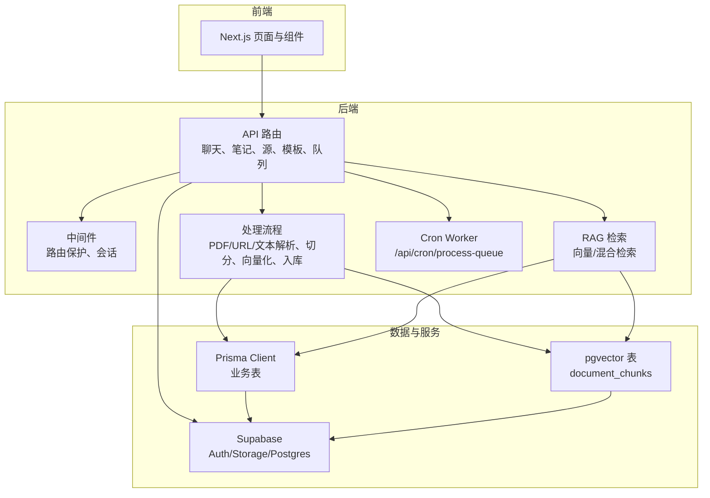
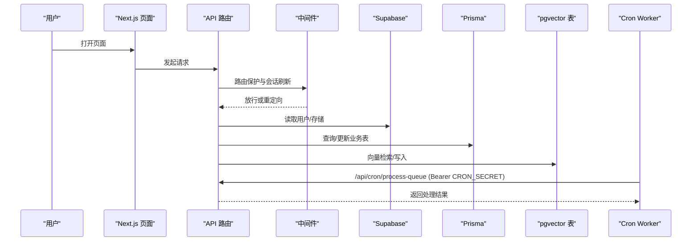
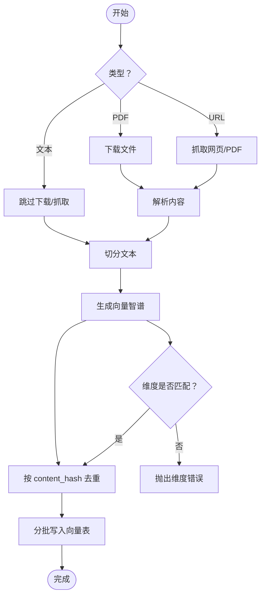
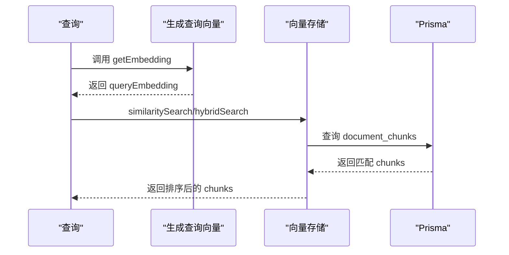
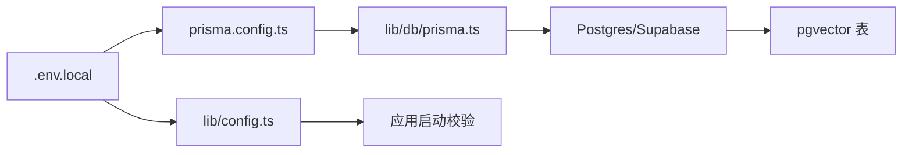

# 快速开始

<cite>
**本文引用的文件**
- [README.md](file://README.md)
- [package.json](file://package.json)
- [lib/config.ts](file://lib/config.ts)
- [prisma.config.ts](file://prisma.config.ts)
- [lib/db/prisma.ts](file://lib/db/prisma.ts)
- [lib/db/vector-store.ts](file://lib/db/vector-store.ts)
- [prisma/migrations/00000000000000_init_vector/migration.sql](file://prisma/migrations/00000000000000_init_vector/migration.sql)
- [lib/processing/processor.ts](file://lib/processing/processor.ts)
- [lib/processing/embedding.ts](file://lib/processing/embedding.ts)
- [lib/rag/retriever.ts](file://lib/rag/retriever.ts)
- [app/api/cron/process-queue/route.ts](file://app/api/cron/process-queue/route.ts)
- [middleware.ts](file://middleware.ts)
- [next.config.js](file://next.config.js)
</cite>

## 目录
1. [简介](#简介)
2. [项目结构](#项目结构)
3. [核心组件](#核心组件)
4. [架构总览](#架构总览)
5. [详细组件分析](#详细组件分析)
6. [依赖关系分析](#依赖关系分析)
7. [性能注意事项](#性能注意事项)
8. [故障排查指南](#故障排查指南)
9. [结论](#结论)
10. [附录](#附录)

## 简介
本指南面向首次接触 notebookLM-clone 的开发者，帮助你在最短时间内完成环境准备、依赖安装、Supabase 项目配置、数据库初始化与常用开发命令使用，从而顺利运行项目。

## 项目结构
该项目基于 Next.js App Router + TypeScript，采用 Supabase 提供的 Auth、Storage 与 Postgres（含 pgvector 扩展），并通过 Prisma 管理业务表与迁移；RAG 检索结合向量与全文检索（FTS），并提供处理队列与 Cron Worker 支持异步处理。

图表来源
- [lib/processing/processor.ts](file://lib/processing/processor.ts#L1-L560)
- [lib/rag/retriever.ts](file://lib/rag/retriever.ts#L1-L206)
- [app/api/cron/process-queue/route.ts](file://app/api/cron/process-queue/route.ts#L1-L165)
- [lib/db/vector-store.ts](file://lib/db/vector-store.ts#L1-L446)
- [lib/db/prisma.ts](file://lib/db/prisma.ts#L1-L41)

章节来源
- [README.md](file://README.md#L42-L49)

## 核心组件
- 环境与配置
  - Node.js 20（要求 ≥ 18.17）
  - Supabase 项目（Postgres + Storage）
  - 环境变量 .env.local（包含 Supabase、Prisma、模型服务、向量维度、Worker 鉴权等）
- 数据库与迁移
  - Prisma 迁移创建业务表
  - SQL 迁移创建向量表 document_chunks 与检索函数
- 处理与检索
  - 文档处理：PDF/URL/文本解析、切分、向量化、写入向量表
  - RAG 检索：向量相似度与混合检索（向量 + FTS）
- 路由保护与 Cron
  - Next.js 中间件进行登录态与路由保护
  - Cron Worker 处理队列任务

章节来源
- [README.md](file://README.md#L51-L122)
- [lib/config.ts](file://lib/config.ts#L1-L187)
- [lib/db/prisma.ts](file://lib/db/prisma.ts#L1-L41)
- [lib/db/vector-store.ts](file://lib/db/vector-store.ts#L1-L446)
- [lib/processing/processor.ts](file://lib/processing/processor.ts#L1-L560)
- [lib/rag/retriever.ts](file://lib/rag/retriever.ts#L1-L206)
- [middleware.ts](file://middleware.ts#L1-L78)

## 架构总览
下面以代码级视角展示关键交互：前端页面通过 API 路由访问后端能力；API 路由依赖 Supabase 进行鉴权与存储；处理流程将解析后的文本切片生成向量并写入 pgvector；RAG 检索结合向量与全文检索；Cron Worker 通过鉴权密钥拉取队列任务并执行处理。

图表来源
- [middleware.ts](file://middleware.ts#L15-L71)
- [lib/db/supabase.ts](file://lib/db/supabase.ts#L1-L39)
- [lib/db/prisma.ts](file://lib/db/prisma.ts#L1-L41)
- [lib/db/vector-store.ts](file://lib/db/vector-store.ts#L1-L446)
- [app/api/cron/process-queue/route.ts](file://app/api/cron/process-queue/route.ts#L11-L165)

## 详细组件分析

### 环境与依赖安装
- 环境要求
  - Node.js 20（要求 ≥ 18.17）
  - 已创建的 Supabase 项目（Postgres + Storage）
- 安装依赖
  - 使用包管理器安装依赖（脚本会在安装后自动生成 Prisma 客户端）
- 常用命令
  - 开发：启动 Next.js 开发服务器
  - 构建与启动：编译与运行生产版本
  - 质量检查：ESLint 与类型检查
  - Prisma：生成、推送到数据库、迁移、打开 Studio

章节来源
- [README.md](file://README.md#L53-L62)
- [package.json](file://package.json#L5-L16)

### 环境变量配置
在项目根目录创建 .env.local，至少包含以下配置（示例为占位符，不要提交真实密钥）：
- Supabase
  - NEXT_PUBLIC_SUPABASE_URL
  - NEXT_PUBLIC_SUPABASE_ANON_KEY
  - SUPABASE_SECRET_KEY
- Prisma
  - DATABASE_URL
  - DIRECT_URL
- 模型服务
  - ZHIPU_API_KEY
  - ZHIPU_BASE_URL
  - ZHIPU_EMBEDDING_MODEL
  - ZHIPU_CHAT_MODEL
  - LONGCAT_API_KEY
  - LONGCAT_BASE_URL
  - LONGCAT_CHAT_MODEL
- 向量维度
  - EMBEDDING_DIM（必须与数据库 vector(D) 一致）
- Worker 鉴权
  - CRON_SECRET（用于 /api/cron/process-queue）

说明
- 应用启动时会校验必需的环境变量与向量维度一致性
- 若 EMBEDDING_DIM 非法或与系统要求不一致，应用将抛出错误

章节来源
- [README.md](file://README.md#L66-L93)
- [lib/config.ts](file://lib/config.ts#L6-L29)
- [lib/config.ts](file://lib/config.ts#L169-L186)

### Supabase 项目设置
- 数据库
  - 创建 Supabase 项目，启用 Postgres
  - 在项目设置中获取 Postgres 连接信息，填入 DATABASE_URL/DIRECT_URL
- 存储
  - 在 Supabase Storage 中创建桶（例如 notebook-sources），用于存放 PDF 等文件
  - 在项目设置中获取匿名访问密钥与服务端密钥，填入 NEXT_PUBLIC_SUPABASE_ANON_KEY 与 SUPABASE_SECRET_KEY
- 认证
  - 启用 Supabase Auth，用于登录态与路由保护
  - 中间件会读取 NEXT_PUBLIC_SUPABASE_URL 与 NEXT_PUBLIC_SUPABASE_ANON_KEY 进行会话刷新与保护

章节来源
- [README.md](file://README.md#L30-L33)
- [middleware.ts](file://middleware.ts#L22-L38)
- [lib/db/supabase.ts](file://lib/db/supabase.ts#L12-L16)

### 数据库初始化与迁移
- 执行 Prisma 迁移
  - npm run db:migrate
  - 作用：创建业务表（notebooks/sources/messages/artifacts 等）与向量表 document_chunks，以及检索函数 match_document_chunks
- 迁移文件说明
  - SQL 迁移中显式声明向量维度为 1024，并创建 HNSW 索引与相关索引
  - 检索函数 match_document_chunks 支持按 notebook_id 与查询向量返回相似度最高的 chunks

章节来源
- [README.md](file://README.md#L95-L104)
- [prisma/migrations/00000000000000_init_vector/migration.sql](file://prisma/migrations/00000000000000_init_vector/migration.sql#L1-L65)
- [lib/db/vector-store.ts](file://lib/db/vector-store.ts#L312-L442)

### 处理流程与向量化
- 处理类型
  - PDF：从 Supabase Storage 下载、解析、切分、向量化、写入向量表
  - URL：抓取网页或 PDF、解析、切分、向量化、写入向量表
  - 文本：直接切分、向量化、写入向量表
- 向量维度与去重
  - 向量维度必须与数据库一致（默认 1024）
  - 按 content_hash 去重，避免重复写入
- 批量写入与日志
  - 批大小为 500，使用 ON CONFLICT (source_id, chunk_index) DO NOTHING 避免重复
  - 成功/失败均记录操作日志，便于追踪

图表来源
- [lib/processing/processor.ts](file://lib/processing/processor.ts#L82-L420)
- [lib/processing/embedding.ts](file://lib/processing/embedding.ts#L72-L110)
- [lib/db/vector-store.ts](file://lib/db/vector-store.ts#L77-L173)

章节来源
- [lib/processing/processor.ts](file://lib/processing/processor.ts#L1-L560)
- [lib/processing/embedding.ts](file://lib/processing/embedding.ts#L1-L189)
- [lib/db/vector-store.ts](file://lib/db/vector-store.ts#L1-L446)

### RAG 检索与混合检索
- 向量检索
  - 使用 PrismaVectorStore.similaritySearch，按 notebook_id 过滤，返回 topK 与阈值过滤的结果
- 混合检索
  - 结合向量相似度与全文检索（FTS），权重可配置
  - 使用 CTE 与统一分词器（simple）提升多语言支持
- 检索配置
  - topK、相似度阈值、是否使用混合检索、向量与 FTS 权重等

图表来源
- [lib/rag/retriever.ts](file://lib/rag/retriever.ts#L53-L116)
- [lib/rag/retriever.ts](file://lib/rag/retriever.ts#L131-L206)
- [lib/db/vector-store.ts](file://lib/db/vector-store.ts#L175-L297)
- [lib/db/vector-store.ts](file://lib/db/vector-store.ts#L312-L442)

章节来源
- [lib/rag/retriever.ts](file://lib/rag/retriever.ts#L1-L206)
- [lib/db/vector-store.ts](file://lib/db/vector-store.ts#L1-L446)

### 路由保护与中间件
- 受保护路由：/notebooks
- 已登录用户不应访问：/auth/login
- 中间件会读取 Supabase 的用户会话，未登录访问受保护路由将被重定向至登录页；已登录访问登录页将被重定向至笔记本列表

章节来源
- [middleware.ts](file://middleware.ts#L9-L13)
- [middleware.ts](file://middleware.ts#L45-L68)

### Cron Worker 与处理队列
- Worker 路由：/api/cron/process-queue
- 鉴权：请求头 Authorization: Bearer $CRON_SECRET
- 本地手动触发：/api/cron/process-queue?manual=true
- 批处理：每次最多处理 2 个任务，避免超时
- 自我修复：若发现状态为 pending 但不在队列中的 Source，会尝试恢复处理

章节来源
- [README.md](file://README.md#L124-L131)
- [app/api/cron/process-queue/route.ts](file://app/api/cron/process-queue/route.ts#L11-L165)

### 常用开发命令
- 开发：npm run dev
- 构建与启动：npm run build && npm run start
- 质量检查：npm run lint && npm run type-check
- Prisma：npm run db:studio 打开数据库可视化工具

章节来源
- [README.md](file://README.md#L106-L122)
- [package.json](file://package.json#L5-L16)

## 依赖关系分析
- 配置加载顺序
  - Prisma 配置文件读取 .env.local，设置 schema 与 datasource.url
  - 应用启动前校验环境变量与向量维度
- 数据库连接
  - 使用 @prisma/adapter-pg + pg Pool 连接 Supabase 数据库
  - 开发环境下缓存 PrismaClient 与 Pool，避免重复连接
- Next.js 配置
  - 图片域名白名单包含 Supabase 域名
  - serverActions 体限制提升到 50MB，支持大文件上传

图表来源
- [prisma.config.ts](file://prisma.config.ts#L6-L19)
- [lib/db/prisma.ts](file://lib/db/prisma.ts#L23-L34)
- [lib/config.ts](file://lib/config.ts#L169-L186)

章节来源
- [prisma.config.ts](file://prisma.config.ts#L1-L20)
- [lib/db/prisma.ts](file://lib/db/prisma.ts#L1-L41)
- [next.config.js](file://next.config.js#L4-L17)

## 性能注意事项
- 向量维度固定为 1024（智谱 embedding-3），确保与数据库一致
- 向量表使用 HNSW 索引（cosine 距离），提升检索性能
- 检索与写入均使用 CTE 与批量操作，减少重复计算与往返
- 处理流程中对嵌入维度进行严格校验，避免错误向量导致性能问题

章节来源
- [lib/config.ts](file://lib/config.ts#L6-L29)
- [prisma/migrations/00000000000000_init_vector/migration.sql](file://prisma/migrations/00000000000000_init_vector/migration.sql#L22-L24)
- [lib/db/vector-store.ts](file://lib/db/vector-store.ts#L175-L297)

## 故障排查指南
- 缺少必需环境变量
  - 现象：启动时报错提示缺失某些环境变量
  - 处理：复制 .env.example 到 .env.local 并填写实际值
- 向量维度不一致
  - 现象：启动时报错提示 EMBEDDING_DIM 非法或与系统要求不一致
  - 处理：将 EMBEDDING_DIM 设置为 1024，并确保数据库迁移与检索函数一致
- 数据库连接失败
  - 现象：Prisma 初始化或查询报错
  - 处理：检查 DATABASE_URL/DIRECT_URL 是否正确；如部署在 Vercel，建议使用 Supabase Transaction Pooler（端口 6543）
- Cron Worker 401
  - 现象：访问 /api/cron/process-queue 返回 401
  - 处理：确认 Authorization 头为 Bearer $CRON_SECRET；本地测试可使用 manual=true 参数
- 检索结果为空
  - 现象：RAG 检索不到任何结果
  - 处理：检查向量是否写入成功、阈值是否过高、是否选择了正确的 notebook_id 与 sourceIds

章节来源
- [lib/config.ts](file://lib/config.ts#L169-L186)
- [lib/config.ts](file://lib/config.ts#L18-L29)
- [lib/db/prisma.ts](file://lib/db/prisma.ts#L8-L16)
- [app/api/cron/process-queue/route.ts](file://app/api/cron/process-queue/route.ts#L22-L36)
- [lib/rag/retriever.ts](file://lib/rag/retriever.ts#L6-L13)

## 结论
按照本指南完成环境与 Supabase 配置、执行数据库迁移、设置环境变量与常用命令后，你即可在本地成功运行 notebookLM-clone。遇到问题时，可参考故障排查指南定位与解决。

## 附录
- Next.js 配置要点
  - 图片域名白名单包含 Supabase 域名
  - serverActions 体限制提升到 50MB，支持大文件上传

章节来源
- [next.config.js](file://next.config.js#L4-L17)