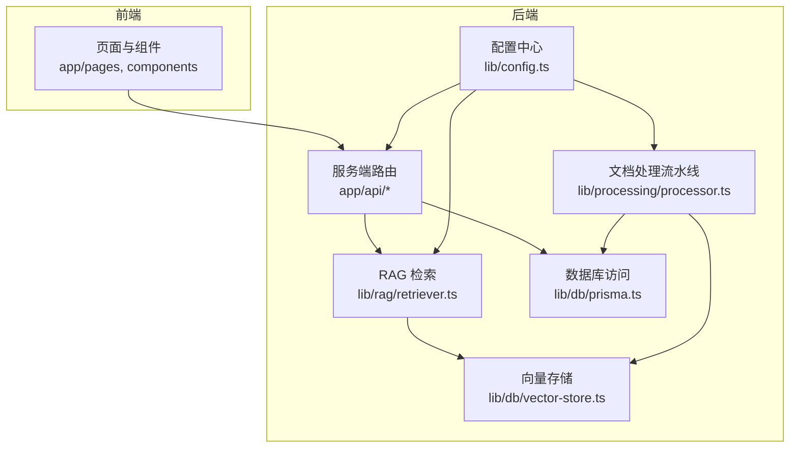
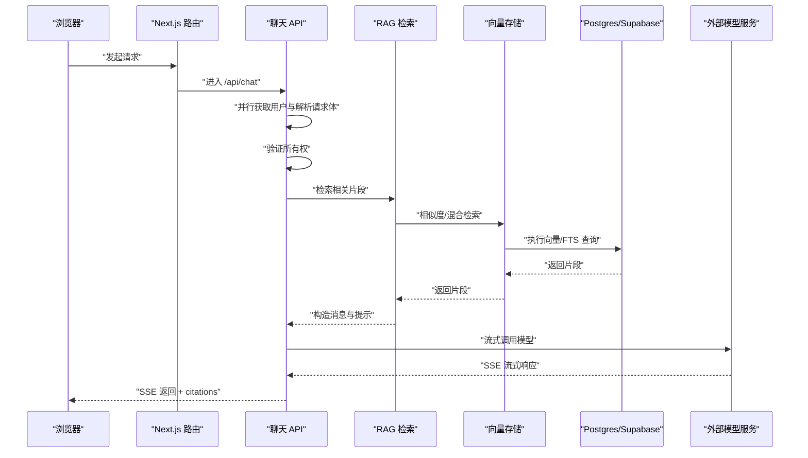
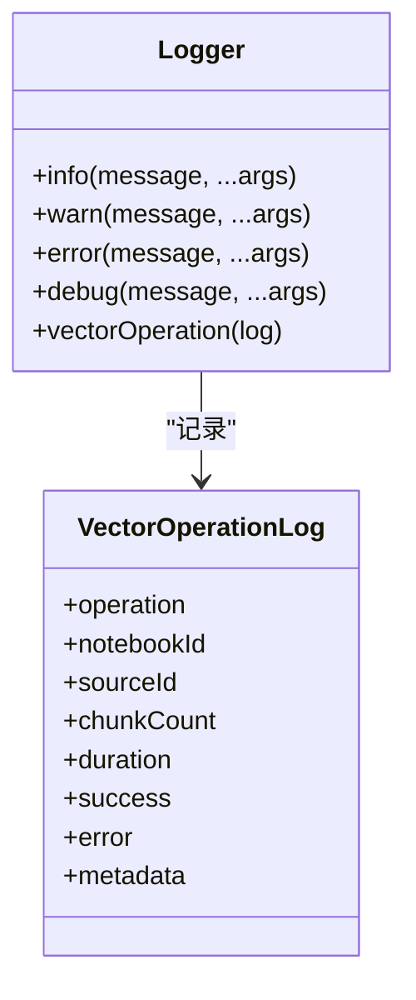
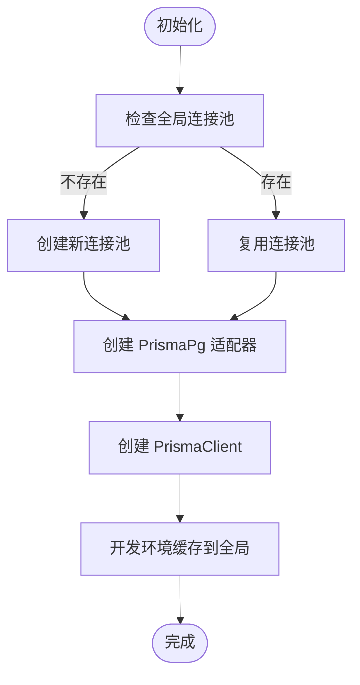
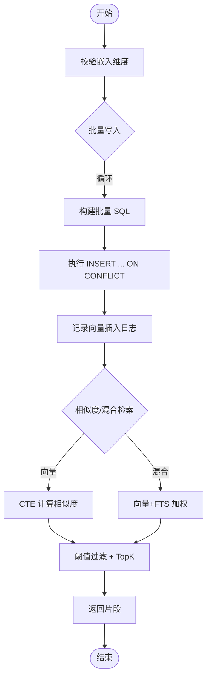
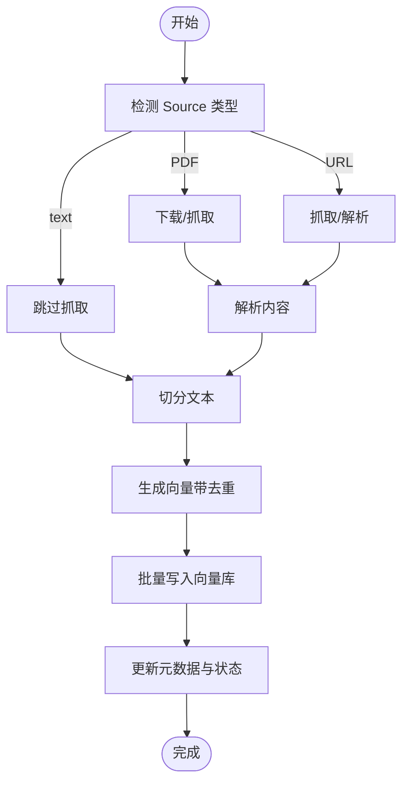
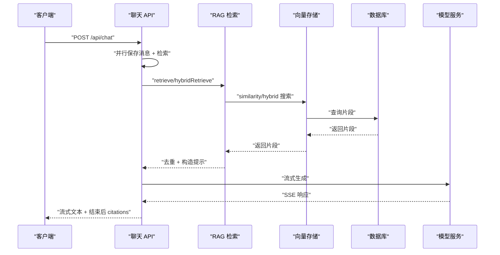
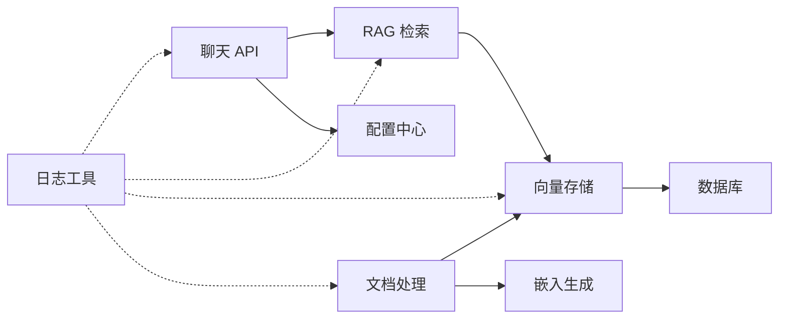

# 性能优化与监控

<cite>
**本文引用的文件**
- [next.config.js](file://next.config.js)
- [logger.ts](file://lib/utils/logger.ts)
- [prisma.ts](file://lib/db/prisma.ts)
- [supabase.ts](file://lib/db/supabase.ts)
- [vector-store.ts](file://lib/db/vector-store.ts)
- [embedding.ts](file://lib/processing/embedding.ts)
- [retriever.ts](file://lib/rag/retriever.ts)
- [generator.ts](file://lib/studio/generator.ts)
- [middleware.ts](file://middleware.ts)
- [config.ts](file://lib/config.ts)
- [processor.ts](file://lib/processing/processor.ts)
- [chat/route.ts](file://app/api/chat/route.ts)
- [notebooks/[id]/route.ts](file://app/api/notebooks/[id]/route.ts)
- [package.json](file://package.json)
</cite>

## 目录
1. [引言](#引言)
2. [项目结构](#项目结构)
3. [核心组件](#核心组件)
4. [架构总览](#架构总览)
5. [详细组件分析](#详细组件分析)
6. [依赖关系分析](#依赖关系分析)
7. [性能考量](#性能考量)
8. [故障排查指南](#故障排查指南)
9. [结论](#结论)
10. [附录](#附录)

## 引言
本文件面向 notebookLM-clone 项目，系统性梳理性能优化与监控方案，覆盖前端与后端两部分：前端侧聚焦代码分割、懒加载与缓存策略；后端侧聚焦数据库查询优化、API 响应时间优化与内存使用优化。同时，结合现有日志体系与埋点实践，给出应用性能监控、错误追踪、用户行为分析与业务指标监控的实施建议，并补充缓存机制设计、性能测试方法与监控告警配置思路。

## 项目结构
项目采用 Next.js 14 应用，按功能域划分目录：
- app/api/*：服务端路由，承载聊天、笔记本、数据源等 API
- lib/db：数据库访问层（Prisma + Postgres/Supabase）
- lib/processing：文档处理流水线（PDF/URL/text → 切分 → 向量 → 写库）
- lib/rag：RAG 检索与生成
- lib/studio：Studio 产物生成（思维导图、测验等）
- lib/utils：通用工具（日志）
- middleware.ts：路由保护与会话刷新
- next.config.js：Next.js 构建与运行配置

图表来源
- [chat/route.ts](file://app/api/chat/route.ts#L1-L324)
- [processor.ts](file://lib/processing/processor.ts#L1-L560)
- [vector-store.ts](file://lib/db/vector-store.ts#L1-L446)
- [prisma.ts](file://lib/db/prisma.ts#L1-L41)
- [config.ts](file://lib/config.ts#L1-L187)

章节来源
- [package.json](file://package.json#L1-L82)
- [next.config.js](file://next.config.js#L1-L21)

## 核心组件
- 日志与监控：统一日志工具，提供结构化日志与向量操作专项日志
- 数据库访问：Prisma + Postgres/Supabase，连接池与日志级别控制
- 向量检索：向量存储封装，支持相似度搜索与混合检索，内置性能日志
- 文档处理：PDF/URL/text 多源处理流水线，阶段化状态与耗时统计
- RAG 检索：嵌入生成与检索分离，支持去重与混合检索
- Studio 生成：快速/精准两种模式，带超时控制与解析校验
- API 路由：聊天 API 流式返回，异步并行处理与错误兜底
- 中间件：路由保护与会话刷新

章节来源
- [logger.ts](file://lib/utils/logger.ts#L1-L98)
- [prisma.ts](file://lib/db/prisma.ts#L1-L41)
- [vector-store.ts](file://lib/db/vector-store.ts#L1-L446)
- [processor.ts](file://lib/processing/processor.ts#L1-L560)
- [retriever.ts](file://lib/rag/retriever.ts#L1-L206)
- [generator.ts](file://lib/studio/generator.ts#L1-L311)
- [chat/route.ts](file://app/api/chat/route.ts#L1-L324)
- [middleware.ts](file://middleware.ts#L1-L78)

## 架构总览
下图展示从浏览器到数据库与外部模型服务的关键链路，标注性能优化点与监控落点。

图表来源
- [chat/route.ts](file://app/api/chat/route.ts#L25-L324)
- [retriever.ts](file://lib/rag/retriever.ts#L53-L116)
- [vector-store.ts](file://lib/db/vector-store.ts#L175-L297)
- [prisma.ts](file://lib/db/prisma.ts#L1-L41)

## 详细组件分析

### 日志与监控（结构化日志与向量操作日志）
- 设计要点
  - 开发环境全量输出，生产环境仅输出错误级别以降低噪声
  - 提供 info/warn/error/debug 通用接口
  - 向量操作日志包含操作类型、笔记/数据源标识、耗时、成功与否及元数据（如插入数量、阈值、平均相似度等）
- 性能意义
  - 通过结构化日志定位慢查询与异常路径
  - 为后续指标采集与告警提供数据基础

图表来源
- [logger.ts](file://lib/utils/logger.ts#L29-L98)

章节来源
- [logger.ts](file://lib/utils/logger.ts#L1-L98)

### 数据库访问与连接池（Prisma + Postgres/Supabase）
- 设计要点
  - 使用 PrismaPg 适配器与独立连接池，避免 Serverless 环境连接泄漏
  - 生产环境仅记录错误级别日志，减少 I/O 压力
  - 全局缓存 PrismaClient 与 Pool，开发环境复用
- 性能意义
  - 降低冷启动与连接建立开销
  - 控制日志量，避免写放大

图表来源
- [prisma.ts](file://lib/db/prisma.ts#L18-L41)

章节来源
- [prisma.ts](file://lib/db/prisma.ts#L1-L41)

### 向量存储与检索（相似度搜索、混合检索、批量写入）
- 设计要点
  - 批量写入：分批插入，避免单次事务过大；冲突时去重
  - 查询优化：CTE 消除重复计算；可选限定 sourceIds；阈值过滤；TopK 限制
  - 混合检索：向量相似度与全文检索（TSV + simple 分词器）加权融合
  - 维度校验：严格校验嵌入维度与数据库一致
- 性能意义
  - 批量写入显著降低写库成本
  - CTE 与阈值/TopK 有效控制查询复杂度
  - 混合检索提升召回质量与稳定性

图表来源
- [vector-store.ts](file://lib/db/vector-store.ts#L77-L446)
- [config.ts](file://lib/config.ts#L6-L29)

章节来源
- [vector-store.ts](file://lib/db/vector-store.ts#L1-L446)
- [config.ts](file://lib/config.ts#L1-L187)

### 文档处理流水线（PDF/URL/text → 切分 → 向量 → 写库）
- 设计要点
  - 阶段化状态与耗时统计，便于定位瓶颈
  - Source 内去重：基于 contentHash，避免重复向量化
  - 多源支持：PDF/URL/text，分别走不同路径
  - 清理：删除 Source 时级联清理向量与队列
- 性能意义
  - 阶段化日志支撑性能回归分析
  - 去重减少重复计算与写库成本

图表来源
- [processor.ts](file://lib/processing/processor.ts#L82-L526)
- [embedding.ts](file://lib/processing/embedding.ts#L140-L189)

章节来源
- [processor.ts](file://lib/processing/processor.ts#L1-L560)
- [embedding.ts](file://lib/processing/embedding.ts#L1-L189)

### RAG 检索与生成（嵌入生成、去重、混合检索、流式返回）
- 设计要点
  - 嵌入生成：分批与指数退避重试，估算 token 消耗
  - 检索：相似度与混合检索，去重与评分
  - 聊天 API：并行保存用户消息与检索，流式返回，结束后附加 citations
  - 模型选择：根据模式选择不同模型配置
- 性能意义
  - 并行化减少端到端等待
  - 流式返回改善首字节时间
  - 去重避免冗余上下文

图表来源
- [chat/route.ts](file://app/api/chat/route.ts#L70-L324)
- [retriever.ts](file://lib/rag/retriever.ts#L53-L206)
- [vector-store.ts](file://lib/db/vector-store.ts#L175-L442)

章节来源
- [retriever.ts](file://lib/rag/retriever.ts#L1-L206)
- [chat/route.ts](file://app/api/chat/route.ts#L1-L324)

### Studio 产物生成（快速/精准模式、超时控制、解析校验）
- 设计要点
  - 快速模式：智能采样 + 简单策略
  - 精准模式：Map-Reduce，分 Source 处理再合并
  - 超时控制：AbortController 保障长请求可控
  - 解析校验：对产物进行解析并记录成功率
- 性能意义
  - 模式切换满足不同 SLA 需求
  - 超时与解析失败快速失败，避免资源浪费

章节来源
- [generator.ts](file://lib/studio/generator.ts#L1-L311)

### 路由保护与会话管理（中间件）
- 设计要点
  - 受保护路由与认证路由分流
  - 会话刷新与 Cookie 同步
  - 匹配器排除静态资源与图片
- 性能意义
  - 减少不必要的鉴权开销
  - 保持会话一致性，避免重复登录

章节来源
- [middleware.ts](file://middleware.ts#L1-L78)

## 依赖关系分析
- 组件耦合
  - API 路由依赖 RAG 检索与配置中心
  - RAG 依赖向量存储与配置中心
  - 文档处理依赖向量存储与嵌入生成
  - 日志工具被多个模块调用，形成横切关注点
- 外部依赖
  - Next.js、Prisma、Postgres/Supabase、外部模型服务（智谱/LongCat）

图表来源
- [chat/route.ts](file://app/api/chat/route.ts#L1-L324)
- [retriever.ts](file://lib/rag/retriever.ts#L1-L206)
- [vector-store.ts](file://lib/db/vector-store.ts#L1-L446)
- [processor.ts](file://lib/processing/processor.ts#L1-L560)
- [logger.ts](file://lib/utils/logger.ts#L1-L98)

章节来源
- [chat/route.ts](file://app/api/chat/route.ts#L1-L324)
- [retriever.ts](file://lib/rag/retriever.ts#L1-L206)
- [vector-store.ts](file://lib/db/vector-store.ts#L1-L446)
- [processor.ts](file://lib/processing/processor.ts#L1-L560)
- [logger.ts](file://lib/utils/logger.ts#L1-L98)

## 性能考量

### 前端性能优化（建议）
- 代码分割与懒加载
  - Next.js 已默认启用 React 18 并行渲染与动态导入能力，建议在大型组件与第三方库处使用动态导入
  - 对于 Studio 产物查看器、思维导图等重型组件，采用动态导入与 Suspense 边界
- 缓存策略
  - 利用浏览器缓存与 CDN 缓存静态资源
  - 对于聊天历史与检索结果，可在客户端做短期缓存，结合查询键（notebookId、sourceIds、query）作为缓存键
- 图片与媒体
  - 使用 next/image 并配置 remotePatterns，确保图片资源来自可信域名
- 用户体验
  - 长列表虚拟化（如消息列表、片段列表）
  - 骨架屏与渐进式渲染

章节来源
- [next.config.js](file://next.config.js#L1-L21)

### 后端性能优化（已实现与建议）
- 数据库查询优化
  - 已实现：批量写入、CTE 消除重复计算、阈值过滤、TopK 限制、FTS 使用 simple 分词器
  - 建议：为常用查询字段建立复合索引；定期分析查询计划；对高并发场景考虑只读副本
- API 响应时间优化
  - 已实现：并行保存消息与检索、流式返回、超时控制
  - 建议：对热点 notebook 增加只读缓存；对检索参数做白名单校验；引入边缘缓存（CDN/边缘存储）
- 内存使用优化
  - 已实现：分批处理嵌入、去重减少重复对象、阶段化日志
  - 建议：限制单次请求大小与批大小；对大对象使用流式处理；及时释放临时对象
- 连接池与并发
  - 已实现：全局连接池与 PrismaPg 适配器
  - 建议：根据实例规格调整连接上限；监控连接池命中率与等待时间

章节来源
- [vector-store.ts](file://lib/db/vector-store.ts#L105-L173)
- [vector-store.ts](file://lib/db/vector-store.ts#L204-L297)
- [chat/route.ts](file://app/api/chat/route.ts#L70-L324)
- [embedding.ts](file://lib/processing/embedding.ts#L140-L189)
- [prisma.ts](file://lib/db/prisma.ts#L18-L41)

### 监控系统（现状与建议）
- 现状
  - 结构化日志：统一 Logger，向量操作专项日志
  - 关键指标：检索耗时、嵌入耗时、生成耗时、总耗时、向量写入数量/跳过数
- 建议
  - APM：集成 OpenTelemetry 或平台自带 APM，采集链路追踪与指标
  - 错误追踪：结合日志与错误上报（如 Sentry），区分用户态与系统态错误
  - 用户行为：埋点聊天对话、检索命中、产物生成、Studio 操作
  - 业务指标：RAG 召回率、准确率、用户满意度、资源使用率（CPU/内存/网络）

章节来源
- [logger.ts](file://lib/utils/logger.ts#L75-L94)
- [chat/route.ts](file://app/api/chat/route.ts#L232-L280)
- [retriever.ts](file://lib/rag/retriever.ts#L44-L51)

### 日志记录设计与实现
- 结构化日志
  - 时间戳、级别、模块、操作、耗时、上下文键值
- 日志级别管理
  - 开发：info/warn/error/debug 全量；生产：仅 error
- 敏感信息过滤
  - 避免在日志中打印密钥、令牌、用户隐私内容；必要时脱敏
- 日志聚合
  - 输出到 stdout/stderr，由平台日志系统收集与聚合

章节来源
- [logger.ts](file://lib/utils/logger.ts#L29-L70)

### 性能指标定义与收集
- 响应时间
  - API 端到端、检索、嵌入、生成三段式耗时
- 吞吐量
  - QPS、每秒消息数、每秒向量写入数
- 资源使用率
  - CPU/内存/连接池占用、I/O 延迟
- 用户体验指标
  - 首字节时间、首次内容可用时间、流畅度、召回命中率

章节来源
- [chat/route.ts](file://app/api/chat/route.ts#L232-L280)
- [retriever.ts](file://lib/rag/retriever.ts#L44-L51)
- [processor.ts](file://lib/processing/processor.ts#L33-L51)

### 缓存机制设计（建议）
- 多级缓存
  - 应用层：LRU 缓存检索结果与嵌入
  - CDN/边缘：静态资源与只读数据
  - 数据库层：查询结果缓存（谨慎使用）
- 缓存失效策略
  - 基于 TTL 与版本号；内容变更触发失效
- 缓存一致性
  - 写路径：先写数据库，再失效缓存
  - 读路径：优先命中，未命中回源并回填

章节来源
- [chat/route.ts](file://app/api/chat/route.ts#L70-L96)
- [retriever.ts](file://lib/rag/retriever.ts#L53-L116)

### 性能测试方法与工具（建议）
- 压力测试
  - 使用 k6/JMeter 对 /api/chat 与 /api/notebooks 进行并发压测
- 负载测试
  - 模拟真实用户行为，逐步增加并发与数据规模
- 性能回归测试
  - 将关键指标纳入 CI，设定阈值告警

章节来源
- [chat/route.ts](file://app/api/chat/route.ts#L1-L324)
- [notebooks/[id]/route.ts](file://app/api/notebooks/[id]/route.ts#L1-L138)

### 监控告警配置与管理（建议）
- 阈值设置
  - P95/P99 响应时间、错误率、超时率、资源使用率
- 通知机制
  - 多通道通知（邮件/IM/电话），分级告警
- 故障处理流程
  - 自动降级（禁用混合检索/降级模型）、快速回滚、容量扩容

章节来源
- [logger.ts](file://lib/utils/logger.ts#L75-L94)
- [chat/route.ts](file://app/api/chat/route.ts#L316-L323)

## 故障排查指南
- 常见问题
  - 向量维度不匹配：检查 EMBEDDING_DIM 与数据库一致
  - 检索无证据：确认嵌入生成与写库是否成功
  - 流式返回中断：检查模型服务可达性与超时设置
  - 权限错误：确认 Supabase 会话与资源归属
- 排查步骤
  - 查看结构化日志与向量操作日志
  - 核对数据库索引与查询计划
  - 检查外部模型服务状态与配额
  - 复现最小化用例并采集指标

章节来源
- [config.ts](file://lib/config.ts#L9-L29)
- [vector-store.ts](file://lib/db/vector-store.ts#L92-L102)
- [chat/route.ts](file://app/api/chat/route.ts#L316-L323)
- [supabase.ts](file://lib/db/supabase.ts#L22-L33)

## 结论
本项目在数据库访问、向量检索与生成链路等方面已具备良好的性能基线：批量写入、CTE 优化、阈值与 TopK 控制、并行化与流式返回等。建议在此基础上进一步完善前端懒加载与缓存策略、引入 APM 与指标体系、完善缓存一致性与失效策略，并将性能指标纳入 CI，持续进行性能回归测试与告警治理，以保障在高并发与大规模数据下的稳定表现。

## 附录
- 关键配置项
  - EMBEDDING_DIM：向量维度（必须与数据库一致）
  - DATABASE_URL：数据库连接串（建议使用 Supabase Transaction Pooler）
  - NEXT_PUBLIC_SUPABASE_*：Supabase 前端配置
  - ZHIPU/LONGCAT_*：模型服务密钥与基础地址
- 环境变量校验
  - 启动时强制校验关键环境变量，缺失将直接报错

章节来源
- [config.ts](file://lib/config.ts#L169-L187)
- [prisma.ts](file://lib/db/prisma.ts#L5-L16)