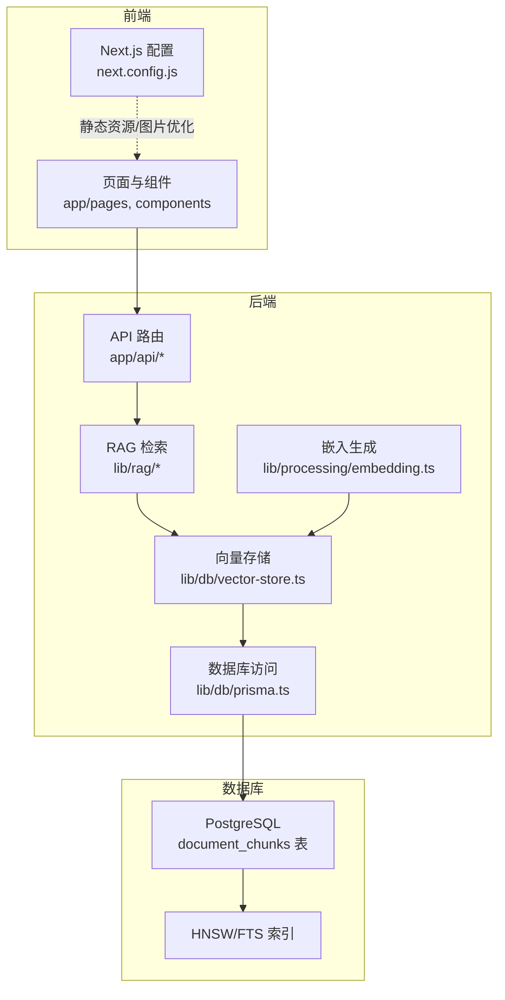
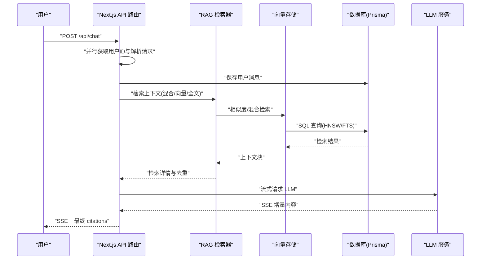
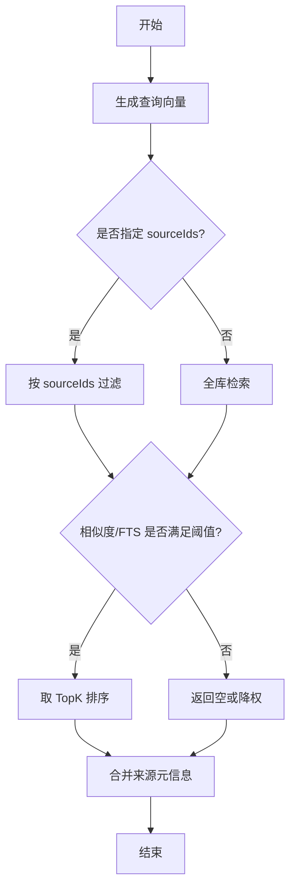
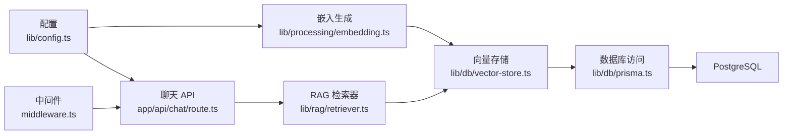

# 性能优化策略

<cite>
**本文引用的文件**
- [next.config.js](file://next.config.js)
- [package.json](file://package.json)
- [lib/config.ts](file://lib/config.ts)
- [lib/db/prisma.ts](file://lib/db/prisma.ts)
- [lib/db/vector-store.ts](file://lib/db/vector-store.ts)
- [lib/processing/embedding.ts](file://lib/processing/embedding.ts)
- [lib/rag/retriever.ts](file://lib/rag/retriever.ts)
- [app/api/chat/route.ts](file://app/api/chat/route.ts)
- [lib/utils/logger.ts](file://lib/utils/logger.ts)
- [middleware.ts](file://middleware.ts)
- [prisma/migrations/20260120120200_optimize_hnsw_index/migration.sql](file://prisma/migrations/20260120120200_optimize_hnsw_index/migration.sql)
- [prisma/migrations/20260120050505_add_content_tsv/migration.sql](file://prisma/migrations/20260120050505_add_content_tsv/migration.sql)
</cite>

## 目录
1. [简介](#简介)
2. [项目结构](#项目结构)
3. [核心组件](#核心组件)
4. [架构总览](#架构总览)
5. [详细组件分析](#详细组件分析)
6. [依赖关系分析](#依赖关系分析)
7. [性能考量](#性能考量)
8. [故障排查指南](#故障排查指南)
9. [结论](#结论)
10. [附录](#附录)

## 简介
本文件面向 notebookLM-clone 项目，系统化梳理并提出性能优化策略，覆盖前端（Next.js 代码分割、组件懒加载、静态资源与缓存）、后端（数据库查询、API 响应时间、内存与并发）、向量检索（索引与查询参数、批量处理）、缓存机制（多级缓存、失效与一致性）、性能监控指标与测试方法。目标是在保障功能正确性的前提下，显著降低响应时间、提升吞吐量，并稳定用户体验。

## 项目结构
项目采用 Next.js App Router 结构，API 路由位于 app/api 下，业务逻辑集中在 lib 子目录中，数据库访问通过 Prisma + PostgreSQL，向量检索基于 HNSW 索引与全文检索（TSV）组合。

图示来源
- [next.config.js](file://next.config.js#L1-L21)
- [lib/db/vector-store.ts](file://lib/db/vector-store.ts#L1-L446)
- [lib/db/prisma.ts](file://lib/db/prisma.ts#L1-L41)
- [lib/rag/retriever.ts](file://lib/rag/retriever.ts#L1-L206)
- [lib/processing/embedding.ts](file://lib/processing/embedding.ts#L1-L189)
- [app/api/chat/route.ts](file://app/api/chat/route.ts#L1-L324)

章节来源
- [next.config.js](file://next.config.js#L1-L21)
- [package.json](file://package.json#L1-L82)

## 核心组件
- 向量存储与检索：提供相似度检索、混合检索、删除与去重能力，支持批量插入与阈值过滤。
- 嵌入生成：带指数退避重试、分批处理、维度校验与去重跳过。
- RAG 检索器：统一检索入口，支持向量/混合/全文检索，聚合来源信息并构造检索详情。
- 数据库访问：基于 Prisma + Postgres，使用连接池适配 Serverless。
- API 路由：聊天流式响应，异步并行处理检索与消息持久化，统一返回 citations。
- 日志与监控：向量操作日志结构化输出，便于性能观测。

章节来源
- [lib/db/vector-store.ts](file://lib/db/vector-store.ts#L1-L446)
- [lib/processing/embedding.ts](file://lib/processing/embedding.ts#L1-L189)
- [lib/rag/retriever.ts](file://lib/rag/retriever.ts#L1-L206)
- [lib/db/prisma.ts](file://lib/db/prisma.ts#L1-L41)
- [app/api/chat/route.ts](file://app/api/chat/route.ts#L1-L324)
- [lib/utils/logger.ts](file://lib/utils/logger.ts#L1-L98)

## 架构总览
下图展示从用户请求到流式响应的关键链路，以及向量检索与数据库交互的路径。

图示来源
- [app/api/chat/route.ts](file://app/api/chat/route.ts#L25-L324)
- [lib/rag/retriever.ts](file://lib/rag/retriever.ts#L53-L206)
- [lib/db/vector-store.ts](file://lib/db/vector-store.ts#L175-L442)
- [lib/db/prisma.ts](file://lib/db/prisma.ts#L1-L41)

## 详细组件分析

### 前端性能优化（Next.js 与静态资源）
- 代码分割与懒加载
  - 使用 App Router 的路由级并行加载与动态导入，减少首屏阻塞。
  - 将重型组件（如思维导图、图表）按需加载，避免不必要的包体积。
- 图片与静态资源
  - 通过 next.config.js 配置允许的远程域名与本地回环，结合 CDN 与缓存头优化图片加载。
  - 对于 Supabase 存储的图片，确保使用 HTTPS 且域名白名单生效。
- 构建与运行时
  - 开启 React 严格模式有助于捕获副作用问题；谨慎评估对性能的影响。
  - 服务器动作体限制放宽以支持大文件上传，需配合前端分片与进度反馈。

章节来源
- [next.config.js](file://next.config.js#L1-L21)
- [package.json](file://package.json#L1-L82)

### 后端性能优化（API、数据库与并发）
- API 响应时间优化
  - 在聊天 API 中对“保存用户消息”和“检索上下文”进行并行处理，缩短关键路径。
  - 流式返回 LLM 输出，边生成边传输，降低首字节时间。
- 数据库查询优化
  - 使用 HNSW 索引进行向量近似最近邻检索，提升查询性能与召回。
  - 为 content_tsv 列建立 GIN 索引，支持全文检索（FTS）与混合检索。
  - 查询中使用 CTE 消除重复计算，限定 source_ids 与阈值过滤，减少结果集。
- 内存与并发
  - 使用 Postgres 连接池适配 Serverless，限制每个实例连接数，避免资源争用。
  - 控制批量大小与令牌上限，避免单次请求过大导致超时或 OOM。
- 并发处理
  - API 层采用 Promise.all 并行执行独立任务，提升吞吐。
  - 向量插入采用分批写入，避免单事务过大。

章节来源
- [app/api/chat/route.ts](file://app/api/chat/route.ts#L25-L324)
- [lib/db/vector-store.ts](file://lib/db/vector-store.ts#L175-L442)
- [prisma/migrations/20260120120200_optimize_hnsw_index/migration.sql](file://prisma/migrations/20260120120200_optimize_hnsw_index/migration.sql#L1-L16)
- [prisma/migrations/20260120050505_add_content_tsv/migration.sql](file://prisma/migrations/20260120050505_add_content_tsv/migration.sql#L1-L7)
- [lib/db/prisma.ts](file://lib/db/prisma.ts#L1-L41)

### 向量检索性能优化
- 索引优化
  - HNSW 索引参数调优（m、ef_construction）提升召回率与查询稳定性。
  - FTS 索引（GIN）加速文本匹配，与向量检索融合。
- 查询参数调优
  - topK、阈值、权重（向量/全文）影响召回数量与质量，需结合业务场景迭代。
  - 限定 sourceIds 可显著缩小搜索空间。
- 批量处理策略
  - 插入：分批（每批上限）+ ON CONFLICT 跳过重复，减少冲突开销。
  - 嵌入：分批（最大批大小、令牌上限）+ 指数退避重试，提升成功率与稳定性。
  - 去重：基于 contentHash 跳过已存在块，避免重复向量化。

图示来源
- [lib/rag/retriever.ts](file://lib/rag/retriever.ts#L53-L206)
- [lib/db/vector-store.ts](file://lib/db/vector-store.ts#L175-L442)

章节来源
- [lib/db/vector-store.ts](file://lib/db/vector-store.ts#L1-L446)
- [lib/rag/retriever.ts](file://lib/rag/retriever.ts#L1-L206)
- [lib/processing/embedding.ts](file://lib/processing/embedding.ts#L1-L189)
- [prisma/migrations/20260120120200_optimize_hnsw_index/migration.sql](file://prisma/migrations/20260120120200_optimize_hnsw_index/migration.sql#L1-L16)
- [prisma/migrations/20260120050505_add_content_tsv/migration.sql](file://prisma/migrations/20260120050505_add_content_tsv/migration.sql#L1-L7)

### 缓存机制设计与实现
- 多级缓存架构
  - 应用层：对检索结果与嵌入生成进行短期缓存（基于内存或 Redis），降低重复请求成本。
  - 数据层：利用数据库索引（HNSW/FTS）与查询过滤（阈值、TopK、sourceIds）减少扫描范围。
  - 前端层：组件渲染缓存、图片与静态资源缓存（CDN/浏览器缓存）。
- 缓存失效策略
  - 基于内容哈希（contentHash）判断是否需要重新向量化与入库。
  - 源文档更新/删除触发相关缓存清理。
- 缓存一致性保证
  - 写入与查询使用同一阈值与权重配置，避免因参数差异导致的不一致。
  - 日志记录检索耗时与命中情况，辅助一致性审计。

章节来源
- [lib/db/vector-store.ts](file://lib/db/vector-store.ts#L305-L310)
- [lib/processing/embedding.ts](file://lib/processing/embedding.ts#L140-L189)
- [lib/utils/logger.ts](file://lib/utils/logger.ts#L1-L98)

### 性能监控指标与收集
- 关键指标
  - 响应时间：API 总耗时、检索耗时、嵌入耗时、生成耗时。
  - 吞吐量：QPS、并发会话数、流式传输速率。
  - 资源使用率：CPU、内存、数据库连接数、向量索引命中率。
  - 用户体验：首字节时间、可读性评分、citations 准确性。
- 收集方式
  - 结构化日志：向量操作日志包含操作类型、耗时、成功状态与元数据。
  - APM/Tracing：在 API 层埋点，追踪检索与生成阶段耗时。
  - 数据库指标：索引使用率、查询计划分析、慢查询日志。

章节来源
- [lib/utils/logger.ts](file://lib/utils/logger.ts#L1-L98)
- [app/api/chat/route.ts](file://app/api/chat/route.ts#L25-L324)

### 性能测试方法与工具
- 压力测试
  - 使用压测工具模拟高并发请求，观察响应时间与错误率，定位瓶颈。
  - 关注数据库连接池上限、向量索引查询延迟与 LLM 限流。
- 负载测试
  - 逐步提升并发与数据规模，验证系统弹性与稳定性。
  - 检查检索阈值与 TopK 对延迟与准确率的影响。
- 性能回归测试
  - 建立基准测试集，定期回归对比关键指标，防止性能退化。
  - 集成 CI/CD，自动执行回归测试并告警。

## 依赖关系分析

图示来源
- [lib/config.ts](file://lib/config.ts#L1-L187)
- [lib/processing/embedding.ts](file://lib/processing/embedding.ts#L1-L189)
- [lib/rag/retriever.ts](file://lib/rag/retriever.ts#L1-L206)
- [lib/db/vector-store.ts](file://lib/db/vector-store.ts#L1-L446)
- [lib/db/prisma.ts](file://lib/db/prisma.ts#L1-L41)
- [app/api/chat/route.ts](file://app/api/chat/route.ts#L1-L324)
- [middleware.ts](file://middleware.ts#L1-L78)

章节来源
- [lib/config.ts](file://lib/config.ts#L1-L187)
- [lib/processing/embedding.ts](file://lib/processing/embedding.ts#L1-L189)
- [lib/rag/retriever.ts](file://lib/rag/retriever.ts#L1-L206)
- [lib/db/vector-store.ts](file://lib/db/vector-store.ts#L1-L446)
- [lib/db/prisma.ts](file://lib/db/prisma.ts#L1-L41)
- [app/api/chat/route.ts](file://app/api/chat/route.ts#L1-L324)
- [middleware.ts](file://middleware.ts#L1-L78)

## 性能考量
- 端到端延迟优化
  - 优先采用混合检索（向量+全文），在保证召回的同时控制 TopK。
  - 通过并行与流式传输，缩短用户感知等待时间。
- 数据库与索引
  - HNSW 参数与 FTS 索引需结合数据分布与查询模式持续调优。
  - 控制批量大小与令牌上限，避免单次请求超时或资源不足。
- 外部服务
  - 嵌入与 LLM API 采用指数退避与流式响应，提升鲁棒性与体验。
- 运行时与部署
  - Serverless 环境下严格控制数据库连接数，避免冷启动与连接争用。
  - 前端静态资源与图片缓存策略，减少网络往返。

## 故障排查指南
- 常见问题
  - 向量维度不匹配：检查 EMBEDDING_DIM 与数据库向量维度一致。
  - 查询性能下降：核对 HNSW/FTS 索引是否存在、阈值与 TopK 设置是否合理。
  - 嵌入失败：查看重试次数与退避间隔，确认外部 API Key 与模型配置。
  - 流式传输中断：检查上游 LLM 返回格式与 SSE 转换逻辑。
- 排查步骤
  - 查看向量操作日志，定位耗时与错误原因。
  - 对比检索耗时与嵌入耗时，识别瓶颈阶段。
  - 校验数据库连接池配置与并发上限。

章节来源
- [lib/config.ts](file://lib/config.ts#L1-L187)
- [lib/utils/logger.ts](file://lib/utils/logger.ts#L1-L98)
- [lib/db/vector-store.ts](file://lib/db/vector-store.ts#L175-L442)
- [lib/processing/embedding.ts](file://lib/processing/embedding.ts#L115-L134)
- [app/api/chat/route.ts](file://app/api/chat/route.ts#L193-L314)

## 结论
通过在前端启用按需加载与静态资源优化、在后端采用并行与流式处理、在数据库层面完善 HNSW/FTS 索引与连接池配置、在检索侧实施分批与阈值控制，并辅以结构化日志与指标监控，notebookLM-clone 能够实现低延迟、高吞吐与稳定的用户体验。后续建议持续迭代索引参数与检索权重，并引入自动化回归测试以保障长期性能。

## 附录
- 环境变量与配置要点
  - EMBEDDING_DIM：必须与数据库向量维度一致。
  - DATABASE_URL：建议使用 Supabase Transaction Pooler 并限制连接数。
  - ZHIPU_API_KEY/模型配置：确保与嵌入与对话模型版本匹配。
- 数据库迁移要点
  - HNSW 索引参数（m、ef_construction）提升召回与稳定性。
  - FTS 列与 GIN 索引支持混合检索。

章节来源
- [lib/config.ts](file://lib/config.ts#L1-L187)
- [lib/db/prisma.ts](file://lib/db/prisma.ts#L1-L41)
- [prisma/migrations/20260120120200_optimize_hnsw_index/migration.sql](file://prisma/migrations/20260120120200_optimize_hnsw_index/migration.sql#L1-L16)
- [prisma/migrations/20260120050505_add_content_tsv/migration.sql](file://prisma/migrations/20260120050505_add_content_tsv/migration.sql#L1-L7)