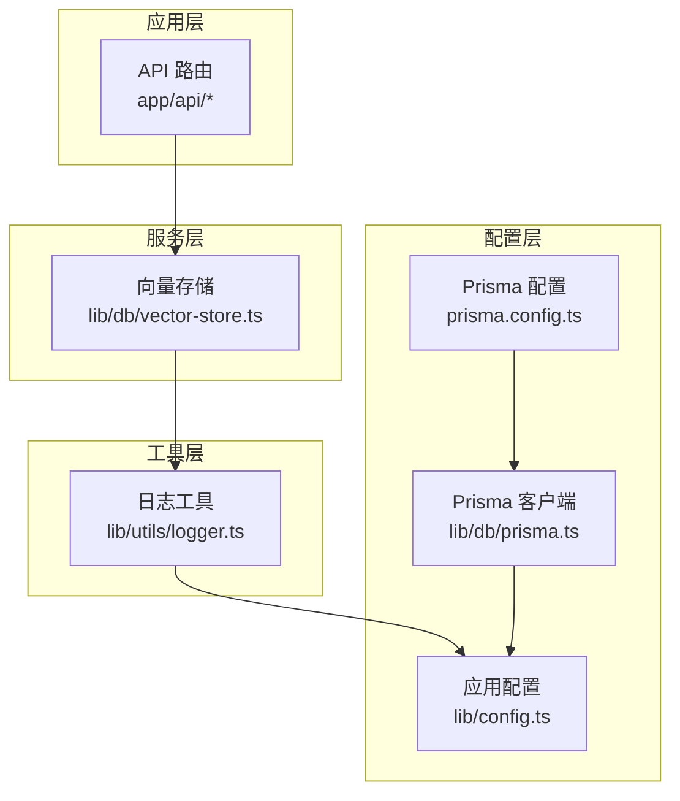
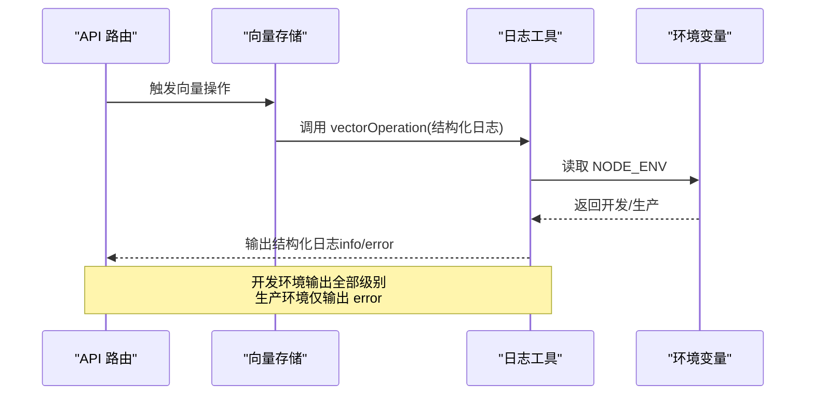
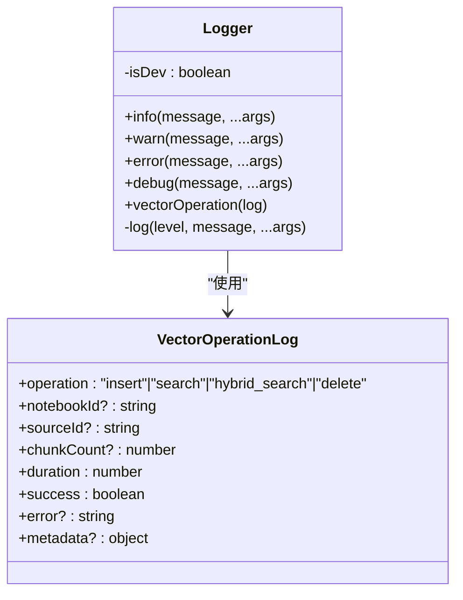
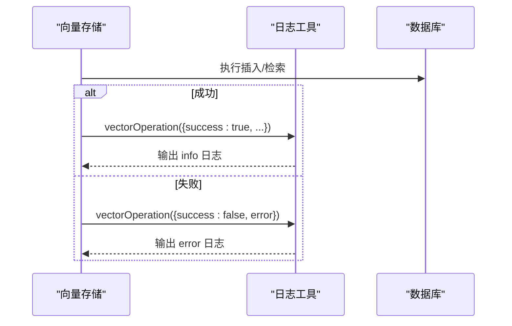
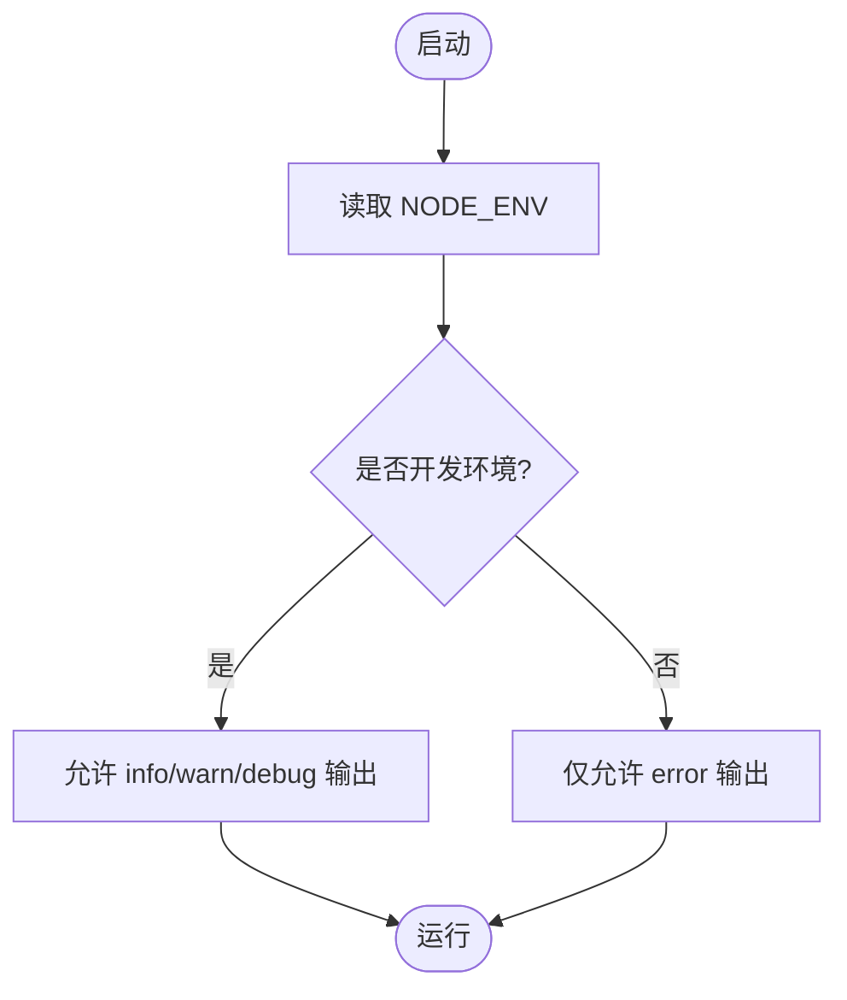
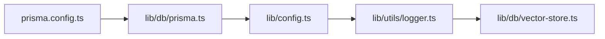

# 日志记录系统

<cite>
**本文引用的文件**
- [logger.ts](file://lib/utils/logger.ts)
- [vector-store.ts](file://lib/db/vector-store.ts)
- [config.ts](file://lib/config.ts)
- [prisma.ts](file://lib/db/prisma.ts)
- [prisma.config.ts](file://prisma.config.ts)
- [00000000000000_init_vector/migration.sql](file://prisma/migrations/00000000000000_init_vector/migration.sql)
- [20260120120300_add_composite_indexes/migration.sql](file://prisma/migrations/20260120120300_add_composite_indexes/migration.sql)
- [route.ts](file://app/api/sources/[id]/route.ts)
- [route.ts](file://app/api/chat/route.ts)
</cite>

## 目录
1. [简介](#简介)
2. [项目结构](#项目结构)
3. [核心组件](#核心组件)
4. [架构概览](#架构概览)
5. [详细组件分析](#详细组件分析)
6. [依赖关系分析](#依赖关系分析)
7. [性能考量](#性能考量)
8. [故障排查指南](#故障排查指南)
9. [结论](#结论)
10. [附录](#附录)

## 简介
本文件系统性梳理 notebookLM-clone 项目的日志记录体系，重点覆盖以下方面：
- 统一日志接口设计与实现
- 日志级别管理与环境区分策略
- 结构化日志格式与规范（字段定义、时间戳、上下文）
- 向量操作专用日志（操作类型、性能指标、错误信息）
- 敏感信息过滤与隐私保护
- 日志存储与检索最佳实践（轮转、压缩、查询优化）
- 日志分析与监控应用（错误追踪、性能分析、安全审计）

## 项目结构
日志系统主要由以下模块构成：
- 统一日志工具：提供统一的日志接口与环境控制
- 向量存储层：在关键路径上记录向量操作日志
- 配置与环境：环境变量与运行模式控制日志输出
- 数据库适配：Prisma 客户端在不同环境下的日志策略
- API 层：部分错误通过 console 输出，便于快速定位

图表来源
- [logger.ts](file://lib/utils/logger.ts#L1-L98)
- [vector-store.ts](file://lib/db/vector-store.ts#L1-L446)
- [config.ts](file://lib/config.ts#L1-L187)
- [prisma.ts](file://lib/db/prisma.ts#L1-L41)
- [prisma.config.ts](file://prisma.config.ts#L1-L19)

章节来源
- [logger.ts](file://lib/utils/logger.ts#L1-L98)
- [vector-store.ts](file://lib/db/vector-store.ts#L1-L446)
- [config.ts](file://lib/config.ts#L1-L187)
- [prisma.ts](file://lib/db/prisma.ts#L1-L41)
- [prisma.config.ts](file://prisma.config.ts#L1-L19)

## 核心组件
- 统一日志工具：提供 info/warn/error/debug 方法；根据 NODE_ENV 控制输出；向量操作专用日志接口 vectorOperation，统一结构化输出
- 向量存储：在插入、检索、混合检索等关键路径记录结构化日志，包含操作类型、耗时、结果状态、元数据与错误信息
- 配置与环境：验证必需环境变量，强制向量维度一致性，控制日志输出级别
- 数据库适配：Prisma 在开发/生产环境分别启用不同级别的日志输出

章节来源
- [logger.ts](file://lib/utils/logger.ts#L6-L98)
- [vector-store.ts](file://lib/db/vector-store.ts#L77-L446)
- [config.ts](file://lib/config.ts#L6-L187)
- [prisma.ts](file://lib/db/prisma.ts#L23-L34)

## 架构概览
日志系统遵循“统一入口 + 结构化输出 + 环境控制”的设计原则。所有业务日志通过统一工具输出，向量操作采用专用结构化模板，确保可读性与可分析性。

图表来源
- [logger.ts](file://lib/utils/logger.ts#L29-L54)
- [vector-store.ts](file://lib/db/vector-store.ts#L142-L172)

## 详细组件分析

### 统一日志工具
- 设计要点
  - 日志级别：info、warn、error、debug
  - 环境控制：仅在开发环境输出 info/warn/debug；生产环境仅输出 error
  - 时间戳：ISO 8601 格式
  - 输出格式：统一前缀 [时间戳] [级别]
- 向量操作专用日志
  - 结构：operation、notebookId、sourceId、chunkCount、duration、success、metadata、error
  - 自动级别：成功为 info，失败为 error
  - 元数据扩展：支持插入数量、跳过数量、topK、阈值、平均相似度等

图表来源
- [logger.ts](file://lib/utils/logger.ts#L6-L98)

章节来源
- [logger.ts](file://lib/utils/logger.ts#L6-L98)

### 向量存储层日志
- 插入流程日志
  - 成功：记录插入数量、跳过数量、耗时、操作类型
  - 失败：记录错误信息、耗时、操作类型
- 检索流程日志
  - 成功：记录命中数量、平均相似度、topK、阈值、耗时
  - 失败：记录错误信息、耗时、操作类型
- 混合检索流程日志
  - 在检索基础上增加向量分数、全文分数、综合分数等元数据

图表来源
- [vector-store.ts](file://lib/db/vector-store.ts#L142-L172)
- [vector-store.ts](file://lib/db/vector-store.ts#L267-L296)

章节来源
- [vector-store.ts](file://lib/db/vector-store.ts#L77-L446)

### 配置与环境控制
- 环境变量
  - NODE_ENV：决定日志输出策略
  - EMBEDDING_DIM：强制 1024 维，与数据库向量维度保持一致
  - 其他必需变量：Supabase、数据库、AI 提供商密钥等
- Prisma 日志
  - 开发环境：输出 error/warn
  - 生产环境：仅输出 error

图表来源
- [logger.ts](file://lib/utils/logger.ts#L29-L54)
- [prisma.ts](file://lib/db/prisma.ts#L33-L34)

章节来源
- [config.ts](file://lib/config.ts#L6-L187)
- [prisma.ts](file://lib/db/prisma.ts#L1-L41)

### API 层错误输出
- 部分 API 路由在异常时使用 console.error 输出错误摘要，便于快速定位问题
- 建议统一迁移到日志工具，以获得一致的时间戳与结构化输出

章节来源
- [route.ts](file://app/api/sources/[id]/route.ts#L58-L61)
- [route.ts](file://app/api/sources/[id]/route.ts#L115-L118)
- [route.ts](file://app/api/chat/route.ts#L316-L322)

## 依赖关系分析
- 日志工具被向量存储模块直接依赖，形成关键路径日志输出
- 配置模块为日志工具提供环境变量输入
- 数据库适配层在不同环境下的日志策略影响整体可观测性

图表来源
- [logger.ts](file://lib/utils/logger.ts#L1-L98)
- [vector-store.ts](file://lib/db/vector-store.ts#L1-L446)
- [config.ts](file://lib/config.ts#L1-L187)
- [prisma.ts](file://lib/db/prisma.ts#L1-L41)
- [prisma.config.ts](file://prisma.config.ts#L1-L19)

章节来源
- [logger.ts](file://lib/utils/logger.ts#L1-L98)
- [vector-store.ts](file://lib/db/vector-store.ts#L1-L446)
- [config.ts](file://lib/config.ts#L1-L187)
- [prisma.ts](file://lib/db/prisma.ts#L1-L41)
- [prisma.config.ts](file://prisma.config.ts#L1-L19)

## 性能考量
- 日志级别与环境控制
  - 生产环境仅输出 error，降低 I/O 压力
  - 开发环境输出 info/warn/debug，便于调试
- 向量操作日志
  - 记录 duration（毫秒），便于性能分析
  - 检索成功时计算平均相似度，辅助评估召回质量
- 数据库日志
  - Prisma 在开发环境输出 error/warn，有助于发现慢查询与异常

章节来源
- [logger.ts](file://lib/utils/logger.ts#L29-L54)
- [vector-store.ts](file://lib/db/vector-store.ts#L263-L279)
- [prisma.ts](file://lib/db/prisma.ts#L33-L34)

## 故障排查指南
- 环境变量缺失
  - 现象：启动时报错提示缺少必需变量
  - 排查：核对 .env.local 是否存在并包含所需键值
- 向量维度不匹配
  - 现象：插入/检索报错，提示维度不一致
  - 排查：确认 EMBEDDING_DIM 设置为 1024，且与数据库向量维度一致
- 生产环境无日志
  - 现象：生产环境看不到 info/warn/debug
  - 排查：确认 NODE_ENV 为 production，日志工具仅输出 error
- API 层错误
  - 现象：API 抛错但未见结构化日志
  - 排查：将 console.error 迁移到 logger.error，统一输出格式

章节来源
- [config.ts](file://lib/config.ts#L168-L186)
- [00000000000000_init_vector/migration.sql](file://prisma/migrations/00000000000000_init_vector/migration.sql#L13-L13)
- [logger.ts](file://lib/utils/logger.ts#L29-L54)
- [route.ts](file://app/api/sources/[id]/route.ts#L58-L61)
- [route.ts](file://app/api/chat/route.ts#L316-L322)

## 结论
本项目日志系统以统一工具为核心，结合环境控制与结构化输出，实现了对向量操作的可观测性与可追溯性。建议在后续迭代中：
- 将 API 层错误输出统一到日志工具
- 引入更完善的日志轮转与归档策略
- 增强敏感信息过滤与脱敏机制
- 建立基于日志的监控告警与分析看板

## 附录

### 结构化日志字段定义
- 通用字段
  - 时间戳：ISO 8601 格式
  - 级别：info/warn/error/debug
  - 消息：简要描述
  - 上下文：对象形式附加
- 向量操作日志
  - operation：insert/search/hybrid_search/delete
  - notebookId/sourceId：关联实体标识
  - chunkCount：处理的块数量
  - duration：耗时（毫秒）
  - success：布尔值
  - metadata：插入/跳过数量、topK、阈值、平均相似度等
  - error：错误信息（可选）

章节来源
- [logger.ts](file://lib/utils/logger.ts#L11-L27)
- [logger.ts](file://lib/utils/logger.ts#L75-L94)

### 日志级别管理策略
- 开发环境：输出 info/warn/debug/error
- 生产环境：仅输出 error
- Prisma：开发环境输出 error/warn，生产环境仅 error

章节来源
- [logger.ts](file://lib/utils/logger.ts#L29-L54)
- [prisma.ts](file://lib/db/prisma.ts#L33-L34)

### 敏感信息过滤与隐私保护
- 当前实现
  - 未见显式的敏感信息过滤逻辑
- 建议
  - 在日志输出前对用户输入、令牌、路径等进行脱敏
  - 对结构化日志中的敏感字段进行屏蔽或哈希处理

章节来源
- [logger.ts](file://lib/utils/logger.ts#L32-L54)

### 日志存储与检索最佳实践
- 存储
  - 使用容器或平台提供的日志收集器（如云厂商日志服务）
  - 对日志进行分级存储：短期高频日志驻留内存/SSD，长期低频日志归档至对象存储
- 轮转与压缩
  - 按大小与时间轮转，保留最近 N 天日志
  - 压缩旧日志，减少存储成本
- 查询优化
  - 为常用查询字段建立索引（如时间、级别、操作类型）
  - 使用结构化字段进行过滤与聚合

章节来源
- [20260120120300_add_composite_indexes/migration.sql](file://prisma/migrations/20260120120300_add_composite_indexes/migration.sql#L1-L19)

### 日志分析与监控应用
- 错误追踪
  - 通过 error 级别日志快速定位异常
  - 结合错误 ID 与堆栈信息进行回溯
- 性能分析
  - 利用 duration 字段分析向量操作耗时趋势
  - 结合平均相似度评估检索质量
- 安全审计
  - 记录关键操作（如删除 Source）的上下文信息
  - 对异常访问尝试进行告警

章节来源
- [vector-store.ts](file://lib/db/vector-store.ts#L142-L172)
- [vector-store.ts](file://lib/db/vector-store.ts#L267-L296)
- [route.ts](file://app/api/sources/[id]/route.ts#L99-L114)