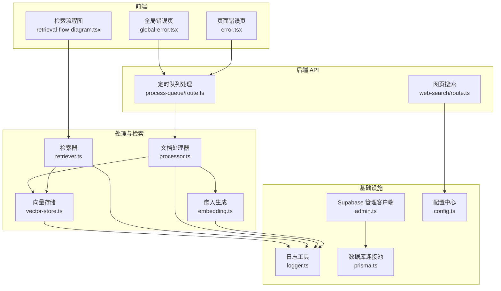
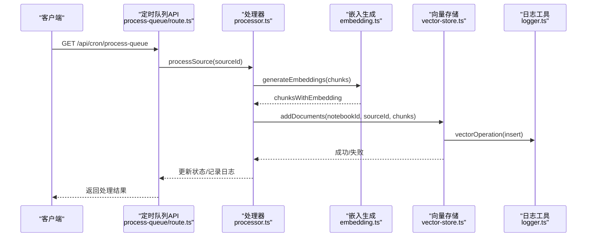
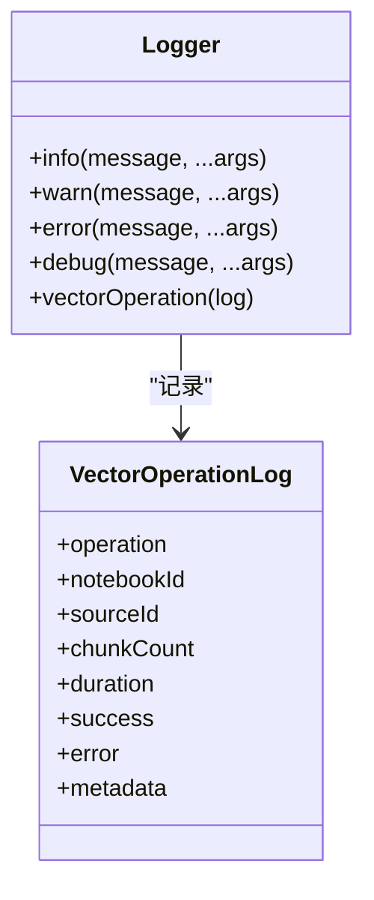
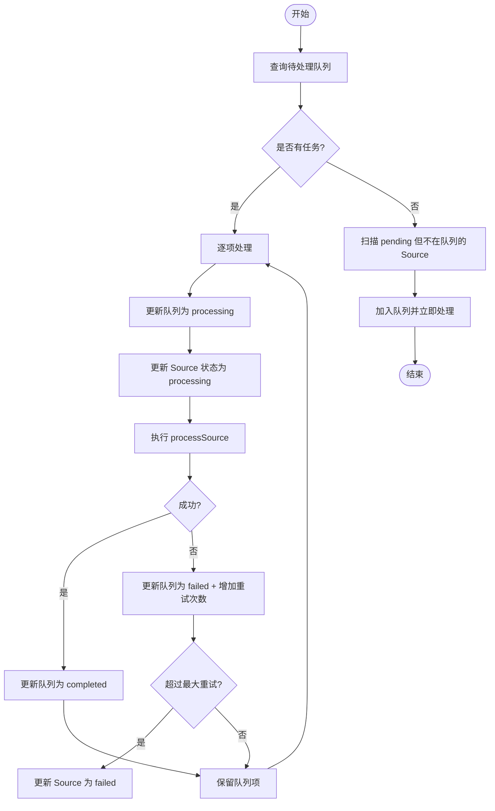
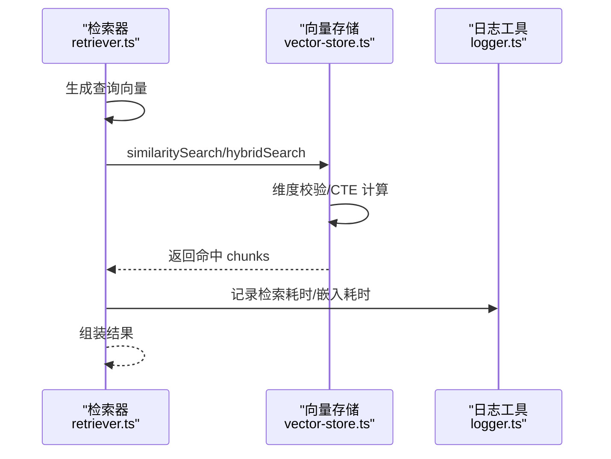
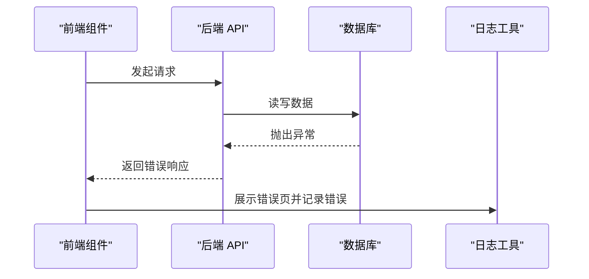
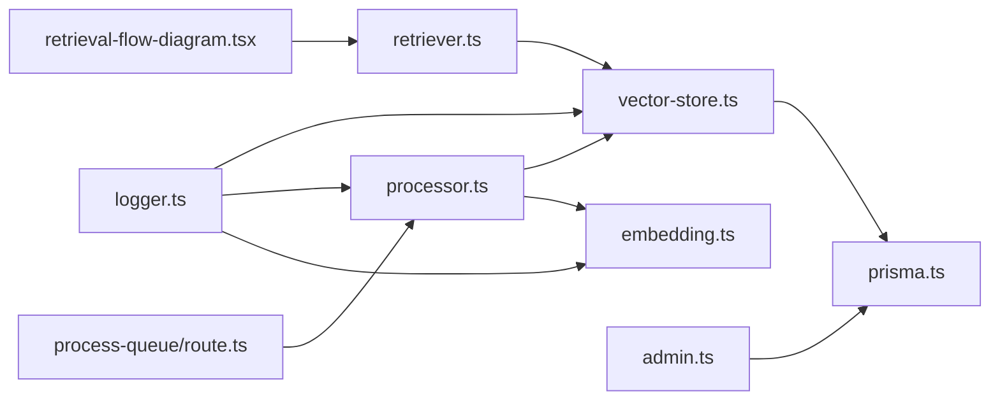

# 监控系统实现

<cite>
**本文引用的文件**
- [logger.ts](file://lib/utils/logger.ts)
- [config.ts](file://lib/config.ts)
- [vector-store.ts](file://lib/db/vector-store.ts)
- [embedding.ts](file://lib/processing/embedding.ts)
- [processor.ts](file://lib/processing/processor.ts)
- [retriever.ts](file://lib/rag/retriever.ts)
- [prisma.ts](file://lib/db/prisma.ts)
- [admin.ts](file://lib/supabase/admin.ts)
- [route.ts](file://app/api/cron/process-queue/route.ts)
- [global-error.tsx](file://app/global-error.tsx)
- [error.tsx](file://app/error.tsx)
- [retrieval-flow-diagram.tsx](file://components/notebook/retrieval-flow-diagram.tsx)
- [prisma.config.ts](file://prisma.config.ts)
</cite>

## 目录
1. [简介](#简介)
2. [项目结构](#项目结构)
3. [核心组件](#核心组件)
4. [架构总览](#架构总览)
5. [详细组件分析](#详细组件分析)
6. [依赖关系分析](#依赖关系分析)
7. [性能考量](#性能考量)
8. [故障排查指南](#故障排查指南)
9. [结论](#结论)
10. [附录](#附录)

## 简介
本文件面向 notebookLM-clone 项目的监控系统实现，围绕应用性能监控、错误追踪、用户行为分析、业务指标监控、日志聚合与分析、告警配置与管理以及监控仪表板设计进行系统化梳理。文档以代码为依据，结合架构图与流程图，帮助开发者与运维人员快速理解监控体系现状与优化方向。

## 项目结构
项目采用 Next.js 14 App Router 结构，监控相关能力主要分布在以下模块：
- 工具与基础设施：日志工具、数据库连接池、Supabase 管理客户端
- 数据处理链路：文档处理流水线、向量生成与写入、检索链路
- 业务 API：定时任务队列处理、外部模型调用
- 前端展示：全局错误页、页面错误页、检索流程可视化

图表来源
- [global-error.tsx](file://app/global-error.tsx#L1-L132)
- [error.tsx](file://app/error.tsx#L1-L68)
- [retrieval-flow-diagram.tsx](file://components/notebook/retrieval-flow-diagram.tsx#L1-L81)
- [route.ts](file://app/api/cron/process-queue/route.ts#L1-L165)
- [processor.ts](file://lib/processing/processor.ts#L1-L560)
- [embedding.ts](file://lib/processing/embedding.ts#L1-L189)
- [vector-store.ts](file://lib/db/vector-store.ts#L1-L446)
- [retriever.ts](file://lib/rag/retriever.ts#L1-L206)
- [logger.ts](file://lib/utils/logger.ts#L1-L98)
- [prisma.ts](file://lib/db/prisma.ts#L1-L41)
- [admin.ts](file://lib/supabase/admin.ts#L1-L19)
- [config.ts](file://lib/config.ts#L1-L187)

章节来源
- [prisma.config.ts](file://prisma.config.ts#L1-L20)

## 核心组件
- 日志工具：统一输出格式，区分级别；提供向量操作专项日志结构与记录
- 数据库连接池：基于 Prisma Pg Pool，适配 Serverless 环境
- 文档处理流水线：PDF/URL/文本三类 Source 的完整处理链路，包含阶段计时与统计
- 向量存储：批量插入、相似度检索、混合检索，内置维度校验与日志记录
- 嵌入生成：指数退避重试、批量处理、维度校验
- 检索器：向量检索与混合检索，返回检索耗时与嵌入耗时
- 错误页：全局与页面级错误展示，便于定位问题
- 定时队列：处理队列状态机、失败重试与自我修复

章节来源
- [logger.ts](file://lib/utils/logger.ts#L1-L98)
- [prisma.ts](file://lib/db/prisma.ts#L1-L41)
- [processor.ts](file://lib/processing/processor.ts#L1-L560)
- [vector-store.ts](file://lib/db/vector-store.ts#L1-L446)
- [embedding.ts](file://lib/processing/embedding.ts#L1-L189)
- [retriever.ts](file://lib/rag/retriever.ts#L1-L206)
- [global-error.tsx](file://app/global-error.tsx#L1-L132)
- [error.tsx](file://app/error.tsx#L1-L68)
- [route.ts](file://app/api/cron/process-queue/route.ts#L1-L165)

## 架构总览
监控系统围绕“可观测性三支柱”构建：
- 日志：结构化日志与向量操作专项日志
- 指标：处理阶段耗时、检索耗时、嵌入耗时、批处理规模、重试次数
- 告警：基于阈值的错误与性能告警（建议）

图表来源
- [route.ts](file://app/api/cron/process-queue/route.ts#L1-L165)
- [processor.ts](file://lib/processing/processor.ts#L1-L560)
- [embedding.ts](file://lib/processing/embedding.ts#L1-L189)
- [vector-store.ts](file://lib/db/vector-store.ts#L1-L446)
- [logger.ts](file://lib/utils/logger.ts#L1-L98)

## 详细组件分析

### 日志系统与结构化日志
- 统一日志输出：按级别输出，开发环境全量，生产环境仅错误级别
- 向量操作专项日志：包含操作类型、笔记本/来源标识、批大小、耗时、成功与否、元数据与错误信息
- 记录位置：向量插入、相似度检索、混合检索、嵌入生成、文档处理各阶段均记录

图表来源
- [logger.ts](file://lib/utils/logger.ts#L1-L98)

章节来源
- [logger.ts](file://lib/utils/logger.ts#L1-L98)
- [vector-store.ts](file://lib/db/vector-store.ts#L142-L172)
- [vector-store.ts](file://lib/db/vector-store.ts#L263-L296)
- [vector-store.ts](file://lib/db/vector-store.ts#L312-L442)
- [embedding.ts](file://lib/processing/embedding.ts#L114-L134)
- [processor.ts](file://lib/processing/processor.ts#L103-L208)
- [processor.ts](file://lib/processing/processor.ts#L296-L396)
- [processor.ts](file://lib/processing/processor.ts#L459-L525)

### 处理队列与状态监控
- 队列状态：pending → processing → completed/failed
- 失败重试：最多 3 次，失败后更新 Source 状态
- 自我修复：扫描未入队的 pending Source 并加入队列处理
- 认证：Bearer Token 校验，支持手动触发参数

图表来源
- [route.ts](file://app/api/cron/process-queue/route.ts#L1-L165)

章节来源
- [route.ts](file://app/api/cron/process-queue/route.ts#L1-L165)

### 向量操作监控与性能指标
- 关键指标
  - 插入耗时：向量存储批量插入耗时
  - 检索耗时：相似度检索与混合检索耗时
  - 嵌入耗时：查询向量化耗时
  - 批处理规模：每批插入数量、返回 chunk 数
  - 成功率：插入/检索成功与否
  - 重试次数：嵌入生成重试次数
- 维度校验：严格校验嵌入维度与配置一致，防止数据不一致
- 混合检索：向量分数与全文检索分数组合，支持权重配置

图表来源
- [retriever.ts](file://lib/rag/retriever.ts#L53-L116)
- [retriever.ts](file://lib/rag/retriever.ts#L131-L206)
- [vector-store.ts](file://lib/db/vector-store.ts#L175-L297)
- [vector-store.ts](file://lib/db/vector-store.ts#L312-L442)
- [logger.ts](file://lib/utils/logger.ts#L75-L94)

章节来源
- [vector-store.ts](file://lib/db/vector-store.ts#L1-L446)
- [retriever.ts](file://lib/rag/retriever.ts#L1-L206)
- [logger.ts](file://lib/utils/logger.ts#L1-L98)

### 错误追踪与错误页
- 全局错误页与页面错误页：开发环境输出错误详情，生产环境提示重试与返回首页
- 错误页包含错误 ID（digest），便于定位与回溯
- 处理链路中的错误会被捕获并记录，同时更新 Source 状态与处理日志

图表来源
- [global-error.tsx](file://app/global-error.tsx#L1-L132)
- [error.tsx](file://app/error.tsx#L1-L68)
- [processor.ts](file://lib/processing/processor.ts#L198-L208)
- [route.ts](file://app/api/cron/process-queue/route.ts#L83-L106)

章节来源
- [global-error.tsx](file://app/global-error.tsx#L1-L132)
- [error.tsx](file://app/error.tsx#L1-L68)
- [processor.ts](file://lib/processing/processor.ts#L1-L560)
- [route.ts](file://app/api/cron/process-queue/route.ts#L1-L165)

### 用户行为分析与可视化
- 检索流程可视化：展示“问题→向量化→混合检索→召回片段→生成回答”的时序与耗时
- 可视化组件接收 embedding、retrieval、generation、total 等时间戳，渲染流程图
- 用于用户体验评估与性能反馈

图表来源
- [retrieval-flow-diagram.tsx](file://components/notebook/retrieval-flow-diagram.tsx#L1-L81)

章节来源
- [retrieval-flow-diagram.tsx](file://components/notebook/retrieval-flow-diagram.tsx#L1-L81)

### 业务指标监控设计
- 处理队列状态监控：pending/processing/completed/failed 计数与重试次数
- 向量操作监控：插入/检索/混合检索的成功率、耗时分布、批大小
- 系统健康检查：数据库连接池状态、嵌入维度一致性、API 可用性
- 用户路径追踪：Source 状态流转（pending→downloading→parsing→chunking→embedding→ready/failed）
- 功能使用统计：不同 Source 类型（file/url/text）的处理数量与耗时
- 用户体验评估：检索耗时、命中率、平均相似度、生成耗时

章节来源
- [route.ts](file://app/api/cron/process-queue/route.ts#L1-L165)
- [processor.ts](file://lib/processing/processor.ts#L1-L560)
- [vector-store.ts](file://lib/db/vector-store.ts#L1-L446)
- [retriever.ts](file://lib/rag/retriever.ts#L1-L206)

### 日志聚合与分析
- 结构化日志格式：统一时间戳、级别、消息体、上下文字段
- 日志级别管理：开发环境全量输出，生产环境仅错误级别
- 敏感信息过滤：通过统一日志工具输出，避免在日志中暴露密钥与敏感字段
- 向量操作专项日志：包含 operation、notebookId、sourceId、duration、success、metadata、error 等字段

章节来源
- [logger.ts](file://lib/utils/logger.ts#L1-L98)

### 监控告警配置与管理
- 建议阈值
  - 插入耗时：P95 超过 X 毫秒触发告警
  - 检索耗时：P95 超过 Y 毫秒触发告警
  - 嵌入耗时：P95 超过 Z 毫秒触发告警
  - 失败率：插入/检索/嵌入失败率超过阈值触发告警
  - 重试次数：单次任务重试次数超过上限触发告警
- 通知机制：集成企业微信/钉钉/Webhook，按级别发送通知
- 故障处理流程：自动降级、限流、熔断与人工干预入口

章节来源
- [vector-store.ts](file://lib/db/vector-store.ts#L142-L172)
- [vector-store.ts](file://lib/db/vector-store.ts#L263-L296)
- [embedding.ts](file://lib/processing/embedding.ts#L114-L134)
- [retriever.ts](file://lib/rag/retriever.ts#L53-L116)

### 监控仪表板设计
- 实时监控：队列状态、处理吞吐、错误率、重试率
- 历史数据分析：各阶段耗时趋势、成功率趋势、资源使用趋势
- 可视化组件：检索流程图、阶段耗时柱状图、错误分布饼图
- 交互设计：筛选 Source 类型、时间范围、模型版本

章节来源
- [retrieval-flow-diagram.tsx](file://components/notebook/retrieval-flow-diagram.tsx#L1-L81)
- [processor.ts](file://lib/processing/processor.ts#L1-L560)

## 依赖关系分析

图表来源
- [logger.ts](file://lib/utils/logger.ts#L1-L98)
- [vector-store.ts](file://lib/db/vector-store.ts#L1-L446)
- [processor.ts](file://lib/processing/processor.ts#L1-L560)
- [embedding.ts](file://lib/processing/embedding.ts#L1-L189)
- [retriever.ts](file://lib/rag/retriever.ts#L1-L206)
- [prisma.ts](file://lib/db/prisma.ts#L1-L41)
- [admin.ts](file://lib/supabase/admin.ts#L1-L19)
- [route.ts](file://app/api/cron/process-queue/route.ts#L1-L165)
- [retrieval-flow-diagram.tsx](file://components/notebook/retrieval-flow-diagram.tsx#L1-L81)

章节来源
- [prisma.ts](file://lib/db/prisma.ts#L1-L41)
- [admin.ts](file://lib/supabase/admin.ts#L1-L19)
- [config.ts](file://lib/config.ts#L1-L187)

## 性能考量
- 批量处理：向量插入按批进行，减少事务开销
- 维度校验：前置校验嵌入维度，避免运行期失败
- CTE 优化：检索使用 CTE 消除重复计算，提升查询性能
- 连接池：Serverless 环境下使用 Pg Pool，限制并发连接数
- 重试策略：嵌入生成与外部 API 调用采用指数退避重试

章节来源
- [vector-store.ts](file://lib/db/vector-store.ts#L1-L446)
- [embedding.ts](file://lib/processing/embedding.ts#L1-L189)
- [prisma.ts](file://lib/db/prisma.ts#L1-L41)

## 故障排查指南
- 常见问题
  - 嵌入维度不一致：检查 EMBEDDING_DIM 配置与模型一致
  - 处理失败：查看 Source processingLog 与 processingQueue 错误信息
  - 检索无结果：调整 topK 与阈值，确认混合检索权重
  - 队列卡住：检查 pending 且未入队的 Source，触发自我修复
- 排查步骤
  - 查看日志：定位具体阶段与错误原因
  - 核对配置：确认环境变量与数据库连接
  - 回放处理：根据 SourceId 重试处理流程
  - 监控告警：关注失败率与耗时异常

章节来源
- [config.ts](file://lib/config.ts#L1-L187)
- [processor.ts](file://lib/processing/processor.ts#L1-L560)
- [route.ts](file://app/api/cron/process-queue/route.ts#L1-L165)
- [retriever.ts](file://lib/rag/retriever.ts#L1-L206)

## 结论
本项目已具备完善的日志记录、阶段计时与状态管理能力，能够支撑应用性能监控、错误追踪与业务指标监控的基础需求。建议在此基础上补充实时告警、可视化仪表板与自动化运维脚本，进一步提升可观测性与运维效率。

## 附录
- 配置与环境变量：确保 DATABASE_URL、EMBEDDING_DIM、API Key 等配置正确
- 数据库迁移：通过 Prisma CLI 读取 prisma.config.ts 进行迁移与同步
- 安全与合规：生产环境仅输出必要日志，避免泄露敏感信息

章节来源
- [config.ts](file://lib/config.ts#L1-L187)
- [prisma.config.ts](file://prisma.config.ts#L1-L20)