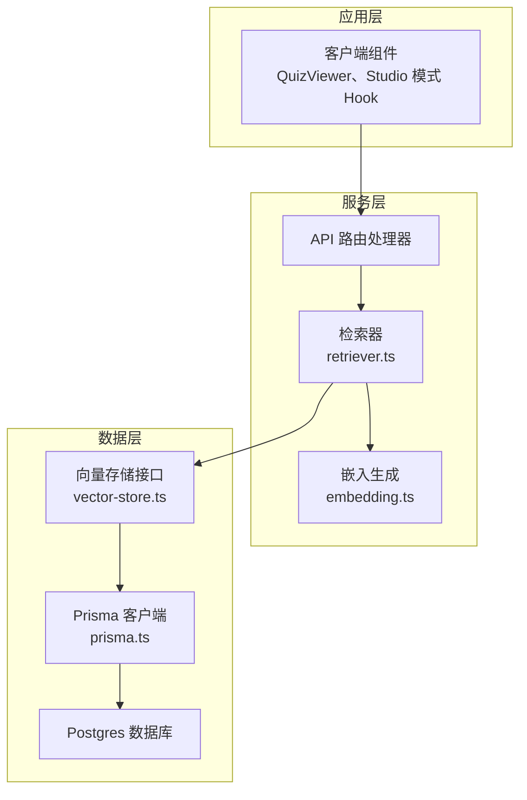
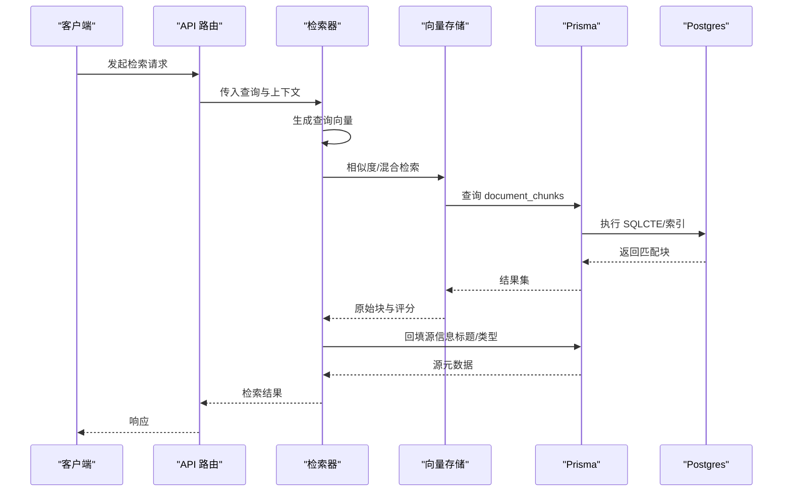
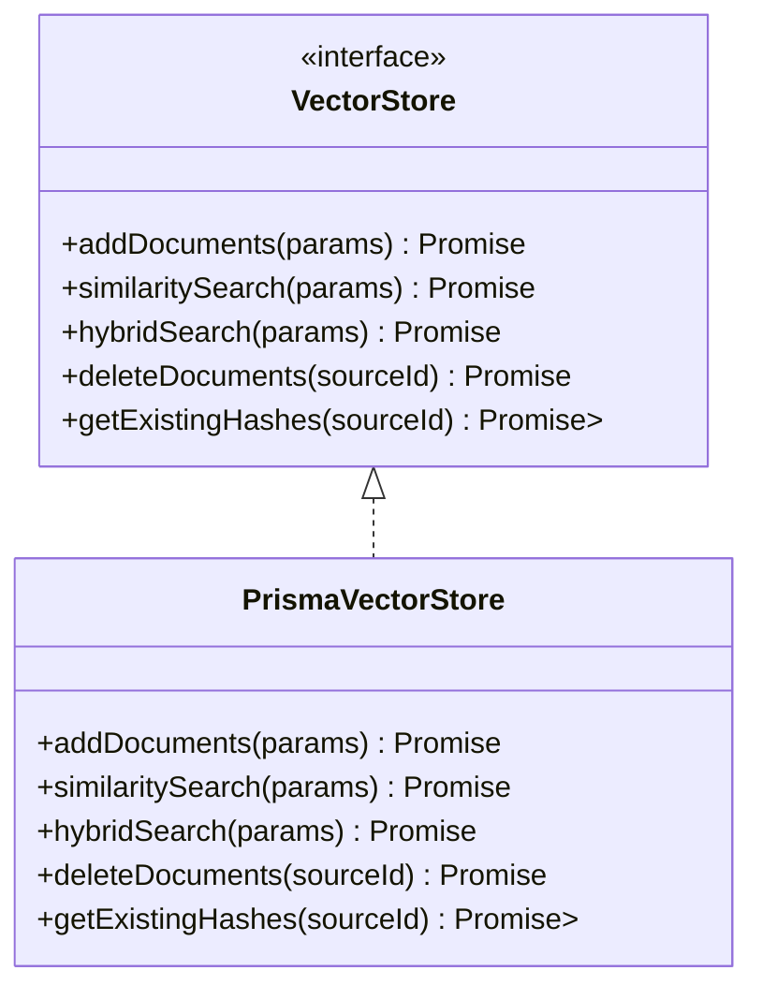
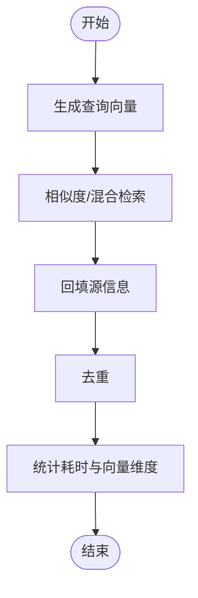
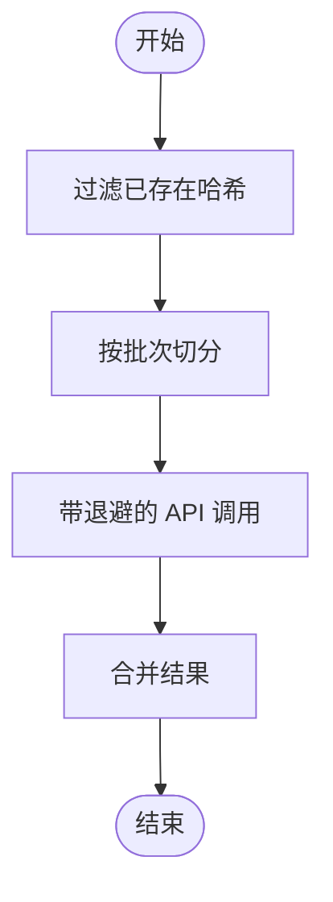
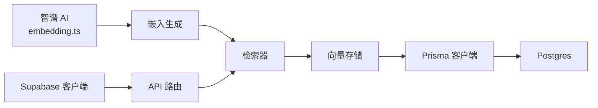

# 缓存机制设计

<cite>
**本文引用的文件**
- [lib/db/vector-store.ts](file://lib/db/vector-store.ts)
- [lib/rag/retriever.ts](file://lib/rag/retriever.ts)
- [lib/db/prisma.ts](file://lib/db/prisma.ts)
- [lib/config.ts](file://lib/config.ts)
- [lib/processing/embedding.ts](file://lib/processing/embedding.ts)
- [lib/utils/logger.ts](file://lib/utils/logger.ts)
- [lib/supabase/client.ts](file://lib/supabase/client.ts)
- [lib/supabase/server.ts](file://lib/supabase/server.ts)
- [lib/supabase/admin.ts](file://lib/supabase/admin.ts)
- [app/api/sources/[id]/refetch/route.ts](file://app/api/sources/[id]/refetch/route.ts)
- [hooks/use-studio-mode.ts](file://hooks/use-studio-mode.ts)
- [components/notebook/quiz-viewer.tsx](file://components/notebook/quiz-viewer.tsx)
- [lib/ai/zhipu.ts](file://lib/ai/zhipu.ts)
</cite>

## 目录
1. [简介](#简介)
2. [项目结构](#项目结构)
3. [核心组件](#核心组件)
4. [架构总览](#架构总览)
5. [详细组件分析](#详细组件分析)
6. [依赖关系分析](#依赖关系分析)
7. [性能考量](#性能考量)
8. [故障排查指南](#故障排查指南)
9. [结论](#结论)
10. [附录](#附录)

## 简介
本文件面向 notebookLM-clone 项目的缓存机制设计，系统性梳理多级缓存架构（应用层缓存、数据库查询缓存、向量检索缓存）与缓存策略（键设计、失效与更新、一致性保障），并结合项目现有实现给出可落地的优化建议与监控调优方案。

## 项目结构
项目采用 Next.js App Router 架构，缓存相关能力主要分布在以下层次：
- 应用层缓存：浏览器端本地存储（localStorage）、客户端组件状态缓存
- 数据库查询缓存：Prisma 客户端与 Postgres 连接池
- 向量检索缓存：向量存储层（PostgreSQL + HNSW 索引）与检索逻辑

图表来源
- [lib/rag/retriever.ts](file://lib/rag/retriever.ts#L53-L116)
- [lib/processing/embedding.ts](file://lib/processing/embedding.ts#L140-L189)
- [lib/db/vector-store.ts](file://lib/db/vector-store.ts#L77-L443)
- [lib/db/prisma.ts](file://lib/db/prisma.ts#L23-L34)

章节来源
- [lib/db/vector-store.ts](file://lib/db/vector-store.ts#L1-L446)
- [lib/rag/retriever.ts](file://lib/rag/retriever.ts#L1-L206)
- [lib/db/prisma.ts](file://lib/db/prisma.ts#L1-L41)

## 核心组件
- 向量存储与检索
  - 向量存储接口定义与 Prisma 实现，支持相似度检索与混合检索，并内置日志与维度校验
- 检索器
  - 负责将查询转为向量，调用向量存储并回填源信息，提供去重与评分聚合
- 嵌入生成
  - 批量生成向量，带指数退避重试与去重跳过
- 数据库与连接池
  - Prisma 客户端通过连接池访问 Postgres，适配 Serverless 环境
- 日志与监控
  - 统一向量操作日志，便于性能与错误追踪
- 应用层缓存
  - 客户端组件使用 localStorage 缓存用户状态；Studio 模式持久化；Quiz 进度持久化

章节来源
- [lib/db/vector-store.ts](file://lib/db/vector-store.ts#L24-L75)
- [lib/rag/retriever.ts](file://lib/rag/retriever.ts#L53-L116)
- [lib/processing/embedding.ts](file://lib/processing/embedding.ts#L140-L189)
- [lib/db/prisma.ts](file://lib/db/prisma.ts#L23-L34)
- [lib/utils/logger.ts](file://lib/utils/logger.ts#L75-L94)
- [hooks/use-studio-mode.ts](file://hooks/use-studio-mode.ts#L14-L31)
- [components/notebook/quiz-viewer.tsx](file://components/notebook/quiz-viewer.tsx#L20-L60)

## 架构总览
多级缓存架构设计要点：
- 应用层缓存
  - 客户端组件状态与用户偏好（如 Studio 模式）持久化至 localStorage，减少重复请求与状态丢失
  - Quiz 进度本地持久化，提升用户体验与离线可用性
- 数据库查询缓存
  - 通过 Prisma 客户端与 Postgres 连接池降低连接开销，配合索引与查询优化提升读取性能
- 向量检索缓存
  - 向量存储层基于 PostgreSQL 的 HNSW 索引与复合索引，支持相似度与混合检索
  - 检索器层负责查询向量化、阈值过滤与评分聚合，避免重复计算

图表来源
- [lib/rag/retriever.ts](file://lib/rag/retriever.ts#L53-L116)
- [lib/db/vector-store.ts](file://lib/db/vector-store.ts#L175-L297)
- [lib/db/prisma.ts](file://lib/db/prisma.ts#L29-L34)

## 详细组件分析

### 向量存储与检索（PrismaVectorStore）
- 设计要点
  - 批量插入：按固定批次大小分批写入，避免单次事务过大
  - 维度校验：严格校验嵌入维度与配置一致，防止数据不一致
  - 查询优化：使用 CTE 消除重复计算，支持按 sourceIds 过滤与阈值筛选
  - 混合检索：向量相似度与全文检索（TSV + simple 分词器）加权融合
  - 日志埋点：统一记录插入/查询耗时、成功与否与关键指标
- 关键接口
  - addDocuments：批量写入，返回插入数量
  - similaritySearch：相似度检索
  - hybridSearch：向量+全文混合检索
  - deleteDocuments/getExistingHashes：维护与去重

图表来源
- [lib/db/vector-store.ts](file://lib/db/vector-store.ts#L24-L75)
- [lib/db/vector-store.ts](file://lib/db/vector-store.ts#L77-L443)

章节来源
- [lib/db/vector-store.ts](file://lib/db/vector-store.ts#L77-L443)
- [lib/utils/logger.ts](file://lib/utils/logger.ts#L75-L94)
- [lib/config.ts](file://lib/config.ts#L6-L29)

### 检索器（retriever）
- 设计要点
  - 查询向量化：调用嵌入生成模块获取向量
  - 检索流程：先相似度检索，再回填源信息（标题/类型）
  - 混合检索：向量相似度与全文检索加权，提升召回质量
  - 性能统计：分别统计嵌入耗时与检索耗时，便于定位瓶颈
- 关键流程
  - retrieveChunks：向量检索主流程
  - hybridRetrieveChunks：混合检索主流程
  - deduplicateChunks：按 id 去重

图表来源
- [lib/rag/retriever.ts](file://lib/rag/retriever.ts#L53-L116)
- [lib/rag/retriever.ts](file://lib/rag/retriever.ts#L131-L206)

章节来源
- [lib/rag/retriever.ts](file://lib/rag/retriever.ts#L53-L206)

### 嵌入生成（embedding）
- 设计要点
  - 批量处理：控制每批最大条数与 token 上限，避免 API 限流
  - 指数退避：对 429/5xx 等可重试错误进行延迟重试
  - 去重跳过：利用已有哈希集合跳过已存在块，减少重复计算
- 关键流程
  - generateEmbeddings：批量生成并返回向量、token 使用量与跳过数量

图表来源
- [lib/processing/embedding.ts](file://lib/processing/embedding.ts#L140-L189)

章节来源
- [lib/processing/embedding.ts](file://lib/processing/embedding.ts#L140-L189)

### 数据库与连接池（Prisma）
- 设计要点
  - 连接池：通过 Pool 与 PrismaPg 适配 Serverless 环境，限制单实例连接数
  - 日志级别：开发环境开启警告与错误日志，生产环境聚焦错误
- 配置建议
  - 在 Vercel 等平台使用 Supabase Transaction Pooler，设置 pgbouncer 与 connection_limit

章节来源
- [lib/db/prisma.ts](file://lib/db/prisma.ts#L5-L34)

### 应用层缓存（客户端组件）
- 设计要点
  - Studio 模式：使用 localStorage 持久化 fast/precise 模式，避免每次刷新丢失
  - Quiz 进度：localStorage 存储答案与结果显示状态，自动保存与恢复
- 适用场景
  - 减少网络请求、提升首屏与交互体验

章节来源
- [hooks/use-studio-mode.ts](file://hooks/use-studio-mode.ts#L14-L31)
- [components/notebook/quiz-viewer.tsx](file://components/notebook/quiz-viewer.tsx#L20-L60)

## 依赖关系分析
- 组件耦合
  - 检索器依赖嵌入生成与向量存储，向量存储依赖 Prisma 客户端
  - 客户端组件依赖 Supabase 客户端与服务器端 API
- 外部依赖
  - Postgres（向量索引与全文检索）
  - 智谱 AI（嵌入模型）
  - Supabase（认证与存储）

图表来源
- [lib/processing/embedding.ts](file://lib/processing/embedding.ts#L72-L110)
- [lib/rag/retriever.ts](file://lib/rag/retriever.ts#L70-L81)
- [lib/db/vector-store.ts](file://lib/db/vector-store.ts#L175-L297)
- [lib/db/prisma.ts](file://lib/db/prisma.ts#L23-L34)
- [lib/supabase/client.ts](file://lib/supabase/client.ts#L8-L13)

章节来源
- [lib/processing/embedding.ts](file://lib/processing/embedding.ts#L1-L189)
- [lib/rag/retriever.ts](file://lib/rag/retriever.ts#L1-L206)
- [lib/db/vector-store.ts](file://lib/db/vector-store.ts#L1-L446)
- [lib/db/prisma.ts](file://lib/db/prisma.ts#L1-L41)
- [lib/supabase/client.ts](file://lib/supabase/client.ts#L1-L14)

## 性能考量
- 缓存预热
  - 在应用启动或定时任务中预热常用检索键（如热门笔记的向量索引）
- 批量缓存
  - 嵌入生成与向量插入采用固定批次大小，减少事务压力
- 智能淘汰
  - 基于访问频率与最近使用时间（LRU）策略淘汰冷数据（建议引入内存缓存层）
- 查询优化
  - 使用 CTE 避免重复计算，合理设置 topK 与阈值
  - 全文检索使用 simple 分词器支持多语言
- 连接池优化
  - 限制单实例连接数，启用 pgbouncer，避免并发峰值导致连接耗尽

章节来源
- [lib/db/vector-store.ts](file://lib/db/vector-store.ts#L105-L140)
- [lib/db/vector-store.ts](file://lib/db/vector-store.ts#L204-L252)
- [lib/db/prisma.ts](file://lib/db/prisma.ts#L5-L16)

## 故障排查指南
- 缓存穿透
  - 现状：未见显式布隆过滤器或空值缓存
  - 建议：对不存在的查询键缓存短 TTL 的空结果，避免穿透数据库
- 缓存雪崩
  - 现状：未见集中过期策略
  - 建议：为缓存键增加随机抖动 TTL，分散过期时间
- 缓存击穿
  - 现状：热点键未见互斥锁保护
  - 建议：热点键加载时加互斥锁，仅允许一个请求回源
- 向量维度不一致
  - 现状：启动时与查询时均进行维度校验
  - 建议：在嵌入生成阶段严格校验并报错，避免脏数据入库
- 重试与降级
  - 现状：嵌入与 LLM 调用具备指数退避
  - 建议：在上游增加熔断与降级（如兜底文本/默认结果）

章节来源
- [lib/config.ts](file://lib/config.ts#L9-L29)
- [lib/processing/embedding.ts](file://lib/processing/embedding.ts#L52-L67)
- [lib/ai/zhipu.ts](file://lib/ai/zhipu.ts#L168-L195)

## 结论
当前项目在向量检索与数据库访问层面已具备良好的性能基础（批量写入、CTE 优化、连接池、维度校验与日志）。应用层缓存主要体现在客户端组件的状态持久化。建议在现有基础上引入内存缓存层与智能淘汰策略，完善缓存一致性与异常处理，以进一步提升稳定性与性能。

## 附录
- 缓存策略清单
  - 键设计：notebookId:sourceId:queryHash（向量检索）、用户偏好键（Studio 模式）、Quiz 进度键
  - 失效策略：热点键短 TTL + 抖动；批量导入后失效相关键；删除/更新源后失效对应键
  - 更新机制：写后读一致性；后台任务异步更新；增量去重
- 监控与调优
  - 命中率统计：记录缓存命中/未命中次数，计算命中率趋势
  - 性能分析：记录检索耗时、嵌入耗时、数据库查询耗时与平均相似度
  - 容量规划：根据 topK、阈值与数据增长预测，评估索引与内存占用