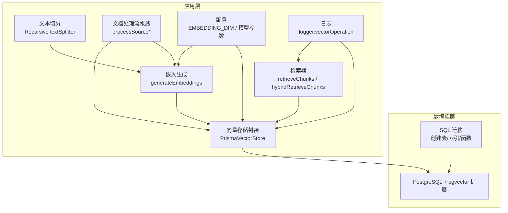
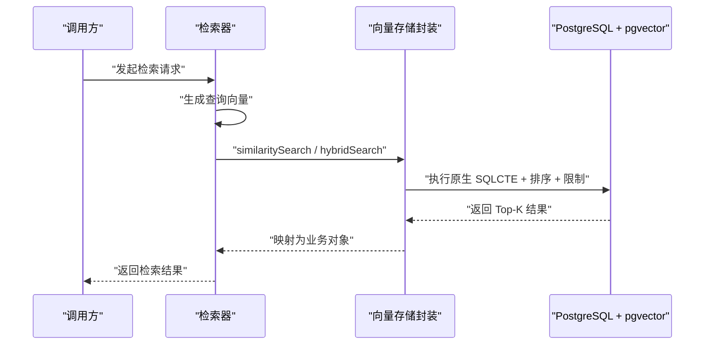
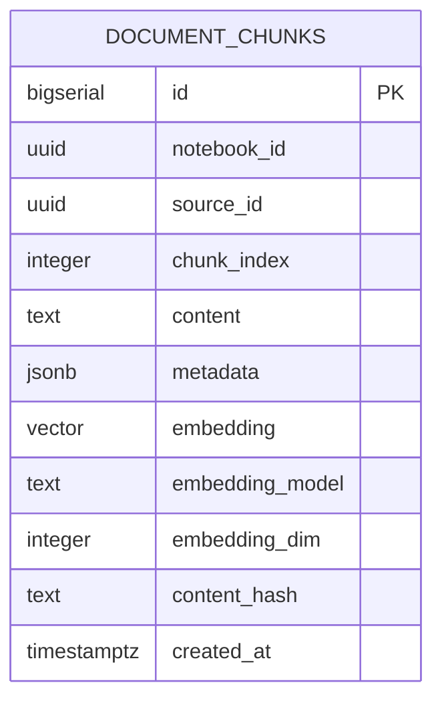
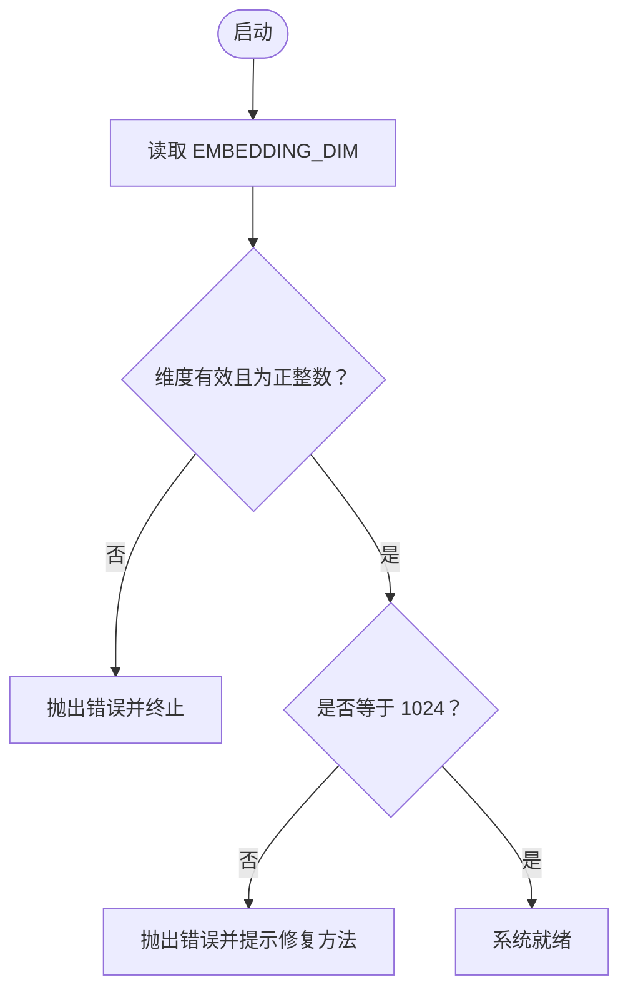
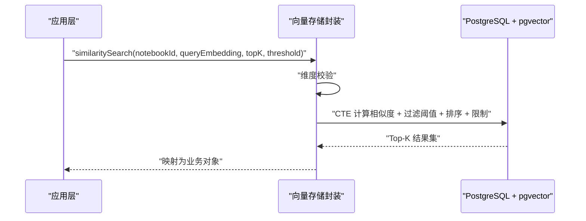
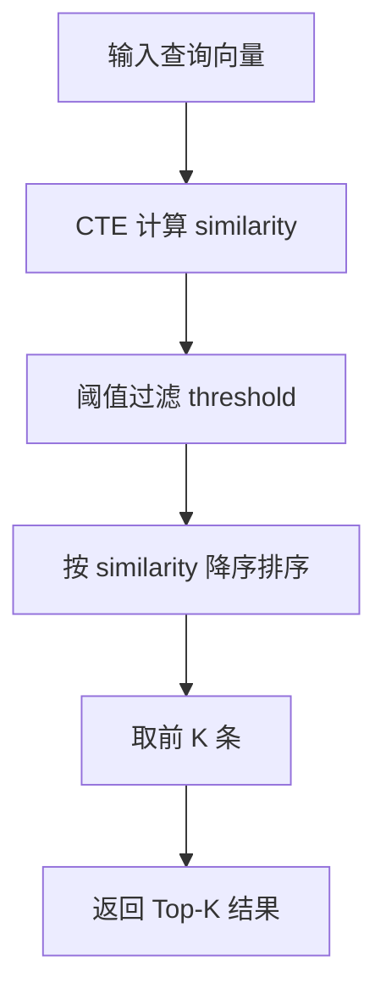
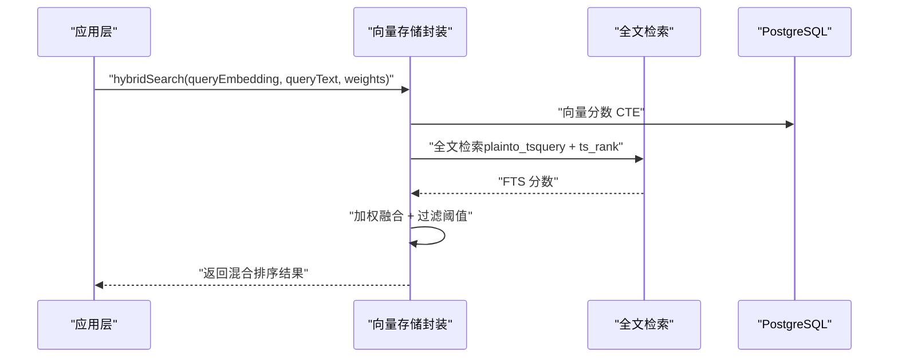
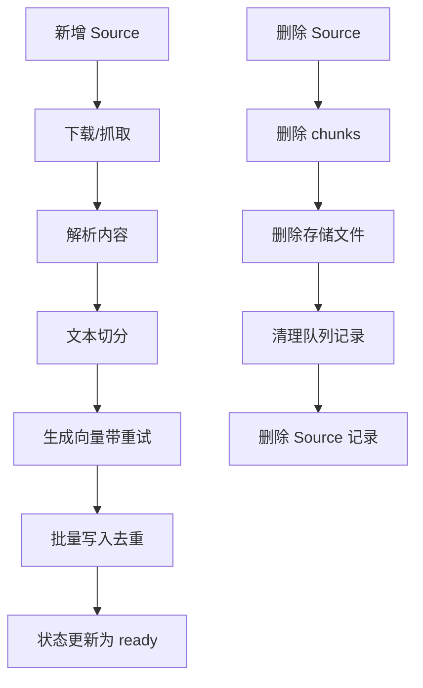
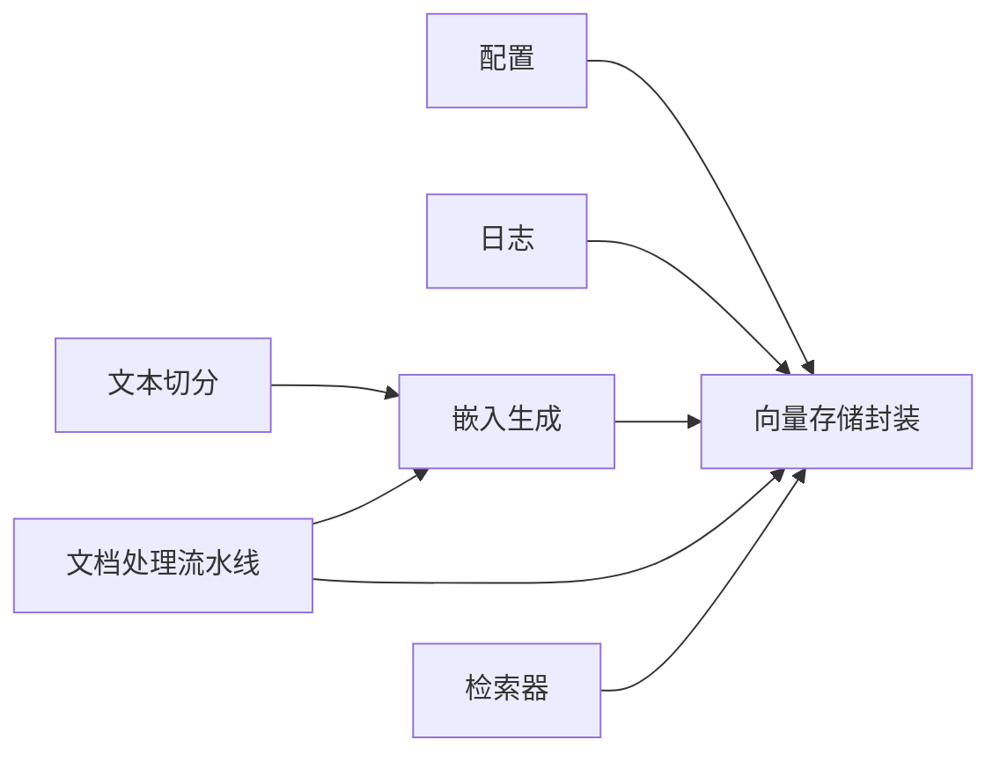

# 向量存储设计

<cite>
**本文引用的文件**
- [lib/db/vector-store.ts](file://lib/db/vector-store.ts)
- [lib/rag/retriever.ts](file://lib/rag/retriever.ts)
- [lib/processing/embedding.ts](file://lib/processing/embedding.ts)
- [lib/processing/text-splitter.ts](file://lib/processing/text-splitter.ts)
- [lib/processing/processor.ts](file://lib/processing/processor.ts)
- [lib/config.ts](file://lib/config.ts)
- [lib/utils/logger.ts](file://lib/utils/logger.ts)
- [prisma/migrations/00000000000000_init_vector/migration.sql](file://prisma/migrations/00000000000000_init_vector/migration.sql)
- [prisma/migrations/20241223_create_vector_table/migration.sql](file://prisma/migrations/20241223_create_vector_table/migration.sql)
- [prisma/migrations/20260120120200_optimize_hnsw_index/migration.sql](file://prisma/migrations/20260120120200_optimize_hnsw_index/migration.sql)
- [prisma/migrations/20260120050505_add_content_tsv/migration.sql](file://prisma/migrations/20260120050505_add_content_tsv/migration.sql)
</cite>

## 目录
1. [简介](#简介)
2. [项目结构](#项目结构)
3. [核心组件](#核心组件)
4. [架构总览](#架构总览)
5. [详细组件分析](#详细组件分析)
6. [依赖关系分析](#依赖关系分析)
7. [性能考量](#性能考量)
8. [故障排查指南](#故障排查指南)
9. [结论](#结论)
10. [附录](#附录)

## 简介
本设计文档围绕向量存储系统展开，重点阐述以下方面：
- document_chunks 表的设计理念与向量存储架构
- pgvector 扩展的集成方式（向量维度、索引类型、性能优化）
- 向量嵌入的数据结构设计（字段、索引、查询优化）
- 相似度计算与 Top-K 检索策略
- 查询接口设计（阈值、批量查询、缓存策略）
- 数据生命周期管理（同步、增量更新、清理）
- 性能基准与优化建议

## 项目结构
向量存储系统由“数据迁移（PostgreSQL + pgvector）+ 应用层封装（Prisma + TypeScript）+ 检索与处理流水线”构成，核心文件分布如下：
- 数据层：SQL 迁移定义表结构、索引与检索函数
- 应用层：向量存储封装、嵌入生成、文本切分、文档处理流水线
- 配置与日志：统一维度校验、日志记录与性能观测

图表来源
- [lib/db/vector-store.ts](file://lib/db/vector-store.ts#L1-L446)
- [lib/processing/embedding.ts](file://lib/processing/embedding.ts#L1-L189)
- [lib/processing/text-splitter.ts](file://lib/processing/text-splitter.ts#L1-L270)
- [lib/processing/processor.ts](file://lib/processing/processor.ts#L1-L560)
- [lib/rag/retriever.ts](file://lib/rag/retriever.ts#L1-L206)
- [lib/config.ts](file://lib/config.ts#L1-L187)
- [lib/utils/logger.ts](file://lib/utils/logger.ts#L1-L98)
- [prisma/migrations/00000000000000_init_vector/migration.sql](file://prisma/migrations/00000000000000_init_vector/migration.sql#L1-L65)

章节来源
- [lib/db/vector-store.ts](file://lib/db/vector-store.ts#L1-L446)
- [lib/processing/embedding.ts](file://lib/processing/embedding.ts#L1-L189)
- [lib/processing/text-splitter.ts](file://lib/processing/text-splitter.ts#L1-L270)
- [lib/processing/processor.ts](file://lib/processing/processor.ts#L1-L560)
- [lib/rag/retriever.ts](file://lib/rag/retriever.ts#L1-L206)
- [lib/config.ts](file://lib/config.ts#L1-L187)
- [lib/utils/logger.ts](file://lib/utils/logger.ts#L1-L98)
- [prisma/migrations/00000000000000_init_vector/migration.sql](file://prisma/migrations/00000000000000_init_vector/migration.sql#L1-L65)

## 核心组件
- 向量存储封装（PrismaVectorStore）
  - 提供 addDocuments、similaritySearch、hybridSearch、deleteDocuments、getExistingHashes 等能力
  - 统一批量插入、维度校验、CTE 评分、阈值过滤、Top-K 排序
- 检索器（retrieveChunks / hybridRetrieveChunks）
  - 负责调用嵌入模型生成查询向量，选择向量或混合检索策略
- 嵌入生成（generateEmbeddings）
  - 调用智谱 Embedding API，带指数退避重试、批量处理、维度校验
- 文本切分（RecursiveTextSplitter）
  - 基于多级分隔符的递归切分，保留语义边界，支持重叠窗口
- 文档处理流水线（processSource*）
  - PDF/URL/Text 三种来源的统一处理流程，串联下载、解析、切分、向量化、入库
- 配置与日志
  - EMBEDDING_DIM 强制校验与固定为 1024；日志记录向量操作的耗时与指标

章节来源
- [lib/db/vector-store.ts](file://lib/db/vector-store.ts#L24-L75)
- [lib/rag/retriever.ts](file://lib/rag/retriever.ts#L53-L116)
- [lib/processing/embedding.ts](file://lib/processing/embedding.ts#L140-L189)
- [lib/processing/text-splitter.ts](file://lib/processing/text-splitter.ts#L83-L270)
- [lib/processing/processor.ts](file://lib/processing/processor.ts#L82-L526)
- [lib/config.ts](file://lib/config.ts#L6-L29)
- [lib/utils/logger.ts](file://lib/utils/logger.ts#L72-L94)

## 架构总览
向量存储采用“SQL 迁移 + 应用封装”的双层设计：
- SQL 层：定义表结构、pgvector 索引、检索函数，确保高性能与可维护性
- 应用层：通过 Prisma 执行原生 SQL，实现批量写入、相似度计算、混合检索与日志观测

图表来源
- [lib/rag/retriever.ts](file://lib/rag/retriever.ts#L53-L116)
- [lib/db/vector-store.ts](file://lib/db/vector-store.ts#L175-L297)
- [prisma/migrations/00000000000000_init_vector/migration.sql](file://prisma/migrations/00000000000000_init_vector/migration.sql#L32-L60)

## 详细组件分析

### 表设计与 pgvector 集成
- 表结构要点
  - 主键：自增 id
  - 关联字段：notebook_id、source_id、chunk_index
  - 内容与元数据：content（TEXT）、metadata（JSONB）
  - 向量字段：embedding（vector(1024)）、embedding_model、embedding_dim
  - 去重字段：content_hash
  - 时间戳：created_at
- 索引策略
  - HNSW 向量索引（cosine 距离）：提升召回与查询性能
  - 辅助索引：notebook_id、source_id、content_hash
  - 混合检索：content_tsv（tsvector）+ GIN 索引
- 检索函数
  - match_document_chunks：按 notebook_id 过滤、阈值过滤、Top-K 返回

图表来源
- [prisma/migrations/00000000000000_init_vector/migration.sql](file://prisma/migrations/00000000000000_init_vector/migration.sql#L6-L20)
- [prisma/migrations/20241223_create_vector_table/migration.sql](file://prisma/migrations/20241223_create_vector_table/migration.sql#L6-L20)

章节来源
- [prisma/migrations/00000000000000_init_vector/migration.sql](file://prisma/migrations/00000000000000_init_vector/migration.sql#L1-L65)
- [prisma/migrations/20241223_create_vector_table/migration.sql](file://prisma/migrations/20241223_create_vector_table/migration.sql#L1-L65)
- [prisma/migrations/20260120050505_add_content_tsv/migration.sql](file://prisma/migrations/20260120050505_add_content_tsv/migration.sql#L1-L7)
- [prisma/migrations/20260120120200_optimize_hnsw_index/migration.sql](file://prisma/migrations/20260120120200_optimize_hnsw_index/migration.sql#L1-L16)

### 向量维度与配置
- 维度固定为 1024，与智谱 embedding-3 模型一致
- 启动时进行维度校验，不合法则直接抛错
- 应用层严格校验插入与查询向量维度

图表来源
- [lib/config.ts](file://lib/config.ts#L6-L29)

章节来源
- [lib/config.ts](file://lib/config.ts#L6-L29)

### 向量嵌入的数据结构与索引
- 数据结构
  - 向量字段 embedding(vector(1024))，与 embedding_dim 保持一致
  - 元数据 metadata(JSONB)，包含分页、字符范围、token 数等
  - content_hash 用于 Source 内部去重
- 索引建立
  - HNSW(cosine)：优化 m=32、ef_construction=128，提升召回率
  - content_tsv + GIN：支持混合检索（向量 + 全文）
- 查询优化
  - CTE 预计算相似度，避免重复计算
  - WHERE + ORDER + LIMIT 控制 Top-K
  - 可选 source_ids 过滤，缩小搜索空间

图表来源
- [lib/db/vector-store.ts](file://lib/db/vector-store.ts#L175-L297)
- [prisma/migrations/20260120120200_optimize_hnsw_index/migration.sql](file://prisma/migrations/20260120120200_optimize_hnsw_index/migration.sql#L10-L12)

章节来源
- [lib/db/vector-store.ts](file://lib/db/vector-store.ts#L175-L297)
- [prisma/migrations/20260120120200_optimize_hnsw_index/migration.sql](file://prisma/migrations/20260120120200_optimize_hnsw_index/migration.sql#L1-L16)

### 相似度计算与 Top-K 检索
- 距离度量
  - 使用向量内积与余弦距离：1 - (u ⋅ v / ||u||·||v||)
  - pgvector 提供向量运算符，SQL 函数中直接计算
- Top-K 策略
  - CTE 预计算 similarity，WHERE 过滤阈值，ORDER BY 降序，LIMIT 限制
  - 支持 source_ids 过滤，进一步缩小候选集
- 结果排序
  - 以 similarity 降序排列，确保最相关的结果优先

图表来源
- [lib/db/vector-store.ts](file://lib/db/vector-store.ts#L215-L252)
- [prisma/migrations/00000000000000_init_vector/migration.sql](file://prisma/migrations/00000000000000_init_vector/migration.sql#L48-L59)

章节来源
- [lib/db/vector-store.ts](file://lib/db/vector-store.ts#L175-L297)
- [prisma/migrations/00000000000000_init_vector/migration.sql](file://prisma/migrations/00000000000000_init_vector/migration.sql#L32-L60)

### 查询接口设计
- 相似度阈值
  - 支持传入 threshold，默认值在检索器配置中设定
- 批量查询优化
  - CTE 避免重复计算；可选 sourceIds 过滤；统一使用 'simple' 分词器
- 混合检索
  - 向量分数与全文检索分数加权融合，提升召回质量
  - 默认权重：向量 0.7、全文 0.3
- 缓存策略
  - 应用层未实现向量查询缓存；可通过外部缓存（如 Redis）扩展（建议）

图表来源
- [lib/db/vector-store.ts](file://lib/db/vector-store.ts#L312-L442)
- [lib/rag/retriever.ts](file://lib/rag/retriever.ts#L131-L206)
- [prisma/migrations/20260120050505_add_content_tsv/migration.sql](file://prisma/migrations/20260120050505_add_content_tsv/migration.sql#L1-L7)

章节来源
- [lib/db/vector-store.ts](file://lib/db/vector-store.ts#L312-L442)
- [lib/rag/retriever.ts](file://lib/rag/retriever.ts#L6-L13)
- [lib/rag/retriever.ts](file://lib/rag/retriever.ts#L131-L206)

### 数据生命周期管理
- 数据同步
  - 文档处理流水线：下载/抓取 → 解析 → 切分 → 向量化 → 写入数据库
  - 写入采用批量插入（每批最多 500 条），避免重复（按 source_id + chunk_index 去重）
- 增量更新
  - 插入前基于 content_hash 去重，避免重复向量化
  - 支持按 sourceIds 过滤检索，减少扫描范围
- 存储清理
  - 删除 Source 时，调用封装层删除对应 chunks，并清理存储与队列记录

图表来源
- [lib/processing/processor.ts](file://lib/processing/processor.ts#L82-L526)
- [lib/db/vector-store.ts](file://lib/db/vector-store.ts#L77-L173)
- [lib/processing/embedding.ts](file://lib/processing/embedding.ts#L140-L189)

章节来源
- [lib/processing/processor.ts](file://lib/processing/processor.ts#L82-L526)
- [lib/db/vector-store.ts](file://lib/db/vector-store.ts#L77-L173)
- [lib/processing/embedding.ts](file://lib/processing/embedding.ts#L140-L189)

## 依赖关系分析
- 组件耦合
  - vector-store 依赖配置（EMBEDDING_DIM）与日志
  - 检索器依赖向量存储与嵌入生成
  - 文档处理流水线串联文本切分、嵌入生成与向量存储
- 外部依赖
  - PostgreSQL + pgvector 扩展
  - 智谱 Embedding API
  - Supabase 存储（用于 PDF/URL 下载）

图表来源
- [lib/config.ts](file://lib/config.ts#L6-L29)
- [lib/db/vector-store.ts](file://lib/db/vector-store.ts#L1-L446)
- [lib/processing/embedding.ts](file://lib/processing/embedding.ts#L1-L189)
- [lib/processing/text-splitter.ts](file://lib/processing/text-splitter.ts#L1-L270)
- [lib/processing/processor.ts](file://lib/processing/processor.ts#L1-L560)
- [lib/rag/retriever.ts](file://lib/rag/retriever.ts#L1-L206)
- [lib/utils/logger.ts](file://lib/utils/logger.ts#L1-L98)

章节来源
- [lib/config.ts](file://lib/config.ts#L1-L187)
- [lib/db/vector-store.ts](file://lib/db/vector-store.ts#L1-L446)
- [lib/processing/embedding.ts](file://lib/processing/embedding.ts#L1-L189)
- [lib/processing/text-splitter.ts](file://lib/processing/text-splitter.ts#L1-L270)
- [lib/processing/processor.ts](file://lib/processing/processor.ts#L1-L560)
- [lib/rag/retriever.ts](file://lib/rag/retriever.ts#L1-L206)
- [lib/utils/logger.ts](file://lib/utils/logger.ts#L1-L98)

## 性能考量
- 索引优化
  - HNSW(cosine) 参数：m=32、ef_construction=128，提升召回率与查询稳定性
  - content_tsv + GIN：加速全文检索，配合混合检索
- 写入优化
  - 批量插入（每批 ≤ 500），ON CONFLICT (source_id, chunk_index) DO NOTHING 去重
  - 维度校验前置，避免无效写入
- 查询优化
  - CTE 预计算相似度，避免重复计算
  - WHERE + ORDER + LIMIT 控制返回规模
  - 可选 sourceIds 过滤，缩小候选集
- 成本控制
  - 嵌入 API 重试与批量处理，降低失败重试成本
  - 日志记录关键指标（duration、topK、threshold、avg similarity），便于性能观测

章节来源
- [prisma/migrations/20260120120200_optimize_hnsw_index/migration.sql](file://prisma/migrations/20260120120200_optimize_hnsw_index/migration.sql#L1-L16)
- [lib/db/vector-store.ts](file://lib/db/vector-store.ts#L77-L173)
- [lib/db/vector-store.ts](file://lib/db/vector-store.ts#L175-L297)
- [lib/processing/embedding.ts](file://lib/processing/embedding.ts#L115-L134)

## 故障排查指南
- 维度不匹配
  - 现象：插入或查询时报维度错误
  - 处理：检查 EMBEDDING_DIM 是否为 1024；确认嵌入模型为 embedding-3
- 写入失败
  - 现象：批量写入异常
  - 处理：查看日志中的错误信息；确认数据库连接与权限；检查重复键冲突
- 查询缓慢
  - 现象：相似度查询耗时较长
  - 处理：确认 HNSW 索引是否存在且参数正确；考虑添加 sourceIds 过滤；调整 topK 与阈值
- 混合检索无结果
  - 现象：向量分数达标但全文未命中
  - 处理：检查 content_tsv 是否存在；确认 GIN 索引生效；适当降低阈值

章节来源
- [lib/config.ts](file://lib/config.ts#L17-L29)
- [lib/utils/logger.ts](file://lib/utils/logger.ts#L72-L94)
- [lib/db/vector-store.ts](file://lib/db/vector-store.ts#L175-L297)

## 结论
该向量存储系统通过“SQL 迁移 + 应用封装”的架构实现了高可靠、可扩展的向量检索能力：
- 固定 1024 维度与 pgvector HNSW(cosine) 索引确保了查询性能与召回稳定
- CTE + 过滤 + Top-K 的查询模式兼顾准确性与效率
- 文档处理流水线与去重策略保障了数据质量与增量更新能力
- 混合检索与日志观测为后续优化提供了数据基础

## 附录
- 环境变量与配置
  - EMBEDDING_DIM：必须为 1024
  - ZHIPU_API_KEY、DATABASE_URL、NEXT_PUBLIC_SUPABASE_URL 等
- 建议的扩展方向
  - 引入外部缓存（Redis）缓存热门查询结果
  - 动态阈值与自适应 topK，结合历史查询统计
  - 分片与分区策略，支撑更大规模数据

章节来源
- [lib/config.ts](file://lib/config.ts#L169-L187)