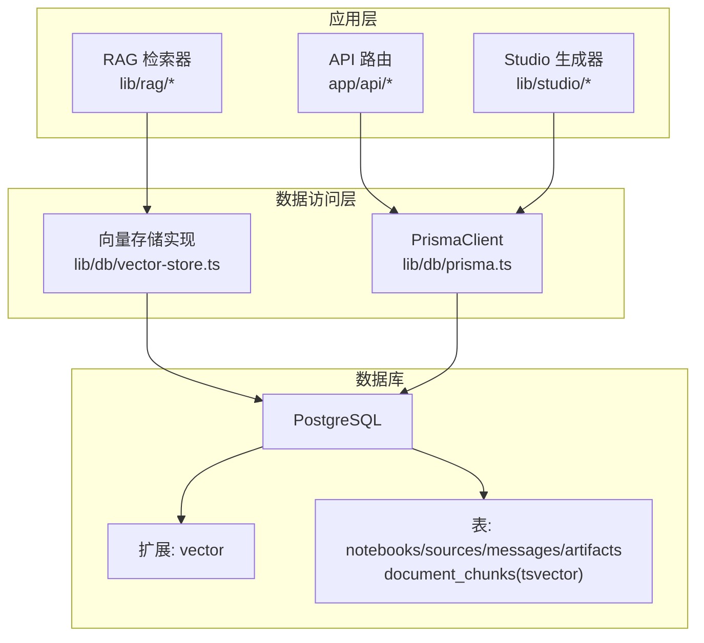
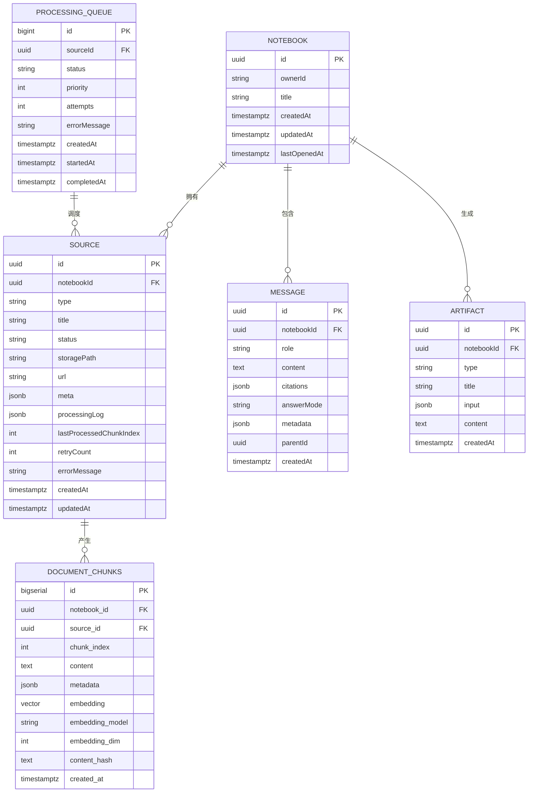
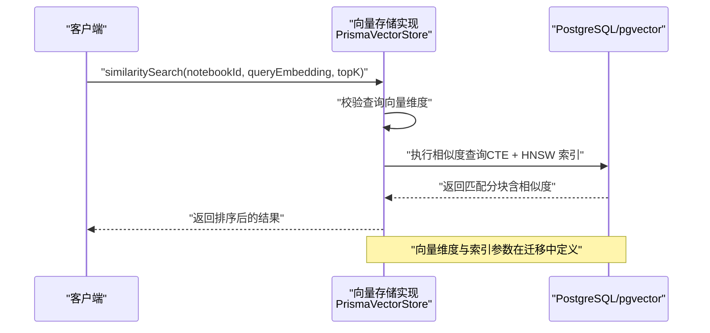
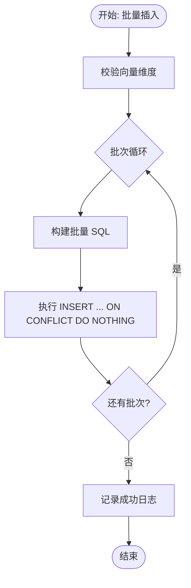
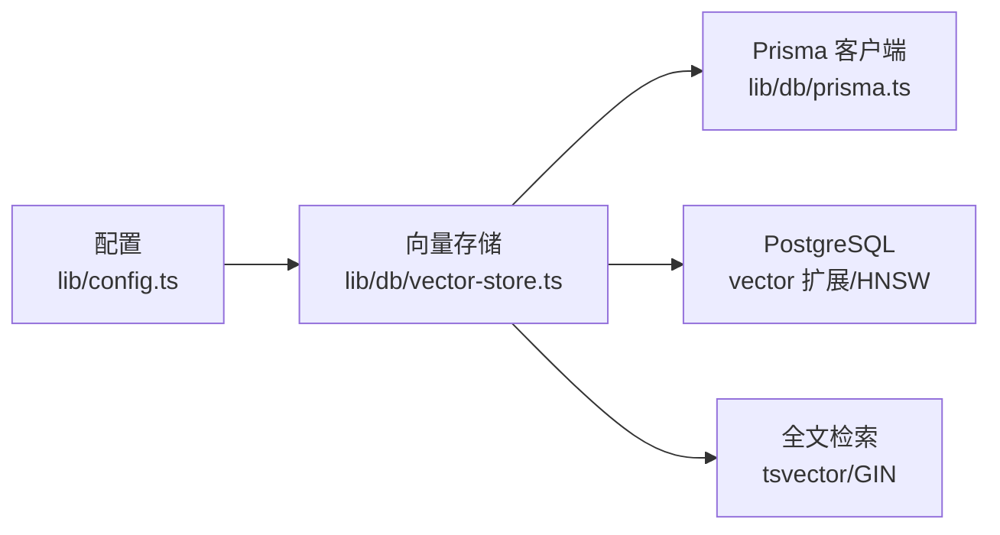

# 数据库设计

<cite>
**本文引用的文件**
- [prisma/schema.prisma](file://prisma/schema.prisma)
- [lib/db/prisma.ts](file://lib/db/prisma.ts)
- [lib/db/vector-store.ts](file://lib/db/vector-store.ts)
- [lib/config.ts](file://lib/config.ts)
- [lib/utils/logger.ts](file://lib/utils/logger.ts)
- [prisma/migrations/00000000000000_init_vector/migration.sql](file://prisma/migrations/00000000000000_init_vector/migration.sql)
- [prisma/migrations/20241223_create_vector_table/migration.sql](file://prisma/migrations/20241223_create_vector_table/migration.sql)
- [prisma/migrations/20260120042257_sync_schema_changes/migration.sql](file://prisma/migrations/20260120042257_sync_schema_changes/migration.sql)
- [prisma/migrations/20260120050505_add_content_tsv/migration.sql](file://prisma/migrations/20260120050505_add_content_tsv/migration.sql)
- [prisma/migrations/20260120120000_add_unique_constraint/migration.sql](file://prisma/migrations/20260120120000_add_unique_constraint/migration.sql)
- [prisma/migrations/20260120120200_optimize_hnsw_index/migration.sql](file://prisma/migrations/20260120120200_optimize_hnsw_index/migration.sql)
- [prisma/migrations/20260120120300_add_composite_indexes/migration.sql](file://prisma/migrations/20260120120300_add_composite_indexes/migration.sql)
</cite>

## 目录
1. [简介](#简介)
2. [项目结构](#项目结构)
3. [核心组件](#核心组件)
4. [架构总览](#架构总览)
5. [详细组件分析](#详细组件分析)
6. [依赖分析](#依赖分析)
7. [性能考量](#性能考量)
8. [故障排查指南](#故障排查指南)
9. [结论](#结论)
10. [附录](#附录)

## 简介
本文件面向 notebookLM-clone 项目的数据库设计，聚焦于核心数据模型（Notebook、Source、DocumentChunk、Artifact 等）与向量存储体系（pgvector 扩展、HNSW 索引、混合检索）。文档从表结构、字段与约束、向量维度与索引策略、数据访问模式与查询优化、迁移管理、数据生命周期与安全、以及 Prisma ORM 使用与事务处理等方面进行系统化阐述，并提供可视化图示帮助理解复杂关系。

## 项目结构
- 数据库访问层采用 Prisma Client，结合 Postgres 适配器与连接池，支持 Serverless 环境下的稳定连接。
- 向量表 document_chunks 通过 SQL 迁移创建与维护，不纳入 Prisma 管道，确保对 pgvector 的精确控制。
- 配置层统一管理向量维度、模型与环境变量，启动时进行严格校验，避免维度不一致导致的检索异常。

**图示来源**
- [lib/db/prisma.ts](file://lib/db/prisma.ts#L1-L41)
- [lib/db/vector-store.ts](file://lib/db/vector-store.ts#L1-L446)
- [prisma/schema.prisma](file://prisma/schema.prisma#L1-L140)
- [prisma/migrations/00000000000000_init_vector/migration.sql](file://prisma/migrations/00000000000000_init_vector/migration.sql#L1-L65)

**章节来源**
- [lib/db/prisma.ts](file://lib/db/prisma.ts#L1-L41)
- [lib/db/vector-store.ts](file://lib/db/vector-store.ts#L1-L446)
- [prisma/schema.prisma](file://prisma/schema.prisma#L1-L140)

## 核心组件
- Notebook：用户拥有的知识库容器，具备多对多关联的 Source、Message、Artifact。
- Source：数据源实体，支持文件、URL、视频等类型，内置处理状态、断点续传与错误日志字段。
- Message：对话消息，支持引用结构、答案模式与检索元数据。
- Artifact：生成产物（摘要、提纲、测验、心智图等），保存输入与内容。
- ProcessingQueue：处理队列，用于异步处理 Source 的分块与嵌入。
- DocumentChunks：向量表，存储分块文本、元数据、向量、哈希与全文检索字段。

**章节来源**
- [prisma/schema.prisma](file://prisma/schema.prisma#L16-L97)
- [prisma/migrations/20260120042257_sync_schema_changes/migration.sql](file://prisma/migrations/20260120042257_sync_schema_changes/migration.sql#L11-L100)

## 架构总览
下图展示核心实体与向量表之间的关系，以及向量检索与混合检索的关键路径。

**图示来源**
- [prisma/schema.prisma](file://prisma/schema.prisma#L16-L134)
- [prisma/migrations/20260120042257_sync_schema_changes/migration.sql](file://prisma/migrations/20260120042257_sync_schema_changes/migration.sql#L11-L100)
- [prisma/migrations/00000000000000_init_vector/migration.sql](file://prisma/migrations/00000000000000_init_vector/migration.sql#L4-L20)

## 详细组件分析

### 数据模型与表结构
- Notebook
  - 字段：主键 id、所有者标识 ownerId、标题、创建/更新/最近打开时间。
  - 约束：索引 ownerId、lastOpenedAt。
  - 关系：一对多关联 Source、Message、Artifact。
- Source
  - 字段：类型（文件/URL/视频）、标题、状态（待处理/处理中/就绪/失败）、存储路径、URL、元信息、处理日志、断点续传索引、重试次数、错误信息。
  - 约束：索引 notebookId、status；外键级联删除。
- Message
  - 字段：角色（用户/助手/系统）、内容、引用、答案模式、元数据、父消息标识、创建时间。
  - 约束：索引 notebookId、createdAt。
- Artifact
  - 字段：类型（摘要/提纲/测验/心智图/自定义）、标题、输入（模板/参数）、内容、创建时间。
  - 约束：索引 notebookId、createdAt。
- ProcessingQueue
  - 字段：状态、优先级、尝试次数、错误信息、创建/开始/完成时间。
  - 约束：复合索引（status, priority, createdAt）。
- DocumentChunks（向量表）
  - 字段：分块索引、内容、元数据、向量、模型名、维度、内容哈希、创建时间。
  - 约束：唯一索引（source_id, chunk_index）；HNSW 向量索引；全文检索 tsvector 列与 GIN 索引；单列 notebook_id 与 created_at 索引。

**章节来源**
- [prisma/schema.prisma](file://prisma/schema.prisma#L16-L134)
- [prisma/migrations/20260120042257_sync_schema_changes/migration.sql](file://prisma/migrations/20260120042257_sync_schema_changes/migration.sql#L11-L100)
- [prisma/migrations/00000000000000_init_vector/migration.sql](file://prisma/migrations/00000000000000_init_vector/migration.sql#L4-L30)
- [prisma/migrations/20260120050505_add_content_tsv/migration.sql](file://prisma/migrations/20260120050505_add_content_tsv/migration.sql#L1-L7)
- [prisma/migrations/20260120120000_add_unique_constraint/migration.sql](file://prisma/migrations/20260120120000_add_unique_constraint/migration.sql#L1-L26)
- [prisma/migrations/20260120120300_add_composite_indexes/migration.sql](file://prisma/migrations/20260120120300_add_composite_indexes/migration.sql#L1-L20)

### 向量存储设计与 pgvector 使用
- 扩展与表结构
  - 启用 vector 扩展，创建 document_chunks 表，embedding 字段固定为 1024 维。
  - 提供 match_document_chunks 函数用于相似度检索。
- 索引策略
  - HNSW 向量索引（cosine 距离），参数 m=32、ef_construction=128，提升召回率。
  - 单列索引 idx_notebook_id、idx_source_id、idx_content_hash。
  - 全文检索列 content_tsv 与 GIN 索引。
- 检索接口
  - 相似度检索：基于向量余弦距离，支持 topK 与阈值过滤。
  - 混合检索：向量分数与全文检索分数加权融合，支持可调权重。
  - 批量插入：按批次写入，冲突时跳过重复（基于 (source_id, chunk_index) 唯一约束）。

**图示来源**
- [lib/db/vector-store.ts](file://lib/db/vector-store.ts#L175-L297)
- [prisma/migrations/00000000000000_init_vector/migration.sql](file://prisma/migrations/00000000000000_init_vector/migration.sql#L22-L24)
- [prisma/migrations/20260120120200_optimize_hnsw_index/migration.sql](file://prisma/migrations/20260120120200_optimize_hnsw_index/migration.sql#L10-L12)

**章节来源**
- [lib/db/vector-store.ts](file://lib/db/vector-store.ts#L77-L443)
- [prisma/migrations/00000000000000_init_vector/migration.sql](file://prisma/migrations/00000000000000_init_vector/migration.sql#L1-L65)
- [prisma/migrations/20241223_create_vector_table/migration.sql](file://prisma/migrations/20241223_create_vector_table/migration.sql#L1-L65)
- [prisma/migrations/20260120120200_optimize_hnsw_index/migration.sql](file://prisma/migrations/20260120120200_optimize_hnsw_index/migration.sql#L1-L16)

### 数据访问模式与查询优化
- 批量写入
  - 分批插入（默认 500 条/批），使用 ON CONFLICT (source_id, chunk_index) DO NOTHING 防止重复。
  - 写入前后记录向量操作日志，便于监控与排障。
- 相似度检索
  - 使用 CTE 预计算相似度，避免重复计算；支持按 source_ids 过滤与阈值筛选。
- 混合检索
  - 向量分数与全文检索分数加权（默认向量权重 0.7、FTS 权重 0.3），提升跨语言与关键词命中能力。
- 索引协同
  - HNSW 索引 + 单列索引组合，满足多租户与过滤场景；created_at 降序索引支持时间范围查询。

**图示来源**
- [lib/db/vector-store.ts](file://lib/db/vector-store.ts#L88-L173)
- [lib/utils/logger.ts](file://lib/utils/logger.ts#L75-L94)

**章节来源**
- [lib/db/vector-store.ts](file://lib/db/vector-store.ts#L77-L173)
- [lib/utils/logger.ts](file://lib/utils/logger.ts#L1-L98)

### Prisma ORM 使用模式与事务处理
- 客户端初始化
  - 使用 @prisma/adapter-pg 与连接池，Serverless 环境建议通过 Supabase Transaction Pooler（端口 6543）并限制每个实例连接数。
  - 开发环境下启用日志，生产环境仅记录错误级别。
- 事务与并发
  - 对于需要一致性的写入（如插入分块与更新 Source 状态），建议在应用层使用 Prisma 事务包裹，保证原子性。
  - 对于只读查询（相似度/混合检索），直接使用 $queryRaw/$executeRaw 执行原生 SQL，获得最佳性能。
- 索引与查询计划
  - 通过 Prisma 索引声明与原生 SQL 索引协同，确保查询优化器能正确选择 HNSW 与过滤索引。

**章节来源**
- [lib/db/prisma.ts](file://lib/db/prisma.ts#L5-L39)
- [prisma/schema.prisma](file://prisma/schema.prisma#L28-L133)

### 数据生命周期管理与安全
- 去重与幂等
  - 通过 (source_id, chunk_index) 唯一索引与 ON CONFLICT DO NOTHING，确保重复分块不会被重复写入。
- 清理策略
  - 基于 created_at 降序索引，支持按时间范围清理过期或冗余分块。
- 安全与合规
  - 敏感字段（如错误信息、处理日志）采用 JSONB 存储，注意最小化暴露面；生产环境关闭非必要日志输出。
  - 向量维度与模型在启动时强制校验，避免因配置漂移导致的数据不一致。

**章节来源**
- [prisma/migrations/20260120120000_add_unique_constraint/migration.sql](file://prisma/migrations/20260120120000_add_unique_constraint/migration.sql#L1-L26)
- [lib/config.ts](file://lib/config.ts#L9-L29)
- [lib/utils/logger.ts](file://lib/utils/logger.ts#L29-L54)

## 依赖分析
- 组件耦合
  - VectorStore 依赖 Prisma 客户端与配置模块，负责向量表的写入、检索与混合检索。
  - Prisma 客户端依赖连接池与适配器，确保在 Serverless 环境的稳定性。
- 外部依赖
  - PostgreSQL vector 扩展与 HNSW 索引参数直接影响检索性能与召回率。
  - 全文检索依赖 to_tsvector('simple')，支持多语言分词。

**图示来源**
- [lib/config.ts](file://lib/config.ts#L1-L52)
- [lib/db/vector-store.ts](file://lib/db/vector-store.ts#L1-L446)
- [lib/db/prisma.ts](file://lib/db/prisma.ts#L1-L41)
- [prisma/migrations/00000000000000_init_vector/migration.sql](file://prisma/migrations/00000000000000_init_vector/migration.sql#L22-L29)

**章节来源**
- [lib/db/vector-store.ts](file://lib/db/vector-store.ts#L1-L446)
- [lib/db/prisma.ts](file://lib/db/prisma.ts#L1-L41)
- [lib/config.ts](file://lib/config.ts#L1-L52)

## 性能考量
- 索引与查询
  - HNSW 索引参数 m=32、ef_construction=128 已优化召回率；按 notebook_id 单列索引与 HNSW 协同，适合多租户过滤场景。
  - created_at 降序索引支持高效的时间范围扫描与清理任务。
- 写入吞吐
  - 批量插入（500 条/批）显著降低事务开销；ON CONFLICT DO NOTHING 避免重复写入。
- 检索成本
  - 相似度检索与混合检索均使用 CTE 预计算，减少重复计算；阈值过滤与 topK 限制返回集大小。
- 环境适配
  - Serverless 环境使用连接池与 Supabase Transaction Pooler，限制每个实例连接数，避免资源争用。

**章节来源**
- [lib/db/vector-store.ts](file://lib/db/vector-store.ts#L88-L173)
- [prisma/migrations/20260120120200_optimize_hnsw_index/migration.sql](file://prisma/migrations/20260120120200_optimize_hnsw_index/migration.sql#L1-L16)
- [lib/db/prisma.ts](file://lib/db/prisma.ts#L8-L16)

## 故障排查指南
- 向量维度不一致
  - 启动时强制校验 EMBEDDING_DIM 必须为 1024；若不一致，抛出错误并提示修复步骤。
- 插入失败或重复
  - 检查 (source_id, chunk_index) 是否已存在；确认 ON CONFLICT 策略与 content_hash 去重逻辑。
- 检索无结果或召回率低
  - 检查 HNSW 索引是否存在且参数正确；调整阈值与 topK；确认过滤条件（notebook_id、source_ids）。
- 日志定位
  - 向量操作日志包含操作类型、耗时、成功与否与关键元数据；开发环境输出更详细日志。

**章节来源**
- [lib/config.ts](file://lib/config.ts#L9-L29)
- [lib/db/vector-store.ts](file://lib/db/vector-store.ts#L142-L172)
- [lib/utils/logger.ts](file://lib/utils/logger.ts#L75-L94)

## 结论
本设计以 Prisma 管理核心业务表，以 SQL 迁移维护向量表与索引，形成“结构化关系 + 向量检索 + 全文检索”的混合检索体系。通过严格的维度校验、唯一约束与索引优化，兼顾了性能与可维护性。配合连接池与日志监控，可在 Serverless 环境下稳定运行。

## 附录

### 数据库迁移管理方案
- 版本控制
  - 迁移文件按时间戳命名，遵循“增量演进”原则；向量表与索引变更独立于 Prisma 管理。
- 回滚策略
  - 对于结构变更（如索引、列增删），建议编写反向迁移脚本；对于数据清理，先备份再执行。
- 生产部署
  - 使用 Supabase Transaction Pooler（端口 6543）与连接池参数，限制每个实例连接数；在 CI 中先运行迁移，再部署应用。

**章节来源**
- [prisma/migrations/20260120042257_sync_schema_changes/migration.sql](file://prisma/migrations/20260120042257_sync_schema_changes/migration.sql#L1-L146)
- [prisma/migrations/20260120120000_add_unique_constraint/migration.sql](file://prisma/migrations/20260120120000_add_unique_constraint/migration.sql#L1-L26)
- [prisma/migrations/20260120120200_optimize_hnsw_index/migration.sql](file://prisma/migrations/20260120120200_optimize_hnsw_index/migration.sql#L1-L16)
- [lib/db/prisma.ts](file://lib/db/prisma.ts#L8-L16)