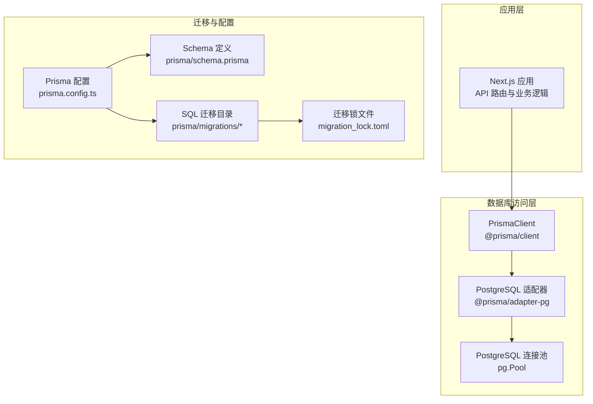
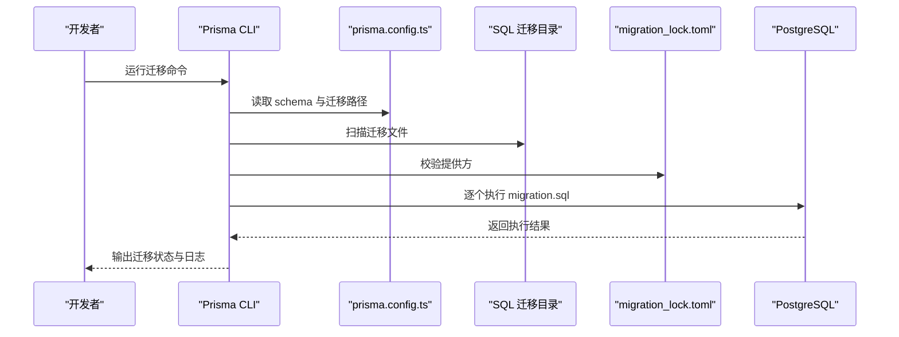
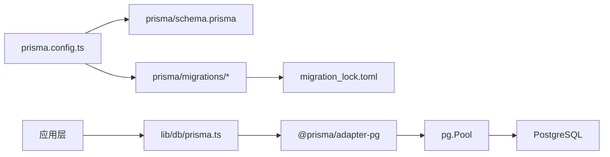

# 数据库迁移管理

<cite>
**本文引用的文件**
- [prisma.config.ts](file://prisma.config.ts)
- [package.json](file://package.json)
- [lib/db/prisma.ts](file://lib/db/prisma.ts)
- [prisma/schema.prisma](file://prisma/schema.prisma)
- [prisma/migrations/migration_lock.toml](file://prisma/migrations/migration_lock.toml)
- [prisma/migrations/00000000000000_init_vector/migration.sql](file://prisma/migrations/00000000000000_init_vector/migration.sql)
- [prisma/migrations/20241223_create_vector_table/migration.sql](file://prisma/migrations/20241223_create_vector_table/migration.sql)
- [prisma/migrations/20260120042257_sync_schema_changes/migration.sql](file://prisma/migrations/20260120042257_sync_schema_changes/migration.sql)
- [prisma/migrations/20260120050505_add_content_tsv/migration.sql](file://prisma/migrations/20260120050505_add_content_tsv/migration.sql)
- [prisma/migrations/20260120120000_add_unique_constraint/migration.sql](file://prisma/migrations/20260120120000_add_unique_constraint/migration.sql)
- [prisma/migrations/20260120120100_fix_fts_language/migration.sql](file://prisma/migrations/20260120120100_fix_fts_language/migration.sql)
- [prisma/migrations/20260120120200_optimize_hnsw_index/migration.sql](file://prisma/migrations/20260120120200_optimize_hnsw_index/migration.sql)
- [prisma/migrations/20260120120300_add_composite_indexes/migration.sql](file://prisma/migrations/20260120120300_add_composite_indexes/migration.sql)
- [app/api/cron/process-queue/route.ts](file://app/api/cron/process-queue/route.ts)
- [lib/db/vector-store.ts](file://lib/db/vector-store.ts)
</cite>

## 目录
1. [简介](#简介)
2. [项目结构](#项目结构)
3. [核心组件](#核心组件)
4. [架构总览](#架构总览)
5. [详细组件分析](#详细组件分析)
6. [依赖关系分析](#依赖关系分析)
7. [性能考量](#性能考量)
8. [故障排查指南](#故障排查指南)
9. [结论](#结论)
10. [附录](#附录)

## 简介
本文件系统化梳理本项目的数据库迁移管理实践，围绕 Prisma 迁移体系与 SQL 迁移并行的模式，说明迁移文件的生成、执行与版本控制流程；解释迁移文件的结构与命名规范；阐述数据库模式变更策略（新增表、修改字段、添加索引、删除对象）；总结迁移的安全执行机制（事务、回滚与恢复）；给出生产环境最佳实践（备份、停机窗口、一致性校验）；解释迁移锁与并发控制；并提供故障排查与常见问题解决方案。

## 项目结构
本项目采用 Prisma 与 SQL 迁移并行的模式：
- 使用 Prisma 管理核心业务模型（notebooks、sources、messages、artifacts、prompt_templates、processing_queue），通过 Prisma Client 访问数据库。
- 使用 SQL 迁移管理向量表 document_chunks 与相关 PostgreSQL 扩展、函数与索引，这些对象不在 Prisma 模型中直接描述，而是通过独立的 SQL 文件进行版本化管理。
- 迁移目录统一存放于 prisma/migrations，每个迁移以“时间戳_动作”命名，内部包含 migration.sql 与 migration_lock.toml 用于锁定当前迁移提供方。

图表来源
- [prisma.config.ts](file://prisma.config.ts#L1-L20)
- [lib/db/prisma.ts](file://lib/db/prisma.ts#L1-L41)
- [prisma/schema.prisma](file://prisma/schema.prisma#L1-L140)
- [prisma/migrations/migration_lock.toml](file://prisma/migrations/migration_lock.toml#L1-L4)

章节来源
- [prisma.config.ts](file://prisma.config.ts#L1-L20)
- [lib/db/prisma.ts](file://lib/db/prisma.ts#L1-L41)
- [prisma/schema.prisma](file://prisma/schema.prisma#L1-L140)
- [prisma/migrations/migration_lock.toml](file://prisma/migrations/migration_lock.toml#L1-L4)

## 核心组件
- Prisma 配置与迁移路径
  - 通过 prisma.config.ts 指定 schema.prisma 路径、迁移目录与数据源 URL，确保 CLI 命令（如 migrate dev、db push）能正确解析配置。
- Prisma Client 与 PostgreSQL 适配
  - 使用 @prisma/adapter-pg 与 pg.Pool 在 Next.js 环境中建立稳定连接，开发与生产日志级别不同，便于调试与生产稳定性控制。
- 迁移锁与提供方
  - migration_lock.toml 标识当前迁移提供方为 postgresql，确保迁移工具链与数据库驱动一致。
- SQL 迁移与 Prisma 模型并行
  - prisma/schema.prisma 描述核心业务模型，而向量表与相关扩展、函数、索引通过 prisma/migrations 下的 SQL 文件进行版本化管理。

章节来源
- [prisma.config.ts](file://prisma.config.ts#L1-L20)
- [lib/db/prisma.ts](file://lib/db/prisma.ts#L1-L41)
- [prisma/migrations/migration_lock.toml](file://prisma/migrations/migration_lock.toml#L1-L4)
- [prisma/schema.prisma](file://prisma/schema.prisma#L1-L140)

## 架构总览
下图展示迁移执行与数据库交互的关键路径：应用通过 PrismaClient 访问数据库；迁移通过 Prisma CLI 与 SQL 文件在目标数据库上执行；迁移锁保障迁移提供方一致性。

图表来源
- [prisma.config.ts](file://prisma.config.ts#L1-L20)
- [prisma/migrations/migration_lock.toml](file://prisma/migrations/migration_lock.toml#L1-L4)
- [prisma/migrations/20260120042257_sync_schema_changes/migration.sql](file://prisma/migrations/20260120042257_sync_schema_changes/migration.sql#L1-L146)

## 详细组件分析

### 迁移文件结构与命名规范
- 命名规范
  - 采用“时间戳_动作”的命名方式，例如 20260120042257_sync_schema_changes，确保迁移顺序与时间线一致。
  - 特殊初始化迁移使用固定前缀，如 00000000000000_init_vector，便于识别初始阶段的迁移。
- 结构组成
  - 每个迁移目录包含 migration.sql，内含迁移所需的 SQL 语句（创建扩展、表、索引、函数等）。
  - migration_lock.toml 标识提供方为 postgresql，防止跨提供方误用。
- 注释与提示
  - 迁移文件中包含注释说明（如风险提示、用途说明），有助于维护与审计。

章节来源
- [prisma/migrations/migration_lock.toml](file://prisma/migrations/migration_lock.toml#L1-L4)
- [prisma/migrations/00000000000000_init_vector/migration.sql](file://prisma/migrations/00000000000000_init_vector/migration.sql#L1-L65)
- [prisma/migrations/20241223_create_vector_table/migration.sql](file://prisma/migrations/20241223_create_vector_table/migration.sql#L1-L65)
- [prisma/migrations/20260120042257_sync_schema_changes/migration.sql](file://prisma/migrations/20260120042257_sync_schema_changes/migration.sql#L1-L146)
- [prisma/migrations/20260120050505_add_content_tsv/migration.sql](file://prisma/migrations/20260120050505_add_content_tsv/migration.sql#L1-L7)
- [prisma/migrations/20260120120000_add_unique_constraint/migration.sql](file://prisma/migrations/20260120120000_add_unique_constraint/migration.sql#L1-L26)
- [prisma/migrations/20260120120300_add_composite_indexes/migration.sql](file://prisma/migrations/20260120120300_add_composite_indexes/migration.sql#L1-L20)

### 数据库模式变更策略
- 新增表
  - 使用 CREATE TABLE 语句在迁移中定义新表结构，并添加必要的索引与注释。
  - 示例：同步模式变更迁移中创建 notebooks、sources、messages、artifacts、prompt_templates、processing_queue 等表。
- 修改字段
  - 使用 ALTER TABLE 语句添加列、修改类型或默认值；注意对已有数据的影响与兼容性。
  - 示例：为 document_chunks 添加 content_tsv 列并创建 GIN 索引。
- 添加索引
  - 使用 CREATE INDEX 语句创建单列或多列索引；针对向量检索与全文检索分别设计索引策略。
  - 示例：HNSW 向量索引、GIN 全文索引、复合索引与时间索引。
- 删除对象
  - 使用 DROP TABLE/INDEX/FUNCTION 等语句删除对象；在执行前评估影响与备份策略。
  - 示例：同步模式变更迁移中包含删除表的警告注释（实际未执行）。

章节来源
- [prisma/migrations/20260120042257_sync_schema_changes/migration.sql](file://prisma/migrations/20260120042257_sync_schema_changes/migration.sql#L1-L146)
- [prisma/migrations/20260120050505_add_content_tsv/migration.sql](file://prisma/migrations/20260120050505_add_content_tsv/migration.sql#L1-L7)
- [prisma/migrations/20260120120300_add_composite_indexes/migration.sql](file://prisma/migrations/20260120120300_add_composite_indexes/migration.sql#L1-L20)

### 迁移的安全执行机制
- 事务与原子性
  - SQL 迁移中的每个 migration.sql 在执行时应视为原子操作；若涉及多条语句，建议在单一事务中执行，确保要么全部成功，要么全部回滚。
- 回滚策略
  - 对于不可逆操作（如删除表），应在迁移中提供回滚思路或注释说明；生产环境建议在执行前备份数据库。
- 错误恢复
  - 应用层通过 Prisma Client 访问数据库，迁移失败时可通过日志定位具体迁移文件与语句，结合备份与手动修复流程恢复。
- 幂等性与防护
  - 在迁移中使用 IF NOT EXISTS 等条件判断，减少重复执行带来的副作用。
  - 示例：向量表创建迁移中对表与索引使用 IF NOT EXISTS。

章节来源
- [prisma/migrations/20241223_create_vector_table/migration.sql](file://prisma/migrations/20241223_create_vector_table/migration.sql#L1-L65)
- [prisma/migrations/20260120050505_add_content_tsv/migration.sql](file://prisma/migrations/20260120050505_add_content_tsv/migration.sql#L1-L7)

### 生产环境迁移最佳实践
- 备份策略
  - 在执行重大迁移（尤其是删除或结构变更）前，务必进行全量备份；对关键表进行增量备份。
- 停机窗口规划
  - 将迁移安排在低峰时段；对于长事务或大表重建，提前评估停机时间并通知用户。
- 数据一致性验证
  - 迁移后执行数据抽样与查询验证，确保索引、函数、约束均按预期工作；对向量检索与全文检索进行端到端测试。
- 变更审批与灰度
  - 对生产迁移实施双人复核与灰度发布策略，逐步扩大范围并监控异常。

（本节为通用指导，无需特定文件引用）

### 迁移锁机制与并发控制
- 迁移锁
  - migration_lock.toml 标识提供方为 postgresql，防止跨提供方误用导致迁移冲突。
- 并发控制
  - 在多环境（开发、测试、生产）之间避免同时对同一数据库执行迁移；建议使用串行化迁移流程与环境隔离。
  - 在 CI/CD 中为不同环境配置独立的 DIRECT_URL，避免误连。

章节来源
- [prisma/migrations/migration_lock.toml](file://prisma/migrations/migration_lock.toml#L1-L4)
- [prisma.config.ts](file://prisma.config.ts#L1-L20)

### 迁移执行流程与脚本
- CLI 命令
  - package.json 中定义了 db:generate、db:push、db:migrate 等脚本，分别对应生成客户端、推送模式与开发迁移。
- 开发迁移流程
  - 在本地修改 prisma/schema.prisma 后，运行 db:migrate 生成新的 SQL 迁移；在本地或测试环境执行迁移；确认无误后再合并到主分支并部署。

章节来源
- [package.json](file://package.json#L1-L82)
- [prisma.config.ts](file://prisma.config.ts#L1-L20)

### 向量表与检索函数的迁移要点
- 扩展与表结构
  - 迁移中启用向量扩展并创建 document_chunks 表，定义主键、字段与注释；为向量检索提供基础。
- 索引与函数
  - 创建 HNSW 向量索引与 GIN 全文索引；定义 match_document_chunks 函数用于相似度检索。
- 批量写入与幂等
  - 应用层通过批量插入与 ON CONFLICT (source_id, chunk_index) DO NOTHING 防止重复写入，提升吞吐并保证幂等。

章节来源
- [prisma/migrations/00000000000000_init_vector/migration.sql](file://prisma/migrations/00000000000000_init_vector/migration.sql#L1-L65)
- [prisma/migrations/20241223_create_vector_table/migration.sql](file://prisma/migrations/20241223_create_vector_table/migration.sql#L1-L65)
- [lib/db/vector-store.ts](file://lib/db/vector-store.ts#L101-L140)

## 依赖关系分析
- 配置依赖
  - prisma.config.ts 依赖 .env.local 中的 DIRECT_URL 提供数据源 URL；schema.prisma 与迁移目录通过配置文件关联。
- 运行时依赖
  - lib/db/prisma.ts 通过 @prisma/adapter-pg 与 pg.Pool 提供稳定的数据库连接；应用层通过 Prisma Client 访问数据库。
- 迁移依赖
  - 迁移目录中的 SQL 文件与 migration_lock.toml 共同决定迁移提供方与执行顺序；迁移执行受数据库连接与权限控制。

图表来源
- [prisma.config.ts](file://prisma.config.ts#L1-L20)
- [prisma/schema.prisma](file://prisma/schema.prisma#L1-L140)
- [prisma/migrations/migration_lock.toml](file://prisma/migrations/migration_lock.toml#L1-L4)
- [lib/db/prisma.ts](file://lib/db/prisma.ts#L1-L41)

章节来源
- [prisma.config.ts](file://prisma.config.ts#L1-L20)
- [lib/db/prisma.ts](file://lib/db/prisma.ts#L1-L41)
- [prisma/migrations/migration_lock.toml](file://prisma/migrations/migration_lock.toml#L1-L4)

## 性能考量
- 索引设计
  - 向量检索使用 HNSW 索引；全文检索使用 GIN 索引；复合查询使用多列索引组合；时间范围查询使用时间索引。
- 批量写入
  - 向量表批量插入采用分批处理与 ON CONFLICT 幂等策略，减少重复写入并提升吞吐。
- 查询优化
  - 通过合理的索引与查询计划，降低检索延迟；对高并发场景建议使用连接池与限流策略。

章节来源
- [prisma/migrations/20260120050505_add_content_tsv/migration.sql](file://prisma/migrations/20260120050505_add_content_tsv/migration.sql#L1-L7)
- [prisma/migrations/20260120120300_add_composite_indexes/migration.sql](file://prisma/migrations/20260120120300_add_composite_indexes/migration.sql#L1-L20)
- [lib/db/vector-store.ts](file://lib/db/vector-store.ts#L101-L140)

## 故障排查指南
- 迁移失败
  - 检查迁移文件中的语法与依赖（如扩展、函数、索引）是否已存在；查看数据库返回的具体错误信息与行号。
  - 使用 migration_lock.toml 确认提供方一致；必要时回滚至上一个稳定迁移。
- 连接问题
  - 确认 DIRECT_URL 与 DATABASE_URL 配置正确；在 Serverless 环境中使用连接池参数（如 pgbouncer=true、connection_limit=1）。
- 数据不一致
  - 对关键表执行一致性校验（抽样、计数、索引扫描）；对向量表检查重复数据与唯一约束是否生效。
- 队列与处理异常
  - Cron 任务处理失败时，检查 attempts 字段与 errorMessage；根据重试策略调整优先级与批大小。

章节来源
- [prisma/migrations/migration_lock.toml](file://prisma/migrations/migration_lock.toml#L1-L4)
- [lib/db/prisma.ts](file://lib/db/prisma.ts#L1-L41)
- [app/api/cron/process-queue/route.ts](file://app/api/cron/process-queue/route.ts#L1-L164)

## 结论
本项目采用 Prisma 与 SQL 迁移并行的模式，既利用 Prisma 的强类型与模型管理能力，又通过 SQL 迁移精确控制向量表、扩展与函数等复杂对象。通过严格的命名规范、迁移锁机制与幂等策略，配合生产环境的备份与验证流程，能够有效降低迁移风险并保障数据一致性。建议在 CI/CD 中引入自动化迁移与回归测试，持续提升迁移质量与可追溯性。

## 附录
- 常用脚本
  - 生成客户端：db:generate
  - 推送模式：db:push
  - 开发迁移：db:migrate
- 迁移文件清单（示例）
  - 初始化向量表：00000000000000_init_vector
  - 创建向量表：20241223_create_vector_table
  - 同步模式变更：20260120042257_sync_schema_changes
  - 添加内容 TSV：20260120050505_add_content_tsv
  - 唯一约束：20260120120000_add_unique_constraint
  - 修复语言：20260120120100_fix_fts_language
  - 优化 HNSW 索引：20260120120200_optimize_hnsw_index
  - 复合索引：20260120120300_add_composite_indexes

章节来源
- [package.json](file://package.json#L1-L82)
- [prisma/migrations/00000000000000_init_vector/migration.sql](file://prisma/migrations/00000000000000_init_vector/migration.sql#L1-L65)
- [prisma/migrations/20241223_create_vector_table/migration.sql](file://prisma/migrations/20241223_create_vector_table/migration.sql#L1-L65)
- [prisma/migrations/20260120042257_sync_schema_changes/migration.sql](file://prisma/migrations/20260120042257_sync_schema_changes/migration.sql#L1-L146)
- [prisma/migrations/20260120050505_add_content_tsv/migration.sql](file://prisma/migrations/20260120050505_add_content_tsv/migration.sql#L1-L7)
- [prisma/migrations/20260120120000_add_unique_constraint/migration.sql](file://prisma/migrations/20260120120000_add_unique_constraint/migration.sql#L1-L26)
- [prisma/migrations/20260120120100_fix_fts_language/migration.sql](file://prisma/migrations/20260120120100_fix_fts_language/migration.sql#L1-L200)
- [prisma/migrations/20260120120200_optimize_hnsw_index/migration.sql](file://prisma/migrations/20260120120200_optimize_hnsw_index/migration.sql#L1-L200)
- [prisma/migrations/20260120120300_add_composite_indexes/migration.sql](file://prisma/migrations/20260120120300_add_composite_indexes/migration.sql#L1-L200)