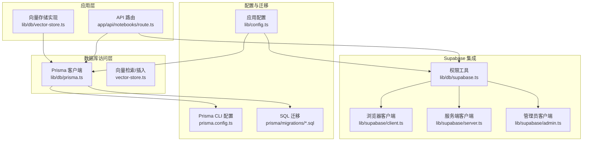
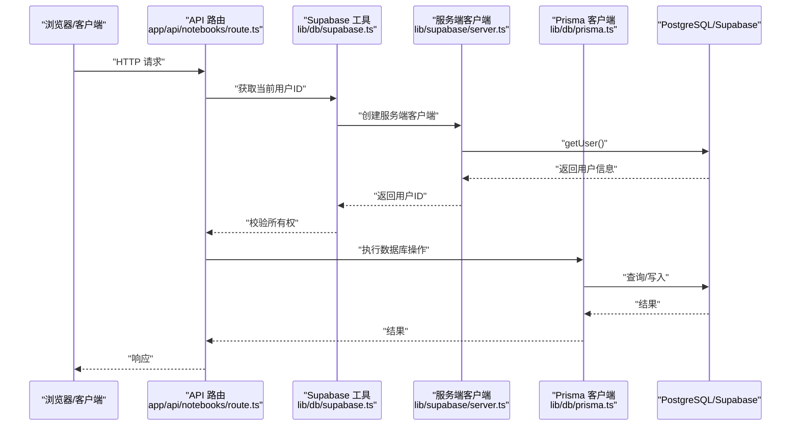
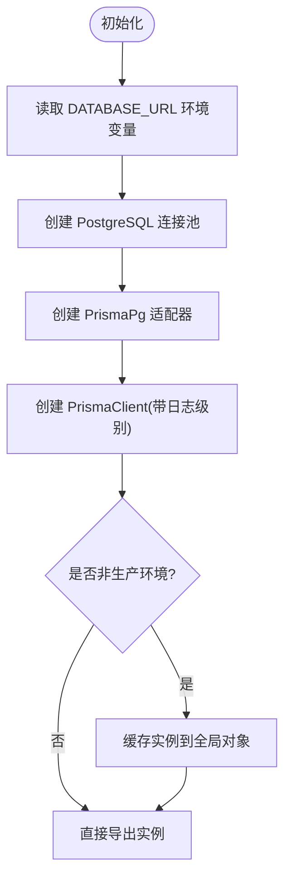
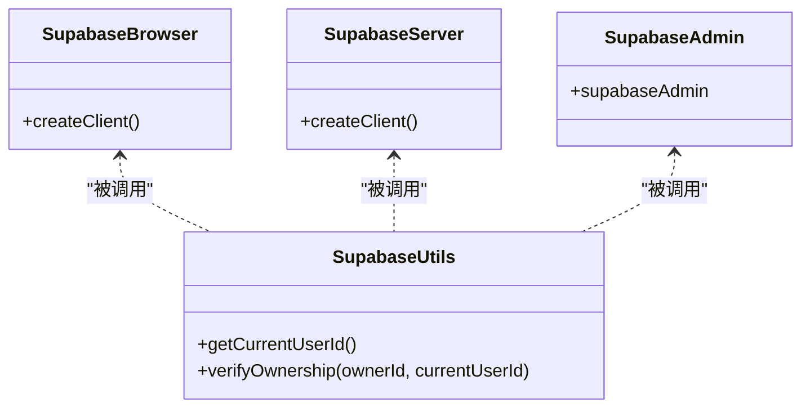
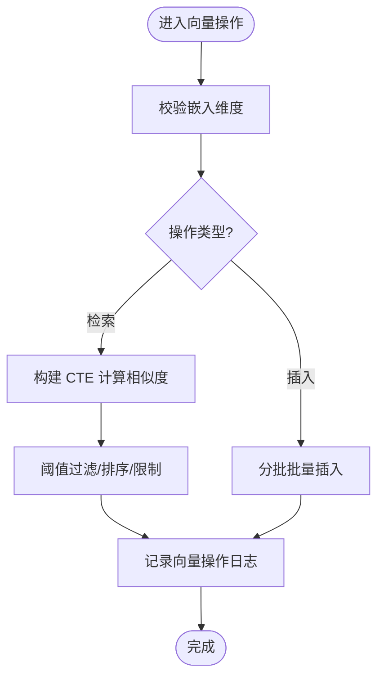
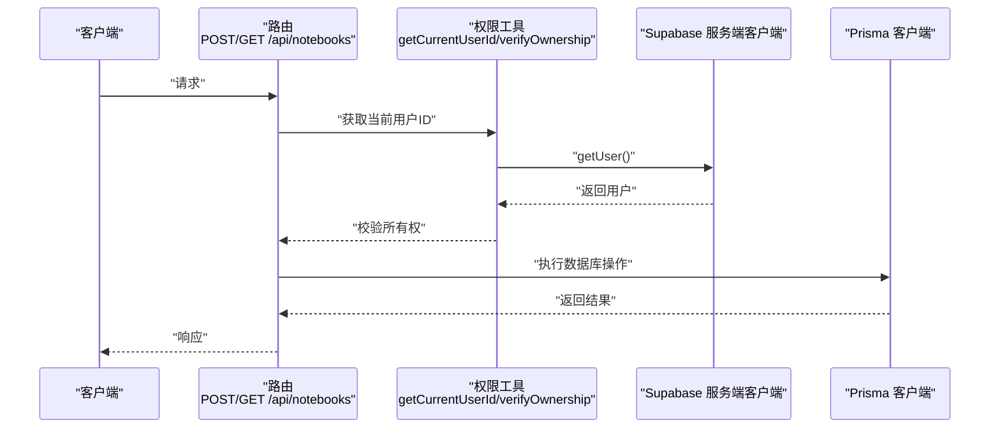
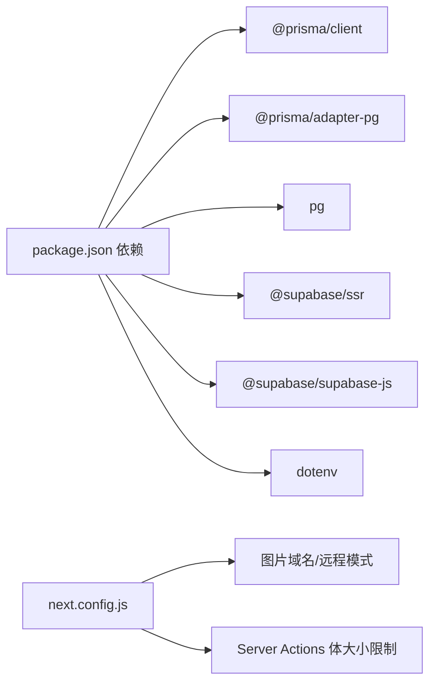

# 数据库配置

<cite>
**本文引用的文件**
- [lib/db/prisma.ts](file://lib/db/prisma.ts)
- [prisma.config.ts](file://prisma.config.ts)
- [lib/config.ts](file://lib/config.ts)
- [lib/supabase/client.ts](file://lib/supabase/client.ts)
- [lib/supabase/server.ts](file://lib/supabase/server.ts)
- [lib/supabase/admin.ts](file://lib/supabase/admin.ts)
- [lib/db/supabase.ts](file://lib/db/supabase.ts)
- [lib/db/vector-store.ts](file://lib/db/vector-store.ts)
- [app/api/notebooks/route.ts](file://app/api/notebooks/route.ts)
- [scripts/test-supabase.ts](file://scripts/test-supabase.ts)
- [lib/utils/logger.ts](file://lib/utils/logger.ts)
- [package.json](file://package.json)
- [prisma/migrations/00000000000000_init_vector/migration.sql](file://prisma/migrations/00000000000000_init_vector/migration.sql)
- [prisma/migrations/20241223_create_vector_table/migration.sql](file://prisma/migrations/20241223_create_vector_table/migration.sql)
- [next.config.js](file://next.config.js)
</cite>

## 目录
1. [简介](#简介)
2. [项目结构](#项目结构)
3. [核心组件](#核心组件)
4. [架构总览](#架构总览)
5. [详细组件分析](#详细组件分析)
6. [依赖关系分析](#依赖关系分析)
7. [性能考虑](#性能考虑)
8. [故障排查指南](#故障排查指南)
9. [结论](#结论)
10. [附录](#附录)

## 简介
本文件聚焦于数据库配置与集成，涵盖以下主题：
- Prisma 客户端配置与连接参数（连接字符串、连接池、日志级别）
- Supabase 数据库集成（认证、客户端初始化、服务端/浏览器端差异）
- 环境差异（开发/测试/生产）与配置策略
- 性能调优（查询超时、连接数限制、索引与向量检索）
- 监控与日志（慢查询、连接监控、性能指标）
- 安全配置（访问控制、加密传输、审计）
- 最佳实践与常见问题

## 项目结构
与数据库相关的关键目录与文件：
- 数据库客户端与适配层：lib/db/prisma.ts、lib/db/vector-store.ts
- Supabase 客户端封装：lib/supabase/client.ts、lib/supabase/server.ts、lib/supabase/admin.ts、lib/db/supabase.ts
- 配置与验证：lib/config.ts、prisma.config.ts
- API 使用示例：app/api/notebooks/route.ts
- 迁移与模式：prisma/migrations/*.sql
- 开发工具：scripts/test-supabase.ts
- 日志工具：lib/utils/logger.ts
- Next 配置：next.config.js
- 依赖声明：package.json

图表来源
- [lib/db/prisma.ts](file://lib/db/prisma.ts#L1-L41)
- [lib/db/vector-store.ts](file://lib/db/vector-store.ts#L1-L446)
- [lib/supabase/client.ts](file://lib/supabase/client.ts#L1-L14)
- [lib/supabase/server.ts](file://lib/supabase/server.ts#L1-L33)
- [lib/supabase/admin.ts](file://lib/supabase/admin.ts#L1-L19)
- [lib/db/supabase.ts](file://lib/db/supabase.ts#L1-L39)
- [prisma.config.ts](file://prisma.config.ts#L1-L20)
- [prisma/migrations/00000000000000_init_vector/migration.sql](file://prisma/migrations/00000000000000_init_vector/migration.sql#L1-L65)
- [prisma/migrations/20241223_create_vector_table/migration.sql](file://prisma/migrations/20241223_create_vector_table/migration.sql#L1-L65)
- [app/api/notebooks/route.ts](file://app/api/notebooks/route.ts#L1-L67)
- [lib/config.ts](file://lib/config.ts#L1-L187)

章节来源
- [lib/db/prisma.ts](file://lib/db/prisma.ts#L1-L41)
- [prisma.config.ts](file://prisma.config.ts#L1-L20)
- [lib/config.ts](file://lib/config.ts#L1-L187)
- [lib/supabase/client.ts](file://lib/supabase/client.ts#L1-L14)
- [lib/supabase/server.ts](file://lib/supabase/server.ts#L1-L33)
- [lib/supabase/admin.ts](file://lib/supabase/admin.ts#L1-L19)
- [lib/db/supabase.ts](file://lib/db/supabase.ts#L1-L39)
- [lib/db/vector-store.ts](file://lib/db/vector-store.ts#L1-L446)
- [app/api/notebooks/route.ts](file://app/api/notebooks/route.ts#L1-L67)
- [prisma/migrations/00000000000000_init_vector/migration.sql](file://prisma/migrations/00000000000000_init_vector/migration.sql#L1-L65)
- [prisma/migrations/20241223_create_vector_table/migration.sql](file://prisma/migrations/20241223_create_vector_table/migration.sql#L1-L65)
- [next.config.js](file://next.config.js#L1-L20)
- [package.json](file://package.json#L1-L82)

## 核心组件
- Prisma 客户端与连接池：通过适配器将 Prisma 与 PostgreSQL 连接池结合，支持 Serverless 环境的连接池参数与日志级别控制。
- Supabase 客户端：提供浏览器端、服务端与管理员端三类客户端，分别用于前端交互、服务端鉴权与管理操作。
- 向量存储实现：基于 Prisma 的原生 SQL 批量插入、相似度检索与混合检索，内置日志记录与维度校验。
- 配置与验证：统一读取环境变量，进行必需项校验与向量维度强制校验。

章节来源
- [lib/db/prisma.ts](file://lib/db/prisma.ts#L1-L41)
- [lib/db/vector-store.ts](file://lib/db/vector-store.ts#L1-L446)
- [lib/supabase/client.ts](file://lib/supabase/client.ts#L1-L14)
- [lib/supabase/server.ts](file://lib/supabase/server.ts#L1-L33)
- [lib/supabase/admin.ts](file://lib/supabase/admin.ts#L1-L19)
- [lib/db/supabase.ts](file://lib/db/supabase.ts#L1-L39)
- [lib/config.ts](file://lib/config.ts#L1-L187)

## 架构总览
下图展示数据库访问与 Supabase 集成的整体流程，包括客户端初始化、鉴权与数据库操作。

图表来源
- [app/api/notebooks/route.ts](file://app/api/notebooks/route.ts#L1-L67)
- [lib/db/supabase.ts](file://lib/db/supabase.ts#L1-L39)
- [lib/supabase/server.ts](file://lib/supabase/server.ts#L1-L33)
- [lib/db/prisma.ts](file://lib/db/prisma.ts#L1-L41)

## 详细组件分析

### Prisma 客户端与连接池配置
- 连接字符串来源：从环境变量读取数据库连接字符串。
- 连接池适配：使用 PostgreSQL 连接池与 Prisma 适配器组合，支持 Serverless 环境的连接池参数（如 pgbouncer 与 connection_limit）。
- 日志级别：开发环境输出错误与警告，生产环境仅输出错误，便于控制日志噪声。
- 全局缓存：在非生产环境下缓存 Prisma 实例与连接池，避免重复创建。

图表来源
- [lib/db/prisma.ts](file://lib/db/prisma.ts#L18-L41)

章节来源
- [lib/db/prisma.ts](file://lib/db/prisma.ts#L1-L41)

### Supabase 客户端与认证集成
- 浏览器端客户端：用于前端组件，读取公共密钥与 URL 初始化。
- 服务端客户端：在服务端组件与路由处理器中使用，自动处理 Cookie 传递。
- 管理员客户端：使用 Secret Key，绕过 RLS，仅用于服务端管理操作。
- 权限工具：提供当前用户 ID 获取与资源所有权校验，所有 API 必须调用以确保架构约束。

图表来源
- [lib/supabase/client.ts](file://lib/supabase/client.ts#L1-L14)
- [lib/supabase/server.ts](file://lib/supabase/server.ts#L1-L33)
- [lib/supabase/admin.ts](file://lib/supabase/admin.ts#L1-L19)
- [lib/db/supabase.ts](file://lib/db/supabase.ts#L1-L39)

章节来源
- [lib/supabase/client.ts](file://lib/supabase/client.ts#L1-L14)
- [lib/supabase/server.ts](file://lib/supabase/server.ts#L1-L33)
- [lib/supabase/admin.ts](file://lib/supabase/admin.ts#L1-L19)
- [lib/db/supabase.ts](file://lib/db/supabase.ts#L1-L39)

### 向量存储与数据库模式
- 向量维度：严格要求与数据库向量维度一致，启动时进行维度校验。
- 批量插入：分批插入，减少单次事务压力；使用原生 SQL 提升性能。
- 相似度检索：使用向量距离与阈值过滤，支持按来源过滤与排序。
- 混合检索：融合向量相似度与全文检索权重，支持可调权重。
- 索引与函数：迁移脚本创建向量扩展、HNSW 索引与检索函数，提升检索效率。

图表来源
- [lib/db/vector-store.ts](file://lib/db/vector-store.ts#L77-L446)
- [prisma/migrations/00000000000000_init_vector/migration.sql](file://prisma/migrations/00000000000000_init_vector/migration.sql#L1-L65)
- [prisma/migrations/20241223_create_vector_table/migration.sql](file://prisma/migrations/20241223_create_vector_table/migration.sql#L1-L65)

章节来源
- [lib/db/vector-store.ts](file://lib/db/vector-store.ts#L1-L446)
- [prisma/migrations/00000000000000_init_vector/migration.sql](file://prisma/migrations/00000000000000_init_vector/migration.sql#L1-L65)
- [prisma/migrations/20241223_create_vector_table/migration.sql](file://prisma/migrations/20241223_create_vector_table/migration.sql#L1-L65)

### API 使用示例与鉴权链路
- API 路由在创建或查询笔记本前，先通过 Supabase 工具获取当前用户并校验所有权，再委托 Prisma 执行数据库操作。
- 错误处理：对请求解析与数据库异常进行捕获与统一响应。

图表来源
- [app/api/notebooks/route.ts](file://app/api/notebooks/route.ts#L1-L67)
- [lib/db/supabase.ts](file://lib/db/supabase.ts#L1-L39)
- [lib/supabase/server.ts](file://lib/supabase/server.ts#L1-L33)
- [lib/db/prisma.ts](file://lib/db/prisma.ts#L1-L41)

章节来源
- [app/api/notebooks/route.ts](file://app/api/notebooks/route.ts#L1-L67)
- [lib/db/supabase.ts](file://lib/db/supabase.ts#L1-L39)
- [lib/supabase/server.ts](file://lib/supabase/server.ts#L1-L33)
- [lib/db/prisma.ts](file://lib/db/prisma.ts#L1-L41)

## 依赖关系分析
- 数据库驱动与适配：Prisma 客户端、@prisma/adapter-pg、pg。
- Supabase 客户端：@supabase/ssr、@supabase/supabase-js。
- Next 配置：图片域名与远程模式、Server Actions 体大小限制。

图表来源
- [package.json](file://package.json#L1-L82)
- [next.config.js](file://next.config.js#L1-L20)

章节来源
- [package.json](file://package.json#L1-L82)
- [next.config.js](file://next.config.js#L1-L20)

## 性能考虑
- 查询超时：Prisma 客户端未显式设置超时时间，建议在生产环境通过数据库连接池参数或代理层设置超时。
- 连接数限制：Serverless 环境建议使用 Supabase Transaction Pooler，并设置 connection_limit=1，避免并发连接过多。
- 索引与检索：迁移脚本已创建 HNSW 向量索引与复合索引，建议保持索引维护与定期统计更新。
- 批量写入：向量存储实现采用分批插入，减少单次事务压力；建议根据内存与数据库负载调整批次大小。
- 日志开销：生产环境仅记录错误日志，避免日志成为性能瓶颈。

章节来源
- [lib/db/prisma.ts](file://lib/db/prisma.ts#L5-L16)
- [lib/db/vector-store.ts](file://lib/db/vector-store.ts#L7-L11)
- [prisma/migrations/00000000000000_init_vector/migration.sql](file://prisma/migrations/00000000000000_init_vector/migration.sql#L22-L30)
- [prisma/migrations/20241223_create_vector_table/migration.sql](file://prisma/migrations/20241223_create_vector_table/migration.sql#L22-L30)

## 故障排查指南
- Supabase 连接测试：提供独立脚本用于测试连接，可快速定位 URL 与 Key 配置问题。
- 环境变量缺失：应用启动前进行必需变量校验，若缺失会抛出错误提示。
- 向量维度不匹配：启动时强制校验维度，若不一致会抛出错误并给出修复建议。
- API 权限错误：未登录或资源所有权校验失败会返回相应状态码与错误信息。

章节来源
- [scripts/test-supabase.ts](file://scripts/test-supabase.ts#L1-L40)
- [lib/config.ts](file://lib/config.ts#L169-L187)
- [lib/db/supabase.ts](file://lib/db/supabase.ts#L22-L33)
- [app/api/notebooks/route.ts](file://app/api/notebooks/route.ts#L12-L41)

## 结论
本项目通过 Prisma 适配 PostgreSQL 连接池、结合 Supabase 的多端客户端与鉴权工具，实现了面向 Serverless 环境的数据库访问方案。配合严格的向量维度校验、索引与批量写入策略，以及精简的日志输出，能够在保证功能正确性的同时兼顾性能与安全性。建议在生产环境中进一步完善超时与连接池参数、监控与慢查询日志，并持续优化检索权重与索引策略。

## 附录

### 环境变量与配置清单
- 数据库连接：DATABASE_URL（Serverless 环境建议使用 Supabase Transaction Pooler）
- Supabase 公共配置：NEXT_PUBLIC_SUPABASE_URL、NEXT_PUBLIC_SUPABASE_ANON_KEY
- Supabase 管理密钥：SUPABASE_SECRET_KEY（仅服务端）
- 向量维度：EMBEDDING_DIM（固定为 1024）
- Prisma CLI 直连：DIRECT_URL（用于 prisma migrate/db push）

章节来源
- [lib/config.ts](file://lib/config.ts#L31-L36)
- [lib/config.ts](file://lib/config.ts#L6-L29)
- [prisma.config.ts](file://prisma.config.ts#L16-L18)
- [lib/db/prisma.ts](file://lib/db/prisma.ts#L23-L25)

### 监控与日志配置
- 日志级别：开发环境输出错误与警告，生产环境仅输出错误。
- 向量操作日志：记录插入/检索/混合检索的耗时、成功与否与关键元数据。
- 建议：结合数据库慢查询日志与连接池监控，定位性能瓶颈。

章节来源
- [lib/db/prisma.ts](file://lib/db/prisma.ts#L33-L34)
- [lib/utils/logger.ts](file://lib/utils/logger.ts#L1-L98)
- [lib/db/vector-store.ts](file://lib/db/vector-store.ts#L143-L173)

### 安全配置要点
- 访问控制：通过 Supabase RLS 与服务端权限校验（verifyOwnership）双重保障。
- 加密传输：使用 HTTPS 与受信任的 Supabase 域名。
- 审计日志：建议启用数据库审计与 API 访问日志，结合错误日志进行追踪。

章节来源
- [lib/db/supabase.ts](file://lib/db/supabase.ts#L18-L33)
- [next.config.js](file://next.config.js#L4-L12)