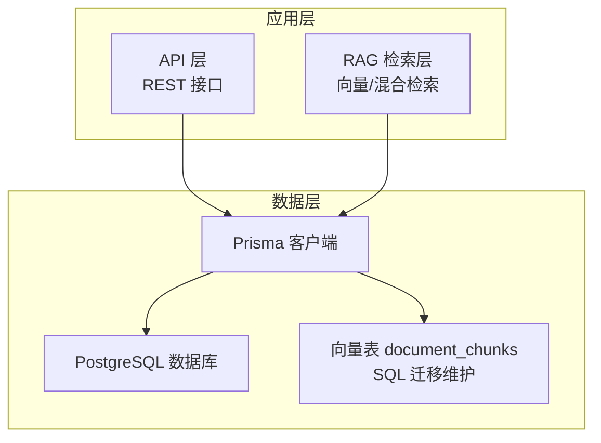
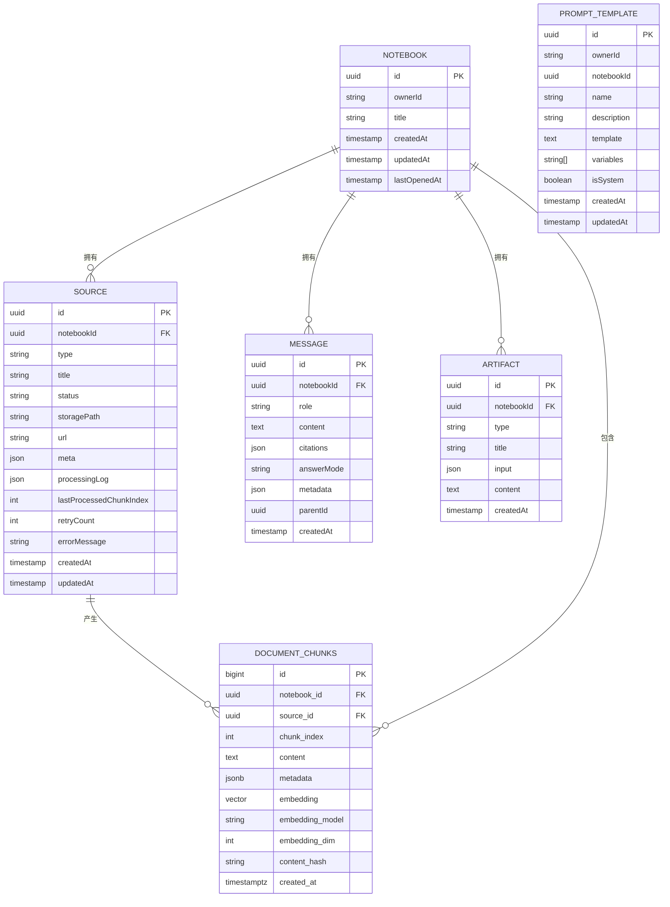
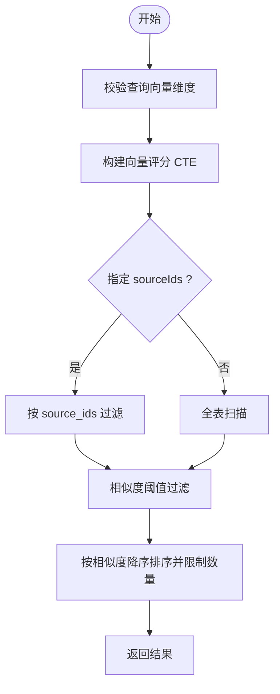
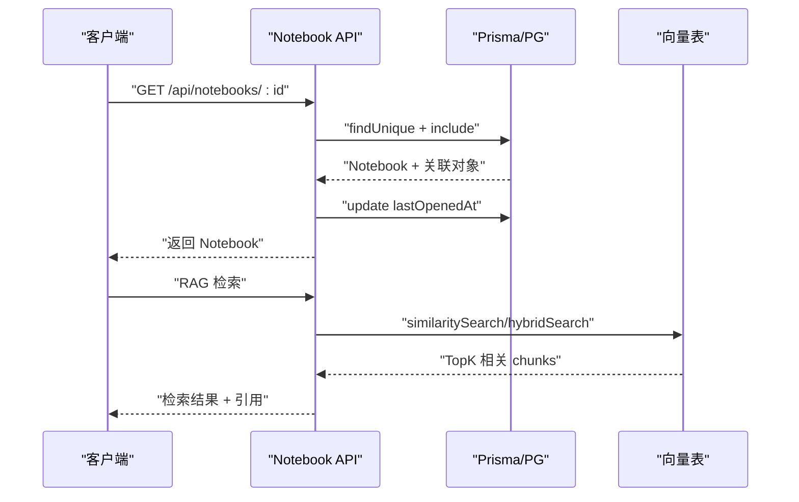

# 核心数据模型

<cite>
**本文引用的文件**
- [prisma/schema.prisma](file://prisma/schema.prisma)
- [prisma.config.ts](file://prisma.config.ts)
- [lib/db/prisma.ts](file://lib/db/prisma.ts)
- [lib/config.ts](file://lib/config.ts)
- [prisma/migrations/20260120042257_sync_schema_changes/migration.sql](file://prisma/migrations/20260120042257_sync_schema_changes/migration.sql)
- [prisma/migrations/20260120120000_add_unique_constraint/migration.sql](file://prisma/migrations/20260120120000_add_unique_constraint/migration.sql)
- [prisma/migrations/20260120120300_add_composite_indexes/migration.sql](file://prisma/migrations/20260120120300_add_composite_indexes/migration.sql)
- [prisma/migrations/00000000000000_init_vector/migration.sql](file://prisma/migrations/00000000000000_init_vector/migration.sql)
- [lib/db/vector-store.ts](file://lib/db/vector-store.ts)
- [lib/rag/retriever.ts](file://lib/rag/retriever.ts)
- [app/api/notebooks/[id]/route.ts](file://app/api/notebooks/[id]/route.ts)
</cite>

## 目录
1. [简介](#简介)
2. [项目结构](#项目结构)
3. [核心组件](#核心组件)
4. [架构总览](#架构总览)
5. [详细组件分析](#详细组件分析)
6. [依赖分析](#依赖分析)
7. [性能考量](#性能考量)
8. [故障排查指南](#故障排查指南)
9. [结论](#结论)
10. [附录](#附录)

## 简介
本文件系统化梳理 NotebookLM 克隆项目的核心数据模型，围绕 Notebook、Source、Message、Artifact、PromptTemplate 等实体展开，阐明其设计理念、字段定义、数据类型选择、约束规则与索引策略；解释实体间关系（一对一、一对多、多对多）及外键、级联删除策略；给出各模型的典型使用场景与业务逻辑；总结 Prisma 模型定义最佳实践，并提供数据模型与关系图示，帮助读者快速理解复杂表关系设计。

## 项目结构
本项目采用 Prisma 管理核心业务表，向量表通过 SQL 迁移独立维护，配合专用向量检索与混合检索能力，形成“关系型主数据 + 向量检索”的双引擎架构。Prisma 配置通过独立配置文件与环境变量驱动，数据库适配层使用 Postgres 适配器，生产环境启用连接池与日志控制。

**图表来源**
- [prisma.config.ts](file://prisma.config.ts#L11-L19)
- [lib/db/prisma.ts](file://lib/db/prisma.ts#L23-L34)
- [lib/db/vector-store.ts](file://lib/db/vector-store.ts#L77-L443)
- [prisma/migrations/00000000000000_init_vector/migration.sql](file://prisma/migrations/00000000000000_init_vector/migration.sql#L6-L20)

**章节来源**
- [prisma.config.ts](file://prisma.config.ts#L1-L20)
- [lib/db/prisma.ts](file://lib/db/prisma.ts#L1-L41)
- [lib/config.ts](file://lib/config.ts#L6-L29)

## 核心组件
本节聚焦五个核心实体：Notebook、Source、Message、Artifact、PromptTemplate。它们共同构成知识笔记本的主数据骨架，支撑“资料接入—对话问答—产物生成—模板复用”的完整闭环。

- Notebook（笔记本）
  - 身份标识：主键 id（UUID），拥有者 ownerId（Supabase 用户 id）
  - 名称与时间：title（字符串），createdAt/updatedAt（时间戳），lastOpenedAt（最近打开时间）
  - 关系：一对多，包含多个 Source、Message、Artifact
  - 索引：ownerId、lastOpenedAt
  - 用途：承载一次学习任务的上下文容器

- Source（资料源）
  - 身份标识：主键 id（UUID），外键 notebookId 指向 Notebook
  - 类型与状态：type（file/url/video），status（pending/processing/ready/failed）
  - 存储与元信息：storagePath（可选）、url（可选）、meta（JSON）
  - 处理追踪：processingLog（JSON 日志）、lastProcessedChunkIndex（断点续传）、retryCount、errorMessage
  - 索引：notebookId、status
  - 级联：onDelete=Cascade（删除笔记本时级联删除资料）

- Message（消息）
  - 身份标识：主键 id（UUID），外键 notebookId 指向 Notebook
  - 角色与内容：role（user/assistant/system），content（文本）
  - 引用与元数据：citations（JSON）、answerMode（grounded/no_evidence/null）、metadata（JSON）、parentId（预留）
  - 索引：notebookId、createdAt
  - 级联：onDelete=Cascade（删除笔记本时级联删除消息）

- Artifact（产物）
  - 身份标识：主键 id（UUID），外键 notebookId 指向 Notebook
  - 类型与标题：type（summary/outline/quiz/mindmap/custom），title（可选）
  - 输入输出：input（JSON，如 prompt、source 选择）、content（Markdown/JSON 文本）
  - 索引：notebookId、createdAt
  - 级联：onDelete=Cascade（删除笔记本时级联删除产物）

- PromptTemplate（提示词模板）
  - 身份标识：主键 id（UUID），拥有者 ownerId（Supabase 用户 id）
  - 上下文绑定：notebookId（可选，绑定到特定笔记本或全局模板）
  - 模板定义：name、description、template（包含 {{variable}} 占位符）、variables（占位符数组）
  - 类别：isSystem（布尔，系统预设 vs 用户自定义）
  - 索引：ownerId、notebookId、isSystem
  - 用途：统一生成式工作流的提示词结构，支持全局与笔记本内模板

**章节来源**
- [prisma/schema.prisma](file://prisma/schema.prisma#L16-L31)
- [prisma/schema.prisma](file://prisma/schema.prisma#L33-L58)
- [prisma/schema.prisma](file://prisma/schema.prisma#L60-L80)
- [prisma/schema.prisma](file://prisma/schema.prisma#L82-L97)
- [prisma/schema.prisma](file://prisma/schema.prisma#L99-L115)

## 架构总览
下图展示核心实体与向量表之间的关系：Notebook 作为根容器，Source/Message/Artifact 与其建立一对多关系；向量表 document_chunks 与 Source/Notebook 建立多对一/一对多关系，支撑 RAG 检索。

**图表来源**
- [prisma/schema.prisma](file://prisma/schema.prisma#L16-L115)
- [prisma/migrations/20260120042257_sync_schema_changes/migration.sql](file://prisma/migrations/20260120042257_sync_schema_changes/migration.sql#L11-L146)
- [prisma/migrations/00000000000000_init_vector/migration.sql](file://prisma/migrations/00000000000000_init_vector/migration.sql#L6-L20)

## 详细组件分析

### Notebook（笔记本）
- 设计理念
  - 作为学习任务的上下文容器，聚合资料、对话与产物
  - 提供 lastOpenedAt 便于排序与活跃度管理
- 字段与约束
  - id：UUID 主键，唯一标识
  - ownerId：Supabase 用户 id，用于权限控制
  - title：非空字符串
  - 时间戳：createdAt/updatedAt 自动维护
  - lastOpenedAt：默认当前时间，用于最近使用排序
- 索引策略
  - ownerId：加速按用户过滤
  - lastOpenedAt：加速最近打开排序
- 使用场景
  - 列表页按 lastOpenedAt 降序展示
  - 详情页加载关联的 sources/messages/artifacts
- 业务逻辑
  - 创建后默认 lastOpenedAt 为当前时间
  - 删除笔记本时，级联删除所有子对象（由外键约束保证）

**章节来源**
- [prisma/schema.prisma](file://prisma/schema.prisma#L16-L31)
- [prisma/migrations/20260120042257_sync_schema_changes/migration.sql](file://prisma/migrations/20260120042257_sync_schema_changes/migration.sql#L102-L106)
- [app/api/notebooks/[id]/route.ts](file://app/api/notebooks/[id]/route.ts#L16-L56)

### Source（资料源）
- 设计理念
  - 统一管理文件、URL、视频等多形态资料
  - 内置处理状态机与断点续传能力
- 字段与约束
  - type：枚举值（file/url/video）
  - status：枚举值（pending/processing/ready/failed），默认 pending
  - storagePath/url：二选一或同时为空
  - meta：JSON 存放页数、MIME、抓取信息等
  - processingLog/retryCount/errorMessage：处理追踪与错误记录
  - lastProcessedChunkIndex：断点续传游标
- 索引策略
  - notebookId：加速按笔记本过滤
  - status：加速按状态筛选（如批量重试）
- 使用场景
  - 资料上传后进入 pending，后台处理中更新状态
  - 重试/取消/刷新操作基于状态与日志
- 业务逻辑
  - 删除资料源时，应触发向量表清理（由调用方负责）
  - 状态变更遵循处理流程，失败时记录错误信息

**章节来源**
- [prisma/schema.prisma](file://prisma/schema.prisma#L33-L58)
- [prisma/migrations/20260120042257_sync_schema_changes/migration.sql](file://prisma/migrations/20260120042257_sync_schema_changes/migration.sql#L108-L112)

### Message（消息）
- 设计理念
  - 记录对话历史，支持引用溯源与元信息统计
  - answerMode 与 metadata 为后续“有证据/无证据”判断与性能监控提供基础
- 字段与约束
  - role：枚举值（user/assistant/system）
  - content：文本字段，支持长文本
  - citations：JSON 引用结构
  - answerMode：枚举值（grounded/no_evidence/null）
  - metadata：JSON，包含检索耗时、生成耗时、模型、topK、chunkCount 等
  - parentId：预留分支/重新生成能力
- 索引策略
  - notebookId：加速按笔记本过滤
  - createdAt：支持按时间顺序展示
- 使用场景
  - 聊天面板按 createdAt 升序渲染
  - 生成回答时写入 metadata 与 citations
- 业务逻辑
  - 删除笔记本时级联删除消息

**章节来源**
- [prisma/schema.prisma](file://prisma/schema.prisma#L60-L80)
- [prisma/migrations/20260120042257_sync_schema_changes/migration.sql](file://prisma/migrations/20260120042257_sync_schema_changes/migration.sql#L114-L118)

### Artifact（产物）
- 设计理念
  - 将生成式结果（摘要、大纲、测验、思维导图等）持久化
  - input 记录生成条件，便于复现与审计
- 字段与约束
  - type：枚举值（summary/outline/quiz/mindmap/custom）
  - title：可选，允许自定义标题
  - input：JSON，记录 prompt、source 选择等
  - content：Markdown 或 JSON 文本
- 索引策略
  - notebookId：加速按笔记本过滤
  - createdAt：支持按时间倒序查看
- 使用场景
  - 产物列表按创建时间倒序展示
  - 查看/编辑/下载产物内容
- 业务逻辑
  - 删除笔记本时级联删除产物

**章节来源**
- [prisma/schema.prisma](file://prisma/schema.prisma#L82-L97)
- [prisma/migrations/20260120042257_sync_schema_changes/migration.sql](file://prisma/migrations/20260120042257_sync_schema_changes/migration.sql#L120-L124)

### PromptTemplate（提示词模板）
- 设计理念
  - 将提示词结构化，支持占位符与变量管理
  - 支持全局模板与笔记本内模板，满足复用与定制需求
- 字段与约束
  - ownerId：模板归属用户
  - notebookId：可选，绑定到特定笔记本
  - name/description/template/variables：模板定义
  - isSystem：区分系统预设与用户自定义
- 索引策略
  - ownerId、notebookId、isSystem：支持按归属与作用域过滤
- 使用场景
  - Studio 生成、批量产物生成时选择模板
  - 模板库按 isSystem 与 notebookId 过滤
- 业务逻辑
  - 删除用户时应清理其模板（可在应用层处理）

**章节来源**
- [prisma/schema.prisma](file://prisma/schema.prisma#L99-L115)
- [prisma/migrations/20260120042257_sync_schema_changes/migration.sql](file://prisma/migrations/20260120042257_sync_schema_changes/migration.sql#L126-L133)

### 向量表 document_chunks（检索引擎）
- 设计理念
  - 专用于向量检索与混合检索，独立于 Prisma 管理，确保高性能与灵活性
  - 固定 1024 维向量，严格维度校验，避免兼容性问题
- 字段与约束
  - notebook_id/source_id：与笔记本/资料源关联
  - chunk_index：在资料内的分片序号，配合唯一约束防重
  - content/content_hash/metadata：内容与去重依据
  - embedding/embedding_model/embedding_dim：向量与元信息
  - created_at：时间戳
  - 唯一索引：(source_id, chunk_index)
- 索引策略
  - idx_embedding_hnsw：HNSW 向量索引（cosine 距离）
  - idx_notebook_id/idx_source_id：过滤索引
  - idx_content_hash：去重与清洗辅助
  - idx_chunks_created_at：时间范围查询
- 使用场景
  - similaritySearch：基于向量相似度检索
  - hybridSearch：向量+全文检索融合
  - match_document_chunks：RPC 函数封装检索
- 业务逻辑
  - 插入时使用 ON CONFLICT (source_id, chunk_index) DO NOTHING 防重
  - 删除资料源时清理对应 chunks

**图表来源**
- [lib/db/vector-store.ts](file://lib/db/vector-store.ts#L175-L297)
- [prisma/migrations/00000000000000_init_vector/migration.sql](file://prisma/migrations/00000000000000_init_vector/migration.sql#L31-L60)

**章节来源**
- [prisma/migrations/00000000000000_init_vector/migration.sql](file://prisma/migrations/00000000000000_init_vector/migration.sql#L1-L65)
- [lib/db/vector-store.ts](file://lib/db/vector-store.ts#L77-L443)
- [lib/config.ts](file://lib/config.ts#L6-L29)

## 依赖分析
- 外键与级联
  - Source/Message/Artifact 的 notebookId 引用 Notebook.id，onDelete=Cascade
  - 该约束保证删除笔记本时自动清理子对象，避免悬挂数据
- 索引与查询
  - 核心表均在常用过滤列上建立索引，提升读性能
  - 向量表使用 HNSW 索引与复合过滤索引，结合 Prisma 原生 SQL 优化检索
- 数据完整性
  - 向量表通过唯一索引 (source_id, chunk_index) 防止重复插入
  - 维度校验贯穿插入与查询阶段，确保 embedding 维度一致

**图表来源**
- [app/api/notebooks/[id]/route.ts](file://app/api/notebooks/[id]/route.ts#L16-L56)
- [lib/db/vector-store.ts](file://lib/db/vector-store.ts#L175-L297)
- [lib/rag/retriever.ts](file://lib/rag/retriever.ts#L53-L116)

**章节来源**
- [prisma/migrations/20260120042257_sync_schema_changes/migration.sql](file://prisma/migrations/20260120042257_sync_schema_changes/migration.sql#L138-L145)
- [prisma/migrations/20260120120000_add_unique_constraint/migration.sql](file://prisma/migrations/20260120120000_add_unique_constraint/migration.sql#L13-L16)
- [prisma/migrations/20260120120300_add_composite_indexes/migration.sql](file://prisma/migrations/20260120120300_add_composite_indexes/migration.sql#L4-L15)

## 性能考量
- 向量检索
  - 使用 HNSW 索引与 cosine 距离，结合 CTE 避免重复计算
  - 支持按 sourceIds 过滤缩小搜索空间，提升命中率与性能
- 批量写入
  - 分批插入（每批上限 500），减少事务开销与内存占用
  - 插入时进行维度校验与防重（ON CONFLICT DO NOTHING）
- 索引设计
  - 单列索引组合使用（notebook_id + embedding），满足多租户与相似度排序
  - 时间索引支持范围查询与统计分析
- 查询优化
  - Prisma 原生 SQL 直接拼接参数，避免 ORM 层额外开销
  - 混合检索将向量与全文检索权重合并，兼顾召回与相关性

**章节来源**
- [lib/db/vector-store.ts](file://lib/db/vector-store.ts#L8-L10)
- [lib/db/vector-store.ts](file://lib/db/vector-store.ts#L108-L140)
- [lib/db/vector-store.ts](file://lib/db/vector-store.ts#L175-L297)
- [lib/db/vector-store.ts](file://lib/db/vector-store.ts#L312-L442)
- [prisma/migrations/20260120120300_add_composite_indexes/migration.sql](file://prisma/migrations/20260120120300_add_composite_indexes/migration.sql#L4-L15)

## 故障排查指南
- 维度不匹配
  - 现象：插入/查询时报维度错误
  - 原因：EMBEDDING_DIM 与数据库向量维度不一致
  - 处理：确保 EMBEDDING_DIM=1024，必要时重建 document_chunks 表
- 重复数据
  - 现象：插入报冲突
  - 原因：(source_id, chunk_index) 已存在
  - 处理：使用唯一索引防重策略，避免重复插入
- 权限与归属
  - 现象：无法访问他人 Notebook
  - 原因：缺少所有权校验
  - 处理：调用 verifyOwnership 校验 ownerId
- 检索异常
  - 现象：检索结果为空或性能差
  - 原因：索引缺失、阈值过高、过滤条件不当
  - 处理：确认 HNSW 与过滤索引存在，调整 topK 与阈值

**章节来源**
- [lib/config.ts](file://lib/config.ts#L6-L29)
- [prisma/migrations/20260120120000_add_unique_constraint/migration.sql](file://prisma/migrations/20260120120000_add_unique_constraint/migration.sql#L13-L16)
- [app/api/notebooks/[id]/route.ts](file://app/api/notebooks/[id]/route.ts#L45-L56)
- [lib/db/vector-store.ts](file://lib/db/vector-store.ts#L175-L297)

## 结论
本数据模型以 Notebook 为核心容器，通过 Source/Message/Artifact 形成完整的知识笔记本生命周期；PromptTemplate 提供结构化提示词复用；向量表通过专用迁移与高性能索引支撑 RAG 检索。整体设计强调数据完整性、查询性能与可维护性，遵循 Prisma 最佳实践与 PostgreSQL 向量扩展能力，适合在 Serverless 环境稳定运行。

## 附录
- Prisma 模型定义最佳实践
  - 字段命名：使用小驼峰，避免保留字
  - 索引设计：围绕高频过滤与排序列建立单列或复合索引
  - 外键与级联：明确删除策略，避免悬挂数据
  - JSON 字段：明确结构与默认值，便于查询与迁移
  - 向量维度：固定且显式声明，避免隐式差异
- 环境与配置要点
  - DATABASE_URL/DIRECT_URL：生产环境使用连接池与只读副本
  - EMBEDDING_DIM：严格校验，确保与数据库向量维度一致
  - 日志级别：开发环境开启警告与错误，生产仅记录错误