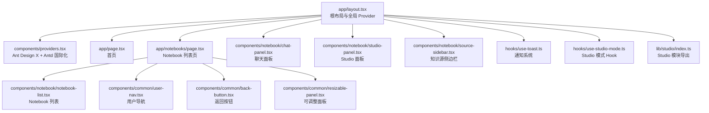
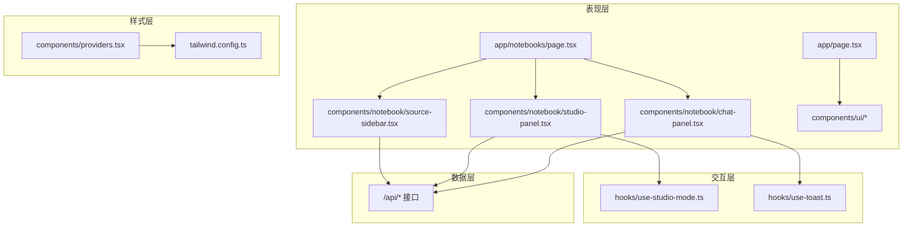
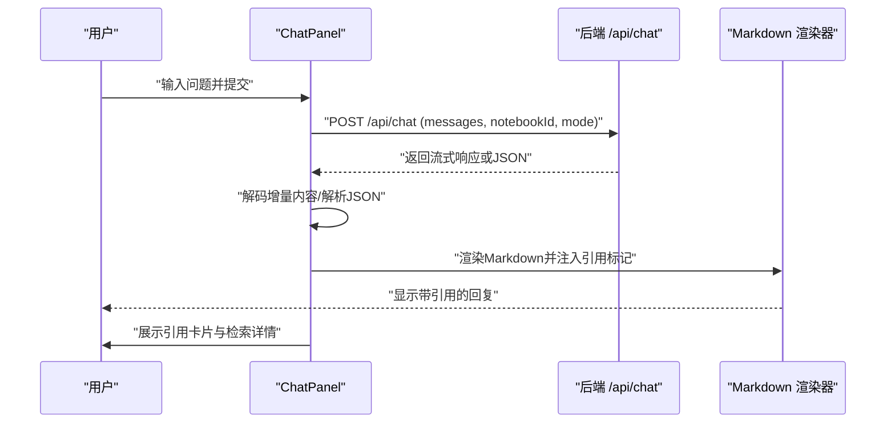
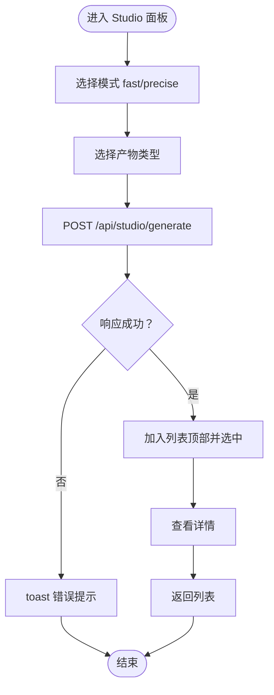
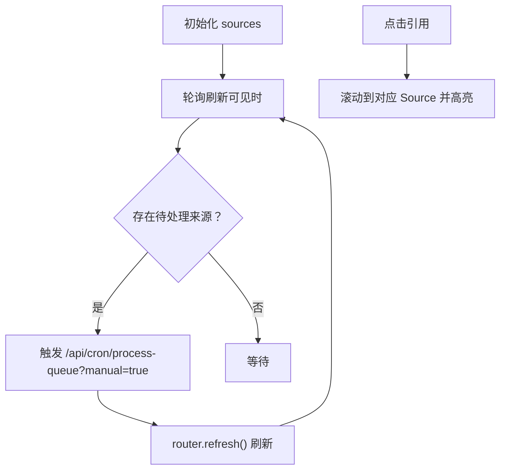
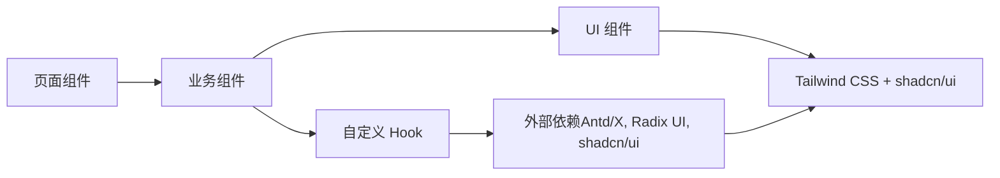

# 前端架构

<cite>
**本文引用的文件**   
- [README.md](file://README.md)
- [package.json](file://package.json)
- [next.config.js](file://next.config.js)
- [tailwind.config.ts](file://tailwind.config.ts)
- [app/layout.tsx](file://app/layout.tsx)
- [components/providers.tsx](file://components/providers.tsx)
- [app/page.tsx](file://app/page.tsx)
- [app/notebooks/page.tsx](file://app/notebooks/page.tsx)
- [components/common/back-button.tsx](file://components/common/back-button.tsx)
- [components/common/resizable-panel.tsx](file://components/common/resizable-panel.tsx)
- [components/common/user-nav.tsx](file://components/common/user-nav.tsx)
- [hooks/use-studio-mode.ts](file://hooks/use-studio-mode.ts)
- [components/notebook/notebook-list.tsx](file://components/notebook/notebook-list.tsx)
- [components/notebook/chat-panel.tsx](file://components/notebook/chat-panel.tsx)
- [components/notebook/studio-panel.tsx](file://components/notebook/studio-panel.tsx)
- [components/notebook/source-sidebar.tsx](file://components/notebook/source-sidebar.tsx)
- [hooks/use-toast.ts](file://hooks/use-toast.ts)
- [lib/studio/index.ts](file://lib/studio/index.ts)
</cite>

## 目录
1. [简介](#简介)
2. [项目结构](#项目结构)
3. [核心组件](#核心组件)
4. [架构总览](#架构总览)
5. [组件详解](#组件详解)
6. [依赖关系分析](#依赖关系分析)
7. [性能考量](#性能考量)
8. [故障排查指南](#故障排查指南)
9. [结论](#结论)
10. [附录](#附录)

## 简介
本项目是一个基于 Next.js 14 App Router 的前端应用，围绕“个人/团队知识库”场景构建，提供 Notebook 管理、知识源导入与处理、RAG 对话、Studio 产物生成等功能。前端采用 React 18 + TypeScript，样式系统以 Tailwind CSS 为核心，并集成 shadcn/ui 与 Radix UI 组件；UI 交互层面引入 Ant Design X 的聊天气泡与发送器组件，结合本地存储与全局 Provider 实现统一的主题与国际化配置。

## 项目结构
- 页面与路由：采用 Next.js App Router，页面位于 app/ 下，包含根布局、登录页、Notebook 列表页、错误与 404 页面等。
- 组件层次：components/ 下按领域划分，common（通用）、notebook（业务组件）、ui（基础 UI 组件）、providers.tsx（全局 Provider）。
- 状态与工具：hooks/ 提供自定义 Hook，lib/ 提供业务模块导出（如 Studio 模块）。
- 样式与主题：tailwind.config.ts 定义主题变量与动画，app/layout.tsx 与 components/providers.tsx 组合提供全局主题与国际化配置。
- 性能与配置：next.config.js 配置图片域、服务端动作体限制；package.json 管理依赖与脚本。

图表来源
- [app/layout.tsx](file://app/layout.tsx#L15-L30)
- [components/providers.tsx](file://components/providers.tsx#L16-L33)
- [app/page.tsx](file://app/page.tsx#L6-L104)
- [app/notebooks/page.tsx](file://app/notebooks/page.tsx#L14-L64)
- [components/notebook/notebook-list.tsx](file://components/notebook/notebook-list.tsx#L27-L49)
- [components/common/user-nav.tsx](file://components/common/user-nav.tsx#L33-L81)
- [components/common/back-button.tsx](file://components/common/back-button.tsx#L17-L31)
- [components/common/resizable-panel.tsx](file://components/common/resizable-panel.tsx#L20-L92)
- [components/notebook/chat-panel.tsx](file://components/notebook/chat-panel.tsx#L60-L412)
- [components/notebook/studio-panel.tsx](file://components/notebook/studio-panel.tsx#L25-L260)
- [components/notebook/source-sidebar.tsx](file://components/notebook/source-sidebar.tsx#L49-L316)
- [hooks/use-toast.ts](file://hooks/use-toast.ts#L145-L199)
- [hooks/use-studio-mode.ts](file://hooks/use-studio-mode.ts#L14-L38)
- [lib/studio/index.ts](file://lib/studio/index.ts#L6-L24)

章节来源
- [README.md](file://README.md#L42-L49)
- [next.config.js](file://next.config.js#L1-L21)
- [tailwind.config.ts](file://tailwind.config.ts#L1-L95)
- [app/layout.tsx](file://app/layout.tsx#L1-L31)
- [components/providers.tsx](file://components/providers.tsx#L1-L34)

## 核心组件
- 根布局与 Provider：根布局负责注入全局 Provider，统一 Ant Design X 与 Antd 主题、语言包；同时挂载全局通知组件。
- Notebook 列表页：鉴权后拉取用户 Notebook 列表，渲染卡片并提供创建入口。
- 通用组件：返回按钮、可调整面板、用户导航等，提供跨页面复用能力。
- 业务组件：聊天面板（RAG 对话与流式输出）、Studio 面板（产物生成与模板库）、知识源侧边栏（来源管理与队列控制）。
- 自定义 Hook：Studio 模式持久化、通知系统；业务组件通过 Hook 管理状态与行为。
- 样式系统：Tailwind CSS 主题变量与动画扩展，shadcn/ui 组件库与 Radix UI 原语组合使用。

章节来源
- [app/layout.tsx](file://app/layout.tsx#L15-L30)
- [components/providers.tsx](file://components/providers.tsx#L16-L33)
- [app/notebooks/page.tsx](file://app/notebooks/page.tsx#L14-L64)
- [components/notebook/notebook-list.tsx](file://components/notebook/notebook-list.tsx#L27-L49)
- [components/common/back-button.tsx](file://components/common/back-button.tsx#L17-L31)
- [components/common/resizable-panel.tsx](file://components/common/resizable-panel.tsx#L20-L92)
- [components/common/user-nav.tsx](file://components/common/user-nav.tsx#L33-L81)
- [components/notebook/chat-panel.tsx](file://components/notebook/chat-panel.tsx#L60-L412)
- [components/notebook/studio-panel.tsx](file://components/notebook/studio-panel.tsx#L25-L260)
- [components/notebook/source-sidebar.tsx](file://components/notebook/source-sidebar.tsx#L49-L316)
- [hooks/use-studio-mode.ts](file://hooks/use-studio-mode.ts#L14-L38)
- [hooks/use-toast.ts](file://hooks/use-toast.ts#L145-L199)
- [lib/studio/index.ts](file://lib/studio/index.ts#L6-L24)

## 架构总览
前端采用分层架构：
- 表现层：页面组件（App Router）、业务组件（notebook/）、通用组件（common/）、UI 组件（ui/）。
- 交互层：自定义 Hook（状态与副作用）、上下文（如引用上下文）。
- 样式层：Tailwind CSS + shadcn/ui + Radix UI，配合 Antd 主题与国际化。
- 数据层：通过 fetch API 调用后端接口（/api/*），部分重型组件采用动态导入优化首屏。

图表来源
- [app/page.tsx](file://app/page.tsx#L6-L104)
- [app/notebooks/page.tsx](file://app/notebooks/page.tsx#L14-L64)
- [components/notebook/chat-panel.tsx](file://components/notebook/chat-panel.tsx#L60-L412)
- [components/notebook/studio-panel.tsx](file://components/notebook/studio-panel.tsx#L25-L260)
- [components/notebook/source-sidebar.tsx](file://components/notebook/source-sidebar.tsx#L49-L316)
- [hooks/use-studio-mode.ts](file://hooks/use-studio-mode.ts#L14-L38)
- [hooks/use-toast.ts](file://hooks/use-toast.ts#L145-L199)
- [tailwind.config.ts](file://tailwind.config.ts#L1-L95)
- [components/providers.tsx](file://components/providers.tsx#L16-L33)

## 组件详解

### 路由与页面结构（App Router）
- 根布局：注入 Providers、全局样式与通知组件，设置元数据与字体。
- 首页：展示功能特性与引导按钮，使用 shadcn/ui 卡片与按钮。
- Notebook 列表页：鉴权拦截、拉取 Notebook 列表、渲染卡片与创建入口；用户导航组件提供头像与登出。

章节来源
- [app/layout.tsx](file://app/layout.tsx#L15-L30)
- [app/page.tsx](file://app/page.tsx#L6-L104)
- [app/notebooks/page.tsx](file://app/notebooks/page.tsx#L14-L64)
- [components/common/user-nav.tsx](file://components/common/user-nav.tsx#L33-L81)

### 通用组件
- 返回按钮：封装路由跳转与刷新逻辑，确保目标页面数据刷新。
- 可调整面板：支持左右两侧拖拽调整宽度，限定最小/最大宽度，提供视觉反馈。
- 用户导航：下拉菜单展示用户信息与退出登录，调用 Supabase 客户端执行登出。

章节来源
- [components/common/back-button.tsx](file://components/common/back-button.tsx#L17-L31)
- [components/common/resizable-panel.tsx](file://components/common/resizable-panel.tsx#L20-L92)
- [components/common/user-nav.tsx](file://components/common/user-nav.tsx#L33-L81)

### Notebook 列表组件
- 列表渲染：根据 Notebook 数量决定空状态或网格卡片展示。
- 交互：为空时提示创建入口，有数据时按列数响应式布局。

章节来源
- [components/notebook/notebook-list.tsx](file://components/notebook/notebook-list.tsx#L27-L49)

### 聊天面板（RAG 对话）
- 流式输出：基于 fetch + ReadableStream 解码增量内容，支持 JSON 与流式两种响应形态。
- 引用与检索详情：消息底部展示引用卡片与检索详情弹窗，支持点击高亮对应来源。
- Markdown 渲染：自定义内容渲染器，将内联引用标记 [1] [2] 渲染为可点击按钮。
- 模型选择：支持 fast/precise 模式切换，本地持久化。
- 动态导入：检索详情面板按需加载，降低首屏体积。

图表来源
- [components/notebook/chat-panel.tsx](file://components/notebook/chat-panel.tsx#L171-L300)
- [components/notebook/chat-panel.tsx](file://components/notebook/chat-panel.tsx#L302-L316)
- [components/notebook/chat-panel.tsx](file://components/notebook/chat-panel.tsx#L396-L411)

章节来源
- [components/notebook/chat-panel.tsx](file://components/notebook/chat-panel.tsx#L60-L412)

### Studio 面板（产物生成）
- 产物生成：支持摘要、大纲、测验、思维导图等类型，调用 /api/studio/generate。
- 模式选择：fast/precise 模式持久化，精准模式提示耗时较长。
- 模板库：支持模板运行并保存为产物，自动跳转到产物列表。
- 产物管理：列表展示、删除、查看详情；详情视图支持返回列表。

图表来源
- [components/notebook/studio-panel.tsx](file://components/notebook/studio-panel.tsx#L54-L111)
- [components/notebook/studio-panel.tsx](file://components/notebook/studio-panel.tsx#L172-L260)
- [lib/studio/index.ts](file://lib/studio/index.ts#L6-L24)

章节来源
- [components/notebook/studio-panel.tsx](file://components/notebook/studio-panel.tsx#L25-L260)
- [lib/studio/index.ts](file://lib/studio/index.ts#L6-L24)

### 知识源侧边栏（来源管理）
- 来源列表：展示来源标题、类型、状态与队列信息，支持展开/折叠。
- 队列管理：展示排队任务，支持立即处理与取消排队；轮询刷新与手动触发处理。
- 引用联动：监听引用选择变化，自动滚动到对应来源并高亮。
- 搜索与上传：嵌入搜索框与上传模态框，统一成功回调刷新页面。

图表来源
- [components/notebook/source-sidebar.tsx](file://components/notebook/source-sidebar.tsx#L64-L84)
- [components/notebook/source-sidebar.tsx](file://components/notebook/source-sidebar.tsx#L112-L146)
- [components/notebook/source-sidebar.tsx](file://components/notebook/source-sidebar.tsx#L148-L167)

章节来源
- [components/notebook/source-sidebar.tsx](file://components/notebook/source-sidebar.tsx#L49-L316)

### 状态管理与自定义 Hook
- Studio 模式 Hook：读取/写入 localStorage，提供模式切换与加载状态。
- 通知系统 Hook：集中管理 toast 队列、去重、自动移除与上限控制。

章节来源
- [hooks/use-studio-mode.ts](file://hooks/use-studio-mode.ts#L14-L38)
- [hooks/use-toast.ts](file://hooks/use-toast.ts#L145-L199)

### 样式系统与响应式设计
- Tailwind CSS：主题变量（颜色、圆角、动画）、暗色模式类名开关、插件（动画、排版）。
- shadcn/ui + Radix UI：基础 UI 组件与原语，保证一致性与无障碍。
- Antd 主题：ConfigProvider 与 XProvider 统一 Ant Design X 组件主题与语言。

章节来源
- [tailwind.config.ts](file://tailwind.config.ts#L1-L95)
- [components/providers.tsx](file://components/providers.tsx#L16-L33)
- [app/layout.tsx](file://app/layout.tsx#L15-L30)

## 依赖关系分析
- 组件依赖：页面组件依赖业务组件与通用组件；业务组件依赖 UI 组件与自定义 Hook；Hook 依赖浏览器 API（localStorage、fetch）。
- 外部依赖：Ant Design X（聊天气泡与发送器）、@ant-design/x-markdown（Markdown 渲染）、Radix UI（下拉菜单、对话框等）、shadcn/ui（基础 UI 组件）。
- 样式依赖：Tailwind CSS 与 shadcn/ui 组件样式耦合，Antd 主题与 shadcn/ui 主题在 Provider 中协调。

图表来源
- [components/notebook/chat-panel.tsx](file://components/notebook/chat-panel.tsx#L10-L16)
- [components/notebook/studio-panel.tsx](file://components/notebook/studio-panel.tsx#L8-L18)
- [components/notebook/source-sidebar.tsx](file://components/notebook/source-sidebar.tsx#L10-L24)
- [hooks/use-studio-mode.ts](file://hooks/use-studio-mode.ts#L8-L31)
- [hooks/use-toast.ts](file://hooks/use-toast.ts#L4-L19)
- [tailwind.config.ts](file://tailwind.config.ts#L88-L91)
- [components/providers.tsx](file://components/providers.tsx#L8-L32)

章节来源
- [package.json](file://package.json#L17-L64)

## 性能考量
- 代码分割与懒加载：聊天面板对“检索详情面板”采用动态导入，减少首屏体积。
- 图片与远程资源：next.config.js 配置允许本地与 Supabase 域访问，避免不必要的跨域阻塞。
- 服务端动作体限制：针对大文件上传场景放宽 serverActions 体限制，平衡安全与可用性。
- 状态与渲染优化：聊天面板使用 useMemo 生成 Bubble.List 的 items，避免不必要重渲染；Studio 面板对产物列表进行空状态与加载状态区分。
- 轮询与刷新：来源侧边栏在页面可见时才刷新，降低后台消耗。

章节来源
- [components/notebook/chat-panel.tsx](file://components/notebook/chat-panel.tsx#L38-L42)
- [next.config.js](file://next.config.js#L13-L17)
- [components/notebook/source-sidebar.tsx](file://components/notebook/source-sidebar.tsx#L74-L84)

## 故障排查指南
- 登录态与路由保护：Notebook 列表页在未登录时重定向至登录页，确保后续 API 请求可用。
- 通知与错误提示：统一使用 toast Hook，支持错误类型与自动移除，便于定位问题。
- 引用与来源联动：若点击引用未滚动到对应来源，检查引用上下文与 SourceCard 引用 ID 是否匹配。
- Studio 生成失败：查看响应错误字段与 toast 提示，确认模式与来源数量满足要求。
- 聊天无输出：检查流式响应解析逻辑与 content-type 判断，确认引用标记与检索详情字段是否正确传递。

章节来源
- [app/notebooks/page.tsx](file://app/notebooks/page.tsx#L18-L20)
- [hooks/use-toast.ts](file://hooks/use-toast.ts#L145-L199)
- [components/notebook/chat-panel.tsx](file://components/notebook/chat-panel.tsx#L210-L232)
- [components/notebook/studio-panel.tsx](file://components/notebook/studio-panel.tsx#L80-L82)

## 结论
本项目在 Next.js 14 App Router 的基础上，构建了清晰的组件分层与职责划分：页面组件负责路由与鉴权，业务组件承载核心交互（聊天、Studio、来源管理），通用组件提供跨页面复用能力，自定义 Hook 管理状态与副作用。样式系统以 Tailwind CSS 为核心，结合 shadcn/ui 与 Antd 主题，既保证一致性又兼顾灵活性。通过动态导入、轮询刷新与状态优化等手段，前端在复杂交互场景下仍保持良好的性能与用户体验。

## 附录
- Next.js 与技术栈：Next.js 14、React 18、TypeScript、Tailwind CSS、shadcn/ui、Radix UI、Ant Design X、Supabase、Prisma、pgvector。
- 常用命令：开发、构建、启动、质量检查、数据库迁移与 Studio。

章节来源
- [README.md](file://README.md#L26-L122)