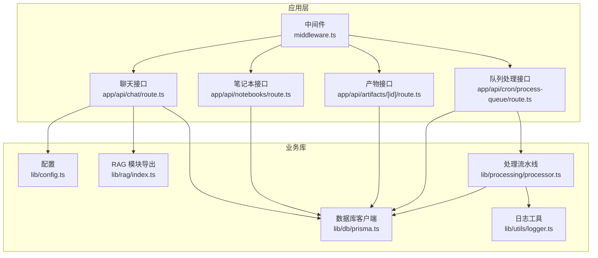
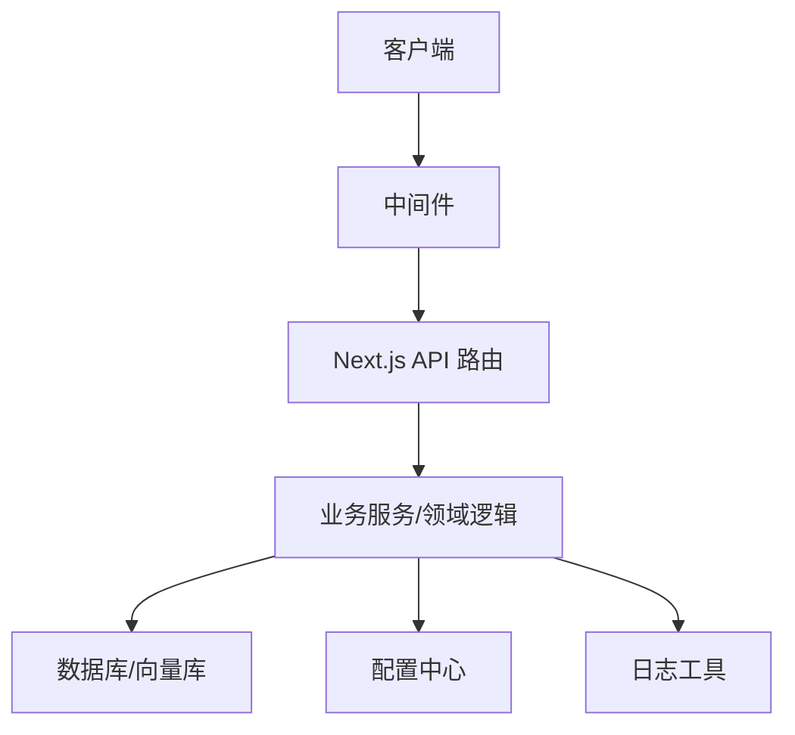
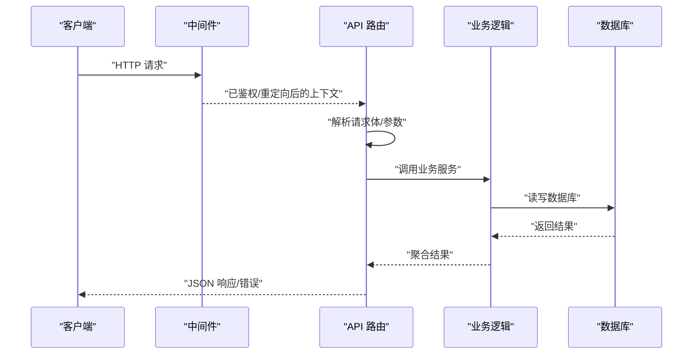
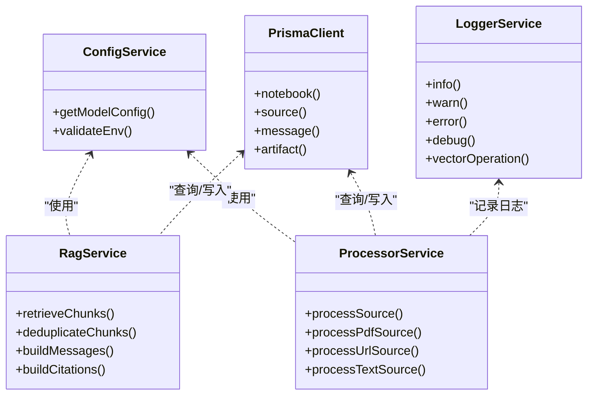
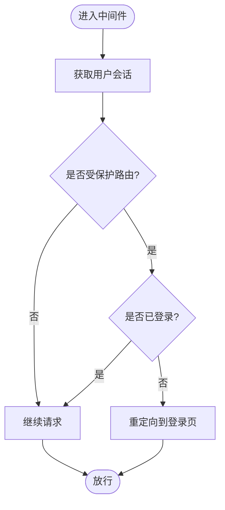
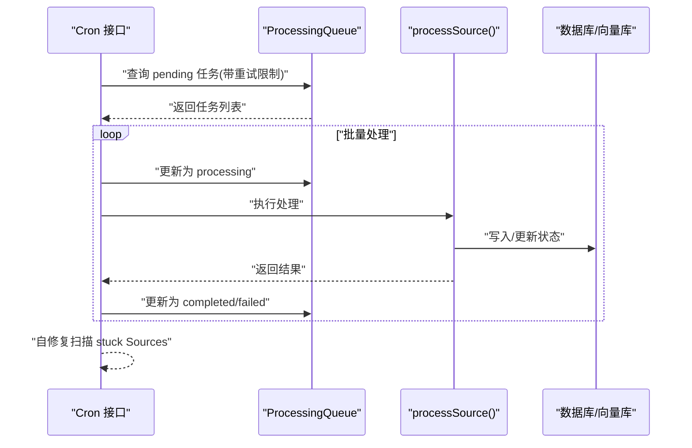
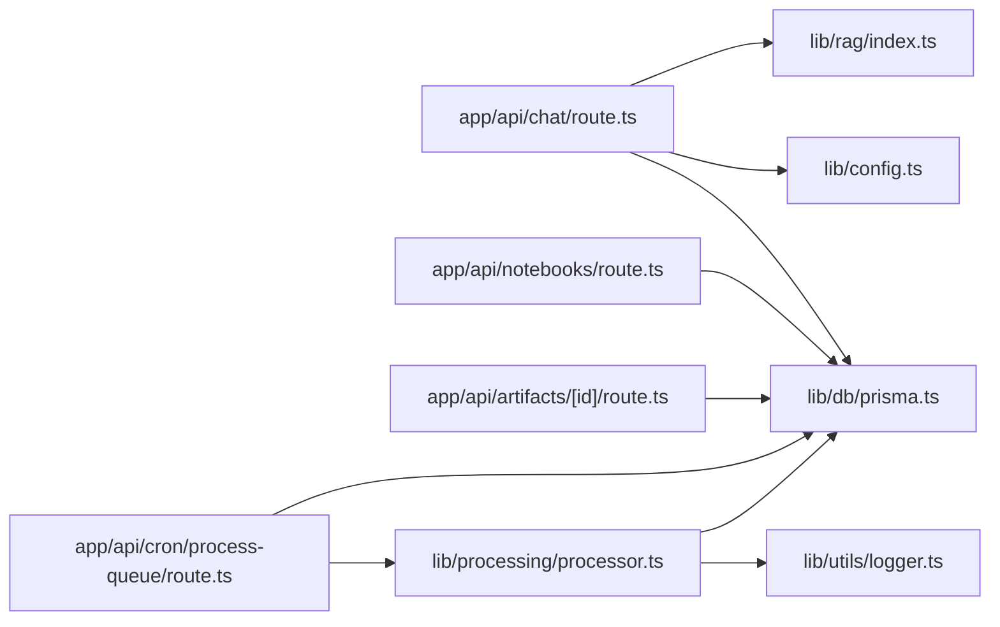

# 后端架构

<cite>
**本文引用的文件**
- [app/api/chat/route.ts](file://app/api/chat/route.ts)
- [app/api/notebooks/route.ts](file://app/api/notebooks/route.ts)
- [app/api/artifacts/[id]/route.ts](file://app/api/artifacts/[id]/route.ts)
- [app/api/cron/process-queue/route.ts](file://app/api/cron/process-queue/route.ts)
- [middleware.ts](file://middleware.ts)
- [lib/db/prisma.ts](file://lib/db/prisma.ts)
- [lib/config.ts](file://lib/config.ts)
- [lib/rag/index.ts](file://lib/rag/index.ts)
- [lib/processing/processor.ts](file://lib/processing/processor.ts)
- [lib/utils/logger.ts](file://lib/utils/logger.ts)
- [package.json](file://package.json)
- [next.config.js](file://next.config.js)
</cite>

## 目录
1. [引言](#引言)
2. [项目结构](#项目结构)
3. [核心组件](#核心组件)
4. [架构总览](#架构总览)
5. [详细组件分析](#详细组件分析)
6. [依赖关系分析](#依赖关系分析)
7. [性能考量](#性能考量)
8. [故障排查指南](#故障排查指南)
9. [结论](#结论)
10. [附录](#附录)

## 引言
本文件面向 notebookLM-clone 项目的后端架构设计，聚焦于基于 Next.js API 路由的后端实现。文档覆盖路由组织结构、请求处理流程与响应格式标准化；业务逻辑层的服务类职责划分、依赖注入与错误处理；中间件系统（认证、CORS 与请求预处理）；异步任务处理架构、队列管理与后台作业调度；API 版本控制、参数验证与安全防护；以及性能监控、日志记录与调试工具的集成方案。最后给出微服务化考虑、模块化设计与可测试性架构建议。

## 项目结构
后端以 Next.js App Router 的 app/api 目录为核心，按功能域组织路由，典型结构如下：
- API 路由：按资源与动作划分，如聊天、笔记本、产物、来源、模板、定时任务等
- 业务库：lib 下按领域拆分，如数据库访问、RAG、处理流水线、配置、工具
- 中间件：统一的路由保护与会话刷新
- 配置与运行时：next.config.js、package.json 等

图表来源
- [middleware.ts](file://middleware.ts#L1-L78)
- [app/api/chat/route.ts](file://app/api/chat/route.ts#L1-L324)
- [app/api/notebooks/route.ts](file://app/api/notebooks/route.ts#L1-L67)
- [app/api/artifacts/[id]/route.ts](file://app/api/artifacts/[id]/route.ts#L1-L141)
- [app/api/cron/process-queue/route.ts](file://app/api/cron/process-queue/route.ts#L1-L165)
- [lib/config.ts](file://lib/config.ts#L1-L187)
- [lib/db/prisma.ts](file://lib/db/prisma.ts#L1-L41)
- [lib/rag/index.ts](file://lib/rag/index.ts#L1-L24)
- [lib/processing/processor.ts](file://lib/processing/processor.ts#L1-L560)
- [lib/utils/logger.ts](file://lib/utils/logger.ts#L1-L98)

章节来源
- [middleware.ts](file://middleware.ts#L1-L78)
- [app/api/chat/route.ts](file://app/api/chat/route.ts#L1-L324)
- [app/api/notebooks/route.ts](file://app/api/notebooks/route.ts#L1-L67)
- [app/api/artifacts/[id]/route.ts](file://app/api/artifacts/[id]/route.ts#L1-L141)
- [app/api/cron/process-queue/route.ts](file://app/api/cron/process-queue/route.ts#L1-L165)
- [lib/config.ts](file://lib/config.ts#L1-L187)
- [lib/db/prisma.ts](file://lib/db/prisma.ts#L1-L41)
- [lib/rag/index.ts](file://lib/rag/index.ts#L1-L24)
- [lib/processing/processor.ts](file://lib/processing/processor.ts#L1-L560)
- [lib/utils/logger.ts](file://lib/utils/logger.ts#L1-L98)

## 核心组件
- 中间件：统一进行路由保护、会话刷新与重定向
- 数据库客户端：基于 Prisma + Postgres Pool，适配 Serverless
- 配置中心：模型提供商、环境变量与应用参数
- RAG 模块：检索、去重、提示词构造与引用构建
- 文档处理流水线：PDF/URL/文本三类来源的分阶段处理与向量化
- 日志工具：统一日志输出与向量操作日志结构

章节来源
- [middleware.ts](file://middleware.ts#L1-L78)
- [lib/db/prisma.ts](file://lib/db/prisma.ts#L1-L41)
- [lib/config.ts](file://lib/config.ts#L1-L187)
- [lib/rag/index.ts](file://lib/rag/index.ts#L1-L24)
- [lib/processing/processor.ts](file://lib/processing/processor.ts#L1-L560)
- [lib/utils/logger.ts](file://lib/utils/logger.ts#L1-L98)

## 架构总览
后端采用“API 路由 + 业务库”的分层架构：
- API 层负责请求解析、鉴权与响应格式标准化
- 业务库层封装领域逻辑（RAG、处理流水线、配置、日志）
- 数据访问通过 Prisma 客户端统一管理
- 中间件在进入 API 之前统一处理会话与路由保护

图表来源
- [middleware.ts](file://middleware.ts#L1-L78)
- [app/api/chat/route.ts](file://app/api/chat/route.ts#L1-L324)
- [lib/config.ts](file://lib/config.ts#L1-L187)
- [lib/db/prisma.ts](file://lib/db/prisma.ts#L1-L41)
- [lib/utils/logger.ts](file://lib/utils/logger.ts#L1-L98)

## 详细组件分析

### 路由组织与请求处理流程
- 路由组织：按资源与动作划分，如 /api/chat、/api/notebooks、/api/artifacts/[id]、/api/cron/process-queue
- 请求处理：统一进行鉴权、参数解析、业务校验与响应包装
- 响应格式：JSON 标准化，错误时返回 { error: string } 与合适的状态码

图表来源
- [middleware.ts](file://middleware.ts#L1-L78)
- [app/api/notebooks/route.ts](file://app/api/notebooks/route.ts#L1-L67)
- [app/api/artifacts/[id]/route.ts](file://app/api/artifacts/[id]/route.ts#L1-L141)
- [app/api/cron/process-queue/route.ts](file://app/api/cron/process-queue/route.ts#L1-L165)

章节来源
- [app/api/notebooks/route.ts](file://app/api/notebooks/route.ts#L1-L67)
- [app/api/artifacts/[id]/route.ts](file://app/api/artifacts/[id]/route.ts#L1-L141)
- [app/api/cron/process-queue/route.ts](file://app/api/cron/process-queue/route.ts#L1-L165)

### 业务逻辑层设计模式
- 服务类职责划分
  - 配置服务：模型提供商、应用参数与环境校验
  - 数据访问服务：Prisma 客户端封装
  - RAG 服务：检索、去重、提示词与引用
  - 处理流水线服务：PDF/URL/文本三类来源的分阶段处理
  - 日志服务：统一日志输出与向量操作日志结构
- 依赖注入：通过导入方式注入（如 prisma、config、rag、processor），便于测试替换
- 错误处理：统一 try/catch 包裹，捕获异常并返回标准化错误响应

图表来源
- [lib/config.ts](file://lib/config.ts#L1-L187)
- [lib/db/prisma.ts](file://lib/db/prisma.ts#L1-L41)
- [lib/rag/index.ts](file://lib/rag/index.ts#L1-L24)
- [lib/processing/processor.ts](file://lib/processing/processor.ts#L1-L560)
- [lib/utils/logger.ts](file://lib/utils/logger.ts#L1-L98)

章节来源
- [lib/config.ts](file://lib/config.ts#L1-L187)
- [lib/db/prisma.ts](file://lib/db/prisma.ts#L1-L41)
- [lib/rag/index.ts](file://lib/rag/index.ts#L1-L24)
- [lib/processing/processor.ts](file://lib/processing/processor.ts#L1-L560)
- [lib/utils/logger.ts](file://lib/utils/logger.ts#L1-L98)

### 中间件系统设计
- 路由保护：对受保护路由进行会话校验，未登录则重定向至登录页
- 登录态维护：通过 Supabase SSR 客户端刷新用户会话
- 认证路由保护：已登录用户禁止访问登录页
- 匹配器：排除静态资源与图片，仅对动态路由生效

图表来源
- [middleware.ts](file://middleware.ts#L1-L78)

章节来源
- [middleware.ts](file://middleware.ts#L1-L78)

### 异步任务处理架构与队列管理
- 队列驱动：ProcessingQueue 表记录待处理任务，支持优先级与重试
- Cron 接口：/api/cron/process-queue 拉取队列任务并执行
- 批处理策略：限制批次大小，避免 Serverless 超时
- 自修复机制：扫描状态为 pending 但不在队列中的 Source，自动补入队列并处理
- 失败处理：记录错误信息与重试次数，超过阈值更新 Source 状态为 failed

图表来源
- [app/api/cron/process-queue/route.ts](file://app/api/cron/process-queue/route.ts#L1-L165)
- [lib/processing/processor.ts](file://lib/processing/processor.ts#L1-L560)

章节来源
- [app/api/cron/process-queue/route.ts](file://app/api/cron/process-queue/route.ts#L1-L165)
- [lib/processing/processor.ts](file://lib/processing/processor.ts#L1-L560)

### API 版本控制、参数验证与安全防护
- 版本控制：当前路由未显式版本号，建议在路由前缀增加版本号（如 /api/v1/...）
- 参数验证：在 API 层进行基础校验（如必填字段、角色校验），复杂场景可引入 Zod
- 安全防护：
  - 认证：中间件与 Supabase 会话校验
  - 授权：资源所有权校验（如笔记本拥有者）
  - CORS：Next.js 默认行为，必要时可在 API 层设置响应头
  - 速率限制：建议在网关或边缘层实施
  - 机密：Cron 接口采用 Bearer Token 验证（需配合环境变量）

章节来源
- [app/api/chat/route.ts](file://app/api/chat/route.ts#L1-L324)
- [app/api/notebooks/route.ts](file://app/api/notebooks/route.ts#L1-L67)
- [app/api/artifacts/[id]/route.ts](file://app/api/artifacts/[id]/route.ts#L1-L141)
- [app/api/cron/process-queue/route.ts](file://app/api/cron/process-queue/route.ts#L1-L165)

### 性能监控、日志记录与调试
- 日志：统一 Logger 输出，区分级别；向量操作提供专门的日志结构
- 监控：建议接入 APM（如 New Relic、DataDog）或边缘日志分析
- 调试：开发环境输出详细日志，生产环境仅输出错误级别
- 数据库：Prisma + Postgres Pool，限制每实例连接数，避免并发峰值

章节来源
- [lib/utils/logger.ts](file://lib/utils/logger.ts#L1-L98)
- [lib/db/prisma.ts](file://lib/db/prisma.ts#L1-L41)

### 微服务化考虑、模块化设计与可测试性
- 微服务化：当前为单体后端，未来可按领域拆分为独立服务（如 RAG 服务、处理服务、队列服务）
- 模块化：lib 下按领域拆分，接口清晰，便于复用
- 可测试性：通过依赖注入（导入）与抽象接口，便于单元测试与模拟

章节来源
- [lib/config.ts](file://lib/config.ts#L1-L187)
- [lib/processing/processor.ts](file://lib/processing/processor.ts#L1-L560)

## 依赖关系分析

图表来源
- [app/api/chat/route.ts](file://app/api/chat/route.ts#L1-L324)
- [app/api/notebooks/route.ts](file://app/api/notebooks/route.ts#L1-L67)
- [app/api/artifacts/[id]/route.ts](file://app/api/artifacts/[id]/route.ts#L1-L141)
- [app/api/cron/process-queue/route.ts](file://app/api/cron/process-queue/route.ts#L1-L165)
- [lib/rag/index.ts](file://lib/rag/index.ts#L1-L24)
- [lib/config.ts](file://lib/config.ts#L1-L187)
- [lib/db/prisma.ts](file://lib/db/prisma.ts#L1-L41)
- [lib/processing/processor.ts](file://lib/processing/processor.ts#L1-L560)
- [lib/utils/logger.ts](file://lib/utils/logger.ts#L1-L98)

章节来源
- [app/api/chat/route.ts](file://app/api/chat/route.ts#L1-L324)
- [app/api/notebooks/route.ts](file://app/api/notebooks/route.ts#L1-L67)
- [app/api/artifacts/[id]/route.ts](file://app/api/artifacts/[id]/route.ts#L1-L141)
- [app/api/cron/process-queue/route.ts](file://app/api/cron/process-queue/route.ts#L1-L165)
- [lib/rag/index.ts](file://lib/rag/index.ts#L1-L24)
- [lib/config.ts](file://lib/config.ts#L1-L187)
- [lib/db/prisma.ts](file://lib/db/prisma.ts#L1-L41)
- [lib/processing/processor.ts](file://lib/processing/processor.ts#L1-L560)
- [lib/utils/logger.ts](file://lib/utils/logger.ts#L1-L98)

## 性能考量
- 并行化：API 层广泛使用 Promise.all 并行获取用户 ID 与请求体、保存消息与检索
- Serverless 限制：Vercel 函数时长限制，队列批处理与 Cron 接口需谨慎设计
- 数据库连接：每实例仅 1 个连接，避免并发峰值
- 向量检索：混合检索与去重策略降低无关内容影响
- 流式响应：聊天接口使用 SSE，提升用户体验与首字节时间

章节来源
- [app/api/chat/route.ts](file://app/api/chat/route.ts#L1-L324)
- [lib/db/prisma.ts](file://lib/db/prisma.ts#L1-L41)
- [lib/rag/index.ts](file://lib/rag/index.ts#L1-L24)

## 故障排查指南
- 常见错误
  - 未登录：返回 401，检查中间件与 Supabase 会话
  - 权限不足：返回 403，检查资源所有权
  - 参数缺失：返回 400，检查请求体与必填字段
  - 服务器错误：返回 500，查看日志定位异常
- 日志定位
  - 开启开发环境日志，关注向量操作日志与处理流水线日志
  - 关注 Cron 接口的队列状态与错误信息
- 数据库与向量
  - 检查 ProcessingQueue 与 Source 状态一致性
  - 确认嵌入维度与数据库一致

章节来源
- [middleware.ts](file://middleware.ts#L1-L78)
- [app/api/chat/route.ts](file://app/api/chat/route.ts#L1-L324)
- [app/api/notebooks/route.ts](file://app/api/notebooks/route.ts#L1-L67)
- [app/api/artifacts/[id]/route.ts](file://app/api/artifacts/[id]/route.ts#L1-L141)
- [app/api/cron/process-queue/route.ts](file://app/api/cron/process-queue/route.ts#L1-L165)
- [lib/utils/logger.ts](file://lib/utils/logger.ts#L1-L98)

## 结论
本项目后端以 Next.js API 路由为核心，结合中间件、配置中心、RAG 与处理流水线，形成清晰的分层架构。通过并行化、批处理与流式响应优化性能；通过统一日志与错误处理提升可观测性与稳定性。建议后续引入参数校验框架、版本化路由与速率限制，并在条件成熟时推进微服务化与可观测性平台集成。

## 附录
- 运行配置：Next.js 14，Postgres + Prisma，Supabase 存储与认证
- 关键依赖：Prisma、Supabase、LangChain、OpenAI 兼容 SDK

章节来源
- [package.json](file://package.json#L1-L82)
- [next.config.js](file://next.config.js#L1-L21)