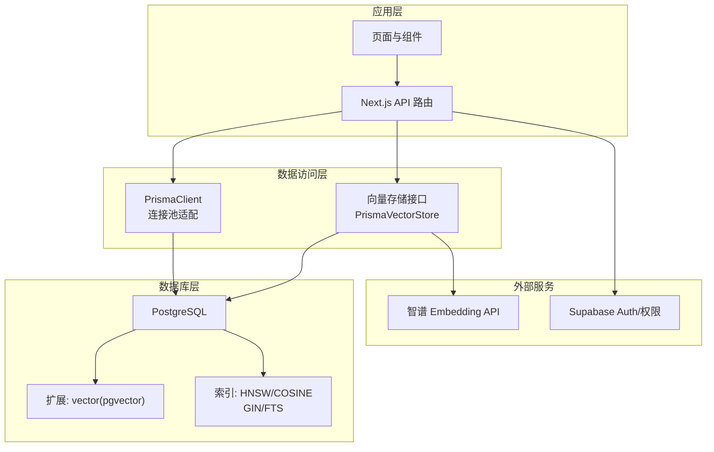
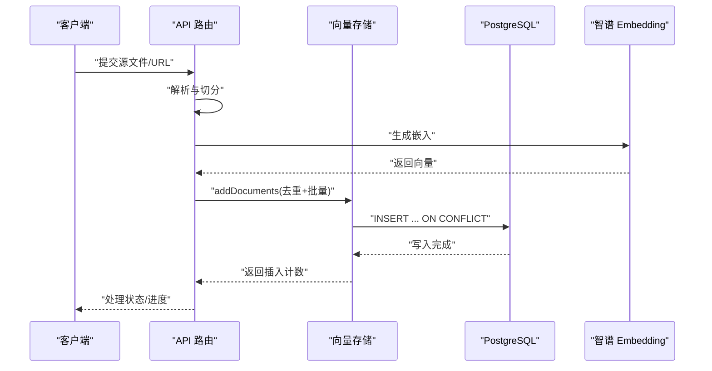
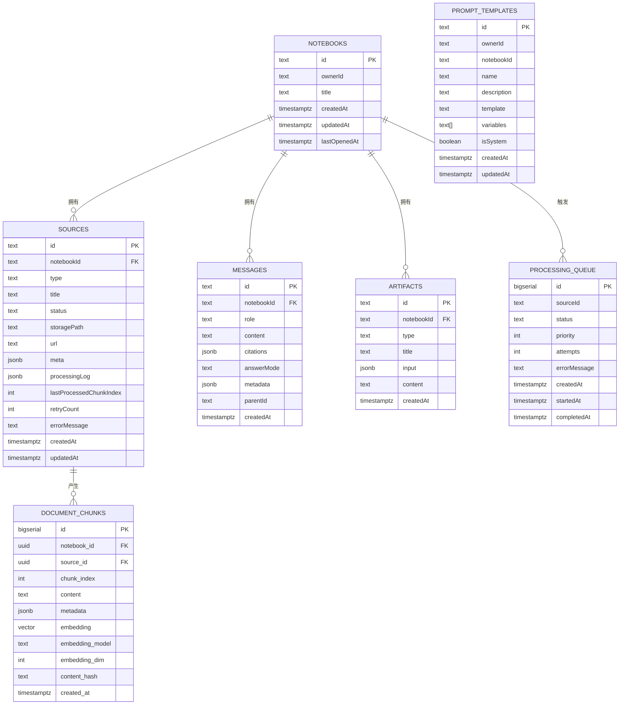
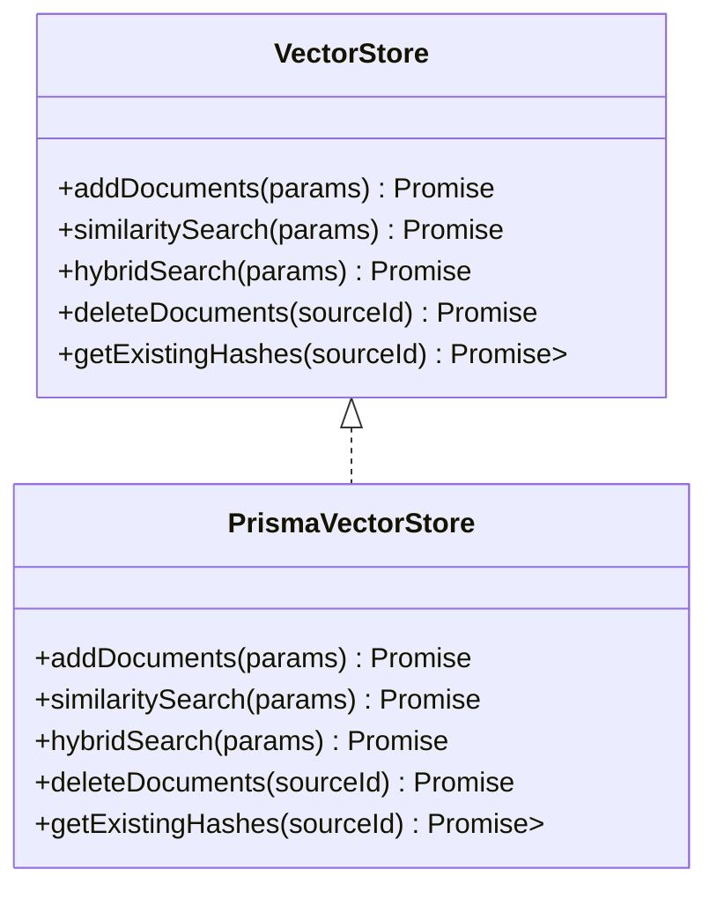
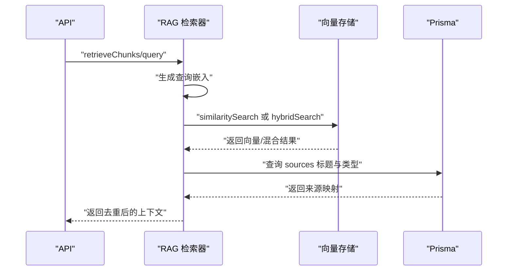
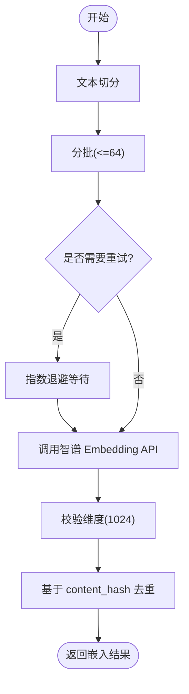
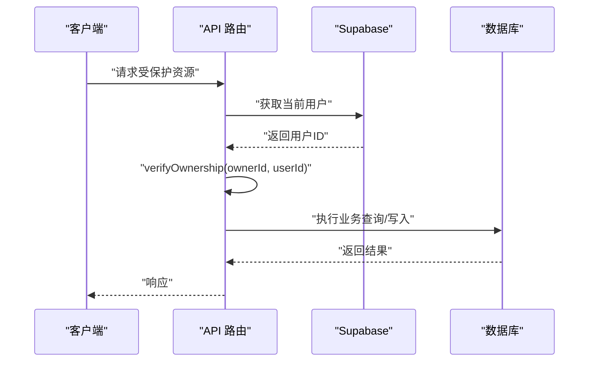
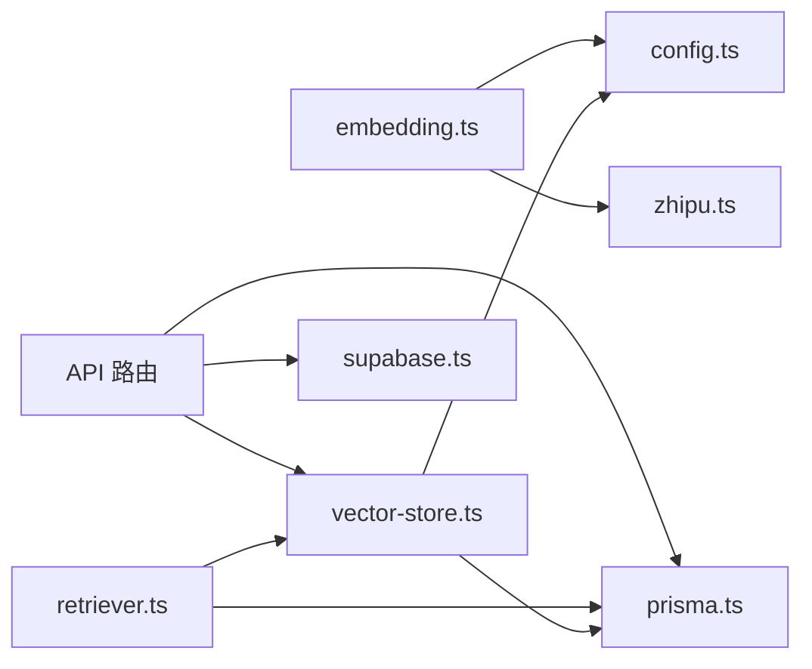

# 数据架构

<cite>
**本文引用的文件**
- [prisma.config.ts](file://prisma.config.ts)
- [lib/db/prisma.ts](file://lib/db/prisma.ts)
- [lib/db/vector-store.ts](file://lib/db/vector-store.ts)
- [lib/db/supabase.ts](file://lib/db/supabase.ts)
- [lib/config.ts](file://lib/config.ts)
- [prisma/migrations/00000000000000_init_vector/migration.sql](file://prisma/migrations/00000000000000_init_vector/migration.sql)
- [prisma/migrations/20241223_create_vector_table/migration.sql](file://prisma/migrations/20241223_create_vector_table/migration.sql)
- [prisma/migrations/20260120042257_sync_schema_changes/migration.sql](file://prisma/migrations/20260120042257_sync_schema_changes/migration.sql)
- [prisma/migrations/20260120050505_add_content_tsv/migration.sql](file://prisma/migrations/20260120050505_add_content_tsv/migration.sql)
- [prisma/migrations/20260120120200_optimize_hnsw_index/migration.sql](file://prisma/migrations/20260120120200_optimize_hnsw_index/migration.sql)
- [lib/rag/retriever.ts](file://lib/rag/retriever.ts)
- [lib/processing/embedding.ts](file://lib/processing/embedding.ts)
- [lib/utils/logger.ts](file://lib/utils/logger.ts)
- [package.json](file://package.json)
- [next.config.js](file://next.config.js)
- [tsconfig.json](file://tsconfig.json)
</cite>

## 目录
1. [简介](#简介)
2. [项目结构](#项目结构)
3. [核心组件](#核心组件)
4. [架构总览](#架构总览)
5. [详细组件分析](#详细组件分析)
6. [依赖分析](#依赖分析)
7. [性能考虑](#性能考虑)
8. [故障排查指南](#故障排查指南)
9. [结论](#结论)
10. [附录](#附录)

## 简介
本文件面向 notebookLM-clone 项目，系统化阐述数据架构设计，重点覆盖：
- 关系型数据库与向量数据库的集成架构
- 数据模型设计原则、实体关系映射与数据访问层抽象
- 向量存储的特殊设计（嵌入、相似度计算、索引优化）
- 数据一致性、事务与并发控制
- 数据迁移策略、版本管理与备份恢复
- 数据安全、访问控制与隐私保护
- 缓存策略、查询优化与性能调优
- 数据监控、统计分析与容量规划

## 项目结构
项目采用 Next.js 14 + TypeScript，数据层由 PostgreSQL + Prisma ORM + pgvector 组成，并通过 Supabase 提供鉴权与权限校验。

图表来源
- [lib/db/prisma.ts](file://lib/db/prisma.ts#L1-L41)
- [lib/db/vector-store.ts](file://lib/db/vector-store.ts#L1-L446)
- [lib/db/supabase.ts](file://lib/db/supabase.ts#L1-L39)
- [lib/processing/embedding.ts](file://lib/processing/embedding.ts#L1-L189)
- [prisma/migrations/00000000000000_init_vector/migration.sql](file://prisma/migrations/00000000000000_init_vector/migration.sql#L1-L65)

章节来源
- [package.json](file://package.json#L1-L82)
- [next.config.js](file://next.config.js#L1-L21)
- [tsconfig.json](file://tsconfig.json#L1-L28)

## 核心组件
- 数据库与ORM
  - Prisma 配置与连接池：通过 @prisma/adapter-pg 将 PrismaClient 与 pg Pool 绑定，支持 Serverless 场景下的连接复用与限制。
  - 数据库 URL 与迁移：通过 prisma.config.ts 指定 schema 与迁移目录，并从环境变量读取 DIRECT_URL。
- 向量存储
  - 抽象接口 VectorStore 与实现 PrismaVectorStore，统一提供 addDocuments、similaritySearch、hybridSearch、deleteDocuments、getExistingHashes 等能力。
  - 向量维度严格校验（固定 1024 维），确保与数据库 vector(1024) 一致。
- 检索与嵌入
  - RAG 检索器封装向量与混合检索流程；嵌入生成器对接智谱 Embedding API，内置指数退避重试与分批处理。
- 权限与安全
  - Supabase 工具函数提供当前用户 ID 获取与资源所有权验证，所有 API 必须进行 verifyOwnership 校验。
- 日志与可观测性
  - 统一日志工具提供向量操作日志记录，便于性能与异常追踪。

章节来源
- [lib/db/prisma.ts](file://lib/db/prisma.ts#L1-L41)
- [prisma.config.ts](file://prisma.config.ts#L1-L20)
- [lib/db/vector-store.ts](file://lib/db/vector-store.ts#L1-L446)
- [lib/rag/retriever.ts](file://lib/rag/retriever.ts#L1-L206)
- [lib/processing/embedding.ts](file://lib/processing/embedding.ts#L1-L189)
- [lib/db/supabase.ts](file://lib/db/supabase.ts#L1-L39)
- [lib/utils/logger.ts](file://lib/utils/logger.ts#L1-L98)

## 架构总览
整体数据流分为“写入链路”和“检索链路”：
- 写入链路：解析源内容 → 文本切分 → 嵌入生成 → 去重校验 → 批量写入向量表 → 建立索引。
- 检索链路：查询文本 → 嵌入生成 → 向量相似度或混合检索 → 关联元数据与来源信息 → 返回上下文。

图表来源
- [lib/processing/embedding.ts](file://lib/processing/embedding.ts#L140-L189)
- [lib/db/vector-store.ts](file://lib/db/vector-store.ts#L77-L173)

## 详细组件分析

### 数据模型与实体关系
- 核心表与字段
  - document_chunks：存储向量、文本、元数据、哈希、模型与维度等，主键自增 id，notebook_id/source_id 外键关联笔记本与来源。
  - 其余业务表：notebooks、sources、messages、artifacts、prompt_templates、processing_queue。
- 索引与扩展
  - vector 扩展启用；HNSW 索引使用 COSINE 距离；全文检索列 content_tsv 与 GIN 索引；复合索引覆盖常用查询场景。
- 约束与迁移
  - 迁移文件确保表结构、索引与函数的一致性；同步业务表结构与外键关系。

图表来源
- [prisma/migrations/20260120042257_sync_schema_changes/migration.sql](file://prisma/migrations/20260120042257_sync_schema_changes/migration.sql#L11-L146)
- [prisma/migrations/00000000000000_init_vector/migration.sql](file://prisma/migrations/00000000000000_init_vector/migration.sql#L4-L30)

章节来源
- [prisma/migrations/20260120042257_sync_schema_changes/migration.sql](file://prisma/migrations/20260120042257_sync_schema_changes/migration.sql#L11-L146)
- [prisma/migrations/20260120050505_add_content_tsv/migration.sql](file://prisma/migrations/20260120050505_add_content_tsv/migration.sql#L1-L7)
- [prisma/migrations/20260120120200_optimize_hnsw_index/migration.sql](file://prisma/migrations/20260120120200_optimize_hnsw_index/migration.sql#L1-L16)

### 向量存储与检索
- 接口与实现
  - VectorStore 抽象定义了文档写入、相似度搜索、混合检索、删除与去重查询等方法。
  - PrismaVectorStore 使用原生 SQL 批量插入、CTE 计算相似度、LEFT JOIN 计算混合分数，避免重复计算与 N+1 查询。
- 维度与一致性
  - EMBEDDING_DIM 固定为 1024，与数据库 vector(1024) 保持一致；启动时进行维度校验，防止运行期不一致。
- 检索策略
  - 向量相似度：使用 1 - (embedding <=> query) 计算余弦相似度，支持阈值过滤与 topK 限制。
  - 混合检索：结合向量相似度与全文检索（ts_rank + plainto_tsquery），按权重合并得分。
- 性能优化
  - HNSW 索引参数优化（m=32, ef_construction=128），提升召回率与查询性能。
  - GIN 索引加速全文检索；索引覆盖 notebook_id/source_id/content_hash 等高频过滤字段。

图表来源
- [lib/db/vector-store.ts](file://lib/db/vector-store.ts#L24-L75)
- [lib/db/vector-store.ts](file://lib/db/vector-store.ts#L77-L443)

章节来源
- [lib/db/vector-store.ts](file://lib/db/vector-store.ts#L1-L446)
- [lib/config.ts](file://lib/config.ts#L6-L29)
- [prisma/migrations/00000000000000_init_vector/migration.sql](file://prisma/migrations/00000000000000_init_vector/migration.sql#L13-L24)
- [prisma/migrations/20260120120200_optimize_hnsw_index/migration.sql](file://prisma/migrations/20260120120200_optimize_hnsw_index/migration.sql#L10-L12)

### 检索流程与混合检索
- 流程概览
  - 输入查询 → 生成嵌入 → 向量相似度或混合检索 → 关联来源标题与类型 → 返回带证据的上下文。
- 混合检索细节
  - 向量分数与 FTS 分数分别计算，按权重合并；支持按 sourceIds 过滤与阈值控制。
- 去重与上下文
  - 检索结果按 chunk id 去重；根据 sourceIds 查询来源标题与类型，增强可读性。

图表来源
- [lib/rag/retriever.ts](file://lib/rag/retriever.ts#L53-L116)
- [lib/rag/retriever.ts](file://lib/rag/retriever.ts#L131-L206)
- [lib/db/vector-store.ts](file://lib/db/vector-store.ts#L175-L297)
- [lib/db/vector-store.ts](file://lib/db/vector-store.ts#L312-L442)

章节来源
- [lib/rag/retriever.ts](file://lib/rag/retriever.ts#L1-L206)

### 嵌入生成与重试
- 批量与重试
  - 最大批长 64，按批调用智谱 Embedding API；内置指数退避重试（429/500/502/503/504）。
- 维度校验
  - 请求时指定 dimensions=1024；响应中再次校验维度一致性。
- 去重优化
  - 基于 content_hash 过滤已存在 chunk，减少重复写入与 API 调用。

图表来源
- [lib/processing/embedding.ts](file://lib/processing/embedding.ts#L140-L189)
- [lib/processing/embedding.ts](file://lib/processing/embedding.ts#L72-L110)

章节来源
- [lib/processing/embedding.ts](file://lib/processing/embedding.ts#L1-L189)

### 数据访问层抽象与权限控制
- 数据访问层
  - PrismaClient 通过连接池适配器统一管理连接；对向量表使用原生 SQL 优化写入与查询。
- 权限控制
  - Supabase 工具函数提供当前用户 ID 获取与 verifyOwnership 校验，所有 API 必须校验资源归属。
- 安全与合规
  - 通过 Supabase Auth 保障用户身份；对敏感环境变量进行启动校验，避免配置错误导致的安全问题。

图表来源
- [lib/db/supabase.ts](file://lib/db/supabase.ts#L12-L33)
- [lib/db/prisma.ts](file://lib/db/prisma.ts#L23-L39)

章节来源
- [lib/db/supabase.ts](file://lib/db/supabase.ts#L1-L39)
- [lib/config.ts](file://lib/config.ts#L169-L187)

## 依赖分析
- 外部依赖
  - Prisma 7 + @prisma/adapter-pg：ORM 与 Postgres 连接池适配。
  - pgvector：PostgreSQL 向量扩展，提供向量类型与索引。
  - Supabase：认证与权限校验。
  - 智谱 AI：Embedding 与对话模型。
- 内部模块耦合
  - vector-store 依赖 prisma 与 config；retriever 依赖 vector-store 与 prisma；embedding 依赖 config 与 zhipu。
  - 权限校验贯穿 API 层，确保资源隔离。

图表来源
- [lib/db/vector-store.ts](file://lib/db/vector-store.ts#L1-L446)
- [lib/rag/retriever.ts](file://lib/rag/retriever.ts#L1-L206)
- [lib/processing/embedding.ts](file://lib/processing/embedding.ts#L1-L189)
- [lib/db/supabase.ts](file://lib/db/supabase.ts#L1-L39)
- [lib/db/prisma.ts](file://lib/db/prisma.ts#L1-L41)
- [lib/config.ts](file://lib/config.ts#L1-L187)

章节来源
- [package.json](file://package.json#L17-L64)

## 性能考虑
- 向量索引优化
  - HNSW 使用 COSINE 距离，参数 m=32、ef_construction=128，提升召回率与稳定性。
  - GIN 索引加速全文检索；复合索引覆盖 notebook_id/source_id/content_hash。
- 写入性能
  - 批量插入（每批≤500），使用 ON CONFLICT (source_id, chunk_index) DO NOTHING 避免重复写入。
  - 原生 SQL 减少 ORM 开销，提升吞吐。
- 查询性能
  - CTE 计算相似度，避免重复计算；LEFT JOIN 合并 FTS 分数；阈值过滤与 topK 限制。
- 连接池与并发
  - Serverless 环境下限制每个实例连接数（connection_limit=1），配合 pgbouncer=true。
- 嵌入与重试
  - 批长 64，指数退避重试，降低外部服务抖动影响。

章节来源
- [lib/db/vector-store.ts](file://lib/db/vector-store.ts#L105-L140)
- [lib/db/vector-store.ts](file://lib/db/vector-store.ts#L204-L252)
- [lib/db/vector-store.ts](file://lib/db/vector-store.ts#L363-L396)
- [lib/processing/embedding.ts](file://lib/processing/embedding.ts#L12-L26)
- [lib/processing/embedding.ts](file://lib/processing/embedding.ts#L115-L134)
- [lib/db/prisma.ts](file://lib/db/prisma.ts#L8-L16)
- [prisma/migrations/20260120120200_optimize_hnsw_index/migration.sql](file://prisma/migrations/20260120120200_optimize_hnsw_index/migration.sql#L8-L12)

## 故障排查指南
- 常见错误与定位
  - 向量维度不一致：启动时维度校验失败或运行期维度校验抛错，需检查 EMBEDDING_DIM 与数据库 vector(1024) 是否一致。
  - 连接池问题：Serverless 环境连接过多或超时，检查 DATABASE_URL 的 pgbouncer 与 connection_limit 配置。
  - 权限不足：verifyOwnership 抛错，确认 Supabase 用户登录态与资源归属。
- 观测与日志
  - 向量操作日志记录插入/查询/混合查询的耗时、成功与否与关键元数据，便于定位性能瓶颈与异常。
- 重试与降级
  - 智谱 Embedding API 重试策略自动处理临时错误；若持续失败，建议检查 API Key 与配额。

章节来源
- [lib/config.ts](file://lib/config.ts#L9-L29)
- [lib/utils/logger.ts](file://lib/utils/logger.ts#L75-L94)
- [lib/db/supabase.ts](file://lib/db/supabase.ts#L22-L33)
- [lib/processing/embedding.ts](file://lib/processing/embedding.ts#L115-L134)

## 结论
本数据架构以 PostgreSQL + Prisma + pgvector 为核心，结合 Supabase 权限体系与智谱 Embedding 能力，实现了高一致性、高性能与可扩展的笔记向量化检索系统。通过严格的维度校验、索引优化与批量写入策略，兼顾了吞吐与准确性；通过混合检索与去重机制，提升了检索质量与用户体验。配套的日志与权限控制为运维与安全提供了坚实基础。

## 附录

### 数据迁移与版本管理
- 迁移策略
  - 使用 Prisma SQL 迁移维护向量表结构与索引；业务表结构与外键关系通过同步迁移统一管理。
  - 新增列（如 content_tsv）与索引变更（HNSW 参数优化）均通过独立迁移文件逐步演进。
- 版本管理
  - 迁移文件命名包含时间戳与功能标识，确保可追溯与幂等。
- 备份与恢复
  - 建议结合 Supabase/托管 PostgreSQL 的备份策略，定期导出 schema 与数据，验证恢复流程。

章节来源
- [prisma/migrations/00000000000000_init_vector/migration.sql](file://prisma/migrations/00000000000000_init_vector/migration.sql#L1-L65)
- [prisma/migrations/20241223_create_vector_table/migration.sql](file://prisma/migrations/20241223_create_vector_table/migration.sql#L1-L65)
- [prisma/migrations/20260120042257_sync_schema_changes/migration.sql](file://prisma/migrations/20260120042257_sync_schema_changes/migration.sql#L1-L146)
- [prisma/migrations/20260120050505_add_content_tsv/migration.sql](file://prisma/migrations/20260120050505_add_content_tsv/migration.sql#L1-L7)
- [prisma/migrations/20260120120200_optimize_hnsw_index/migration.sql](file://prisma/migrations/20260120120200_optimize_hnsw_index/migration.sql#L1-L16)

### 数据安全与隐私
- 认证与授权
  - 使用 Supabase Auth 获取用户身份，verifyOwnership 强制资源归属校验。
- 环境变量与配置
  - 启动时校验必需环境变量，避免因缺失导致的未授权访问或异常行为。
- 数据最小化
  - 仅存储必要的向量、元数据与来源信息；全文检索列 content_tsv 仅用于检索，不暴露敏感内容。

章节来源
- [lib/db/supabase.ts](file://lib/db/supabase.ts#L12-L33)
- [lib/config.ts](file://lib/config.ts#L169-L187)

### 缓存策略与查询优化
- 缓存
  - 当前未发现应用层缓存实现；建议在 API 层引入短期缓存（如 Redis）缓存热门查询的检索结果，降低数据库压力。
- 查询优化
  - 使用 HNSW/COSINE、GIN/FTS、复合索引与阈值过滤；避免 N+1 查询，优先使用 JOIN 与 CTE。
- 性能调优
  - 根据业务峰值调整连接池大小与 HNSW 参数；监控向量操作日志，识别慢查询与异常。

章节来源
- [lib/db/vector-store.ts](file://lib/db/vector-store.ts#L204-L252)
- [lib/db/vector-store.ts](file://lib/db/vector-store.ts#L363-L396)
- [lib/utils/logger.ts](file://lib/utils/logger.ts#L75-L94)

### 监控、统计与容量规划
- 监控指标
  - 向量写入/查询耗时、成功率、插入/跳过数量、平均相似度、FTS 分数分布。
- 统计分析
  - 基于日志统计检索命中率、Top-K 命中分布、不同来源的贡献比例，指导索引与权重优化。
- 容量规划
  - 依据向量维度（1024）、每条记录的 embedding 字段大小与索引开销，评估存储与内存占用；结合业务增长预测扩容。

章节来源
- [lib/utils/logger.ts](file://lib/utils/logger.ts#L11-L27)
- [lib/db/vector-store.ts](file://lib/db/vector-store.ts#L143-L154)
- [lib/db/vector-store.ts](file://lib/db/vector-store.ts#L268-L279)